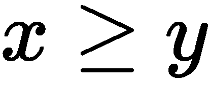

# 传输和共享对象

我们将详细介绍在[第 10 章](10.html)中开始的对象表示的序列化技术，*序列化和保存–JSON、YAML、Pickle、CSV 和 XML*。当我们需要传输对象时，我们执行某种形式的**表示状态传输**（**REST**，其中包括序列化对象状态的表示。然后可以将此表示转移到另一个进程（通常在另一台主机上）；然后，接收进程可以根据状态表示和类定义的本地副本构建原始对象的版本。

将 REST 处理分解为表示和传输两个方面，可以让我们独立地解决这些问题。有各种各样的解决方案，将导致许多可行的组合。我们将限制自己使用两种流行的机制：RESTfulWeb 服务和多处理队列。两者都将在进程之间序列化和传输对象。

对于基于 web 的传输，我们将利用**超文本传输协议**（**HTTP**）。这允许我们基于`POST`、`GET`、`PATCH`、`PUT`和`DELETE`的 HTTP 方法实现**创建检索更新删除**（**CRUD**处理操作。我们可以使用它来构建 RESTful web 服务。Python 的**Web 服务网关接口**（**WSGI**标准）定义了 Web 服务的通用模式。任何实际应用程序都将使用实现 WSGI 标准的可用 web 框架之一。RESTful web 服务通常使用对象状态的 JSON 表示。

除了 HTTP，我们还将研究同一主机上进程之间的本地传输。这可以使用`multiprocessing`模块提供的本地消息队列更有效地完成。有许多复杂的第三方队列管理产品。我们将重点介绍 Python 标准库产品。

在使用 RESTful 传输时，还有一个额外的考虑事项：向服务器提供数据的客户端可能不可信。为了解决这个问题，我们必须在可能存在不可信数据的情况下实现一些安全性。对于某些表示，特别是 JSON，安全性考虑很少。YAML 引入了安全问题并支持安全负载操作；更多信息，请参见[第 10 章](10.html)、*序列化和保存–JSON、YAML、Pickle、CSV 和 XML*。由于这个安全问题，`pickle`模块还提供了一个受限制的取消勾选器，可以信任它不会导入异常模块并执行破坏性代码。

在本章中，我们将介绍以下主题：

*   类、状态和表示
*   使用 HTTP 和 REST 传输对象
*   使用 Flask 构建 RESTful web 服务
*   处理有状态 REST 服务
*   创建安全的 RESTful 服务
*   用 web 应用程序框架实现 REST
*   使用消息队列传输对象

# 技术要求

本章的代码文件可在[上找到 https://git.io/fj2U6](https://git.io/fj2U6) 。

# 类、状态和表示

许多应用程序可以分解为由服务器和客户端完成的处理。一台服务器将与多个远程客户端交换数据。在混合情况下，应用程序既可以是其他远程计算机的客户端，也可以是远程客户端的服务器。有一种有意的不对称性被用来简化协议的定义：客户机向服务器发出请求，服务器响应客户机。客户端启动每个请求并等待响应。

分离客户端和服务器意味着必须在这两个进程之间传输对象。我们可以将较大的问题分解为两个较小的问题。互连协议定义了一种将字节从一台主机上的进程传输到另一台主机上的进程的方法。序列化技术将我们的对象转换为字节，然后从对象中重构字节。在设计类时，它有助于关注对象**状态**作为进程之间交换的内容。

与对象状态不同，我们通过完全独立的方法传输类定义。类定义的更改相对较慢，因此我们以 Python 源代码的形式通过类的定义来交换类定义。如果需要向远程主机提供类定义，可以在该主机上安装 Python 源代码。

如果客户机是用 Python 以外的语言编写的，则必须提供等效的类定义。例如，JavaScript 客户端将从服务器上 Python 对象的序列化 JSON 状态构造一个对象。通过共享一个共同的表示，两个对象将具有**相似的**状态。

我们在 Python 的工作内存中对整个工作对象和传输的对象状态表示进行了严格区分。整个 Python 对象包括 Python 运行时环境中的类、超类和其他关系。对象的状态可以由一个简单的字符串表示。考虑以下事项：

```py
 >>> from dataclasses import dataclass, asdict
        >>> import json

        >>> @dataclass
        ... class Greeting:
        ...     message: str

        >>> g = Greeting("Hello World")
        >>> text = json.dumps(asdict(g))
        >>> text
        '{"message": "Hello World"}'
        >>> text.encode('utf-8')    b'{"message": "Hello World"}'

```

此示例显示了一个简单的类定义`Greeting`，其中状态由单个属性值`message`表示。应用于`dataclass`实例的`asdict()`函数创建了一个我们可以用 JSON 符号序列化的字典。因为网络传输字节，所以使用`text.encode()`会产生字节流。这个小示例演示了数据类定义如何与该类示例实例的状态表示完全分离。

让我们看看如何使用 HTTP 和 REST 来传输对象。

# 使用 HTTP 和 REST 传输对象

HTTP 是通过一系列**征求意见**（**RFC**文件）定义的。我们将不回顾所有细节，但我们将触及三个要点。

HTTP 协议包括请求和回复。请求包括一个方法、一个**统一资源标识符**（**URI**）、一些头和可选附件。标准中定义了许多可用的方法。大多数浏览器关注于发出`GET`和`POST`请求。标准浏览器包括`GET`、`POST`、`PUT`和`DELETE`请求，我们将利用这些请求，因为它们对应于 CRUD 操作。我们将忽略大部分头，并将重点放在 URI 的路径部分。

HTTP 回复包括状态代码和原因文本，以及任何标题和附加数据。有多种状态代码。响应代码通常根据以下模式理解：

*   `1xx`代码是信息性的，在 RESTful 服务中没有广泛使用。
*   `2xx`的回复表明成功。
*   `3xx`状态代码表示将请求重定向到不同的主机或不同的 URI 路径。
*   `4xx`响应代码告知客户端请求错误，回复中应包含更详细的错误消息。
*   `5xx`代码通常表示服务器出现了某种问题。

在这些通用范围中，我们只对以下几个范围感兴趣：

*   `200`状态代码是来自服务器的通用`OK`响应。
*   `201`状态代码是`Created`响应，它可能用于向我们显示`POST`请求工作，并且成功创建了对象。
*   `204`状态代码为`No Content`响应，可能用于`DELETE`请求
*   `400`状态码是`Bad Request`响应，用于拒绝用于`POST`、`PUT`或`PATCH`对象的无效数据。
*   `401`状态码为`Unauthorized`；这将在安全环境中用于拒绝无效凭据。如果使用了有效的用户凭据，但用户没有执行其请求的操作的授权，则也可以使用它。
*   `404`状态码为`Not Found`，通常在 URI 路径信息未标识资源时使用

HTTP 被定义为无状态。服务器不需要回忆以前与客户机的交互。在某些情况下，这是一个严重的限制，有几种常用的变通方法可以通过与事务的客户端交换状态详细信息来管理状态。对于交互式网站，cookies 从服务器发送到客户端。客户端将 cookie 与请求一起嵌入到服务器中，允许服务器恢复事务状态并提供丰富、有状态的应用程序行为。

当 web 服务器通过 HTML 表单提供用户体验时，经常使用 cookie。通过将 Cookie 发送回浏览器，服务器可以跟踪用户登录和会话信息。当用户执行操作时，服务器会在会话对象中记录详细信息，这些对象被序列化为 Cookie

但是，对于 RESTful web 服务，客户端将不是坐在浏览器旁的人。RESTful 服务的客户端将是一个能够维护用户体验状态的应用程序。这意味着 RESTful 服务可以利用更简单、无状态的 HTTP，而无需 cookie。这也意味着**登录**和**注销**等状态不适用于 web 服务。出于身份验证目的，通常会随每个请求提供某种凭据。这规定了确保连接安全的义务。实际上，所有 RESTful web 服务器都将使用**安全套接字层**（**SSL**和 HTTPS 连接。

在下一节中，我们将了解如何通过 REST 实现 CRUD 操作。

# 通过 REST 实现 CRUD 操作

我们将了解 REST 协议背后的三个基本思想。第一个想法是使用对象状态的文本序列化。第二种是使用 HTTP 请求 URI 来命名对象；URI 可以包括任何级别的细节，包括统一格式的模式、模块、类和对象标识。最后，我们可以使用 HTTP 方法映射到 CRUD 规则，以定义对命名对象执行的操作。

将 HTTP 用于 RESTful 服务，打破了 HTTP 请求和回复的原始定义。这意味着一些请求和应答语义可以进行积极的、持续的讨论。我们将建议一种方法，而不是介绍所有的备选方案。我们的重点是 Python 语言，而不是设计 RESTful web 服务的更一般的问题。REST 服务器通常通过以下五个抽象用例支持 CRUD 操作：

*   **创建**：我们将使用 HTTP`POST`请求创建一个新对象和一个仅提供类信息的 URI。类似于`/app/blog/`的路径可能会命名该类。响应可能是一条`201`消息，其中包含最终保存的对象的副本。返回的对象信息可以包括 RESTful 服务器为新创建的对象分配的 URI 或用于构造 URI 的相关键。`POST`请求将通过创建新的内容来更改 RESTful 资源。
*   **检索–搜索**：这是一个可以检索多个对象的请求。我们将使用 HTTP`GET`请求和提供搜索条件的 URI，通常以`?`字符后的查询字符串的形式。URI 可能是`/app/blog/?title="Travel 2012-2013"`。请注意，`GET`从不更改任何 RESTful 资源的状态。
*   **检索–单实例**：这是对单个对象的请求。我们将使用一个 HTTP`GET`请求和一个在 URI 路径中命名特定对象的 URI。URI 可能是`/app/blog/id/`。虽然响应应该是单个对象，但它仍可能被包装在列表中，以使其与搜索响应兼容。由于此响应为`GET`，因此状态没有变化。
*   **更新**：我们将使用 HTTP`PUT`请求和标识要替换的对象的 URI。我们还可以使用 HTTP`PATCH`请求和文档负载，为对象提供增量更新。URI 可能是`/app/blog/id/`。响应可能是一条`200`消息，其中包含修改对象的副本
*   **删除**：我们将使用一个`HTTP DELETE`请求和一个类似`/app/blog/id/`的 URI。响应可以是一条简单的`204 NO CONTENT`消息，响应中没有任何对象细节。

由于 HTTP 协议是无状态的，因此没有登录和注销的规定。每个请求都必须单独进行身份验证。我们经常使用 HTTP`Authorization`头来提供用户名和密码凭证。在执行此操作时，我们绝对还必须使用 SSL 为`Authorization`头的内容提供安全性。还有更复杂的替代方案，它们利用单独的身份管理服务器来提供身份验证令牌，而不是凭据。

下一节将介绍如何实现非 CRUD 操作。

# 实施非积垢操作

某些应用程序将具有无法通过 CRUD 谓词轻松描述的操作。例如，我们可能有一个执行复杂计算的**远程过程调用**（**RPC**风格的应用程序。服务器上没有真正创建任何内容。我们可以将 RPC 看作是一个复杂的检索操作，其中计算的参数在每个请求中都提供。

大多数情况下，这些以计算为中心的操作可以作为`GET`请求来实现，其中服务器中对象的状态没有变化。RPC 样式的请求通常通过 HTTP`POST`方法实现。响应可以包括一个**通用唯一标识符**（**UUID**，作为跟踪请求和响应的一部分。它允许在响应非常复杂或需要很长时间计算的情况下缓存响应。HTTP 头，包括`ETag`和`If-None-Match`，可以用来和缓存交互以优化性能。

这是有道理的，因为作为不可否认方案的一部分，保留请求和应答的日志。这一点在服务收费的网站中尤为重要。

让我们看看下一部分中的 REST 协议和 ACID。

# REST 协议与 ACID

酸性质在[第 11 章](11.html)*通过货架*存储和检索物品中定义。这些性质可以概括为**原子**、**一致**、**隔离**和**持久**。这些是由多个数据库操作组成的事务的基本特性。这些属性不会自动成为 REST 协议的一部分。我们必须考虑 HTTP 如何工作，当我们还需要确保酸性质得到满足。

每个 HTTP 请求都是原子的；因此，我们应该避免设计一个发出一系列相关`POST`请求的应用程序，并希望将各个步骤作为单个原子更新进行处理。相反，我们应该寻找一种将所有信息捆绑到单个请求中的方法，以实现更简单的原子事务。

此外，我们必须意识到，来自各种客户机的请求通常是交错的；因此，我们没有一种整洁的方法来处理交错请求序列之间的隔离。如果我们有一个适当的多层设计，我们应该将耐久性委托给一个单独的持久性模块。为了获得 ACID 属性，一种常见的技术是为包含*所有*相关信息的`POST`、`PUT`或`DELETE`请求定义主体。通过提供单个复合对象，应用程序可以执行原子请求中的所有操作。这些较大的对象成为可能包含多个项目的文档，这些项目是复杂事务的一部分。

当查看我们的 blog 和 post 关系时，我们发现我们可能需要处理两种 HTTP`POST`请求来创建一个新的`Blog`实例。这两项要求如下：

*   **一个只有标题而没有额外帖子的博客**：我们可以很容易地实现它的 ACID 属性，因为它只是一个对象。
*   **一个复合对象，即博客加上一组帖子**：我们需要序列化博客和所有相关`Post`实例。这需要作为单个`POST`请求发送。然后，我们可以通过创建博客、相关帖子，并在整个对象集合变得持久时返回单个`201 Created`状态来实现 ACID 属性。这可能涉及支持 RESTful web 服务器的数据库中的复杂多语句事务。

让我们看看如何从 JSON、XML 或 YAML 中选择表示。

# 选择表示形式–JSON、XML 或 YAML

没有明确的理由选择单一代表；支持许多表示相对容易。应允许客户要求代表。客户端可以在多个位置指定表示：

*   客户端可以使用查询字符串的一部分，例如 `https://host/app/class/id/?form=XML` 。`?`之后的 URL 部分使用`form`值定义输出格式。
*   客户端可以使用 URI 的一部分，例如 `https://host/app;XML/class/id/` 。`app;XML`语法通过在路径中使用子分隔符`;`来命名应用程序`app`和格式`XML`。
*   客户端可以使用 `https://host/app/class/id/#XML` 片段标识符。`#`之后的 URL 部分指定了一个片段，通常是 HTML 页面标题上的标记。对于 RESTful 请求，`#XML`片段提供了格式。
*   客户端可以使用单独的头。例如，`Accept`标头可用于将表示指定为`MIME`类型的一部分。我们可以包括`Accept: application/json`来指定预期的 JSON 格式的响应。

这些都不是明显的优势，但是与一些现有的 RESTful web 服务的兼容性可能会建议使用一种特定的格式。框架解析 URI 模式的相对容易程度也可能暗示了一种特定的格式。

JSON 是许多 JavaScript 表示层的首选。其他表示，如 XML 或 YAML，对其他表示层或其他类型的客户机可能有帮助。在某些情况下，可能还有另一种代表。例如，特定客户端应用程序可能需要 MXML 或 XAML。

在下一节中，我们将看到如何使用 Flask 构建 RESTful web 服务。

# 使用 Flask 构建 RESTful web 服务

由于 REST 概念是基于 HTTP 协议构建的，RESTful API 是 HTTP 服务的扩展。对于健壮、高性能、安全的操作，通常的做法是在服务器上构建，例如**Apache****HTTPD**或**NGINX**。这些服务器不直接支持 Python；它们需要一个扩展模块来与 Python 应用程序接口

面向外部的 web 服务器与 Python 之间的任何接口都将遵循**web 服务网关接口**（**WSGI**）。更多信息，请参见[http://www.wsgi.org](http://www.wsgi.org) 。Python 标准库包括一个 WSGI 参考实现。参见政治公众人物 3333，[http://www.python.org/dev/peps/pep-3333/](http://www.python.org/dev/peps/pep-3333/) ，本标准详见[https://wiki.python.org/moin/WebServers](https://wiki.python.org/moin/WebServers) 用于许多支持 WSGI 的 web 服务器。例如，在使用 NGINX 时，**uWSGI**插件为 Python 提供了必要的桥梁。

WSGI 标准定义了所有 Python web 框架共享的一组最小的特性。然而，使用它很有挑战性，因为 web 服务的许多特性并不是这个最小接口的一部分。例如，身份验证和会话管理可以按照 WSGI 标准来实现，但它可能相当复杂。

有几个高级应用程序框架遵循 WSGI 标准。当我们构建 RESTful web 服务时，我们通常会使用一个框架，使创建应用程序变得非常容易。对于本章中的示例，我们将使用 Flask 框架。更多信息，请参见[http://flask.pocoo.org/docs/1.0/](http://flask.pocoo.org/docs/1.0/)

Flask 应用程序是`Flask`类的一个实例。Flask 的一个基本特性是将 URI 路径映射到特定函数的路由表。我们将从一个简单的应用程序开始，通过一些途径来展示它是如何工作的。然而，首先，我们需要一些对象通过 RESTful 服务进行传输。

让我们来看看在传输域对象时所面临的问题。

# 要传输的问题域对象

RESTful web 服务器通过传输对象状态的表示来工作。我们将定义几个简单的对象来从 RESTful 服务器传输到 RESTful 客户端。此应用程序提供表示多米诺骨牌的元组集合。我们将包含一个属性，用于区分 domino 在两侧是否具有相同的值；有时被称为**旋转器**或**双**的作品。`Domino`类的核心定义如下：

```py
    from     dataclasses     import     dataclass, asdict, astuple
    from     typing     import     List, Dict, Any, Tuple, NamedTuple
    import     random

    @dataclass    (    frozen    =    True    )
    class     Domino:
    v_0:     int
                v_1:     int

                    @property
                    def     double(    self    ):
            return         self    .v_0 ==     self    .v_1

        def         __repr__    (    self    ):
            if         self    .double:
                return         f"Double(        {        self    .v_0    }        )"
                        else    :
                return         f"Domino(        {        self    .v_0    }        ,         {        self    .v_1    }        )"        

```

当我们玩多米诺骨牌游戏时，玩家通常会将牌洗牌并将牌交到手中。剩下的多米诺骨牌形成一堆，有时称为**骨灰场**。这类似于一副扑克牌，但多米诺骨牌通常不会堆叠起来，而是可以放在桌子的一角。在一些四人游戏中，所有 28 个多米诺骨牌都被使用。`Boneyard`类定义如下：

```py
    class     Boneyard:

                    def         __init__    (    self    , limit=    6    ):
            self    ._dominoes = [
            Domino(x, y)     for     x     in         range    (    0    , limit +     1    )     for     y     in         range    (    0    , x +     1    )
        ]
        random.shuffle(    self    ._dominoes)

        def     deal(    self    , tiles:     int     =     7    , hands:     int     =     4    ) -> List[List[Tuple[    int    ,     int    ]]]:
        if tiles * hands > len(self._dominoes):
            raise ValueError(f"tiles={tiles}, hands={hands}")
            return     [    self    ._dominoes[h:h + tiles] 
                for         h         in         range        (        0        , tiles * hands, tiles)]    
```

单个`Domino`实例是从一个看起来相当复杂的列表中创建的。两个`for`子句可以转换为`for`语句，如下所示：

```py
for x in range(0, limit+1):
    for y in range(0, x+1):
        Domino(x, y)
```

本设计保证；它将生成一个`Domino(2, 1)`实例，但不会创建`Domino(1, 2)`实例。这将在标准的**双六**套装中创造 28 个多米诺骨牌

一旦多米诺骨牌被洗牌，那么处理它们就是从名单上取几片。当处理七张牌的牌时，`h`变量的值为 0、7、14 和 21。这导致切片为`[0: 7]`、`[7: 14]`、`[14: 21]`和`[21: 28]`；这将游泳池分成四手，每手七块瓷砖。

下面是如何工作的简单演示：

```py
 >>> random.seed(2)
        >>> b = Boneyard(limit=6)
        >>> b.deal(tiles=7, hands=2)    [[Domino(2, 0), Double(5), Domino(5, 2), Domino(5, 0), Double(0), Domino(6, 3), Domino(2, 1)], [Domino(3, 1), Double(4), Domino(5, 1), Domino(5, 4), Domino(6, 2), Domino(4, 2), Domino(5, 3)]]

```

首先，构建一个`Boneyard`对象；极限值将其定义为一个由 28 个单件组成的双六件套。当处理七块牌中的两手牌时，会创建一对可预测的手牌，因为随机数字生成器使用固定的种子值 2 进行种子设定。

在一些游戏中，最高的双人决定谁先上场。在这两手牌中，有`Double(5)`的玩家将是第一个玩的。

让我们看看如何创建一个简单的应用程序和服务器。

# 创建简单的应用程序和服务器

我们将编写一个非常简单的 REST 服务器，它提供一系列多米诺骨牌手。这将通过将 URI 路由到一个函数来实现，该函数将提供指针。函数必须创建包含以下一项或多项的响应对象：

*   状态码：默认为`200`，表示成功。
*   Headers：默认值是具有内容大小的最小响应头集。
*   内容：这可以是一个字节流。在许多情况下，RESTful web 服务将使用 JSON 符号返回文档。Flask 框架为我们提供了一个方便的函数，用于将对象转换为 JSON 符号`jsonify()`。

处理简单的多米诺骨牌手的烧瓶应用程序可以定义如下：

```py
    from     flask     import     Flask, jsonify, abort
    from     http     import     HTTPStatus

    app = Flask(__name__)

    @app.route    (    "/dominoes/<n>"    )
def dominoes(n: str) -> Tuple[Dict[str, Any], int]:
        try    :
        hand_size =     int    (n)
        except         ValueError    :
        abort(HTTPStatus.BAD_REQUEST)

        if     app.env ==     "development"    :
        random.seed(    2    )
    b = Boneyard(    limit    =    6    )
    hand_0 = b.deal(hand_size)[    0    ]
    app.logger.info(    "Send %r"    , hand_0)

        return     jsonify(    status    =    "OK"    ,     dominoes    =[astuple(d)     for     d     in     hand_0]), HTTPStatus.OK
```

这向我们展示了烧瓶应用中的一些成分。最重要的成分是`Flask`对象本身，分配给`app`变量。在小型应用程序中，它通常位于为应用程序提供有用的`__name__`字符串的模块中。在大型应用程序中， `__name__` 字符串可能比模块名称更有助于识别来自`Flask`对象的日志消息。如果将应用程序分配给`app`变量，则自动烧瓶执行环境将定位该变量。如果我们不调用它`app`，我们必须提供一个函数来启动执行。

`@app.route`装饰器用于处理请求和创建响应的每个函数。管线定义有许多功能。在本例中，我们使用了解析功能。路径上的第二项被分离并分配给`dominoes()`函数的`n`参数。

通常，完成 RESTful 事务有四个重要步骤：

*   **解析：**路由做了一些解析。在初始路径分解之后，将检查参数值，以确保它将导致有效的行为。如果出现问题，`abort()`函数用于返回 HTTP 状态代码，显示错误请求。
*   **评估：**本节计算响应。在这种情况下，将创建一组新的多米诺骨牌。double six 的限制已硬连接到此应用程序中。为了使它对其他游戏更有用，限制应该是一个配置值。`Boneyard`类的`deal()`方法创建手的列表。但是，该函数只返回一只手，因此在`deal()`返回的列表中，将`hand_0`分配给第一只手。
*   **记录**。烧瓶记录器用于将消息写入显示响应的日志。在较大的应用程序中，日志记录将更加复杂。在某些情况下，可以有多个日志来提供身份验证或审核历史的单独详细信息。
*   **响应**。烧瓶中函数的响应可以包含一到三项。在这种情况下，提供了两个值。`jsonify()`函数用于返回带有两个键的字典的 JSON 表示：`"status"`和`"dominoes"`。状态代码由`HTTPStatus.OK`的值生成。请注意，每个`Domino`对象都使用`dataclasses.astuple()`函数转换为一个元组。这些序列化注意事项是 REST 的重要组成部分。

Flask 函数使用的类型提示通常非常简单。RESTful 应用程序中的大多数函数将具有以下结果的某些组合：

*   `Dict[str, Any]`：这是`jsonify()`产生的简单结果。将产生默认状态`HTTPStatus.OK`。
*   `Tuple[Dict[str, Any], int]`：这是一个非默认状态代码的结果。
*   `Tuple[Dict[str, Any], int, Dict[str, str]]`：这是一个结果，除了状态代码和文档之外，还带有标题。

返回值的其他组合是可能的，但相对较少。例如，实现删除的函数可能只返回`HTTPStatus.NO_CONTENT`以显示成功，而不显示任何进一步的细节。

我们可以从 Bash 或终端提示符启动此服务器的演示版本，如下所示：

```py
    $ FLASK_APP=ch13_ex2.py FLASK_ENV=development python -m flask run

```

此命令设置两个环境变量，然后运行`flask`模块。`FLASK_APP`变量定义包含`app`对象的模块。`FLASK_ENV`环境变量将其设置为`development`服务器，提供一些额外的调试支持。这将产生与以下类似的输出：

```py
 * Serving Flask app "ch13_ex2.py" (lazy loading)
         * Environment: development
                 * Debug mode: on
                 * Running on http://127.0.0.1:5000/ (Press CTRL+C to quit)
                 * Restarting with stat
                 * Debugger is active!
                 * Debugger PIN: 154-541-338 
```

`Flask app`名称`ch13_ex2.py`来自`FLASK_APP`环境变量。`development`环境来自`FLASK_ENV`环境变量。已启用`debug mode`，因为环境为`development`。我们可以浏览给定的 URL，以便与应用程序中恰好对浏览器友好的部分进行交互。

此应用程序响应`GET`请求。我们可以使用浏览器对`http://127.0.0.1:5000/dominoes/7`执行请求，并看到类似以下结果：

```py
{"dominoes": [[2, 0], [5, 5], [5, 2], [5, 0], [0, 0], [6, 3], [2, 1]], "status": "OK"}
```

在`development`模式下，随机数生成器使用固定值作为种子，因此该值始终如前一代码所示

上面显示的响应文档包含 RESTful web 服务的两个典型特性：

*   **状态项**：这是对响应的总结。在某些情况下，HTTP 状态代码将提供类似的信息。在许多情况下，这将比简单的 HTTP 状态代码`200`OK 更加微妙
*   **请求对象**：在本例中，`dominoes`是两个元组的列表。这是单手状态的表示。由此，客户机可以重构原始的`Domino`实例。

可以使用以下代码重新生成原始文档：

```py
    document = response.get_json()
        hand = list(Domino(*d) for d in document['dominoes'])

```

客户端软件必须包括从响应体解析 JSON 的功能。`Domino`类定义用于从传输的表示中复制对象。

在下一节中，我们将讨论更复杂的路由和响应。

# 更复杂的路由和响应

我们将介绍 Flask 应用程序和 RESTful API 共有的两个附加功能：

*   第一个是更复杂的路径解析。
*   第二个是开放式 API 规范文档。

Flask 提供了几个聪明的解析特性来分解 URI 中的路径。也许最有用的解析器之一用于从 URL 字符串中提取单个字段项。我们可以使用如下示例所示的方法：

```py
    @app.route    (    "/hands/<int:h>/dominoes/<int:c>"    )
    def     hands(h:     int    , c:     int    ) -> Tuple[Dict[    str    , Any],     int    ]:
        if     h ==     0         or     c ==     0    :
            return     jsonify(
                status    =    "Bad Request"    ,     error    =[    f"hands=        {    h    !r}        , dominoes=        {    c    !r}         is invalid"    ]
        ), HTTPStatus.BAD_REQUEST

        if     app.env ==     "development"    :
        random.seed(    2    )
    b = Boneyard(    limit    =    6    )
        try    :
        hand_list = b.deal(c, h)
        except         ValueError         as     ex:
            return     jsonify(
                status    =    "Bad Request"    ,     error    =ex.args
        ), HTTPStatus.BAD_REQUEST
    app.logger.info(    "Send %r"    , hand_list)

        return     jsonify(
            status    =    "OK"    , 
            dominoes    =[[astuple(d)     for     d     in     hand]     for     hand     in     hand_list]
    ), HTTPStatus.OK
```

这将使用`<int:h>`和`<int:c>`来解析路径中的值，并确保这些值是整数。任何路径与此模式不匹配的请求都将收到一个`404 Not Found`错误状态。

处理响应的四个步骤稍微复杂一些。详情如下:

*   **解析**步骤包括对参数值的范围检查。如果有`0`值，这将导致`400`错误请求。请求的模式符合路由的模板，但值无效。
*   **评估**步骤包括异常处理程序。如果底层应用程序模型（本例中的`Boneyard`对象）引发异常，则此 Flask 容器将生成有用的信息性错误消息。如果没有此异常处理块，`ValueError`将导致 HTTP 状态代码`500`内部服务器错误。
*   **记录**步骤与上一个示例没有改变。
*   **响应**步骤通过处理牌来建立个人手的列表。这将使用更复杂的嵌套列表理解。嵌套理解可以从右向左阅读。Python 语法如下：

    ```py
    [[astuple(d)     for     d     in     hand]     for     hand     in     hand_list]
    ```

    如果我们反向阅读代码，我们可以看到嵌套理解具有以下结构。它处理`hand_list`中的每个`hand`。给定`hand`，然后处理`hand`中的每个`domino`。首先提供处理，它将`domino`对象`d`表示为元组

大多数 RESTful web 服务开发的目标是创建一个底层应用程序模型，该模型允许使用简单的包装器函数，如下面的示例

成功的 RESTful 服务器的另一个核心特性是服务器遵守的契约规范。遵循 OpenAPI 规范的文档是展示此合同的有用方式。有关开放式 API 规范的更多信息，请参见[https://swagger.io/specification/](https://swagger.io/specification/) 。文档服务将如下所示：

```py
OPENAPI_SPEC = {
        "openapi"    :     "3.0.0"    ,
        "info"    : {
            "description"    :     "Deals simple hands of dominoes"    ,
            "version"    :     "2019.02"    ,
            "title"    :     "Chapter 13\. Example 2"    ,
    },
        "paths"    : {}
}

    @app.route    (    "/openapi.json"    )
    def     openapi() -> Dict[    str    , Any]:
                return     jsonify(OPENAPI_SPEC)
```

本例中的规范是一个很小的框架，只有几个必填字段。在许多应用中，规范将保存在一个静态文件中，并单独提供。在非常复杂的环境中，会有外部参考，文档可能会在多个单独的章节中提供。在某种程度上，可以从 Flask 路由本身推断 OpenAPI 规范的元素。

虽然这在技术上是可能的，但它颠覆了为 RESTful API 的特性建立正式和独立契约的想法。最好是签订一份外部合同，并对照该合同检查合规性。

实现路由的函数几乎不需要将 Python 字典转换为 JSON 符号，并使用文档和默认状态`200`OK 进行响应。

我们将在下一节中看到如何实现 REST 客户机。

# 实现 REST 客户机

在研究更智能的 REST 服务器应用程序之前，我们将先研究编写 REST 客户机。标准库有两个用于创建客户机的包：`http.client`和`urllib`。这些包都提供了通过 HTTP 进行 RESTful 请求所需的特性。这两个包都包含创建带有正文的请求、包含标题、添加复杂 URL 和检索结果、保存结果标题、保存任何附件以及跟踪状态代码的功能。`urllib`的一个流行替代品是`requests`套餐。欲了解更多信息，请查看[http://docs.python-requests.org/en/master/](http://docs.python-requests.org/en/master/) 。

您可以通过以下简单代码获得开放式 API 规范：

```py
    import     requests
    get_openapi = requests.get(
            "http://127.0.0.1:5000/openapi.json"        )
        if     get_openapi.status_code ==     200    :
    document = get_openapi.json()
```

这将对给定的 URI 发出 HTTP`GET`请求。将检查响应对象`get_openapi`，并提取一些有用的字段。`get_openapi.status_code`的值是服务器返回的 HTTP 状态码。`get_openapi.json()`方法将尝试读取和解析响应主体。如果它是有效的 JSON，则可以进一步检查生成的 Python 对象。对于开放 API 规范，对象将是 Python 字典。对于这些例子，我们期望`document['info']['version'] != '2019.02'`。任何其他结果都表明客户端和服务器之间存在潜在问题。

在下一节中，我们将对 RESTful 服务进行单元测试。

# 演示和单元测试 RESTful 服务

为了进行适当的单元测试，我们需要在客户机和服务器之间进行更正式的交换。Flask 框架提供了`test_client()`，它为我们提供了向 Flask 服务器发出请求以确保响应正确所需的功能。一旦创建了一个测试客户端对象，我们就可以发出我们的`get`、`post`、`put`、`patch`和`delete`请求来确认某个函数的行为是否正确

`doctest`模块将在模块或函数的文档字符串中找到 Python 示例。这使得在相关函数的定义中包含示例变得容易。下面是一个使用`doctest`功能测试烧瓶模块的示例：

```py
    @app.route    (    "/openapi.json"    )
    def     openapi() -> Dict[    str    , Any]:
        """
            >>> client = app.test_client()
            >>> response = client.get("/openapi.json")
            >>> response.get_json()['openapi']
            '3.0.0'
            >>> response.get_json()['info']['title']
            'Chapter 13\. Example 2'
            """
                    return     jsonify(OPENAPI_SPEC)
```

此测试代码使用`app.test_client()`创建客户端。然后，`client.get()`用于执行对`/openapi.json`路径的`GET`请求。可以检查结果，以确保定义的路由确实提供了一个开放的 API 规范文档。此测试用例取决于`app`作为烧瓶应用模块的值。这通常是正确的，因为此代码位于定义了`app`对象的同一模块中。

包装单元测试有多种方法：

*   在单独的`tests`包中：这将包含许多测试模块。如果文件名都以`test_`开头，那么`pytest`等工具可以定位并执行这些测试。当测试相对复杂时，这是合适的。当必须提供模拟对象时，通常会发生这种情况。
*   在模块和函数 docstrings 中：这是前面展示的技术。`doctest`工具可以在 docstring 中定位示例并执行这些测试。`doctest`模块还可以将测试定位为全局`__test__`字典的值。当测试相对简单并且每个测试的设置可以通过应用程序配置轻松完成时，这是合适的。

可以使用以下命令从命令行执行上述测试：

```py
$ python3 -m doctest ch13_ex2.py
```

此命令运行`doctest`模块。命令行参数是要检查的模块。所有标有`>>>`的 Python 示例都将被执行，以确认函数运行正常。

# 处理有状态 REST 服务

RESTful 服务器通常被调用来维护它所管理的资源的状态。规范的 CRUD 操作很好地映射到 RESTful 处理中可用的 HTTP 方法。可能有创建新资源的`POST`请求、`PATCH`更新这些资源的请求和`DELETE`删除资源的请求。

为了正确使用单个资源，唯一的资源标识变得非常重要。在研究处理多个对象的 Flask 服务器设计之前，我们将研究 RESTful 对象标识。

# 设计 RESTful 对象标识符

对象序列化涉及为每个对象定义某种标识符。对于`shelve`或`sqlite`，我们需要为每个对象定义一个字符串键。RESTful web 服务器也需要定义一个可用于明确跟踪对象的可行密钥。简单的代理密钥也可以用于 RESTful web 服务标识符。可轻松与`shelve`或`sqlite`的按键平行。

重要的是这个想法：*酷 URI 不会改变*。参见[http://www.w3.org/Provider/Style/URI.html](http://www.w3.org/Provider/Style/URI.html) 。

对我们来说，定义一个永远不会改变的 URI 是很重要的。绝对不要将对象的有状态方面用作 URI 的一部分，这一点很重要。例如，一个微博应用程序可能支持多个作者。如果我们按作者将博客文章组织到文件夹中，我们会为共享作者身份带来问题，当一个作者接管另一个作者的内容时，我们会产生更大的问题。我们不希望 URI 在纯粹的管理特性（如所有权）更改时切换。

RESTful 应用程序可以提供许多索引或搜索条件。但是，资源或对象的基本标识不应随着索引的更改或重新组织而更改。

对于相对简单的对象，我们通常可以识别某种标识符——通常是数据库代理键。在博客文章中，通常使用发布日期（因为它不能更改）和带有标点符号和空格的标题版本，并用`_`字符替换。其想法是创建一个不会改变的标识符，无论站点如何重新组织。添加或更改索引不能改变微博帖子的基本标识。

对于作为容器的更复杂的对象，我们必须决定引用这些更复杂对象的粒度。继续微博的例子，我们有博客作为一个整体，其中包含许多个人的帖子。

博客的 URI 可以很简单，如下所示：

```py
/microblog/blog/*bid*/ 
```

最上面的名称（`microblog`是整个应用程序。然后，我们有资源的类型（`blog`，最后是一个 ID，`*bid*`，用于特定实例。

但是，帖子的 URI 名称有几种选择：

```py
/microblog/post/title_string/ 
/microblog/post/bid/title_string/ 
/microblog/blog/bid/post/title_string/ 
```

如果多篇文章的标题相同，那么第一个 URI 就不能正常工作。在这种情况下，必须采取措施使标题独一无二。一位作者可能会看到他们的书名用一个额外的`_2`或其他装饰而变得独一无二。这通常是不可取的。

第二个 URI 使用博客 ID（`bid`作为上下文或名称空间，以确保在博客上下文中，`Post`标题被视为唯一的。这类技术通常被扩展到包括额外的细分，如日期，以进一步缩小搜索空间。这个例子有点尴尬，因为分类`post`后面跟着博客的 ID。

第三个示例在两个级别使用显式类/对象命名：`blog/bid`和`post/title_string`。这样做的缺点是路径较长，但其优点是允许复杂容器在不同的内部集合中包含多个项。

请注意，REST 服务的作用是定义持久存储中资源的路径。URI 的选择必须着眼于清晰性、含义和持久性。很酷的 URI 不会改变。

让我们了解 REST 服务的不同层。

# 多层 REST 服务

复杂的 RESTful 应用程序通常使用数据库来保存持久对象，以及更改这些持久对象的状态。这通常会导致多层 web 应用程序。设计的一个视图将集中于以下三个层次：

*   对人的演示由 HTML 页面处理，可能包括 JavaScript。HTML 内容通常以模板和 Jinja（[等工具开始 http://jinja.pocoo.org](http://jinja.pocoo.org) 用于将数据注入 HTML 模板。在许多情况下，表示层是一个独立的 Flask 应用程序，重点支持丰富用户体验的功能，包括有状态会话和安全身份验证。该层将通过 RESTful 请求向应用层发出请求。
*   应用程序处理是通过对问题域建模的 RESTful 服务器完成的。用户身份验证或有状态交互等问题不属于此层。
*   持久性是通过某种数据库来实现的。在许多实际应用中，一个复杂的模块将定义一个`init_app()`函数来初始化数据库连接。

正如我们在[第 11 章](11.html)*中所看到的，*使用书架存储和检索对象，拥有一个界面类似于字典的数据库是非常容易的。我们将利用这个外观简单的接口创建一个跟踪有状态对象的 RESTful 服务。

# 使用烧瓶蓝图

在定义蓝图之前，我们将定义一些建立问题域的类和函数。我们将定义一个`Status`值的枚举，其中`"Updated"`和`"Created"`是仅有的两个值。我们将使用名为`Dice`的数据类定义一组骰子。此类包括骰子的当前状态、此特定骰子集合的唯一标识符以及显示其最初创建还是已更新的总体状态。与类分开，使用`make_dice()`函数创建`Dice`实例是很有帮助的。

对于本例，以下是定义：

```py
    from     typing     import     Dict, Any, Tuple, List
    from     dataclasses     import     dataclass, asdict
    import     random
    import     secrets
from enum import Enum

class Status(str, Enum):
    UPDATED = "Updated"
    CREATED = "Created"

    @dataclass
        class     Dice:
    roll: List[    int    ]
    identifier:     str
                status:     str

                    def     reroll(    self    , keep_positions: List[    int    ]) ->     None    :
            for     i     in         range    (    len    (    self    .roll)):
                if     i     not in     keep_positions:
                    self    .roll[i] = random.randint(    1    ,     6    )
            self    .status = Status.UPDATED    

        def     make_dice(n_dice:     int    ) -> Dice:
                return     Dice(
            roll    =[random.randint(    1    ,     6    )     for     _     in         range    (n_dice)],
            identifier    =secrets.token_urlsafe(    8    ),
            status    =Status.CREATED    
                )
```

`Dice`类代表一把六面骰子。一个特定的骰子卷也有一个标识符；这是一个代理密钥，用于标识初始掷骰子。选定的骰子可以重新掷骰子，这与许多骰子游戏一致。

status 属性用作 RESTful 响应的一部分，以显示对象的当前状态。状态属性是基于`Status`类定义的`"Created"`或`"Updated"`字符串。

`make_dice()`函数创建一个新的`Dice`实例。它被定义在`Dice`类定义之外，以强调其滚动创建`Dice`实例。这可以定义为`Dice`类中的一个方法，并用`@classmethod`或`@staticmethod`装饰符进行装饰

虽然非常严格的面向对象设计方法要求所有内容都是类的一部分，但 Python 并没有施加这样的限制。在类外使用函数似乎比在类内使用修饰函数更简单。两者都在一个公共模块中定义，因此函数和类之间的关系很清楚。

`Dice`实例的`reroll()`方法更新对象的内部状态。这是本节中重要的新功能

此服务的开放式 API 规范的框架定义如下：

```py
OPENAPI_SPEC = {
        "openapi"    :     "3.0.0"    ,
        "info"    : {
            "title"    :     "Chapter 13\. Example 3"    ,
            "version"    :     "2019.02"    ,
            "description"    :     "Rolls dice"    ,
    },
        "paths"    : {
            "/rolls"    : {
                "post"    : {
                    "description"    :     "first roll"    ,
                    "responses"    : {    201    : {    "description"    :     "Created"    }},
            },
                "get"    : {
                    "description"    :     "current state"    ,
                    "responses"    : {    200    : {    "description"    :     "Current state"    }},
            },
                "patch"    : {
                    "description"    :     "subsequent roll"    ,
                    "responses"    : {    200    : {    "description"    :     "Updated"    }},
            }
        }
    }
}
```

本规范提供了一条路径`/rolls`，用于响应各种方法请求。`post`请求对`"first roll"`的描述非常简洁；本示例规范中仅定义了一个可能的响应。类似地，`get`和`patch`请求具有通过简单模式检查所需的最小定义。

本规范省略了`post`和`patch`请求所需参数的冗长定义。`post`请求需要一个 JSON 表示法的文档。这里有一个例子：`{"dice": 5}`。`patch`请求还需要一个 JSON 表示法的文档，该文档的正文指定了哪些骰子必须单独使用，哪些必须重新滚动。文档内容仅指定要保留的骰子；所有其他的都将重新滚动。它将像这样：`{"keep": [0, 1, 2]}`

分解复杂 Flask 应用程序的工具之一是蓝图。蓝图使用特定路径前缀向 Flask 应用程序注册。这允许我们通过使用公共蓝图的多个实例来拥有复杂应用程序的多个相关部分。

在本例中，我们只注册一个`Blueprint`对象的实例。`Blueprint`对象的定义如下所示：

```py
from flask import Flask, jsonify, request, url_for, Blueprint, current_app, abort
from typing import Dict, Any, Tuple, List

SESSIONS: Dict[str, Dice] = {}

rolls = Blueprint(    "rolls"    , __name__)

    @rolls.route    (    "/openapi.json"    )
    def     openapi() -> Dict[    str    , Any]:
                return     jsonify(OPENAPI_SPEC)

    @rolls.route    (    "/rolls"    ,     methods    =[    "POST"    ])
    def     make_roll() -> Tuple[Dict[    str    , Any], HTTPStatus, Dict[    str    ,     str    ]]:
    body = request.get_json(    force    =    True    )
        if         set    (body.keys()) != {    "dice"    }:
            raise     BadRequest(    f"Extra fields in         {    body    !r}        "    )
        try    :
        n_dice =     int    (body[    "dice"    ])
        except         ValueError         as         ex    :
            raise     BadRequest(    f"Bad 'dice' value in         {    body    !r}        "    )

    dice = make_dice(n_dice)
    SESSIONS[dice.identifier] = dice
    current_app.logger.info(    f"Rolled roll=        {    dice    !r}        "    )

    headers = {
            "Location"    : 
        url_for(    "rolls.get_roll"    ,     identifier    =dice.identifier)
    }
        return     jsonify(asdict(dice)), HTTPStatus.CREATED, headers
```

`SESSIONS`对象使用一个 all caps 名称来表示它是一个全局模块。这可以成为我们的数据库。目前，它已初始化为空字典对象。在更复杂的应用程序中，它可能是一个`shelve`对象。实际上，这将被一个适当的数据库驱动程序所取代，以处理锁定和并发访问。

`Blueprint`对象与`Flask`对象一样，被指定了一个名称。在许多情况下，可以使用模块名称。在本例中，整个 Flask 应用程序将使用模块名称，因此使用了名称`"rolls"`。

在本例中，我们将`Blueprint`对象指定给`rolls`变量。在这里也经常会看到像`bp`这样的名字。较短的名称使键入路由装饰器名称稍微容易一些。

前面的示例定义了两条路由：

*   一种途径是开放式 API 规范文档。
*   当与`POST`方法一起使用时，第二条路线用于`/rolls`路径。

这种组合将导致处理 RESTful 请求的典型四部分过程：

*   **解析：**查询烧瓶`request`对象，获取请求主体。`request.get_json(force=True)`将在请求体上使用 JSON 解析器，与`Content-Type`头无关。虽然编写良好的客户端应用程序应该提供适当的头，但此代码将允许缺少或不正确的头。对请求主体应用一些有效性检查。在本例中，如果请求不包含`'dice'`键，并且`'dice'`键的值不是有效的整数，则会引发专门的异常。对有效输入的更多检查可能包括确保骰子数量在 1 到 100 之间；这有助于避免掷数百万或数十亿骰子的问题。在下面的示例中，我们将看到如何将此异常映射到正确的 HTTP 状态代码`400`Bad Request。
*   **求值：**函数`make_dice()`创建一个`Dice`实例。保存到全局模块`SESSIONS`数据库中。因为每个`Dice`实例都有一个唯一的随机密钥，`SESSIONS`数据库保留了所有`Dice`对象的历史记录。这是一个简单的内存数据库，信息只在服务器运行时持续。更完整的应用程序将使用单独的持久层。
*   **记录**。Flask`current_app`对象用于访问 Flask logger 并在响应上写入日志消息。
*   **响应**。Flask`jsonify()`函数用于将响应序列化为 JSON 符号。这包括一个额外的`Location`标题。这个额外的头提供给客户端，以提供正确的、规范的 URI 来定位所创建的对象。我们已经使用 Flask`url_for()`函数创建了正确的 URL。此函数使用该函数的名称，由`"rolls.get_roll"`蓝图名称限定；URI 路径是从函数和参数值反向工程的。

检索卷的功能使用`GET`请求，如下所示：

```py
    @rolls.route    (    "/rolls/<identifier>"    ,     methods    =[    "GET"    ])
    def     get_roll(identifier) -> Tuple[Dict[    str    , Any], HTTPStatus]:
        if     identifier     not in     SESSIONS:
        abort(HTTPStatus.NOT_FOUND)

        return     jsonify(asdict(SESSIONS[identifier])), HTTPStatus.OK
```

此函数表示一种极简方法。如果标识符未知，则返回一条`404 Not Found`消息。由于没有发生状态更改，因此没有其他评估或日志记录。此函数用于序列化骰子的当前状态。

对`PATCH`请求的响应如下：

```py
    @rolls.route    (    "/rolls/<identifier>"    ,     methods    =[    "PATCH"    ])
    def     patch_roll(identifier) -> Tuple[Dict[    str    , Any], HTTPStatus]:
        if     identifier     not in     SESSIONS:
        abort(HTTPStatus.NOT_FOUND)
    body = request.get_json(    force    =    True    )
        if         set    (body.keys()) != {    "keep"    }:
            raise     BadRequest(    f"Extra fields in         {    body    !r}        "    )
        try    :
        keep_positions = [    int    (d)     for     d     in     body[    "keep"    ]]
        except         ValueError         as         ex    :
            raise     BadRequest(    f"Bad 'keep' value in         {    body    !r}        "    )

    dice = SESSIONS[identifier]
    dice.reroll(keep_positions)

        return     jsonify(asdict(dice)), HTTPStatus.OK
```

这需要执行两种验证：

*   标识符必须有效。
*   请求正文中提供的文件也必须有效。

此示例执行最小验证，以生成分配给`keep_positions`变量的位置列表。

通过`Dice`实例的`reroll()`方法进行评估。这符合将`Dice`模型与公开模型的 RESTful 应用程序分离的理想概念。烧瓶应用程序中的实质性状态更改处理相对较少

考虑一个额外的验证的愿望，以确认位置值介于零和在 T0 T0 之间的骰子数。这是烧瓶应用程序的一部分吗？或者，这是`Dice`类定义的责任吗？

这里涉及两种验证：

*   **序列化语法**：此验证包括 JSON 语法、数据类型表示和开放 API 规范中表示的独立约束。此验证仅限于对可以在 JSON 中序列化的值的简单约束。我们可以将`{"dice": d}`文档模式形式化，以确保`k`为正整数。类似地，我们可以将`{"keep": [k, k, k, ...]}`文档模式形式化，要求`k`的值为正整数。但是，无法表示`n`和`k`的值之间的关系。也没有办法表达`k`的值必须唯一的要求
*   **问题域数据**：此验证超出了开放 API 规范中可以指定的范围。它与问题域相关联，要求 JSON 序列化有效。这可能包括验证对象之间的关系、确认允许状态更改或检查更细微的规则（如电子邮件地址的字符串格式）。

这将导致多层次的 RESTful 请求解析和验证。请求的一些特性与序列化和简单的数据类型问题直接相关。请求的其他特性是问题域的一部分，必须推迟到支持 RESTful API 的类。

# 登记蓝图

烧瓶应用程序必须注册蓝图。在某些情况下，蓝图将有多个实例，每个实例位于 URI 路径中的不同点。在我们的例子中，在 URI 路径的根上只有一个 blueprint 实例。

在前面的示例中，错误请求数据通过引发`BadRequest`异常发出信号。可以定义一个 Flask 错误处理程序来将异常对象转换为 JSON 格式的标准 RESTful 响应文档。

示例烧瓶应用程序如下所示：

```py
    class     BadRequest(    Exception    ):
        pass

        def     make_app() -> Flask:

    app = Flask(__name__)

                    @app.errorhandler    (BadRequest)
        def     error_message(ex) -> Tuple[Dict[    str    , Any], HTTPStatus]:
        current_app.logger.error(    f"        {    ex.args    }        "    )
            return     jsonify(    status    =    "Bad Request"    ,     message    =ex.args), HTTPStatus.BAD_REQUEST

    app.register_blueprint(rolls)

        return     app
```

Flask 需要函数名`make_app()`。使用此标准名称可以轻松启动应用程序。它还使其更容易与 uWSGI 或**Gunicorn**等产品集成。

一旦创建了`Flask`对象`app`，就可以使用`@app.errorhandler`装饰器将 Python 异常映射到泛型响应。此技术将用基于 JSON 的响应替换 Flask 默认的基于 HTML 的响应。JSON 格式响应的优点是，它们使 RESTful API 提供更一致的行为。

在前面的示例中定义的`rolls`蓝图在 URI 路径的根处注册。此`make_app()`功能也可用于包括配置参数。对于任何正在使用的 Flask 扩展，都可以看到一系列的`extension.init_app(app)`函数调用。

在下一节中，让我们看看如何创建安全的 REST 服务。

# 创建安全的 REST 服务

我们可以将应用程序安全性分解为两个方面：身份验证和授权。我们需要验证用户是谁，还需要确保用户有权执行特定功能。有多种技术可用于提供安全的 RESTful 服务。所有这些都依赖于使用 SSL。必须创建适当的证书并使用它们来确保所有数据传输都是加密的。

为 SSL 加密设置证书的详细信息超出了本书的范围。OpenSSL 工具包可用于创建自签名证书。然后，Flask 应用程序可以将这些证书用作测试或开发环境的一部分。

使用 HTTP over SSL（HTTPS）时，可以简化凭据和身份验证的处理。如果没有 HTTPS，则必须以某种方式对凭据进行加密，以确保它们在传输过程中不会被*嗅探到*。使用 HTTPS，可以通过使用简单的字节 base-64 序列化将用户名和密码等凭据包括在头中。

有许多处理身份验证的方法；以下是两种常见的技术：

*   可以使用 HTTP`Authorization`头（头的用途是身份验证，但称为`Authorization`。`Basic`类型用于提供用户名和密码。`Bearer`类型可用于提供`OAuth`代币。这通常由表示层使用，其中人员提供密码
*   HTTP`Api-Key`标头可用于提供角色或授权。这通常由 API 客户端应用程序提供，并由受信任的管理员进行配置。这可能涉及相对简单的授权检查。

我们将首先展示使用内部`Api-Key`头的更简单方法。最好使用像[这样的库 https://authlib.org](https://authlib.org) 用于处理用户凭证和`Authorization`头。虽然处理密码的基本规则通常很简单，但使用一个备受尊重的软件包更容易。

使用`Api-Key`头进行授权检查是为适应 Flask 框架而设计的。一般做法需要三个要素：

*   有效`Api-Key`值的存储库，或验证密钥的算法。
*   一个`init_app()`函数，用于做任何一次性准备。这可能包括读取文件或打开数据库。
*   应用程序视图函数的装饰器。

以下示例中显示了这些元素中的每一个：

```py
    from     functools     import     wraps
    from     typing     import     Callable, Set

VALID_API_KEYS: Set[    str    ] =     set    ()

def init_app(app):
    global VALID_API_KEYS
    if app.env == "development":
        VALID_API_KEYS = {"read-only", "admin", "write"}
    else:
        app.logger.info("Loading from {app.config['VALID_KEYS']}")
        raw_lines = (
            Path(app.config['VALID_KEYS'])
                .read_text()
                .splitlines()
        )
        VALID_API_KEYS = set(filter(None, raw_lines))

def valid_api_key(view_function: Callable) -> Callable:

    @wraps(view_function)
    def confirming_view_function(*args, **kw):
        api_key = request.headers.get("Api-Key")
        if api_key not in VALID_API_KEYS:
            current_app.logger.error(f"Rejecting Api-Key:{api_key!r}")
            abort(HTTPStatus.UNAUTHORIZED)
        return view_function(*args, **kw)

    return confirming_view_function
```

`VALID_API_KEYS`是一个全局模块，包含`Api-Keys`头的当前有效值集。它有一个类型提示，提示它是一组字符串值。我们正在使用这个数据库，而不是一个更正式的数据库。在许多情况下，这就是确认客户端应用程序发送的`Api-Key`值是否满足授权要求所需的全部内容。

`init_app()`函数将从文件加载此全局模块。为了便于开发，提供了一组简单的`Api-Key`值。这允许进行简单的单元测试。

`valid_api_key()`是一名装饰师。它用于进行一致性检查，该检查可用于所有视图函数定义，以确保存在`Api-Key`头并且该值已知。常用的做法是使用 Flask`g`对象保存此信息，以便在以后的日志消息中使用。我们也可以在这个函数中添加一行，比如`g.api_key = api_key`，以便在交互期间保存值。

下面是如何修改视图函数以使用此新装饰器：

```py
    @roll.route    (    "/roll/<identifier>"    ,     methods    =[    "GET"    ])
 @valid_api_key    def     get_roll(identifier) -> Tuple[Dict[    str    , Any], HTTPStatus]:
        if     identifier     not in     SESSIONS:
        abort(HTTPStatus.NOT_FOUND)

        return     jsonify(
            roll    =SESSIONS[identifier],     identifier    =identifier,     status    =    "OK"
                ), HTTPStatus.OK
```

这是前面示例中所示的`get_roll()`函数的副本。更改是在路由修饰符之后添加`@valid_api_key`授权修饰符。这保证了只有在有效密钥短列表中具有`Api-Key`头的请求才能检索`roll`值。

`@valid_api_key`装饰器的参数化版本要复杂一些。

下一节将讨论散列用户密码。

# 散列用户密码

关于安全问题，可能提供的最重要建议如下：

**Never Store Passwords**
Only a repeated cryptographic hash of password plus salt can be stored on a server. The password itself must be utterly unrecoverable. Do not ever store any recoverable password as part of an application.

下面是一个示例类，它向我们展示了 salt 密码散列的工作原理：

```py
    from     hashlib     import     sha256
    import     os

    class     Authentication:
    iterations =     1000

                    def         __init__    (    self    , username:     bytes    , password:     bytes    ) ->     None    :
            """Works with bytes. Not Unicode strings."""
                        self    .username = username
            self    .salt = os.urandom(    24    )
            self    .hash =     self    ._iter_hash(
                self    .iterations,     self    .salt, username, password)

        @staticmethod
                    def     _iter_hash(iterations:     int    , salt:     bytes    , username:     bytes    , password:     bytes    ):
        seed = salt +     b":"     + username +     b":"     + password
            for     i     in         range    (iterations):
            seed = sha256(seed).digest()
            return     seed

        def         __eq__    (    self    , other: Any) ->     bool    :
        other = cast(    "Authentication"    , other)
            return         self    .username == other.username     and         self    .hash == other.hash

        def         __hash__    (    self    ) ->     int    :
            return         hash    (    self    .hash)

        def         __repr__    (    self    ) ->     str    :
        salt_x =     ""    .join(    "{0:x}"    .format(b)     for     b     in         self    .salt)
        hash_x =     ""    .join(    "{0:x}"    .format(b)     for     b     in         self    .hash)
            return         f"        {        self    .username    } {        self    .iterations    :        d        }        :        {    salt_x    }        :        {    hash_x    }        "

                    def     match(    self    , password:     bytes    ) ->     bool    :
        test =     self    ._iter_hash(
                self    .iterations,     self    .salt, 
                self    .username, password)
            return         self    .hash == test      # Constant Time is Best        

```

此类为给定用户名定义一个`Authentication`对象。该对象包含用户名、每次设置或重置密码时创建的唯一随机 salt 以及 salt 加上密码的最终哈希。

此类还定义了一个`match()`方法，该方法将确定给定密码是否会产生与原始密码相同的哈希值。

有几种方法可以将字节转换为字符串。`"".join("{0:x}".format(b) for b in self.salt)`表达式将`salt`值转换为十六进制数字对字符串。下面是一个显示转换结果的示例。

```py
 >>> salt = b'salt'
        >>> "".join("{0:x}".format(b) for b in salt)
        '73616c74' 
```

请注意，此类不存储密码。只保留密码的散列。我们提供了一个关于比较函数的注释（`# Constant Time is Best`，以说明此实现是不完整的。在固定时间内运行且速度不是特别快的算法比字符串之间内置的相等比较要好。

我们还包括了一个散列计算来强调这个对象是不可变的。另外一个设计特点是考虑使用“Type T0T”来保存存储。

请注意，这些算法使用的是字节字符串，而不是 Unicode 字符串。我们要么需要使用字节，要么需要使用 Unicode 用户名或密码的 ASCII 编码。

让我们看看如何使用 web 应用程序框架实现 REST。

# 用 web 应用程序框架实现 REST

RESTful web 服务器是一种 web 应用程序。这意味着我们可以利用任何流行的 Python web 应用程序框架。创建 RESTful 服务的复杂性很低。前面的示例说明了将 CRUD 规则映射到 HTTP 方法是多么简单。

一些 pythonweb 框架包括一个或多个 REST 组件。在某些情况下，RESTful 特性几乎完全是内置的。在其他情况下，一个附加项目可以帮助定义 RESTfulWeb 服务，只需最少的编程。例如，[https://flask-restful.readthedocs.io/en/latest/](https://flask-restful.readthedocs.io/en/latest/) 是一个可作为烧瓶扩展的休息框架。

正在搜索**PyPI**[https://pypi.python.org](https://pypi.python.org) ）休息时会出现大量包裹。已经有许多解决方案可用。其中大多数将为常见情况提供一定程度的简化

Python web 框架列表可在[中找到 https://wiki.python.org/moin/WebFrameworks](https://wiki.python.org/moin/WebFrameworks) 。这些项目的要点是提供一个合理完整的环境来构建 web 应用程序。其中任何一个都可以用来代替 Flask 来创建 RESTful web 服务。

直接在 Flask 中编写 RESTful 服务有几个令人信服的原因，下面列出了一些原因：

*   REST 服务视图通常很短，涉及反序列化 JSON 请求和序列化 JSON 响应所需的最小开销。处理的其余部分是问题域独有的。
*   如果有一个独特的处理没有以明显的方式映射到 REST 包，那么最好只编写视图函数。特别是，验证规则和状态转换规则通常难以标准化，并且可能难以与现有 REST 包背后的内置假设集成
*   如果存在不寻常或非典型的访问层或持久性机制，那么许多 REST 包都有关于数据库操作的默认假设，并且通常针对 SQLAlchemy 等包进行定制；例如，[https://flask-restless.readthedocs.io/en/stable/](https://flask-restless.readthedocs.io/en/stable/) 。

安全性尤其具有挑战性。有以下几种最佳做法：

*   始终使用 SSL。对于最终生产使用，请从受信任的**认证机构**（**CA**购买证书。
*   永远不要加密或存储密码，始终使用 salt 散列。
*   避免构建自制的身份验证。使用项目，如[https://flask-dance.readthedocs.io/en/latest/](https://flask-dance.readthedocs.io/en/latest/) 或[https://authlib.org](https://authlib.org) 。

对于最终的生产部署，有许多备选方案。参见[http://flask.pocoo.org/docs/1.0/deploying/](http://flask.pocoo.org/docs/1.0/deploying/) 了解一长串可大规模部署 Flask 应用程序的方法。

让我们看看如何使用消息队列传输对象。

# 使用消息队列传输对象

`multiprocessing`模块使用对象的序列化和传输。我们可以使用队列和管道序列化对象，然后将这些对象传输到其他进程。有许多外部项目提供复杂的消息队列处理。我们将重点关注`multiprocessing`队列，因为它内置于 Python 中，运行良好。

对于高性能应用程序，可能需要更快的消息队列。可能还需要使用比酸洗更快的序列化技术。在本章中，我们将只关注 Python 设计问题。多处理模块依赖`pickle`对对象进行编码。更多信息，请参见[第 10 章](10.html)、*序列化和保存–**JSON、YAML、Pickle、CSV 和 XML*。我们不能轻易地提供一个受限的解聘者；因此，本模块为我们提供了一些相对简单的安全措施，以防止出现任何不易察觉的问题。

使用`multiprocessing`时，有一个重要的设计考虑因素：通常最好避免多个进程（或多个线程）尝试更新共享对象。同步和锁定问题非常深刻（而且很容易出错），标准笑话如下：

When confronted with a problem, the programmer thinks, "I'll use multiple threads."

problems Now. two programmer the has

锁定和缓冲很容易造成多线程处理的混乱。

通过 RESTful web 服务或`multiprocessing`使用进程级同步可以防止同步问题，因为没有共享对象。基本设计原则是将处理视为离散步骤的管道。每个处理步骤将有一个输入队列和一个输出队列；该步骤将获取一个对象，执行一些处理，然后写入该对象。

`multiprocessing`理念与壳式管道的`POSIX`概念相匹配，写为`process1 | process2 | process3`。这种 shell 管道涉及三个与管道互连的并发进程。重要的区别在于我们不需要使用`STDIN`、`STDOUT`或对象的显式序列化。我们可以信任`multiprocessing`模块处理**操作系统**（**操作系统**级基础设施。

POSIX 壳牌管道的局限性在于，每根管道都有一个生产者和一个消费者。Python`multiprocessing`模块允许我们创建包含多个使用者的消息队列。这允许我们有一个从一个源进程扇出到多个接收进程的管道。一个队列还可以有多个使用者，这允许我们构建一个管道，其中多个源进程的结果可以由单个接收器进程组合。

为了最大限度地提高给定计算机系统的吞吐量，我们需要有足够的待处理工作，这样就不会有处理器或内核没有任何有用的事情可做。当任何给定的操作系统进程正在等待资源时，至少还有一个进程可以运行。

例如，当查看我们的模拟时，我们需要通过多次执行玩家策略或下注策略（或两者）来收集统计上显著的模拟数据。其思想是创建一个处理请求队列，以便我们的计算机的处理器（和内核）完全参与处理我们的模拟。

每个处理请求都可以是 Python 对象。`multiprocessing`模块将对该对象进行 pickle 处理，以便通过队列将其传输到另一个进程。

我们将在[第 16 章](16.html)、*日志和警告模块*中重新讨论这一点，我们将研究`logging`模块如何使用`multiprocessing`队列为单独的生产商流程提供单一、集中的日志。在这些示例中，从一个进程传输到另一个进程的对象将是`logging.LogRecord`实例。

在下一节中，我们将学习如何定义流程。

# 定义过程

我们必须将每个处理步骤设计为一个`simple`循环，从队列中获取请求，处理该请求，并将结果放入另一个队列。这将更大的问题分解为多个阶段，形成一个管道。因为这些阶段中的每一个都同时运行，所以系统资源的使用将最大化。此外，由于阶段涉及简单的 get 并将其放入独立队列中，因此复杂的锁定或共享资源没有问题。进程可以是一个简单的函数，也可以是一个可调用的对象。我们将重点介绍如何将流程定义为`multiprocessing.Process`的子类。这给了我们最大的灵活性。

对于有状态过程（如游戏）的模拟，我们可以将模拟分为三步：

1.  整体驱动程序将模拟请求放入处理队列。
2.  模拟器池将从处理队列获取请求，执行模拟，并将统计数据放入结果队列。
3.  摘要器将从结果队列中获取结果，并创建结果的最终表格。

使用进程池可以让我们的 CPU 处理尽可能多的模拟同时运行。可以对模拟器池进行配置，以确保仿真尽可能快地运行。

以下是模拟器流程的定义：

```py
    import     multiprocessing

    class     Simulation(multiprocessing.Process):

        def         __init__    (
            self    ,
        setup_queue: multiprocessing.SimpleQueue,
        result_queue: multiprocessing.SimpleQueue,
    ) ->     None    :
            self    .setup_queue = setup_queue
            self    .result_queue = result_queue
            super    ().    __init__    ()

        def     run(    self    ) ->     None    :
            """Waits for a termination"""
                        print    (    f"        {        self    .__class__.    __name__        }         start"    )
        item =     self    .setup_queue.get()
            while     item != (    None    ,     None    ):
            table, player = item
                self    .sim = Simulate(table, player,     samples    =    1    )
            results =     list    (    self    .sim)
                self    .result_queue.put((table, player, results[    0    ]))
            item =     self    .setup_queue.get()
            print    (    f"        {        self    .__class__.    __name__        }         finish"    )
```

我们已经扩展了`multiprocessing.Process`。这意味着我们必须做两件事来正确处理多处理：我们必须确保执行`super().__init__()`，我们必须覆盖`run()`。

在`run()`的主体中，我们使用了两个队列。`setup_queue`将包含`Table`和`Player`对象的两个元组。该过程将使用这两个对象来运行模拟。它将把生成的三元组放入`result_queue`。`Simulate`类的 API 如下：

```py
    class     Simulate:

        def         __init__    (
                self    ,
            table: Table,
            player: Player,
            samples:     int
                ) ->     None    : ...

        def         __iter__    (    self    ) -> Iterator[Tuple]: ...
```

迭代器将生成所需数量的统计摘要`samples`。我们已经为**哨兵目标**提供了通过`setup_queue`到达的保障。此对象将用于优雅地关闭处理。如果我们不使用 sentinel 对象，我们将被迫终止进程，这可能会中断锁和其他系统资源。以下是总结过程：

```py
    class     Summarize(multiprocessing.Process):

        def         __init__    (    self    , queue: multiprocessing.SimpleQueue) ->     None    :
            self    .queue = queue
            super    ().    __init__    ()

        def     run(    self    ) ->     None    :
            """Waits for a termination"""
                        print    (    f"        {        self    .__class__.    __name__        }         start"    )
        count =     0
                    item =     self    .queue.get()
            while     item != (    None    ,     None    ,     None    ):
                print    (item)
            count +=     1
                        item =     self    .queue.get()
            print    (    f"        {        self    .__class__.    __name__        }         finish         {    count    }        "    )
```

这也扩展了`multiprocessing.Process`。在本例中，我们从队列中提取项目并简单地对其进行计数。更有用的处理可能会使用几个`collection.Counter`对象来积累更有趣的统计数据。

与`Simulation`类一样，我们还将检测哨兵并优雅地关闭处理。使用 sentinel 对象允许我们在进程完成工作后立即关闭进程。在某些应用程序中，子进程可以无限期地运行。

让我们在下一节中了解如何构建队列和提供数据。

# 构建队列和提供数据

对象通过队列或管道在进程之间传输。构建队列涉及创建`multiprocessing.Queue`或其子类之一的实例。对于本例，我们可以使用以下内容：

```py
setup_q = multiprocessing.SimpleQueue() 
results_q = multiprocessing.SimpleQueue() 
```

我们创建了两个队列来定义处理管道。当我们将模拟请求放入`setup_q`时，我们期望`Simulation`进程将获得请求对并运行模拟。这将生成一个结果三元组，放入`results_q`。结果应该反过来引导`Summarize`流程所做的工作。以下是我们如何启动单个`Summarize`流程：

```py
result = Summarize(results_q) 
result.start() 
```

以下是我们如何创建四个并发模拟过程：

```py
    simulators = [] 
    for i in range(4): 
        sim = Simulation(setup_q, results_q) 
        sim.start() 
        simulators.append(sim) 
```

四个并行模拟器将竞争工作。每个人都将试图从挂起的请求队列中获取下一个请求。一旦所有四个模拟器都忙于工作，队列将开始被未处理的请求填满。工人的理想规模很难预测。这取决于处理器拥有的内核数量，也取决于工作负载。一组处理器进行大量的**输入和输出**（**I/O**）工作，也需要等待大量 I/O 完成；因此，池可以非常大。在只有四个内核和计算密集型工作负载的小型计算机上，池将更小。

在队列和进程等待工作后，驱动程序功能可以开始将请求放入`setup_q`队列。下面是一个将生成大量请求的循环：

```py
table = Table(
        decks    =    6    ,     limit    =    50    ,     dealer    =Hit17(),     split    =ReSplit(), 
        payout    =(    3    ,     2    )
)
    for     bet     in     Flat, Martingale, OneThreeTwoSix:
    player = Player(SomeStrategy(), bet(),     100    ,     25    )
        for     sample     in         range    (    5    ):
        setup_q.put((table, player))
```

我们已经创建了一个`Table`对象。对于三种下注策略中的每一种，我们都创建了一个`Player`对象，然后将一个模拟请求排队。`Simulation`对象将从队列中提取经过 pickle 处理的二元组，然后对其进行处理。为了有序终止，我们需要为每个模拟器排队 sentinel 对象：

```py
    for         sim         in     simulators:
    setup_q.put((    None    ,     None    ))

    # Wait for the simulations to all finish.
        for     sim     in     simulators:
    sim.join()
```

我们将 sentinel 对象放入队列中，供每个模拟器使用。一旦所有模拟器都使用了 Sentinel，我们就可以等待进程完成执行并重新加入父进程。

一旦`Process.join()`操作完成，将不再创建仿真数据。我们还可以将 sentinel 对象排入模拟结果队列：

```py
results_q.put((    None    ,     None    ,     None    ))
result.join()
```

一旦结果 sentinel 对象被处理，`Summarize`进程将停止接受输入，我们也可以`join()`它。

我们使用多进程将对象从一个进程传输到另一个进程。这为我们提供了一种创建高性能、多处理数据管道的相对简单的方法。`multiprocessing`模块使用`pickle`，因此可以通过管道推动的对象的性质几乎没有限制。

调整池大小以查看更多工作线程和更少工作线程对运行时间的影响是非常有用的。处理核心、内存和工作负载性质之间的相互作用很难预测，实证研究有助于找到池中的最佳工作人员数量。

# 总结

我们研究了使用 RESTfulWeb 服务传输和共享对象。通过 Flask 的 RESTful web 服务是实现这一点的一种方法。`multiprocessing`模块为同一问题提供了完全不同的解决方案。这两种体系结构都提供了对象状态的表示。在`multiprocessing`的情况下，`pickle`用于表示状态。在构建 RESTful web 服务的情况下，我们必须选择使用的表示。在这里使用的示例中，我们将重点放在 JSON 上，因为它被广泛使用，并且有一个简单的实现。

RESTful web 服务通常使用框架来简化 HTTP 请求和响应处理的标准特性所需的代码。在示例中，我们确定了四个步骤：解析、评估、记录和响应。Flask 框架为此提供了一个简单的、可扩展的框架。因为 WSGI 应用程序有一个简单、标准化的 API，所以我们可以轻松地为 web 应用程序提供多种框架。在本章中，我们介绍了如何使用 Flask 实现 RESTful 服务。

我们还研究了如何使用`multiprocessing`从共享队列中对消息进行排队和出列。这对于在进程之间传递对象非常有效。使用进程间消息队列的好处在于，我们可以避免与并发更新多线程共享的对象相关的锁定问题。

# 设计考虑和权衡

在构建涉及并发性的应用程序时，我们必须决定要提供哪些对象粒度，以及如何使用合理的 URI 识别这些对象。对于较大的物体，我们可以很容易地获得酸性特性。然而，对于我们的应用程序用例，我们也可能上传和下载了太多的数据。在某些情况下，我们需要提供其他访问级别：支持 ACID 属性的大型对象，以及在客户端应用程序需要数据子集时允许快速响应的小型对象。

为了实现更本地化的处理，我们可以利用`multiprocessing`模块。这更侧重于在可信主机或主机网络内构建高性能处理管道。

在某些情况下，这两种设计模式组合在一起，使得 RESTful 请求由多处理管道处理。通过 uWSGI 工作的传统 web 服务器（如 NGINX）将使用多处理技术通过命名管道将请求从前端传递到与 uWSGI 兼容的 Python 应用程序后端。

# 模式演化

在为 RESTful 服务使用面向公众的 API 时，我们必须解决模式演化问题。如果更改类定义，我们将如何更改响应消息？如果为了与其他程序兼容，外部 RESTful API 必须更改，我们如何升级 Python web 服务以支持更改后的 API？

通常，我们必须提供一个主要的发布版本号作为 API 的一部分。这可以作为路径的一部分显式提供，也可以通过包含在`POST`、`PUT`和`DELETE`请求中的数据字段隐式提供。

我们需要区分不改变 URI 路径或响应的更改和将改变 URI 或响应的更改。对功能的微小更改不会更改 URI 或响应的结构。

对 URI 或响应结构的更改可能会破坏现有应用程序。这些都是重大的变化。通过模式升级使应用程序正常工作的一种方法是在 URI 路径中包含版本号。例如，`/roulette_2/wheel/`专门命名了轮盘赌服务器的第二个版本。

# 应用软件层

由于使用`sqlite3`时相对复杂，我们的应用软件必须更合理地分层。对于 REST 客户机，我们可以看一看带有层的软件体系结构。

当我们构建 RESTful 服务器时，表示层会大大简化。它简化为基本的请求-响应处理。它解析 URI，并用 JSON 或 XML（或其他一些表示形式）的文档进行响应。该层应简化为较低级别特性之上的精简 RESTful 外观。

在一些复杂的情况下，最前端的应用程序（如人类用户所看到的）涉及来自多个不同来源的数据。集成来自不同数据源的数据的一种简单方法是将每个数据源包装在 RESTful API 中。这为我们提供了一个针对不同数据源的统一接口。它还允许我们编写以统一方式收集这些不同类型数据的应用程序。

# 期待

在下一章中，我们将使用持久性技术来处理配置文件。配置数据的主要需求是可由人编辑的文件。如果我们使用一个众所周知的持久化模块，那么我们的应用程序就可以用更少的编程来解析和验证配置数据。