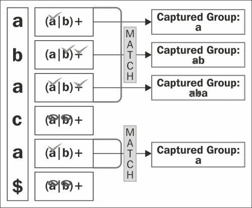

# 第三章分组

分组是一个强大的工具，允许您执行以下操作：

*   创建子表达式以应用量词。例如，重复子表达式而不是单个字符。
*   限制变更的范围。我们可以准确地定义必须交替的内容，而不是交替整个表达式。
*   从匹配的模式中提取信息。例如，从订单列表中提取日期。
*   在正则表达式中再次使用提取的信息，这可能是最有用的属性。一个例子是检测重复的单词。

在本章中，我们将探讨从最简单到最复杂的群体。我们将回顾前面的一些示例，以明确这些操作是如何工作的。

# 导言

我们已经在[第 2 章](2.html "Chapter 2. Regular Expressions with Python")*正则表达式和 Python*中的几个示例中使用了组。分组通过两个元字符完成，即括号`()`。使用括号的最简单的例子是构建一个子表达式。例如，假设您有一个产品列表，每个产品的 ID 由两个或三个序列组成，每个序列的一个数字后面跟一个破折号，后面跟一个字母数字字符，1-a2-b：

```py
>>>re.match(r"(\d-\w){2,3}", ur"1-a2-b")
<_sre.SRE_Match at 0x10f690738>
```

正如您在前面的示例中所看到的，括号向正则表达式引擎指示必须将其中的模式视为一个单元。

让我们看另一个例子；在这种情况下，只要有一个或多个`ab` 后跟`c`，我们就需要进行匹配：

```py
>>>re.search(r"(ab)+c", ur"ababc")
<_sre.SRE_Match at 0x10f690a08>
>>>re.search(r"(ab)+c", ur"abbc")
None
```

因此，只要您想在主模式中分组有意义的子模式，就可以使用括号。

另一个简单的例子是限制变更的范围。例如，假设我们想写一个表达式来匹配来自西班牙的人。在西班牙语中，国家拼写为 España，西班牙人拼写为 Español。所以，我们想把 España 和 Español 匹配起来。西班牙语字母ñ可能会让非西班牙语使用者感到困惑，因此为了避免混淆，我们将使用 Espana 和 Espanol，而不是 España 和 Español。

我们可以通过以下备选方案来实现：

```py
>>>re.search("Espana|ol", "Espanol")
<_sre.SRE_Match at 0x1043cfe68>
>>>re.search("Espana|ol", "Espana")
<_sre.SRE_Match at 0x1043cfed0>
```

问题是这也与`ol`匹配：

```py
>>>re.search("Espana|ol", "ol")
<_sre.SRE_Match at 0x1043cfe00>
```

因此，让我们尝试以下代码中的字符类：

```py
>>>re.search("Espan[aol]", "Espanol")
<_sre.SRE_Match at 0x1043cf1d0>

>>>re.search("Espan[aol]", "Espana")
<_sre.SRE_Match at 0x1043cf850>
```

它是有效的，但这里我们有另一个问题：它也匹配`"Espano"`和`"Espanl"`，这在西班牙语中没有任何意义：

```py
>>>re.search("Espan[a|ol]", "Espano")
<_sre.SRE_Match at 0x1043cfb28>
```

这里的解决方案是使用括号：

```py
>>>re.search("Espan(a|ol)", "Espana")
<_sre.SRE_Match at 0x10439b648>

>>>re.search("Espan(a|ol)", "Espanol")
<_sre.SRE_Match at 0x10439b918>

>>>re.search("Espan(a|ol)", "Espan")
   None

>>>re.search("Espan(a|ol)", "Espano")
   None

>>>re.search("Espan(a|ol)", "ol")
   None
```

让我们看看分组的另一个关键特性，**捕获**。组还捕获匹配的模式，因此您可以稍后在几个操作中使用它们，例如`sub`或正则表达式本身。

例如，假设您有一个产品列表，其 ID 由代表产品国家的数字、一个破折号作为分隔符以及一个或多个字母数字字符作为 DB 中的 ID 组成。您需要提取国家/地区代码：

```py
>>>pattern = re.compile(r"(\d+)-\w+")
>>>it = pattern.finditer(r"1-a\n20-baer\n34-afcr")
>>>match = it.next()
>>>match.group(1)
'1'
>>>match = it.next()
>>>match.group(1)
'20'
>>>match = it.next()
>>>match.group(1)
'34'
```

在前面的示例中，我们创建了一个模式来匹配 ID，但我们只捕获由国家数字组成的组。请记住，使用`group`方法时，索引 0 返回整个匹配，组从索引 1 开始。

捕获组提供了大量的可能性，因此它们也可以用于多个操作，我们将在接下来的部分中讨论。

# 反向参考

正如我们前面提到的，分组为我们提供的最强大的功能之一是可以在正则表达式或其他操作中使用捕获的组。这正是反向引用所提供的。可能最为人熟知的示例是查找重复单词的正则表达式，如下代码所示：

```py
>>>pattern = re.compile(r"(\w+) \1")
>>>match = pattern.search(r"hello hello world")
>>>match.groups()
('hello',)
```

在这里，我们捕获一个由一个或多个字母数字字符组成的组，然后模式尝试匹配空白，最后我们得到了`\1`反向引用。您可以看到它在代码中高亮显示，这意味着它必须与第一组匹配的内容完全匹配。

反向引用可以用于前 99 个组。显然，随着组数量的增加，您会发现读取和维护正则表达式的任务更加复杂。这是可以通过命名组来减少的；我们将在下一节中看到它们。但在此之前，我们仍然有很多东西需要通过反向引用来学习。那么，让我们继续进行另一个操作，在这个操作中，反向引用真的很有用。回想一下上一个示例，其中有一个产品列表。现在，让我们尝试更改 ID 的顺序，以便在 DB 中有 ID、破折号和国家代码：

```py
>>>pattern = re.compile(r"(\d+)-(\w+)")
>>>pattern.sub(r"\2-\1", "1-a\n20-baer\n34-afcr")
'a-1\nbaer-20\nafcr-34'
```

就这样。很简单，不是吗？请注意，我们还在数据库中捕获 ID，以便稍后使用。对于突出显示的代码，我们的意思是，“用第二组、破折号和第一组替换您匹配的内容”。

与前面的示例一样，使用数字可能很难遵循和维护。那么，让我们看看 Python 通过`re`模块提供了什么帮助。

# 命名组

还记得上一章的吗，我们通过索引得到了一个组？

```py
>>>pattern = re.compile(r"(\w+) (\w+)")
>>>match = pattern.search("Hello⇢world")
>>>match.group(1)
  'Hello'
>>>match.group(2)
  'world'
```

我们刚刚学习了如何使用索引访问组以提取信息并将其用作反向引用。使用数字来表示组可能会很枯燥和令人困惑，最糟糕的是，它不允许你给组赋予意义或上下文。这就是我们命名组的原因。

想象一下一个正则表达式，其中有几个反向引用，比如说 10 个，然后发现第三个是无效的，所以将其从正则表达式中删除。这意味着您必须更改从该反向引用开始的每个反向引用的索引。为了解决这个问题，Guido Van Rossum 在 1997 年为 Python 1.5 设计了命名组。这个特性提供给 Perl 进行异花授粉。

如今，它几乎可以在任何口味中找到。基本上，它允许我们为组命名，因此我们可以在涉及组的任何操作中通过名称引用它们。

为了使用它，我们必须使用语法`(?P<name>pattern)`，其中`P`来自特定于 Python 的扩展（正如您在发送给 Perl 开发人员的电子邮件[中看到的那样）http://markmail.org/message/oyezhwvefvotacc3](http://markmail.org/message/oyezhwvefvotacc3)

让我们在下面的代码段中了解它如何与前面的示例一起工作：

```py
>>> pattern = re.compile(r"(?P<first>\w+) (?P<second>\w+)")
>>> match = re.search("Hello world")
>>>match.group("first")
  'Hello'
>>>match.group("second")
  'world'
```

因此，反向引用现在更易于使用和维护，如以下示例所示：

```py
>>>pattern = re.compile(r"(?P<country>\d+)-(?P<id>\w+)")
>>>pattern.sub(r"\g<id>-\g<country>", "1-a\n20-baer\n34-afcr")
'a-1\nbaer-20\nafcr-34'
```

正如我们在前面的示例中看到的，为了在`sub`操作中通过名称引用组，我们必须使用\`g<name>`。

我们还可以在模式本身内部使用命名组，如以下示例所示：

```py
>>>pattern = re.compile(r"(?P<word>\w+) (?P=word)")
>>>match = pattern.search(r"hello hello world")
>>>match.groups()
('hello',)
```

这比使用数字更简单易读。

通过这些示例，我们使用了以下三种不同的方式来引用命名组：

<colgroup><col style="text-align: left"> <col style="text-align: left"></colgroup> 
| 

使用

 | 

语法

 |
| --- | --- |
| 内部模式 | （？P=名称） |
| 在`sub`操作的`repl`字符串中 | \g<name></name> |
| 在`MatchObject`的任何操作中 | match.group（'名称'） |

# 非捕获组

正如我们前面提到的，捕获内容并不是群组的唯一用途。有些情况下，我们希望使用组，但我们对提取信息不感兴趣；交替将是一个很好的例子。这就是为什么我们有一种不需要捕获就可以创建组的方法。在本书中，我们一直使用组来创建子表达式，如下例所示：

```py
>>>re.search("Españ(a|ol)", "Español")
<_sre.SRE_Match at 0x10e90b828>
>>>re.search("Españ(a|ol)", "Español").groups()
('ol',)
```

你可以看到，我们捕获了一个组，尽管我们对组的内容不感兴趣。所以，让我们在不捕获的情况下尝试一下，但首先我们必须知道语法，这与正常组中的语法几乎相同，`(?:pattern)`。如您所见，我们只添加了`?:`。让我们看看下面的例子：

```py
>>>re.search("Españ(?:a|ol)", "Español")
<_sre.SRE_Match at 0x10e912648>
>>>re.search("Españ(?:a|ol)", "Español").groups()
()
```

使用新语法后，我们的功能与以前相同，但现在我们节省了资源，正则表达式更易于维护。请注意，无法引用该组。

## 原子团

他们是非俘虏群体的特例；它们通常用于提高性能。它禁用回溯，因此使用它们，您可以避免尝试模式中的所有可能性或路径都没有意义的情况。这个概念很难理解，所以请在本节结束前与我一起讨论。

`re`模块不支持原子组。因此，为了看一个例子，我们将使用正则表达式模块：[https://pypi.python.org/pypi/regex](https://pypi.python.org/pypi/regex) 。

假设我们必须寻找一个由一个或多个字母数字字符、破折号和数字组成的 ID：

```py
>>>data = "aaaaabbbbbaaaaccccccdddddaaa"
>>>regex.match("(\w+)-\d",data)
```

让我们一步一步地看看这里发生了什么：

1.  正则表达式引擎与第一个`a`匹配。
2.  然后它匹配字符串末尾的每个字符。
3.  它失败了，因为它找不到破折号。
4.  因此，引擎进行回溯，并对以下`a`进行相同的尝试。
5.  再次启动相同的过程。

它对每一个角色都这样做。如果你想想我们在做什么，一旦你第一次失败了，继续尝试是没有任何意义的。而这正是原子团的用途。例如：

```py
>>>regex.match("(?>\w+)-\d",data)
```

这里我们添加了`?>`，它表示一个原子组，因此一旦正则表达式引擎无法匹配`,`，它就不会继续尝试数据中的每个字符。

# 有群体的特殊病例

Python 为我们提供了一些形式的组，这些组可以帮助我们修改正则表达式，甚至只有在匹配中存在前一个组时才匹配模式，例如`if`语句。

## 每组旗帜

有一种方法可以将[第 2 章](2.html "Chapter 2. Regular Expressions with Python")*正则表达式中的标志应用于 Python*，使用一种特殊的分组形式：`(?iLmsux)`。

<colgroup><col style="text-align: left"> <col style="text-align: left"></colgroup> 
| 

信

 | 

旗帜

 |
| --- | --- |
| **i** | 再忽视 |
| **L** | 关于地点 |
| **m** | 关于多行 |
| **s** | 雷多塔尔 |
| **u** | 关于 UNICODE |
| **x** | 重复冗长 |

例如：

```py
>>>re.findall(r"(?u)\w+" ,ur"ñ")
[u'\xf1']
```

上述示例与以下示例相同：

```py
>>>re.findall(r"\w+" ,ur"ñ", re.U)
[u'\xf1']
```

在上一章中，我们已经多次看到了这些示例的作用。

请记住，标志应用于整个表达式。

## 是模式|否模式

这是一个非常有用的群体案例。它尝试匹配一个模式，以防找到以前的模式。另一方面，如果没有找到以前的组，它不会尝试匹配模式。简而言之，它就像一个 if-else 语句。此操作的语法如下所示：

```py
(?(id/name)yes-pattern|no-pattern)
```

此表达式的意思是：如果具有此 ID 的组已经匹配，那么在字符串的这一点，`yes-pattern`模式必须匹配。如果组尚未匹配，则`no-pattern`模式必须匹配。

让我们看看它是如何工作的继续我们的陈腐的例子。我们有一个产品列表，但在这种情况下，ID 可以通过两种不同的方式生成：

*   国家代码（两位数）、破折号、三个或四个字母数字字符、破折号和区号（两位数）。例如：`34-adrl-01`。
*   三个或四个字母数字字符。例如：`adrl`。

因此，当有国家代码时，我们需要匹配国家地区：

```py
>>>pattern = re.compile(r"(\d\d-)?(\w{3,4})(?(1)(-\d\d))")
>>>pattern.match("34-erte-22")
<_sre.SRE_Match at 0x10f68b7a0>
>>>pattern.search("erte")
<_sre.SRE_Match at 0x10f68b828>
```

正如您在前面的示例中所看到的，当我们有国家代码和地区代码时，会有一个匹配项。请注意，如果有国家代码但没有区号，则不存在匹配项：

```py
>>>pattern.match("34-erte")
None
```

那么`no-pattern`是干什么的？让我们为上一个示例添加另一个约束：如果没有国家代码，则字符串末尾必须有一个名称：

*   国家代码（2 位）、破折号、三个或四个字母数字字符、破折号和区号（2 位）。例如：`34-adrl-01`
*   三个或四个字母数字字符，后跟三个或四个字符。例如：`adrl-sala`。

让我们看看它的实际行动：

```py
>>>pattern = re.compile(r"(\d\d-)?(\w{3,4})-(?(1)(\d\d)|[a-z]{3,4})$")
>>>pattern.match("34-erte-22")
<_sre.SRE_Match at 0x10f6ee750>
```

正如所料，如果有国家代码和地区代码，则存在匹配项。

```py
>>>pattern.match("34-erte")
None
```

在前面的示例中，我们确实有一个国家/地区，但没有区号，因此没有匹配项。

```py
>>>pattern.match("erte-abcd")
<_sre.SRE_Match at 0x10f6ee880>
```

最后，当没有国家区域时，必须有一个名称，所以我们有一个匹配项。

注意，`no-pattern`是可选的，因此在第一个示例中，我们省略了它。

# 重叠组

在[第 2 章](2.html "Chapter 2. Regular Expressions with Python")、*正则表达式和 Python*中，我们看到了几个有重叠组警告的操作：例如`findall`操作。这似乎让很多人感到困惑。因此，让我们用一个简单的例子来解释一下：

```py
>>>re.findall(r'(a|b)+', 'abaca')
['a', 'a']
```

这里发生了什么事？为什么下面的表达式给我们的是`'a'`和`'a'`而不是`'aba'`和`'a'`？

让我们一步一步来了解解决方案：



重叠组匹配过程

如上图所示，字符`aba`是匹配的，但捕获的组只由`a`组成。这是因为即使我们的正则表达式对每个字符进行分组，它仍然保留最后一个`a`。记住这一点，因为这是理解其工作原理的关键。停下来想一想，我们要求 regex 引擎捕获由`a`或`b`组成的所有组，但只针对其中一个角色，这是关键。那么，您如何捕获由多个`'a'`或`'b'`以任意顺序组成的组？下面的表达式起到了作用：

```py
>>>re.findall(r'((?:a|b)+)', 'abbaca')
   ['abba', 'a']
```

我们要求正则表达式引擎捕获由子表达式（`a|b`组成的每个组，而不是只对一个字符进行分组。

最后一件事——如果我们想获得由`a`或`b`和`findall`组成的每一组，我们可以写出以下简单表达式：

```py
>>>re.findall(r'(a|b)', 'abaca')
   ['a', 'b', 'a', 'a']
```

在这个案例中，我们要求 regex 引擎捕获由`a`或`b`组成的组。当我们使用`findall`时，我们得到了每个匹配的模式，因此我们得到了四组。

### 提示

**经验法则**

最好使正则表达式尽可能简单。因此，您应该从最简单的表达式开始，然后逐步构建更复杂的表达式，而不是相反。

# 总结

不要让这一章的简单性蒙蔽了你，我们在这一章中所学到的东西在你使用 regex 的日常工作中会非常有用，它会给你很多杠杆作用。

让我们总结一下到目前为止所学到的知识。首先，我们看到了当我们只需要将量词应用到表达式的某个部分时，一个组如何帮助我们。

由于**反向引用**，我们还学习了如何在`sub`操作中再次在模式中甚至在替换字符串中使用捕获的组。

在本章中，我们还介绍了命名组，这是一种提高正则表达式可读性和未来维护的工具。

稍后，我们学习了如何匹配子表达式以防前一个组存在，或者在前一个组不存在时匹配它。

现在我们知道了如何使用小组，是时候学习一门更复杂的学科了，它离小组很近；看看周围！