# 第 9 章文档——如何使用斯芬克斯和重构文本

记录代码既有趣又有用！我承认，许多程序员非常不喜欢编写代码文档，这是可以理解的。编写文档可能是一项枯燥的工作，传统上只有其他人才能从中获益。然而，Python 可用的工具使生成有用的最新文档变得非常简单，几乎不需要任何努力。生成文档实际上变得非常简单，以至于我在使用 Python 包之前创建并生成了文档。假设它还不可用，也就是说。

除了解释函数功能的简单文本文档外，还可以添加元数据，例如类型提示。这些类型提示可用于使函数或类的参数和返回类型在文档中可单击。但更重要的是，许多现代 IDE 和编辑器（如 VIM）都有插件，可以解析类型提示并使用它们进行智能自动完成。因此，如果您键入`Spam.eggs`，编辑器将自动完成对象的特定属性和方法；传统的只有静态类型语言如 java、C++和 C++才可行的东西。

本章将解释 Python 中可用的文档类型以及创建完整文档集的容易程度。有了 Python 提供的令人惊叹的工具，您可以在几分钟内拥有功能齐全的文档。

本章涵盖的主题如下：

*   重新构造的 dtext 语法
*   使用 Sphinx 设置文档
*   斯芬克斯式 docstrings
*   谷歌风格的文档字符串
*   NumPy 样式的文档字符串

# 重新构造的文本语法

**重组文本**格式（也称为**RST**、**ReST**或**ReST**于 2002 年开发，作为一种简单语言，实现了足够多的标记以可用，但足够简单，可以作为纯文本阅读。这两个特性使它具有足够的可读性，可以在代码中使用，但仍然具有足够的通用性，可以生成漂亮而有用的文档。

StructuredText 最大的优点是它非常直观。即使对标准一无所知，您也可以轻松地以这种风格编写文档，而不必知道它会被视为一种语言。然而，更先进的技术，如图像和链接，确实需要一些解释。

除了 StructuredText 之外，还有一些语言，例如**标记**，它们的用法非常相似。在 Python 社区中，StructuredText 已经成为标准文档语言超过 10 年了，因此它是推荐的解决方案。

### 提示

为了方便地在格式（如 reStructuredText 和 Markdown）之间进行转换，请使用Pandoc 工具，可在[中找到http://pandoc.org/](http://pandoc.org/) 。

基本语法读起来就像文本，接下来的几段将展示一些更高级的功能。但是，让我们从一个简单的示例开始，演示重新构造的文本文件有多简单。

```py
Documentation, how to use Sphinx and reStructuredText
##################################################################

Documenting code can be both fun and useful! ...

Additionally, adding ...

... So that typing `Spam.eggs.` will automatically ...

Topics covered in this chapter are as follows:

 - The reStructuredText syntax
 - Setting up documentation using Sphinx
 - Sphinx style docstrings
 - Google style docstrings
 - NumPy style docstrings

The reStructuredText syntax
******************************************************************

The reStructuredText format (also known as ...

```

这就是到目前为止，将本章的文本转换为重构文本是多么容易。以下段落将介绍以下特点：

1.  内联标记（斜体、粗体、代码和链接）
2.  列表
3.  标题
4.  高级链接
5.  图像
6.  替换
7.  包含代码、数学和其他内容的块

## 开始使用重组文本

要快速将重构后的文本文件转换为 HTML，我们可以使用`docutils`库。本章后面讨论的`sphinx`库实际上在内部使用`docutils`库，但有一些我们最初不需要的额外特性。要开始，我们只需要安装`docutils`：

```py
pip install docutils

```

之后，我们可以轻松地将重构文本转换为 PDF、LaTeX、HTML 和其他格式。对于本段中的示例，我们将使用 HTML 格式，该格式可以使用以下命令轻松生成：

```py
rst2html.py file.rst file.html

```

StructuredText 的基本组件是角色，用于内联修改输出和生成标记块的指令。在 pure StructuredText 中，指令是最重要的，但是我们将在关于 Sphinx 的部分中看到角色的许多用途。

## 内联标记

**内联标记**是在常规文本行中使用的标记。其中的示例包括强调、内嵌代码示例、链接、图像和项目符号列表。

例如，可以通过将单词封装在一个或两个星号之间来增加强调。例如，这个句子可以通过在两侧添加一个星号来添加一点`*emphasis*`，或者通过在两侧添加两个星号来添加大量`**emphasis**`。有许多不同的内联标记指令，因此我们将只列出最常见的指令。完整列表可在`docutils.sourceforge.net`的重组文本主页上找到。

以下是一些例子：

*   强调（斜体）文本：`*emphasis for this phrase*`。
*   额外强调（粗体）文本：`**extra emphasis for this phrase**`。
*   For lists without numbers, a simple dash with spaces after it:

    ```py
    - item 1
    - item 2
    ```

    ### 注

    破折号后的空格是 reStructuredText 识别列表所必需的。

*   对于带有数字的列表，数字后跟句点和空格：

    ```py
    1\. item 1
    2\. item 2
    ```

*   对于编号列表，需要编号后的句点。
*   Interpreted text: These are domain specific. Within Python documentation, the default role is code which means that surround text with back ticks will convert your code to use code tags. For example, ``if spam and eggs:``.

    根据您的偏好，可以通过角色前缀或后缀设置不同的角色。例如，`:math:`E=mc^2``表示数学方程。

*   内联文字：它使用单空格字体进行格式化，非常适合内联代码。只需在```pyadd some code```上添加两个回勾即可。
*   引用：可以通过尾随下划线创建这些引用。它们可以指向标题、链接、标签等。下一节将介绍更多关于这些的内容，但基本语法只是`reference_`或在引用包含空格``some reference link`_`时包含在后面的记号中。
*   要转义前面的字符，可以使用反斜杠。因此，如果您希望有一个带强调符号的星号，可以使用`*\**`，这与 Python 字符串中的转义非常类似。

还有很多可用，但这些是您在编写重构文本时最常用的。

## 标题

标题用于表示文档、章节或段落的开头。因此，它是文档中需要的第一个结构。虽然不是严格需要的，但强烈建议使用它，因为它有多种用途：

1.  标题根据其级别进行一致的格式化。
2.  Sphinx 可以从标题生成目录（TOC）树。
3.  所有标题都会自动用作标签，这意味着您可以创建指向它们的链接。

在创建标头时，一致性是为数不多的约束条件之一；使用的字符和级别的数量相当随意。

就个人而言，我默认使用具有固定大小标题的简单系统，但我建议至少在部分、章节、小节、子部分和段落方面遵循 Python 文档的默认设置。大致如下：

```py
Part
################################################################

Chapter
****************************************************************

Section
================================================================

Subsection
----------------------------------------------------------------

Subsubsection
^^^^^^^^^^^^^^^^^^^^^^^^^^^^^^^^^^^^^^^^^^^^^^^^^^^^^^^^^^^^^^^^

Paragraph
""""""""""""""""""""""""""""""""""""""""""""""""""""""""""""""""

Content

```

输出：

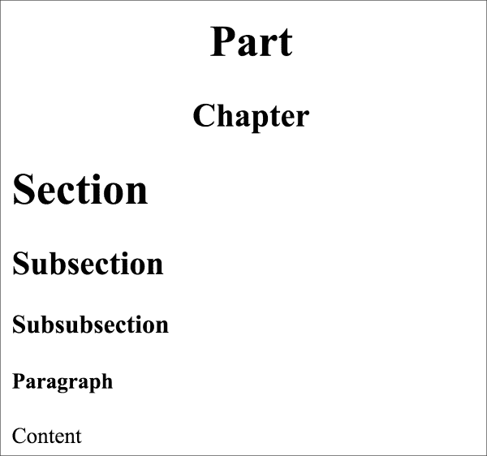

这只是标题的常用用法，但 StructuredText 的主要思想是您可以使用任何您觉得自然的字符，这意味着您可以使用以下任意字符：`= - ` : ' " ~ ^ _ * + # <>`。它还支持下划线和上划线，因此如果您愿意，它们也是选项：

```py
################################################################
Part
################################################################

****************************************************************
Chapter
****************************************************************

================================================================
Section
================================================================

----------------------------------------------------------------
Subsection
----------------------------------------------------------------

^^^^^^^^^^^^^^^^^^^^^^^^^^^^^^^^^^^^^^^^^^^^^^^^^^^^^^^^^^^^^^^^
Subsubsection
^^^^^^^^^^^^^^^^^^^^^^^^^^^^^^^^^^^^^^^^^^^^^^^^^^^^^^^^^^^^^^^^

""""""""""""""""""""""""""""""""""""""""""""""""""""""""""""""""
Paragraph
""""""""""""""""""""""""""""""""""""""""""""""""""""""""""""""""

Content

```

虽然我尝试将字符数固定为 78 个字符，正如`PEP8`（[第 2 章](102.html "Chapter 2. Pythonic Syntax, Common Pitfalls, and Style Guide")、*Pythonic 语法、常见陷阱和样式指南*为 Python 所建议的那样，但使用的字符数大多是任意的，但它至少必须与标题文本一样长。此允许it 获得以下结果：

```py
Section
=======

```

但不是这个：

```py
Section
====

```

## 列表

重构的文本格式有几种列表样式：

1.  列举
2.  子弹
3.  选择权
4.  定义

最简单的形式的列表已经显示在简介部分，但实际上可以使用许多不同的字符，例如字母、罗马数字和其他字符进行枚举。在演示了基本列表类型之后，我们将继续进行列表和结构的嵌套，这使它们更加强大。必须注意空格的数量，因为空格太多会导致结构被识别为常规文本而不是结构。

### 列举清单

枚举列表便于各种枚举。枚举列表的基本前提是字母数字字符后跟句点、右括号或两侧的括号。此外，`#`字符还起到自动枚举的作用。例如：

```py
1\. With
2\. Numbers

a. With
#. letters

i. Roman
#. numerals

(1) With
(2) Parenthesis

```

输出可能比您预期的要简单一些。原因是它取决于输出格式。它们是使用 HTML 输出格式生成的，该格式不支持括号。例如，如果输出 LaTeX，则可以使差异可见。以下是呈现的 HTML 输出：


### 项目列表

如果列表的顺序不相关，而您只是需要一个没有枚举的项目列表，那么项目符号列表就是您需要的。要仅使用项目符号创建简单列表，项目符号项需要以`*`、`+`、`-`、`•`、`‣`或`⁃`开头。此列表大部分是任意的，可以通过扩展 Sphinx 或 Docutils 进行修改。例如：

```py
- dashes
- and more dashes

* asterisk
* stars

+ plus
+ and plus

```

正如你所看到的，HTML 输出的所有项目符号看起来都一样。当以 LaTeX（以及连续的 PDF 或 Postscript）形式生成文档时，它们可能会有所不同。由于基于 web 的文档是 Sphinx 最常见的输出格式，因此我们默认使用该输出。呈现的 HTML 输出如下所示：

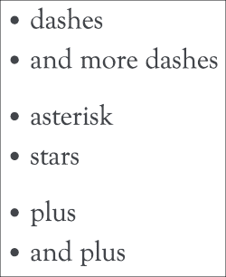

### 选项列表

`option`列表专门用于记录程序的命令行参数。语法的唯一特殊之处是逗号空间被识别为选项的分隔符。

```py
-s, --spam  This is the spam option
--eggs      This is the eggs option

```

输出结果如下：


### 定义列表

定义列表比其他类型的列表更模糊，因为实际结构仅由空格组成。因此，它的使用非常简单，但在文件中识别起来并不总是那么容易。

```py
spam
 Spam is a canned pork meat product
eggs
 Is, similar to spam, also food

```

输出结果如下：

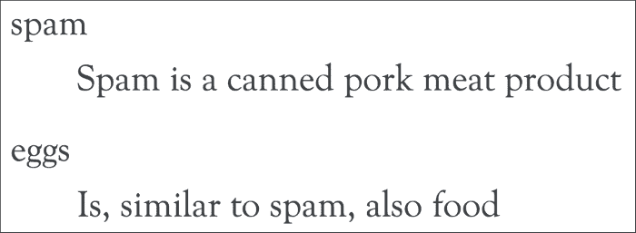

### 嵌套列表

嵌套项实际上并不局限于列表，可以使用多种类型的块进行嵌套，但其思想是相同的。只是要小心保持缩进在正确的水平。如果您不这样做，它或者不会被识别为一个单独的级别，或者您将得到一个错误。

```py
1\. With
2\. Numbers

 (food) food

 spam
 Spam is a canned pork meat product

 eggs
 Is, similar to spam, also food

 (other) non-food stuff

```

以下为输出：


## 链接、参考和标签

StructuredText 支持多种链路类型，其中最简单的就是与协议的链路，如[http://python.org](http://python.org) ，大多数解析器会自动识别。但是，通过使用我们前面看到的解释文本语法``Python <http://python.org>`_`，自定义标签也是一个选项。

这两种方法都适用于简单的链接，不会重复太多，但一般来说，将标签附加到链接上更方便，这样它们可以重复使用，并且不会太多地阻塞文本。

例如，请参阅以下内容：

```py
The switch to reStructuredText and Sphinx was made with the
`Python 2.6 <https://docs.python.org/whatsnew/2.6.html>`_
release.

```

现在将其与以下内容进行比较：

```py
The switch to reStructuredText and Sphinx was made with the
`python 2.6`_ release.

.. _`Python 2.6`: https://docs.python.org/whatsnew/2.6.html

```

结果如下：


使用标签，可以很容易地在指定位置获得参考列表，而不会使实际的文本更难阅读。但是，这些标签可用于多个外部链接；与早期编程语言中的`GOTO`语句类似，您可以创建标签，并从文档的其他部分引用它们：

```py
.. _label:

```

在 HTML 或 PDF 输出中，可以使用下划线链接从文本中的任何位置创建可单击的链接。创建指向标签的可点击链接就像在文本中添加`label_`一样简单。请注意，StructuredText 忽略大小写差异，因此大写和小写链接都可以正常工作。即使不太可能犯这样的错误，但在一个文档中使用相同的标签，并且只有大小写差异，也会导致错误，以确保不会出现重复。

引用与标题的结合使用以一种非常自然的方式工作；您可以像通常一样引用它们，并添加下划线使其成为链接：

```py
The introduction section
================================================================

This section contains:

- `chapter 1`_
- :ref:`chapter2`

 1\. my_label_

 2\. `And a label link with a custom title <my_label>`_

Chapter 1
----------------------------------------------------------------

Jumping back to the beginning of `chapter 1`_ is also possible.
Or jumping to :ref:`Chapter 2 <chapter2>`

.. _chapter2:

Chapter 2 With a longer title
----------------------------------------------------------------

The next chapter.

.. _my_label:

The label points here.

Back to `the introduction section`_

```

输出为，如下所示：


## 图像

image指令看起来与标签语法非常相似。它们实际上有点不同，但模式非常相似。image 指令只是 structuredText 支持的众多指令之一。我们将在稍后讨论 Sphinx 和 StructuredText 扩展时看到更多关于这方面的内容。目前，只需知道指令以两个句点开头，后跟空格、指令名称和两个冒号即可：

```py
 .. name_of_directive::

```

在图像的情况下，指令被称为`image`当然：

```py
.. image:: python.png

```

实际图像更大时的缩放输出：


### 注

注意指令后面的双冒号。

但是如何指定大小和其他属性？图像指令有许多其他选项（与大多数其他指令一样），可以使用：[http://docutils.sourceforge.net/docs/ref/rst/directives.html#images](http://docutils.sourceforge.net/docs/ref/rst/directives.html#images) ，但它们大多相当明显。要指定图像的宽度和高度或比例（以百分比为单位），请执行以下操作：

```py
.. image:: python.png
 :width: 150
 :height: 100

.. image:: python.png
 :scale: 10

```

输出结果如下：

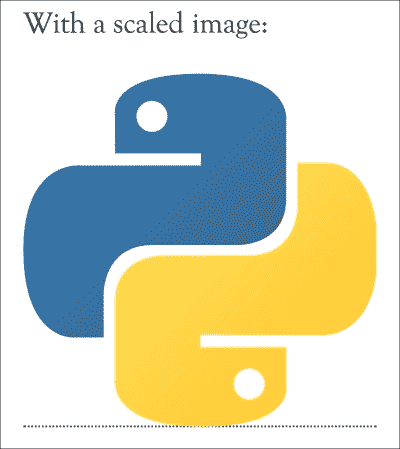

### 注

`scale`选项使用`width`和`height`选项（如果可用），并返回到 PIL（Python 图像库）或枕头库来检测图像。如果宽度/高度和 PIL/枕头都不可用，`scale`选项将被忽略。

除了`image`指令之外还有指令。不同之处在于`figure`在图像中添加了一个标题。除此之外，用法与`image`相同：

```py
.. figure:: python.png
 :scale: 10

 The Python logo

```

输出如下：


## 替换

当编写文档时，经常会发生结构重复的情况，链接有自己的标签系统，但在重构文本中有更多的方式。替换定义使缩短指令成为可能，因此指令可以很容易地重复使用。

让我们假设我们有一个经常在一段文字中使用的徽标。不必输入整个`.. image:: <url>`，只要有一个速记工具就很方便了。这就是替换非常有用的地方：

```py
.. |python| image:: python.png
 :scale: 1

The Python programming language uses the logo: |python|

```

结果如下：


这些替换可以与许多指令一起使用，尽管对于在文档的许多位置输出变量特别有用。例如：

```py
.. |author| replace:: Rick van Hattem

This book was written by |author|

```

输出结果如下：


## 块、代码、数学、注释和引号

当编写文档时，常见场景是需要包含不同类型内容的块、数学公式解释、代码示例等。这些指令的用法与 image 指令类似。以下是代码块的示例：

```py
.. code:: python

 def spam(*args):
 print('spam got args', args)

```

输出如下：

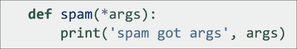

或者数学使用 LaTeX 语法，微积分的基本定理：

```py
.. math::

 \int_a^b f(x)\,dx = F(b) - F(a)

```

输出结果如下：


使用紧跟缩进的“empty”指令可以很容易地对一组文本/命令进行注释：

```py
Before comments

.. Everything here will be commented

 And this as well
 .. code:: python
 def even_this_code_sample():
 pass  # Will be commented

After comments

```

结果如下：


最简单的是块引号。块引用只需要简单的缩进。

```py
Normal text

 Quoted text

```

结果如下：

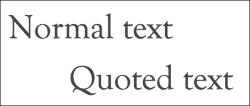

## 结论

重构文本既是一种非常简单的语言，也是一种非常广泛的语言；编写纯文本注释时，大部分语法都是自然生成的。然而，一本关于所有错综复杂的完整指南可能会填满另一本书。在前面的演示中，应该有足够的介绍来完成记录项目时至少 90%的工作。除此之外，狮身人面像将有很大帮助，我们将在下一节中看到。

# 斯芬克斯文档生成器

Sphinx 文档生成器是 2008 年为 Python2.6 版本创建的，用于替换 Python 的旧 LaTeX 文档。它是一个生成器，使得为编程项目生成文档变得几乎微不足道，但即使在编程世界之外，它也可以很容易地使用。在编程项目中，对以下领域（编程语言）有特定的支持：

*   python
*   C
*   C++
*   Javascript
*   重组文本

除了这些语言之外，还有许多其他语言的扩展，如 CoffeeScript、MATLAB、PHP、Ruby Lisp、Go 和 Scala。如果您只是在寻找代码片段高亮显示，那么内部使用的 Pygments highlighter 支持 120 多种语言，如果需要，可以轻松地扩展到新语言。

Sphinx 最重要的优点是几乎所有东西都可以从源代码自动生成。因此，文档总是最新的。

## 狮身人面像入门

首先，我们必须确保安装斯芬克斯。尽管 Python 核心文档是使用 Sphinx 编写的，但它仍然是一个单独维护的项目，必须单独安装。幸运的是，使用 pip 很容易：

```py
pip install sphinx

```

在安装 Sphinx 之后，有两种开始项目的方式，`sphinx-quickstart`脚本和`sphinx-apidoc`脚本。如果你想创建和定制一个完整的 Sphinx 项目，`sphinx-quickstart`可能是最好的，因为它可以帮助你配置一个功能齐全的 Sphinx 项目。如果您只是想要现有项目的 API 文档，那么`sphinx-apidoc`可能更适合，因为创建项目只需一个命令，无需进一步输入。

最后，这两个选项都是创建 Sphinx 项目的有效选项，我个人通常使用`sphinx-quickstart`生成初始配置，并在每次添加 Python 模块以添加新模块时调用`sphinx-apidoc`命令。由于`sphinx-apidoc`在默认情况下不会覆盖任何文件，因此它是一种安全的操作。

### 使用斯芬克斯快速入门

`sphinx-quickstart`脚本以交互方式询问您在Sphinx 项目中最重要的决策。不过，如果你不小心输入了一个错别字，就不必担心了。大部分配置都存储在`conf.py`目录中，因此，如果您仍然希望启用某个模块，那么以后编辑配置就足够容易了。

使用非常简单，作为默认设置，我建议使用以下设置。输出使用以下约定：

*   内联注释以`#`开头
*   用户输入行以`>`开头
*   裁剪输出以`...`表示，中间跳过的所有问题使用默认设置

```py
# sphinx-quickstart
Welcome to the Sphinx 1.3.3 quickstart utility.

...

Enter the root path for documentation.
> Root path for the documentation [.]: docs

...

The project name will occur in several places in the built documentation.
> Project name: Mastering Python
> Author name(s): Rick van Hattem

# As version you might want to start below 1.0 or add an extra digit
# but I would recommend leaving the default and modify the
# configuration file instead. Just make it import from the Python
# package instead. An example can be found in the numpy-stl package:
# https://github.com/WoLpH/numpy-stl/blob/develop/docs/conf.py
...
> Project version: 1.0
> Project release [1.0]:

...

# Enabling the epub builder can be useful for people using e-readers to
# read the documentation.
Sphinx can also add configuration for epub output:
> Do you want to use the epub builder (y/n) [n]: y

...
# Autodoc is required to document the code, definitely recommended to
# enable
> autodoc: automatically insert docstrings from
 modules (y/n) [n]: y

# With the doctest feature we can run tests embedded in the
# documentation. This is meant for doctests in the .rst files.
> doctest: automatically test code snippets in
 doctest blocks (y/n) [n]: y

# Intersphinx enables linking between Sphinx documentation sets
# allowing for links to external documentation. After enabling this
# you can make str link to the regular Python documentation about str
# for example.
> intersphinx: link between Sphinx documentation
 of different projects (y/n) [n]: y
...
# Mathjax enables LaTeX style mathematical rendering, not strictly
# needed but very useful for rendering equations.
> mathjax: include math, rendered in the browser
 by MathJax (y/n) [n]: y
...
> viewcode: include links to the source code of
 documented Python objects (y/n) [n]: y

...

Creating file docs/conf.py.
Creating file docs/index.rst.
Creating file docs/Makefile.
Creating file docs/make.bat.

Finished: An initial directory structure has been created.

```

您现在应该填充主文件`docs/index.rst`并创建其他文档源文件。使用 Makefile 构建文档，如下所示：

```py
 make builder
where "builder" is one of the supported builders, e.g. html, latex or linkcheck.

```

运行这个之后，我们应该有一个包含 Sphinx 项目的`docs`目录。让我们看看命令实际为我们创建了什么：

```py
# find docs
docs
docs/_build
docs/_static
docs/_templates
docs/conf.py
docs/index.rst
docs/make.bat
docs/Makefile

```

`_build`、`_static`和`_templates`目录最初是空的，现在可以忽略。`_build`目录用于输出生成的文档，而`_static`目录可用于轻松包含自定义 CSS 文件等。`_templates`目录还可以根据您的喜好设置 HTML 输出的样式。这些示例可在位于[的 Sphinx Git 存储库中找到 https://github.com/sphinx-doc/sphinx/tree/master/sphinx/themes](https://github.com/sphinx-doc/sphinx/tree/master/sphinx/themes) 。

`Makefile`和`make.bat`可用于生成文档输出。`Makefile`可用于支持 make 实用程序的任何操作系统，`make.bat`用于支持开箱即用的 Windows 系统。现在我们来看`index.rst`来源：

```py
Welcome to Mastering Python's documentation!
============================================

Contents:

.. toctree::
 :maxdepth: 2

Indices and tables
==================

* :ref:`genindex`
* :ref:`modindex`
* :ref:`search`

```

我们看到了预期的文档标题，然后是`toctree`（目录树；本章后面将详细介绍），以及指向索引和搜索的链接。`toctree`自动从所有可用文档页面的标题中生成树。索引和表格是自动生成的 Sphinx 页面，这些页面非常有用，但在设置方面我们无需担心。

现在是生成`HTML`输出的时候了：

```py
cd docs
make html

```

`make`html 命令为您生成文档，结果放在`_build/html/`中。只需在浏览器中打开`index.html`即可查看结果。您现在应该有类似于以下内容的内容：

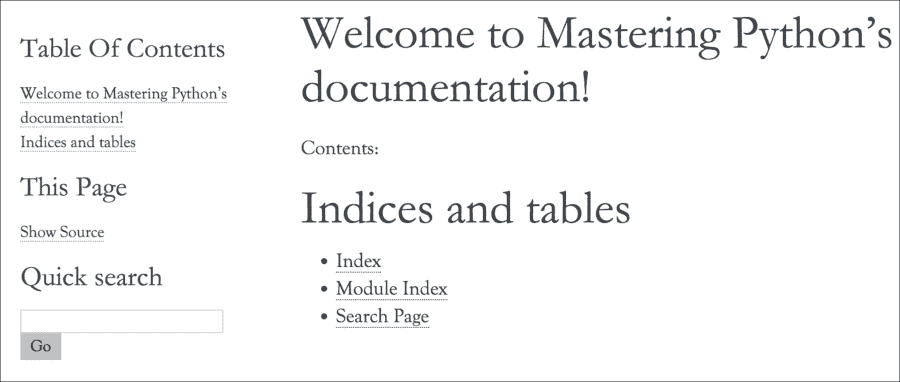

只需一个命令和回答几个问题，我们现在就有了一个文档项目，所有页面都有索引、搜索和目录。

除了 HTML 输出，默认情况下还支持许多其他格式，尽管有些格式需要外部库才能实际工作：

```py
# make
Please use `make <target>' where <target> is one of
 html       to make standalone HTML files
 dirhtml    to make HTML files named index.html in directories
 singlehtml to make a single large HTML file
 pickle     to make pickle files
 json       to make JSON files
 htmlhelp   to make HTML files and a HTML help project
 qthelp     to make HTML files and a qthelp project
 applehelp  to make an Apple Help Book
 devhelp    to make HTML files and a Devhelp project
 epub       to make an epub
 latex      to make LaTeX files, you can set PAPER=a4 or ...
 latexpdf   to make LaTeX files and run them through pdflatex
 latexpdfja to make LaTeX files and run them through platex/...
 text       to make text files
 man        to make manual pages
 texinfo    to make Texinfo files
 info       to make Texinfo files and run them through makeinfo
 gettext    to make PO message catalogs
 changes    to make an overview of all changed/added/deprecate...
 xml        to make Docutils-native XML files
 pseudoxml  to make pseudoxml-XML files for display purposes
 linkcheck  to check all external links for integrity
 doctest    to run all doctests embedded in the documentation
 coverage   to run coverage check of the documentation

```

### 使用斯芬克斯 apidoc

`sphinx-apidoc`命令通常与`sphinx-quickstart`一起使用。可以使用`--full`参数生成整个项目，但通常最好使用`sphinx-quickstart`生成整个项目，并使用`sphinx-apidoc`简单地添加 API 文档。为了正确演示`sphinx-apidoc`命令，我们需要一些 Python 文件，因此我们将在名为`h09`的项目中创建两个文件。

第一个是`h09/spam.py`，包含一个名为`Spam`的类，其中包含一些方法：

```py
class Spam(object):
 def __init__(self, arg, *args, **kwargs):
 pass

 def regular_method(self, arg):
 pass

 @classmethod
 def decorated_method(self, arg):
 pass

 def _hidden_method(self):
 pass

```

接下来我们有一个`h09/eggs.py`包含继承`Spam`的`Eggs`类：

```py
import spam

class Eggs(spam.Spam):
 def regular_method(self):
 '''This regular method overrides
 :meth:`spam.Spam.regular_method`
 '''
 pass

```

现在我们有了源文件，现在是时候生成实际的 API 文档了：

```py
# sphinx-apidoc h09 -o docs
Creating file docs/eggs.rst.
Creating file docs/spam.rst.
Creating file docs/modules.rst.

```

仅此一点不足以将 API 包含在文档中。需要添加到`toctree`中。幸运的是，这很简单，只需将模块添加到`index.rst`文件中的`toctree`中即可，如下所示：

```py
.. toctree::
 :maxdepth: 2

 modules

```

本章后面将进一步详细讨论`toctree`指令。

我们还必须确保可以导入模块，否则 Sphinx 将无法读取 Python 文件。为此，我们只需将`h09`目录添加到`sys.path`；这可以放在`conf.py`文件中的任何位置：

```py
import os
sys.path.insert(0, os.path.join(os.path.abspath('..'), 'h09'))

```

现在是再次生成文档的时候了：

```py
cd docs
make html

```

再次打开`docs/_build/index.html`文件。为简洁起见，屏幕截图中将省略文档的重复部分。裁剪后的产量如下所示：

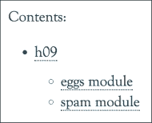

但它实际上产生了更多的信息。当运行`sphinx-apidoc`命令时，它递归地查看指定目录中的所有 Python 模块，并为每个模块生成一个`rst`文件。生成所有这些单独的文件后，它会将所有这些文件添加到名为`modules.rst`的文件中，这样就可以很容易地将它们添加到文档中。

`modules.rst`文件非常直截了当；只不过是一个以包名为标题的模块列表：

```py
h09
===

.. toctree::
 :maxdepth: 4

 eggs
 spam

```

输出如下：

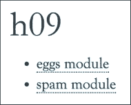

`spam.rst`和`eggs.rst`同样简单，但在定制方面更为重要。在这些文件中，它添加了 automodule 指令，该指令导入 Python 模块并列出方法。可以配置列出的方法，默认情况下，我们已经获得了非常有用的输出：

```py
eggs module
===========

.. automodule:: eggs
 :members:
 :undoc-members:
 :show-inheritance:

```

输出结果如下：


很漂亮，不是吗？几乎不需要任何努力就可以从大多数 Python 项目中生成所有这些。这样做的好处是，我们添加到`Eggs.regular_method`的文档立即添加到这里，继承的基础（`spam.Spam`是指向`spam.Spam`文档页面的可点击链接，`:func:`角色也使`spam.Spam.regular_method`立即可点击。

垃圾邮件模块的输出类似：

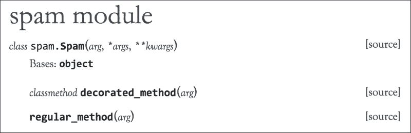

### 注

新文件不会自动添加到您的文档中。可以安全地重新运行`sphinx-apidoc`命令添加新文件，但不会更新现有文件。即使可以使用`--force`选项强制覆盖文件，但在现有文件中，我建议手动编辑它们。正如我们将在下一节中看到的，有很多原因需要在之后手动修改生成的文件。

## 斯芬克斯指令

Sphinx 在 StructuredText 中的默认指令之上添加了几个指令，并提供了一个简单的 API 来添加新指令。它们中的大多数通常与修改无关，但正如人们所期望的，Sphinx 有很好的文档，以防您需要了解更多。然而，我们将讨论一些非常常用的方法。

### 目录树指令（目录树）

这是斯芬克斯最重要的指示之一；生成`toctree`（目录树）。`toctree`指令有两个选项，但最重要的一个可能是`maxdepth`，它指定树需要走多深。`toctree`的顶层必须通过指定要读取的文件手动指定，但除此之外，文档中的每一层（章节、段落等）都可以是`toctree`中的另一层，具体取决于课程的深度。尽管`maxdepth`选项是可选的，但如果没有它，将显示所有可用的级别，这通常超出了要求。在大多数情况下，2 的`maxdepth`是一个很好的默认值，这使得基本示例如下所示：

```py
.. toctree::
 :maxdepth: 2

```

`toctree`中的项目是同一目录下的`.rst`文件，没有扩展名。这可以包括子目录，在这种情况下，目录之间用`.`（句点）分隔：

```py
.. toctree::
 :maxdepth: 2

 module.a
 module.b
 module.c

```

另一个非常有用的选项是`glob`选项。它告诉`toctree`使用 Python 中的`glob`模块自动添加与模式匹配的所有文档。只需添加一个带有`glob`模式的目录，就可以添加该目录中的所有文件。这使得我们之前的`toctree`简单到：

```py
.. toctree::
 :maxdepth: 2
 :glob:

 module.*

```

如果由于某种原因文档标题不是您想要的，您可以轻松地将标题更改为自定义标题：

```py
.. toctree::
 :maxdepth: 2

 The A module <module.a>

```

### Autodoc，记录 Python 模块、类和函数

Sphinx 最强大的功能是可以自动记录您的模块、类和函数。`sphinx-apidoc`命令已经为我们生成了其中一些，所以让我们使用`Spam`和`Eggs`类的文件稍微扩展文档。

`sphinx-apidoc`的原始结果为：

```py
eggs module
===========

.. automodule:: eggs
 :members:
 :undoc-members:
 :show-inheritance:

```

这表现为：


`Eggs`类目前只有一个函数。当然，我们可以轻松地点击父类，但在许多情况下，查看类中所有可用的函数是很有用的。因此，让我们添加从`Spam`继承的所有函数：

```py
eggs module
===========

.. automodule:: eggs
 :members:
 :undoc-members:
 :show-inheritance:
 :inherited-members:

```

结果如下：

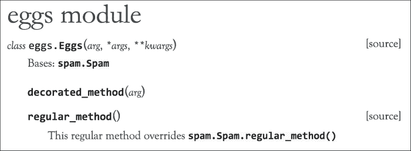

更多的已经有用了，但是我们仍然缺少隐藏的方法。让我们再加上私人会员：

```py
eggs module
===========

.. automodule:: eggs
 :members:
 :undoc-members:
 :show-inheritance:
 :inherited-members:
 :private-members:

```

输出结果如下：

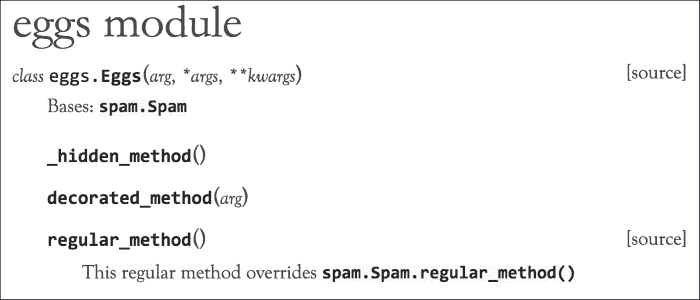

现在所有的方法都显示出来了，但是`members`选项呢？如果没有`members`选项或`*-members`选项，将无法再看到任何功能。

如果您想要拥有`Bases: ...`部分，那么`show-inheritance` 非常有用，这样就可以单击父类。

当然，也可以手动创建类。虽然这几乎没有实际用途，但它确实显示了 Sphinx 中 Python 类的内部结构。

然而，有一个实际案例，如果您正在动态创建类，那么`autodoc`将不能始终正确记录，需要一些额外的帮助。然而，还有更多，虽然它通常没有那么有用，因为你在做双重工作。在某些情况下，`autodoc`扩展无法正确识别类的成员。例如，在动态类/函数生成的情况下也是如此。在这种情况下，向模块/类/函数添加一些手动文档可能会很有用：

```py
eggs module
===========

.. automodule:: eggs
 :members:
 :undoc-members:
 :show-inheritance:

 .. class:: NonExistingClass
 This class doesn't actually exist, but it's in the documentation now.

 .. method:: non_existing_function()

 And this function does not exist either.

```

输出结果如下：


如果在所有可能的情况下，我会避免这种用法。Sphinx 的最大好处是它可以自动为您生成大量文档。通过手动记录，您可能会产生比没有记录更糟糕的事情，那就是不正确的记录。这些语句主要用于元文档；记录类的外观，而不是实际的示例。

## 斯芬克斯角色

我们已经看到了斯芬克斯指令，它们是独立的块。现在我们将讨论 Sphinx 角色，它可以在线使用。角色允许您告诉 Sphinx 如何解析某些输入。这些角色的示例包括链接、数学、代码和标记。但最重要的是 Sphinx 域中的角色，用于引用其他类，甚至用于外部项目。在 Sphinx 中，默认域是 Python 域，因此像`:py:meth:`这样的角色也可以用作`:meth:`。这些角色对于链接到不同的包、模块、类、方法和其他对象非常有用。基本用法非常简单。要链接到类，请使用以下命令：

```py
Spam: :class:`spam.Spam`

```

输出为：


几乎所有其他对象、函数、异常、属性等也是如此。Sphinx文档提供了受支持对象的列表：[http://sphinx-doc.org/domains.html#cross-引用 python 对象](http://sphinx-doc.org/domains.html#cross-referencing-python-objects)。

Sphinx 的更好的特性之一是这实际上也可以跨项目进行，在标准 Python 文档中添加对`int`对象的引用很容易使用`:obj:`int``实现。在其他站点上添加对您自己项目的引用也是相当简单的。也许你还记得`sphinx-quickstart`剧本中的`intersphinx`问题：

```py
> intersphinx: link between Sphinx documentation
 of different projects (y/n) [n]: y

```

这使得外部 Sphinx 文档和本地文档之间的交叉引用成为可能。使用`intersphinx`您几乎可以毫不费力地在项目之间添加链接。`conf.py`中的`intersphinx_mapping`标准有点局限：

```py
intersphinx_mapping = {'https://docs.python.org/': None}

```

但是，它可以轻松地扩展到其他文档站点：

```py
intersphinx_mapping = {
 'https://docs.python.org/': None,
 'sphinx': ('http://sphinx-doc.org/', None),
}

```

现在，我们可以轻松链接到 Sphinx 主页上的文档：

```py
Link to the intersphinx module: :mod:`sphinx.ext.intersphinx`

```

输出结果如下：


此链接将链接到[http://www.sphinx-doc.org/en/stable/ext/intersphinx.html](http://www.sphinx-doc.org/en/stable/ext/intersphinx.html) 。

# 文件化代码

Sphinx 目前支持三种不同的文档样式：最初的 Sphinx 样式和最近的 NumPy 和 Google 样式。他们之间的差异主要是在风格上，但实际上比这稍微多一些。

Sphinx 样式是使用一系列重新构造的文本角色开发的，这是一种非常有效的方法，但如果使用太多，可能会对可读性造成不利影响。您可能知道以下内容的作用，但这不是最好的语法：

```py
:param amount: The amount of eggs to return
:type amount: int

```

谷歌风格是（顾名思义）由谷歌开发的。目标是提供一种简单/可读的格式，既可以在代码文档中使用，也可以在 Sphinx 中进行解析。在我看来，这更接近于 StructuredText 的原始想法，这种格式非常接近于您本能地记录文档的方式。此示例与前面显示的斯芬克斯样式示例具有相同的含义：

```py
Args:
 amount (int): The amount of eggs to return

```

NumPy 样式是专门为 NumPy 项目创建的。NumPy 项目有很多功能，包含大量文档，通常每个参数都有大量文档。它比谷歌格式略为冗长，但也很容易阅读：

```py
Parameters
----------
amount : int
 The amount of eggs to return

```

### 注

将来，使用 Python 3.5 类型提示注释，至少这些语法中的参数类型部分可能会变得无用。目前，Sphinx 还没有对注释的具体支持，因此必须通过文档使用显式类型暗示。但也许我们可以很快使用以下工具：

```py
def eggs(amount: int):
    pass
```

## 记录一个斯芬克斯风格的类

首先让我们看看传统风格，斯芬克斯风格。虽然很容易理解所有参数的含义，但它有点冗长，不那么可读。尽管如此，它还是非常清晰，而且绝对不是一种糟糕的风格：

```py
class Spam(object):
 '''
 The Spam object contains lots of spam

 :param arg: The arg is used for ...
 :type arg: str
 :param `*args`: The variable arguments are used for ...
 :param `**kwargs`: The keyword arguments are used for ...
 :ivar arg: This is where we store arg
 :vartype arg: str
 '''
 def __init__(self, arg, *args, **kwargs):
 self.arg = arg

 def eggs(self, amount, cooked):
 '''We can't have spam without eggs, so here's the eggs

 :param amount: The amount of eggs to return
 :type amount: int
 :param bool cooked: Should the eggs be cooked?
 :raises: :class:`RuntimeError`: Out of eggs

 :returns: A bunch of eggs
 :rtype: Eggs
 '''
 pass

```

以下为的输出：

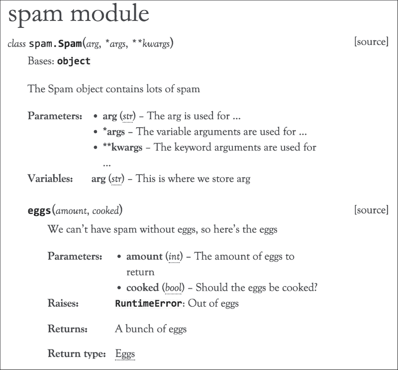

这确实是一个非常有用的输出，有文档化的函数、类和参数。更重要的是，这些类型也会被记录下来，从而产生一个指向实际类型的可点击链接。指定类型的另一个好处是，许多编辑器都理解文档，并根据给定的类型提供自动完成。

为了解释这里实际发生的事情，Sphinx 在 docstring 中有一些角色，这些角色为我们记录的内容提供提示。

与名称配对的`param`角色为具有该名称的参数设置文档。与名称配对的`type`角色告诉 Sphinx 参数的数据类型。这两个角色都是可选的，如果省略它们，参数将不会有任何添加的文档，但是任何文档显示都需要`param`角色。简单地添加`type`角色而不添加`param`角色将不会产生任何输出，因此请注意始终将它们配对。

`returns`角色与`param`角色在文档方面类似。`param`角色记录参数，`returns`角色记录返回的对象。然而，它们略有不同。与`param`角色相反，`returns`角色不依赖`rtype`角色，反之亦然。它们都独立工作，因此可以使用其中一个或两个角色。

正如您可以预期的那样，`rtype`告诉 Sphinx（和几个编辑器）函数返回的对象类型是什么。

## 用谷歌风格记录一个类

谷歌风格只是斯芬克斯风格文档的一个更清晰的版本。它实际上并不支持更多或更少，但使用起来更直观。唯一需要记住的是，这是斯芬克斯最近的一个特征。对于旧版本，您需要安装`sphinxcontrib-napoleon`软件包。现在它与 Sphinx 捆绑在一起，但仍然需要通过`conf.py`文件启用。因此，根据狮身人面像的版本（拿破仑是在狮身人面像 1.3 中添加的），您需要在`conf.py`中的扩展列表中添加`sphinx.ext.napoleon`或`sphinxcontrib.napoleon`。

一旦您正确配置了所有内容，我们就可以同时使用 Google 和 NumPy 样式。以下是`Spam`类的谷歌风格版本：

```py
class Spam(object):
 '''
 The Spam object contains lots of spam

 Args:
 arg (str): The arg is used for ...
 *args: The variable arguments are used for ...
 **kwargs: The keyword arguments are used for ...

 Attributes:
 arg (str): This is where we store arg,
 '''
 def __init__(self, arg, *args, **kwargs):
 self.arg = arg

 def eggs(self, amount, cooked):
 '''We can't have spam without eggs, so here's the eggs

 Args:
 amount (int): The amount of eggs to return
 cooked (bool): Should the eggs be cooked?

 Raises:
 RuntimeError: Out of eggs

 Returns:
 Eggs: A bunch of eggs
 '''
 pass

```

这是比斯芬克斯风格更容易在眼睛上使用，并且具有相同数量的可能性。但是，对于较长的参数文档，它并不方便。想象一下`amount`的多行描述会是什么样子。这就是 NumPy 风格被开发的原因，它的论点有很多文档。

## 用 NumPy 风格记录一个类

NumPy 风格是为了拥有大量文档。老实说，大多数人都太懒了，所以对于大多数项目来说，这并不合适。如果您确实计划拥有大量函数及其所有参数的文档，NumPy 样式可能是一个不错的选择。它比谷歌风格要详细一点，但非常清晰，尤其是有更详细的文档。请记住，与 Google 风格类似，这需要 Sphinx 的 Napoleon 扩展，因此请确保已安装 Sphinx1.3 或更高版本。以下是`Spam`类的 NumPy 版本：

```py
class Spam(object):
 '''
 The Spam object contains lots of spam

 Parameters
 ----------
 arg : str
 The arg is used for ...
 *args
 The variable arguments are used for ...
 **kwargs
 The keyword arguments are used for ...

 Attributes
 ----------
 arg : str
 This is where we store arg,
 '''
 def __init__(self, arg, *args, **kwargs):
 self.arg = arg

 def eggs(self, amount, cooked):
 '''We can't have spam without eggs, so here's the eggs

 Parameters
 ----------
 amount : int
 The amount of eggs to return
 cooked : bool
 Should the eggs be cooked?

 Raises
 ------
 RuntimeError
 Out of eggs

 Returns
 -------
 Eggs
 A bunch of eggs
 '''
 pass

```

虽然NumPy 风格绝对不错，但它只是非常冗长。仅此示例的长度约为备选方案的 1.5 倍。因此，对于更长、更详细的文档来说，这是一个很好的选择，但是如果你打算使用简短的文档，那就使用谷歌风格吧。

## 选择哪种款式

对于大多数项目来说，谷歌风格是最好的选择，因为它可读性强，但不太冗长。如果您计划根据参数使用大量文档，那么 NumPy 样式也可能是一个不错的选择。

选择斯芬克斯风格的唯一原因是传统。尽管谷歌风格可能更清晰，但一致性更为重要。

# 总结

文档可以极大地提高项目的受欢迎程度，而糟糕的文档可能会降低生产率。我认为，对于第三方的使用，库中没有几个方面比文档更具影响力。因此，在许多情况下，文档是决定项目使用情况的一个比实际代码质量更重要的因素。这就是为什么总是尝试提供一些文档是非常重要的。

使用 Sphinx，生成文档实际上很容易。只需几分钟的时间，您就可以拥有一个功能齐全的网站，提供文档、PDF、ePub 或其他多种输出格式之一。真的没有理由再没有文档了。即使您自己不经常使用文档，向编辑器提供类型提示也可以大大提高工作效率。让你的编辑更聪明应该总是有助于提高工作效率。例如，我在几个项目中添加了类型提示，只是为了提高我的工作效率。

下一章将解释如何在 Python 中测试代码，文档的某些部分将返回到这里。使用`doctest`可以将示例代码、文档和测试集于一身。