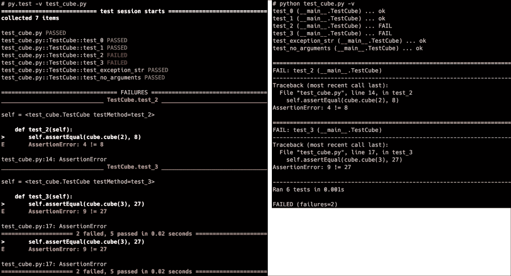

# 十、测试和日志记录——为 bug 做准备

在编程时，大多数开发人员都会进行一些规划，并立即继续编写代码。毕竟，我们都希望编写无 bug 的代码！不幸的是，我们没有。在某个时刻，一个错误的假设，一个误解，或者仅仅是一个愚蠢的错误肯定会发生。调试（包括在[第 11 章](111.html "Chapter 11. Debugging – Solving the Bugs")中，*调试-解决错误*在某些时候总是需要的，但是有几种方法可以用来防止错误，或者至少在错误发生时更容易解决。

为了从一开始就防止 bug 的发生，测试驱动的开发，或者至少是功能/回归/单元测试是非常有用的。仅标准 Python 安装就提供了几个选项，如`doctest`、`unittest`和`test`模块。`doctest`模块允许您将测试与示例文档相结合。`unittest`模块允许您轻松编写回归测试。`test`模块仅供内部使用，因此除非您计划修改 Python 核心，否则您可能不需要这个模块。

我们将在本章中讨论的测试模块包括：

*   `doctest`
*   `py.test`（为什么比`unittest`更方便）
*   `unittest.mock`

`py.test`模块的用途与`unittest`模块大致相同，但使用更方便，并且有一些额外的选项。

在学习了如何避免这些 bug 之后，是时候看看日志了，这样我们就可以检查程序中发生了什么以及为什么会发生。Python 中的日志模块是高度可配置的，可以针对几乎任何用例进行调整。如果您曾经编写过 Java 代码，您应该对`logging`模块感到很熟悉，因为它的设计主要基于`log4j`模块，并且在实现和命名方面非常相似。后者也使得它在 Python 中有点奇怪，因为它是少数几个不遵循`pep8`命名标准的模块之一。

本章将解释以下主题：

*   使用`doctest`将文档与测试相结合
*   使用`py.test`和`unittest`进行回归和单元测试
*   使用`unittest.mock`使用假对象进行测试
*   有效使用`logging`模块
*   结合`logging`和`py.test`

# 使用 doctest 的示例作为测试

`doctest`模块是 Python 中最有用的模块之一。它允许您将记录代码与测试结合起来，以确保代码按预期的方式工作。

## 一个简单的医生测试例子

让我们从一个简单的例子开始：一个对输入进行平方运算的函数。下面的示例是一个功能齐全的命令行应用，它不仅包含代码，还包含功能测试。前几个测试涵盖了正常执行时函数的行为，然后是几个测试以演示预期错误：

```py
def square(n):
 '''
 Returns the input number, squared

 >>> square(0)
 0
 >>> square(1)
 1
 >>> square(2)
 4
 >>> square(3)
 9
 >>> square()
 Traceback (most recent call last):
 ...
 TypeError: square() missing 1 required positional argument: 'n'
 >>> square('x')
 Traceback (most recent call last):
 ...
 TypeError: can't multiply sequence by non-int of type 'str'

 Args:
 n (int): The number to square

 Returns:
 int: The squared result
 '''
 return n * n

if __name__ == '__main__':
 import doctest
 doctest.testmod()

```

它可以作为任何 Python 脚本执行，但是常规命令不会给出任何输出，因为所有测试都是成功的。`doctest.testmod`函数采用详细参数，幸运的是：

```py
# python square.py -v
Trying:
 square(0)
Expecting:
 0
ok
Trying:
 square(1)
Expecting:
 1
ok
Trying:
 square(2)
Expecting:
 4
ok
Trying:
 square(3)
Expecting:
 9
ok
Trying:
 square()
Expecting:
 Traceback (most recent call last):
 ...
 TypeError: square() missing 1 required positional argument: 'n'
ok
Trying:
 square('x')
Expecting:
 Traceback (most recent call last):
 ...
 TypeError: can't multiply sequence by non-int of type 'str'
ok
1 items had no tests:
 __main__
1 items passed all tests:
 6 tests in __main__.square
6 tests in 2 items.
6 passed and 0 failed.
Test passed.

```

此外，由于使用了 Google 语法（如[第 9 章](109.html "Chapter 9. Documentation – How to Use Sphinx and reStructuredText")、*文档–如何使用 Sphinx 和RST*、【文档章节】中所述），我们可以使用 Sphinx 生成漂亮的文档：


当然，代码并不总是正确的。如果我们修改代码使测试不再通过，会发生什么？

这一次，我们使用的不是`n * n`，而是`n ** 2`。两者都是平方数，对吗？所以结果必须是一致的。正当这些是产生 bug 的假设类型，以及使用一些基本测试很难捕捉到的假设类型：

```py
def square(n):
 '''
 Returns the input number, squared

 >>> square(0)
 0
 >>> square(1)
 1
 >>> square(2)
 4
 >>> square(3)
 9
 >>> square()
 Traceback (most recent call last):
 ...
 TypeError: square() missing 1 required positional argument: 'n'
 >>> square('x')
 Traceback (most recent call last):
 ...
 TypeError: can't multiply sequence by non-int of type 'str'

 Args:
 n (int): The number to square

 Returns:
 int: The squared result
 '''
 return n ** 2

if __name__ == '__main__':
 import doctest
 doctest.testmod()

```

那么让我们再次执行测试，看看这次会发生什么。为简洁起见，这次我们将跳过详细标志：

```py
# python square.py
**********************************************************************
File "square.py", line 17, in __main__.square
Failed example:
 square('x')
Expected:
 Traceback (most recent call last):
 ...
 TypeError: can't multiply sequence by non-int of type 'str'
Got:
 Traceback (most recent call last):
 File "doctest.py", line 1320, in __run
 compileflags, 1), test.globs)
 File "<doctest __main__.square[5]>", line 1, in <module>
 square('x')
 File "square.py", line 28, in square
 return n ** 2
 TypeError: unsupported operand type(s) for ** or pow(): 'str' and 'int'
**********************************************************************
1 items had failures:
 1 of   6 in __main__.square
***Test Failed*** 1 failures.

```

我们对代码所做的唯一修改是将`n * n`替换为`n ** 2`，这将转换为幂函数。由于乘法与取一个数的幂不同，结果略有不同，但在实践中非常相似，大多数程序员都不会注意到这一差异。

代码更改造成的唯一区别是，我们现在有了一个不同的异常—一个无辜的错误，只是在这种情况下破坏了测试。但它表明了这些测试是多么有用。在重写代码时，很容易做出错误的假设，而这就是测试最有用的地方，知道您在破译代码时就破译了代码，而不是几个月后才发现。

## 撰写博士论文

也许，您已经从前面的示例中注意到，语法与常规 Python 控制台非常相似，这正是重点所在。`doctest`输入只不过是常规 Python shell 会话的输出。这就是为什么使用该模块进行测试如此直观；只需在 Python 控制台中编写代码并将输出复制到 docstring 中即可获得测试。以下是一个例子：

```py
# python
>>> from square import square
>>> square(5)
25
>>> square()
Traceback (most recent call last):
 File "<stdin>", line 1, in <module>
TypeError: square() missing 1 required positional argument: 'n'

```

这就是为什么这可能是测试代码最简单的方法。几乎不费吹灰之力，您就可以检查代码是否按预期工作，同时添加测试和文档。只需将解释器的输出复制到函数或类文档中，就有了功能正常的 doctest。

## 使用纯文档进行测试

函数、类和模块中的 docstring 通常是向代码中添加 doctest 的最明显的方式，但它们不是唯一的方式。正如我们在上一章中讨论的，Sphinx 文档也支持`doctest`模块。您可能还记得，在创建 Sphinx 项目时，我们启用了`doctest`模块：

```py
> doctest: automatically test code snippets in doctest blocks (y/n) [n]:y

```

此标志启用 Sphinx 中的`sphinx.ext.doctest`扩展，它告诉 Sphinx 也运行这些测试。由于并非代码中的所有示例都有用，让我们看看是否可以将它们分为实际有用的示例和仅与文档相关的示例。此外，为了查看结果，我们将在文档中添加一个错误：

**square.py**

```py
def square(n):
 '''
 Returns the input number, squared

 >>> square(2)
 4

 Args:
 n (int): The number to square

 Returns:
 int: The squared result
 '''
 return n * n

if __name__ == '__main__':
 import doctest
 doctest.testmod()

```

**square.rst**

```py
square module
=============

.. automodule:: square
 :members:
 :undoc-members:
 :show-inheritance:

Examples:

.. testsetup::

 from square import square

.. doctest::

 >>> square(100)

 >>> square(0)
 0
 >>> square(1)
 1
 >>> square(3)
 9
 >>> square()
 Traceback (most recent call last):
 ...
 TypeError: square() missing 1 required positional argument: 'n'
 >>> square('x')
 Traceback (most recent call last):
 ...
 TypeError: can't multiply sequence by non-int of type 'str'

```

现在，是执行测试的时候了。对于狮身人面像，有一个特定的命令：

```py
# make doctest
sphinx-build -b doctest -d _build/doctrees . _build/doctest
Running Sphinx v1.3.3
loading translations [en]... done
loading pickled environment... done
building [mo]: targets for 0 po files that are out of date
building [doctest]: targets for 3 source files that are out of date
updating environment: 0 added, 0 changed, 0 removed
looking for now-outdated files... none found
running tests...

Document: square
----------------
**********************************************************************
File "square.rst", line 16, in default
Failed example:
 square(100)
Expected nothing
Got:
 10000
**********************************************************************
1 items had failures:
 1 of   7 in default
7 tests in 1 items.
6 passed and 1 failed.
***Test Failed*** 1 failures.

Doctest summary
===============
 7 tests
 1 failure in tests
 0 failures in setup code
 0 failures in cleanup code
build finished with problems.
make: *** [doctest] Error 1

```

正如预期的那样，我们得到了一个不完整的`doctest`错误，但除此之外，所有测试都正确执行。为了确保测试知道什么是`square`，我们必须添加`testsetup`指令，这仍然会生成一个漂亮的输出：


## 博士旗

`doctest`模块具有多个选项标志。它们影响`doctest`处理测试的方式。这些选项标志可以通过您的测试套件、运行测试时的命令行参数和内联命令全局传递。对于本书，我通过`pytest.ini`文件全局启用了以下选项标志（我们将在本章后面介绍有关`py.test`的更多内容）：

```py
doctest_optionflags = ELLIPSIS NORMALIZE_WHITESPACE

```

如果没有这些选项标志，本书中的一些示例将无法正常运行。这是因为它们必须重新格式化以适应。下面几段将介绍以下选项标志：

*   `DONT_ACCEPT_TRUE_FOR_1`
*   `NORMALIZE_WHITESPACE`
*   `ELLIPSIS`

有几个其他选项标志可用，其有用性程度各不相同，但最好留给 Python 文档：

[https://docs.python.org/3/library/doctest.html#option-旗帜](https://docs.python.org/3/library/doctest.html#option-flags)

### 对与错对 1 和 0

对`1`进行`True`评估和对`0`进行`False`评估在大多数情况下都是有用的，但这可能会产生意外的结果。为了说明差异，我们有以下几行：

```py
'''
>>> False
0
>>> True
1
>>> False  # doctest: +DONT_ACCEPT_TRUE_FOR_1
0
>>> True  # doctest: +DONT_ACCEPT_TRUE_FOR_1
1
'''

if __name__ == '__main__':
 import doctest
 doctest.testmod()

```

以下是`DONT_ACCEPT_TRUE_FOR_1`标志的结果：

```py
# python test.py
**********************************************************************
File "test.py", line 6, in __main__
Failed example:
 False  # doctest: +DONT_ACCEPT_TRUE_FOR_1
Expected:
 0
Got:
 False
**********************************************************************
File "test.py", line 8, in __main__
Failed example:
 True  # doctest: +DONT_ACCEPT_TRUE_FOR_1
Expected:
 1
Got:
 True
**********************************************************************
1 items had failures:
 2 of   4 in __main__
***Test Failed*** 2 failures.

```

正如您所看到的，`DONT_ACCEPT_TRUE_FOR_1`标志将`doctest`拒绝`1`作为`True`的有效响应，以及`0`作为`False`的有效响应。

### 规范化空白

由于 doctest 同时用于文档和测试目的，因此保持其可读性几乎是一项要求。但是，如果不规范化空白，这可能会很棘手。考虑下面的例子：

```py
>>> [list(range(5)) for i in range(5)]
[[0, 1, 2, 3, 4], [0, 1, 2, 3, 4], [0, 1, 2, 3, 4], [0, 1, 2, 3, 4], [0, 1, 2, 3, 4]]

```

虽然没有那么糟糕，但这个输出的可读性并不是最好的。使用空白规范化，我们可以做以下几点：

```py
>>> [list(range(5)) for i in range(5)]  # doctest: +NORMALIZE_WHITESPACE
[[0, 1, 2, 3, 4],
 [0, 1, 2, 3, 4],
 [0, 1, 2, 3, 4],
 [0, 1, 2, 3, 4],
 [0, 1, 2, 3, 4]]

```

以这种方式格式化输出既更具可读性，又便于减少行长度。

### 省略号

`ELLIPSIS`标志非常有用，但也有点危险，因为它很容易导致错误匹配。它使`...`匹配任何子字符串，这对异常非常有用，但在其他情况下很危险：

```py
>>> {10: 'a', 20: 'b'}  # doctest: +ELLIPSIS
{...}
>>> [True, 1, 'a']  # doctest: +ELLIPSIS
[...]
>>> True,  # doctest: +ELLIPSIS
(...)
>>> [1, 2, 3, 4]  # doctest: +ELLIPSIS
[1, ..., 4]
>>> [1, 0, 0, 0, 0, 0, 4]  # doctest: +ELLIPSIS
[1, ..., 4]

```

这些案例在实际场景中并不太有用，但它们展示了选项标志的功能。它们也表明了危险。`[1, 2, 3, 4]`和`[1, 0, ... , 4]`都符合`[1, ..., 4]`测试，这可能是无意的，所以使用`ELLIPSIS`时要非常小心。

更有用的情况是记录类实例时：

```py
>>> class Spam(object):
...     pass
>>> Spam()  # doctest: +ELLIPSIS
<__main__.Spam object at 0x...>

```

如果没有`ELLIPSIS`标志，`0x...`部分的内存地址将永远不会是您所期望的。让我们演示在普通 CPython 实例中的实际运行：

```py
Failed example:
 Spam()
Expected:
 <__main__.Spam object at 0x...>
Got:
 <__main__.Spam object at 0x10d9ad160>

```

## 医生的怪癖

前面讨论的三个选项标志解决了 doctests 中发现的许多怪癖，但还有几个案例需要注意。在这些情况下，您只需要稍微小心一点，绕过`doctest`模块的限制。`doctest`模块有效地使用了表示字符串，这些字符串并不总是一致的。

最重要的情况是浮点不准确、字典和随机值，如计时器。以下示例大部分时间都会失败，因为 Python 中的某些类型没有一致的顺序，并且依赖于外部变量：

```py
>>> dict.fromkeys('spam')
{'s': None, 'p': None, 'a': None, 'm': None}
>>> 1./7.
0.14285714285714285

>>> import time
>>> time.time() - time.time()
-9.5367431640625e-07

```

所有的问题都有几种可能的解决方案，它们在风格和你的个人偏好上有很大的不同。

### 测试词典

字典的问题是它们在内部被实现为哈希表，导致有效的随机表示顺序。因为`doctest`系统需要一个与`docstring`含义相同的表示字符串（当然，除了某些`doctest`标志），所以这不起作用。当然，有几种解决方案可用，并且都有一些优点和缺点。

第一种方法是使用`pprint`库以漂亮的方式对其进行格式化：

```py
>>> import pprint
>>> data = dict.fromkeys('spam')
>>> pprint.pprint(data)
{'a': None, 'm': None, 'p': None, 's': None}

```

由于`pprint`库总是在输出前对项目进行排序，这就解决了随机表示顺序的问题。然而，它确实需要一个额外的导入和函数调用，这是一些人喜欢避免的。

另一个选项是对项目进行手动排序：

```py
>>> data = dict.fromkeys('spam')
>>> sorted(data.items())
[('a', None), ('m', None), ('p', None), ('s', None)]

```

这里的缺点是，从输出中看不到`data`是一个字典，这使得输出的可读性降低。

最后，将`dict`与由相同元素组成的不同`dict`进行比较同样有效：

```py
>>> data = dict.fromkeys('spam')
>>> data == {'a': None, 'm': None, 'p': None, 's': None}
True

```

当然，这是一个非常好的解决方案！但是`True`并不是最清晰的输出，尤其是当比较不起作用时：

```py
Failed example:
 data == {'a': None, 'm': None, 'p': None}
Expected:
 True
Got:
 False

```

另一方面，前面提到的其他选项正确显示了期望值和返回值：

```py
Failed example:
 sorted(data.items())
Expected:
 [('a', None), ('m', None), ('p', None)]
Got:
 [('a', None), ('m', None), ('p', None), ('s', None)]

Failed example:
 pprint.pprint(data)
Expected:
 {'a': None, 'm': None, 'p': None}
Got:
 {'a': None, 'm': None, 'p': None, 's': None}

```

就个人而言，在提出的解决方案中，我建议使用`pprint`，因为我认为它是最具可读性的解决方案，但所有的解决方案都有一些优点。

### 测试浮点数

由于与浮点比较可能有问题（即`1/3 == 0.333`）的原因相同，表示字符串比较也有问题。最简单的解决方案是简单地在代码中添加一些舍入/剪裁，但这里也可以选择`ELLIPSIS`标志。以下是几种解决方案的列表：

```py
>>> 1/3  # doctest: +ELLIPSIS
0.333...
>>> '%.3f' % (1/3)
'0.333'
>>> '{:.3f}'.format(1/3)
'0.333'
>>> round(1/3, 3)
0.333
>>> 0.333 < 1/3 < 0.334
True

```

当`ELLIPSIS`选项标志以任何方式全局启用时，这将是最明显的解决方案。在其他情况下，我推荐一种替代解决方案。

### 次数和持续时间

对于计时，您将遇到的问题与非常类似于浮点问题。当测量代码段的持续时间执行时间时，总会出现一些变化。这就是为什么最稳定的测试解决方案（包括时间）限制了精度，尽管这也不能保证。无论如何，最简单的解决方案检查两次之间的增量是否小于某个数字，如下所示：

```py
>>> import time
>>> a = time.time()
>>> b = time.time()
>>> (b - a) < 0.01
True

```

然而，对于`timedelta`对象，它稍微复杂一些。然而，这正是`ELLIPSIS`标志再次派上用场的地方：

```py
>>> import datetime
>>> a = datetime.datetime.now()
>>> b = datetime.datetime.now()
>>> str(b - a)  # doctest: +ELLIPSIS
'0:00:00.000...

```

`ELLIPSIS`选项标志的替代方法是分别比较`timedelta`中的天、小时、分钟和微秒。

在后面的一段中，我们将看到使用模拟对象解决此类问题的完全稳定的解决方案。然而，对于医生来说，这通常是过分的。

# 用 py.test 测试

`py.test`工具使编写和运行测试变得非常容易。还有一些其他的选项，比如`nose`和捆绑的`unittest`模块，但是`py.test`库提供了非常好的可用性和主动开发的结合。在过去，我是一个狂热的`nose`用户，但后来改用了`py.test`，因为它更易于使用，并且至少以我的经验来看，它有更好的社区支持。不管怎样，`nose`仍然是一个不错的选择，如果您已经在使用它，那么几乎没有理由切换并重写所有测试。然而，当为一个新项目编写测试时，`py.test`可以方便得多。

现在，我们将使用`py.test`从前面讨论的`square.py`文件运行 doctests。

首先，从安装`py.test`开始，当然：

```py
pip install pytest

```

现在您可以进行一次测试运行，让我们尝试一下`square.py`中的博士测试：

```py
# py.test --doctest-modules -v square.py
======================== test session starts ========================
platform darwin -- Python 3.5.1, pytest-2.8.2, py-1.4.30, pluggy-0.3.1 -- python3.5
cachedir: .cache
rootdir: code, inifile: pytest.ini
collected 1 items

square.py::square.square PASSED

===================== 1 passed in 0.02 seconds ======================

```

## 单元测试和 py.test 输出之间的差异

我们在`square.py`中有博士。让我们创建一个名为`cube`的新类，并在代码之外创建一组适当的测试。

首先，我们有代码`cube.py`，与`square.py`类似，但减去博士，因为我们不再需要他们：

```py
def cube(n):
 '''
 Returns the input number, cubed

 Args:
 n (int): The number to cube

 Returns:
 int: The cubed result
 '''
 return n ** 3

```

现在让我们从`unittest`示例`test_cube.py`开始：

```py
import cube
import unittest

class TestCube(unittest.TestCase):
 def test_0(self):
 self.assertEqual(cube.cube(0), 0)

 def test_1(self):
 self.assertEqual(cube.cube(1), 1)

 def test_2(self):
 self.assertEqual(cube.cube(2), 8)

 def test_3(self):
 self.assertEqual(cube.cube(3), 27)

 def test_no_arguments(self):
 with self.assertRaises(TypeError):
 cube.cube()

 def test_exception_str(self):
 with self.assertRaises(TypeError):
 cube.cube('x')

if __name__ == '__main__':
 unittest.main()

```

这可以通过执行文件本身来执行：

```py
# python test_cube.py -v
test_0 (__main__.TestCube) ... ok
test_1 (__main__.TestCube) ... ok
test_2 (__main__.TestCube) ... ok
test_3 (__main__.TestCube) ... ok
test_exception_str (__main__.TestCube) ... ok
test_no_arguments (__main__.TestCube) ... ok

----------------------------------------------------------------------
Ran 6 tests in 0.001s

OK

```

也可以通过模块进行：

```py
# python -m unittest -v test_cube.py
test_0 (test_cube.TestCube) ... ok
test_1 (test_cube.TestCube) ... ok
test_2 (test_cube.TestCube) ... ok
test_3 (test_cube.TestCube) ... ok
test_exception_str (test_cube.TestCube) ... ok
test_no_arguments (test_cube.TestCube) ... ok

----------------------------------------------------------------------
Ran 6 tests in 0.001s

OK

```

这是通过`py.test`实现的：

```py
# py.test -v test_cube.py
====================== test session starts ======================
platform darwin -- Python 3.5.1, pytest-2.8.5, py-1.4.31, pluggy-0.3.1 -- python3.5
cachedir: ../.cache
rootdir: code, inifile: pytest.ini
collected 6 items

test_cube.py::TestCube::test_0 PASSED
test_cube.py::TestCube::test_1 PASSED
test_cube.py::TestCube::test_2 PASSED
test_cube.py::TestCube::test_3 PASSED
test_cube.py::TestCube::test_exception_str PASSED
test_cube.py::TestCube::test_no_arguments PASSED

=================== 6 passed in 0.02 seconds ====================

```

我们甚至还有`nose`：

```py
# nosetests -v test_cube.py
test_0 (test_cube.TestCube) ... ok
test_1 (test_cube.TestCube) ... ok
test_2 (test_cube.TestCube) ... ok
test_3 (test_cube.TestCube) ... ok
test_exception_str (test_cube.TestCube) ... ok
test_no_arguments (test_cube.TestCube) ... ok

----------------------------------------------------------------------
Ran 6 tests in 0.001s

OK

```

只要所有结果都成功，`unittest`和`py.test`之间的差异很小。在`unittest`和`nose`的情况下，结果是相同的。然而，这一次，我们将打破代码，在实际重要的时候显示差异。我们将添加`square`代码，而不是`cube`代码。所以从`square`返回`n ** 2`而不是`n ** 3`。

首先，我们有常规的`unittest`输出：

```py
# python test_cube.py -v
test_0 (__main__.TestCube) ... ok
test_1 (__main__.TestCube) ... ok
test_2 (__main__.TestCube) ... FAIL
test_3 (__main__.TestCube) ... FAIL
test_exception_str (__main__.TestCube) ... ok
test_no_arguments (__main__.TestCube) ... ok

======================================================================
FAIL: test_2 (__main__.TestCube)
----------------------------------------------------------------------
Traceback (most recent call last):
 File "test_cube.py", line 13, in test_2
 self.assertEqual(cube.cube(2), 8)
AssertionError: 4 != 8

======================================================================
FAIL: test_3 (__main__.TestCube)
----------------------------------------------------------------------
Traceback (most recent call last):
 File "test_cube.py", line 16, in test_3
 self.assertEqual(cube.cube(3), 27)
AssertionError: 9 != 27

----------------------------------------------------------------------
Ran 6 tests in 0.001s

FAILED (failures=2)

```

并非所有的都那么糟糕，因为每个测试都会返回一个不错的堆栈跟踪，其中包括值和所有内容。然而，与`py.test`运行相比，我们可以观察到一个小差异：

```py
# py.test -v test_cube.py
======================= test session starts ========================
platform darwin -- Python 3.5.1, pytest-2.8.5, py-1.4.31, pluggy-0.3.1 -- python3.5
cachedir: ../.cache
rootdir: code, inifile: pytest.ini
collected 6 items

test_cube.py::TestCube::test_0 PASSED
test_cube.py::TestCube::test_1 PASSED
test_cube.py::TestCube::test_2 FAILED
test_cube.py::TestCube::test_3 FAILED
test_cube.py::TestCube::test_exception_str PASSED
test_cube.py::TestCube::test_no_arguments PASSED

============================= FAILURES =============================
_________________________ TestCube.test_2 __________________________

self = <test_cube.TestCube testMethod=test_2>

 def test_2(self):
>       self.assertEqual(cube.cube(2), 8)
E       AssertionError: 4 != 8

test_cube.py:13: AssertionError
_________________________ TestCube.test_3 __________________________

self = <test_cube.TestCube testMethod=test_3>

 def test_3(self):
>       self.assertEqual(cube.cube(3), 27)
E       AssertionError: 9 != 27

test_cube.py:16: AssertionError
================= 2 failed, 4 passed in 0.03 seconds ================

```

在像这样的小例子中，差异并不明显，但是当测试具有大堆栈跟踪的复杂代码时，它变得更加有用。然而，对我个人来说，看到周围的测试代码是一个很大的优势。在刚才讨论的示例中，`self.assertEqual(...)`行显示了整个测试，但在许多其他情况下，您将需要更多信息。常规的`unittest`模块和`py.test`模块之间的区别在于，您可以通过所有代码和输出看到整个函数。在本章的后面部分，我们将看到在编写更高级的测试时，这是多么强大。

要真正欣赏`py.test`输出，我们还需要启用颜色。当然，颜色取决于您的本地配色方案，但至少可以并排查看一次，如下所示：



也许你现在想知道，`py.test`和`unittest`之间的唯一区别是颜色和输出略有不同？嗯，远不止如此，还有许多其他的差异，但仅此一点就足以让我们尝试一下。

## 单元测试与 py.test 测试的区别

改进后的输出确实有所帮助，但改进后的输出和更简单的测试编写方法的结合使`py.test`如此有用。有很多方法可以使测试更简单、更易读，在很多情况下，您可以选择自己喜欢的方法。和往常一样，可读性很重要，所以明智地选择，尽量不要过度设计解决方案。

### 简化断言

当单元测试库需要使用`self.assertEqual`来比较变量时，`py.test`使用了一些魔法，允许使用常规`assert`语句进行更简单的测试。

以下测试文件包含这两种类型的测试，因此可以轻松比较它们：

```py
import cube
import pytest
import unittest

class TestCube(unittest.TestCase):
    def test_0(self):
        self.assertEqual(cube.cube(0), 0)

    def test_1(self):
        self.assertEqual(cube.cube(1), 1)

    def test_2(self):
        self.assertEqual(cube.cube(2), 8)

    def test_3(self):
        self.assertEqual(cube.cube(3), 27)

    def test_no_arguments(self):
        with self.assertRaises(TypeError):
            cube.cube()

    def test_exception_str(self):
        with self.assertRaises(TypeError):
            cube.cube('x')

class TestPyCube(object):
    def test_0(self):
        assert cube.cube(0) == 0

    def test_1(self):
        assert cube.cube(1) == 1

    def test_2(self):
        assert cube.cube(2) == 8

    def test_3(self):
        assert cube.cube(3) == 27

    def test_no_arguments(self):
        with pytest.raises(TypeError):
            cube.cube()

    def test_exception_str(self):
        with pytest.raises(TypeError):
            cube.cube('x')
```

那么我们做了什么？好吧，我们简单地用`assert ... == ...`替换`self.assertEqual`，用`with pytest.raises`替换`with self.assertRaises`。这确实是一个小的改进，但实际的好处可以从失败输出中看出。前两个使用`unittest`样式，后两个使用`py.test`样式：

```py
============================= FAILURES =============================
_________________________ TestCube.test_2 __________________________

self = <test_cube.TestCube testMethod=test_2>

 def test_2(self):
>       self.assertEqual(cube.cube(2), 8)
E       AssertionError: 4 != 8

test_cube.py:14: AssertionError
_________________________ TestCube.test_3 __________________________

self = <test_cube.TestCube testMethod=test_3>

 def test_3(self):
>       self.assertEqual(cube.cube(3), 27)
E       AssertionError: 9 != 27

test_cube.py:17: AssertionError
________________________ TestPyCube.test_2 _________________________

self = <test_cube.TestPyCube object at 0x107c7bef0>

 def test_2(self):
>       assert cube.cube(2) == 8
E       assert 4 == 8
E        +  where 4 = <function cube at 0x107bb7c80>(2)
E        +    where <function cube at 0x107bb7c80> = cube.cube

test_cube.py:36: AssertionError
________________________ TestPyCube.test_3 _________________________

self = <test_cube.TestPyCube object at 0x107c56a90>

 def test_3(self):
>       assert cube.cube(3) == 27
E       assert 9 == 27
E        +  where 9 = <function cube at 0x107bb7c80>(3)
E        +    where <function cube at 0x107bb7c80> = cube.cube

test_cube.py:39: AssertionError
================ 4 failed, 8 passed in 0.05 seconds ================

```

因此，在中，除了看到被比较的值外，我们还可以看到被调用的函数以及它接收到的输入参数。对于我们这里的静态数字，它可能没有那么有用，但是当使用变量时，它是非常宝贵的，我们将在下面的段落中看到。

### 注

前面的测试都存储在一个类中。然而，对于`py.test`，这是完全可选的。如果可读性或继承性使将测试封装在类中变得有用，那么可以随意这样做，但就`py.test`而言，没有任何优势。

标准`py.test`行为适用于大多数测试用例，但对于某些自定义类型可能不够。例如，假设我们有一个具有`count`属性的`Spam`对象，它应该与另一个对象上的`count`属性进行比较。这一部分可以通过在`Spam`上实现`__eq__`方法轻松实现，但这并不能提高清晰度。由于`count`是我们比较的属性，如果在显示错误时测试显示`count`将非常有用。首先是有两个测试的课堂，一个工作，一个中断，以演示正常的输出：

**测试 _.py**

```py
class Spam(object):
    def __init__(self, count):
        self.count = count

    def __eq__(self, other):
        return self.count == other.count

def test_spam_equal_correct():
    a = Spam(5)
    b = Spam(5)

    assert a == b

def test_spam_equal_broken():
    a = Spam(5)
    b = Spam(10)

    assert a == b
```

下面是常规的`py.test`输出：

```py
============================= FAILURES =============================
______________________ test_spam_equal_broken ______________________

 def test_spam_equal_broken():
 a = Spam(5)
 b = Spam(10)

>       assert a == b
E       assert <test_spam.Spam object at 0x105b484e0> == <test_spam.Spam object at 0x105b48518>

test_spam.py:20: AssertionError
================ 1 failed, 1 passed in 0.01 seconds ================

```

默认测试输出仍然可用，因为函数非常简单，`count`的值可见，因为它在构造函数中可用。然而，如果我们能够明确地看到`count`的值，它会更有用。通过在`conftest.py`文件中添加`pytest_assertrepr_compare`函数，我们可以修改`assert`语句的行为。

### 注

这是`py.test`的一个特殊文件，可用于覆盖或扩展`py.test`。请注意，该目录中的每个测试运行都会自动加载该文件，因此我们需要测试操作符左侧和右侧的类型。在这种情况下，它是`a`和`b`。

**conftest.py**

```py
import test_spam

def pytest_assertrepr_compare(config, op, left, right):
    left_spam = isinstance(left, test_spam.Spam)
    right_spam = isinstance(right, test_spam.Spam)
    if left_spam and right_spam and op == '==':
        return [
            'Comparing Spam instances:',
            '    counts: %s != %s' % (left.count, right.count),
        ]
```

前面的函数将用作测试的输出。因此，当它失败时，这一次我们得到了自己的、稍微有用的输出：

```py
============================= FAILURES =============================
______________________ test_spam_equal_broken ______________________

 def test_spam_equal_broken():
 a = Spam(5)
 b = Spam(10)

>       assert a == b
E       assert Comparing Spam instances:
E             counts: 5 != 10

test_spam.py:20: AssertionError
================ 1 failed, 1 passed in 0.01 seconds ================

```

在这种情况下，我们也可以很容易地更改`Spam`的`__repr__`功能，但在许多情况下，修改`py.test`输出是有用的。与此类似，对许多类型都有特定的支持，例如集合、字典和文本。

### 参数化测试

到目前为止，我们已经单独指定了每个测试，但是可以通过参数化来简化测试。正方形和立方体测试都非常相似；一定的输入产生一定的输出。当然，使用循环可以很容易地验证这一点，但是在测试中使用循环有很大的缺点。它将作为单个测试执行。这意味着，如果循环的单个测试迭代失败，它将完全失败，这是一个问题。与每个版本都有一个输出不同，您只会得到一次，而实际上它们可能是不同的 bug。这就是参数的作用所在。您只需创建参数和预期数据的列表，并使其分别为每个参数运行测试函数：

```py
import cube
import pytest

cubes = (
    (0, 0),
    (1, 1),
    (2, 8),
    (3, 27),
)

@pytest.mark.parametrize('n,expected', cubes)
def test_cube(n, expected):
    assert cube.cube(n) == expected
```

正如您可能已经预料到的那样，这将输出以下内容：

```py
============================= FAILURES =============================
__________________________ test_cube[2-8] __________________________

n = 2, expected = 8

 @pytest.mark.parametrize('n,expected', cubes)
 def test_cube(n, expected):
>       assert cube.cube(n) == expected
E       assert 4 == 8
E        +  where 4 = <function cube at 0x106576268>(2)
E        +    where <function cube at 0x106576268> = cube.cube

test_cube.py:15: AssertionError
_________________________ test_cube[3-27] __________________________

n = 3, expected = 27

 @pytest.mark.parametrize('n,expected', cubes)
 def test_cube(n, expected):
>       assert cube.cube(n) == expected
E       assert 9 == 27
E        +  where 9 = <function cube at 0x106576268>(3)
E        +    where <function cube at 0x106576268> = cube.cube

test_cube.py:15: AssertionError
================ 2 failed, 2 passed in 0.02 seconds ================

```

通过参数化测试，我们可以清楚地看到参数，这意味着我们可以看到所有的输入和输出，而无需任何额外的努力。

使用全局函数也可以在运行时动态生成测试列表。与前面我们添加到`conftest.py`的`pytest_assertrepr_compare`函数类似，我们可以添加一个`pytest_generate_tests`函数，它生成测试。

根据配置选项，创建`pytest_generate_tests`函数只能用于测试选项子集。但是，如果可能的话，我建议尝试使用 fixture 来配置选择性测试，因为它们更加明确。像`pytest_generate_tests`这样的函数的问题是它们是全局的，并且不区分特定的测试，如果您不期望的话，会导致奇怪的行为。

### 使用夹具的自动参数

夹具系统是`py.test`的最神奇的功能之一。它神奇地执行与参数同名的 fixture 函数。因此，参数的命名变得非常重要，因为它们很容易与其他装置发生冲突。为了防止冲突，范围默认设置为`function`。但是，`class`、`module`和`session`也是该范围的有效选项。默认情况下，有几个装置可用，其中一些装置您将经常使用，而另一些装置很可能永远不会使用。始终可以使用以下命令生成完整的列表：

```py
# py.test --quiet --fixtures
cache
 Return a cache object that can persist state between testing sessions.

 cache.get(key, default)
 cache.set(key, value)

 Keys must be a ``/`` separated value, where the first part is usually the
 name of your plugin or application to avoid clashes with other cache users.

 Values can be any object handled by the json stdlib module.
capsys
 enables capturing of writes to sys.stdout/sys.stderr and makes
 captured output available via ``capsys.readouterr()`` method calls
 which return a ``(out, err)`` tuple.
capfd
 enables capturing of writes to file descriptors 1 and 2 and makes
 captured output available via ``capfd.readouterr()`` method calls
 which return a ``(out, err)`` tuple.
record_xml_property
 Fixture that adds extra xml properties to the tag for the calling test.
 The fixture is callable with (name, value), with value being automatically
 xml-encoded.
monkeypatch
 The returned ``monkeypatch`` funcarg provides these
 helper methods to modify objects, dictionaries or os.environ::

 monkeypatch.setattr(obj, name, value, raising=True)
 monkeypatch.delattr(obj, name, raising=True)
 monkeypatch.setitem(mapping, name, value)
 monkeypatch.delitem(obj, name, raising=True)
 monkeypatch.setenv(name, value, prepend=False)
 monkeypatch.delenv(name, value, raising=True)
 monkeypatch.syspath_prepend(path)
 monkeypatch.chdir(path)

 All modifications will be undone after the requesting
 test function has finished. The ``raising``
 parameter determines if a KeyError or AttributeError
 will be raised if the set/deletion operation has no target.
pytestconfig
 the pytest config object with access to command line opts.
recwarn
 Return a WarningsRecorder instance that provides these methods:

 * ``pop(category=None)``: return last warning matching the category.
 * ``clear()``: clear list of warnings

 See http://docs.python.org/library/warnings.html for information
 on warning categories.
tmpdir_factory
 Return a TempdirFactory instance for the test session.
tmpdir
 return a temporary directory path object
 which is unique to each test function invocation,
 created as a sub directory of the base temporary
 directory.  The returned object is a `py.path.local`_
 path object.

```

标准夹具有很好的文档记录，但有几个示例从未受到影响。下面几段将演示夹具的用法。

#### 缓存

缓存装置简单实用；有一个`get`函数和一个`set`函数，在会话之间保持不变。例如，此测试将允许执行五次，并且每次执行之后都会引发一个错误。虽然这不是最有用和最详细的示例，但它确实说明了`cache`函数的工作原理：

```py
def test_cache(cache):
    counter = cache.get('counter', 0)
    assert counter < 5
    cache.set('counter', counter + 1)
```

### 注

`cache.get`功能需要默认值（`0`）。

缓存可以通过`--cache-clear`命令行参数清除，所有缓存都可以通过`--cache-show`显示。

#### 定制固定装置

捆绑固定装置非常有用，但在大多数项目中，您将需要创建自己的固定装置以使事情变得更简单。fixture 使得重复更经常需要的代码变得很简单。您很可能想知道这与常规函数、上下文包装器或其他东西有何不同，但 fixture 的特殊之处在于它们本身也可以接受 fixture。因此，如果您的函数需要`pytestconfig`变量，它可以请求它，而无需修改调用函数。

夹具的用例强烈依赖于项目，因此，很难生成一个普遍有用的示例，但理论上的示例当然是一种选择。不过，基本前提很简单：一个带有`pytest.fixture`装饰符的函数，它返回一个值，该值将作为参数传递。此外，该函数可以像任何测试一样获取参数和夹具。唯一值得注意的变化是`pytest.yield_fixture`。这种夹具变化有一个小差异；实际测试将在`yield`（多个`yield`导致错误）处执行，前后代码作为设置/拆卸代码。带有`yield_fixture`的`fixture`的最基本示例如下所示：

```py
import pytest

@pytest.yield_fixture
def some_yield_fixture():
    # Before the function
    yield 'some_value_to_pass_as_parameter'
    # After the function

@pytest.fixture
def some_regular_fixture():
    # Do something here
    return 'some_value_to_pass_as_parameter'
```

这些装置不需要参数，只需将参数传递给`py.test`函数。更有用的示例是设置数据库连接并在事务中执行查询：

```py
import pytest
import sqlite3

@pytest.fixture(params=[':memory:'])
def connection(request):
    return sqlite3.connect(request.param)

@pytest.yield_fixture
def transaction(connection):
    with connection:
        yield connection

def test_insert(transaction):
    transaction.execute('create table test (id integer)')
    transaction.execute('insert into test values (1), (2), (3)')
```

当然，除了在`sqlite3`中使用`:memory:`数据库外，我们还可以使用不同的数据库名称（或几个）。

### 打印报表和日志

尽管打印语句通常不是调试代码的最佳方法，但我承认打印语句仍然是我默认的调试方法。这意味着在运行和尝试测试时，我将包含许多打印语句。但是，让我们看看当我们尝试使用`py.test`时会发生什么。以下是测试代码：

```py
import sys
import logging

def test_print():
    print('Printing to stdout')
    print('Printing to stderr', file=sys.stderr)
    logging.debug('Printing to debug')
    logging.info('Printing to info')
    logging.warning('Printing to warning')
    logging.error('Printing to error')
```

以下是实际输出：

```py
# py.test test_print.py -v
======================= test session starts ========================
platform darwin -- Python 3.5.1, pytest-2.8.5, py-1.4.31, pluggy-0.3.1
cachedir: ../.cache
rootdir: code, inifile: pytest.ini
collected 1 items

test_print.py .

===================== 1 passed in 0.01 seconds =====================

```

那么，我们所有的打印语句和日志都被破坏了？嗯，不是真的。在本例中，`py.test`假设它与您无关，因此它忽略了输出。但是相同的测试有错误怎么办？

```py
import sys
import logging

def test_print():
    print('Printing to stdout')
    print('Printing to stderr', file=sys.stderr)
    logging.debug('Printing to debug')
    logging.info('Printing to info')
    logging.warning('Printing to warning')
    logging.error('Printing to error')
    assert False, 'Dying because we can'
```

和输出的错误？

```py
============================= FAILURES =============================
____________________________ test_print ____________________________

 def test_print():
 print('Printing to stdout')
 print('Printing to stderr', file=sys.stderr)
 logging.debug('Printing to debug')
 logging.info('Printing to info')
 logging.warning('Printing to warning')
 logging.error('Printing to error')
>       assert False, 'Dying because we can'
E       AssertionError: Dying because we can
E       assert False

test_print.py:12: AssertionError
------------------------ Captured stdout call ------------------------
Printing to stdout
------------------------ Captured stderr call ------------------------
Printing to stderr
WARNING:root:Printing to warning
ERROR:root:Printing to error
===================== 1 failed in 0.01 seconds =====================

```

哇！你看到了吗？级别为`WARNING`或更高的`stdout`、`stderr`和日志记录现在确实获得了输出。`DEBUG`和`INFO`仍然不可见，但我们将在本章后面的日志部分看到更多关于这一点的内容。

### 插件

`py.test`最强大的功能之一是插件系统。在`py.test`中，几乎所有东西都可以使用可用的钩子进行修改，其结果是编写插件几乎很简单。实际上，在前面的段落中，您已经编写了一些插件，但没有意识到这一点。通过将`conftest.py`打包到不同的包或目录中，它将成为一个`py.test`插件。我们将在[第 15 章](115.html "Chapter 15. Packaging – Creating Your Own Libraries or Applications")、*打包–创建您自己的库或应用*中详细解释打包。一般来说，您不需要编写自己的插件，因为您寻找的插件可能已经可用。在`py.test`网站[上可以找到一小部分插件https://pytest.org/latest/plugins.html](https://pytest.org/latest/plugins.html) ，可以通过位于[的 Python 包索引找到更长的列表 https://pypi.python.org/pypi?%3Aaction=search &术语=pytest-](https://pypi.python.org/pypi?%3Aaction=search&term=pytest-)。

默认情况下，`py.test`确实涵盖了很多需要的功能，因此您可以轻松地不使用插件，但在我自己编写的包中，我通常默认使用以下列表：

*   `pytest-cov`
*   `pytest-pep8`
*   `pytest-flakes`

通过使用这些插件，维护项目的代码质量变得更加容易。为了理解原因，我们将在下面的段落中仔细研究这些包。

#### pytest 冠状病毒

使用这个`pytest-cov`包，您可以看到您的代码是否被测试正确覆盖。在内部，它使用`coverage`包来检测有多少代码正在被测试。为了演示该原理，我们将检查`cube_root`函数的覆盖范围。

### 注

确保已安装`pytest-cov`：

```py
pip install pytest-cov

```

首先，让我们创建一个包含一些有用默认值的`.coveragerc`文件：

```py
[report]
# The test coverage you require, keeping to 100% is not easily
# possible for all projects but it's a good default for new projects.
fail_under = 100

# These functions are generally only needed for debugging and/or
# extra safety so we want to ignore them from the coverage
# requirements
exclude_lines =
    # Make it possible to ignore blocks of code
    pragma: no cover

    # Generally only debug code uses this
    def __repr__

    # If a debug setting is set, skip testing
    if self\.debug:
    if settings.DEBUG

    # Don't worry about safety checks and expected errors
    raise AssertionError
    raise NotImplementedError

    # This code will probably never run so don't complain about that
    if 0:
    if __name__ == .__main__.:
    @abc.abstractmethod

[run]
# Make sure we require that all branches of the code is covered. So
# both the if and the else
branch = True

# No need to test the testing code
omit =
    test_*.py
```

以下是`cube_root.py`代码：

```py
def cube_root(n):
    '''
    Returns the cube root of the input number

    Args:
        n (int): The number to cube root

    Returns:
        int: The cube root result
    '''
    if n >= 0:
        return n ** (1/3)
    else:
        raise ValueError('A number larger than 0 was expected')
```

和的`test_cube_root.py`代码：

```py
import pytest
import cube_root

cubes = (
    (0, 0),
    (1, 1),
    (8, 2),
    (27, 3),
)

@pytest.mark.parametrize('n,expected', cubes)
def test_cube_root(n, expected):
    assert cube_root.cube_root(n) == expected
```

现在让我们看看在使用`--cov-report=html`参数运行时会发生什么：

```py
# py.test test_cube_root.py --cov-report=html --cov-report=term-missing --cov=cube_root.py
======================= test session starts ========================
platform darwin -- Python 3.5.1, pytest-2.8.5, py-1.4.31, pluggy-0.3.1
rootdir: code, inifile: pytest.ini
plugins: cov-2.2.0
collected 4 items

test_cube_root.py ....
--------- coverage: platform darwin, python 3.5.1-final-0 ----------
Name           Stmts   Miss Branch BrPart  Cover   Missing
----------------------------------------------------------
cube_root.py       4      1      2      1    67%   14, 11->14
Coverage HTML written to dir htmlcov
Traceback (most recent call last):
...
pytest_cov.plugin.CoverageError: Required test coverage of 100% not reached. Total coverage: 66.67%

```

这里发生了什么事？看起来我们忘了测试代码的部分：行`14`和从行`11`到行`14`的分支。此输出的可读性不高，这就是为什么我们还指定了 HTML 输出：


完美的现在我们知道了。我们忘了测试小于`0`的值。

黄线表示只执行了分支的一部分（`(n >= 0) == True`），而没有执行另一部分（`(n >= 0) == False`），这发生在`if`语句、循环和其他事情中，其中至少有一个分支未被覆盖。例如，如果空阵列上的循环是不可能的场景，则可以部分跳过测试：

```py
#  pragma: no branch

```

但既然我们知道了问题所在，也就是`ValueError`缺少测试，那么让我们添加测试用例：

```py
import cube
import pytest

cubes = (
    (0, 0),
    (1, 1),
    (2, 8),
    (3, 27),
)

@pytest.mark.parametrize('n,expected', cubes)
def test_cube(n, expected):
    assert cube.cube(n) == expected

def test_cube_root_below_zero():
    with pytest.raises(ValueError):
        cube_root.cube_root(-1)
```

然后我们再次运行测试：

```py
# py.test test_cube_root.py --cov-report=html --cov-report=term-missing --cov=cube_root.py
======================= test session starts ========================
platform darwin -- Python 3.5.1, pytest-2.8.5, py-1.4.31, pluggy-0.3.1
rootdir: code, inifile: pytest.ini
plugins: cov-2.2.0
collected 5 items

test_cube_root.py .....
---------- coverage: platform darwin, python 3.5.1-final-0 -----------
Name           Stmts   Miss Branch BrPart  Cover   Missing
----------------------------------------------------------
cube_root.py       4      0      2      0   100%
Coverage HTML written to dir htmlcov

===================== 5 passed in 0.03 seconds =====================

```

完美的 100%的覆盖率没有问题，HTML 输出也正是我们所期望的：


但是如果代码稍有不同怎么办？对于低于`0`的值，我们不提高而提高`ValueError`，如果我们只提高`NotImplementedError`呢？

```py
def cube_root(n):
    '''
    Returns the cube root of the input number

    Args:
        n (int): The number to cube root

    Returns:
        int: The cube root result
    '''
    if n >= 0:
        return n ** (1 / 3)
    else:
        raise NotImplementedError(
            'A number larger than 0 was expected')
```

并删除额外的测试：

```py
import cube_root
import pytest

cubes = (
    (0, 0),
    (1, 1),
    (8, 2),
    (27, 3),
)

@pytest.mark.parametrize('n,expected', cubes)
def test_cube_root(n, expected):
    assert cube_root.cube_root(n) == expected
```

再次运行测试：

```py
# py.test test_cube_root.py --cov-report=html --cov-report=term-missing --cov=cube_root.py
======================= test session starts ========================
platform darwin -- Python 3.5.1, pytest-2.8.5, py-1.4.31, pluggy-0.3.1
rootdir: code, inifile: pytest.ini
plugins: cov-2.2.0
collected 4 items

test_cube_root.py ....
---------- coverage: platform darwin, python 3.5.1-final-0 -----------
Name           Stmts   Miss Branch BrPart  Cover   Missing
----------------------------------------------------------
cube_root.py       3      0      0      0   100%
Coverage HTML written to dir htmlcov

===================== 4 passed in 0.03 seconds =====================

```

你可能想知道为什么我们现在得到 100%的测试覆盖率，尽管我们实际上没有覆盖`NotImplementedError`。这是因为我们在`.coveragerc`文件中的忽略列表中添加了`raise NotImplementedError`。这也为我们在 HTML 输出中提供了不同的结果：


即使在测试文件中添加了`NotImplementedError`的测试，覆盖率报告仍然会忽略该行。

#### pytest-pep8 和 pytest 薄片

Pyflakes 和 pep8 是代码质量测试工具，对于使代码可读和 pep8 兼容非常有用。在运行实际的测试之前，`pytest-pep8`和`pytest-flakes`模块自动执行这些检查。要安装它们，只需执行这行：

```py
# pip install pytest-flakes pytest-pep8

```

之后，您将能够像这样运行它们：

```py
# py.test --flakes --pep8 cube_root.py
======================= test session starts ========================
platform darwin -- Python 3.5.1, pytest-2.8.5, py-1.4.31, pluggy-0.3.1
rootdir: code, inifile: pytest.ini
plugins: cov-2.2.0, flakes-1.0.1, pep8-1.0.6
collected 2 items

cube_root.py ..

===================== 2 passed in 0.01 seconds =====================

```

#### 配置插件

为了确保所有插件都被执行并进行配置，只需将设置添加到`pytest.ini`文件中即可。下面的示例对于开发来说是一个合理的默认值，但是对于生产版本，您可能需要注意`UnusedImport`警告。

**pytest.ini:**

```py
[pytest]
python_files =
    your_project_source/*.py
    tests/*.py

addopts =
    --doctest-modules
    --cov your_project_source
    --cov-report term-missing
    --cov-report html
    --pep8
    --flakes

# W391 is the error about blank lines at the end of a file
pep8ignore =
    *.py W391

# Ignore unused imports
flakes-ignore =
    *.py UnusedImport
```

### 提示

当调试以找出测试失败的原因时，只需查看第一个失败的测试就可以了。`py.test`模块提供`-x`标志在第一次故障后停止，`--maxfail=n`标志在*n*故障后停止。

# 模拟对象

当编写测试时，这种情况经常发生：您不仅测试自己的代码，还测试与外部资源（如硬件、数据库、web 主机、服务器等）的交互。其中一些测试可以安全运行，但某些测试太慢、太危险，甚至无法运行。在这些情况下，模拟对象是您的朋友；它们可以用来伪造任何东西，因此您可以确定您的代码仍然返回预期结果，而不受外部因素的影响。

## 使用 unittest.mock

`unittest.mock`库提供了两个基本对象`Mock`和`MagicMock`，可以轻松模拟任何外部资源。`Mock`对象只是一个通用的通用模拟对象，`MagicMock`基本相同，但它定义了`__contains__`和`__len__`等所有神奇方法。除此之外，它还能让你的生活更轻松。这是因为除了手动创建模拟对象外，还可以使用`patch`装饰器/上下文管理器直接修补对象。

下面的函数使用`random`返回受某一概率分布支配的给定`True`或`False`。由于这样一个函数的随机性，众所周知，它很难测试，但不能用`unittest.mock`。使用`unittest.mock,`很容易得到可重复的结果：

```py
from unittest import mock
import random

def bernoulli(p):
    return random.random() > p

@mock.patch('random.random')
def test_bernoulli(mock_random):
    # Test for random value of 0.1
    mock_random.return_value = 0.1
    assert bernoulli(0.0)
    assert not bernoulli(0.1)
    assert mock_random.call_count == 2
```

太好了，不是吗？不必修改原始代码，我们可以确保`random.random`现在返回`0.1`而不是一些随机数。为完整起见，此处给出了使用上下文管理器的版本：

```py
from unittest import mock
import random

def bernoulli(p):
    return random.random() > p

def test_bernoulli():
    with mock.patch('random.random') as mock_random:
        mock_random.return_value = 0.1
        assert bernoulli(0.0)
        assert not bernoulli(0.1)
        assert mock_random.call_count == 2
```

模拟对象的可能性几乎是无穷无尽的。它们的变化从在访问时引发异常到伪造整个 API，再到在多次调用时返回不同的结果。例如，让我们假装删除一个文件：

```py
import os
from unittest import mock

def delete_file(filename):
    while os.path.exists(filename):
        os.unlink(filename)

@mock.patch('os.path.exists', side_effect=(True, False, False))
@mock.patch('os.unlink')
def test_delete_file(mock_exists, mock_unlink):
    # First try:
    delete_file('some non-existing file')

    # Second try:
    delete_file('some non-existing file')
```

在这个例子中有相当多的魔力！`side_effect`参数告诉 mock 按该顺序返回这些值，确保对`os.path.exists`的第一次调用返回`True`，而其他两次调用返回`False`。不带参数的`mock.patch`只返回一个不执行任何操作的 callable。

## 使用 py.test monkeypatch

`py.test`中的`monkeypatch`对象也是一个允许模拟的固定装置。虽然在看到`unittest.mock`的可能性之后，它可能看起来毫无用处，但总而言之，它并非如此。有些功能确实重叠，但当`unittest.mock`侧重于控制和记录对象的动作时，`monkeypatch`装置侧重于简单和临时的环境变化。以下列表中给出了一些示例：

*   使用`monkeypatch.setattr`和`monkeypatch.delattr`设置并删除属性
*   使用`monkeypatch.setitem`和`monkeypatch.delitem`设置并删除字典项
*   使用`monkeypatch.setenv`和`monkeypatch.delenv`设置并删除环境变量
*   在所有其他人使用`monkeypatch.syspath_prepend`之前插入`sys.path`的额外路径
*   使用`monkeypatch.chdir`更改目录

要撤消所有修改，只需使用`monkeypatch.undo`。

例如，假设对于某个测试，我们需要从不同的目录工作。使用 mock，您可以选择模拟几乎所有的文件函数，包括`os.path`函数，即使在这种情况下，您也可能会忘记一些。所以，在这种情况下，它肯定没有的用处。另一个选项是将整个测试放在`try…finally`块中，然后在测试代码之前和之后执行`os.chdir`。这是一个非常好且安全的解决方案，但需要做一些额外的工作，因此让我们比较两种方法：

```py
import os

def test_chdir_monkeypatch(monkeypatch):
    monkeypatch.chdir('/dev')
    assert os.getcwd() == '/dev'
    monkeypatch.chdir('/')
    assert os.getcwd() == '/'

def test_chdir():
    original_directory = os.getcwd()
    try:
        os.chdir('/dev')
        assert os.getcwd() == '/dev'
        os.chdir('/')
        assert os.getcwd() == '/'
    finally:
        os.chdir(original_directory)
```

它们有效地做同样的事情，但是一个需要四行代码，而另一个需要八行。当然，所有这些都可以用几行额外的代码轻松解决，但代码越简单，犯的错误就越少，可读性就越强。

# 测井

Python 日志模块是非常有用的模块之一，但它往往很难正确使用。结果往往是人们完全禁用日志记录，而使用打印语句。这很有见地，但浪费了 Python 中非常广泛的日志系统。如果您以前编写过 Java 代码，那么您可能熟悉 Log4j Java 库。Python 日志模块主要基于该库。

日志模块最重要的对象如下：

*   **记录器**：实际记录界面
*   **处理程序**：此处理日志语句并输出
*   **格式化程序**：此将输入数据格式化为字符串
*   **过滤器**：此允许过滤某些消息

在这些对象中，可以将日志记录级别设置为默认级别之一：

*   `CRITICAL: 50`
*   `ERROR: 40`
*   `WARNING: 30`
*   `INFO: 20`
*   `DEBUG: 10`
*   `NOTSET: 0`

这些数字是这些日志级别的数值。虽然您通常可以忽略它们，但在设置最低级别时，顺序显然很重要。此外，在定义自定义标高时，如果现有标高具有相同的数值，则必须覆盖这些标高。

## 配置

有几种方法可以配置日志系统，从纯代码到 JSON 文件，甚至远程配置。这些示例将使用本章后面讨论的部分日志模块，但这里最重要的是配置系统的使用。如果您对日志模块的内部工作方式不感兴趣，那么您应该可以只使用日志部分的这一段。

### 基本日志配置

当然，最基本的日志记录配置是没有配置，但这不会得到很多有用的输出：

```py
import logging

logging.debug('debug')
logging.info('info')
logging.warning('warning')
logging.error('error')
logging.critical('critical')
```

在默认日志级别下，您将只看到警告和警告：

```py
# python log.py
WARNING:root:warning
ERROR:root:error
CRITICAL:root:critical

```

配置的快速简单启动是`basicConfig`。如果您只需要对正在编写的脚本进行一些快速日志记录，而不是对一个成熟的应用，我建议您使用此功能。虽然您可以配置几乎任何您想要的东西，但一旦您得到更复杂的设置，通常会有更方便的选项。我们将在后面的段落中进一步讨论，但首先，我们有一个`basicConfig`配置我们的记录器以显示更多信息，包括记录器名称：

```py
import logging

log_format = (
    '[%(asctime)s] %(levelname)-8s %(name)-12s %(message)s')

logging.basicConfig(
    filename='debug.log',
    format=log_format,
    level=logging.DEBUG,
)

formatter = logging.Formatter(log_format)
handler = logging.StreamHandler()
handler.setLevel(logging.WARNING)
handler.setFormatter(formatter)
logging.getLogger().addHandler(handler)
```

我们测试代码：

```py
logging.debug('debug')
logging.info('info')
some_logger = logging.getLogger('some')
some_logger.warning('warning')
some_logger.error('error')
other_logger = some_logger.getChild('other')
other_logger.critical('critical')
```

这将在我们的屏幕上为我们提供以下输出：

```py
# python log.py
[2015-12-02 15:56:19,449] WARNING  some         warning
[2015-12-02 15:56:19,449] ERROR    some         error
[2015-12-02 15:56:19,449] CRITICAL some.other   critical

```

以下是`debug.log`文件中的输出：

```py
[2015-12-02 15:56:19,449] DEBUG    root         debug
[2015-12-02 15:56:19,449] INFO     root         info
[2015-12-02 15:56:19,449] WARNING  some         warning
[2015-12-02 15:56:19,449] ERROR    some         error
[2015-12-02 15:56:19,449] CRITICAL some.other   critical
```

此配置显示如何使用单独的配置、日志级别以及格式化（如果选择）配置日志输出。但它往往变得不可读，这就是为什么通常最好只在不涉及多个处理程序的简单配置中使用`basicConfig`。

### 字典配置

`dictconfig`使得可以命名所有部分，以便它们可以很容易地重用，例如，一个格式化程序可用于多个记录器和处理程序。因此，让我们使用`dictconfig`重写之前的配置：

```py
from logging import config

config.dictConfig({
    'version': 1,
    'formatters': {
        'standard': {
            'format': '[%(asctime)s] %(levelname)-8s '
            '%(name)-12s %(message)s',
        },
    },
    'handlers': {
        'file': {
            'filename': 'debug.log',
            'level': 'DEBUG',
            'class': 'logging.FileHandler',
            'formatter': 'standard',
        },
        'stream': {
            'level': 'WARNING',
            'class': 'logging.StreamHandler',
            'formatter': 'standard',
        },
    },
    'loggers': {
        '': {
            'handlers': ['file', 'stream'],
            'level': 'DEBUG',
        },
    },
})
```

字典配置的好处在于很容易扩展和/或覆盖日志配置。例如，如果您想更改所有日志记录的格式化程序，只需更改`standard`格式化程序，甚至可以循环`handlers`。

### JSON 配置

由于`dictconfig`可以使用任何类型的字典，因此使用 JSON 或 YAML 文件实现不同类型的读取器实际上非常简单。这尤其有用，因为他们对非 Python 程序员更友好。与 Python 文件相反，它们在 Python 外部易于可读写。

假设我们有一个`log_config.json`文件，如下所示：

```py
{
    "version": 1,
    "formatters": {
        "standard": {
            "format": "[%(asctime)s] %(levelname)-8s %(name)-12s %(message)s"
        }
    },
    "handlers": {
        "file": {
            "filename": "debug.log",
            "level": "DEBUG",
            "class": "logging.FileHandler",
            "formatter": "standard"
        },
        "stream": {
            "level": "WARNING",
            "class": "logging.StreamHandler",
            "formatter": "standard"
        }
    },
    "loggers": {
        "": {
            "handlers": ["file", "stream"],
            "level": "DEBUG"
        }
    }
}
```

我们只需使用此代码读取配置：

```py
import json
from logging import config

with open('log_config.json') as fh:
    config.dictConfig(json.load(fh))
```

### Ini 文件配置

对于非程序员来说，文件配置可能是最可读的格式。使用`ini-style`配置格式，内部使用`configparser`模块。缺点是它可能有点冗长，但它足够清晰，可以轻松地组合多个配置文件，而不必担心覆盖其他配置。话虽如此，如果`dictConfig`是一个选项，那么它很可能是一个更好的选项。这是因为`fileConfig`有时有点受限和尴尬。仅以处理程序为例：

```py
[formatters]
keys=standard

[handlers]
keys=file,stream

[loggers]
keys=root

[formatter_standard]
format=[%(asctime)s] %(levelname)-8s %(name)-12s %(message)s

[handler_file]
level=DEBUG
class=FileHandler
formatter=standard
args=('debug.log',)

[handler_stream]
level=WARNING
class=StreamHandler
formatter=standard
args=(sys.stderr,)

[logger_root]
handlers=file,stream
level=DEBUG
```

阅读这些文件非常容易：

```py
from logging import config

config.fileConfig('log_config.ini')
```

但是，需要注意的一点是，如果仔细观察，您会发现此配置与其他配置略有不同。使用`fileConfig`时，不能仅使用关键字参数。`FileHandler`和`StreamHandler`都需要`args`。

### 网络配置

网络配置既方便又有点危险，因为它允许您在应用/脚本仍在运行时动态配置记录器。危险的部分是使用`eval`函数（部分）读取配置，这允许人们可能远程执行应用中的代码。尽管`logging.config.listen`只侦听本地连接，但如果您在共享/不安全的主机上执行代码，仍然会很危险。

幸运的是，由于版本的 Python 3.4，可以添加`verify`参数，这是一个将执行以将输入转换为输出的函数。默认值显然与`lambda config: config,`类似，但可以配置为返回任何内容。

为了通过一个例子来证明这一点，我们需要两个脚本。一个脚本将持续向记录器打印一些消息，另一个脚本将更改日志配置。我们将从之前的测试代码开始，但保持它在一个无限循环中运行，中间有一个`sleep`：

```py
import time
import logging
from logging import config

listener = config.listen()
listener.start()

try:
    while True:
        logging.debug('debug')
        logging.info('info')
        some_logger = logging.getLogger('some')
        some_logger.warning('warning')
        some_logger.error('error')
        other_logger = some_logger.getChild('other')
        other_logger.critical('critical')

        time.sleep(5)

except KeyboardInterrupt:
    # Stop listening and finish the listening thread
    logging.config.stopListening()
    listener.join()
```

现在是发送配置文件的代码：

```py
import struct
import socket
from logging import config

with open('log_config.ini') as fh:
    data = fh.read()

# Open the socket
sock = socket.socket(socket.AF_INET, socket.SOCK_STREAM)
# Connect to the server
sock.connect(('127.0.0.1', config.DEFAULT_LOGGING_CONFIG_PORT))
# Send the magic logging packet
sock.send(struct.pack('>L', len(data)))
# Send the config
sock.send(data)
# And close the connection again
sock.close()
```

接下来，让我们看看输出。在第一次执行循环之后，我们将执行第二个脚本来读取日志记录配置：

```py
# python log_networkconfig.py
WARNING:some:warning
ERROR:some:error
CRITICAL:some.other:critical

```

您可能想知道输出的其余部分在哪里。没有。`debug.log`文件中已填充了如下消息：

```py
[2015-12-03 12:32:38,894] DEBUG    root         debug
[2015-12-03 12:32:38,894] INFO     root         info
```

发生了什么事？这就是我们在使用记录器后看到定制记录器和配置陷阱的地方。`logging.config.listen`函数将根据请求修改根记录器，但由于未指定其他记录器（`some`和`some.other`，因此未对其进行修改。我们修改配置以包括它们，如下所示：

```py
[formatters]
keys=standard

[handlers]
keys=file,stream

[loggers]
keys=root,some

[formatter_standard]
format=[%(asctime)s] %(levelname)-8s %(name)-12s %(message)s

[handler_file]
level=DEBUG
class=FileHandler
formatter=standard
args=('debug.log',)

[handler_stream]
level=WARNING
class=StreamHandler
formatter=standard
args=(sys.stderr,)

[logger_root]
handlers=file,stream
level=DEBUG

[logger_some]
level=DEBUG
qualname=some
handlers=

```

现在它按预期工作：

```py
# python log_networkconfig.py
WARNING:some:warning
ERROR:some:error
CRITICAL:some.other:critical
[2015-12-03 12:42:05,621] WARNING  some         warning
[2015-12-03 12:42:05,622] ERROR    some         error
[2015-12-03 12:42:05,622] CRITICAL some.other   critical

```

您可能会注意到，我们没有向`some`记录器添加任何处理程序。这是因为处理程序已经存在于根级别。但是，如果不手动告诉日志模块记录器在那里，它将不再将其发送给处理程序。这通常没有问题，但在运行时修改日志记录配置时，这是一个危险的陷阱。

另一种不存在此传播问题的配置方法是完全禁用传播，但这将创建一个全新的记录器，并将忘记添加到根目录的任何配置。因此，如果在根目录中有一个错误级别的处理程序，它将被发送到错误报告系统，那么它将不再到达。但是，在本例中，配置稍微清晰一些：

```py
[logger_some]
handlers=file,stream
level=DEBUG
qualname=some
propagate=0
```

## 记录器

您将一直与模块一起使用的主要对象是`Logger`对象。此对象包含执行实际日志记录所需的所有 API。大多数都很简单，但有些需要注意。

首先，默认情况下，记录器继承父设置。正如我们之前在 propagate 设置中所看到的，默认情况下，所有设置都将从父级传播。这在将记录器合并到文件中时非常有用。假设您的模块使用健全的名称和导入路径，我建议您使用以下方式命名记录器：

```py
import logging

logger = logging.getLogger(__name__)

class Spam(object):
    def __init__(self, count):
        self.logger = logger.getChild(self.__class__.__name__)
```

通过使用此样式，您的记录器将获得诸如`main_module.sub_module.ClassName`之类的名称。这不仅使您的日志更易于阅读，而且还可以通过日志设置的传播轻松启用或禁用每个模块的日志记录。要创建一个新的日志文件来记录`main_module.sub_module`中的所有内容，我们只需执行以下操作：

```py
import logging

logger = logging.getLogger('main_module.sub_module')
logger.addHandler(logging.FileHandler('sub_module.log'))
```

当然，您也可以使用您选择的配置选项对其进行配置。相关的一点是，对于子记录器，您可以对记录器进行非常细粒度的控制。

这包括提高日志级别：

```py
import logging

logger = logging.getLogger('main_module.sub_module')
logger.setLevel(logging.DEBUG)
```

### 用法

`Logger`对象的用法与裸`logging`模块基本相同，但`Logger`实际上支持更多。这是因为裸`logging`模块只调用根记录器上的函数。它有一些非常有用的属性，尽管大多数属性未在库中记录：

*   `Propagate`: Whether to pass events to this logger or to the handlers of the parent loggers. Without this, a log message to `main_module.sub_module` won't be logged by `main_module`.

    `handle`方法将继续查找父处理程序，只要这些记录器的`propagate`设置为`true`，这是默认设置。

*   `Filters`：这些是连接到记录器的过滤器。可以通过`addFilter`和`removeFilter`进行添加，查看消息是否会被过滤，可以使用`filter`方法。
*   `Disabled`：通过设置此属性，可以禁用某个记录器。常规 API 仅允许禁用低于特定级别的所有记录器。这提供了一些细粒度的控制。
*   `Handlers`：这些是连接到记录器的处理程序。可通过`addHandler`和`removeHandler`进行添加。可以通过`hasHandlers`函数检查是否存在任何（继承的）处理程序。
*   `Level`：这是真正的内部版本，因为它只是一个数值，而不是一个名称。但除此之外，它不考虑继承，因此最好避免使用属性，而是使用`getEffectiveLevel`函数。例如，要检查`DEBUG`的设置是否已启用，您只需执行`logger.isEnabledFor(logging.DEBUG)`即可。当然，可以通过`setLevel`功能设置属性。
*   `Name`：正如酒店的名称所示，当然，这对您自己的参考非常有用。

既然您已经了解了这些属性，现在是讨论日志函数本身的时候了。您最常用的函数是`log`、`debug`、`info`、`warning`、`error`和`critical`日志函数。它们的使用非常简单，但也支持字符串格式，这非常有用：

```py
import logging

logger = logging.getLogger()
exception = 'Oops...'
logger.error('Some horrible error: %r', exception)
```

您可能想知道为什么我们不简单地将常规字符串格式与`%`或`string.format`一起使用。原因是当使用参数而不是预格式化字符串时，处理程序会将它们作为参数获取。结果是您可以按原始字符串对日志消息进行分组，这是 sentry（[等工具所使用的 https://github.com/getsentry/sentry](https://github.com/getsentry/sentry) 使用。

然而，还有更多的问题。就参数而言，`*args`仅用于字符串格式化，但可以使用`extra`关键字参数向日志对象添加额外参数：

```py
import logging

logger = logging.getLogger()
logger.error('simple error', extra=dict(spam='some spam'))
```

这些`extra`参数可在日志格式化程序中用于显示额外信息，就像标准格式化选项一样：

```py
import logging

logging.basicConfig(format='%(spam)s: %(message)s')
logger = logging.getLogger()
logger.error('the message', extra=dict(spam='some spam'))
```

其结果如下：

```py
# python test_spam.py
some spam: the message

```

但是，最有用的功能之一是支持异常：

```py
import logging

logger = logging.getLogger()

try:
    raise RuntimeError('Not enough spam')
except:
    logger.exception('Got an exception')

logger.error('And an error')
```

这将导致异常的堆栈跟踪，但不会终止代码：

```py
# python test_spam.py
Got an exception
Traceback (most recent call last):
 File "test_spam.py", line 6, in <module>
 raise RuntimeError('Not enough spam')
RuntimeError: Not enough spam
And an error

```

# 总结

本章向我们展示了如何编写`doctests`，如何利用`py.test`提供的快捷方式，如何使用`logging`模块。对于测试，从来没有一个一刀切的解决方案。虽然`doctest`系统在许多情况下非常有用，可以同时提供文档和测试，但在许多功能中，有些边缘情况对文档来说并不重要，但仍需要测试。这就是常规单元测试的用武之地，`py.test`在这里帮助很大。

因为`py.test`库总是在不断发展，本章不能完全涵盖您需要的所有内容，但它应该为您提供足够的基础，使您能够有效地使用它并在需要时扩展它。

日志模块非常有用，但如果配置不正确，也会带来麻烦。不幸的是，当多个模块试图同时配置日志记录时，正确的配置可能有点模糊。对于现在的大多数常见用例来说，日志系统的用法应该足够清晰，只要您保持`propagate`参数处于检查状态，您在实现日志系统时就应该很好。

接下来是调试，测试有助于防止 bug。我们将看到如何有效地解决这些问题。此外，我们在本章中添加的日志记录将在这方面有很大帮助。