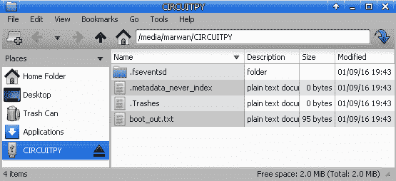
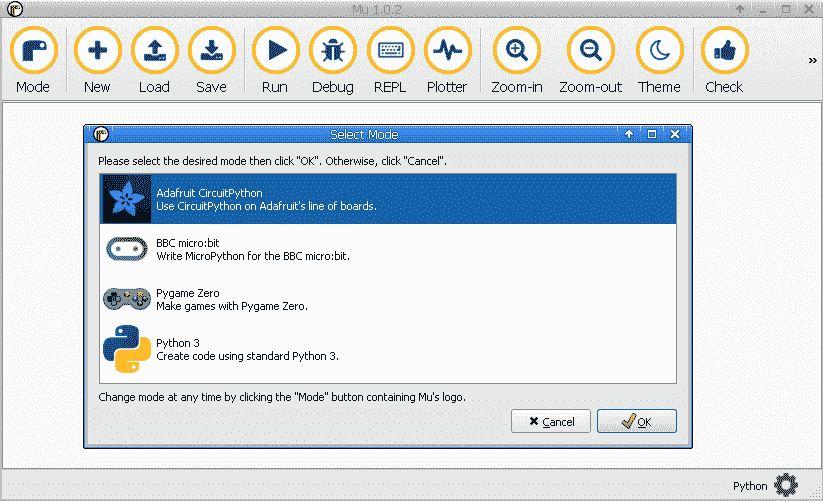

# MicroPython 入门

与诸如 MicroPython 这样的技术合作是一个激动人心的时刻。它们使小型且廉价的硬件设备更容易访问，因为您可以使用诸如 Python 之类的高级语言对其进行编码。与需要更多步骤的其他微控制器语言相比，从 web 服务检索数据等任务可以很容易地在几行代码中完成，因为它们的操作级别比 Python 低。这是非常强大的，因为您将更快地获得结果，并且能够在更短的时间内迭代不同的设计和原型。

在本章中，我们将向您提供基本技能，使您能够开始使用运行 MicroPython 所需的软件和硬件，并获得高效的工作。您将了解如何更新设备上的固件和库。本课程还将介绍如何将您的第一个程序加载到主板上，以及如何使用高级功能（如自动重新加载代码）。最后，许多方法将介绍 REPL 的使用，REPL 是一种在 MicroPython 设备上快速交互和试验可用组件的强大方法。

在本章中，我们将介绍以下配方：

*   刷新微控制器固件
*   执行第一个程序
*   使用 screen 访问 REPL
*   使用 Mu 访问 REPL
*   在 REPL 中执行命令
*   使用自动重新加载功能
*   更新 Python 库

# 什么是微型蟒蛇？

MicroPython 是澳大利亚程序员兼物理学家达米恩·乔治（Damien George）的发明，他在 2013 年发起了一场 Kickstarter 运动，以支持该语言的开发和它将运行的初始微控制器硬件。项目成功后，越来越多的设备（具有来自不同制造商的各种芯片组）得到了 MicroPython 的支持，创建了一系列设备，当您使用 MicroPython 进行项目时可以从中进行选择。

MicroPython 是 python3 编程语言的精简实现，能够在资源非常有限的硬件上运行，如微控制器。MicroPython 已经实现了 Python 编程语言中的大部分功能，例如函数、类、列表、字典、字符串、读写文件、列表理解和异常处理。

还实现了 REPL，可以使用串行连接与之交互。提供了一些核心 Python 库，允许实现一系列应用程序。JSON 和`socket`库允许 web 客户端和服务器实现，使微控制器上基于 Python 的**物联网**（**物联网**项目成为现实。

通过将一种最流行且易于使用的编程语言带入令人兴奋的嵌入式计算世界，MicroPython 为制造商和企业家打开了新的大门，让他们的创作栩栩如生。这本书将探索不同的方法来利用 MicroPython 语言和各种独特的微控制器设备，每种设备都会带来不同的功能。

在微控制器上运行 MicroPython 的一个独特而迷人的方面是，它不在**操作系统**（**OS**上运行），而是直接在裸机上运行。这些独特的特性在很多方面都有体现，比如在硬件通电时运行 Python 代码的能力，因为不需要启动操作系统。

另一方面，Python 代码可以直接访问控制和与硬件交互，从而创造了在操作系统上运行的典型 Python 应用程序所无法实现的硬件可能性。

正如我们现在知道的那样，MicroPython 是在微控制器上运行的，让我们看看微控制器是关于什么的。

# 什么是微控制器？

微控制器是单芯片上的小型计算机。它们通常包括 CPU、内存和输入/输出外围设备。与现代个人电脑相比，他们的计算资源将更加有限。

然而，与 PC 相比，它们的尺寸小得多，可以嵌入各种电子和机械设备中。它们的耗电量通常在数量级上要小得多，从而使电池寿命延长数天。它们的单位成本要低得多，这就为拥有数百台这样的设备在广阔的地理区域收集传感器数据提供了可能性，而且在财务上仍然是可行的。

传统上，在微控制器上创建应用程序是一个困难的过程，因为您必须编写非常低级的代码，这需要时间，并且很难调试。MicroPython 为微控制器带来了 Python 的易用性。它能够提供与硬件的这种更简单的交互，但仍然可以在这样一个资源受限的环境中工作，并提供具有强大响应能力的广泛功能。

# 什么是 Python？

CircuitPython 是 Adafruit Industries 创建的 MicroPython 的一个分支，它简化了微控制器的工作。它通过其 Python 库对 Adafruit 设备附带的许多传感器和组件提供了极好的支持。通过将微控制器的存储作为磁盘驱动器公开，它还允许代码轻松加载和运行，而无需安装任何其他软件应用程序。

一般来说，MicroPython 和 CircuitPython 之间的差异很小，在许多情况下，两种实现上的代码都将运行相同的代码。

# 什么是游乐场快车？

Adafruit Circuit Playerd Express 是一款价格低廉、功能多样的微控制器，内置了丰富的输入和输出设备。以下是此设备中的一些主要硬件功能：

*   10 个迷你 Neopixel，每个都能够显示各种颜色
*   As 运动传感器（带抽头检测和自由落体检测的三轴加速计）
*   温度传感器
*   光传感器
*   声音传感器
*   微型扬声器
*   两个按钮，分别标记为 A 和 B
*   滑动开关
*   红外接收器和发射器
*   八个鳄鱼夹友好型输入/输出引脚
*   支持 I2C 和 PWM 输出
*   七个电容式触摸输入
*   红色发光二极管
*   复位按钮
*   ATSAMD21 ARM Cortex M0 处理器，运行电压为 3.3 V 和 48 MHz
*   2 MB 闪存存储
*   用于连接 PC 的微型 USB 端口

这些将是八章中唯一需要的设备。后面的章节将介绍一组不同的设备。

Please refer to [https://learn.adafruit.com/welcome-to-circuitpython?view=all](https://learn.adafruit.com/welcome-to-circuitpython?view=all) for more information.

# 在哪里买

Adafruit Circuit 游乐场快车可直接从 Adafruit（[购买 https://www.adafruit.com/product/3333](https://www.adafruit.com/product/3333) ）。它也可以从亚马逊和皮莫罗尼等在线零售商处购买。

就本书而言，我们建议您购买 Circuit Playerd Express–Base Kit（[https://www.adafruit.com/product/3517](https://www.adafruit.com/product/3517) ），还包括 USB 电缆和电池组，因此项目可以轻松便携。

# 工具书类

以下是一些参考资料：

*   位于[的 MicroPython 网页 http://micropython.org](http://micropython.org)
*   位于[的 Kickstarter 上的 MicroPython 项目 https://www.kickstarter.com/projects/214379695/micro-python-python-for-microcontrollers](https://www.kickstarter.com/projects/214379695/micro-python-python-for-microcontrollers)
*   《PC Mag 上的微控制器》上的一篇文章[https://www.pcmag.com/encyclopedia/term/46924/microcontroller](https://www.pcmag.com/encyclopedia/term/46924/microcontroller)
*   [上的 Adafruit Python 学习指南 https://learn.adafruit.com/welcome-to-circuitpython/what-is-circuitpython](https://learn.adafruit.com/welcome-to-circuitpython/what-is-circuitpython)
*   官方文件位于[https://circuitpython.readthedocs.io](https://circuitpython.readthedocs.io)

# 刷新微控制器固件

在本配方中，我们将展示如何使用最新的 Circuit Python 固件在 Circuit Playerd Express 上闪存固件。在开始使用此设备之前，有两个原因导致此问题。首先，该设备还支持 Microsoft MakeCode 编程环境，并使用 CircuitPython 固件刷新该设备，为使用 Python 语言做好准备。

其次，CircuitPython 语言正在不断开发中，每隔几个月就会发布一次，因此不时更新固件以将最新版本的语言加载到主板上是个好主意。

# 准备

本章的介绍为我们提供了如何购买 Circuit Playerly Express 的指导，本章中的所有配方都需要该产品。还需要 USB micro B 电缆和运行 macOS、Windows 或 Linux 的计算机。

# 怎么做。。。

让我们看一下以下步骤：

1.  下载最新的 Circuit Python Circuit Playerd Express UF2 文件（[https://github.com/adafruit/circuitpython/releases/latest](https://github.com/adafruit/circuitpython/releases/latest) ）。CircuitPython 版本 3.1.2 的 UF2 文件名为`adafruit-circuitpython-circuitplayground_express-3.1.2.uf2`。对于每个版本的 CircuitPython，对于不同的受支持微控制器，都有许多不同的`uf2`文件。确保您下载了 Circuit Playder Express 设备的文件。

We will use the latest stable version of CircuitPython in this recipe, which is currently 3.1.2\.

2.  将 USB 电缆连接到电路和计算机。
3.  双击位于电路板中心的重置按钮。如果一切顺利，你会看到所有的 LED 灯都变成绿色；否则，使用的 USB 电缆很可能存在问题。在某些情况下，如果双击不起作用，请尝试单击重置按钮。

4.  您将看到一个名为 CPLAYBOOT 的新磁盘出现：


5.  将 UF2 文件复制到此驱动器中。
6.  UF2 文件完全写入设备后，固件将更新，并出现一个新驱动器，称为 Circuity:



现在，我们的赛道游乐场快车可以使用了。

# 它是如何工作的。。。

传统上，必须安装并使用特殊软件来处理微控制器闪烁的微妙过程。微软开发了 UF2 方法，通过不需要任何特殊软件或命令行执行来闪存微控制器，从而大大简化了过程。

一旦电路板进入引导加载程序模式，它将期望保存一个 UF2 文件。将 UF2 复制到驱动器时，微控制器将检测到文件复制已完成，然后自动继续闪存微控制器并重新启动设备，此时设备已重新连接并准备使用。

The UF2 file format can be found at[https://github.com/Microsoft/uf2](https://github.com/Microsoft/uf2).

# 还有更多。。。

与以前的方法相比，UF2 闪存微控制器固件的方法使该过程更容易、更快。并非所有的 MicroPython 板都支持 UF2 方法，因此需要更复杂的方法来安装特殊的软件来进行固件刷新。所需的确切过程和软件因不同的电路板和制造商而异。

当您使用此闪存软件时，通常需要您知道该设备在计算机上显示的串行设备的确切名称。这些设备的命名在 Windows、Linux 和 macOS 之间有所不同。这种类型的软件通常需要在终端中运行，因此您必须具备一些命令行知识才能与之交互。出于所有这些原因，将 UF2 与受支持的设备（如 Circuit Playway Express）一起使用是启动 MicroPython 实验的首选方式。

# 另见

Adafruit 和 Microsoft 网站上都有许多与此配方中描述的过程相关的资源。以下是一些参考资料：

*   更新 CircuitPython 的文档可在[中找到 https://learn.adafruit.com/adafruit-circuit-playground-express/circuitpython-quickstart](https://learn.adafruit.com/adafruit-circuit-playground-express/circuitpython-quickstart) 。
*   UF2 工艺在[中有更详细的说明 https://makecode.com/blog/one-chip-to-flash-them-all](https://makecode.com/blog/one-chip-to-flash-them-all) 。 [](https://makecode.com/blog/one-chip-to-flash-them-all) 

# 执行第一个程序

在本食谱中，我们将向您展示如何在 Circuit Playerd Express 上加载第一个程序，以及如何修改并重新加载程序。然后，该程序将点亮电路板上提供的十个 Neopix 中的一个。

# 准备

一旦 Circuit Playerly Express 闪存了 Circuit Python 固件，您可以将 Python 脚本加载到电路板上并运行它们。

# 怎么做。。。

让我们看看如何做到这一点：

1.  确保电路板已通过 USB 电缆连接到计算机，并且`CIRCUITPY`驱动器已显示。
2.  将包含以下内容的文本文件保存在驱动器上，并将其命名为`main.py`：

```py
from adafruit_circuitplayground.express import cpx
import time

cpx.pixels[0] = (255, 0, 0)  # set first NeoPixel to the color red
time.sleep(60)
```

3.  保存文件后，弹出驱动器，然后从计算机上卸下并重新连接 USB 电缆。
4.  驱动器上的第一个 Neopix 应亮起红色。
5.  在您选择的文本编辑器中打开`main.py`文件，并将`cpx.pixels[0]`行更改为`cpx.pixels[1]`。保存文件。此更改将使第二个 NeoPixel 亮起，而不是第一个。
6.  弹出驱动器，卸下，然后重新连接 USB 电缆，以查看更改是否生效。

# 它是如何工作的。。。

当设备打开时，它会查找某些文件，如`code.py`或`main.py`，如果找到这些文件，将作为启动过程的一部分执行。通过这种方式，您可以指定设备通电时要运行的代码。脚本首先导入`adafruit_circuitplayground.express`库，以便它可以控制 Neopix s。通过给第一个新像素一组适当的 RGB 值，将其设置为红色。

最后，脚本将休眠 60 秒，以便在脚本结束执行前 LED 保持点亮一分钟。

# 还有更多。。。

现在电路板已经加载了 Python 脚本，可以断开与计算机的连接，并将电池组连接到电路板上。一旦脚本启动电池组，它将运行并点亮选定的 Neopix。

这是一个简单的方法来创建便携式和廉价的项目，可以有一个代码直接从板上运行，而不需要连接的 PC，并可以简单地由三个 AAA 电池供电。

# 另见

T 在[中描述了 CircuitPython 启动时查找的许多文件 https://learn.adafruit.com/welcome-to-circuitpython?view=all#naming-你的-program-file-7-30](https://learn.adafruit.com/welcome-to-circuitpython?view=all#naming-your-program-file-7-30)。

# 使用 screen 访问 REPL

Linux 和 macOS 都有功能强大的终端仿真器，例如`screen`，可以通过串行（USB）连接直接连接到设备的**读取评估打印循环**（**REPL**）。这个配方将展示如何连接到 REPL 并开始以交互方式运行 Python 代码。

# 准备

此配方可能使用 macOS 或 Linux 计算机，并且可能需要`screen`命令可用。在 macOS 上，屏幕应用程序是内置的，因此不需要安装。在 Ubuntu 上，Linux 屏幕可以通过 `apt install screen` 命令安装。

# 怎么做。。。

让我们看看如何连接 REPL 并运行代码：

1.  打开计算机的终端应用程序。
2.  在 Linux 上运行`ls /dev/ttyACM*`或 macOS 上运行`ls /dev/tty.*`插入设备之前，请列出设备名称。
3.  使用 USB 电缆将板连接到计算机。
4.  使用相同的命令再次列出设备名称，以查找板的设备名称。
5.  如果设备名称为`/dev/ttyACM0`，则`screen`命令为`screen /dev/ttyACM0 115200`。
6.  在终端中输入命令并启动屏幕应用程序。
7.  如果屏幕能够成功连接，则终端上应显示 Python REPL，其输出类似于以下文本：

```py
 Adafruit CircuitPython 3.1.2 on 2019-01-07; Adafruit CircuitPlayground Express with samd21g18    >>> 

```

8.  如果没有出现提示，您可以尝试按*Ctrl*+*C*，然后按*Enter*，这将停止当前运行的 Python 脚本并运行 REPL，并显示以下消息：

```py
Press any key to enter the REPL. Use CTRL-D to reload.
```

9.  一旦出现 REPL 提示符，我们就必须通过计算`1+1`表达式来测试提示符是否有效。它应产生以下输出：

```py
>>> 1+1
2
```

# 它是如何工作的。。。

Circuit Playway Express 通过 USB 连接公开串行设备，可通过许多不同的终端仿真器程序访问。除`screen`外，还可以使用其他程序，如`picocom`和`minicom`。

命令中设置为 115200 的最后一个参数设置连接的波特率，该波特率应设置为该速度。一旦成功建立连接，就开始交互式会话，允许在设备上直接计算表达式，并在终端上直接显示输出。

# 还有更多。。。

本书中的许多食谱将介绍使用 REPL 的脚本的不同部分。这将使您有机会在运行每个代码片段时获得即时反馈。在 REPL 中输入不同的代码段后，还可以使用 REPL 功能来帮助您进行代码实验。您可以使用*向上*和*向下*箭头键浏览 REPL 中输入的命令的历史记录。例如，如果您刚刚在 REPL 中执行了一行代码，打开了电路板上的特定像素，您可以按*up*键，通过编辑该行并再次按*Enter*来更改点亮的像素。

# 另见

以下是一些参考资料：

*   在[中详细讨论了在电路板上使用 REPLhttps://learn.adafruit.com/welcome-to-circuitpython/the-repl](https://learn.adafruit.com/welcome-to-circuitpython/the-repl) 。
*   有关使用 REPL 访问 MicroPython 的详细信息，请访问[https://learn.adafruit.com/micropython-basics-how-to-load-micropython-on-a-board/serial-terminal](https://learn.adafruit.com/micropython-basics-how-to-load-micropython-on-a-board/serial-terminal) 。

# 使用 Mu 访问 REPL

Mu 是一个易于使用的图形代码编辑器，用 Python 编写，在 Windows、macOS、Linux 和 Raspberry Pi 上运行。在本食谱中，我们将学习如何安装 Mu，并使用它访问 Circuit Played Express 上的 REPL。

# 准备

此配方要求在计算机上安装 Python 和`pip`。Mu 编辑器将使用`pip`命令安装，因此可以选择在`virtualenv`中运行此配方。

# 怎么做。。。

让我们看看如何做到这一点：

1.  执行以下`pip3 install mu-editor`命令安装 Mu 编辑器。
2.  运行`mu-editor`命令启动编辑器。
3.  第一次运行编辑器时，它会询问应该以哪种模式运行。在以下屏幕截图上，选择 Python 模式：



4.  C 单击工具栏上的串行按钮打开与设备的 REPL 会话。
5.  在 Linux 系统上，如果出现“无法连接到设备”错误，则退出编辑器并使用`sudo /full/path/to/mu-editor`命令再次启动它，其中给出了编辑器的绝对路径。
6.  一旦成功连接到设备，您可以通过评估`1+1`表达式来测试 REPL，该表达式应产生如下屏幕截图所示的输出：


# 它是如何工作的。。。

当您单击 Mu 编辑器中的串行按钮时，它将尝试打开与电路板的串行连接。如果成功，它将捕获您的输入，将其发送到设备，并像典型的终端仿真器一样显示输出。

此应用程序的优点在于，它可以在所有主要的桌面操作系统上工作，并自动找到正确的设备地址，而无需手动指定，这是典型的终端模拟器所要求的。它也有一个非常简单和容易接近的布局，使它易于使用，为首次用户连接到微控制器。

# 还有更多。。。

当您第一次开始使用 MicroPython 时，Mu 编辑器是一个非常好的图形应用程序。其简单直观的设计使其易于快速生产，并使探索其不同功能变得有趣。除了 REPL 特性之外，它还有屏幕的主要部分，可以用来编辑和保存 Python 脚本。它具有代码编辑功能，如代码完成，并将显示有用的弹出窗口，其中包含有关函数接受参数的详细信息以及有关函数功能的文档。

# 另见

以下是一些参考资料：

*   该项目的 GitHub 存储库位于[https://github.com/mu-editor/mu](https://github.com/mu-editor/mu) 。
*   项目主页可在[找到 https://codewith.mu/](https://codewith.mu/) [。](https://github.com/mu-editor/mu)

# 在 REPL 中执行命令

以下配方显示了 REPL 的不同使用方式。

# 准备

可以使用前面两个配方中的任何一种方法来获得 REPL。

# 怎么做。。。

1.  通过首选应用程序打开 REPL。
2.  Python 中 REPL 提供的许多相同功能也可以在 MicroPython 实现中使用。最后返回值可通过`_`访问：

```py
>>> 2 + 2
4
>>> _ + 2
6
```

3.  还支持延续行，可以通过 REPL 定义函数或`for`循环，如下输出所示：

```py
>>> def add(a, b):
...     return a + b
... 
... 
... 
>>> add(2, 2)
4
>>> 
```

4.  即使在受约束的微控制器硬件上，也支持任意精度整数。以下代码显示整数超过 64 位整数值限制的算术：

```py
>>> 2**100 + 2**101
3802951800684688204490109616128
```

# 它是如何工作的。。。

REPL 实现是我们在 cpython 实现中了解和喜爱的大多数特性。MicroPython 实现必须处理严格的硬件约束，以便能够在微控制器上运行。但是，即使有这些限制，两种实现中 REPL 的最终用户体验也几乎相同，这使得 Python 开发人员可以轻松地进行转换。

# 还有更多。。。

当您想要在设备上试验某些 MicroPython 库或某些功能时，REPL 是一个非常宝贵的工具。它可以让您轻松地导入不同的 Python 模块，并以更直接的方式调用这些库提供的函数，以发现它们实际上如何与硬件交互。这些微控制器上的许多组件可以根据不同的项目需要进行微调。REPL 常常是进行这种微调的理想场所。

# 另见

以下是一些参考资料：

*   MicroPython 交互式解释器模式（REPL）记录在[中 http://docs.micropython.org/en/latest/reference/repl.html](http://docs.micropython.org/en/latest/reference/repl.html) 。
*   MicroPython 内置类型的文档可在[中找到 http://docs.micropython.org/en/latest/genrst/builtin_types.html](http://docs.micropython.org/en/latest/genrst/builtin_types.html) 。

# 使用自动重新加载功能

下面的方法说明了如何使用自动重新加载，以便编辑和运行代码的周期可以变得更快、更有趣。

# 准备

可以在此处使用前面配方中使用的任何方法来获得 REPL。

# 怎么做。。。

让我们看看如何做到这一点：

1.  打开`main.py`文件，将`print('hi there')`语句保存在文件中。
2.  通过首选应用程序打开 REPL。在 REPL 打开的情况下，按*Ctrl*+*D*。应显示以下输出：

```py
Adafruit CircuitPython 3.1.2 on 2019-01-07; Adafruit CircuitPlayground Express with samd21g18
>>> 
>>> 
soft reboot

Auto-reload is on. Simply save files over USB to run them or enter REPL to disable.
main.py output:
hi there

Press any key to enter the REPL. Use CTRL-D to reload.
```

3.  编辑`main.py`文件并将内容更改为`print('hi there again')`。应自动显示以下输出：

```py
soft reboot

Auto-reload is on. Simply save files over USB to run them or enter REPL to disable.
main.py output:
hi there again

Press any key to enter the REPL. Use CTRL-D to reload.
```

# 它是如何工作的。。。

按*Ctrl*+*D*进入自动重新加载模式。在这种模式下，你可以在你选择的文本编辑器中打开`main.py`文件，当你保存文件时，电路板检测到发生了变化并执行软重启。

在屏幕输出中可以看到软重启，然后执行新版本的代码，并立即显示其输出。

# 还有更多。。。

用几行基本代码启动脚本以使脚本的初始部分正常工作是很常见的。一旦您运行了第一个基本版本，您将通过多次迭代对其进行调整和增强，使其按照您希望的方式运行。除了这些调整之外，当您将代码提交时，不可避免的 bug 将出现在您的代码中。自动重新加载功能将成为您在这些密集的编码会话中最好的朋友，因为它将让您以直观的方式更快地获得结果。

# 另见

以下是一些参考资料：

*   MicroPython 的软复位功能在[中描述 http://docs.micropython.org/en/v1.8.6/wipy/wipy/tutorial/reset.html](http://docs.micropython.org/en/v1.8.6/wipy/wipy/tutorial/reset.html) 。
*   关于离开 REPL 的文件可在[中找到 https://learn.adafruit.com/welcome-to-circuitpython?view=all#returning-发送至-the-serial-console-10-24](https://learn.adafruit.com/welcome-to-circuitpython?view=all#returning-to-the-serial-console-10-24)。

# 更新 Python 库

除了更新固件，还有一组丰富的 Python 库，称为 CircuitPython 库，也可以使用最新支持的功能进行更新。

# 准备

可以在此处使用前面配方中使用的任何方法来获得 REPL。

# 怎么做。。。

让我们看看如何做到这一点：

1.  通过首选应用程序打开 REPL。
2.  下载最新的 CircuitPython 库捆绑版本（[https://github.com/adafruit/Adafruit_CircuitPython_Bundle/releases/latest](https://github.com/adafruit/Adafruit_CircuitPython_Bundle/releases/latest) ）。捆绑文件的名称为`adafruit-circuitpython-bundle-3.x-mpy-20190212.zip`。因为我们的固件使用的是 3.x 版本，所以我们必须选择同样适用于 3.x 版本的捆绑包。A 始终使用`mpy`版本，因为它经过优化以使用更少的磁盘空间并减少内存使用。

We are using the latest auto-release version of the CircuitPython Library Bundle in this recipe, which is version 20190212 of the 3.x series.

3.  将`.zip`文件解压缩到计算机上的某个位置。
4.  如果`CIRCUITPY`驱动器不包含`lib`文件夹，请立即创建一个。
5.  将提取的`lib`文件夹的内容复制到设备上的`lib`文件夹中。
6.  按*Ctrl*+*D*在 REPL 中进行软重启。
7.  在 REPL 中运行`import simpleio`。
8.  如果已成功执行，则库已成功加载，因为`simpleio`模块不是固件的一部分，而是从库文件夹导入的。

# 它是如何工作的。。。

创建的`lib`路径是在导入 Python 包时，CircuitPython 将查找的标准路径之一。通过向该文件夹中添加 Python 包，可以通过设备上运行的任何脚本导入该文件夹。

`mpy`文件是从原始源`py`文件构建的，并捆绑在一个包中，以便于安装。

# 还有更多。。。

CircuitPython 库正在不断开发中，因此了解如何更新主板上的库以获得最新功能非常重要。当您使用在 internet 上找到的项目中的代码进行实验时，您可能偶尔会发现一些示例无法在您的电路板上运行，因为您运行的是过时版本的 Python 库。将您的板保持在最新版本，因为这有助于防止这种情况发生。

# 另见

以下是一些参考资料：

*   有关如何创建`mpy`文件的更多详细信息，请查看[中的`mpy-cross`命令 https://learn.adafruit.com/building-circuitpython/build-circuitpython](https://learn.adafruit.com/building-circuitpython/build-circuitpython) 。
*   有关安装 CircuitPython 库捆绑包的信息，请访问[https://learn.adafruit.com/adafruit-circuit-playground-express?view=all#installing--python-library-bundle-12-5](https://learn.adafruit.com/adafruit-circuit-playground-express?view=all#installing-the-circuitpython-library-bundle-12-5)。