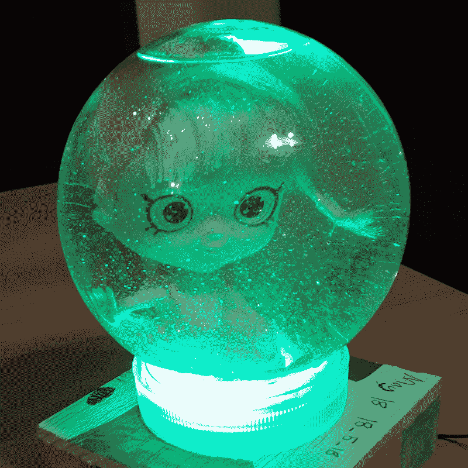
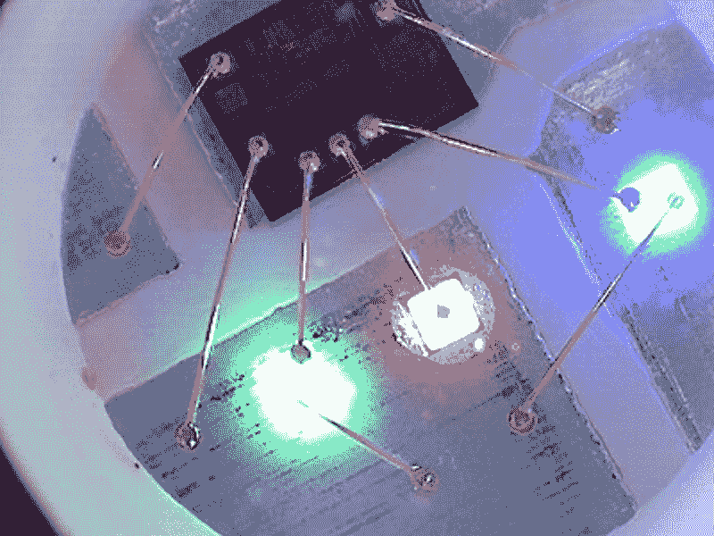
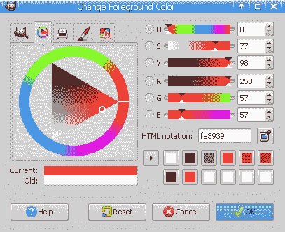
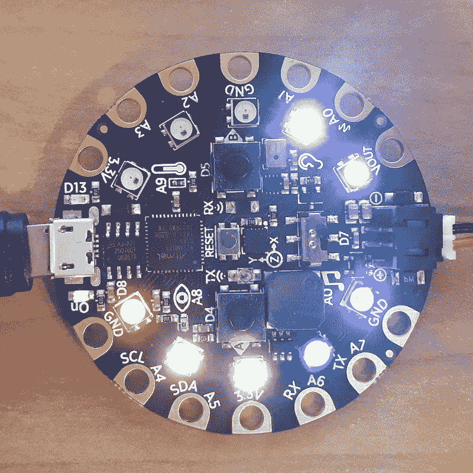

# 二、控制 LED

在本章中，我们将介绍几种控制 Adafruit 电路中 Neopix LED 范围的方法。在这些配方中，我们将研究设置像素颜色的各种方法，每种方法都有自己的权衡。

我们还将演示如何对操作计时，以便可以创建淡入淡出和其他灯光动画效果。NeoPixels 是一种强大的方式，允许与项目进行更丰富的视觉交互。这些配方将为您提供必要的构建块，以便将这些视觉概念融入到您自己的项目中。

在本章中，我们将介绍以下配方：

*   打开针脚 13 指示灯
*   设置新像素的亮度
*   控制单个新像素的颜色
*   使用 RGB 和十六进制代码显示 LED 颜色
*   使用颜色名称设置 LED 颜色
*   将所有新像素设置为相同颜色
*   将新像素范围设置为一种颜色
*   生成随机 NeoPixel LED 颜色
*   使用随机颜色创建 LED 动画
*   使用彩虹颜色创建 LED 动画

# Adafruit Circuit 游乐场快车布局图

下图显示了本章中将使用的 LED 的位置：


Courtesy of adafruit.com

引脚 13 LED 是一个简单的红色 LED，将在第一个配方中使用。电路板上总共有 10 个 Neopix。每个 NeoPixel 由红色、绿色和蓝色 LED 组成。通过控制每个 LED 的亮度，您可以将任何 Neopix 设置为特定颜色。

# 打开针脚 13 指示灯

在本食谱中，我们将学习如何打开和关闭针脚 13 LED。这是电路板上最简单的 LED，因为它只有一种颜色，用 Python 与它交互也非常简单。出于这些原因，针脚 13 LED 是一个很好的起点。

# 准备

您将需要访问 Circuit Playway Express 上的 REPL 才能运行此配方中提供的代码。

# 怎么做。。。

为此，请执行以下步骤：

1.  在 REPL 中运行以下代码行：

```py
>>> from adafruit_circuitplayground.express import cpx
>>> cpx.red_led = True
```

2.  在此阶段，您应该会看到针脚 13 LED 变为红色。
3.  使用以下代码检查 LED 的当前状态：

```py
>>> cpx.red_led
True
```

4.  要关闭 LED，请在 REPL 中运行以下代码：

```py
>>> cpx.red_led = False
```

5.  针脚 13 LED 的灯现在将关闭。

# 它是如何工作的。。。

第一行代码导入 Circuit Playder Express 库。该库包含一个名为`express`的对象类，它是我们将用于与该板上的硬件交互的主类。导入库时，它会创建一个名为`cpx`的此类实例。

`cpx`对象公开了一个名为`red_led`的属性。此属性可用于检索 LED 的当前值。如果 LED 亮起，则返回`True`值；否则，如果 LED 熄灭，则返回`False`值。设置此属性的值将打开或关闭 LED，具体取决于是否设置了`True`或`False`值。

# 还有更多。。。

这是电路板上要处理的最简单的 LED 灯之一，因为它通过将值设置为`True`或`False`来控制。您无法控制此 LED 的颜色或亮度。本书中的其他配方将控制电路板上的 Neopix 灯，其功能范围更丰富，因此，需要更复杂的 API 来控制它们。

# 另见

您可以使用以下参考资料了解更多信息：

*   有关`red_led`财产的文件可在[找到 https://circuitpython.readthedocs.io/projects/circuitplayground/en/latest/api.html#adafruit_circuitplayground.express.Express.red_led](https://circuitpython.readthedocs.io/projects/circuitplayground/en/latest/api.html#adafruit_circuitplayground.express.Express.red_led) 。
*   有关导入`cpx`变量的详细信息，请参见[https://circuitpython.readthedocs.io/projects/circuitplayground/en/latest/#usage-示例](https://circuitpython.readthedocs.io/projects/circuitplayground/en/latest/#usage-example)。

# 设置新像素的亮度

控制像素的亮度将是本食谱的主题。根据项目的需要设置像素的亮度非常重要。请注意，您必须将亮度更改为足够亮的级别，以使像素清晰可见，但不要太亮而导致不适。

# 准备

您将需要访问 Circuit Playway Express 上的 REPL 才能运行此配方中提供的代码。

# 怎么做。。。

为此，请执行以下步骤：

1.  在 REPL 中运行以下代码行：

```py
>>> from adafruit_circuitplayground.express import cpx
>>> cpx.pixels.brightness = 1.0
>>> cpx.pixels[0] = (255, 0, 0)
```

2.  此时，第一个像素应为全亮度的红色。运行以下代码行将亮度级别设置为 50%：

```py
>>> cpx.pixels.brightness = 0.5
```

3.  亮度水平可以进一步降低到 10%，并且仍然可以舒适地看到。您可以通过运行以下代码行来完成此操作：

```py
>>> cpx.pixels.brightness = 0.10
```

# 它是如何工作的。。。

`brightness`属性接受从`0`到`1.0`的值，该值从最不亮到最亮。请注意，此电路板上的 NeoPixels 可能非常明亮，如果您以最高亮度直接观察它们，它们可能会使您的眼睛疲劳。

我建议您将亮度级别设置为 10%，因为这样可以更舒适地查看像素。然后，根据项目的不同，可以将亮度调整到最合适的级别。

有时候，像素会被一层薄薄的塑料覆盖，你会想增加亮度。另一方面，有时你会直接看着它们，你会想降低亮度水平。

# 还有更多。。。

需要注意的是，亮度级别的实现方式意味着您一次只能更改所有新像素。也就是说，使用“亮度”属性，不能使某些像素变亮，而使某些像素变暗。因此，无论您为亮度设置什么值，都将应用于电路板上的所有像素。

当像素保持在 100%亮度的最大水平时，像素具有非常明亮的能力。例如，将设备嵌入塑料容器中时，此设置更为合适。以下照片取自 NeoPixel 项目，其中 Circuit Playerd Express board 被放置在雪球底座内：



在本项目中，底座由白色塑料制成。因此，即使电路板不是直接可见的，像素也足够明亮，可以透过白色塑料发光，使整个地球充满光线。

The DIY snow globe kit shown in this project can be found at [https://www.adafruit.com/product/3722](https://www.adafruit.com/product/3722).

# 另见

您可以使用以下参考资料了解更多信息：

*   亮度属性记录在[中 https://circuitpython.readthedocs.io/projects/NeoPixel/en/latest/api.html#NeoPixel.NeoPixel.brightness](https://circuitpython.readthedocs.io/projects/neopixel/en/latest/api.html#neopixel.NeoPixel.brightness) 。
*   更改亮度级别的示例可在[中找到 https://learn.adafruit.com/circuitpython-made-easy-on-circuit-playground-express/NeoPixels](https://learn.adafruit.com/circuitpython-made-easy-on-circuit-playground-express/neopixels) 。

# 控制单个新像素的颜色

此配方将向您展示如何将特定的 NeoPixel 设置为不同的颜色。然后，它将向您展示如何更改电路板附带的 10 个 Neopix 中任何一个的颜色。这将是一个有用的秘诀，让你可以开始释放这些板载像素的力量和灵活性。

# 准备

您将需要访问 Circuit Playway Express 上的 REPL 才能运行此配方中提供的代码。

# 怎么做。。。

为此，请执行以下步骤：

1.  在 REPL 中运行以下代码行：

```py
>>> from adafruit_circuitplayground.express import cpx
>>> cpx.pixels[0] = (255, 0, 0)
```

2.  现在，您应该看到第一个尼奥像素变为红色。
3.  运行以下代码时，应看到第一个 Neopix 变为绿色：

```py
>>> cpx.pixels[0] = (0, 255, 0)
```

4.  运行以下代码时，应看到第一个 Neopix 变为蓝色：

```py
>>> cpx.pixels[0] = (0, 0, 255)
```

5.  以下代码应检索第一个新像素的当前颜色值：

```py
>>> cpx.pixels[0]
(0, 0, 255)
```

6.  运行以下代码以关闭第一个 Neopix：

```py
>>> cpx.pixels[0] = (0, 0, 0)
```

7.  运行以下代码，第二个 Neopix 应变为红色：

```py
>>> cpx.pixels[1] = (255, 0, 0)
```

# 它是如何工作的。。。

第一行代码导入将用于控制尼奥像素的`cpx`对象。该对象有一个名为`pixels`的属性，可以像列表一样访问该属性。使用的索引指示要操纵 10 个新像素中的哪一个。

在第一个代码片段中，我们将该值设置为表示所需颜色的元组，它由红色、绿色和蓝色值组成。每个值应表示为 0 到 255 之间的整数。通过将该值设置为（255，0，0），红色 LED 将处于其最高值，绿色和蓝色 LED 将关闭。这将创建红色。

按照相同的方法，然后通过为每种颜色提供正确的值，将新像素设置为绿色和蓝色。通过简单地访问任何特定示例的值，也可以容易地检索特定像素的当前 RGB 值。

通过将所有 RGB 组件的值设置为 0，可以关闭像素，如本配方中前面的代码所示。前面的最后一段代码只是给出了一个示例，通过引用正确的索引值将第二个像素设置为红色。

# 还有更多。。。

在旧版本的库中，可以将颜色提供为三个整数的列表，而不是三个整数的元组。最好避免这样做，并坚持使用元组而不是列表。这是因为您的代码将在库的较新版本和较旧版本中工作。

每个 NeoPixel 由红色、绿色和蓝色 LED 组成。当您在此配方中设置每种颜色的强度时，它会直接更改这些单独 LED 的亮度级别。可以使用消费者显微镜查看构成每个 NeoPixel 的三个单独 LED 灯中的每一个。下面的照片是从一台放大 200 倍的消费级显微镜上拍摄的。如您所见，单独的红色、绿色和蓝色 LED 清晰可见：



# 另见

您可以使用以下参考资料了解更多信息：

*   关于像素属性的文档可在[中找到 https://circuitpython.readthedocs.io/projects/circuitplayground/en/latest/api.html#adafruit_circuitplayground.express.Express.pixels](https://circuitpython.readthedocs.io/projects/circuitplayground/en/latest/api.html#adafruit_circuitplayground.express.Express.pixels) 。
*   有关 Neopix 的详细信息，请参见[https://learn.adafruit.com/adafruit-NeoPixel-uberguide/the-magic-of-NeoPixels](https://learn.adafruit.com/adafruit-neopixel-uberguide/the-magic-of-neopixels) 。

# 使用 RGB 和十六进制代码显示 LED 颜色

使用十六进制代码表示任何颜色都有一个通用约定，它通过表示颜色的红色、绿色和蓝色分量来工作。此配方演示如何使用此十六进制代码约定设置尼奥像素的颜色。当您希望应用 web 或桌面上其他应用程序的特定颜色设置时，使用这种流行的约定将非常有用。

# 准备

您将需要访问 Circuit Playway Express 上的 REPL 才能运行此配方中提供的代码。

# 怎么做。。。

为此，请执行以下步骤：

1.  在 REPL 中运行以下代码行：

```py
>>> from adafruit_circuitplayground.express import cpx
>>> cpx.pixels[0] = 0xFF0000
```

2.  你应该看到第一个新像素变成红色。运行以下代码以检索第一个尼奥像素的颜色值：

```py
>>> cpx.pixels[0]
(0, 0, 255)
```

3.  运行以下代码将下两个像素设置为绿色和蓝色：

```py
>>> cpx.pixels[1] = 0x00FF00
>>> cpx.pixels[2] = 0x0000FF
```

4.  使用以下代码将第四个像素设置为黄色：

```py
>>> cpx.pixels[3] = 0xFFFF00
```

5.  使用以下代码显示蓝色的整数值，然后使用此整数值将下一个像素设置为蓝色：

```py
>>> 0x0000FF
255
>>> cpx.pixels[4] = 255
```

# 它是如何工作的。。。

第一个代码段使用十六进制表示法将电路板上的第一个像素设置为红色。像素的接口接受以三个整数的元组或十六进制值形式给出的颜色值，在 Python 中，十六进制值与一个整数值相关。

根据给定值的类型，库提取颜色的红色、绿色和蓝色分量的正确值，并将像素设置为该颜色。第二个代码段指出，当读回这些值时，它们将始终作为三个颜色组件的元组进行检索。

最后一段代码演示了所使用的十六进制表示法是 Python 语言的一个标准特性，用于根据十六进制值指定整数的值。等效整数值也可用于设置颜色。

# 还有更多。。。

描述颜色的红、绿、蓝分量的十六进制编码表示法非常流行。由于它的流行，很容易找到各种在线工具和桌面应用程序，这些工具和应用程序提供颜色选择器和颜色控制盘，它们将颜色表示为十六进制代码。您只需在这些程序中选择所需的颜色，然后将十六进制值复制并粘贴到脚本中。以下截图摘自流行的开源图像编辑器 GIMP：



在前面的屏幕截图中，您可以看到应用程序中可用的色轮。这个丰富的界面可以让你通过改变色调或饱和度轻松找到你想要的颜色。一旦选择了所需的颜色，就可以复制十六进制代码值，该值在本应用程序中标记为**HTML 符号**。然后，可以使用此配方中显示的相同技术在脚本中使用此值。

GIMP is available on Linux, macOS, and Windows and can be downloaded for free from [https://www.gimp.org](https://www.gimp.org).

# 另见

您可以使用以下参考资料了解更多信息：

*   Python 语言中整数文本的文档可在[中找到 https://docs.python.org/3/reference/lexical_analysis.html#integer-文字](https://docs.python.org/3/reference/lexical_analysis.html#integer-literals)。
*   互动色轮可在[找到 https://www.sessions.edu/color-calculator/](https://www.sessions.edu/color-calculator/) 。

# 使用颜色名称设置 LED 颜色

使用人类可读的颜色名称可以更容易地跟踪应用程序中使用的颜色。此配方演示了一种允许您使用常规颜色名称设置像素颜色的技术。通过一组标准颜色名称引用颜色的功能在流行语言中可用，包括 CSS。这个食谱向您展示了如何将此功能引入到 MicroPython 脚本中。

# 准备

您将需要访问 Circuit Playway Express 上的 REPL 才能运行此配方中提供的代码。

# 怎么做。。。

为此，请执行以下步骤：

1.  在 REPL 中运行以下代码行：

```py
>>> from adafruit_circuitplayground.express import cpx
>>> RGB = dict(black=0x000000, blue=0x0000FF, green=0x00FF00, 
... cyan=0x00FFFF,
... red=0xFF0000, magenta=0xFF00FF, yellow=0xFFFF00, 
... white=0xFFFFFF)
>>> cpx.pixels[0] = RGB['red']
```

2.  你应该看到第一个新像素变成红色。
3.  使用以下代码按字母顺序将前八个像素设置为命名颜色之一：

```py
>>> for i, name in enumerate(sorted(RGB)):
...     cpx.pixels[i] = RGB[name]
```

# 它是如何工作的。。。

创建一个名为 RGB 的全局变量；这是一个用于将颜色名称与其 RGB 颜色代码匹配的词典。这允许通过名称检索颜色值，而不是在每次需要使用颜色值时直接指定其十六进制代码。第一个片段使用 RGB 代码将第一个像素设置为红色。

第二块代码按字母顺序循环遍历每个颜色名称，并为该颜色设置一个像素。由于在颜色查找字典中定义了八种颜色，因此前八个像素将设置其颜色。每个像素将从颜色列表中具有自己的颜色。

# 还有更多。。。

使用人类可读的颜色名称可以提高代码的可读性。然而，本配方中描述的技术要求您手动指定每个颜色名称及其关联的十六进制代码。如果您只使用少量颜色，这很好，但是如果您想要支持大量颜色，那么这可能会变得非常乏味。要记住的另一个因素是，这些电路板中的许多都有有限的内存容量，因此创建非常大的字典可能会导致电路板内存不足。一个小的颜色查找表，如本例中所示，不应引起此类问题。

当您查找颜色名称及其相关十六进制代码时，可以使用许多标准源。一个流行的颜色名称列表是在 CSS 中使用的**万维网联盟**（**W3C**）。开源文本编辑器 Vim 还提供了一个标准颜色列表。此颜色名称列表存储在名为`rgb.txt`的文件中，该文件随每个 Vim 安装一起提供。

使用此颜色列表的好处是它采用机器可读的格式，其中每行表示一种颜色，颜色组件和名称以空格分隔。这使得解析和使用这些颜色名称成为一个相对简单的过程。以下屏幕截图显示了一个有用的 Vim 脚本的输出，该脚本解析此文件并显示每个颜色名称及其应用的颜色，以便于选择：


This Vim color script can be found at [https://vim.fandom.com/wiki/View_all_colors_available_to_gvim](https://vim.fandom.com/wiki/View_all_colors_available_to_gvim).

# 另见

您可以使用以下参考资料了解更多信息：

*   W3C 颜色名称可在[中找到 https://www.w3.org/TR/css-color-3/](https://www.w3.org/TR/css-color-3/) 。
*   有关加色理论的解释，请参见[https://study.com/academy/lesson/additive-color-theory-definition.html](https://study.com/academy/lesson/additive-color-theory-definition.html) 。

# 将所有新像素设置为相同颜色

这个配方解释了如何通过一次调用将所有像素设置为一种颜色，而不是循环所有像素并单独设置它们的颜色。可以使用此技术创建一个很好的效果，将所有 10 个新像素设置为相同的颜色。它们排列成一个完美的圆圈，因此当它们都设置为相同的颜色时，它会创建一个颜色环。这也是一种在一次调用中关闭所有尼奥像素的简单方法。

# 准备

您将需要访问 Circuit Playway Express 上的 REPL 才能运行此配方中提供的代码。

# 怎么做。。。

为此，请执行以下步骤：

1.  在 REPL 中运行以下代码行：

```py
>>> from adafruit_circuitplayground.express import cpx
>>> cpx.pixels.fill(0x0000FF)
```

2.  您应该看到所有 10 个尼奥像素都变成蓝色。
3.  使用以下代码关闭所有 10 个 Neopixel：

```py
>>> cpx.pixels.fill(0x000000)
```

# 它是如何工作的。。。

在第一个代码段中，调用了`fill`方法，并提供了颜色值作为第一个参数。`fill`方法将遍历所有像素，并将其设置为所需颜色，在本例中为蓝色。此方法接受十六进制颜色表示法和三个整数值的元组。

# 还有更多。。。

这种将所有像素设置为相同颜色的操作比较流行，并且为方便起见提供了该方法。然而，需要注意的是，该方法的实现并不仅仅是简单的循环和设置每个像素的颜色。相反，它使用了一个功能，您可以在显示之前设置所有颜色值。

此功能的优点是，您可以先设置所有颜色，然后进行一次调用以一次显示所有颜色。这是一种比简单的`for`循环更好的设置像素的方法，因此它提供了使用`fill`方法的另一个很好的理由。

# 另见

您可以使用以下参考资料了解更多信息：

*   有关`fill`方法的文件可在[中找到 https://circuitpython.readthedocs.io/projects/NeoPixel/en/latest/api.html#NeoPixel.NeoPixel.fill](https://circuitpython.readthedocs.io/projects/neopixel/en/latest/api.html#neopixel.NeoPixel.fill) 。
*   使用 Neopix 库的产品列表可在[中找到 https://www.adafruit.com/category/168](https://www.adafruit.com/category/168) 。

# 将新像素范围设置为一种颜色

本食谱将探索如何使用切片功能将特定范围的像素设置为特定颜色。当您想要将像素环转换为标尺以显示从 1 到 10 的值的级别时，这非常有用。本质上，它提供了一种更清晰、更简单的方法，可以将一系列像素设置为特定的颜色。

# 准备

您将需要访问 Circuit Playway Express 上的 REPL 才能运行此配方中提供的代码。

# 怎么做。。。

为此，请执行以下步骤：

1.  在 REPL 中运行以下代码行：

```py
>>> from adafruit_circuitplayground.express import cpx
>>> cpx.pixels[0:2] = [0xFF0000, 0xFF0000]
```

2.  您应该看到前两个尼奥像素亮起为红色。
3.  使用以下代码将下三个像素变为绿色，最后五个像素变为蓝色：

```py
>>> cpx.pixels[2:5] = [0x00FF00] * 3 
>>> cpx.pixels[5:10] = [0x0000FF] * 5
```

# 它是如何工作的。。。

当您使用`slice`方法设置值时，`pixels`属性可以理解。但是，它希望如果为两个像素设置颜色，那么应该提供两个颜色值的列表，如第一个示例中所做的。

在 Python 中，我们可以通过获取颜色值列表并将其乘以所需数量的值来减少这种重复。这是用于将三个像素设置为绿色的方法。

# 还有更多。。。

Python 中使用的切片表示法简洁且功能强大。在一行代码中更改一系列像素的颜色是一种非常聪明的方法。这非常支持 Python 方法，即在不影响可读性的情况下保持代码简短。

# 另见

您可以使用以下参考资料了解更多信息：

*   有关使用`*`运算符重复 Python 列表中的值的更多详细信息，请参见[http://interactivepython.org/runestone/static/CS152f17/Lists/ConcatenationandRepetition.html](http://interactivepython.org/runestone/static/CS152f17/Lists/ConcatenationandRepetition.html) 。
*   关于 Python 字符串切片的文档可以在[中找到 https://docs.python.org/3/tutorial/introduction.html#lists](https://docs.python.org/3/tutorial/introduction.html#lists) 。

# 生成随机 NeoPixel LED 颜色

这个配方展示了一种可以无休止地生成随机颜色的技术。然后，我们将在特定的 Neopix 上使用这些随机颜色。向“颜色”部分添加随机性可以使项目更有趣，因为您永远无法预测脚本执行时将显示的颜色的确切顺序。

# 准备

您将需要访问 Circuit Playway Express 上的 REPL 才能运行此配方中提供的代码。

# 怎么做。。。

为此，请执行以下步骤：

1.  在 REPL 中运行以下代码行：

```py
>>> from adafruit_circuitplayground.express import cpx
>>> from random import randint
>>> randint(0, 255)
186
>>> randint(0, 255)
84
```

2.  每次运行前几行代码时，都应该得到一个介于 0 和 255 之间的随机整数。

3.  使用以下代码定义函数，然后调用该函数以确认其工作正常：

```py
>>> def get_random_color():
...     return (randint(0, 255), randint(0, 255), randint(0, 255))
...     
...     
... 
>>> get_random_color()
(208, 161, 71)
>>> get_random_color()
(96, 126, 158)
```

4.  重复调用以下代码；每次调用时，第一个 Neopix 应更改为随机颜色：

```py
>>> cpx.pixels[0] = get_random_color()
```

5.  使用以下代码将每次调用的所有像素设置为相同的随机颜色：

```py
>>> cpx.pixels.fill(get_random_color())
```

# 它是如何工作的。。。

在这个方法中，我们使用`random`模块，它是 Python 标准库和 Python 的一部分。调用`randint`并提供从 0 到 255 的范围将为每个颜色分量提供一个随机整数。

然后我们定义`get_random_color`函数，随机选择三个颜色分量中的每一个，从而生成一个随机颜色。现在我们有了这个函数，我们可以调用它来设置单个像素或所有像素的颜色，如本配方的最后两个代码片段所示。

# 还有更多。。。

在 MicroPython 项目中使用`random`模块为独特和不同的项目提供了一系列有趣的可能性。这个配方包含了一个将随机库与代码结合起来指定颜色的示例，以便可以选择随机颜色。使用这种方法可以随机选择 1600 多万种不同的颜色。

# 另见

您可以使用以下参考资料了解更多信息：

*   有关 CircuitPython 随机库的文档可在[中找到 https://circuitpython.readthedocs.io/en/3.x/shared-bindings/random/__init__.html](https://circuitpython.readthedocs.io/en/3.x/shared-bindings/random/__init__.html) 。
*   使用`random`库和 Circuit Playway Express 创建电子骰子的项目可在[找到 https://learn.adafruit.com/circuit-playground-d6-dice/](https://learn.adafruit.com/circuit-playground-d6-dice/) 。

# 使用随机颜色创建 LED 动画

此配方将结合本章中先前配方的某些方面，使用随机选择的颜色创建动画。此配方以其他配方的技术为基础创建第一个动画。电路板上有 10 个像素，有很多选项可以在电路板上创建引人入胜的视觉动画，这只是其中之一。

# 准备

您将需要访问 Circuit Playway Express 上的 REPL 才能运行此配方中提供的代码。

# 怎么做。。。

为此，请执行以下步骤：

1.  在 REPL 中运行以下代码行：

```py
>>> from adafruit_circuitplayground.express import cpx
>>> from random import randint
>>> import time
>>> def get_random_color():
...     return (randint(0, 255), randint(0, 255), randint(0, 255))
...          
... 
>>> get_random_color()
(10, 41, 10)
```

2.  运行以下代码块，电路板上的像素环周围会出现第二个颜色动画：

```py
>>> for i in range(10):
...     cpx.pixels[i] = get_random_color()
...     time.sleep(1)
...     
...     
... 
>>> 
```

3.  接下来，运行动画 30 秒，并在所有像素之间循环三次，每次灯光更改之间延迟 1 秒：

```py
>>> cpx.pixels.fill(0x000000)
>>> for cycle in range(3):
...     for i in range(10):
...         cpx.pixels[i] = get_random_color()
...         time.sleep(1)
...         
...         
... 
>>> 
```

4.  对于此最终动画，请运行动画五秒钟，然后每秒更改一次所有像素颜色：

```py
>>> cpx.pixels.fill(0x000000)
>>> for i in range(5):
...     cpx.pixels.fill(get_random_color())
...     time.sleep(1)
...     
...     
... 
>>> 
```

# 它是如何工作的。。。

此配方中提供了三种不同的动画。说到灯光动画，天空是极限。有很多不同的方法来控制颜色变化和时间，每种不同的方法都会产生稍微不同的视觉效果。然而，所有动画的一个关键方面是计时；我们可以使用`time`模块中的`sleep`调用来控制动画的节奏。通过这种方式，我们可以减慢或加快我们创建的动画。

这个配方中的第一个动画是一个简单的`for`循环，它将每个像素的颜色设置为随机颜色，并在这些颜色变化之间暂停一秒钟。第二个动画建立在第一个动画的基础上，它有一个外部循环，循环 3 次，因此将像素更改 30 次。

最后，最后一个动画采用不同的方法，将所有像素设置为相同的颜色，然后在每个循环中一起更改它们。

# 还有更多。。。

可以调整此配方中的动画以创建各种不同的动画。例如，可以更改动画的速度或动画围绕像素循环的次数。前面的代码可以在接收这两个参数作为参数的函数中使用。这可以在一个更大的程序中使用，该程序将调用该函数以使用不同的设置制作动画。

# 另见

您可以使用以下参考资料了解更多信息：

*   有关 CircuitPython 时间库的文档可在[中找到 https://circuitpython.readthedocs.io/en/3.x/shared-bindings/time/__init__.html](https://circuitpython.readthedocs.io/en/3.x/shared-bindings/time/__init__.html) 。
*   可在[找到使用 Circuit Playdry Express 创建动画自行车灯的项目 https://learn.adafruit.com/circuit-playground-bike-light](https://learn.adafruit.com/circuit-playground-bike-light) 。

# 使用彩虹颜色创建 LED 动画

此配方将产生一个颜色环，其颜色序列与彩虹中的颜色序列相同。这些颜色都会在一定延迟后出现，从而产生彩虹动画效果。使用一系列自然搭配的颜色，如彩虹中的颜色，既令人愉悦又迷人。此动画的优势在于学习如何控制动画中颜色的精确顺序，无论它们是彩虹顺序还是您选择的其他顺序。

# 准备

您将需要访问 Circuit Playway Express 上的 REPL 才能运行此配方中提供的代码。

# 怎么做。。。

为此，请执行以下步骤：

1.  在 REPL 中运行以下代码行：

```py
>>> from adafruit_circuitplayground.express import cpx
>>> import time
```

2.  以下代码块定义了颜色值列表，这些颜色值的值和顺序与彩虹中显示的颜色值相同：

```py
>>> RAINBOW = [
... 0xFF0000,   # red
... 0xFFA500,   # orange
... 0xFFFF00,   # yellow
... 0x00FF00,   # green
... 0x0000FF,   # blue
... 0x4b0082,   # indigo
... 0xEE82EE,   # violet
... ]
>>> 
```

3.  然后，设置更舒适的亮度级别，并在开始动画之前关闭所有像素：

```py
>>> cpx.pixels.brightness = 0.10
>>> cpx.pixels.fill(0x000000)
>>> 
```

4.  使用以下代码块，循环彩虹中的七种颜色，并为每种颜色设置一个像素，每次灯光变化之间的短暂延迟为`0.2`秒：

```py
>>> for i, color in enumerate(RAINBOW):
...     cpx.pixels[i] = color
...     time.sleep(0.2)
...     
...     
... 
>>> 
```

5.  使用以下动画返回到每个像素，并以每次灯光变化`0.2`秒的相同速率将其关闭：

```py
>>> for i in range(len(RAINBOW)):
...     cpx.pixels[i] = 0x000000
...     time.sleep(0.2)
...     
...     
... 
>>> 
```

6.  下面的代码结合了所有描述的步骤，并将它们包装成一个无限`while`循环。将这段代码添加到`main.py`文件中，然后创建一个连续的彩虹动画：

```py
from adafruit_circuitplayground.express import cpx import time RAINBOW = [ 0xFF0000, # red 
 0xFFA500, # orange 
 0xFFFF00, # yellow 
 0x00FF00, # green 
 0x0000FF, # blue 
 0x4b0082, # indigo 
 0xEE82EE, # violet
]

cpx.pixels.brightness = 0.10
cpx.pixels.fill(0x000000)
while True:
    for i, color in enumerate(RAINBOW):
        cpx.pixels[i] = color
        time.sleep(0.2)
    for i in range(len(RAINBOW)):
        cpx.pixels[i] = 0x000000
        time.sleep(0.2)
```

# 它是如何工作的。。。

自然界中的彩虹由七种颜色组成：红、橙、黄、绿、蓝、靛蓝和紫罗兰。我们将这些颜色的值以及它们在自然界中出现的正确顺序存储在一个列表中。设置亮度级别，然后调用`fill`方法关闭电路板上的所有像素。

启动包含两个循环的无限循环。第一个内循环将循环通过彩虹中的每种颜色，并为每种颜色设置一个像素。然后，第二个内循环将返回到已着色的七个像素，并关闭每个像素。

# 还有更多。。。

以下照片显示了在 Circuit Played Express 上运行的该配方的彩虹动画：



有许多方法可以从彩虹动画中进一步衍生动画。例如，您可以添加更多不属于自然彩虹的颜色。我们定义了 7 种颜色，但电路板上有 10 个像素，因此您可以定义另外 3 种不同的颜色。还可以在每个循环中随机选择起始像素，以便动画从每个循环中的不同像素开始。

# 另见

您可以使用以下参考资料了解更多信息：

*   彩虹七色的顺序和名称见[https://sciencetrends.com/7-colors-rainbow-order/](https://sciencetrends.com/7-colors-rainbow-order/) 。
*   彩虹动画的不同实现可以在[中找到 https://learn.adafruit.com/adafruit-circuit-playground-express/circuitpython-NeoPixel](https://learn.adafruit.com/adafruit-circuit-playground-express/circuitpython-neopixel) 。