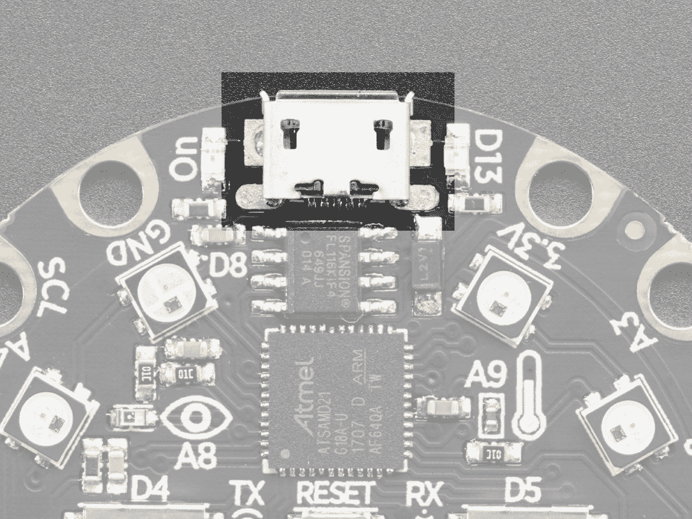
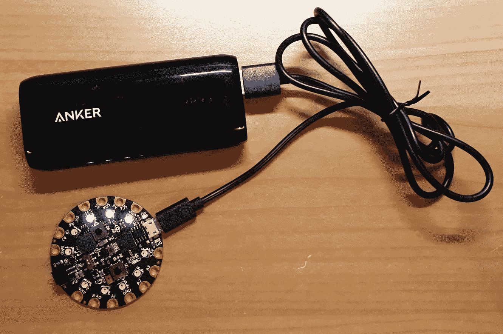
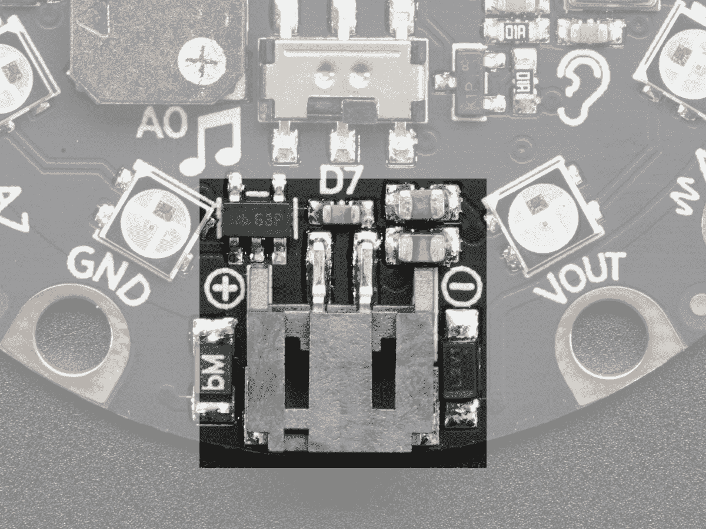
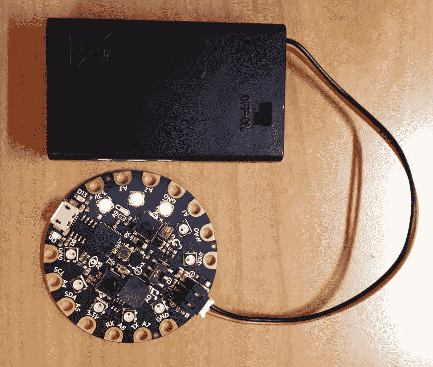

# 按钮猛击游戏

在本章中，我们将创建一个名为 Button Bash 的双人游戏，您可以直接在 Circuit Playerd Express 上玩，无需计算机。每个玩家必须尽可能快地按下按钮。每按一次按钮，该玩家的分数就会增加一分。玩家的当前分数将通过 Neopix 可视化显示。第一个得分达到 20 分的玩家赢得比赛。

为了创建这个游戏，我们将通过 NeoPixels 将按钮输入与灯光输出相结合，并通过内置扬声器将音频输出相结合。本章包含许多食谱，每一个都展示了游戏的不同部分，我们在最终食谱中结合所有这些部分来制作完整的游戏。

在本章中，我们将介绍以下主题：

*   创建类以检测按钮状态更改
*   创建自己的 Python 模块
*   向事件循环添加按钮交互
*   创建生成器以获取像素颜色
*   在记分板课上显示分数
*   使用记分板类检测获奖者
*   将记分板类添加到事件循环

# 技术要求

本章的代码文件可在 GitHub 存储库的`Chapter06`文件夹中找到，位于[https://github.com/PacktPublishing/MicroPython-Cookbook](https://github.com/PacktPublishing/MicroPython-Cookbook) 。

本章中的许多配方需要将三个音频文件传输到电路板。这些文件称为`start.wav`、`win1.wav`和`win2.wav`。它们都可以从 GitHub 存储库中的`Chapter06`文件夹下载。它们应该与您的`main.py`文件一起保存在顶级文件夹中。

本章中的许多配方都使用了 Circuit Playway Express 库，该库通常会在脚本的第一行中导入，代码如下：

```py
from adafruit_circuitplayground.express import cpx
```

这个库将帮助我们与主板附带的按钮、像素和扬声器进行交互。

# 快速电源电路

本章将介绍的游戏可以直接在 Circuit Playerd Express 上运行，无需连接计算机。这是一个很好的机会来介绍使您的项目在这种类型的板上可移植的选项。该板可以从许多不同的便携式电源接收电源。

我们将探索两种不同的方法来解决便携式电源的问题。每种方法在电路板上使用不同的连接器。我们将看到的第一个连接器是 Micro B USB 连接器，如下图所示：



Courtesy of adafruit.com

此连接器可用于将电路板连接到计算机以获取电源，并将代码和音频文件传输到电路板上。一种方法是通过 USB 将便携式电源组连接到电路板上。下面的照片显示了电路板由其中一个电源组供电：



这种方法的好处是，这些电源组有各种不同的大小和容量，因此您可以选择最符合您需求的电源组。它们是可充电的，可重复使用，并且在大多数电子产品零售商处都可以轻松购买。

我们将看到的第二个连接器是 JST 电池输入，它出现在下一张照片中：



Courtesy of adafruit.com

有许多便携式电池源可以连接到此连接器。这些电池支架中的许多都非常便宜，而且它们通常支持常用的电池尺寸，如 AAA 电池。由于电路板没有内置电池充电，您可以安全地使用普通电池或可充电电池。下图显示了一个带有开/关开关的电池架：



下一张照片显示了同一个支架的盖子打开，以提供其使用的三个 AAA 电池的视图：


上一张照片中所示的电池架可从[购买，价格约为 2 美元 https://www.adafruit.com/product/727](https://www.adafruit.com/product/727) 。

# 创建类以检测按钮状态更改

在本食谱中，您将学习如何定义一个类，该类在实例化时可以跟踪电路板上特定按钮的按钮按下事件。我们将在本章后面的菜谱中使用这个类，以便创建跟踪按钮 A 和 B 上的按钮按下的对象。

您将学习如何将公共代码块放入函数和类中，这将提高项目中的代码重用。它还可以帮助处理大型项目，以便将大量逻辑分解为更小、独立的函数和类块。此按钮事件类的实现将保持通用性，以便在不同的项目中轻松重用。

# 准备

您将需要访问电路游乐场快车上的 REPL 以运行此配方中提供的代码。

# 怎么做。。。

让我们回顾一下本配方中所需的步骤：

1.  在 REPL 中运行以下代码行：

```py
>>> from adafruit_circuitplayground.express import cpx
>>> class ButtonEvent:
...     def __init__(self, name):
...         self.name = name
...         self.last = False
...         
...         
... 
>>> button = ButtonEvent('button_a')
```

2.  在这个阶段，我们定义了我们的类并给它一个构造函数。运行下一段代码来创建这个类的第一个实例并检查它的`name`属性：

```py
>>> button = ButtonEvent('button_a')
>>> button
<ButtonEvent object at 20003410>
>>> button.name
'button_a'
```

3.  以下代码块将访问`cpx`库中的属性，该属性将指示按钮是否被按下：

```py
>>> pressed = getattr(cpx, button.name)
>>> pressed
False
```

4.  在按住按钮 A 的同时运行以下代码块。它应显示按钮的状态为`pressed`：

```py
>>> pressed = getattr(cpx, button.name)
>>> pressed
True
```

5.  应将以下代码放入`main.py`文件中，执行时，每当按下按钮 a 时，会重复打印一条消息：

```py
from adafruit_circuitplayground.express import cpx

class ButtonEvent:
    def __init__(self, name):
        self.name = name
        self.last = False

    def is_pressed(self):
        pressed = getattr(cpx, self.name)
        changed = (pressed != self.last)
        self.last = pressed
        return (pressed and changed)

button = ButtonEvent('button_a')
while True:
    if button.is_pressed():
        print('button A pressed')
```

编码部分就是这样；现在，让我们看看它是如何工作的。

# 它是如何工作的。。。

`ButtonEvent`类的定义有助于我们跟踪按钮 A 或按钮 B 的按下情况。实例化该类时，它需要一个参数，该参数指定我们正在跟踪的按钮的名称。将名称保存到实例上名为`name`的属性中，然后使用值`False`初始化最后一个变量。每次检查新事件时，此变量将跟踪按钮状态的最后一个已知值。

每次我们想要检查自上次检查以来是否发生了新的按钮按下事件时，都会调用`is_pressed`方法。它首先检索物理按钮的当前状态，以确定它是否被按下。我们用最后一个已知值检查该值，以计算是否发生了变化；我们将这个结果保存在一个名为`changed`的变量中。然后保存当前值以备将来参考。如果按钮状态已更改且当前正在按下，则该方法将返回一个`True`值。

在类定义之后，我们创建这个类的一个实例来跟踪按钮 A。然后，一个无限循环被启动，它不断检查新的按钮按下事件，并在每次检测到一个按钮按下事件时打印一条消息。

# 还有更多。。。

在这个食谱中，我们使用了一次类，来跟踪一个按钮；但是因为我们在类定义本身中没有硬编码任何特定的按钮值，所以我们可以重用这些代码来跟踪许多不同的按钮。我们可以很容易地观看两个按钮的按钮按下事件。许多 MicroPython 板允许您附加许多额外的按钮。在这些场景中，这种生成用于监视按钮的泛型类的方法非常有用。

跟踪以前的按钮状态还涉及一些逻辑，这样我们就可以检测到我们感兴趣的内容，即新的按钮按下事件。通过将所有这些代码保存在一个包含的类中，我们可以使代码更具可读性和可管理性。

# 另见

以下是一些参考资料：

*   在[中可以找到用 Python 创建类的文档 https://docs.python.org/3/tutorial/classes.html](https://docs.python.org/3/tutorial/classes.html) 。
*   内置`getattr`功能的文档可在[中找到 https://docs.python.org/3/library/functions.html#getattr](https://docs.python.org/3/library/functions.html#getattr) 。

# 创建自己的 Python 模块

在本教程中，您将学习如何将创建的代码放入自己的 Python 模块中。我们将从上一个配方中获取代码，这有助于我们跟踪按钮按下事件，并将其放入自己的专用模块中。

然后，我们将这个新创建的模块导入到我们的主 Python 脚本中，并使用它的类定义来跟踪按钮的按下。当您开始处理大型项目并希望将代码拆分为不同模块时，这是一种非常有用的方法。当您找到一个有用的模块并希望将其合并到您自己的项目中时，它也会很有帮助。

# 准备

要运行此配方中提供的代码，您需要访问电路操场 Express 上的 REPL。

# 怎么做。。。

让我们回顾一下此配方所需的步骤：

1.  应将以下代码放入名为`button.py`的新文件中；这将成为 Python 模块，我们可以在后面的步骤中导入：

```py
from adafruit_circuitplayground.express import cpx

class ButtonEvent:
    def __init__(self, name):
        self.name = name
        self.last = False

    def is_pressed(self):
        pressed = getattr(cpx, self.name)
        changed = (pressed != self.last)
        self.last = pressed
        return (pressed and changed)
```

2.  在 REPL 中运行以下代码行：

```py
>>> from button import ButtonEvent
>>> ButtonEvent
<class 'ButtonEvent'>
>>> 
```

3.  在这个阶段，我们已经能够从新的 Python 模块中导入一个类。下一行代码将创建一个新对象，用于检测新的按钮按下事件：

```py
>>> button = ButtonEvent('button_a')
>>> button.is_pressed()
False
```

4.  在按住按钮 A 的同时运行以下代码块，它将检测到按钮按下事件：

```py
>>> button = ButtonEvent('button_a')
>>> button.is_pressed()
```

5.  应将以下代码放入`main.py`文件中，当执行时，每当按下按钮 a 时，它将重复打印一条消息：

```py
from button import ButtonEvent

button = ButtonEvent('button_a')
while True:
    if button.is_pressed():
        print('button A pressed')
```

# 它是如何工作的。。。

在我们之前的食谱中，我们习惯于使用`main.py`文件。创建一个新的 Python 模块就像创建一个新文件并将代码放入其中一样简单。我们采用了`ButtonEvent`类，并将其放入自己的 Python 模块中，称为`button`。

现在，我们可以导入该类并使用该类创建对象。代码的其余部分创建一个对象来监视按钮按下，并在检测到按钮按下时打印一条消息。

# 还有更多。。。

当您创建自己的自定义 Python 模块时，请务必注意您为模块指定的名称。任何 Python 模块的相同命名限制也适用于 MicroPython 代码。例如，不能创建包含空格字符的模块。您还应该确保模块的名称与现有的 MicroPython 或 CircuitPython 模块的名称不同。因此，您不应该称您的模块为`board`或`math`，因为这些名称已经被使用。

防止这种情况的最简单方法是在创建新模块之前进入 REPL，并尝试以该名称导入模块。如果你得到一个`ImportError`，那么你知道这个名字没有被使用。

# 另见

以下是一些参考资料：

*   创建 Python 模块的文档可在[中找到 https://docs.python.org/3/tutorial/modules.html](https://docs.python.org/3/tutorial/modules.html) 。
*   关于使用 Python 模块的好处的讨论可以在[中找到 https://realpython.com/python-modules-packages/](https://realpython.com/python-modules-packages/) 。

# 向事件循环添加按钮交互

在此配方中，我们将开始构建主事件循环。每个玩家将被分配一个按钮在游戏中按下。播放器 1 将被分配按钮 A，播放器 2 将被分配按钮 B。事件循环将持续检查每个按钮，寻找新的按钮按下事件。当检测到新的按钮事件时，它将打印一条消息。

这将在本章的下一个菜谱中进一步扩展，以便添加 Button Bash 游戏的其余功能。事件循环可以在许多类型的软件应用程序中找到。探索它们的用法可以帮助您在任何时候创建自己的事件循环，或者与内置事件循环进行交互。

# 准备

要运行此配方中提供的代码，您需要访问电路操场 Express 上的 REPL。

# 怎么做。。。

让我们回顾一下此配方所需的步骤：

1.  执行 REPL 中的下一个代码块：

```py
>>> from button import ButtonEvent
>>> 
>>> buttons = {}
>>> buttons[1] = ButtonEvent('button_a')
>>> buttons[2] = ButtonEvent('button_b')
>>> buttons[1].is_pressed()
False
```

2.  在这个阶段，我们创建了两个对象来监视这两个按钮。在运行下一段代码时按住按钮 A：

```py
>>> buttons[1].is_pressed()
True
```

3.  应将以下代码放入`main.py`文件中，当执行时，每当按下按钮 a 或按钮 B 时，它将重复打印一条消息：

```py
from button import ButtonEvent

def main():
    buttons = {1: ButtonEvent('button_a'), 2: ButtonEvent('button_b')}
    while True:
        for player, button in buttons.items():
            if button.is_pressed():
                print('button pressed for player', player)

main()
```

# 它是如何工作的。。。

首先，从`button`模块导入`ButtonEvent`类。定义了一个名为`main`的函数，它将包含主事件循环的代码。最后一行代码调用`main`函数开始执行主事件循环。主事件循环首先定义一个字典，用于跟踪每个玩家的按钮。它定义了一个映射，玩家 1 将被分配按钮 a，玩家 2 将被分配按钮 B。

一个无限循环被启动，它将循环通过每个`ButtonEvent`对象，并检查是否发生了按钮按下事件。如果检测到按钮按下，它将打印哪个播放机按下了按钮。

# 还有更多。。。

随着代码变得越来越大，最好将主代码块放入它自己的函数中，您可以调用它来开始执行。随着程序规模的增长，跟踪变量将变得更加容易，因为它们都在这个主函数的范围内，而不是驻留在全局名称空间中。这有助于减少由于共享同一个大全局命名空间的大块代码而出现的一些丑陋的 bug。

在这个食谱中需要注意的另一件事是使用字典来维护玩家及其按钮的关联。对于这种类型的需求，字典数据结构是非常自然的选择。如果我们使用的硬件有更多的按钮，我们可以继续为每个播放器添加一个项目到我们的数据结构中。在代码中充分利用数据结构总是一个好主意；它使调试和软件设计更加容易。

# 另见

以下是一些参考资料：

*   `tkinter`库中使用事件循环响应按钮按下事件的文档可在[中找到 https://docs.python.org/3/library/tkinter.html#a-简单的 hello world 节目](https://docs.python.org/3/library/tkinter.html#a-simple-hello-world-program)。
*   关于`tkinter`的主要事件循环的讨论可在[中找到 https://gordonlesti.com/use-tkinter-without-mainloop/](https://gordonlesti.com/use-tkinter-without-mainloop/) 。

# 创建生成器以获取像素颜色

在这个配方中，我们将准备用于控制游戏中像素的代码。棋盘上有 10 个像素，因此每个玩家将得到 5 个像素，以表示他们到目前为止有多少点数。现在，每个玩家每次按下按钮都会得到一分，并且需要 20 分才能赢得比赛。因此，我们必须给出 0 到 20 的分数，但只有 5 个像素。

我们要做的就是让每个像素上的分数用四种颜色表示。因此，对于前四个点，第一个像素将穿过黄色、深橙色、红色和洋红。然后，当您达到分数 5 时，第二个像素将亮起黄色并经历相同的周期。

生成器将用于获取与每个玩家的每个分数相关的颜色和像素位置列表。播放器 1 将使用按钮 A，该按钮旁边有五个像素。这些是像素 0 到 4。播放器 2 将使用按钮 B，按钮旁边有五个像素。这些是像素 5 到 9。

这两组像素将在 USB 接口附近开始亮起，并向终点线（JST 电池输入）跑去。这使得玩家 1 的顺序为 0 到 4，玩家 2 的顺序为 9 到 5。本食谱将介绍生成器的一个有趣用例，当您需要基于某些涉及的逻辑生成一系列值时，它在某些项目中非常有用。

# 准备

要运行此配方中提供的代码，您需要访问电路操场 Express 上的 REPL。

# 怎么做。。。

让我们回顾一下此配方所需的步骤：

1.  使用 REPL 运行以下代码行：

```py
>>> from adafruit_circuitplayground.express import cpx
>>> BLACK = 0x000000
>>> SEQUENCE = [
...     0xFFFF00,   # Yellow
...     0xFF8C00,   # DarkOrange
...     0xFF0000,   # Red
...     0xFF00FF,   # Magenta
...     ]
>>> cpx.pixels.brightness = 0.02
>>> cpx.pixels[0] = SEQUENCE[0]
```

2.  在这个阶段，第一个像素应该用黄色点亮。在下一段代码中，我们将定义生成器并调用它来生成玩家 1 和玩家 2 的位置和颜色列表。列表中有 21 项。第一项表示得分 0，是一种特殊情况，如果没有人得分，我们希望所有像素都关闭。剩下的 20 项代表 1 到 20 分：

```py
>>> PLAYER_PIXELS1 = [0, 1, 2, 3, 4]
>>> PLAYER_PIXELS2 = [9, 8, 7, 6, 5]
>>> 
>>> def generate_colors(positions):
...     yield 0, BLACK
...     for i in positions:
...         for color in SEQUENCE:
...             yield i, color
...             
...             
... 
>>> COLORS = dict()
>>> COLORS[1] = list(generate_colors(PLAYER_PIXELS1))
>>> COLORS[2] = list(generate_colors(PLAYER_PIXELS2))
>>> 
>>> COLORS[1]
[(0, 0), (0, 16776960), (0, 16747520), (0, 16711680), (0, 16711935), (1, 16776960), (1, 16747520), (1, 16711680), (1, 16711935), (2, 16776960), (2, 16747520), (2, 16711680), (2, 16711935), (3, 16776960), (3, 16747520), (3, 16711680), (3, 16711935), (4, 16776960), (4, 16747520), (4, 16711680), (4, 16711935)]
>>> len(COLORS[1])
21
```

3.  以下代码应放入`colors.py`文件中，然后可以在下一个配方中导入，以便访问游戏的颜色数据：

```py
BLACK = 0x000000
SEQUENCE = [
    0xFFFF00,   # Yellow
    0xFF8C00,   # DarkOrange
    0xFF0000,   # Red
    0xFF00FF,   # Magenta
]
PLAYER_PIXELS1 = [0, 1, 2, 3, 4]
PLAYER_PIXELS2 = [9, 8, 7, 6, 5]

def generate_colors(positions):
    yield 0, BLACK
    for i in positions:
        for color in SEQUENCE:
            yield i, color

COLORS = dict()
COLORS[1] = list(generate_colors(PLAYER_PIXELS1))
COLORS[2] = list(generate_colors(PLAYER_PIXELS2))
```

# 它是如何工作的。。。

首先，`SEQUENCE`列表表示将在每个像素上显示的四种颜色，以表示玩家的分数。然后定义每个玩家将点亮的五个像素的位置和顺序。然后定义`generate_colors`生成器。调用时，它将生成一系列元组，每个元组包含特定分数表示的位置和颜色。这将转换为每个玩家的列表。

通过这种方式，我们可以获得任何分数，并立即查找其相关的颜色和像素位置。每个玩家和每个分数的这些颜色和位置值存储在一个名为`COLORS`的字典中，该字典可用于按玩家、数字和分数查找这些值。

# 还有更多。。。

Python**迭代器**是该语言非常强大的功能。生成器是一种迭代器，可以让您以简洁的方式实现一些强大的解决方案。在这个配方中，它们被用来帮助构建一个列表，该列表有一个特殊的第一个案例和剩余值的两个嵌套级别。

通过将所有这些逻辑放在一个生成器中，我们可以将其包含在一个地方，然后将其用作构建块来构建更复杂的结构。在本配方中，单个生成器用于为播放器 1 和播放器 2 构建颜色查找数据。

# 另见

以下是一些参考资料：

*   迭代器文档可在[中找到 https://docs.python.org/3/tutorial/classes.html#iterators](https://docs.python.org/3/tutorial/classes.html#iterators) 。
*   有关发电机的文件可在[中找到 https://docs.python.org/3/tutorial/classes.html#generators](https://docs.python.org/3/tutorial/classes.html#generators) 。

# 在记分板课上显示分数

在这个配方中，我们将准备代码，用于跟踪每个玩家的分数，并在像素上显示他们当前的分数。我们将创建一个名为`ScoreBoard`的新类，并将其放入名为`score`的新模块中。

本食谱将向您展示一种在基于 MicroPython 的游戏中实现记分板功能的方法。此配方将从开始游戏的初始逻辑开始，跟踪分数，然后在像素上显示分数。在下一个菜谱中，我们将添加更多功能来处理递增分数和检测其中一名玩家何时赢得游戏。

# 准备

要运行此配方中提供的代码，您需要访问电路操场 Express 上的 REPL。

# 怎么做。。。

让我们回顾一下此配方所需的步骤：

1.  在 REPL 中运行以下代码行：

```py
>>> from adafruit_circuitplayground.express import cpx
>>> from colors import COLORS
>>> 
>>> class ScoreBoard:
...     def __init__(self):
...         self.score = {1: 0, 2: 0}
...         cpx.pixels.brightness = 0.02
...         cpx.play_file('start.wav')
...         
...         
... 
>>> board = ScoreBoard()
>>> board.score[1]
0
```

2.  运行前面的代码后，您应该会听到棋盘播放游戏启动音频，上面写着`1 2 3 Go!`。然后，您应该看到玩家 1 的当前分数作为值`0`。
3.  下面的代码应该放在`score.py`文件中，然后我们可以导入到其他地方使用：

```py
from adafruit_circuitplayground.express import cpx
from colors import COLORS

class ScoreBoard:
    def __init__(self):
        self.score = {1: 0, 2: 0}
        cpx.pixels.brightness = 0.02
        cpx.play_file('start.wav')

    def show(self, player):
        score = self.score[player]
        pos, color = COLORS[player][score]
        cpx.pixels[pos] = color
```

4.  下面的代码将从`score`模块导入`ScoreBoard`类，将第一个玩家的分数设置为`3`值，然后在像素上显示该分数。第一个像素应启用红色：

```py
>>> from score import ScoreBoard
>>> 
>>> board = ScoreBoard()
>>> board.score[1] = 3
>>> board.show(1)
```

# 它是如何工作的。。。

`ScoreBoard`类在`score`模块中定义。当类第一次被实例化时，它为棋盘开始游戏的匹配做准备。它将玩家 1 和 2 的分数初始化为 0。然后，它设置像素的亮度并播放音频片段，向玩家宣布比赛开始。

`show`方法需要一个参数，即要显示其得分的玩家的编号。然后，它获取玩家分数的值，并将其与玩家编号一起使用，以查找必须设置的像素的颜色和位置。然后，该像素将其颜色设置为正确的颜色。

# 还有更多。。。

我们已经开始建立向球员展示当前记分牌的逻辑。在竞争性游戏中，制作一个有趣且反应灵敏的记分牌是很重要的，在这种游戏中，你想让两名玩家都参与到试图击败对方的游戏中。

更新记分板的代码必须以性能良好的方式实现。如果记分板的每次更新都是一个缓慢的过程，玩家会感觉到它，并对一个没有响应的应用程序感到沮丧。所有用于获取要设置的像素的颜色和位置的代码都以高效的方式实现，以确保其性能。

# 另见

以下是一些参考资料：

*   一个显示游戏中玩家分数的 MicroPython 项目示例可在[中找到 https://tinkercademy.com/tutorials/flappy-bird/](https://tinkercademy.com/tutorials/flappy-bird/) 。
*   可在[中找到控制 Neopix 的电池驱动的 MicroPython 项目示例 https://learn.adafruit.com/neopixel-coat-buttons](https://learn.adafruit.com/neopixel-coat-buttons) 。

# 使用记分板类检测获奖者

在此配方中，我们将扩展`ScoreBoard`类，以便能够更新玩家分数并检测玩家何时赢得游戏。一旦其中一名玩家赢了游戏，董事会将通过播放带有公告的音频剪辑来宣布哪名玩家赢了游戏。

此配方是完成`ScoreBoard`类逻辑的最后一块。完成后，我们可以将其合并到主事件循环中，并在下一个配方中完成游戏。

# 准备

要运行此配方中提供的代码，您需要访问电路操场 Express 上的 REPL。

# 怎么做。。。

让我们回顾一下此配方所需的步骤：

1.  下面的代码应该放在`score.py`文件中，然后我们可以导入到其他地方使用：

```py
from adafruit_circuitplayground.express import cpx
from colors import COLORS

class ScoreBoard:
    def __init__(self):
        self.score = {1: 0, 2: 0}
        cpx.pixels.brightness = 0.02
        cpx.play_file('start.wav')

    def scored(self, player):
        self.score[player] += 1
        self.show(player)
        if self.score[player] == 20:
            cpx.play_file('win%s.wav' % player)

    def show(self, player):
        score = self.score[player]
        pos, color = COLORS[player][score]
        cpx.pixels[pos] = color
```

2.  以下代码将从`score`模块导入`ScoreBoard`类，并打印出玩家当前的分数：

```py
>>> from score import ScoreBoard
>>> board = ScoreBoard()
>>> board.score
{2: 0, 1: 0}
```

3.  下一个代码块将增加玩家 1 的分数，使第一个像素亮起黄色，然后打印出当前分数。分数应显示玩家 1 的分数为 1 分：

```py
>>> board.scored(1)
>>> board.score
{2: 0, 1: 1}
```

# 它是如何工作的。。。

`ScoreBoard`类增加了一个额外的方法，每当一名玩家得分时，该方法将在`score`数据结构中递增。`scored`方法接收一个参数，即玩家编号，并增加该玩家的分数。

然后更新像素以显示玩家的最新分数，然后检查玩家的分数是否达到 20 分。如果玩家得分达到 20 分，棋盘将播放公告，宣布哪位玩家赢得了比赛。

# 还有更多。。。

在电子游戏中，声音和光线是与玩家互动的绝佳方式。在这个类中，声音被有效地用来宣布游戏的开始和结束。在游戏过程中，光线被用来激励每个玩家更快地按下按钮，这样他们就可以第一个到达终点线。尽管这个类中有很多内容，但每个方法都只有三到四行长，因此更容易看到每个部分涉及到的内容。这是一种将代码分成更小的块的方法，方法是将不同的部分放入不同的方法中。

# 另见

以下是一些参考资料：

*   可在[找到使用 Circuit Playerd Express 的多人游戏 https://learn.adafruit.com/circuit-playground-express-ir-zombie-game/](https://learn.adafruit.com/circuit-playground-express-ir-zombie-game/) 。

*   在[可以找到一个用 Python 实现的游戏 https://learn.adafruit.com/circuit-playground-treasure-hunt/](https://learn.adafruit.com/circuit-playground-treasure-hunt/) 。

# 将记分板类添加到事件循环

本章的最终配方结合了本章之前的所有配方，创建了最终的 Button Bash 游戏。我们将通过添加我们在前面的配方中实现的`ScoreBoard`类来升级事件循环。这是拼图的最后一块。

最终的结果是一个只有六行代码的主循环。通过在本章中创建的三个 Python 模块中的每一个模块中保留大量游戏逻辑，我们已经能够实现这一结果。当您发现代码库太大且集中在一个文件或一个函数中时，您可以在自己的项目中使用类似的方法。

# 准备

要运行此配方中提供的代码，您需要访问电路操场 Express 上的 REPL。

# 怎么做。。。

让我们回顾一下此配方所需的步骤：

1.  将以下代码放入`main.py`文件中，即可开始 Button Bash 游戏：

```py
from button import ButtonEvent
from score import ScoreBoard

def main():
    buttons = {1: ButtonEvent('button_a'), 2: ButtonEvent('button_b')}
    board = ScoreBoard()
    while True:
        for player, button in buttons.items():
            if button.is_pressed():
                board.scored(player)

main()
```

2.  如果您有本章开头提到的便携式电源之一，则可以断开主板与计算机的连接并连接该电源。
3.  你现在可以把游戏带到任何你喜欢的地方，在每个玩家之间玩回合。要开始下一场比赛，请按棋盘中央的重置按钮开始新一轮比赛。

# 它是如何工作的。。。

我们首先导入`ButtonEvent`和`ScoreBoard`对象；它们是实现事件循环其余部分所需的两个主要对象。创建按钮字典后，我们实例化一个名为`board`的新`ScoreBoard`对象。

这将宣布游戏已经开始，然后我们将进入无限循环，继续检查按钮按下事件。一旦检测到其中一个事件，它将调用 board 对象上的`scored`方法来增加特定玩家的分数。如果有任何球员达到最终得分，他们将被宣布为获胜者。

# 还有更多。。。

现在我们已经有了游戏的基本版本，有很多方法可以改变和增强它。我们可以创建两种模式的游戏，可以选择与滑动开关。可能有一个简单和困难的模式，其中一个需要 10 分，另一个需要 20 分。当电路板启动时，它检查开关以加载颜色和最终分数的正确参数。

你可以做一个三分之二的模式，两个玩家必须在三个回合中反复较量，而三分之二的玩家获胜。要查看游戏的实际情况，请看下一张照片，看到两名玩家在巴顿激战中激烈搏斗：


# 另见

以下是一些参考资料：

*   可在[找到使用 Neopix 的电池供电便携式电路 Python 项目 https://learn.adafruit.com/ufo-circuit-playground-express](https://learn.adafruit.com/ufo-circuit-playground-express) 。
*   可以在[找到使用 Neopix 的篮球篮球比赛 https://learn.adafruit.com/neopixel-mini-basketball-hoop](https://learn.adafruit.com/neopixel-mini-basketball-hoop) 。