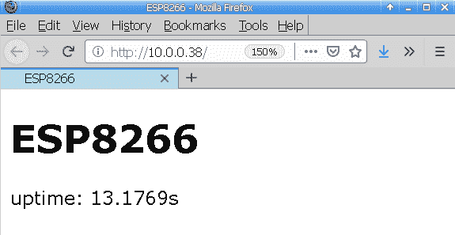
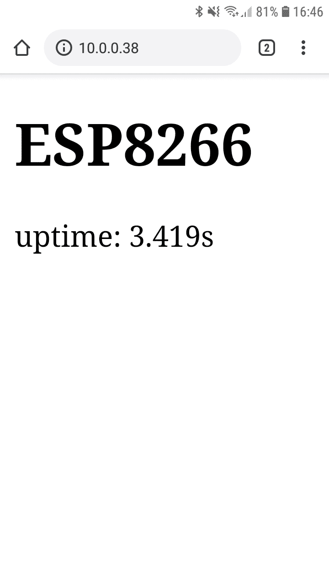

# 网络

本章将介绍与执行网络操作相关的各种主题。将给出简单的低级示例，例如使用低级套接字库执行 DNS 查找。还将介绍 HTTP 客户端和服务器实现。然后，我们将向您展示如何创建一个应用程序，让您使用 web 浏览器控制微控制器上的 LED。

本章将帮助您创建一个需要从 internet 获取信息的 MicroPython 项目。无论何时，只要你想为人们提供一种方式，让他们在手机和电脑上使用网络浏览器，直接连接到你的 MicroPython 板并与之交互，这都可以帮助你。

在本章中，我们将介绍以下主题：

*   执行 DNS 查找
*   创建等待 internet 连接的函数
*   使用原始套接字执行 HTTP 请求
*   使用 urequests 库执行 HTTP 请求
*   从 RESTful web 服务获取 JSON 数据
*   创建 HTTP 服务器
*   创建 web 处理程序模块
*   通过 web 服务器控制 LED
*   开发 RESTful API 来控制 LED

# 技术要求

本章的代码文件可在本书 GitHub 存储库的`Chapter12`文件夹中找到，可在[上找到 https://github.com/PacktPublishing/MicroPython-Cookbook](https://github.com/PacktPublishing/MicroPython-Cookbook) 。

本章使用 Adafruit 羽毛 HUZZAH ESP8266。本章中的所有配方都使用了 Python 3.1.2。您应该应用[第 10 章](09.html)中*控制 ESP8266*的*连接到现有 Wi-Fi 网络*配方中描述的配置。此配方将允许您运行本章中连接到 internet 的所有配方，以及从计算机连接到电路板的配方。

# 执行 DNS 查找

此配方将向您展示如何编写在 MicroPython 上运行的代码以执行 DNS 查找。每当我们的应用程序尝试连接到主机时，第一步就是使用 DNS 协议查找主机名并获取主机的 IP 地址，以便您可以打开到该 IP 地址的连接。

这个方法向您展示了如何执行 DNS 查找，然后将这些代码行打包到一个函数中，您可以随时调用该函数来获取特定主机的 IP 地址。当您想要跟踪主机名及其相关的 IP 地址，或者当您在设备或网络上遇到网络问题，需要一些简单的测试来解决问题时，此方法在您的项目中非常有用。

# 准备

您需要访问 ESP8266 上的 REPL 才能运行此配方中提供的代码。

# 怎么做。。。

按照以下步骤学习如何执行 DNS 查找：

1.  在 REPL 中运行以下代码行：

```py
>>> import socket
>>> 
>>> addr_info = socket.getaddrinfo('python.org', 80)
>>> addr_info
[(2, 1, 0, '', ('45.55.99.72', 80))]
```

2.  我们已经使用`getaddrinfo`函数在`python.org`上执行 DNS 查找并获取其 IP 地址。以下代码块将访问包含 IP 地址的返回数据结构中的指定字符串：

```py
>>> ip = addr_info[0][-1][0]
>>> ip
'45.55.99.72'
```

3.  现在，我们可以将此代码封装在一个函数中，该函数返回给定主机名的 IP 地址：

```py
>>> def get_ip(host, port=80):
...     addr_info = socket.getaddrinfo(host, port)
...     return addr_info[0][-1][0]
...     
...     
... 
>>> 
```

4.  我们将使用许多不同的主机名调用此函数，以验证它是否正常工作：

```py
>>> get_ip('python.org')
'45.55.99.72'
>>> get_ip('micropython.org')
'176.58.119.26'
>>> get_ip('pypi.org')
'151.101.0.223'
```

5.  以下代码应放入`main.py`文件中：

```py
import socket
import time

BOOTUP_WIFI_DELAY = 5

def get_ip(host, port=80):
    addr_info = socket.getaddrinfo(host, port)
    return addr_info[0][-1][0]

def main():
    print('applying wifi delay...')
    time.sleep(BOOTUP_WIFI_DELAY)
    print('performing DNS lookup...')
    hosts = ['python.org', 'micropython.org', 'pypi.org']
```

```py
    for host in hosts:
        print(host, get_ip(host))

main()
```

执行此脚本时，它将对三个主机名执行 DNS 查找，并打印每次查找的结果。

# 它是如何工作的。。。

定义的`get_ip`函数将接收主机名作为第一个参数，并在每次函数调用结束时返回 IP 地址之前，对主机名执行 DNS 查找。有一个可选参数指定连接到主机时要使用的 TCP 端口。TCP 端口默认值设置为端口`80`。这是 HTTP 协议的端口号。这意味着此功能将适用于托管 web 服务器的主机。

`main`功能休眠 5 秒钟，以允许电路板在启动时建立与 Wi-Fi 网络的连接，然后再执行 DNS 查找。然后，`main`函数通过三个主机名循环，并对每个主机名执行 DNS 查找，通过`for`循环打印出每个条目的主机名和返回的 IP。

# 还有更多。。。

这个脚本可以很好地完成它的任务，但是还有改进的余地。在大多数 Wi-Fi 网络上，5 秒钟的延迟就足够了。然而，有些网络需要更长的时间，所以这个值应该增加。但是，如果我们将该值设置得很高，并且网络连接速度很快，那么我们就不必要地等待太长时间。在下一个配方中，我们将介绍一种等待互联网连接的方法，该方法将以更有效的方式解决这两个限制。每当您在代码中使用硬编码的睡眠值时，您都应该深入挖掘并尝试找到更好的解决方案。

# 另见

以下是有关此配方的一些参考资料：

*   有关`getaddrinfo`功能的文档可在[中找到 https://docs.python.org/3/library/socket.html#socket.getaddrinfo](https://docs.python.org/3/library/socket.html#socket.getaddrinfo) 。

*   在 MicroPython 上使用`getaddrinfo`的示例可以在[中找到 https://docs.micropython.org/en/latest/esp8266/tutorial/network_tcp.html#star-战争模拟](https://docs.micropython.org/en/latest/esp8266/tutorial/network_tcp.html#star-wars-asciimation)。

# 创建等待 internet 连接的函数

本食谱将向您展示如何编写一个函数，在启动时轮询 Wi-Fi 连接的状态。我们将此函数命名为`wait_for_networking`。一旦检测到已成功建立连接，并且已通过 DHCP 分配 IP 地址，`wait_for_networking`功能将返回。

每当您有一个需要 internet 连接的项目时，您都会在启动时遇到这个问题。如果脚本立即启动，在网络连接开始之前连接到 internet，则会引发异常并无法继续。一旦网络连接正确建立，使用此配方中的方法将允许您开始程序的其余执行。

# 准备

您需要访问 ESP8266 上的 REPL 才能运行此配方中提供的代码。

# 怎么做。。。

按照以下步骤学习如何创建等待 internet 连接的函数：

1.  在 REPL 中执行以下代码块：

```py
>>> import network
>>> import time
>>> 
>>> station = network.WLAN(network.STA_IF)
>>> station.isconnected()
False
```

2.  当代码运行得足够早时，它将返回一个`False`值。再次调用`isconnected`，但在稍后阶段，将导致以下输出：

```py
>>> station.isconnected()
True
```

3.  连接网络后，可使用以下代码块检索分配的 IP 地址：

```py
>>> ip = station.ifconfig()[0]
>>> ip
'10.0.0.38'
```

4.  以下函数将所有这些代码合并为一个函数，该函数将等待网络连接建立并为设备分配 IP 地址。然后返回 IP 地址：

```py
>>> def wait_for_networking():
...     station = network.WLAN(network.STA_IF)
...     while not station.isconnected():
...         print('waiting for network...')
...         time.sleep(1)
...     ip = station.ifconfig()[0]
...     print('address on network:', ip)
...     return ip
...     
...     
... 
>>> 
>>> ip = wait_for_networking()
address on network: 10.0.0.38
>>> ip
'10.0.0.38'
>>> 
```

5.  以下代码应放入`netcheck.py`文件中：

```py
import network
import time

def wait_for_networking():
    station = network.WLAN(network.STA_IF)
    while not station.isconnected():
        print('waiting for network...')
        time.sleep(1)
    ip = station.ifconfig()[0]
```

```py
    print('address on network:', ip)
    return ip
```

6.  以下代码块应放入`main.py`文件中：

```py
from netcheck import wait_for_networking

def main():
    ip = wait_for_networking()
    print('main started')
    print('device ip:', ip)

main()
```

执行此脚本时，它将等待建立网络连接，然后打印分配给设备的 IP 地址。

# 它是如何工作的。。。

在这个配方中，我们创建了一个名为`netcheck`的 Python 模块。该模块中的`wait_for_networking`功能将创建一个名为`station`的 WLAN 对象。`station`对象将用于每隔 1 秒轮询网络，直到建立网络连接。然后，它将使用`ifconfig`方法从`station`对象获取分配的 IP。然后将该 IP 地址返回给调用函数。这个配方中的主脚本只是从`netcheck`模块导入`wait_for_networking`函数，并在开始执行时调用它，然后打印出返回的 IP 地址。

# 还有更多。。。

因此，许多网络连接的项目应该只在网络连接后启动其主要代码块。在典型的计算机上运行 Python 时，操作系统会在为您启动其他服务之前确保所有网络连接都已启动。在 MicroPython 的例子中，没有操作系统——它只是在裸机上运行的脚本。您必须考虑这些因素，以便代码能够正确运行。

# 另见

以下是有关此配方的一些参考资料：

*   关于**动态主机配置协议**（**DHCP**的文档可在[中找到 https://tools.ietf.org/html/rfc2131](https://tools.ietf.org/html/rfc2131) 。
*   有关 Linux 上的`systemd`如何处理检测网络连接的文档，请参见[https://www.freedesktop.org/wiki/Software/systemd/NetworkTarget/](https://www.freedesktop.org/wiki/Software/systemd/NetworkTarget/) 。

# 使用原始套接字执行 HTTP 请求

这个方法将使用 MicroPython 和 Python 附带的`socket`库来执行 HTTP 请求。我们将创建一个函数，该函数接收 URL 作为其输入，并在执行 HTTP 请求后从请求的 web 服务器返回响应。我们还将创建一个函数，该函数可以解析 URL 并返回 URL 的主机名和路径组件。执行 HTTP 请求将需要这些部分。

有一整类的 MicroPython 项目都希望连接到互联网上的 web 服务器并获取不同的结果。您将看到使用`socket`库实现这一点的一种方法，该库允许您直接访问 TCP 套接字，以从中读取和写入数据字节。

# 准备

您需要访问 ESP8266 上的 REPL 才能运行此配方中提供的代码。

# 怎么做。。。

按照以下步骤学习如何使用原始套接字执行 HTTP 请求：

1.  使用 REPL 运行以下代码行：

```py
>>> import socket
>>> import time
>>> 
>>> def parse_url(url):
...     return url.replace('http://', '').split('/', 1)
...     
...     
... 
>>> 
```

2.  我们已经成功创建了`parse_url`函数，它接受一个 URL 并返回`host`和`path`组件：

```py
>>> url = 'http://micropython.org/ks/test.html'
>>> host, path = parse_url(url)
>>> host
'micropython.org'
>>> path
'ks/test.html'
>>> 
```

3.  然后使用示例 URL 调用`parse_url`以演示其功能。在下面的代码块中，我们定义并调用一个函数来查找特定主机名的 IP 地址：

```py
>>> HTTP_PORT = 80
>>> def get_ip(host, port=HTTP_PORT):
...     addr_info = socket.getaddrinfo(host, port)
...     return addr_info[0][-1][0]
...     
...     
... 
>>> ip = get_ip(host)
>>> ip
'176.58.119.26'
>>> 
```

4.  我们现在可以定义`fetch`函数，该函数接收 URL 作为其输入，并从 web 服务器检索其内容：

```py
>>> HTTP_REQUEST = 'GET /{path} HTTP/1.0\r\nHost: {host}\r\n\r\n'
>>> BUFFER_SIZE = 1024
>>> 
>>> def fetch(url):
...     host, path = parse_url(url)
...     ip = get_ip(host)
...     sock = socket.socket()
...     sock.connect((ip, 80))
...     request = HTTP_REQUEST.format(host=host, path=path)
...     sock.send(bytes(request, 'utf8'))
...     response = b''
...     while True:
...         chunk = sock.recv(BUFFER_SIZE)
...         if not chunk:
...             break
...         response += chunk
...     sock.close()
...     body = response.split(b'\r\n\r\n', 1)[1]
...     return str(body, 'utf8')
...     
...     
... 
>>> 
```

5.  我们现在可以调用此函数并检查它返回的结果：

```py
>>> html = fetch('http://micropython.org/ks/test.html')
>>> html
'<!DOCTYPE html>\n<html lang="en">\n    <head>\n        <title>Test</title>\n    </head>\n    <body>\n        <h1>Test</h1>\n        It\'s working if you can read this!\n    </body>\n</html>\n'
>>> print(html)
<!DOCTYPE html>
<html lang="en">
    <head>
        <title>Test</title>
    </head>
    <body>
        <h1>Test</h1>
        It's working if you can read this!
    </body>
</html>

>>> 
```

6.  以下代码应放入`main.py`文件中：

```py
from netcheck import wait_for_networking
import socket

HTTP_REQUEST = 'GET /{path} HTTP/1.0\r\nHost: {host}\r\n\r\n'
HTTP_PORT = 80
BUFFER_SIZE = 1024

def parse_url(url):
    return url.replace('http://', '').split('/', 1)

def get_ip(host, port=HTTP_PORT):
    addr_info = socket.getaddrinfo(host, port)
    return addr_info[0][-1][0]

def fetch(url):
    host, path = parse_url(url)
    ip = get_ip(host)
    sock = socket.socket()
    sock.connect((ip, 80))
    request = HTTP_REQUEST.format(host=host, path=path)
    sock.send(bytes(request, 'utf8'))
    response = b''
    while True:
        chunk = sock.recv(BUFFER_SIZE)
        if not chunk:
            break
        response += chunk
    sock.close()
    body = response.split(b'\r\n\r\n', 1)[1]
    return str(body, 'utf8')

def main():
    wait_for_networking()
    html = fetch('http://micropython.org/ks/test.html')
    print(html)

main()
```

当执行此脚本时，它将获取特定 URL 的内容并输出返回的结果。

# 它是如何工作的。。。

`parse_url`函数将返回我们感兴趣的 URL 的两个主要部分。这是通过删除 URL 的初始部分并使用`/`字符执行单个字符串拆分来完成的。一旦执行了这些操作，我们将得到 URL 的主机名和路径部分，然后返回。`fetch`函数首先调用`parse_url`和`get_ip`来获取给定 URL 的主机名、路径和 IP 地址信息。完成此操作后，将创建到 web 服务器的套接字连接。

HTTP 请求是通过填写名为`HTTP_REQUEST`的模板创建的。然后，该请求通过网络传输到 web 服务器。结果将作为一系列块持续读取，直到响应结束。这些数据块连接在一起，形成一个名为 response 的变量。

响应中包含 HTTP 头和正文。我们只对身体部分感兴趣，所以我们使用`split`方法提取它。提取后，它将从`bytes`对象转换为字符串并返回。调用`main`函数时，将等待网络连接，然后调用`fetch`函数获取 URL 的 HTML 内容。然后将该内容打印出来。

# 还有更多。。。

这个食谱里有很多东西。在某种程度上，这是了解 TCP 套接字、HTTP、HTML 和 URL 的一个好方法，因为所有底层细节都向您公开。MicroPython 没有随 Python 标准库附带的更高级 HTTP 请求库。

因此，当您想从头开始编写代码，从 web 服务器获取内容时，您必须以与本配方相同的方式使用`socket`库。在下一个配方中，我们将看到一个 Python 模块，它与 MicroPython 一起工作，我们可以将它添加到我们的项目中，以使执行这些 HTTP 请求更加简单。

# 另见

以下是有关此配方的一些参考资料：

*   关于 micropythonsocket 对象的`send`方法的文档可以在[中找到 https://docs.micropython.org/en/latest/library/usocket.html#usocket.socket.send](https://docs.micropython.org/en/latest/library/usocket.html#usocket.socket.send) 。
*   关于 micropythonsocket 对象的`recv`方法的文档可以在[中找到 https://docs.micropython.org/en/latest/library/usocket.html#usocket.socket.recv](https://docs.micropython.org/en/latest/library/usocket.html#usocket.socket.recv) 。

# 使用 urequests 库执行 HTTP 请求

这个配方将使用`urequests`库，它是专门为使用 MicroPython 而编写的。它提供了连接到 web 服务器和执行 HTTP 请求的便捷方式。这个库提供了一个对象，您可以使用它来执行所有 HTTP 交互。请求完成后，您可以访问此对象的不同属性，以获取有关已完成请求的各种信息。

此配方将探索如何使用此库以及您可能希望在其对象上访问的不同属性。当您开始创建需要发出 HTTP 请求的 MicroPython 项目时，这个库将处理发出这些请求的许多低级细节。这将使您的代码更简单、可读性更强，并使您能够专注于手头的任务，而不是陷入低级 TCP 套接字细节的泥潭。

# 准备

您需要访问 ESP8266 上的 REPL 才能运行此配方中提供的代码。

# 怎么做。。。

按照以下步骤学习如何使用`urequests`执行 HTTP 请求：

1.  从[下载`urequests.py`https://github.com/micropython/micropython-lib/blob/master/urequests/urequests.py](https://github.com/micropython/micropython-lib/blob/master/urequests/urequests.py) 。
2.  将此 Python 模块保存在板的顶级目录中。
3.  在 REPL 中运行以下代码行：

```py
>>> import urequests
>>> 
>>> url = 'http://micropython.org/ks/test.html'
>>> req = urequests.get(url)
```

4.  我们现在有一个完整的 HTTP 请求，其结果存储在`req`变量中。以下代码块将输出我们从 web 服务器收到的 HTML 响应：

```py
>>> req.text
'<!DOCTYPE html>\n<html lang="en">\n    <head>\n        <title>Test</title>\n    </head>\n    <body>\n        <h1>Test</h1>\n        It\'s working if you can read this!\n    </body>\n</html>\n'
>>> print(req.text)
<!DOCTYPE html>
<html lang="en">
    <head>
        <title>Test</title>
    </head>
    <body>
        <h1>Test</h1>
        It's working if you can read this!
    </body>
</html>

>>> 
```

5.  我们还可以访问二进制形式的原始内容，如以下代码块所示：

```py
>>> req.content
b'<!DOCTYPE html>\n<html lang="en">\n    <head>\n        <title>Test</title>\n    </head>\n    <body>\n        <h1>Test</h1>\n        It\'s working if you can read this!\n    </body>\n</html>\n'
>>> 
```

6.  `status_code`属性为我们提供响应的 HTTP 状态码：

```py
>>> req.status_code
200
```

7.  以下代码块将尝试访问不存在的页面：

```py
>>> url = 'http://micropython.org/no_such_page_exists'
>>> req = urequests.get(url)
```

8.  我们现在可以检查状态代码和解释性文本的值：

```py
>>> req.status_code
404
>>> req.reason
b'Not Found'
>>> 
```

9.  以下代码应放入`main.py`文件中：

```py
from netcheck import wait_for_networking
import urequests

def main():
    wait_for_networking()
    url = 'http://micropython.org/ks/test.html'
    html = urequests.get(url).text
    print(html)

main()
```

执行此脚本时，它将使用`urequests`库获取特定 URL 的内容并输出页面的 HTML 内容。

# 它是如何工作的。。。

`urequests`库提供了一个名为`get`的函数，允许您在 web 服务器上执行 HTTP`GET`请求。调用此函数后，它将返回一个对象，该对象具有许多有用的属性，您可以访问这些属性来检索此请求的结果。

您可以通过访问 content 属性以字节对象的形式获取原始响应，也可以通过访问`text`属性以字符串的形式获取值。最后，您可以使用`status_code`和`reason`属性来检查请求是成功还是失败，以及失败的原因是什么。然后将此代码打包并放入`main`函数中。调用 main 函数时，它将连接到 web 服务器并输出返回的 HTML 文档的内容。

# 还有更多。。。

这个方法展示了一种很好的方法，可以在 MicroPython HTTP 请求中提高效率，而不必进行非常低级别的详细说明。这是一个很好的例子，说明了设计良好的库如何使代码更具可读性和可维护性。

除了基本的 HTTP`GET`请求之外，该库还提供了许多 HTTP 方法。`HEAD`、`POST`、`PUT`、`PATCH`和`DELETE`方法也都可用。它们都可以使用与请求方法匹配的函数名进行访问。当您与需要指定正确 HTTP 方法才能正常工作的 web 服务交互时，这可能非常有用。如果每次使用`urequests`库进行 HTTP 调用时都收到警告消息，则可以尝试使用`fix_urequests_warnings.py`文件修复此问题。您可以在本书 GitHub 存储库的`Chapter12`文件夹中找到此脚本。

# 另见

以下是有关此配方的一些参考资料：

*   HTTP 响应状态代码列表的文档可在[中找到 https://developer.mozilla.org/en-US/docs/Web/HTTP/Status](https://developer.mozilla.org/en-US/docs/Web/HTTP/Status) 。
*   `urequests`的设计所基于的是流行请求库，可以在[找到 http://docs.python-requests.org/en/master/](http://docs.python-requests.org/en/master/) 。

# 从 RESTful web 服务获取 JSON 数据

本食谱将向您展示一个连接到 internet 上的服务器以使用其 RESTful web 服务的示例。web 服务将提供 JSON 格式的数据，然后对其进行解析，以便我们可以访问返回数据集的不同部分。

我们将使用提供**国际空间站**（**国际空间站**当前位置的 web 服务。由于国际空间站以 28000 公里/小时的惊人速度移动，我们可以观察到它的位置（以经度和纬度表示）在我们反复调用这个 web 服务时发生变化。每当您想要创建一个连接到丰富的基于 internet 的 web 服务世界的 MicroPython 项目时，您都可以使用本配方中涵盖的技术作为构建这些连接的起点。

# 准备

您需要访问 ESP8266 上的 REPL 才能运行此配方中提供的代码。

# 怎么做。。。

按照以下步骤学习如何从 RESTful web 服务获取 JSON 数据：

1.  在 REPL 中执行以下代码块：

```py
>>> import urequests
>>> import time
>>> 
>>> ISS_API_URL = 'http://api.open-notify.org/iss-now.json'
>>> req = urequests.get(ISS_API_URL)
```

2.  我们已经成功地连接到网络服务并获取了空间站的位置。以下代码块将检查已返回给我们的数据：

```py
>>> req.text
'{"timestamp": 1555012195, "iss_position": {"latitude": "-33.1779", "longitude": "45.0667"}, "message": "success"}'
>>> 
```

3.  数据以 JSON 格式提供。我们可以使用以下代码块来解析文本数据并生成一组嵌套字典：

```py
>>> data = req.json()
>>> data
{'message': 'success', 'iss_position': {'longitude': '45.0667', 'latitude': '-33.1779'}, 'timestamp': 1555012195}
```

4.  下面的代码块显示了如何从返回的数据结构访问纬度和经度数据：

```py
>>> data['iss_position']['latitude']
'-33.1779'
>>> data['iss_position']['longitude']
'45.0667'
```

5.  现在，我们将创建并调用`track_space_station`函数，该函数将在`10`秒内每秒跟踪空间站的位置：

```py
>>> req.status_code
>>> def track_space_station():
...     for i in range(10):
...         data = urequests.get(ISS_API_URL).json()
...         position = data['iss_position']
...         print(i, 'lat: {latitude} long: {longitude}'.format(**position))
...         time.sleep(1)
...         
...         
... 
>>> track_space_station()
0 lat: -38.5192 long: 52.4146
1 lat: -38.5783 long: 52.5069
2 lat: -38.6570 long: 52.6302
3 lat: -38.7355 long: 52.7538
4 lat: -38.7943 long: 52.8467
5 lat: -38.8726 long: 52.9708
6 lat: -38.9507 long: 53.0952
7 lat: -39.0092 long: 53.1887
8 lat: -39.0871 long: 53.3136
9 lat: -39.1454 long: 53.4075
>>> 
```

6.  以下代码应放入`main.py`文件中：

```py
from netcheck import wait_for_networking
import urequests
import time

ISS_API_URL = 'http://api.open-notify.org/iss-now.json'

def track_space_station():
    for i in range(10):
        data = urequests.get(ISS_API_URL).json()
        position = data['iss_position']
        print(i, 'lat: {latitude} long: {longitude}'.format(**position))
        time.sleep(1)

def main():
    wait_for_networking()
    track_space_station()

main()
```

执行此脚本时，它将跟踪国际空间站的位置，并在固定时间段内每秒显示纬度和经度的变化。

# 它是如何工作的。。。

我们定义了一个名为`ISS_API_URL`的常量，它有一个 URL，我们可以用来检索 ISS 当前所在位置的信息。当我们通过执行 HTTP`GET`请求调用此 API 时，服务器以 JSON 格式返回其输出。然后，我们可以对返回的请求对象使用`json`方法将该响应解析为 Python 数据结构。我们可以访问`iss_position`键以及字典中的经纬度信息。`track_space_station`函数的其余部分只是循环`10`迭代，在调用 API 并打印其解析结果之前，每个循环之间有 1 秒钟的睡眠时间。

# 还有更多。。。

这个食谱是一个很好的例子，说明了 web 服务的世界是多么丰富多彩。您可以将这些小型低功耗微控制器连接到各种丰富的信息源。JSON 是这些 web 服务最流行的序列化格式，因此内置支持使用 MicroPython 解析此格式是一个非常强大的功能。

MicroPython 还完全支持创建 JSON 输出，这样您就可以从 MicroPython 项目向 web 服务提交数据。您可以将一些传感器连接到主板，并使用 web 服务将 JSON 格式的传感器数据持续上传到远程服务器。

# 另见

以下是有关此配方的一些参考资料：

*   有关国际空间站当前位置 API 的文件可在[中找到 http://open-notify.org/Open-Notify-API/ISS-Location-Now/](http://open-notify.org/Open-Notify-API/ISS-Location-Now/) 。
*   有关 JSON 格式的文档可在[中找到 https://www.json.org/](https://www.json.org/) 。

# 创建 HTTP 服务器

这个方法将向您展示如何用 MicroPython 创建一个 web 服务器，该服务器将在 ESP8266 上为具有动态内容的 web 页面提供服务。每次浏览器访问 web 服务器时，它都会以秒为单位显示电路板的当前正常运行时间。

我们将确保生成的网页在计算机 web 浏览器和手机浏览器上都能很好地呈现。它对于您创建的项目来说是一个非常强大的工具，因为您可以使用 web 浏览器从网络上的任何电话或计算机与它们进行交互。

这个方法向你展示了如何创建这样的项目，你可以直接向人们的浏览器提交任何实时传感器数据或信息，而不管他们是通过手机还是台式计算机连接。

# 准备

您需要访问 ESP8266 上的 REPL 才能运行此配方中提供的代码。

# 怎么做。。。

按照以下步骤学习如何创建 HTTP 服务器：

1.  使用 REPL 运行以下代码行：

```py
>>> from netcheck import wait_for_networking
>>> import socket
>>> import time
>>> 
>>> HTTP_PORT = 80
>>> TCP_BACKLOG = 0
```

2.  在这个阶段，我们已经导入了所有必要的 Python 模块并定义了常量。以下代码块将定义一个 HTML 模板，在将页面提交到连接浏览器之前，我们将使用该模板生成页面：

```py
>>> TEMPLATE = """\
... <!DOCTYPE HTML>
... <html lang="en">
... <head>
...     <title>ESP8266</title>
...     <meta charset="UTF-8">
...     <link rel="icon" href="data:,">
...     <meta name="viewport" content="width=device-width">
... </head>
... <body>
...     <h1>ESP8266</h1>
...     uptime: {uptime}s
...     </body>
...     </html>
... """
>>> 
```

3.  定义并调用以下函数，并将绑定和侦听默认 HTTP 端口：

```py
>>> def socket_listen():
...     sock = socket.socket()
...     sock.bind(('0.0.0.0', HTTP_PORT))
...     sock.listen(TCP_BACKLOG)
...     return sock
...     
...     
... 
>>> ip = wait_for_networking()
address on network: 10.0.0.38
>>> sock = socket_listen()
```

4.  下面的代码块定义并调用`serve_requests`函数，该函数将负责为向 web 服务器发出的任何请求提供服务。调用该函数，然后浏览器分别访问 web 服务器三次。每次送达请求时，其详细信息都会打印出来：

```py
>>> def serve_requests(sock, ip):
...     print('webserver started on http://%s/' % ip)
...     start = time.monotonic()
...     while True:
...         conn, address = sock.accept()
...         print('request:', address)
...         request = conn.makefile('rwb')
...         while True:
...             line = request.readline()
...             if not line or line == b'\r\n':
...                 break
...         uptime = time.monotonic() - start
...         html = TEMPLATE.format(uptime=uptime)
...         conn.send(html)
...         conn.close()
...         
...         
... 
>>> 
>>> serve_requests(sock, ip)
webserver started on http://10.0.0.38/
request: ('10.0.0.151', 47290)
request: ('10.0.0.151', 47292)
request: ('10.0.0.151', 47294)
```

5.  以下代码应放入`main.py`文件中：

```py
from netcheck import wait_for_networking
import socket
import time

HTTP_PORT = 80
TCP_BACKLOG = 0
TEMPLATE = """\
<!DOCTYPE HTML>
<html lang="en">
<head>
    <title>ESP8266</title>
    <meta charset="UTF-8">
    <link rel="icon" href="data:,">
    <meta name="viewport" content="width=device-width">
</head>
<body>
    <h1>ESP8266</h1>
    uptime: {uptime}s
</body>
</html>
"""

def socket_listen():
    sock = socket.socket()
    sock.bind(('0.0.0.0', HTTP_PORT))
    sock.listen(TCP_BACKLOG)
    return sock

def serve_requests(sock, ip):
    print('webserver started on http://%s/' % ip)
    start = time.monotonic()
    while True:
        conn, address = sock.accept()
        print('request:', address)
        request = conn.makefile('rwb')
        while True:
            line = request.readline()
            if not line or line == b'\r\n':
                break
        uptime = time.monotonic() - start
        html = TEMPLATE.format(uptime=uptime)
        conn.send(html)
        conn.close()

def main():
    ip = wait_for_networking()
    sock = socket_listen()
    serve_requests(sock, ip)

main()
```

当执行此脚本时，它将在每次板启动时启动 web 服务器，每次浏览器访问服务器时，该脚本将显示一条消息，其中包含服务器的正常运行时间。

# 它是如何工作的。。。

脚本中首先定义的内容之一是 HTML 模板。此模板将生成有效的 HTML5 网页，这些网页将在手机和台式机上正确呈现。

存在`icon`链接标记是为了防止 web 浏览器不必要地请求`favicon.ico`文件。调用`socket_listen`函数绑定并侦听默认 HTTP 端口。然后调用`serve_requests`函数，它将无休止地为所有传入的 HTTP 请求提供服务。web 服务器的启动时间记录在名为`start`的变量中。我们将使用它来计算每个请求的服务器正常运行时间。

我们调用`accept`方法，它将阻止代码，直到 web 服务器收到新的请求。一旦我们收到这个新的请求，我们就通过反复调用`readline`方法来使用所有 HTTP 请求头，直到我们检测到请求头的结尾。我们现在可以生成 HTML 响应，并使用`send`方法将其发送到 HTTP 客户端。传输响应后，我们关闭与客户端的连接。

# 还有更多。。。

你可以采用这个食谱，并以多种方式扩展它。您可以从连接到电路板的不同传感器和按钮读取数据，并将这些数据发送回浏览器。您还可以轻松地更改模板并向模板添加更多内容。

目前，它只有 HTML 内容，但没有任何东西阻止您将 CSS、JavaScript 和图像内容添加到响应中。该电路板配有 4 MB 的闪存，因此电路板上有足够的空间来添加所有这些内容。以下屏幕截图显示了从桌面浏览器上显示的此配方生成的页面：



以下屏幕截图取自 Android 智能手机上的浏览器：



在这个配方中设计 HTML 的方式是让一个代码库为两种类型的设备提供服务变得容易。

# 另见

以下是有关此配方的一些参考资料：

*   有关`bind`方法的文件可在[中找到 https://docs.micropython.org/en/latest/library/usocket.html#usocket.socket.bind](https://docs.micropython.org/en/latest/library/usocket.html#usocket.socket.bind) 。
*   有关`listen`方法的文件可在[中找到 https://docs.micropython.org/en/latest/library/usocket.html#usocket.socket.listen](https://docs.micropython.org/en/latest/library/usocket.html#usocket.socket.listen) 。

# 创建 web 处理程序模块

这个方法将向您展示如何将处理套接字、解析 HTTP 请求头和生成 HTML 所涉及的大量代码和逻辑打包到一个 Python 模块中。一旦我们把它放在一个模块中，我们就可以导入这个模块并将它传递给我们的 web 处理程序，它将为我们完成所有繁重的工作。

当您在微控制器上创建基于 web 的应用程序的项目时，您会发现这个方法非常有用，并且您希望快速获得生产力，而不会陷入套接字和解析 HTTP 头的所有低级细节中。

# 准备

您需要访问 ESP8266 上的 REPL 才能运行此配方中提供的代码。

# 怎么做。。。

按照以下步骤学习如何创建 web 处理程序模块：

1.  在 REPL 中运行以下代码行：

```py
>>> from netcheck import wait_for_networking
>>> import socket
>>> 
>>> HTTP_PORT = 80
>>> TCP_BACKLOG = 0
>>> BASE_TEMPLATE = """\
... <!DOCTYPE HTML>
... <html lang="en">
... <head>
...     <title>MicroPython</title>
...     <meta charset="UTF-8">
...     <link rel="icon" href="data:,">
...     <meta name="viewport" content="width=device-width">
... </head>
... <body>
... %s
... </body>
... </html>
... """
>>> 
```

2.  我们已经创建了一个名为`BASE_TEMPLATE`的变量，它将充当通用模板。现在，我们可以用我们想要的任何内容填充它的`body`标签。下面的代码块定义了`socket_listen`，它为服务器进行初始套接字配置：

```py
>>> def socket_listen():
...     sock = socket.socket()
...     sock.bind(('0.0.0.0', HTTP_PORT))
...     sock.listen(TCP_BACKLOG)
...     return sock
...     
...     
... 
```

3.  下面的代码块具有一个函数，该函数接收 web 处理程序作为参数。调用时，它将处理传入请求，以便收集它们的请求头，然后解析 HTTP 方法和请求路径。然后将此信息传递给处理程序，处理程序将返回要发送到 HTTP 客户端的 HTML 内容：

```py
>>> def serve_requests(sock, ip, handler):
...     print('webserver started on http://%s/' % ip)
...     while True:
...         conn, address = sock.accept()
...         stream = conn.makefile('rwb')
...         request = b''
...         while True:
...             line = stream.readline()
...             request += line
...             if not line or line == b'\r\n':
...                 break
...         request = str(request, 'utf8')
...         method, path, _ = request.split(' ', 2)
...         client_ip = address[0]
...         print('request:', client_ip, method, path)
...         html = handler(request, method, path)
...         conn.send(html)
...         conn.close()
...         
...         
... 
>>> 
```

4.  然后在下面的代码块中定义`run_server`函数。它提供了一个处理程序，将创建套接字并调用`serve_requests`来开始服务所有传入请求：

```py
>>> def run_server(handler):
...     ip = wait_for_networking()
...     sock = socket_listen()
...     serve_requests(sock, ip, handler)
...     
...     
... 
>>> 
```

5.  下面的代码块显示了一个示例处理程序，该处理程序创建了一个 web 应用程序，每次有人访问该应用程序时都会生成随机数：

```py
>>> import random
>>> 
>>> def handler(request, method, path):
...     body = 'random: %s' % random.random()
...     return BASE_TEMPLATE % body
...     
...     
... 
>>> run_server(handler)
address on network: 10.0.0.38
webserver started on http://10.0.0.38/
request: 10.0.0.151 GET /hotneumm
request: 10.0.0.151 GET /
request: 10.0.0.151 GET /
request: 10.0.0.151 GET /
```

6.  以下代码应放入`web.py`文件中：

```py
from netcheck import wait_for_networking
import socket

HTTP_PORT = 80
TCP_BACKLOG = 0
BASE_TEMPLATE = """\
<!DOCTYPE HTML>
<html lang="en">
<head>
    <title>MicroPython</title>
    <meta charset="UTF-8">
    <link rel="icon" href="data:,">
    <meta name="viewport" content="width=device-width">
</head>
<body>
%s
</body>
</html>
"""
def socket_listen():
    sock = socket.socket()
    sock.bind(('0.0.0.0', HTTP_PORT))
    sock.listen(TCP_BACKLOG)
    return sock

def serve_requests(sock, ip, handler):
    print('webserver started on http://%s/' % ip)
    while True:
        conn, address = sock.accept()
        stream = conn.makefile('rwb')
        request = b''
        while True:
            line = stream.readline()
            request += line
            if not line or line == b'\r\n':
                break
        request = str(request, 'utf8')
        method, path, _ = request.split(' ', 2)
        client_ip = address[0]
        print('request:', client_ip, method, path)
        html = handler(request, method, path)
        conn.send(html)
        conn.close()

def run_server(handler):
    ip = wait_for_networking()
    sock = socket_listen()
    serve_requests(sock, ip, handler)
```

7.  然后，将以下代码放入`main.py`文件中：

```py
from web import BASE_TEMPLATE, run_server
import random

def handler(request, method, path):
    body = 'random: %s' % random.random()
    return BASE_TEMPLATE % body

def main():
    run_server(handler)

main()
```

当执行此脚本时，它将在启动时启动一个 web 服务器，每当有人访问它时，该服务器都会生成随机数。

# 它是如何工作的。。。

这个配方的大部分是`web`Python 模块中的代码。此代码提供了`BASE_TEMPLATE`变量，该变量可以用其`body`标记中的任何内容填充。然后，在模块中定义了三个功能。

`socket_listen`函数具有我们熟悉的逻辑；也就是说，设置套接字，绑定它，并使其侦听端口`80`。`serve_requests`函数现在接收一个处理程序，并将在一个名为`request`的变量中收集 HTTP 请求头。然后解析此`request`以提取正在使用的 HTTP 方法和请求的路径。然后将这三个变量传递给提供的处理程序，该处理程序返回要传输到 HTTP 客户端的 HTML 响应。`run_server`功能是进入本模块的主要入口。您可以调用它并为其提供处理程序，它将设置服务器并开始处理请求。

`main.py`文件中的代码导入`web`模块并传递其定义的处理程序。它的处理程序只是为每个 HTTP 请求生成一个随机数，并将该数字发送回 web 浏览器。

# 还有更多。。。

这个食谱有助于推广。大部分与套接字处理和字节转换相关的代码都是由`web`模块完成的。您可以导入此模块，并在相对较短的时间内开始在 MicroPython 板上创建 web 应用程序。

您还可以扩展`web`模块以添加更多功能。您可以创建更多的内置模板或进一步解析 HTTP 头，以自动访问更多请求信息。

# 另见

以下是有关此配方的一些参考资料：

*   有关`accept`方法的文件可在[中找到 https://docs.micropython.org/en/latest/library/usocket.html#usocket.socket.accept](https://docs.micropython.org/en/latest/library/usocket.html#usocket.socket.accept) 。
*   有关`close`方法的文件可在[中找到 https://docs.micropython.org/en/latest/library/usocket.html#usocket.socket.close](https://docs.micropython.org/en/latest/library/usocket.html#usocket.socket.close) 。

# 通过 web 服务器控制 LED

本食谱将向您展示如何创建一个基于 web 的应用程序，让人们看到红色和蓝色 LED 灯的状态，以及打开和关闭它们。无论何时，只要您想要创建通过基于网络的应用程序控制不同硬件组件（如 LED、屏幕或扬声器）的输出的项目，该方法都会帮助您，该应用程序可以从计算机和手机上访问。

# 准备

您需要访问 ESP8266 上的 REPL 才能运行此配方中提供的代码。

# 怎么做。。。

按照以下步骤学习如何通过 web 服务器控制 LED：

1.  在 REPL 中执行以下代码块：

```py
>>> from web import BASE_TEMPLATE, run_server
>>> from machine import Pin
>>> 
>>> pins = dict(red=Pin(0, Pin.OUT), blue=Pin(2, Pin.OUT))
>>> state = dict(red=True, blue=True)
>>> 
>>> 
```

2.  已经创建了`pins`和`state`变量，以便我们可以跟踪红色和蓝色 LED 的状态，以及访问它们的`Pin`对象。下面的代码块将定义 HTML`BODY`模板，并显示 LED 的当前状态，以及提供按钮来打开和关闭 LED：

```py
>>> BODY = """
... Red: {red}<br/>
... Blue: {blue}<br/><br/>
... Toggle Colors:<br/><br/>
... <form action="/red" method=post><input type=submit value=Red></form><br/>
... <form action="/blue" method=post><input type=submit value=Blue></form><br/>
... """
>>> 
```

3.  以下代码块具有一个函数，该函数将布尔值格式化为我们将生成的 HTML 内容的`On`和`Off`标签：

```py
>>> def format(value):
...     return 'On' if value else 'Off'
...     
...     
... 
>>> 
>>> format(True)
'On'
>>> format(False)
'Off'
>>> 
```

4.  `gen_body`函数生成 HTML 内容的主体部分：

```py
>>> def gen_body():
...     data = {k: format(v) for k, v in state.items()}
...     return BODY.format(**data)
...     
...     
... 
>>> gen_body()
'\nRed: On<br/>\nBlue: On<br/><br/>\nToggle Colors:<br/><br/>\n<form action="/red" method=post><input type=submit value=Red></form><br/>\n<form action="/blue" method=post><input type=submit value=Blue></form><br/>\n'
>>> 
```

5.  `toggle_color`功能将打开和关闭 LED。第一次呼叫将关闭红色 LED，然后第二次呼叫将重新打开：

```py
>>> def toggle_color(color):
...     state[color] = not state[color]
...     pin_value = 0 if state[color] else 1
...     pins[color].value(pin_value)
...     
...     
... 
>>> toggle_color('red')
>>> toggle_color('red')
```

6.  `handler`功能将切换`POST`请求的颜色，对于所有请求，它将返回生成的 HTML 正文，显示 LED 的状态并提供切换按钮：

```py
>>> def handler(request, method, path):
...     if method == 'POST':
...         color = path.replace('/', '')
...         toggle_color(color)
...     return BASE_TEMPLATE % gen_body()
...     
...     
... 
>>> 
```

7.  以下代码应放入`main.py`文件中：

```py
from web import BASE_TEMPLATE, run_server
from machine import Pin

pins = dict(red=Pin(0, Pin.OUT), blue=Pin(2, Pin.OUT))
state = dict(red=True, blue=True)

BODY = """
Red: {red}<br/>
Blue: {blue}<br/><br/>
Toggle Colors:<br/><br/>
<form action="/red" method=post><input type=submit value=Red></form><br/>
<form action="/blue" method=post><input type=submit value=Blue></form><br/>
"""

def format(value):
    return 'On' if value else 'Off'

def gen_body():
    data = {k: format(v) for k, v in state.items()}
    return BODY.format(**data)

def toggle_color(color):
    state[color] = not state[color]
    pin_value = 0 if state[color] else 1
    pins[color].value(pin_value)

def handler(request, method, path):
    if method == 'POST':
        color = path.replace('/', '')
        toggle_color(color)
    return BASE_TEMPLATE % gen_body()

def main():
    pins['red'].value(0)
    pins['blue'].value(0)
    run_server(handler)

main()
```

执行此脚本时，它将启动一个 web 应用程序，该应用程序显示 LED 的当前状态，并提供可用于打开和关闭 LED 的按钮。

# 它是如何工作的。。。

`format`函数接受布尔值并返回值以指示`On`或`Off`的灯光状态。然后，`gen_body`函数将循环遍历所有 LED 状态值，并对其进行格式化，以便填充 HTML 模板。然后填写并返回此模板。`toggle_color`功能接收要切换的 LED 名称，然后在访问`Pin`对象之前更新状态数据结构，以便将更改应用于 LED。如果请求是`POST`请求，则`handler`功能将接收传入请求并切换 LED。然后，它将始终返回生成的主体以显示 LED 的最新值，并提供按钮来打开和关闭 LED。`main`函数初始化 LED`Pin`对象，然后使用定义的处理程序调用`run_server`函数，以便开始处理传入请求。

# 还有更多。。。

此配方提供了检查 LED 当前设置并打开和关闭 LED 所需的所有控件。然而，我们可以在许多方面扩展和改进它。我们可以添加一些 CSS 来改善应用程序的外观。我们还可以使用一些丰富的 JavaScript 控件，当有人与 UI 控件交互时，这些控件可以创建动画，使它们的行为更像切换按钮。

# 另见

以下是有关此配方的一些参考资料：

*   有关 web 浏览器切换控件的文档，请参见[http://www.bootstraptoggle.com/](http://www.bootstraptoggle.com/) 。
*   有关 HTTP`POST`方法的文档可在[中找到 https://developer.mozilla.org/en-US/docs/Web/HTTP/Methods/POST](https://developer.mozilla.org/en-US/docs/Web/HTTP/Methods/POST) 。

# 开发 RESTful API 来控制 LED

此配方将向您展示如何创建一个托管在 ESP8266 上的 RESTful API，该 API 将允许 API 客户端查询 LED 的状态，以及开关 LED。在前面的介绍中，我们已经了解了如何使用 MicroPython 作为客户端来访问 restfulweb 服务。

现在，我们将改变这一点，并提供 RESTful web 服务，以便网络上的其他设备和计算机可以连接到主板并控制其硬件。当您需要网络上的其他计算机和设备远程连接到您的项目并控制其上的组件时，您会发现此方法非常有用。

# 准备

您需要访问 ESP8266 上的 REPL 才能运行此配方中提供的代码。您还需要`curl`命令行工具，可从[下载 https://curl.haxx.se/download.html](https://curl.haxx.se/download.html) 。

# 怎么做。。。

按照以下步骤学习如何开发 RESTful API 来控制 LED：

1.  使用 REPL 运行以下代码行：

```py
>>> from web import BASE_TEMPLATE, run_server
>>> from machine import Pin
>>> import json
>>> 
>>> pins = dict(red=Pin(0, Pin.OUT), blue=Pin(2, Pin.OUT))
>>> state = dict(red=True, blue=True)
```

2.  我们已经导入了`json`库，并设置了`pins`和`state`变量。以下代码块将定义`JSON_HEADERS`模板，我们将使用该模板为 JSON 响应提供 HTTP 响应头：

```py
>>> JSON_HEADERS = '''\
... HTTP/1.1 200 OK
... Content-Type: application/json
... 
... '''
>>> 
```

3.  以下代码块将为 RESTful API 调用执行 LED 切换：

```py
>>> def toggle_color(color):
...     state[color] = not state[color]
...     pin_value = 0 if state[color] else 1
...     pins[color].value(pin_value)
...     
...     
... 
>>> 
```

4.  当请求使用`POST`方法时，以下代码中的`handler`功能将切换 LED。在所有情况下，它都将以 JSON 序列化形式返回状态变量的值：

```py
>>> def handler(request, method, path):
...     if method == 'POST':
...         color = path.replace('/', '')
...         toggle_color(color)
...     return JSON_HEADERS + json.dumps(state) + '\n'
...     
...     
... 
>>> 
```

5.  以下代码应放入`main.py`文件中：

```py
from web import BASE_TEMPLATE, run_server
from machine import Pin
import json

pins = dict(red=Pin(0, Pin.OUT), blue=Pin(2, Pin.OUT))
state = dict(red=True, blue=True)
JSON_HEADERS = '''\
HTTP/1.1 200 OK
Content-Type: application/json

'''

def toggle_color(color):
    state[color] = not state[color]
    pin_value = 0 if state[color] else 1
    pins[color].value(pin_value)

def handler(request, method, path):
    if method == 'POST':
        color = path.replace('/', '')
        toggle_color(color)
    return JSON_HEADERS + json.dumps(state) + '\n'

def main():
    pins['red'].value(0)
    pins['blue'].value(0)
    run_server(handler)

main()
```

6.  执行`main.py`脚本，这样我们就可以开始访问 RESTful API 了。
7.  在您的计算机上下载并安装`curl`命令行（[https://curl.haxx.se/download.html](https://curl.haxx.se/download.html) 。
8.  在终端中运行以下命令：

```py
$ curl http://10.0.0.38/
{"red": true, "blue": true}
```

9.  这将检索 LED 的状态。执行以下命令以关闭红色 LED：

```py
$ curl -X POST http://10.0.0.38/red
{"red": false, "blue": true}
```

10.  当我们运行以下命令时，红色 LED 将重新打开：

```py
$ curl -X POST http://10.0.0.38/red
{"red": true, "blue": true}
```

`curl`命令行是测试大多数 RESTful API 并与之交互的极好方法。

# 它是如何工作的。。。

代码的结构与前面的配方非常相似。一些主要区别在于`JSON_HEADERS`模板提供了必要的 HTTP 响应头，以指示响应的内容类型将是 JSON。`json`模块中的`dumps`函数也用于从状态数据结构生成 JSON 数据。我们需要先启动服务器，然后才能通过`curl`测试 API 并与之交互。第一个`curl`命令只是执行一个`GET`请求，返回 LED 的状态。然后，我们使用`curl`中的`-X`选项指定我们要使用 POST 方法，以便我们可以打开和关闭 LED。

# 还有更多。。。

这个配方提供了一组基本的 API，这样我们就可以控制电路板上的灯。我们可以扩展它，以响应有关服务器运行时间或磁盘使用情况的请求。您可以创建一个 API，允许您远程列出和删除文件。RESTful API 是非常强大的工具，可用于通过网络将许多不同的脚本和计算机粘合在一起。我们在本配方中使用的方法可以扩展，以相对轻松地提供更多服务和功能。

# 另见

以下是有关此配方的一些参考资料：

*   有关对 HTTP`POST`请求使用`curl`命令的文档，请参见[https://ec.haxx.se/http-post.html](https://ec.haxx.se/http-post.html) 。
*   有关 RESTful API 的教程，请访问[https://www.restapitutorial.com/](https://www.restapitutorial.com/) 。