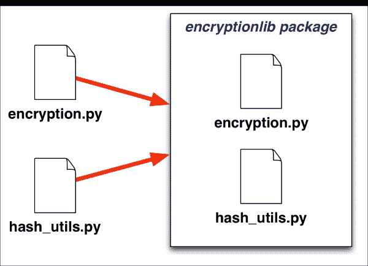

# 第六章创建可重用模块

模块化编程不仅是编写自用程序的好方法，也是编写其他程序员可以使用的程序的好方法。在本章中，我们将介绍如何设计和实现可在其他程序中共享和重用的模块和包。特别是，我们将：

*   了解如何使用模块和包来共享您编写的代码
*   了解编写重用模块与编写仅作为一个程序的一部分使用的模块的区别
*   了解是什么使模块适合重用
*   看看成功的可重用模块的例子
*   设计一个可重用的包
*   实现一个可重用的包

让我们先看看如何使用模块和包与其他人共享代码。

# 使用模块和包共享您的代码

无论何时您编写一些 Python 源代码，您创建的代码都将执行某种任务。您的代码可能会分析一些数据，将一些信息存储到文件中，或者提示用户从列表中选择项目。不管你的代码最终是什么，你的代码做了*什么*。

通常，这件事是非常具体的。例如，您可能有一个计算复利、生成维恩图或向用户显示警告消息的函数。一旦您编写了这段代码，您就可以在自己的程序中随时随地使用它。这是上一章描述的简单抽象模式：您将*想要做什么*与*如何做*分开。

一旦编写了函数，就可以在需要执行该任务时调用它。例如，只要您想向用户显示警告，就可以调用`display_warning()`函数，而不必担心警告显示的细节。

然而，这个假设的`display_warning()`函数不仅仅在您正在编写的程序中有用。其他程序可能希望执行与您将来编写的程序和其他人可能编写的程序相同的任务。与其每次都重新发明轮子，不如*重用*代码。

要重用你的代码，你必须共享它。有时，您可能会与自己共享代码，以便在不同的程序中使用。在其他时候，您可以与其他开发人员共享代码，以便他们可以在自己的程序中使用。

当然，您不仅仅是出于慈善目的与他人共享代码。在一个更大的组织中，您通常需要共享代码以提高同事的工作效率。即使你自己工作，你也会受益于使用别人共享的代码，通过共享你自己的代码，其他人可以帮助你发现错误并修复你自己无法修复的问题。

无论您是与自己（在其他项目中）还是与他人（在您的组织内或更广泛的开发社区中）共享代码，基本过程都是相同的。您可以通过三种主要方式共享代码：

1.  您可以创建一个代码段，然后将其复制并粘贴到新程序中。代码片段可能存储在名为`Code Snippet Manager`的应用程序或文本文件文件夹中，甚至可以作为博客的一部分发布。
2.  您可以将要共享的代码放入模块或包中，然后将此模块或包导入新程序。模块或包可以物理地复制到新程序的源代码中，它可以放在 Python 安装的`site-packages`目录中，或者您可以修改`sys.path`以包含可以找到模块或包的目录。
3.  或者，您可以将代码转换为独立程序，然后使用`os.system()`从其他代码调用此程序。

虽然所有这些选项都有效，但并非所有选项都是理想的。让我们仔细看看每一个：

*   代码片段对于只构成函数一部分的短小代码非常有用。然而，它们在跟踪代码的最终位置方面非常糟糕。因为您已经将代码复制并粘贴到新程序的中间，所以修改它非常容易，因为没有简单的方法将粘贴的代码与您编写的程序的其余部分区分开来。此外，如果原始代码段需要修改（例如，为了修复错误），则必须找到在程序中使用该代码段的位置，并将其更新以匹配。所有这些都相当混乱，而且容易出错。
*   The technique of importing modules or packages has the advantage of working well with larger chunks of code. The code you are sharing can include multiple functions and even be split across multiple source files using a Python package. You are also much less likely to accidentally modify an imported module as the source code is stored in a separate file.

    如果已将源模块或包复制到新程序中，则如果原始模块或包发生更改，则需要手动更新。这并不理想，但因为要替换整个文件，所以这并不太困难。另一方面，如果您的新程序使用存储在其他地方的模块，则无需更新对原始模块所做的任何更改将立即应用于使用该模块的任何程序。

*   Finally, organizing your code into a standalone program means that your new program has to execute it. This can be done in the following way:

    ```py
    status = os.system("python other_program.py <params>")
    if status != 0:
        print("The other_program failed!")
    ```

    如您所见，可以运行另一个 Python 程序，等待它完成，然后检查返回的状态代码以确保程序成功运行。如果愿意，还可以将参数传递给正在运行的程序。但是，您可以传递给程序并接收回来的信息非常有限。例如，如果您有一个程序解析 XML 文件并将该文件的摘要保存到磁盘上的另一个文件中，但是您不能直接将 Python 数据结构传递给另一个程序进行处理，并且您不能再次接收 Python 数据结构，那么这种方法将起作用。

### 注

实际上，您*可以*在正在运行的程序之间传输 Python 数据结构，但所涉及的过程非常复杂，不值得考虑。

正如所见，代码片段、模块/包导入和独立程序形成了一种连续体：代码片段非常小且粒度很细，模块和包导入支持更大的代码块，同时仍然易于使用和更新，独立程序很大，但与之交互的方式有限。

在这三种方法中，使用模块和包导入来共享代码似乎达到了最佳效果：它们可以用于大量代码，易于使用和交互，并且在必要时易于更新。这使得模块和包成为与您自己、在未来项目中使用以及与其他人共享 Python 源代码的理想机制。

# 什么使模块可重用？

为了使模块或包装可重复使用，必须满足以下要求：

*   它必须作为一个独立的单元运行
*   如果您的包打算作为其他系统源代码的一部分包含，则必须使用相对导入来加载包中的其他模块
*   必须清楚地注明任何外部依赖关系

如果一个模块或包不满足这三个要求，那么在其他程序中重用它将非常困难，如果不是不可能的话。现在让我们依次更仔细地了解这些需求。

## 作为独立单元运行

假设您决定共享一个名为`encryption`的模块，该模块使用公钥/私钥对执行文本加密。然后另一个程序员将这个模块复制到他们的程序中。但是，当他们尝试使用它时，他们的程序会崩溃，并显示以下错误消息：

```py
ImportError: No module named 'hash_utils'

```

`encryption`模块可能已共享，但它依赖于原始程序（`hash_utils.py`中未共享的另一个模块，因此`encryption`模块本身是无用的。

此问题的解决方案是将您想要共享的模块与它可能依赖的任何其他模块组合在一起，将这些模块放在一个包中。然后共享包，而不是单个模块。下图显示了如何执行此操作：



在本例中，我们创建了一个名为`encryptionlib`的新包，并将`encryption.py`和`hash_utils.py`文件都移动到此包中。当然，这需要重构程序的其余部分，以适应这些模块的新位置，但它确实允许您在其他程序中重用加密逻辑。

### 注

虽然以这种方式重构程序可能会很麻烦，但其结果几乎总是对原始程序的改进。将相关模块放在一个包中有助于改进代码的整体组织。

## 使用相对进口

继续上一节的例子，假设您想将新的`encryptionlib`包作为另一个程序的一部分使用，但不想将其作为单独的包公开。在这种情况下，您可以简单地将整个`encryptionlib`目录作为新系统源代码的一部分。但是，当您这样做时，如果您的模块不使用相对导入，您可能会遇到问题。例如，如果您的`encryption`模块依赖于`hash_utils`模块，那么`encryption`模块将包含一个引用`hash_utils`模块的`import`语句。但是，如果`encryption`模块以以下任何一种方式导入`hash_utils`，则生成的包无法重用：

```py
import hash_utils
from my_program.lib import hash_utils
from hash_utils import *
```

所有这些导入语句都将失败，因为它们假定`hash_utils.py`文件位于程序源代码中的特定固定点。任何关于依赖模块在程序源代码中的位置的假设都会限制包的可重用性，因为您不能将包移动到其他位置并期望它工作。考虑到新项目的需求，您通常必须将包和模块存储在与最初开发包和模块不同的地方。例如，`encryptionlib`包可能需要与所有其他重用库一起安装在`thirdparty`包中。使用绝对导入时，程序包将失败，因为其中模块的位置将发生更改。

### 注

如果发布包并将其安装到 Python`site-packages`目录中，则不适用此选项。但是，在很多情况下，您不希望在`site-packages`目录中安装可重用的包，因此需要小心相对导入。

要解决此问题，请确保包中引用同一包中其他模块的任何`import`语句始终使用相对导入。例如：

```py
from . import hash_utils
```

这将允许您的包在 Python 源代码树中的任何位置工作。

## 注意外部依赖性

想象一下我们的新`encryptionlib`包使用了我们在上一章中遇到的`NumPy`库。也许`hash_utils`从 NumPy 导入了一些函数，并使用它们快速计算数字列表的二进制散列。即使 NumPy 是作为原始程序的一部分安装的，您也不能假设新程序也是如此：如果您要将`encryptionlib`包安装到新程序中并运行它，它最终会失败，并出现以下错误：

```py
ImportError: No module named 'numpy'

```

为了防止这种情况发生，任何想要重用您的模块的人都必须了解对第三方模块的依赖性，并确切地知道您的模块或包需要安装什么才能正常工作，这一点很重要。包含此信息的理想位置是您正在共享的模块或软件包的`README`文件或其他文档。

### 注

如果您使用的是自动部署系统，如 setuptools 或 pip，那么这些工具有自己的方法来识别包的需求。不过，在文档中列出需求仍然是一个好主意，这样用户在安装软件包之前就能知道这些需求。

# 什么是好的可重用模块？

在前面的部分中，我们研究了可重用模块的*最低*要求。现在让我们来研究一下*理想的*重用性需求。一个完美的可重用模块是什么样子的？

优秀的可重用模块与差劲的可重用模块有三个区别：

*   它试图解决一般问题（或一系列问题），而不仅仅是执行特定任务
*   它遵循标准约定，使得在其他地方使用该模块更容易
*   该模块有清晰的文档记录，以便其他人能够轻松理解和使用

让我们仔细看看每一点。

## 解决一般问题

通常当你在编程时，你会发现你需要执行一个特定的任务，所以你写了一个函数来执行这个任务。例如，考虑以下内容：

*   您需要将英寸转换为厘米，因此您需要编写一个`inch_to_cm()`函数来执行此任务。
*   You need to read a list of place names from a text file, which uses vertical bar characters (`|`) as delimiters between the fields:

    ```py
    FEATURE_ID|FEATURE_NAME|FEATURE_CLASS|...
    1397658|Ester|Populated Place|...
    1397926|Afognak|Populated Place|...
    ```

    为此，您需要创建一个`load_placenames()`函数，从该文件中读取数据。

*   You need to display the number of customers to a user:

    ```py
    1 customer
    8 customers
    ```

    消息是否使用单词`customer`或`customers`取决于提供的数字。要处理这个问题，您需要创建一个`pluralize_customers()`函数，根据提供的数字返回消息的适当复数版本。

在所有这些示例中，您都在解决一个特定的问题。通常，类似这样的函数最终会成为模块的一部分，您可能希望重用模块或与其他人共享模块。然而，这三个函数，`inch_to_cm()`、`load_placenames()`和`pluralize_customers()`都非常特定于您试图解决的问题，因此对新程序的适用性有限。这三个国家都迫切要求更为普遍：

*   编写一个将*任何*英制距离转换为公制的函数，然后创建另一个相反的函数，而不是`inch_to_cm()`函数。
*   与其编写一个只加载地名的函数，不如实现一个`load_delimited_text()`函数，该函数适用于任何类型的分隔文本文件，并且不假定特定的列名或分隔符是竖线字符。
*   不要只对客户名称进行复数，而是编写一个更通用的`pluralize()`函数，将程序中可能需要的完整名称范围进行复数。由于英语的反复无常，你不能仅仅假设所有的名字都可以通过在末尾加一个*s*来复数；您将需要一个异常字典，例如 person/people、axis/axis 和 series/series，以便此函数可以处理您可能想要复数化的各种名称。为了使此函数更加有用，如果它不知道要进行复数化的单位类型，您可以让它选择性地接受名称的复数版本：

    ```py
    def pluralize(n, singular_name, plural_name=None):
    ```

虽然这些只是三个具体的例子，但您可以看到，通过概括您正在共享的代码，您可以将其应用到更广泛的任务中。通常，泛化一个函数所涉及的工作很少，但是使用您创建的代码的人会非常欣赏这个结果。

## 以下标准约定

尽管您可以按照自己喜欢的方式编写代码，但如果您想与他人共享您的代码，遵循标准的编码约定是有意义的。这使得其他人更容易使用您的代码，而不必记住库的特定样式。

若要使用真实世界的示例，请考虑下面的代码片段：

```py
shapefile = ogr.Open("...")
layer = shapefile.GetLayer(0)
for i in range(layer.GetFeatureCount()):
  feature = layer.GetFeature(i)
  shape = shapely.loads(feature.GetGeometryRef().ExportToWkt())
  if shape.contains(target_zone):
    ...
```

这段代码使用了两个库：执行计算几何的 Shapely 库和读取和写入地理空间数据的 OGR 库。Shapely 库遵循使用小写字母作为函数名和方法名的标准 Python 约定：

```py
shapely.loads(...)
shape.contains(...)
```

虽然这些库的细节相当复杂，但这些函数和方法的命名很容易记住和使用。但是，将其与 OGR 库进行比较，OGR 库将每个函数和方法名称的首字母大写：

```py
ogr.Open(...)
layer.GetFeatureCount()
```

同时使用这两个库，您必须始终记住，OGR 将每个函数和方法名称的第一个字母大写，而 Shapely 不会。这使得使用 OGR 比它需要的更尴尬，并导致结果代码中出现许多错误，这些错误需要修复。

如果 OGR 库只是遵循 Shapely 相同的命名约定，那么所有这些都可以避免。

幸运的是，Python 有一个名为**Python 风格指南**（[的文档 https://www.python.org/dev/peps/pep-0008/](https://www.python.org/dev/peps/pep-0008/) ），为如何设置代码的格式和样式提供了一套清晰的建议。函数名和方法名使用小写字母源于本指南，以及大多数 Python 代码也遵循的大量其他建议。本文档描述了从如何命名变量到何时在括号周围放置空格的所有内容。

虽然编码约定是个人偏好的问题，而且您当然不需要严格遵循 Python 样式指南中的说明，但这样做（至少在影响代码用户的范围内）将使您的可重用模块和包更易于他人使用，就像 OGR 库的示例一样，您不希望用户在任何时候想要导入和使用您的代码时都必须不断记住一种不寻常的命名样式。

## 文件清晰

即使您编写了一个完美的模块，解决了一系列一般化的问题，并且忠实地遵循 Python 风格指南，如果没有人知道如何使用它，您的模块也将毫无用处。不幸的是，作为程序员，我们常常过于接近我们的代码：代码的工作方式对我们来说是显而易见的，因此我们陷入了一个陷阱，认为它对其他人来说也是显而易见的。除此之外，程序员通常*讨厌*编写文档，我们更愿意编写一千行精心编制的 Python 代码，而不是一段描述其工作原理的段落。因此，我们共享的代码的文档通常是不情愿地编写的（如果有的话）。

问题是，一个高质量的可重用模块或包将*始终*包含文档。本文档将解释模块的功能和工作原理，并提供示例，以便读者能够立即了解如何在自己的程序中使用此模块或包。

对于一个文档非常丰富的 Python 模块或包的例子，我们只需要查看标准库（[上的**Pyth****就可以了 https://docs.python.org/3/library/**](https://docs.python.org/3/library/) 。每个模块都有清晰的文档记录，并附有详细信息和示例，以帮助指导程序员。例如，以下是`datetime.timedelta`类文档的缩写版本：


每个模块、类、函数和方法都有明确的文档记录，并附有示例和详细说明，以帮助该模块的用户。

作为一个可重用模块的开发者，你不可能达到这样的高度。Python 标准库是一项巨大的协作工作，没有人编写所有这些文档。但这是一个你应该瞄准的*类型*文档的好例子：包含大量示例的全面文档。

虽然您可以在字处理器中创建文档，或者使用复杂的文档生成系统（如用于构建 Python 文档的 Sphinx 系统），但有两种非常简单的方法可以让您轻松地编写文档：创建自述文件，或者使用 docstring。

`README`文件只是一个文本文件，包含在构成模块或包的各种源文件中。它通常被命名为`README.txt`，它只是一个普通的文本文件。可以使用与编辑 Python 源代码相同的编辑器创建此文件。

自述文件可以根据需要扩展或最小化。如果您的模块或软件包包含来自其他人的代码，则包含有关如何安装和使用模块的信息、任何许可问题、一些使用示例以及确认信息通常会很有帮助。

docstring 是一个 Python 字符串，它将*附加到*模块或函数。这是专门用于文档目的的，并且有一种非常特殊的 Python 语法用于创建 docstring：

```py
""" my_module.py

    This is the documentation for the my_module module.
"""
def my_function():
    """ This is the documentation for the my_function() function.

        As you can see, the documentation can span more than
        one line.
    """
    ...
```

在 Python 中，可以使用三个引号字符来标记跨越 Python 源文件多行的字符串。这些三重引号字符串可以在不同的地方使用，包括 docstring。如果模块以三引号字符串开头，则该字符串将用作整个模块的文档。类似地，如果任何函数以三重引号字符串开头，则该字符串将用作该函数的文档。

### 注

这同样适用于 Python 中的其他定义，如类、方法等。

docstring通常用于描述模块或函数的功能、需要的参数以及返回的信息。还应包括模块或功能的任何值得注意的方面，例如意外的副作用、使用示例等。

文档字符串（和自述文件）不必非常广泛。你不想花几个小时在一个只有三个人可能使用的模块中编写一些晦涩难懂的函数文档。但是编写良好的 docstring 和自述文件是优秀且易于使用的模块或包的标志。

编写文档是一项技能；就像所有的技能一样，通过练习你会变得更好。要创建可共享的高质量模块和软件包，您应该养成创建 docstring 和自述文件的习惯，并遵循编码约定，尽可能多地概括代码，正如我们在本章前面几节中所述。如果您从一开始就致力于生成高质量的可重用代码，您会发现这并不难。

# 可重用模块示例

你不必看太远就能找到可重用模块的例子；**Python 包索引**（[https://pypi.python.org/pypi](https://pypi.python.org/pypi) 提供了一个巨大的共享模块和包存储库。您可以按名称或关键字搜索包，也可以按主题、许可证、目标受众、开发状态等浏览存储库。

尽管Python 包索引非常庞大，但它也非常有用：包括了所有最成功的包和模块。让我们更仔细地看看这些更流行的可重用软件包。

## 请求

`requests`图书馆（[http://docs.python-requests.org/en/master/](http://docs.python-requests.org/en/master/) 是一个Python包，可以轻松地向远程服务器发送 HTTP 请求并处理响应。虽然 Python 标准库中包含的`urllib2`包允许您发出 HTTP 请求，但它通常很难使用，并且会以意外的方式失败。`requests`包更容易使用，更可靠；因此，它变得非常流行。

下面的示例代码显示了`requests`库如何允许您发送复杂的 HTTP 请求并轻松处理响应：

```py
import requests

response = requests.post("http://server.com/api/login",
                         {'username' : username,
                          'password' : password})
if response.status_code == 200: # OK
    user = response.json()
    if user['logged_in']:
        ...
```

`requests`库自动编码要发送到服务器的参数，优雅地处理超时，并使检索 JSON 格式响应变得容易。

请求库很容易安装（在大多数情况下，您可以简单地使用 pip 安装请求）。它有优秀的文档，包括用户指南、社区指南和详细的 API 文档，并且完全符合 Python 风格指南。它还提供了一组非常通用的功能，通过 HTTP 协议处理与外部网站和系统的各种通信。考虑到所有这些因素，`requests`在整个 Python 包索引中排名第三，这也就不足为奇了。

## python dateutil

`dateutil`套餐[https://github.com/dateutil/dateutil](https://github.com/dateutil/dateutil) 扩展了Python 标准库中包含的`datetime`包，增加了对重复日期、时区、复杂相对日期等的支持。

以下示例代码以比我们在上一章*欢乐时光*计算更简单的形式计算复活节星期五的日期：

```py
from dateutil.easter import easter
easter_friday = easter(today.year) - datetime.timedelta(days=2)
```

`dateutil`提供了大量示例的优秀文档，使用`pip install python-dateutil`易于安装，遵循 Python 风格指南，对于解决一系列与日期和时间相关的难题非常有用。这是 Python 包索引中成功且流行的包的另一个示例。

## lxml

`lxml`工具包（[http://lxml.de](http://lxml.de) 是一个非常成功的 Python 包的示例，它充当两个现有 C 库的包装器。正如这家编写良好的网站所说，`lxml`消除了阅读和编写 XML 和 HTML 格式文档的痛苦。它是按照 Python 标准库（`ElementTree`中的现有库建模的，但速度更快，功能更多，不会以意外方式崩溃。

下面的示例代码显示了如何使用`lxml`快速生成 XML 格式的数据：

```py
from lxml import etree

movies = etree.Element("movie")
movie = etree.SubElement(movies, "movie")
movie.text = "The Wizard of Oz"
movie.set("year", "1939")

movie = etree.SubElement(movies, "movie")
movie.text = "Mary Poppins"
movie.set("year", "1964")

movie = etree.SubElement(movies, "movie")
movie.text = "Chinatown"
movie.set("year", "1974")

print(etree.tostring(movies, pretty_print=True))
```

这将打印一个 XML 格式的文档，其中包含有关三部经典电影的信息：

```py
<movie>
 <movie year="1939">The Wizard of Oz</movie>
 <movie year="1964">Mary Poppins</movie>
 <movie year="1974">Chinatown</movie>
</movie>

```

当然，`lxml`可以做的远不止这个简单的例子。它可以用来解析文档，也可以通过编程生成庞大而复杂的 XML 文件。

`lxml`网站包含优秀的文档，包括教程、关于如何安装软件包的信息以及完整的 API 参考。对于它所解决的特定任务，`lxml`极具吸引力且易于使用。难怪这是 Python 包索引中非常流行的包。

# 设计可重复使用的包装

现在让我们将我们学到的知识应用到一个有用的 Python 包的设计和实现中。在上一章中，我们研究了使用 Python 模块封装配方的概念。每个配方的一部分都是成分的概念，它有三个部分：

*   配料的名称
*   需要多少成分
*   计量成分的单位

如果我们想使用配料，我们需要能够正确地处理单位。例如，将 1.5 千克增加到 750 克，所涉及的不仅仅是将数字 1.5 和 750 相加，你必须知道如何将这些数值从一个单位转换为另一个单位。

在菜谱的例子中，有许多非常不寻常的转换需要支持。例如，你知道三茶匙糖等于一汤匙糖吗？为了处理这些类型的转换，让我们编写一个单位转换库。

我们的单位转换器必须了解烹饪中使用的所有标准单位。这些包括杯子、汤匙、茶匙、克、盎司、磅等等。我们的单位转换器需要某种表示数量的方法，例如 1.5 千克，以及将数量从一个单位转换为另一个单位的方法。

除了表示和转换数量，我们希望我们的库能够显示数量，根据需要自动使用单位名称的单数或复数版本，例如，**6 杯**、**1 加仑**、**150 克**等等。

因为我们显示的是数量，所以如果我们的库能够解析数量也会很有帮助。这样，用户可以输入一个值，比如`3 tbsp`，我们的库就会知道用户输入了三汤匙的量。

我们对这个库思考得越多，它本身就越像一个有用的工具。我们在配方处理程序中考虑了这一点，但这似乎是可重用模块或包的理想候选者。

按照前面的指导方针，让我们考虑如何尽可能推广我们的库，使它在其他程序和其他程序员中更有用。

与其只考虑配方中可能存在的数量种类，不如将我们的库的范围更改为处理*任何*类型的数量。它可以处理重量、长度、面积、体积，甚至可能处理时间、力、速度等单位。

这样想，我们的库与其说是一个单位转换器，不如说是一个处理**数量**的库。数量是一个数字及其相关单位，例如 150 毫米、1.5 盎司或 5 英亩。我们的库，我们称之为数量，将成为解析、显示和创建数量以及将数量从一个单位转换为另一个单位的工具。正如您所看到的，我们对库的最初概念现在只是库能够做的事情之一。

现在让我们更详细地设计数量库。我们希望我们图书馆的用户能够很容易地创建一个新的数量。例如：

```py
q = quantities.new(5, "kilograms")
```

我们还希望能够将字符串解析为数量值，如下所示：

```py
q = quantities.parse("3 tbsp")
```

然后，我们希望能够以以下方式显示数量：

```py
print(q)
```

我们还希望能够知道一个数量代表什么样的值，例如：

```py
>>> print(quantities.kind(q))
weight

```

这将让我们知道一个数量是否代表重量、长度或距离等。

我们还可以检索数量的值和单位：

```py
>>> print(quantities.value(q))
3
>>> print(quantities.units(q))
tablespoon

```

我们还需要能够将数量转换为不同的单位。例如：

```py
>>> q = quantities.new(2.5, "cups")
>>> print(quantities.convert(q, "liter"))
0.59147059125 liters

```

最后，我们希望能够获得我们图书馆支持的所有类型的单元以及每种类型的单个单元的列表：

```py
>>> for kind in quantities.supported_kinds():
>>>     for unit in quantities.supported_units(kind):
>>>         print(kind, unit)
weight gram
weight kilogram
weight ounce
weight pound
length millimeter
...

```

我们的数量库需要支持的最后一个特性是：能够*本地化*单位和数量。不幸的是，某些数量的转换值将根据您是在美国还是在其他地方而有所不同。例如，在美国，一茶匙的体积约为 4.93 立方厘米，而在世界其他地区，一茶匙的体积被视为 5 立方厘米。还有一些命名惯例需要处理：在美国，公制中的基本长度单位被称为*米*，而在世界其他地方，相同的单位被拼写为*米*。我们的单元必须处理不同的转换值和不同的命名约定。

为此，我们需要支持**语言环境**的概念。当我们的库初始化时，调用方将指定模块应在其中运行的区域设置：

```py
quantities.init("international")
```

这将影响库使用的转换值和拼写：

鉴于数量库的复杂性，尝试将所有这些压缩到单个模块中是没有意义的。相反，我们将把我们的库分成三个独立的模块：一个`units`模块，它定义了我们支持的所有不同类型的单元；一个`interface`模块，它实现了我们包的各种公共函数；一个`quantity`模块，它封装了数量是一个值及其相关单元的概念。

这三个模块将组合成一个 Python 包，我们称之为`quantities`。

### 注

请注意，在设计系统时，我们故意使用术语*库*来指代系统；这确保了我们不会将设计视为单个模块或包而先发制人。现在才清楚我们将要编写一个 Python 包。通常，您认为是模块的东西最终会成长为一个包。有时情况正好相反。在这方面保持灵活性是很重要的。

现在我们对数量库有了一个很好的设计，它将做什么，以及我们希望如何构造它，让我们开始编写一些代码。

# 实现一个可重用的包

### 提示

本节包含大量源代码。记住，你不必全部手工输入；作为本章可下载的示例代码的一部分，提供了`quantities`包的完整副本。

首先创建名为`quantities`的目录来保存我们的新包。在此目录中，创建一个名为`quantity.py`的新文件。这个模块将保存我们对数量的实现，即一个值及其相关单位。

虽然阅读本书不需要了解面向对象编程技术，但这是我们需要使用面向对象编程的地方。这是因为我们希望用户能够直接打印数量，而在 Python 中实现这一点的唯一方法是使用对象。别担心，尽管这段代码非常简单，我们将一步一步地完成。

在`quantity.py`模块中，输入以下 Python 代码：

```py
class Quantity(object):
    def __init__(self, value, units):
        self.value = value
        self.units = units
```

我们在这里做的是定义一种新类型的对象，称为`Quantity`。第二行看起来很像函数定义，只是我们定义了一种特殊类型的函数，称为**方法**，并给它起了一个特殊的名字`__init__`。此方法用于在创建新的对象时初始化该对象。`self`参数是指正在创建的对象；如您所见，我们的`__init__`函数接受两个额外的参数`value`和`units`，并将这两个值存储到`self.value`和`self.units`中。

通过定义新的`Quantity`对象，我们可以创建新对象并检索它们的值。例如：

```py
q = Quantity(1, "inch")
print(q.value, q.units)
```

第一行使用`Quantity`类创建一个新对象，将`1`传递给`value`参数，将`"inch"`传递给`units`参数。然后，`__init__`方法将这些存储在对象的`value`和`units`属性中。正如您在第二行中看到的，当我们需要这些属性时，很容易检索它们。

我们几乎完成了`quantity.py`模块的实现。还有一件事要做：为了能够打印`Quantity`值，我们需要向`Quantity`类添加另一个方法；这一个将被称为`__str__`，并将在我们需要打印数量时使用。为此，请在`quantity.py`模块的末尾添加以下 Python 代码：

```py
    def __str__(self):
        return "{} {}".format(self.value, self.units)
```

确保`def`语句缩进到与前面的`def __init__()`语句相同的级别，以便它是我们正在创建的类的一部分。这将允许我们执行以下操作：

```py
>>> q = Quantity(1, "inch")
>>> print(q)
1 inch

```

Python`print()`函数调用特殊命名的`__str__`方法来获取要显示的文本数量。我们的`__str__`方法返回值和单位，用一个空格分隔，这使得数量的摘要格式很好。

这就完成了我们的`quantity.py`模块。正如您所看到的，使用对象并不像看上去那么困难。

我们的下一个任务是收集我们需要存储的关于我们的包将支持的各种单元的所有信息。因为这里有很多信息，我们将把它单独放入一个模块中，我们称之为`units.py`。

在您的`quantities`包中创建`units.py`模块，并在该文件中输入以下内容：

```py
UNITS = {}
```

`UNITS`字典将单位类型映射到为该类型定义的单位列表。例如，所有长度单位都将进入`UNITS['length']`列表。

对于每个单元，我们将以字典的形式存储关于该单元的信息，其中包含以下条目：

<colgroup><col style="text-align: left"> <col style="text-align: left"></colgroup> 
| 

词典条目

 | 

描述

 |
| --- | --- |
| `name` | 此单元的名称，例如，`inch`。 |
| `abbreviation` | 该单位的官方缩写，例如，`in`。 |
| `plural` | 此单元的复数名称。这是当有多个此单元时要使用的名称，例如，`inches`。 |
| `num_units` | 在这些单位和其他同类型单位之间转换所需的单位数。例如，如果`centimeter`单位的`num_units`值为`1`，那么`inch`单位的`num_units`值为`2.54`，因为 1 英寸等于 2.54 厘米。 |

正如我们在上一节中讨论的，我们需要能够本地化各种单位和数量。为了实现这一点，所有这些字典条目都可以有一个值，也可以有一个字典将每个区域设置映射到一个值。例如，`liter`单元可以使用以下 Python 字典定义：

```py
{'name' : {'us'            : "liter",
           'international' : "litre"},
 'plural' : {'us'            : "liters",
             'international' : "litres"},
 'abbreviation' : "l",
 'num_units' : 1000}
```

这允许我们在不同的地区对单词`liter`有不同的拼写。根据所选的区域设置，其他单元可能具有不同的单元数或不同的缩写。

既然我们知道了如何存储各种单元定义，那么让我们来实现`units.py`模块的下一部分。为了避免重复输入大量的单位字典，我们将创建几个辅助函数。将以下内容添加到模块末尾：

```py
def by_locale(value_for_us, value_for_international):
    return {"us"            : value_for_us,
            "international" : value_for_international}
```

此函数将返回一个将`us`和`international`语言环境映射到给定值的字典，从而更容易创建特定于语言环境的字典条目。

接下来，将以下功能添加到模块中：

```py
def unit(*args):
    if len(args) == 3:
        abbreviation = args[0]
        name         = args[1]

        if isinstance(name, dict):
            plural = {}
            for key,value in name.items():
                plural[key] = value + "s"
        else:
            plural = name + "s"

        num_units = args[2]
    elif len(args) == 4:
        abbreviation = args[0]
        name         = args[1]
        plural       = args[2]
        num_units    = args[3]
    else:
        raise RuntimeError("Bad arguments to unit(): {}".format(args))

    return {'abbreviation' : abbreviation,
            'name'         : name,
            'plural'       : plural,
            'num_units'    : num_units}
```

这个外观复杂的函数为单个单元创建字典条目。它使用特殊的`*args`参数形式来接受可变数量的参数；调用者可以提供缩写、名称和单位数量，或者提供缩写、名称、复数名称和单位数量。如果未提供复数名称，则通过在装置单数名称末尾添加`s`自动计算。

注意，这里的逻辑允许名称可能是特定于区域设置的名称的字典；如果名称是本地化的，则复数名称也将按区域设置逐一计算。

最后，我们定义了一个简单的辅助函数，使一次定义所有单元的列表更容易：

```py
def units(kind, *units_to_add):
    if kind not in UNITS:
        UNITS[kind] = []

    for unit in units_to_add:
        UNITS[kind].append(unit)
```

有了所有这些辅助函数，我们就可以很容易地将各种单元添加到`UNITS`字典中。在模块末尾添加以下代码；这定义了我们的产品包将支持的各种重量单位：

```py
units("weight",
      unit("g",  "gram",     1),
      unit("kg", "kilogram", 1000))
      unit("oz", "ounce",    28.349523125),
      unit("lb", "pound",    453.59237))
```

接下来，添加一些基于长度的单位：

```py
units("length",
      unit("cm", by_locale("centimeter", "centimetre"), 1),
      unit("m",  by_locale("meter",      "metre",       100),
      unit("in", "inch", "inches", 2.54)
      unit("ft", "foot", "feet", 30.48))
```

如您所见，我们使用`by_locale()`函数根据用户当前的语言环境创建了不同版本的单元名称和复数名称。我们还提供了`inch`和`foot`单元的复数名称，因为无法通过在名称的单数版本中添加`s`来计算这些单元。

现在，让我们添加一些基于面积的单位：

```py
units("area",
      unit("sq m", by_locale("square meter", "square metre"), 1),
      unit("ha",   "hectare", 10000),
      unit("a",    "acre",    4046.8564224))
```

最后，我们将定义一些基于体积的单位：

```py
units("volume",
      unit("l",  by_locale("liter", "litre"), 1000),
      unit("ml", by_locale("milliliter", "millilitre"), 1),
      unit("c",  "cup", localize(236.5882365, 250)))
```

对于`"cup"`单元，我们正在本地化单元的数量，而不是名称。这是因为在美国，杯赛被认为是`236.588`mls，而在世界其他地方，杯赛被测量为 250 mls。

### 注

这些单元列表已被简化，以使代码列表保持合理的大小。本章示例代码中包含的`quantities`包版本有更全面的单元列表。

这就完成了我们的单元定义。为了使我们的代码更容易使用这些不同的单元，我们将在`units.py`模块的末尾添加两个额外的函数。首先是从单位字典中选择值的适当本地化版本的函数：

```py
def localize(value, locale):
    if isinstance(value, dict):
        return value.get(locale)
    else:
        return value
```

如你所见，我们检查`value`是否是一本字典；如果是这样，我们将返回该词典中提供的`locale`的条目。否则直接返回`value`。每当需要从单元字典中检索名称、复数名称、缩写或值时，我们都将使用此函数。

我们需要的第二个函数是搜索`UNITS`全局变量中存储的各种单元的函数。我们希望能够根据其单数或复数名称，或其缩写找到一个单元，并考虑到特定于当前语言环境的拼写。为此，在`units.py`模块末尾添加以下代码：

```py
def find_unit(s, locale):
    s = s.lower()
    for kind in UNITS.keys():
        for unit in UNITS[kind]:
            if (s == localize(unit['abbreviation'],
                              locale).lower() or
                s == localize(unit['name'],
                              locale).lower() or
                s == localize(unit['plural'],
                              locale).lower()):
                # Success!
                return (kind, unit)

    return (None, None) # Not found.
```

请注意，在检查字符串之前，我们使用`s.lower()`将字符串转换为小写。例如，这可以确保我们找到`inch`单元，即使用户将其拼写为`Inch`或`INCH`。完成后，我们的`find_units()`函数返回找到的单元的类型和单元字典，如果找不到单元，则返回`(None, None)`。

这就完成了`units.py`模块。现在我们创建`interface.py`模块，它将保存`quantities`包的公共接口。

### 提示

我们可以将所有这些代码直接放在包初始化文件`__init__.py`中，但这可能有点混乱，因为许多程序员不希望在`__init__.py`文件中找到代码。相反，我们将在`interface.py`模块中定义所有公共函数，并将此模块的内容导入`__init__.py`。

创建`interface.py`模块，将其放置在`units.py`和`quantities.py`旁边的`quantities`包目录中。然后，在本模块顶部添加以下`import`语句：

```py
from .units import UNITS, localize, find_unit
from .quantity import Quantity
```

如您所见，我们正在使用相对导入语句从我们的`units.py`模块中加载`UNITS`全局变量以及`localize()`和`find_unit()`函数。然后，我们使用另一个相对导入来加载我们在`quantity.py`模块中定义的`Quantity`类。这使得我们的代码可以使用这些重要的函数、类和变量。

我们现在需要实现本章前一节中确定的各种功能。我们将从`init()`开始，它初始化整个数量包。在`interface.py`模块末尾添加以下内容：

```py
def init(locale):
    global _locale
    _locale = locale
```

调用者将提供区域设置的名称（应该是包含`us`或`international`的字符串，因为这是我们支持的两个区域设置），我们将其存储到名为`_locale`的私有全局变量中。

我们要实现的下一个功能是`new()`。这允许用户通过提供所需单位的值和名称来定义新数量。我们将使用`find_unit()`函数确保单位存在，然后使用提供的值和单位创建并返回一个新的`Quantity`对象：

```py
def new(value, units):
    global _locale
    kind,unit = find_unit(units, _locale)
    if kind == None:
        raise ValueError("Unknown unit: {}".format(units))

    return Quantity(value, localize(unit['name'], _locale))
```

由于单元的名称可能因地区而异，因此我们使用`_locale`专用全局变量帮助查找具有所提供名称、复数名称或缩写的单元。一旦找到一个单元，我们使用该单元的正式名称创建一个新的`Quantity`对象，然后将其返回给调用者。

除了通过提供值和单位来创建新数量外，我们还需要实现一个`parse()`函数，将字符串转换为`Quantity`对象。现在让我们这样做：

```py
def parse(s):
    global _locale

    sValue,sUnits = s.split(" ", maxsplit=1)
    value = float(sValue)

    kind,unit = find_unit(sUnits, _locale)
    if kind == None:
        raise ValueError("Unknown unit: {}".format(sUnits))

    return Quantity(value, localize(unit['name'], _locale))
```

我们在第一个空格处拆分字符串，将第一部分转换为浮点数，并搜索名称或缩写等于字符串第二部分的单元。

接下来，我们需要编写一些函数来返回有关数量的信息。让我们通过在`interface.py`模块的末尾添加以下代码来实现这些功能：

```py
def kind(q):
    global _locale
    kind,unit = find_unit(q.units, _locale)
    return kind

def value(q):
    return q.value

def units(q):
    return q.units
```

这些函数允许包的用户识别与给定数量相关的单位类型（例如，长度、重量或体积），并检索数量的值和单位。

### 注

请注意，用户还可以通过直接访问`Quantity`对象中的属性（例如，`print(q.value)`）来检索最后两个值。我们不能阻止用户这样做，但是，因为我们没有将其作为面向对象的包来实现，所以我们不想鼓励它。

我们快到了。我们的下一个函数将把一个数量从一个单位转换成另一个单位，如果转换不可能，则返回一个`ValueError`。以下是执行此操作所需的代码：

```py
def convert(q, units):
    global _locale

    src_kind,src_units = find_unit(q.units, _locale)
    dst_kind,dst_units = find_unit(units, _locale)

    if src_kind == None:
        raise ValueError("Unknown units: {}".format(q.units))
    if dst_kind == None:
        raise ValueError("Unknown units: {}".format(units))

    if src_kind != dst_kind:
        raise ValueError(
                "It's impossible to convert {} into {}!".format(
                      localize(src_units['plural'], _locale),
                      localize(dst_units['plural'], _locale)))

    num_units = (q.value * src_units['num_units'] /
                 dst_units['num_units'])
    return Quantity(num_units, localize(dst_units['name'],
                                        _locale))
```

我们需要实现的最后两个函数返回我们支持的不同类型单元的列表和给定类型的单个单元的列表。以下是我们`interface.py`模块的最后两个功能：

```py
def supported_kinds():
    return list(UNITS.keys())

def supported_units(kind):
    global _locale

    units = []
    for unit in UNITS.get(kind, []):
        units.append(localize(unit['name'], _locale))
    return units
```

现在我们已经完成了`interface.py`模块的实现，只需要做最后一件事：为我们的`quantities`包`__init__.py`创建包初始化文件，并在该文件中输入以下内容：

```py
from .interface import *
```

这使得我们在`interface.py`模块中定义的所有功能都可供包的用户使用。

# 测试我们的可重复使用包

现在我们已经编写了代码（或者下载代码），让我们来看看这个包是如何工作的。在终端窗口中，将当前目录设置为包含`quantities`包目录的文件夹，然后键入`python`启动 Python 解释器。然后，键入以下内容：

```py
>>> import quantities

```

如果您在输入源代码时没有犯任何错误，那么解释器应该不会出现任何错误。如果您有任何拼写错误，您需要先修复它们，然后才能继续。

接下来，我们必须通过提供我们想要使用的语言环境来初始化我们的`quantities`包：

```py
>>> quantities.init("international")

```

如果您在美国，请随意将值`international`替换为`us`，以便获得您所在国家的本地化拼写和单位。

让我们创建一个简单的数量，然后让 Python 解释器显示它：

```py
>>> q = quantities.new(24, "km")
>>>> print(q)
24 kilometre

```

如您所见，`kilometer`一词的国际拼写是自动使用的。

让我们尝试将此单位转换为英寸：

```py
>>> print(quantities.convert(q, "inch"))
944881.8897637795 inch

```

我们还没有测试过其他函数，但我们已经看到我们的`quantities`包解决了一个非常普遍的问题，符合 Python 风格指南，并且易于使用。它不是一个非常理想的可重用模块，但已经很接近了。我们可以做以下几件事来改进它：

*   重新构造我们的包，使其更加面向对象。例如，用户可以简单地说`q.convert("inch")`，而不是调用`quantities.convert(q, "inch")`。
*   改进`__str__()`功能的实现，如果值大于一，则装置名称显示为复数。另外，更改代码以避免浮点舍入问题，这可能会在打印某些数量值时产生奇数结果。
*   添加函数（或方法）以添加、减去、乘和除数量。
*   将 docstring 添加到我们的包源代码中，然后使用诸如**Sphinx**（[之类的工具 http://www.sphinx-doc.org](http://www.sphinx-doc.org) 到将文档字符串转换为我们包的 API 文档。
*   将`quantities`包的源代码上传到**GitHub**（[https://github.com](https://github.com) 至更容易获得。
*   创建一个网站（可能是 GitHub 存储库中的一个简单自述文件），以便人们可以了解有关此软件包的更多信息。
*   将包提交给 PyPI，以便人们可以找到它。

欢迎扩展`quantities`包，如果需要，可以提交；这只是本书的一个例子，但它肯定有潜力成为一个通用（和流行的）可重用 Python 包。

# 总结

在本章中，我们介绍了可重用模块或包的概念。我们看到了如何使用可重用的包和模块与其他人共享代码。我们了解到，可重用模块或包需要作为独立单元运行，理想情况下应使用相对导入，并应注意其可能具有的任何外部依赖性。理想情况下，一个可重用的包或模块还可以解决一般问题，而不是特定问题，遵循标准的 Python 编码约定，并具有良好的文档。在编写我们自己的模块之前，我们看了一些好的可重用模块的例子。

在下一章中，我们将介绍在 Python 中使用模块和包的一些更高级的方面。