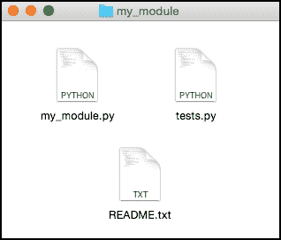
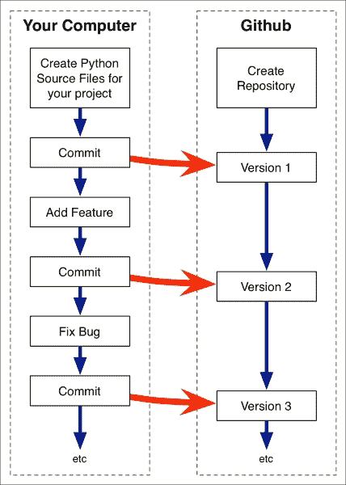
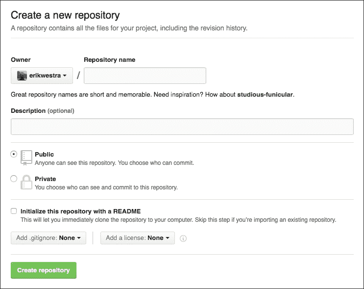
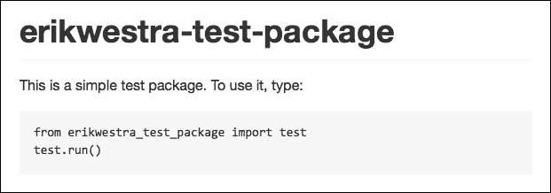
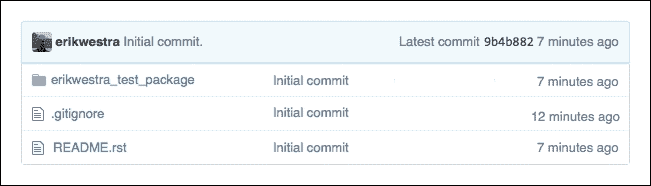
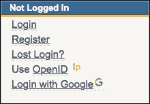
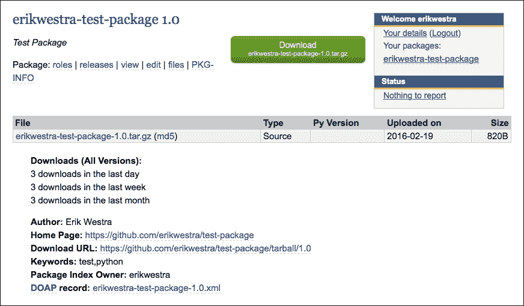

# 八、测试和部署模块

在本章中，我们将深入探讨共享模块的概念。在共享模块或包之前，需要对其进行测试，以确保其正常工作。您还需要准备代码并知道如何部署它。为了了解这些内容，我们将介绍以下主题：

*   了解如何使用单元测试来确保模块或包正常工作
*   了解如何准备要发布的模块或包
*   了解如何使用 GitHub 与他人共享您的代码
*   检查将代码提交到 Python 包索引所涉及的步骤
*   了解如何使用 pip 安装和使用其他人编写的软件包

# 测试模块和包

测试是编程的一个正常部分：你测试你的代码以验证它是否工作，并识别任何 bug 或其他问题，然后你可以修复它们。然后，再进行一些测试，直到您对代码正常工作感到满意为止。

然而，程序员通常只是进行**特别测试**：启动 Python 交互式解释器，导入模块或包，并进行各种调用以查看发生了什么。在上一章中，我们研究了一种使用`importlib.reload()`函数支持代码的 RAD 开发的特殊测试形式。

特别测试很有用，但它不是测试的唯一形式。如果您与其他人共享您的模块和软件包，您将希望您的代码没有 bug，而临时测试不能保证这一点。更好、更系统的方法是为您的模块或包创建一系列**单元测试**。单元测试是 Python 代码的片段，用于测试代码的各个方面。因为测试是由 Python 程序完成的，所以只要在需要测试代码时运行该程序，就可以确保每次运行测试时都在测试所有内容。单元测试是一种很好的方法，可以确保在进行更改时错误不会蔓延到代码中，并且可以在任何时候共享代码，以确保代码按预期工作。

### 注

单元测试并不是你能做的唯一一种编程测试。**集成测试**将各种模块和系统组合在一起，以确保它们正确地协同工作，**GUI 测试**用于确保程序的用户界面正常工作。然而，单元测试对于测试模块和包最有用，这是我们将在本章中重点介绍的测试类型。

下面是一个非常简单的单元测试示例：

```py
import math
assert math.floor(2.6197) == 2
```

`assert`语句检查其后面的表达式。如果此表达式的计算结果不是`True`，则会引发`AssertionError`。这使得您可以轻松地检查给定函数是否返回您期望的结果；在本例中，我们检查`math.floor()`函数是否正确返回小于或等于给定浮点数的最大整数。

因为模块或包最终只是 Python 函数（或方法，它们只是分组到类中的函数）的集合，所以很有可能编写一系列`assert`语句来调用您的函数，并检查返回的值是否符合预期。

当然，这是一种简化：调用一个函数的结果通常会影响另一个函数的输出，并且您的函数有时可以执行相当复杂的操作，例如与远程 API 通信或将数据存储到磁盘上的文件中。但是，在许多情况下，您仍然可以使用一系列的`assert`语句来验证您的模块和包是否按照预期的方式工作。

## 使用 unittest 标准库模块进行测试

虽然可以将`assert`语句放入 Python 脚本并运行它们，但更好的方法是使用 Python 标准库中的`unittest`模块。此模块允许您将单元测试分组到**测试用例**，在测试运行前后运行额外的代码，并访问大量不同类型的`assert`语句，以使您的测试更容易。

让我们看看如何使用`unittest`模块为[第 6 章](6.html "Chapter 6. Creating Reusable Modules")中实现的`quantities`包*创建可重用模块*实现一系列单元测试。将此包的副本放入一个方便的目录中，并在同一目录中创建一个名为`test_quantities.py`的新 Python 源文件。然后，将以下代码添加到此文件：

```py
import unittest
import quantities

class TestQuantities(unittest.TestCase):
    def setUp(self):
        quantities.init("us")

    def test_new(self):
        q = quantities.new(12, "km")
        self.assertEqual(quantities.value(q), 12)
        self.assertEqual(quantities.units(q), "kilometer")

    def test_convert(self):
        q1 = quantities.new(12, "km")
        q2 = quantities.convert(q1, "m")
        self.assertEqual(quantities.value(q2), 12000)
        self.assertEqual(quantities.units(q2), "meter")

if __name__ == "__main__":
    unittest.main()
```

### 提示

请记住，您不需要手动键入此程序。所有这些源文件，包括`quantities`包的完整副本，都可以作为本章可下载的示例代码的一部分。

让我们仔细看看这个代码是怎么做的。首先，`TestQuantities`类用于进行一些相关的单元测试。您通常会为需要执行的每个主要单元测试组定义一个单独的`unittest.TestCase`子类。在我们的`TestQuantities`类中，我们定义了一个`setUp()`方法，其中包含运行测试之前需要执行的代码。如果我们愿意，我们还可以定义一个`tearDown()`方法，该方法将在测试完成后执行。

然后我们定义了两个单元测试，我们称之为`test_new()`和`test_convert()`。它们分别测试`quantities.new()`和`quantities.convert()`功能。对于需要测试的每一项功能，通常都会有一个单独的单元测试。您可以随意调用单元测试，只要方法名称以`test`开头。

在我们的`test_new()`单元测试中，我们创建了一个新的数量，然后调用`self.assertEqual()`方法以确保创建了预期的数量。如您所见，我们不仅限于使用内置的`assert`语句；有几十种不同的`assertXXX()`方法，您可以调用它们以各种方式测试代码。如果断言失败，所有这些都将引发一个`AssertionError`。

测试脚本的最后一部分在脚本执行时调用`unittest.main()`。此函数查找您定义的任何`unittest.TestCase`子类，并依次运行每个测试用例。对于每个测试用例，如果存在，则调用`setUp()`方法，然后是您定义的各种`testXXX()`方法，最后，如果存在，则调用`teardown()`方法。

让我们试着运行单元测试。打开终端或命令行窗口，使用`cd`命令将当前目录设置为保存`test_quantities.py`脚本的目录，然后尝试键入以下内容：

```py
python test_quantities.py

```

一切顺利，您应该看到以下输出：

```py
..
---------------------------------------------------------------
Ran 2 tests in 0.000s

OK

```

默认情况下，`unittest`模块不会向您显示已经运行的测试的更多信息，除了它运行您的单元测试时没有任何问题。如果需要更多细节，可以增加测试的**详细程度**，例如，在测试脚本的`unittest.main()`语句中添加一个参数：

```py
    unittest.main(verbosity=2)
```

或者，您可以使用`-v`命令行选项来实现相同的结果：

```py
python test_quantities.py -v

```

## 设计您的单元测试

单元测试的目的是检查代码是否正常工作。一个好的经验法则是为包中的每个可公开访问的模块提供一个单独的测试用例，并为该模块提供的每个特性提供一个单独的单元测试。单元测试代码的目标应该是至少测试该特性的常规操作，以确保其正常工作。如果愿意，您还可以选择在单元测试中编写额外的测试代码，甚至是额外的单元测试，以检查代码中的特定**边缘情况**。

举一个具体的例子，在上一节中我们编写的`test_convert()`方法中，您可能希望添加代码，以检查如果用户试图将距离转换为权重，是否会引发适当的异常。例如：

```py
q = quantities.new(12, "km")
with self.assertRaises(ValueError):
    quantities.convert(q, "kg")
```

问题是：您应该测试多少边缘情况？可能有数百种不同的方式可以让人错误地使用您的模块。你应该为每一个写单元测试吗？

一般来说，不值得。尝试测试每一个可能的边缘情况是不值得的。当然，您可能希望测试一些主要的可能性，只是为了确保您的模块能够处理最明显的错误，但除此之外，编写额外的测试可能并不值得。

## 代码覆盖率

**覆盖率**是一种度量，用于度量单元测试正在测试多少代码。要理解这是如何工作的，请考虑下面的 Python 函数：

```py
[1] def calc_score(x, y):
[2]     if x == 1:
[3]         score = y * 10
[4]     elif x == 2:
[5]         score = 25 + y
[6]     else:
[7]         score = y
[8]
[9]     return score
```

### 注

我们在每行的开头添加了行号，以帮助我们计算代码覆盖率。

现在，假设我们为`calc_score()`函数创建以下单元测试代码：

```py
assert calc_score(1, 5) == 50
assert calc_score(2, 10) == 35
```

我们的单元测试涵盖了多少功能？我们的第一个`assert`语句是用`x``as``1`和`y``as``5`调用`calc_score()`。如果遵循行号，您将看到使用这组参数调用此函数将导致执行第 1、2、3 和 9 行。类似地，第二条`assert`语句使用`x``as``2`和`y``as``10`调用`calc_score()`，导致执行第 1、4、5 和 9 行。

总之，这两条 assert 语句导致执行第 1、2、3、4、5 和 9 行。忽略空白行，我们的测试不包括第 6 行和第 7 行。因此，我们的单元测试覆盖了函数中八行中的六行，代码覆盖率值为 6/8=75%。

### 注

我们在这里查看**声明报道**。还有其他更复杂的度量代码覆盖率的方法，我们在这里不会讨论。

显然，您不会手工计算代码覆盖率。有一些优秀的工具可以计算 Python 测试代码的代码覆盖率。例如，看看`coverage`包（[https://pypi.python.org/pypi/coverage](https://pypi.python.org/pypi/coverage) ）。

代码覆盖率的基本概念是，您希望您的测试覆盖*所有*代码。无论您是否使用`coverage`之类的工具来衡量代码覆盖率，编写单元测试以尽可能包含 100%的代码都是一个好主意。

## 测试驱动开发

当我们正在考虑测试 Python 代码的想法时，值得一提的是**测试驱动开发**的概念。使用测试驱动开发，您首先选择希望模块或包做什么，然后编写单元测试，以确保模块或包按照您希望的方式工作—*然后再编写*。这样，单元测试就成为模块或包的一种规范；它们告诉您代码应该做什么，然后您的任务是编写代码以使其通过所有测试。

测试驱动开发是实现模块和包的一种有用的方式。当然，您是否使用它取决于您自己，但是如果您有先编写单元测试的原则，那么测试驱动开发可以是一种很好的方法，可以确保您正确地实现了代码，并且随着代码的增长和更改，您的模块会继续执行您期望的操作。

## 嘲弄

如果您的模块或包调用外部 API 或执行其他复杂、昂贵或耗时的操作，您可能需要研究 Python 标准库中的`unittest.mock`包。**模拟**是用虚拟函数替换程序中的某些功能的过程，该虚拟函数立即返回合适的数据进行测试。

模拟是一个复杂的过程，可能需要做一些工作才能使其正确，但是如果您想对代码运行单元测试，那么这种技术绝对值得，否则代码会太慢，每次运行时都会花费金钱，或者依赖外部系统来操作。

## 为模块和包编写单元测试

现在我们已经介绍了单元测试的概念，了解了`unittest`标准库模块的工作原理，并了解了编写单元测试的一些更复杂但重要的方面，现在让我们看看如何使用单元测试来帮助开发和测试模块和包。

首先，您的目标应该是至少为模块或包定义的主要功能编写单元测试。从测试最重要的函数开始，并添加针对更明显错误条件的测试，以确保正确处理错误。您可以在以后为代码中更模糊的部分添加额外的测试。

如果要为单个模块编写单元测试，则应将测试代码放在单独的 Python 脚本中，例如名为`tests.py`，并将其放在与模块相同的目录中。下图显示了编写单个模块时组织代码的好方法：



如果您在同一目录中有多个模块，您可以将所有模块的单元测试合并到`tests.py`脚本中，或者将其重命名为类似`test_my_module.py`的名称，以明确测试的是哪个模块。

对于包，请确保将`tests.py`脚本放在包含包的目录中，而不是放在包本身中：


如果将`test.py`脚本放在包目录中，则在单元测试尝试导入包时可能会遇到问题。

您的`tests.py`脚本应该为包中每个可公开访问的模块定义一个`unittest.TestCase`对象，并且这些对象中的每个对象都应该为模块中定义的每个函数或主要功能块定义一个`testXXX()`方法。

通过执行以下命令，您可以简单地测试模块或包：

```py
python test.py

```

当你想检查你的模块是否正常工作时，你应该运行你的单元测试，尤其是在上传或与他人共享你的模块或包之前。

# 准备模块或包装以供发布

在[第 6 章](6.html "Chapter 6. Creating Reusable Modules")*创建可重用模块*中，我们研究了一些使模块或包适合重用的因素：

*   它必须作为一个独立的单元运行
*   软件包最好使用相对导入
*   必须清楚地注明模块或包中的任何外部依赖项

我们还确定了有助于创建优秀的可重用模块或包的三个因素：

*   它应该解决一个普遍的问题
*   您的代码应该遵循标准的编码约定
*   您的模块或软件包应清楚地记录在案

准备发布模块或软件包的第一步是确保您至少遵循了其中的前三条，最好是所有六条准则。

第二步是确保您至少编写了一些单元测试，并且您的模块或包通过了所有这些测试。最后，您需要决定如何发布代码。

如果您想与朋友或同事共享您的代码，或者写一篇带有代码链接的博客文章，那么最简单的方法就是将其上载到源代码存储库（如 GitHub）。我们将在下一节中了解这是如何实现的。除非将其设置为私有，否则任何具有正确链接的人都可以访问您的代码。人们可以在线查看您的源代码（包括文档），下载您的模块或软件包以便在自己的程序中使用，并“分叉”您的代码，创建自己的私有副本，然后进行修改。

如果您想与更广泛的受众分享您的代码，最好的方法是将其提交到**Python 包索引**（**PyPI**）。这意味着其他人可以通过搜索 PyPI 索引找到您的模块或包，任何人都可以使用 Python 包管理器**pip**安装它。本章后面的章节将描述如何向 PyPI 提交模块或包，以及如何使用 pip 下载和使用模块和包。

# 将您的作品上传至 GitHub

GitHub（[https://github.com/](https://github.com/) 是一个流行的基于网络的系统，用于存储和管理源代码。虽然有几种替代方案，但 GitHub 特别受编写和共享开放源码 Python 代码的人欢迎，这就是我们将在本书中使用的源代码管理系统。

在深入研究 GitHub 的细节之前，让我们先来看看源代码管理系统的总体工作原理，以及您为什么要使用它。

假设您正在编写一个复杂的模块，并在文本编辑器中打开了您的模块以进行一些更改。在进行这些更改时，您意外地选择了 100 行代码并按下了*删除*键。在你意识到你做了什么之前，先保存并关闭文件。太晚了：那 100 行文字都没有了。

当然，您可能（也很有希望）有一个备份系统，它可以定期备份源文件。但是，如果您在过去几分钟内对某些丢失的代码进行了更改，则很可能丢失了这些更改。

现在考虑一个情况，你和一个同事共享一个模块或包，他们决定做一些修改。也许有一个 bug 需要修复，或者他们想添加一个新功能。他们会更改您的代码并将其发送回给您，并附上一张说明他们所做工作的便条。不幸的是，除非您比较源文件的原始版本和修改版本中的每一行，否则您无法确切地确定您的同事对您的文件做了什么。

源代码管理系统解决了这些类型的问题。您可以在源代码管理系统（如 GitHub）中创建一个**存储库**，并**将**源代码提交到此存储库，而不是将模块或包的副本放在硬盘上的目录中。然后，在对文件进行更改、修复 bug 和添加功能时，将所做的每个更改都提交回存储库。源代码存储库跟踪您所做的每一项更改，使您能够准确地看到随着时间的推移所做的更改，并在必要时撤消以前所做的更改。

你不仅仅局限于一个人在一个模块或软件包上工作。人们可以**分叉**您的源代码存储库，创建自己的源代码私有副本，然后使用此私有副本修复 bug 并添加新功能。完成此操作后，他们可以向您发送**拉取请求**，其中包括他们所做的更改。然后，您可以决定是否将这些更改合并到项目中。

尽管源代码管理是一个复杂的主题，并且可以使用 GitHub 等工具执行许多复杂的技巧来管理源代码，但不要过分担心这些细节。需要记住的重要一点是，创建一个存储库来保存模块或包的源代码主副本，将代码提交到此存储库，然后在每次修复错误或添加新功能时继续提交。下图总结了此过程：



源代码管理系统的诀窍是每次添加新功能或修复 bug 时都要定期提交，您应该立即提交更改。这样，存储库中的一个版本和下一个版本之间的区别只是添加了一个特性或修复了一个问题的代码。如果在提交之前对源代码进行了大量更改，那么存储库的用处就会大大降低。

既然我们已经了解了源代码管理系统是如何工作的，那么让我们实现一个真实的示例来了解如何使用 GitHub 来管理源代码。首先，前往 GitHub 主站点（[https://github.com/](https://github.com/) ）。如果您没有 GitHub 帐户，则需要注册，选择唯一的用户名，并提供联系人电子邮件地址和密码。如果您以前使用过 GitHub，则可以使用已设置的用户名和密码登录。

请注意，注册和使用 GitHub 是免费的；唯一的限制是，您创建的每个存储库都是公共的，因此希望查看您的源代码的任何人都可以看到。如果您愿意，您可以设置私人存储库，但这些存储库每月都要收费。但是，由于我们使用 GitHub 与其他人共享代码，因此拥有一个私有存储库没有任何意义。如果你想在阻止其他人访问代码的同时，与特定人群共享代码，你只需要一个私有（付费）存储库。但是，如果您不得不这样做，那么支付私人存储库的费用是您最不关心的问题。

一旦您登录到 GitHub，您的下一个任务就是为**Git**安装命令行工具。Git 是 GitHub 使用的底层源代码管理工具包；您将使用`git`命令从命令行使用 GitHub 存储库。

要安装所需的软件，请转至[https://git-scm.com/downloads](https://git-scm.com/downloads) 下载特定操作系统的安装程序。下载完成后，运行安装程序并按照说明安装`git`命令行工具。完成后，打开终端或命令行窗口，并尝试键入以下命令：

```py
git --version

```

一切顺利，您应该看到您安装的`git`命令行工具的版本号。

有了这些先决条件，让我们使用 GitHub 创建一个示例存储库。回到[上 https://github.com/](https://github.com/) 网页，点击**+新存储库**按钮，以绿色突出显示。系统将要求您输入要创建的存储库的详细信息：



要设置您的存储库，请输入`test-package`作为存储库的名称，然后从**Add.gitignore**下拉菜单中选择**Python**。`.gitignore`文件用于从存储库中排除某些文件；为 Python 使用`.gitignore`文件意味着 Python 创建的临时文件不会包含在存储库中。

最后，点击**创建存储库**按钮创建新的存储库。

### 提示

确保您没有选择**使用自述文件**选项初始化此存储库。您不希望在此阶段创建自述文件；原因很快就会清楚。

现在已经在 GitHub 上创建了存储库，我们的下一个任务是将该存储库的副本**克隆到计算机硬盘上。为此，创建一个名为`test-package`的新目录以保存存储库的本地副本，打开终端或命令行窗口，并使用`cd`命令移动到新的`test-package`目录。然后，键入以下命令：**

```py
git clone https://<username>@github.com/<username>/test-package.git .

```

确保将前面命令中`<username>`的两个实例都替换为 GitHub 用户名。系统将提示您输入 GitHub 密码以进行身份验证，存储库的副本将保存到新目录中。

由于存储库当前为空，因此在目录中看不到任何内容。但是，`git`使用了一些隐藏文件来跟踪存储库的本地副本。要查看这些隐藏文件，可以从终端窗口使用`ls`命令：

```py
$ ls -al
drwxr-xr-x@  7 erik  staff   238 19 Feb 21:28 .
drwxr-xr-x@  7 erik  staff   238 19 Feb 14:35 ..
drwxr-xr-x@ 14 erik  staff   476 19 Feb 21:28 .git
-rw-r--r--@  1 erik  staff   844 19 Feb 15:09 .gitignore

```

`.git`目录保存有关新 GitHub 存储库的信息，`.gitignore`文件包含您要求 GitHub 设置的忽略 Python 临时文件的说明。

现在我们有了一个（最初是空的）存储库，让我们在其中创建一些文件。我们需要做的第一件事是为我们的包选择一个唯一的名称。因为我们的包将被提交到 Python 包索引，所以名称必须是真正唯一的。为了实现这一点，我们将使用您的 GitHub 用户名作为包名的基础，如下所示：

```py
<username>-test-package
```

例如，由于我的 GitHub 用户名是“erikwestra”，因此我将用于此包的名称为`erikwestra-test-package`。确保根据 GitHub 用户名选择名称，以确保包名称真正唯一。

现在我们已经有了包的名称，让我们创建一个自述文件来描述这个包。在您的`test-package`目录中创建一个名为`README.rst`的新文本文件，并将以下内容放入该文件中：

```py
<username>-test-package
-----------------------

This is a simple test package. To use it, type::

    from <username>_test_package import test
    test.run()
```

确保将每次出现的`<username>`替换为您的 GitHub 用户名。此文本文件为**重构文本格式**。StructuredText 是 PyPI 用来显示格式化文本的一种格式化语言。

### 注

虽然 GitHub 可以支持 StructuredText，但默认情况下，它使用一种称为**标记**的不同文本格式。Markdown 和 reStructuredText 是两种相互竞争的格式，不幸的是，PyPI 需要 reStructuredText，而 GitHub 默认使用 Markdown。这就是为什么我们告诉 GitHub 在设置存储库时不要创建自述文件；如果我们这样做的话，它的格式可能是错误的。

当用户在 GitHub 上查看您的存储库时，他们将看到此文件的内容按照 StructuredText 规则整齐地格式化：



如果您想了解更多关于重组文本的信息，您可以在[上阅读所有相关信息 http://docutils.sourceforge.net/rst.html](http://docutils.sourceforge.net/rst.html) 。

现在我们已经为包设置了自述文件，让我们创建包本身。在`test-package`中创建另一个名为`<username>_test_package`的目录，将`<username>`替换为您的 GitHub 用户名，并在该目录中放置一个空包初始化文件（`__init__.py`。然后，在名为`test.py`的`<username>_test_package`目录中创建另一个文件，并在该文件中输入以下内容：

```py
import string
import random

def random_name():
    chars = []
    for i in range(random.randrange(3, 10)):
        chars.append(random.choice(string.ascii_letters))
    return "".join(chars)

def run():
    for i in range(10):
        print(random_name())
```

当然，这只是一个例子。调用`test.run()`函数将显示十个随机名称。更有趣的是，我们现在已经定义了测试包的初始内容。然而，我们所做的只是在本地计算机上创建一些文件；这根本不会影响 GitHub，如果您在 GitHub 中重新加载存储库页面，则不会显示任何新文件。

要使更改生效，我们需要将更改提交到存储库中。首先，我们将了解本地副本与存储库中的副本的区别。要执行此操作，请返回终端窗口，`cd`进入`test-package`目录，并键入以下命令：

```py
git status

```

您应该看到以下输出：

```py
# On branch master
# Untracked files:
#   (use "git add <file>..." to include in what will be committed)
#
#  README.rst
#  <username>_test_package/
nothing added to commit but untracked files present (use "git add" to track)

```

描述可能有点混乱，但也不太复杂。基本上，GitHub 告诉您有一个新文件`README.rst`和一个新目录`<username>_test_package`，它不知道（或者用 GitHub 的说法，是“未跟踪的”）。让我们将这些新条目添加到存储库中：

```py
git add README.rst
git add <username>_test_package

```

确保将`<username>`替换为您的 GitHub 用户名。如果您现在键入`git status`，您将看到我们创建的文件已添加到存储库的本地副本中：

```py
# On branch master
# Changes to be committed:
#   (use "git reset HEAD <file>..." to unstage)
#
#  new file:   README.rst
#  new file:   <username>_test_package/__init__.py
#  new file:   <username>_test_package/test.py

```

无论何时向项目中添加新目录或文件，都需要使用`git add`命令将其添加到存储库中。在任何时候，您都可以通过键入`git status`命令并查找“未跟踪”的文件来查看是否丢失了任何文件。

现在我们已经包含了新文件，让我们将更改提交到存储库。键入以下命令：

```py
git commit -a -m 'Initial commit.'

```

这将向存储库的本地副本提交新更改。`-a`选项告诉 GitHub 自动包含任何更改的文件，`-m`选项让您输入一条简短消息，描述您所做的更改。在这种情况下，我们的提交消息被设置为值“`Initial commit.`”。

现在我们已经提交了更改，我们需要从本地计算机上传到 GitHub 存储库。要执行此操作，请键入以下命令：

```py
git push

```

系统将提示您输入 GitHub 密码以进行身份验证，您所做的更改将存储到 GitHub 上的存储库中。

### 注

GitHub 将`commit`命令与`push`命令分开，因为在对程序进行更改时，您可能需要进行多次提交，而不必当时处于联机状态。例如，如果您正在长途飞机旅行，您可以在本地处理代码，在执行过程中提交每个更改，然后在着陆并再次访问 Internet 时一次推送所有更改。

现在更改已推送到服务器，您可以在 GitHub 上重新加载页面，新创建的包将显示在存储库中：



您还将看到您的`README.rst`文件的内容显示在文件列表下方，描述您的新软件包以及如何使用它。

无论何时对包进行更改，请确保执行以下步骤将更改保存到存储库中：

1.  使用`git status`命令查看发生了什么变化。如果您添加了任何需要包含在存储库中的文件，请使用`git add`添加它们。
2.  使用`git commit -a -m '<commit message>'`命令将更改提交到 GitHub 存储库的本地副本。确保输入适当的提交消息来描述所做的更改。
3.  准备好后，使用`git push`命令将提交的更改发送到 GitHub。

当然，使用 GitHub 还有很多方面，而且有很多命令和选项，在您进入 GitHub 之后，您无疑会想探索这些命令和选项，但这足以让您开始使用 GitHub。

一旦为 Python 模块或包设置了 GitHub 存储库，就可以很容易地与其他人共享代码。您只需共享一个指向 GitHub 存储库的链接，其他人就可以下载他们想要的文件。

为了使这个过程更容易，并且使您的包可搜索，以便它们可以被更广泛的受众发现，您应该考虑将包提交到 Python 包索引。接下来，我们将介绍执行此操作所涉及的步骤。

# 提交 Python 包索引

要将您的 Python 包提交到 Python 包索引，您首先必须在[注册一个免费帐户 https://pypi.python.org/pypi](https://pypi.python.org/pypi) 。点击页面右上角方框中的**注册**链接：



您需要选择用户名和密码，并提供电子邮件地址。记住您输入的用户名和密码，因为您很快就会需要它。当您提交表单时，将向您发送一封电子邮件，其中包含一个链接，您需要单击该链接以完成注册。

在将项目提交给 PyPI 之前，您需要将两个文件添加到项目中，一个是`setup.py`脚本，用于捆绑和上传您的包；另一个是`LICENSE.txt`文件，用于描述可以使用您的包的许可证。现在让我们添加这两个文件。

在您的`test-package`目录中创建一个名为`setup.py`的文件，并在此文件中输入以下内容：

```py
from distutils.core import setup

setup(name="<username>-test-package",
      packages=["<username>_test_package"],
      version="1.0",
      description="Test Package",
      author="<your name>",
      author_email="<your email address>",
      url="https://github.com/<username>/test-package",
      download_url="https://github.com/<username>/test-package/tarball/1.0",
      keywords=["test", "python"],
      classifiers=[])
```

确保将每次出现的`<username>`替换为您的 GitHub 用户名，并将`<your name>`和`<your email address>`替换为相关值。因为这只是一个测试，所以我们使用`<username>-test-package`作为这个包的名称；对于真正的项目，我们会为我们的包使用一个更有意义（但仍然是唯一的）的名称。

### 注

请注意，`setup.py`脚本的这个版本使用的是**Distutils**包。Distutils 是 Python 标准库的一部分，是创建和分发代码的一种简单方法。有一个名为**Setuptools**的替代库，许多人更喜欢它，因为它是一个更现代化的库，具有更多的功能，通常被视为 Distutils 的继承者。但是，Setuptools 目前不是 Python 标准库的一部分。因为它更容易使用，并且具有我们需要的所有特性，所以我们在这里使用 Distutils 来尽可能地简化这个过程。如果您熟悉使用它，请随意使用 Setuptools 而不是 Distutils，因为这两个工具与我们在这里所做的完全相同。

最后，我们需要创建一个名为`LICENSE.txt`的新文本文件。此文件将保存您发布软件包时使用的软件许可证。重要的是要包含一个许可证，这样人们才能确切地知道他们可以和不能对你的代码做什么；未提供许可证，您无法提交程序包。

虽然您可以在`LICENSE.txt`文件中放入任何您喜欢的内容，但通常应使用现有的软件许可证之一。例如，您可能希望使用位于[的麻省理工学院许可证 https://opensource.org/licenses/MIT](https://opensource.org/licenses/MIT) -本许可证使您的代码可供他人用于任何目的，同时确保您不会对其使用过程中可能出现的任何问题负责。

有了这两个文件，您最终可以将新包提交到 Python 包索引。要执行此操作，请在终端或命令行窗口中键入以下命令：

```py
python setup.py register

```

此命令将尝试使用 Python 包索引注册新包。您将被要求输入您的 PyPI 用户名和密码，并有机会存储它们，这样您就不必每次都重新输入它们。成功注册包后，可以通过键入以下命令上载包内容：

```py
python setup.py sdist upload

```

在将包上载到 PyPI 之前，您将看到几个警告，您可以安全地忽略这些警告。如果您随后访问 PyPI 网站，您将看到列出的新软件包：



正如您所看到的，**主页**链接指向 GitHub 上的项目页面，并且有一个针对您的软件包版本 1.0 的直接下载链接。然而，不幸的是，这个下载链接还不能工作，因为您还没有告诉 GitHub 您的包的 1.0 版本是什么样子。要做到这一点，您必须在 GitHub 中创建一个与您的系统版本 1.0 相对应的**标记**；然后，GitHub 将创建与该标记匹配的可下载版本的包。

在创建 1.0 版本之前，应该提交对存储库所做的更改。无论如何，这是一个很好的实践，所以让我们看看是如何做到的：首先键入`git status`查看哪些文件已被添加或更改，然后使用`git add`依次添加每个未跟踪的文件。完成此操作后，键入`git commit -a -m 'Preparing for PyPI submission'`将更改提交到存储库。最后，键入`git push`将您提交的更改发送到 GitHub。

完成所有这些后，您可以通过键入以下命令来创建与软件包版本 1.0 相对应的标记：

```py
git tag 1.0 -m 'Version 1.0 of the <username>_test_package.'

```

确保将`<username>`替换为 GitHub 用户名，以确保包名正确。最后，使用`git push`命令的以下变体将新创建的标记复制到 GitHub 服务器：

```py
git push --tags

```

再次要求您输入 GitHub 密码。此命令完成后，您将有一个 1.0 版的软件包可在`https://github.com/<username>/test-package/tarball/1.0`下载，其中`<username>`是您的 GitHub 用户名。如果您现在转到 PyPI 并查找您的测试包，您将能够单击**下载 URL**链接下载您的 1.0 包的副本。

如果您的新软件包出现在 Python 软件包索引中，并且您可以通过**下载**链接成功下载软件包的 1.0 版本，那么您应该得到表扬。祝贺这是一个复杂的过程，但它将为您的可重用模块和包提供尽可能多的受众。

# 使用 pip 下载并安装模块和软件包

在本书的第 4 章和第 5 章中，我们使用**pip**，即 Python 包管理器来安装我们想要使用的各种库。正如我们在[第 7 章](7.html "Chapter 7. Advanced Module Techniques")*高级模块技术*中了解到的，pip 通常会将一个包安装到 Python 的`site-packages`目录中。由于此目录列在模块搜索路径中，因此可以导入新安装的模块或包并在代码中使用。

现在让我们使用 pip 安装我们在上一节中创建的测试包。由于我们知道我们的软件包被命名为`<username>_test_package`，其中`<username>`是您的 GitHub 用户名，您可以通过在终端或命令行窗口中键入以下命令，将此软件包直接安装到您的`site-packages`目录中：

```py
pip install <username>_test_package

```

确保用您的 GitHub 用户名替换。请注意，如果您没有写入 Python 安装的`site-packages`目录的权限，则可能需要将`sudo`添加到此命令的开头：

```py
sudo pip install <username>_test_package

```

如果执行此操作，在运行`pip`命令之前，系统将提示您输入管理员密码。

一切进展顺利，在下载和安装新创建的软件包时，您应该会看到各种命令正在运行。假设这项工作成功，那么就可以启动 Python 解释器并访问新包，就像它是 Python 标准库的一部分一样。例如：

```py
>>> from <username>_test_package import test
>>> test.run()
IFIbH
AAchwnW
qVtRUuSyb
UPF
zXkY
TMJEAZm
wRJCqgomV
oMzmv
LaDeVg
RDfMqScM

```

当然，不仅仅是你能做到这一点。其他 Python 开发人员也可以以完全相同的方式访问您的新包。这使得开发人员下载和使用您的软件包非常容易。

除了少数例外，您可以使用 pip 从 Python 包索引安装您想要的任何包。默认情况下，pip 将安装软件包的最新可用版本；要指定特定版本，可以在安装软件包时提供版本号，如下所示：

```py
pip install <username>_test_package == 1.0

```

这将安装测试包的 1.0 版。如果您已经安装了软件包，并且有更新版本可用，则可以使用`--upgrade`命令行选项将软件包升级到更新版本：

```py
pip install --upgrade <username>_test_package

```

您还可以使用`list`命令获取已安装软件包的列表：

```py
pip list

```

pip 还有一个特性需要注意。您可以创建一个**需求文件**，其中列出了您需要的所有软件包，而不是单独安装每个软件包，并立即安装所有软件包。典型的需求文件如下所示：

```py
Django==1.8.2
Pillow==3.0.0
reportlab==3.2.0
```

需求文件列出了要安装的各种软件包及其相关版本号。

按照惯例，需求文件名为`requirements.txt`，并放置在项目的顶级目录中。需求文件非常有用，因为它们使得只需一个命令就可以轻松地重新创建 Python 开发环境，包括程序所依赖的所有包。这是通过以下方式完成的：

```py
pip install -r requirements.txt

```

由于需求文件与程序的源代码一起存储，您通常会将`requirements.txt`文件包含在源代码存储库中。这意味着您可以将存储库克隆到一台新计算机上，只需一个命令，即可重新安装程序所依赖的所有模块和软件包。

虽然您可以手动创建需求文件，但通常会使用 pip 为您创建此文件。在安装了所需的模块和包之后，您可以使用以下命令创建`requirements.txt`文件：

```py
pip freeze > requirements.txt

```

这个命令的奇妙之处在于，您可以在需求发生变化时重新运行它。如果您发现您的程序需要使用新的模块或包，您可以使用`pip install`安装新的模块或包，然后立即调用`pip freeze`创建包含新依赖项的更新需求文件。

在安装和使用模块和软件包时，还有一件需要注意：有时，您需要安装模块或软件包的*不同*版本。例如，您可能希望运行一个特定的程序，该程序需要 Django 软件包的 1.6 版，但您只安装了 1.4 版。如果将 Django 的副本更新为 1.6 版，则可能会中断依赖它的其他程序。

为了避免这种情况，您可能会发现在计算机上设置**虚拟环境**非常有用。虚拟环境就像一个单独的 Python 安装，它有自己的一组已安装模块和包。您可以为所处理的每个项目创建一个单独的虚拟环境，以便每个项目都有自己的依赖项集，而不会干扰您可能在计算机上安装的其他项目的要求。

当您想要使用特定的虚拟环境时，您必须**激活**它。然后，您可以使用`pip install`将所需的各种软件包安装到该环境中，并使用已安装的软件包运行程序。当您想要完成与该环境的工作时，您可以**停用**它。这使您可以根据需要在虚拟环境之间进行交换，以处理不同的项目。

虚拟环境是一个非常强大的工具，用于处理具有不同（可能是不兼容）包需求的项目。有关虚拟环境的更多信息，请访问[http://docs.python-guide.org/en/latest/dev/virtualenvs/](http://docs.python-guide.org/en/latest/dev/virtualenvs/) 。

# 总结

在本章中，我们了解了测试 Python 模块和包的各种方法。我们学习了单元测试，以及 Python 标准库中的`unittest`包如何使您开发的模块和包编写和使用单元测试变得更加容易。我们看到了单元测试如何使用`assert`语句（如果使用`unittest.TestCase`类，则使用各种`assertXXX()`方法）在未满足特定条件的情况下提出`AssertionError`。通过编写各种单元测试，您可以确保您的模块和包按照您期望的方式工作。

然后，我们研究了准备发布模块或包的过程，并了解了 GitHub 如何为存储和管理模块和包的源代码提供一个优秀的存储库。

在创建了我们自己的测试包之后，我们完成了将该包提交到 Python 包索引的过程。最后，我们学习了如何使用 Python 包管理器 pip 将 PyPI 中的包安装到系统的`site-packages`目录中，然后再研究如何使用需求文件或虚拟环境来帮助管理程序的依赖关系。

在本书的最后一章中，我们将看到模块化编程如何更好地作为良好编程技术的基础。