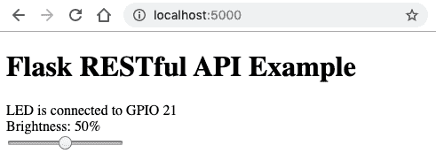

# 四、将 Flask 用于 RESTful API 和 WebSocket 网络

在[第 2 章](03.html)*开始学习 Python 和物联网*中，我们基于`dweet.io`创建了一个联网物联网应用程序，您可以通过互联网控制一个连接到树莓 Pi 的 LED。我们的第一个物联网应用程序纯粹是通过发出 API 请求来驱动的。

在本章中，我们将关注用 Python 创建网络服务的替代方法，Python 和非 Python 客户端都可以访问这些服务。我们将研究如何用 Python 构建 RESTful API 服务器和 Web 套接字服务器，并应用我们在上一章中学习的电子接口技术，使它们与我们的 LED 交互。

完成本章后，您将了解使用 Python 构建服务器的两种不同方法，以及与服务器交互的附带网页。这两台服务器将为您提供端到端的参考实施，您可以将其用作自己网络连接物联网项目的起点。

由于本章是关于网络技术的，我们将继续使用上一章中的基于 GPIOZero 的示例，这仅仅是为了简单和抽象，以便我们的示例能够切中要害，以网络为中心，而不会被 GPIO 相关的代码弄得乱七八糟。

在本章中，我们将介绍以下主题：

*   介绍 Flask 微服务框架
*   使用 Flask 创建 RESTful API 服务
*   添加 RESTful API 客户端网页
*   使用 Flask SocketIO 创建 Web 套接字服务
*   添加 Web 套接字客户端网页
*   比较 RESTful API 和 Web 套接字服务器

# 技术要求

要执行本章中的练习，您需要以下内容：

*   树莓皮 4 B 型
*   Raspbian OS Buster（带桌面和推荐软件）
*   Python 3.5 版的最低版本

这些需求是本书中代码示例的基础。只要您的 Python 版本是 3.5 或更高版本，就可以合理地期望代码示例在 Raspberry Pi 3 Model B 或不同版本的 Raspbian OS 上无需修改即可工作。

您可以在 GitHub 存储库中的`chapter03`文件夹中找到本章的源代码：[https://github.com/PacktPublishing/Practical-Python-Programming-for-IoT](https://github.com/PacktPublishing/Practical-Python-Programming-for-IoT) 。

您需要在终端中执行以下命令，以设置虚拟环境并安装本章代码所需的 Python 库：

```py
$ cd chapter03              # Change into this chapter's folder
$ python3 -m venv venv      # Create Python Virtual Environment
$ source venv/bin/activate  # Activate Python Virtual Environment
(venv) $ pip install pip --upgrade        # Upgrade pip
(venv) $ pip install -r requirements.txt  # Install dependent packages
```

以下依赖项是从`requirements.txt`安装的：

*   **GPIOZero**：GPIOZero GPIO 库（[https://pypi.org/project/gpiozero](https://pypi.org/project/gpiozero)
*   **PiGPIO**：PiGPIO GPIO 库（[https://pypi.org/project/pigpio](https://pypi.org/project/pigpio)
*   **烧瓶**：核心烧瓶微服务框架（[https://pypi.org/project/Flask](https://pypi.org/project/Flask)
*   **Flask RESTful**：用于创建 RESTful API 服务的 Flask 扩展（[https://pypi.org/project/Flask-RESTful](https://pypi.org/project/Flask-RESTful)
*   **Flask SocketIO**：用于创建 Web 套接字服务的 Flask 扩展（[https://pypi.org/project/Flask-SocketIO](https://pypi.org/project/Flask-SocketIO)

我们将使用在[第 2 章](03.html)、*Python 和 IoT 入门*、*图 2.7*中创建的实验板电路。

# 介绍 Flask 微服务框架

Flask 是一个流行且成熟的 Python 微服务框架，您可以使用它创建 API、网站，以及您可以想象的任何其他网络服务。Flask 当然不是 Python 的唯一可用选项，尽管它的成熟度、附加组件和扩展的范围以及高质量文档和教程的可用性使它成为一个很好的选择。

我们可以想象，在本章中，仅使用核心框架就可以完成以下所有编码练习；然而，有一些质量扩展将使我们的生活更加轻松。这些扩展是用于创建 RESTful API 服务的**Flask RESTful**和用于构建 Web 套接字服务的**Flask SocketIO**。

The official API documentation for Flask-RESTful and Flask-SocketIO (or any Flask extension for that matter) generally assume existing knowledge of the core Flask framework, classes, and terminology. If you can't seem to find answers to your questions in an extension's documentation, remember to check the core Flask API documentation also. You'll find a link to this documentation in the *Further reading* section.

让我们开始使用 flaskrestful 在 Python 中创建一个 restfulapi 服务。

# 使用 Flask RESTful 创建 RESTful API 服务

在本节中，我们将探讨第一个基于 Python 的服务器，它将是一个使用 Flask RESTful Python 框架实现的 RESTful API 服务器。

RESTfulAPI（REST 代表代表状态转移）是一种用于构建 web 服务 API 的软件设计模式。它是一种灵活的模式，既独立于技术，也独立于协议。它的技术独立性有助于促进不同技术和系统之间的互操作性，包括不同的编程语言。尽管它确实促进了协议的独立性，但它通常而且几乎总是默认（或者至少假定是）建立在 web 服务器和 web 浏览器使用的 HTTP 协议之上。

RESTful API 是当今构建 web 服务和 API 最常用的技术。事实上，这是如此普遍，以至于许多人了解它们并使用设计模式，却从未了解它们是什么！如果您是 RESTful API 的新手，您将在*进一步阅读*一节中看到一个链接，我鼓励您在继续之前将其作为初级读物进行复习。

本节的重点是使用 RESTful API 控制 LED，并了解如何使用 Python 和 Flask RESTful 框架实现 LED。完成本节后，您将能够利用此 RESTful API 服务器作为自己物联网项目的起点，并将其与其他电子设备集成，特别是在本书第 3 部分*物联网游乐场*中了解有关电子执行器和传感器的更多信息。

For the examples in this chapter, we will assume you are working and accessing the Flask-based servers locally on your Raspberry Pi. These servers will also be accessible from another device on your local network if you use the IP address or hostname of your Raspberry Pi. To make the servers directly accessible over the internet would require configuration of your specific firewall and/or router, which we cannot practically cover in this book. For prototyping ideas and creating demos, a simple alternative to configuring firewalls and routers is to use a service such as Local Tunnels ([https://localtunnel.github.io/www](https://localtunnel.github.io/www)) or Ngrok ([https://ngrok.com](https://ngrok.com)), which will help you to make the Flask servers on your Raspberry Pi accessible over the internet.

我们将首先运行并使用 RESTful API 与 LED 交互，然后再继续查看服务器的源代码。

## 运行和测试 Python 服务器

您将在`chapter03/flask_api_server.py`文件中找到代码。请在继续之前查看此文件，以便在继续之前全面了解其中包含的内容。

We are running our Flask examples using Flask's built-in HTTP server. This is more than adequate for development purposes; however, it's not recommended for production usage. Consult the Flask documentation section titled *Deployment Options* for information on how to deploy a Flask application with production-quality web servers. You'll find a link in the *Further reading* section to the official Flask website and documentation.

要测试 Python 服务器，请执行以下步骤：

1.  使用以下命令运行 RESTful API 服务器：

```py
(venv) $ python flask_api_server.py
... truncated ...
NFO:werkzeug: * Running on http://0.0.0.0:5000/ (Press CTRL+C to quit)
... truncated ...
```

前面代码块中倒数第二行表示服务器已成功启动。我们的服务器默认在调试模式下运行，因此其日志输出将是详细的，如果您对`flask_api_server.py`或其他资源文件进行任何更改，服务器将自动重新启动。

If `flask_api_server.py` raises an error when started in debug mode, clear the file's execute bit. This issue occurs on Unix-based systems and has to do with the development web server shipped with Flask. Here is the command to clear the execute bit:
`$ chmod -x flask_api_server.py`

2.  我们将创建一个没有 API 的网页进行交互；但是，现在，请在 web 浏览器中浏览到`http://localhost:5000`，并验证您是否可以使用网页上的滑块来更改 LED 的亮度。

Our example URL is `http://localhost:5000`, however, if you use your Raspberry Pi's IP address instead of `localhost`, you will be able to access the web page from another device on your local network.

以下屏幕截图是您将看到的网页示例：



Figure 3.1 – RESTful API client web page

3.  我们还可以使用`curl`命令行工具与 API 交互。我们现在将这样做，以观察 API 服务器请求的输入和输出 JSON。

下面的第一个`curl`命令发出 HTTP GET 请求，我们看到终端上以 JSON（第 1 行）打印的 LED 亮度级别（0 到 100 之间的数字）。服务器启动时，默认 LED 亮度为 50（即 50%亮度）：

```py
$ curl -X GET http://localhost:5000/led
{
 "level": 50          # (1)
}  
```

`curl`的选项如下：

4.  下一个命令执行 HTTP POST 请求，我们将亮度级别设置为最大值 100（第 2 行），该值作为 JSON 返回并打印回终端（第 3 行）：

```py
$ curl -X POST -d '{"level": 100}' \    # (2) 
 -H "Content-Type: application/json" \
 http://localhost:5000/led
{
 "level": 100                            # (3)
}
```

`curl`的选项如下：

An alternative to `curl` on the command line is Postman ([getpostman.com](http://getpostman.com)). If you are not familiar with Postman, it's a free API development, querying, and testing tool that is invaluable when you are developing and testing RESTful API services.

尝试将前面`curl POST`示例中的级别值更改为 0-100 范围之外的数字，并观察您收到的错误消息。我们将很快看到这个验证逻辑是如何用 Flask RESTful 实现的。

现在让我们继续看一下服务器源代码。

## 理解服务器代码

在本节中，我们将浏览 RESTfulAPI 服务器的源代码，并讨论核心部分，以帮助您了解服务器是如何编码和操作的。请记住，我们将介绍许多特定于 Flask 和 Flask RESTful 框架的代码级构件，因此，如果一开始有些概念没有立即意义，请不要担心。

一旦您了解了基础知识和服务器的总体工作原理，您就可以通过访问 Flask 和 Flask RESTful 各自的网站（您将在*进一步阅读*部分找到链接）来加深对 Flask 和 Flask RESTful 的理解。此外，您将拥有一个可靠的参考 RESTful API 服务器，您可以对其进行修改，并将其用作您自己未来项目的起点。

请注意，在我们讨论代码时，我们将跳过前面章节中介绍的任何代码和概念，例如**GPIOZero**。

我们将从进口开始。

### **进口**

在源代码文件的顶部，我们可以看到以下导入：

```py
import logging
from flask import Flask, request, render_template           # (1)
from flask_restful import Resource, Api, reqparse, inputs   # (2)
from gpiozero import PWMLED, Device                         # (3)
from gpiozero.pins.pigpio import PiGPIOFactory
```

我们在第（1）行和第（2）行看到的与 Flask 相关的导入都是我们在服务器中需要的 Flask 和 Flask RESTful 的类和函数。你会注意到在第（3）行中，我们导入的是`PWMLED`而不是`LED`，正如我们在前几章中所做的那样。在本例中，我们将改变 LED 的亮度，而不仅仅是打开和关闭它。随着本章的继续，我们将介绍更多关于 PWM 和`PWMLED`的内容。

接下来，在源代码中，我们开始使用 Flask 和 Flask RESTful 扩展。

### **Flask 和 Flask RESTful API 实例变量**

在下面的第（4）行中，我们创建了 core Flask 应用程序的一个实例，并将其分配给`app`变量。该参数是我们的 Flask 应用程序的名称，对于*根*Flask 应用程序使用`__name__`是一种常见的约定（在我们的示例中，我们只有一个根 Flask 应用程序）。任何时候我们需要使用 core Flask 框架，我们都会使用`app`变量：

```py
app = Flask(__name__) # Core Flask app.            # (4)
api = Api(app) # Flask-RESTful extension wrapper   # (5)
```

在第（5）行，我们用 Flask RESTful 扩展包装核心 Flask 应用程序，并将其分配给`api`变量，我们将很快看到，我们在处理 Flask RESTful 扩展时随时使用该变量。在`app`和`api`变量之后，我们定义了额外的全局变量。

### **全局变量**

以下全局变量在整个服务器中使用。首先，我们有 GPIO 引脚和一个`led`变量，稍后将为其分配一个 GPIOZero`PWMLED`实例，用于控制我们的 LED：

```py
# Global variables
LED_GPIO_PIN = 21
led = None # PWMLED Instance. See init_led()
state = {                                     # (6)
    'level': 50 # % brightness of LED.
}
```

在第（6）行，我们有一个`state`字典结构，我们将使用它来跟踪 LED 的亮度水平。我们本可以使用一个简单的变量，但选择了字典结构，因为它是一个更通用的选项，因为它将被封送到 JSON 中发送回客户端，我们将在后面看到。

接下来，我们创建并初始化`led`实例。

### **初始化发光二极管（）方法**

`init_led()`方法只是创建一个 GPIOZero`PWMLED`实例，并将其分配给我们之前看到的全局`led`变量：

```py
def init_led():
    """Create and initialize an PWMLED Object"""
 global led
 led = PWMLED(LED_GPIO_PIN)
 led.value = state['level'] / 100        # (7)
```

我们在第（7）行显式设置 LED 亮度以匹配服务器亮度状态的值，以确保服务器启动时服务器的受管状态和 LED 同步。我们除以 100 是因为`led.value`期望浮点值在 0-1 范围内，而我们的 API 将使用 0-100 范围内的整数。

接下来，我们开始查看定义服务器及其服务端点的代码，首先是为我们之前访问过的网页提供服务的代码。

### **服务网页**

从第（8）行开始，我们使用 Flask`@app.route()`decorator 定义一个回调方法，当服务器接收到来自客户端对根 URL`/`的 HTTP GET 请求时调用该方法，即对`http://localhost:5000`的请求：

```py
# @app.route applies to the core Flask instance (app).
# Here we are serving a simple web page.
@app.route('/', methods=['GET'])                           # (8)
def index():
 """Make sure index_api_client.html is in the templates folder
 relative to this Python file."""
 return render_template('index_api_client.html',
                          pin=LED_GPIO_PIN)                # (9)
```

在第（9）行，`render_template('index_api_client.html', pin=LED_GPIO_PIN)`是一种烧瓶方法，用于将模板页面返回给请求客户端。`pin=LED_GPIO_PIN`参数是如何将变量从 Python 传递到 HTML 页面模板进行呈现的示例。我们将在本章后面介绍这个 HTML 文件的内容。

Notice, in the preceding code block on line (8), we have `@app.route(...)`. The presence of the `app` variable means we are using and configuring the *core* Flask framework here.

将 HTML 页面返回给客户机是本书中我们将介绍的唯一核心 Flask 功能，但是，在*进一步阅读*部分中会列出额外的资源，供您进一步探索 Flask 的核心概念。

我们在代码中的下一站是`LEDController`类。在这里，我们正在与 LED 和 GPIOZero 交互。

### **LED 控制类**

在 Flask RESTful 中，API 资源被建模为扩展了`Resource`类的 Python 类，在下面代码段的第（10）行中，我们看到了定义的`LEDControl(Resource)`类，该类将包含用于控制 LED 的逻辑。稍后，我们将看到如何使用 Flask RESTful 注册此类，以便它响应客户端请求：

```py
class LEDControl(Resource):                                    # (10)
 def __init__(self):
 self.args_parser = reqparse.RequestParser()            # (11)
 self.args_parser.add_argument(
 name='level',                  # Name of arguement
 required=True,                 # Mandatory arguement
 type=inputs.int_range(0, 100), # Allowed 0..100    # (12) 
 help='Set LED brightness level {error_msg}',
 default=None)
```

在第（11）行，我们创建了一个`RequestParser()`实例，并将其分配给`args_parser`变量，然后用`add_argument()`配置解析器。我们在 Flask RESTful 中使用一个`RequestParser()`实例来定义我们期望`LEDControl`资源处理的参数的验证规则。

这里，我们定义了一个名为`level`的强制参数，该参数必须是 0 到 100 范围内的整数，如第（12）行所示。我们还提供了一条自定义帮助消息，用于说明`level`参数丢失或超出范围的情况。

我们将在稍后介绍`post()`方法时看到`args_parser`的用法，但首先，让我们讨论`get()`方法。

### **get（）类方法**

`get()`类方法处理`LEDControl`资源的 HTTP GET 请求。这就是我们在前面使用以下命令测试 API 时处理 URL 请求的原因：

```py
$ curl -X GET http://localhost:5000/led
```

`get()`在第（13）行简单返回全局`state`变量：

```py
 def get(self):
 """ Handles HTTP GET requests to return current LED state."""
 return state         # (13)
```

Flask RESTful 将 JSON 响应返回给客户机，这就是我们返回`state`变量的原因。在 Python 中，`state`是一个字典结构，可以直接映射为 JSON 格式。我们在前面使用`curl`发出 GET 请求时看到了以下 JSON 示例：

```py
{ "level": 50 }
```

这个 class-as-a-resource（例如，`LEDControl`）和方法到 HTTP 方法的映射（例如，`LEDControl.get()`）是 Flask RESTful 扩展如何简化 RESTful API 开发的一个示例。

还有为其他 HTTP 请求方法保留的方法名，包括 POST，我们将在下面介绍。

### **post（）类方法**

`post()`类方法处理向`LEDControl`资源发出的 HTTP POST 请求。在我们测试服务器时，当我们之前发出以下请求时，正是这种`post()`方法接收并处理了我们的`curl POST`请求：

```py
curl -X POST -d '{"level": 100}' \
 -H "Content-Type: application/json" \
 http://localhost:5000/led
```

`post()`比我们的`get()`方法更复杂。在这里，我们根据请求客户的输入更改 LED 的亮度：

```py
 def post(self):
 """Handles HTTP POST requests to set LED brightness level."""
 global state                                            # (14)

 args = self.args_parser.parse_args()                    # (15)

 # Set PWM duty cycle to adjust brightness level.
 state['level'] = args.level                             # (16)
 led.value = state['level'] / 100                        # (17)
 logger.info("LED brightness level is " + str(state['level']))

 return state                                            # (18)
```

在第（14）行中，我们使用 Python`global`关键字表示我们将修改`state`全局变量。

在第（15）行中，我们看到了前面讨论过的`args_parser`的用法。对`args_parser.parse_args()`的调用将解析和验证调用方的输入（记住`level`是必需的参数，必须在 0-100 范围内）。如果我们预定义的验证规则失败，将向用户发出错误消息，`post()`将在此终止。

如果参数有效，它们的值将存储在`args`变量中，代码继续到第（16）行，在该行中，我们使用新请求的亮度级别更新全局`state`变量。在第（17）行中，我们使用 GPIOZero PWMLED 实例`led`改变物理 LED 的亮度，该实例期望值介于 0.0（关闭）和 1.0（全亮度）之间，因此我们将`level`输入范围 0-100 映射回 0-1。第（18）行将`state`的值返回给客户机。

我们的最终任务是使用 Flask RESTful 注册`LEDController`并启动服务器。

### **LED 控制器注册并启动服务器**

调用`init_led()`方法初始化并默认出 GPIOZero`led`实例后，我们将看到如何在第（19）行向`api.add_resource()`注册我们的`LEDControl`资源。这里，我们将 URL 端点`/led`映射到控制器。

Notice, in the code block on line (19), we have `api.add_resource(...)` . The presence of the `api` variable means we are using and configuring the *Flask-RESTful extension* here.

最后，在第 20 行，我们的服务器启动（在调试模式下），并准备好接收客户机请求。请注意，我们在`app`变量中使用*核心*Flask 实例来启动服务器：

```py
# Initialize Module.
init_led()
api.add_resource(LEDControl, '/led')          # (19)

if __name__ == '__main__':
 app.run(host="0.0.0.0", debug=True)       # (20)
```

做得好！我们刚刚介绍了用 Python 构建一个简单但功能强大的 RESTful API 服务器。您可以在*进一步阅读*部分找到官方 Flask RESTful 文档的链接，以便进一步了解您的知识。

如前所述，我们在服务器中使用了`PWMLED`。在我们继续阅读 RESTful API 服务器附带的网页之前，让我们先简要介绍一下术语*PWM*。

## **PWM 简介**

在前面的示例中，我们使用了来自 GPIOZero 的`PWMLED`，而不是`LED`。`PWMLED`允许我们使用称为**脉宽调制**的技术控制 LED 的亮度，通常缩写为**PWM***。*

PWM 是一种用于从源信号（可以是 3.3 伏 GPIO 引脚）产生较低平均电压的技术。我们将在[第 6 章](08.html)、*电子 101 中为软件工程师*详细介绍 PWM 和 GPIO 引脚电压。

对于我们当前的例子，简单地说（有些过于简化），PWM 脉冲使 LED 非常非常快地打开和关闭，我们的眼睛观察到不同的脉冲持续时间（产生不同的电压），表现为 LED 的不同亮度水平。我们使用`PWMLED`实例的`value`属性，即`LEDControl.post()`中的`led.value = state["level"]`，更改了该脉冲持续时间（称为*占空比*。在[第 5 章](07.html)*将树莓 Pi 连接到物理世界*中，我们将更详细地探讨 PWM。

现在，我们已经介绍了基于 Python 的 Flask RESTful API 服务器，并学习了如何实现一个简单且功能强大的 RESTful API 服务器，该服务器能够处理 GET 和 POST 请求，这是与 RESTful API 服务器交互的两种最流行的方式。另外，我们还了解了如何使用 Flask RESTful 实现数据验证，这是一种简单有效的方法，可以保护服务器不受无效输入数据的影响。

我们还学会了使用`curl`命令行工具与我们的服务器进行交互和测试。当您构建、测试和调试 RESTful API 服务器时，您会发现`curl`是对您的开发工具包的一个有用的补充。

接下来，我们将查看与 API 交互的网页背后的代码。

# 添加 RESTful API 客户端网页

我们将要讨论的网页是您之前在 web 浏览器中访问`http://localhost:5000`时与之交互以更改 LED 亮度的网页。网页截图如*图 3.1*所示。

在本节中，我们将学习如何使用 HTML 和 JavaScript 构建这个基本网页。我们将了解如何使 HTML 范围组件与我们在上一节中创建的 Flask RESTful API 服务器交互，以便在更改范围控件（即滑动滑块）时，LED 的亮度也会发生变化。

您将在`chapter03/templates/index_api_client.html`文件中找到页面的代码。请在继续之前查看此文件，以全面了解其中包含的内容。

`templates`文件夹是一个特殊的烧瓶文件夹，用于保存模板文件。HTML 页面被视为 Flask 生态系统中的模板。您还会找到一个名为 `static` 的文件夹。此文件夹是存储静态文件的地方。在我们的示例中，这里可以找到 jQuery JavaScript 库文件的副本。

All files and resources referenced in a web page served from Flask are relative to the server's root folder. For us, this is the `chapter03` folder.

让我们浏览一下网页代码。

## 理解客户端代码

本节的代码是 JavaScript，我们将使用 jQuery JavaScript 库。理解基本 JavaScript 和 jQuery 对于理解下面的代码示例至关重要。如果您不熟悉 jQuery，可以在 jQuery.com 上找到学习资源。

### **JavaScript 导入**

我们在以下第（1）行中看到，我们导入了包含在`static`文件夹中的 jQuery 库：

```py
<!-- chapter03/templates/index_api_client.html -->
<!DOCTYPE html>
<html>
<head>
 <title>Flask Restful API Example</title>
 <script src="/static/jquery.min.js"></script>    <!--(1)-->
 <script type="text/javascript">
```

接下来，我们将开始介绍文件中的 JavaScript 函数。

### **getState（）函数**

`getState()`的主要目的是从服务器检索 LED 的当前状态。它使用 JQuery`get()`方法向 API 服务器的`/led`资源发出 HTTP GET 请求。在上一节中，我们看到 URL 路径`/led`被映射到`LEDControl`Python 类，因为我们正在发出 GET 请求，所以`LEDControl.get()`将接收并处理我们的请求：

```py
// GET request to server to retrieve LED state.
function getState() { 
 $.get("/led", function(serverResponse, status) { // (2)
 console.log(serverResponse) 
 updateControls(serverResponse)                // (3)
 }); }
```

服务器的响应包含在第（2）行的`serverResponse`参数中，该参数被传递到第（3）行的`updateControls()`函数以更新网页控件。我们将很快介绍这种方法。

当`getState()`从 Python 服务器获取数据时，我们的下一个方法`postUpdate()`将数据发送（即*POST）到服务器。*

### **postUpdate（）函数**

`postUpdate()`通过向服务器执行 HTTP POST 来改变 LED 的亮度。这一次，是 API 服务器中的`LEDControl.post()`方法处理了请求：

```py
// POST Request to server to set LED state.
function postUpdate(payload) {                          // (4)
 $.post("/led", payload, function(serverResponse, status) {
 console.log(serverResponse)
 updateControls(serverResponse);                 // (5)
 });
}
```

在第（4）行，它接收并解析`payload`参数中的数据（记住`LEDControl`中的`arg_parser`。`payload`是具有`state`子属性的 JavaScript 对象。稍后我们将在网页滑块的更改事件处理程序中看到此对象的构造。

为了一致性，我们还更新了第（5）行的控件，即使在我们的例子中，`serverResponse`变量将包含与`payload`参数相同的级别值。

接下来，我们将看到第（5）行中对`updateControls()`的调用的作用。

### **updateControl（）函数**

`updateControls()`更改网页控件的视觉外观。此函数接收 JSON 输入作为`data`参数，格式为：`{"level":50}`。从第（6）行开始，使用 jQuery 选择器更新网页上的滑块控件和文本，以反映新的级别值：

```py
function updateControls(data) {
 $("input[type=range].brightnessLevel").val(data.level);  // (6)
 $("#brightnessLevel").html(data.level);
}
```

接下来，我们将看到如何使用 JQuery 创建一个事件处理程序，当我们或其他用户更改网页的滑块组件时，该事件处理程序将作出响应。

### **向 jQuery**注册事件处理程序

我们遵循 jQuery 最佳实践，使用 jQuery*文档准备功能*（即`$(document).ready(...)`）为我们的网页滑块控件注册事件处理程序，并初始化我们的网页元素：

```py
 $(document).ready(function() {
 // Event listener for Slider value changes.
 $("input[type=range].brightnessLevel")
 .on('input', function() {                    // (7)
 brightness_level = $(this).val();         // (8)
 payload = { "level": brightness_level }   // (9)
 postUpdate(payload);
 });

        // Initialize slider value form state on server.
 getState()                                       // (10)
 });
 </script>
</head>
```

在第（7）行，我们为滑块控件*输入*事件注册了一个事件处理程序。当用户与网页上的滑块交互时，将调用此处理程序函数。

从第（8）行开始，在用户移动滑块后，我们使用`val()`提取滑块的新值（该值将介于 0 和 100 之间，我们将在查看页面的 HTML 时了解原因）。

在第（9）行中，我们创建了一个包含新亮度级别的 JSON 对象，然后将其传递给`postUpdate()`，它调用 RESTful API 来更改物理 LED 的亮度。

最后，在第（10）行中，我们调用`getState()`函数，该函数向服务器发出 HTTP 请求，以获取 LED 的当前亮度水平。正如我们前面看到的，`getState()`然后委托给`updateControls()`，然后更新滑块和页面文本以反映 LED 的亮度值。

我们将通过查看构成网页的 HTML 来结束本节。

### **网页 HTML**

之前在我们的 Python 服务器中，我们有一行代码`render_template('index_rest_api.html', pin=LED_GPIO_PIN)`。这个方法调用中的`pin`参数在我们的网页第（11）行呈现，由模板变量`{{pin}}`表示：

```py
<body>
 <h1>Flask RESTful API Example</h1>
 LED is connected to GPIO {{pin}}<br>               <!--(11)-->
 Brightness: <span id="brightnessLevel"></span>%<br>
 <input type="range" min="0" max="100"              <!--(12)-->
 value="0" class="brightnessLevel">
</body>
</html>
```

最后，我们在第（12）行看到，我们的 HTML 滑块组件被限制在 0-100 的范围内。正如我们前面看到的，在文档就绪处理程序中调用`getState()`，更新滑块的 value 属性，以匹配网页加载完成后存储在服务器上的亮度级别。

祝贺我们现在已经达到了一个里程碑，完成了基于 RESTfulAPI 的完整端到端服务器和客户端示例。我们对 Flask 和 Flask RESTful 的了解意味着我们已经学会了使用最流行、功能最丰富的 Python 库之一来构建 web 服务。另外，学习构建 RESTful API 服务器和匹配客户机意味着我们实际上已经实现了目前用于客户机-服务器通信的最常用方法。

一般来说，我们几乎没有触及使用 Flask、Flask RESTful 和 RESTful API 可以实现什么的表面，还有更多的东西可以探索。如果您想进一步了解这些主题，可以在*进一步阅读*部分找到链接。

接下来，我们将创建与本节中构建的相同的客户机和服务器场景，只是这次使用 Web 套接字作为传输层。

# 使用 Flask SocketIO 创建 Web 套接字服务

现在我们将实现第二个基于 Python 的服务器。我们在本节中的总体结果将类似于我们在上一节中创建的 RESTful API 服务器和客户机，也就是说，我们将能够通过 web 浏览器控制我们的 LED。然而，这次我们的目标是使用不同的技术方法创建程序，使用 Web 套接字作为传输层。

Web 套接字是一种全双工通信协议，是需要实时客户端/服务器交互的常见技术选择。在我看来，Web 套接字是一种技术，根据我的经验，最好通过实践而不是阅读来学习，特别是如果您是服务器开发新手的话。对 Web 套接字的深入讨论超出了本章的范围；但是，您可以在*进一步阅读*一节中找到两个包含基础知识的链接。

如果您是 Web 套接字新手，我强烈建议您在继续之前阅读这两个参考资料作为入门。如果内容一开始没有被理解，请不要担心，因为我相信，一旦您使用并理解了我们的 Python Web 套接字服务器和附带的支持 Web 套接字的 Web 页面是如何实现的，那么更大的 Web 套接字难题的各个部分将开始结合在一起。

对于我们的 Web Socket 服务器构建，我们将使用 Flask SocketIO 库，该库模仿流行的 JavaScript Socket.IO 库（[并与之兼容 https://socket.io](https://socket.io) ）。

我们将首先运行并使用 Web 套接字服务器与 LED 交互，然后再继续查看服务器的源代码。

## 运行和测试 Python 服务器

让我们首先快速查看一下 pythonwebsocket 服务器代码，并运行服务器以查看其运行情况。在我们详细讨论之前，这将使我们对代码有一个大致的了解，并对代码的工作原理有一个第一手的演示。

您将在`chapter03/ flask_ws_server.py` 文件中找到 Web 套接字服务器的代码。请在继续之前查看此文件。

当您看完代码后，我们将运行服务器。以下是要遵循的步骤：

1.  使用以下命令运行 Web 套接字服务器：

```py
(venv) $ python flask_ws_server.py
... truncated ...
NFO:werkzeug: * Running on http://0.0.0.0:5000/ (Press CTRL+C to quit)
... truncated ...
```

前面的输出与我们运行 RESTful API 服务器时看到的类似；但是，您可以期望此服务器的终端上有更多的输出消息。您将看到的其他输出已从前面的示例中截断。

If `flask_ws_server.py` raises an error when started in debug mode, clear the file's execute bit. This issue occurs on Unix-based systems and has to do with the development web server shipped with Flask. Here the is command to clear the execute bit:
`$ chmod -x flask_ws_server.py`

2.  在 web 浏览器中访问`http://localhost:5000`URL。您将获得一个带有滑块的网页，如图 3.2*所示。虽然网页的视觉外观与 RESTful API 服务器的网页相似，但底层 JavaScipt 不同：*


Figure 3.2 – Web Socket client web page

确认您可以使用网页上的滑块更改 LED 的亮度。

Open a second web browser and visit `http://localhost:5000` (so now you have two pages open). Change the slider, and you will see that both pages stay in sync and in real time! And presto, you have discovered a unique advantage offered by Web Sockets compared to a RESTful API.

3.  在网页上找到连接到服务器的行：是，然后执行以下操作：
    *   在终端中按*Ctrl*+*C*终止服务器，您会注意到线路变为已连接到服务器：否。
    *   再次重新启动服务器，它会变回“已连接到服务器”：是。

这说明了 Web 套接字的双向性。当我们回顾 JavaScript 时，我们将看到这是如何在 web 页面上实现的，但首先，我们将回顾构成 web 套接字服务器的 Python 代码。

## 服务器代码演练

在本节中，我们将浏览 Python 服务器的源代码，并讨论核心部分。同样，我们将跳过前面章节中介绍的所有代码和概念。首先，让我们看看我们要导入什么。

### **进口**

在源文件顶部附近，我们有以下导入：

```py
from flask import Flask, request, render_template
from flask_socketio import SocketIO, send, emit            # (1)
```

与 RESTful API 导入相比，前面的导入的主要区别在于第（1）行，我们现在从 Flask SocketIO 导入类和函数。

接下来，在我们的源代码中，我们开始使用 Flask 和 Flask SocketIO 扩展。

### **Flask 和 Flask RESTful API 实例变量**

在第（2）行，我们创建了一个`SocketIO`实例和 Flask SocketIO 扩展，并将其分配给`socketio`变量。我们将在整个服务器中使用此变量来访问和配置 Web 套接字服务：

```py
# Flask & Flask Restful Global Variables.
app = Flask(__name__) # Core Flask app.
socketio = SocketIO(app) # Flask-SocketIO extension wrapper  # (2)
```

创建 SocketIO 实例之后，我们将再次从默认 URL 端点`/`为网页提供服务器。

### **服务网页**

与 RESTful API 示例类似，我们将 core Flask 框架配置为使用`@app.route()`装饰器从根 URL 提供 web 页面：

```py
@app.route('/', methods=['GET'])
def index():
 """Make sure index_web_sockets.html is in the templates folder
 relative to this Python file."""
 return render_template('index_web_sockets.html',         # (3)
 pin=LED_GPIO_PIN) 
```

对于我们的 Web 套接字服务器，这次我们提供的是 HTML 文件`index_web_sockets.html`，我们将在下一节中简要介绍它，*添加一个 Web 套接字客户端网页*。

接下来，我们开始看到设置和处理 Web 套接字事件消息的代码。

### **连接和断开手柄**

从代码的这一点开始，我们开始看到 RESTful API 服务器与此 Web 套接字服务器之间的主要区别：

```py
# Flask-SocketIO Callback Handlers
@socketio.on('connect')                                     # (4)
def handle_connect():
 logger.info("Client {} connected.".format(request.sid)) # (5)

    # Send initializating data to newly connected client.
 emit("led", state)                                     # (6)
```

我们在第（4）行看到了如何使用 Python 装饰符号注册*消息*或*事件*处理程序。每个`@socketio.on(<event_name>)`的参数是我们的服务器将侦听的事件的名称。`connect`和`disconnect`事件（以下）是两个保留事件。每当客户端*连接*到服务器或*断开*与服务器的连接时，就会调用这些处理程序。

您会注意到，在第（5）行中，每当客户端连接时，我们都会进行日志记录，以及通过`request.sid`访问的客户端的唯一标识符。与服务器的每个客户端会话都会收到一个唯一的 SID。当您访问`http://localhost:5000`时，您将看到服务器记录的此已连接消息。如果为此 URL 打开两个或多个 web 浏览器（或选项卡），您将注意到每个会话都会收到一个唯一的 SID。

在第（6）行，我们*向连接的客户端发出*当前 LED 状态，以便它可以根据需要进行初始化：

```py
@socketio.on('disconnect')                               # (7) 
def handle_disconnect():
 """Called with a client disconnects from this server"""
 logger.info("Client {} disconnected.".format(request.sid))
```

第（7）行的断开连接处理程序只是记录客户机断开连接的事实。当您从`http://localhost:5000`浏览时，您会注意到服务器记录了此消息，以及断开连接的客户端的`sid`。

接下来，我们遇到了控制 LED 的事件处理程序。

### **LED 处理器**

在下面的第（8）行中，我们有另一个消息处理程序-这次使用名为`led`的自定义事件。还要注意第（9）行中的事件处理程序有一个`data`参数，而上一节中的连接和断开连接处理程序没有参数。`data`参数包含从客户端发送的数据，我们在第（10）行看到`data`的`level`子属性。所有数据表单客户端都是字符串，因此我们在这里验证数据并将其转换为下一行的整数。Flask SocketIO 没有等效的内置参数验证和解析实用程序，因此我们必须手动执行验证检查，如第（11）行开始所示：

```py
@socketio.on('led')                                 # (8)
def handle_state(data):                             # (9)
 """Handle 'led' messages to control the LED."""
 global state
 logger.info("Update LED from client {}: {} "
 .format(request.sid, data)) 

 if 'level' in data and data['level'].isdigit(): # (10)
 new_level = int(data['level'])

 # Range validation and bounding.            # (11)
 if new_level < 0:
 new_level = 0
 elif new_level > 100:
 new_level = 100
```

在下面的代码块的第（12）行中，我们设置了 LED 的亮度。在第（13）行中，我们看到了服务器端使用的`emit()`方法。此方法调用*向一个或多个客户端发出*消息。`"led"`参数是客户端将使用的事件的名称。我们将与 LED 控件相关的客户端和服务器端事件都称为相同的名称，`led`*。*参数`state`是要传递给客户端的数据。与 RESTfulAPI 服务器类似，它是一个 Python 字典对象。

`broadcast=True`参数表示此*led*消息将发送给*所有*连接的客户端，而不仅仅是服务器上发出*led*消息的客户端。此事件的广播是为什么当您打开多个网页并更改其中一个网页上的滑块时，其他网页也保持同步：

```py
 led.value = new_level / 100               # (12)
 logger.info("LED brightness level is " + str(new_level))

 state['level'] = new_level

 # Broadcast new state to *every* 
 # connected connected (so they remain in sync)
 emit("led", state, broadcast=True)            # (13)
```

我们的最后一项任务是介绍如何启动 Web 套接字服务器。

### **启动服务器**

最后，我们在第（14）行启动服务器。这一次，我们使用的是 Flask SocketIO 实例`socketio`，而不是核心 Flask`app`实例，就像我们对 RESTful API 服务器所做的那样：

```py
if __name__ == '__main__':
 socketio.run(app, host="0.0.0.0", debug=True)  # (14)
```

做得好！这就是我们的 Web 套接字服务器。

现在我们已经了解了如何使用 Python 和 Flask SocketIO 构建 Web 套接字服务器。虽然我们的 Web 套接字服务器实现的总体结果与 RESTful API 服务器类似，但我们所学到的是实现相同最终结果的不同方法。然而，除此之外，我们还演示了 Web 套接字方法提供的一个功能，这就是如何保持多个 Web 页面同步！

You will find links in the *Further reading* section to the Flask-SocketIO documentation so you can further your knowledge even more.

现在我们已经看到了 Web 套接字服务器的 Python 服务器实现，接下来我们将关注 Web 页面的 Web 套接字版本。

# 添加 Web 套接字客户端网页

在本节中，我们将回顾用于从 web 套接字服务器控制 LED 的 HTML 网页。本页示例如*图 3.2*所示。

我们将学习如何在网页中使用 Socket.IO JavaScript 库，这样我们就可以向 Python Flask SocketIO web Socket 服务器发送和接收*消息*（当我们在 web Socket 环境中工作时，我们倾向于将数据称为*消息】*。另外，在探索 JavaScript 和 Socket.IO 相关代码时，我们将发现客户端 JavaScript 代码与 Python 服务器端代码的关系。

您将在`chapter03/templates/index_ws_client.html`文件中找到以下网页的代码。请查看此文件的内容，以大致了解其中包含的内容。

当您查看了我们的 HTML 文件后，我们将继续讨论该文件的重要部分。

## 理解客户端代码

现在，您已经浏览了`chapter03/templates/index_ws_client.html`文件，现在是讨论该文件是如何构造的以及它的作用的时候了。我们将从 Web 套接字支持所需的额外 JavaScript 导入开始代码演练。

### **进口**

我们的 Web 套接字客户端需要 Socket.IO JavaScript 库，我们在第（1）行中看到了这一点。如果您想了解更多关于 Socket.IO JavaScript 库及其工作原理的信息，可以在*进一步阅读*部分找到指向 Socket.IO JavaScript 库的链接：

```py
<!-- chapter03/templates/index_ws_client.html -->
<!DOCTYPE html>
<html>
<head>
 <title>Flask Web Socket Example</title>
 <script src="/static/jquery.min.js"></script>
 <script src="/static/socket.io.js"></script>   <!-- (1) -->
 <script type="text/javascript">
```

在导入之后，我们接下来将看到与 Python Web 套接字服务器集成的 JavaScript。

### **Socket.IO 连接和断开处理程序**

在文件的`<script>`部分的第（2）行，我们从`socket.io`JavaScript 库创建`io()`类的实例，并将其分配给`socket`变量：

```py
 var socket = io();                         // (2)

 socket.on('connect', function() {          // (3)
 console.log("Connected to Server");
 $("#connected").html("Yes");
 });

 socket.on('disconnect', function() {       // (4)
 console.log("Disconnected from the Server");
 $("#connected").html("No");
 });
```

在第（3）行，我们使用`socket.on('connect', ...)`注册了一个*连接*事件侦听器。每次网页客户端成功连接到 Python 服务器时，都会调用此处理程序。这是我们用`@socketio.on('connect')`定义的 Python 服务器 on connect 处理程序的客户端等价物。

在第（4）行中，我们看到每当客户端网页失去与服务器的连接时调用的`disconnect`处理程序。这是 Python 服务器端`@socketio.on('disconnect')`处理程序的客户端等价物。

请注意，在这两个处理程序中，我们都会更新我们的网页，以指示它是否有回服务器的连接。我们在之前终止并重新启动服务器时看到了这一点。

接下来，我们有一个与 LED 相关的处理程序。

### **开启 LED 处理器**

在第（5）行中，我们有`led`消息处理程序，负责用我们的 LED 的当前亮度级别更新 HTML 控件：

```py
socket.on('led', function(dataFromServer) {         // (5)
 console.log(dataFromServer)
 if (dataFromServer.level !== undefined) {
 $("input[type=range].brightnessLevel").val(dataFromServer.level);
 $("#brightnessLevel").html(dataFromServer.level);
 }
});
```

如果查看 Python 服务器的`@socketio.on('connect')`处理程序，您会注意到它包含了行`emit("led", state)`。当一个新的客户端连接到服务器时，它*向连接的客户端发出*一条包含 LED 当前状态的消息。第（5）行的 JavaScript`socket.on('led', ...)`部分使用了此消息。

接下来，我们有了 jQuery 文档就绪回调。

### **文件准备功能**

jQuery document ready 回调是我们为 HTML 滑块设置事件处理程序的地方：

```py
 $(document).ready(function(){
 // Event listener for Slider value changes.
 $("input[type=range].brightnessLevel")
              .on('input', function(){
 level = $(this).val();
 payload = {"level": level};
 socket.emit('led', payload);         // (6)
 });
 });
 </script>
</head>
```

在第（6）行中，我们看到了如何用 JavaScript 发出消息。对`socket.emit('led', payload)`的调用将向 Python 服务器发出一条消息，其中的亮度级别为我们希望应用于 LED 的亮度级别。

是 Python`@socketio.on('led')`处理程序接收此消息并更改 LED 的亮度。

如果查看此 Python 处理程序，您会注意到一行：`emit("led", state, broadcast=True)`。该行向所有连接的客户端广播一条具有新 LED 状态的消息。每个客户端的`socket.on('led', ...)`处理程序将使用此消息并相应地同步其滑块。

最后，我们有了组成网页的 HTML。

### **网页 HTML**

RESTful API 网页的唯一区别在于第（7）行包含一条消息，指示我们是否连接到 Python 服务器：

```py
<body>
 <h1>Flask Web Socket Example</h1>
 LED is connected to GPIO {{pin}}<br>
 Connected to server: <span id="connected">No</span> <!-- (7) -->
 <br><br>
 Brightness <span id="brightnessLevel"></span>:<br>
 <input type="range" min="0" max="100" 
 value="0" class="brightnessLevel">
</body>
</html>
```

祝贺这是您刚刚完成的两个 Python 服务器和 web 页面客户端，它们使用两个不同的传输层。

我们已经了解了如何使用基于 RESTful API 的方法和基于 Web 套接字的方法实现相同的项目来控制 LED 的亮度。这是实现 web 服务和将网页（或任何客户端）集成到后端服务器的两个非常常见的选项，因此，了解和欣赏这两种技术非常有用，因此您可以为自己的应用程序选择最合适的技术，或者在您试图了解现有应用程序的实现方式时选择最合适的技术。

让我们通过比较各种方法并进一步了解每种方法最适合于哪些问题领域，来回顾一下我们所涵盖的内容。

# 比较 RESTful API 和 Web 套接字服务器

基于 RESTful 的 API 在概念上类似于设计、开发和测试，在需要单向请求/响应数据交换的 internet 上更常见。

以下是该方法的一些定义特征：

*   通信协议是围绕 HTTP 方法构建的，GET、POST、PUT 和 DELETE 是最常见的。
*   该协议是请求-响应形式的半双工协议。客户端发出请求，服务器响应。服务器无法向客户端发起请求。
*   我们有选项，包括命令行上的`curl`和 GUI 工具，如 Postman，用于测试和开发 RESTful API。
*   我们可以使用一个通用的 web 浏览器来测试 HTTP GET API 端点
*   在 Python 中，我们可以使用 Flask RESTful 扩展来帮助我们构建 RESTful API 服务器。我们将端点建模为 Python 类，这些类具有与 HTTP 请求方法匹配的类方法，如`.get()`和`.post()`。
*   对于网页客户端，我们可以使用 jQuery 之类的库向 Python 服务器发出 HTTP 请求。

另一方面，Web 套接字通常出现在聊天应用程序和游戏中，在这些应用程序和游戏中需要实时双向数据交换，通常需要与许多并发客户端进行数据交换。

以下是该方法的一些定义特征：

*   通信协议基于消息的发布和订阅。
*   协议是全双工的。客户机和服务器都可以相互发起请求。
*   在 Python 中，我们可以使用 Flask SocketIO 扩展来帮助我们创建 Web 套接字服务。我们创建方法并将它们指定为消息事件的回调处理程序。
*   对于网页客户端，我们使用`socket.io`JavaScript 库。与 Python 类似，我们创建了常见的 JavaScript 函数，并将它们注册为`socket.io`作为消息事件的回调处理程序。

一种方法比另一种好吗？没有单一的最佳或一刀切的方法，因此为您的物联网应用程序选择联网方法在很大程度上取决于您正在创建的内容以及客户端将如何连接和使用您的应用程序。如果您对构建网络应用程序和 web 服务还不熟悉，那么在学习概念和实验的同时，使用 Flask RESTful 的 RESTful API 是一个很好的起点。这是一种非常常见且广泛使用的方法，另外，如果您在开发时使用 Postman（[getpostman.com](http://getpostman.com)等工具作为 API 客户端，那么您将有一种强大且快速的方法来使用和测试您创建的 API。

# 总结

在本章中，我们介绍了使用 Python 构建网络服务的两种常用方法—RESTful API 和 Web 套接字服务。我们使用 Flask 微服务框架和 Flask RESTful 和 Flask SocketIO 扩展在 Python 中构建了这些服务。在创建每个服务器之后，我们还创建了网页客户端。我们学习了如何使用 JavaScript jQuery 库发出 RESTful API 请求，以及如何使用 Socket.IO JavaScript 库执行 Web 套接字消息传递和订阅。

有了这些新知识，您现在就有了基础和一个使用 Python、HTML、JavaScript 和 jQuery 构建的简单的端到端客户机-服务器框架，您可以在这些框架上进行扩展和实验，以创建更大的物联网应用程序。例如，当您继续阅读本书第 3 部分*物联网游乐场**并了解不同的电子传感器和执行器时，您将能够使用不同的电子组件扩展和构建本章的示例。当我们到达[第 14 章](17.html)时，我们还会看到 Flask RESTful 和 RESTful API 的另一个例子，*将它们结合在一起**–IoT 圣诞树*，在这里我们介绍了一个与 LED 照明条和伺服互动的网页。*

 *在[第 4 章](05.html)、*与 MQTT、Python 和 Mosquitto MQTT Broker*的联网中，我们将研究一种更高级、更通用的方法来构建物联网应用程序的联网层，这次是使用 MQTT，消息队列遥测传输协议。

# 问题

最后，以下是一系列问题，供您测试有关本章内容的知识。您可以在本书的*评估*部分找到答案：

1.  我们可以使用 Flask RESTful 扩展的什么特性来帮助验证客户机的输入数据？
2.  什么通信协议可用于在客户端和服务器之间提供实时全双工通信？
3.  我们如何使用 Flask SocketIO 执行请求数据验证？
4.  烧瓶`templates`文件夹是什么？
5.  使用 jQuery 时，我们应该在哪里创建组件事件侦听器并初始化网页内容？
6.  可以使用什么命令行工具向 RESTful API 服务发出请求？
7.  当我们更改`PWMLED`实例的`value`属性时，物理 LED 会发生什么变化？

# 进一步阅读

在本章中，我们已经多次提到“RESTful”这个词，但没有深入讨论它的确切含义。如果您想了解所有详细信息，可以在 SitePoint.com 上找到一个很棒的入门教程：

*   在 SitePoint.com 上休息：[https://www.sitepoint.com/developers-rest-api](https://www.sitepoint.com/developers-rest-api)

我们的 RESTful API 示例几乎没有触及 Flask 和 Flask RESTful 的基本知识，但提供了一个可以构建的工作示例。我鼓励您至少阅读《Flask 快速入门指南》，然后阅读《Flask RESTful 快速入门指南》，以便更好地了解这两个框架：

*   烧瓶快速启动：[https://flask.palletsprojects.com/en/1.1.x/quickstart](https://flask.palletsprojects.com/en/1.1.x/quickstart/)
*   Flask RESTful 快速启动：[https://flask-restful.readthedocs.io/en/latest/quickstart.html](https://flask-restful.readthedocs.io/en/latest/quickstart.html)

正如标题为*介绍 Flask microservices 框架*一节中提到的，如果您在使用 Flask RESTful 时遇到困难，并且在其文档中找不到答案，您还应该参考 Flask 官方核心文档：

*   烧瓶文件：[https://flask.palletsprojects.com](https://flask.palletsprojects.com)

我们也只是用 Flask SocketIO 和 Socket.IO 划破了 Web 套接字的表面。以下链接指向正式的 Flask SocketIO 和 Socket.IO 库。我还包括了两个额外的链接，它们提供了对 Web 套接字的一般和简单的介绍。提醒一下，WebSockets 是一种最好通过实践而不是阅读来学习的技术，特别是如果您是服务器开发新手的话。因此，当您阅读有关 Web 套接字的介绍性材料时，除了我们在本章中使用的 Flask SocketIO 和 Socket.IO 库之外，还可以使用各种不同的代码示例和库来说明核心的基本概念：

*   烧瓶插座：[https://flask-socketio.readthedocs.io](https://flask-socketio.readthedocs.io/)
*   Socket.IO（JavaScript 库）：[https://socket.io](https://socket.io/)
*   Web 套接字基础：[https://www.html5rocks.com/en/tutorials/websockets/basics](https://www.html5rocks.com/en/tutorials/websockets/basics)
*   Web 套接字基础：[https://medium.com/@dominik.t/what-are-web-sockets-what-about-rest-api-b9c15fd72aac](https://medium.com/@dominik.t/what-are-web-sockets-what-about-rest-apis-b9c15fd72aac)*