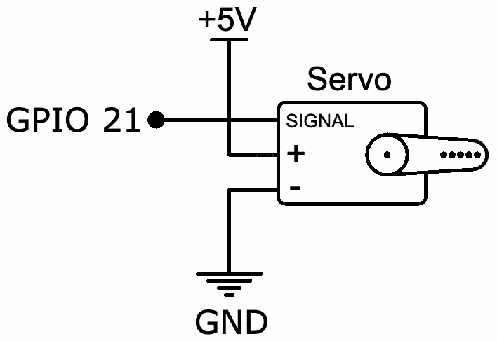
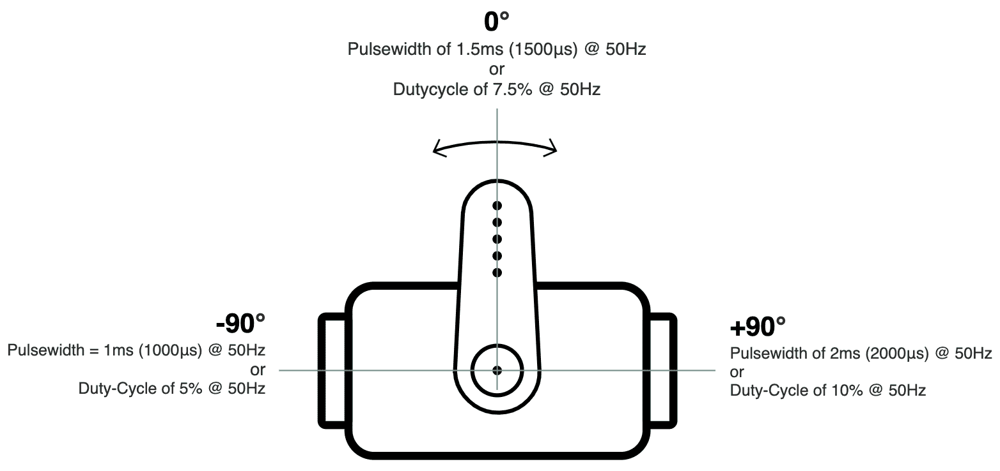
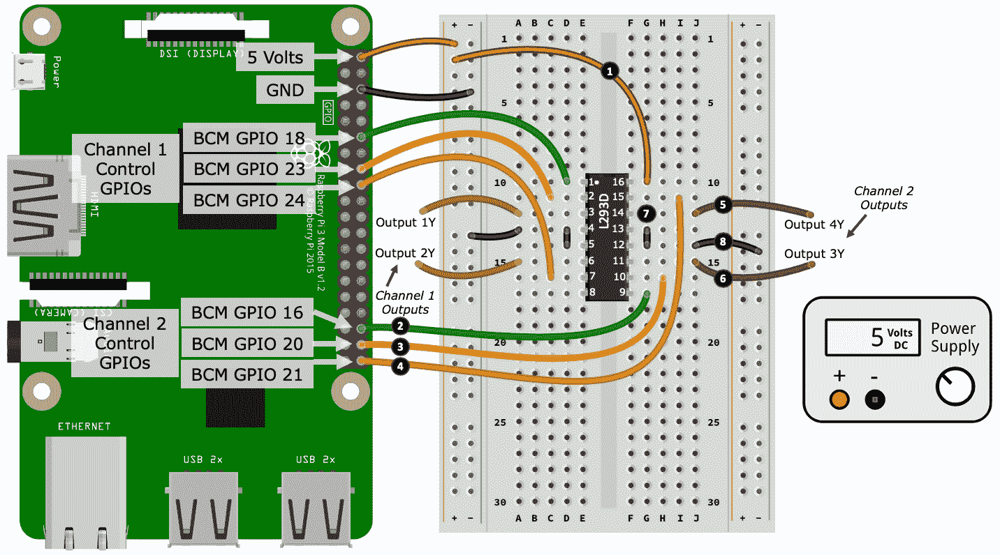
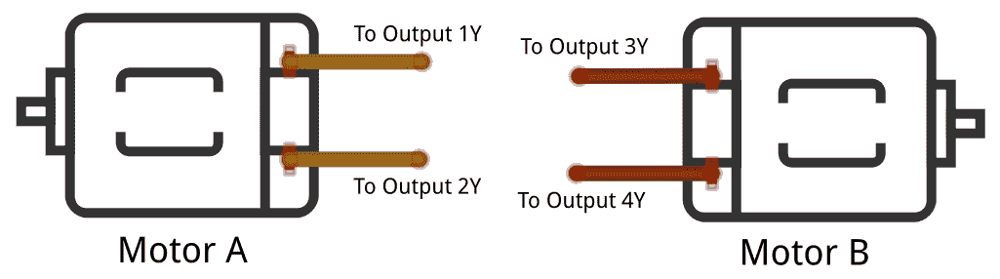

Movement with Servos, Motors, and Steppers

在上一章中，我们介绍了如何测量温度、湿度、光线和湿度。在本章中，我们将关注电机和伺服的控制，它们是创建物理运动和运动的常用设备。您将在本章中学习的核心概念、电路和代码将使用您的 Raspberry Pi 打开物理自动化和机器人技术的世界。

我们将学习如何使用**脉宽调制**（**PWM**）设置伺服角度，以及如何使用 H 桥 IC 控制直流电机的方向和速度。我们将研究步进电机以及如何控制它们以实现精确运动。

以下是我们将在本章中介绍的内容：

*   用 PWM 旋转伺服电机
*   使用 H 桥 IC 控制电机
*   步进电机控制简介

# 技术要求

要执行本章中的练习，您需要以下内容：

*   树莓皮 4 B 型
*   Raspbian OS Buster（带桌面和推荐软件）
*   最低 Python 版本 3.5

这些需求是本书中代码示例的基础。只要您的 Python 版本是 3.5 或更高版本，就可以合理地期望代码示例在 Raspberry Pi 3 Model B 或不同版本的 Raspbian OS 上无需修改即可工作。

您可以在 GitHub 存储库的`chapter10`文件夹中找到本章的源代码，该文件夹位于[https://github.com/PacktPublishing/Practical-Python-Programming-for-IoT](https://github.com/PacktPublishing/Practical-Python-Programming-for-IoT) 。

您需要在终端中执行以下命令，以设置虚拟环境并安装本章代码所需的 Python 库：

```py
$ cd chapter10              # Change into this chapter's folder
$ python3 -m venv venv      # Create Python Virtual Environment
$ source venv/bin/activate  # Activate Python Virtual Environment
(venv) $ pip install pip --upgrade        # Upgrade pip
(venv) $ pip install -r requirements.txt  # Install dependent packages
```

以下依赖项是从`requirements.txt`安装的：

*   **PiGPIO**：PiGPIO GPIO 库（[https://pypi.org/project/pigpio](https://pypi.org/project/pigpio)

本章练习所需的电子元件如下：

*   1 个 MG90S hobby 伺服（或等效的 3 线 5 伏 hobby 伺服）。参考数据表：[https://www.alldatasheet.com/datasheet-pdf/pdf/1132104/ETC2/MG90S.html](https://www.alldatasheet.com/datasheet-pdf/pdf/1132104/ETC2/MG90S.html)
*   1 个 L293D**集成电路**（**IC**）（确保它有 D–即 L293**D**，而不是 L293）。参考数据表：[https://www.alldatasheet.com/datasheet-pdf/pdf/89353/TI/L293D.html](https://www.alldatasheet.com/datasheet-pdf/pdf/89353/TI/L293D.html)
*   1 x 28BYJ-48 步进电机（5 伏，64 步，1:64 齿轮）。注：28BYJ-48 有 5 伏和 12 伏两种型号，配置步骤和传动装置各不相同。参考数据表：[https://www.alldatasheet.com/datasheet-pdf/pdf/1132391/ETC1/28BYJ-48.html](https://www.alldatasheet.com/datasheet-pdf/pdf/1132391/ETC1/28BYJ-48.html)
*   2 台规格为 130（R130）的直流电机，额定电压为 3-6 伏（理想情况下，失速电流<800 mA），或电压和电流额定值兼容的备用直流电机
*   外部电源–至少为 3.3 V/5 V 可安装在试验板上的电源

让我们从学习如何使用 Raspberry Pi、Python 和 PiGPIO 的伺服开始。

# 用 PWM 旋转伺服电机

普通伺服电机或伺服电机是内部齿轮电机，允许您将其轴旋转到 180 度圆弧内的精确角度。它们是工业机器人和玩具的核心部件，我们都熟悉玩具中的爱好伺服装置，如无线电控制的汽车、飞机和无人机。

*图 10.1*所示为一个全尺寸业余风格的伺服、一个微型伺服和一组头销，它们有助于将伺服连接到试验板，我们将在本节后面构建电路时需要这样做：


Figure 10.1 – Servos

伺服的最大特点是，它们本质上是一个即插即用式设备——在我们将它们连接到电源后，我们只需要向它们发送一个 PWM 信号，对我们希望伺服旋转到的角度进行编码，然后预调！我们结束了。没有集成电路、晶体管或任何其他外部电路。更好的是，伺服控制非常普遍，许多 GPIO 库（包括 PiGPIO）都包含了方便的控制方法。

让我们通过连接一个到树莓 Pi 开始我们的伺服探索。

## 将伺服连接到 Raspberry Pi

我们的伺服示例的第一个任务是将其连接到电源和 Raspberry Pi。此处显示了表示此接线的示意图：



Figure 10.2 – Servo wiring schematic

让我们开始使用试验板连接伺服系统，如图所示：


Figure 10.3 – Servo breadboard layout

在我们逐步完成布线程序之前，首先我想简单地讨论一下从伺服输出的导线颜色。虽然伺服线的颜色有些标准，但在不同的制造商和伺服之间可能会有所不同。在*步骤 4*、*5*和*6*连接伺服时，请使用以下指针。如果您的伺服有我在下面列表中没有列出的彩色电线，您需要查阅伺服的数据表。

常用的伺服线颜色如下：

*   棕色或黑色导线连接到 GND
*   红色导线连接到+5 伏
*   橙色、黄色、白色或蓝色导线是连接到 GPIO 引脚的信号/PWM 输入导线

以下是创建试验板构建的步骤。步骤编号与*图 10.3*中黑色圆圈中的编号匹配：

1.  将左侧和右侧负极电源轨连接在一起。
2.  将 Raspberry Pi 上的 GND 引脚连接到左侧负极电源轨。
3.  将伺服装置连接到试验板上。如前所述，如*图 10.1*所示，您需要一组头部引脚（或者，公-公跨接电缆）将伺服连接到试验板。
4.  将黑色导线（负极/GND）从伺服连接到右侧电源导轨的负极导轨。
5.  将红色导线（5 伏电源）从伺服连接到右侧电源导轨的正极导轨。
6.  将信号线从伺服连接到 Raspberry Pi 上的 GPIO 21。
7.  将 5 伏电源的正极输出端子连接到右侧电源导轨的正极导轨上。
8.  将电源的负极输出端子连接到右侧电源导轨的负极导轨上。

您需要使用外部 5 伏电源（*步骤 7*和*8*为您的伺服系统供电。小型伺服（如 MG90S）在轴/喇叭上无负载旋转时使用~200mA 电流（喇叭是连接到伺服轴的臂），如果将重负载连接到喇叭或强制停止旋转，则使用~400+mA 最大电流。直接从 Raspberry Pi 的 5 伏引脚中提取该电流可能足以使其复位。

Many cheap car-like toys have a hard left/right mock servo for their steering mechanisms. It might look like a servo on the outside, but in truth, it's just a basic DC motor with some gears and a spring that create the hard left/right steering angle. It's the spring that returns the servo to center when the motor is not engaged. If you do not have granular control over the angle, it's not a true servo.

在我们进入一些代码之前，我们将快速了解 PWM 是如何用于控制伺服的。这将为您提供一些在我们开始编写代码时发生的事情的背景信息。

## 如何使用 PWM 控制伺服

伺服系统通常需要大约 50 Hz 的 PWM 信号（50 Hz 左右的一些变化是可以的，但我们将坚持使用 50 Hz，因为这是公共参考点），以及决定旋转角度的 1.0 毫秒到 2.0 毫秒之间的脉冲宽度。脉冲宽度、占空比和角度之间的关系如*图 10.4*所示。如果这一切还没有完全理解，不要担心。在下一节中，我们将看到我们的伺服系统正在运行，并回顾与伺服系统相关的代码，这一点将变得更加清楚：



Figure 10.4 – Servo's pulse width, duty cycle, and angles

我们还没有涵盖与我们之前的 PWM 覆盖相关的脉冲宽度；然而，这只是描述占空比的另一种方式。

以下是一个例子：

*   如果我们有一个 50 赫兹的 PWM 信号（即每秒 50 个周期），那么这意味着 1 个 PWM 周期需要*1/50=0.02*秒，或 20 毫秒。
*   因此，以占空比表示的 1.5ms 的脉冲宽度为*1.5ms/20ms=0.075*，乘以 100 得到 7.5%的占空比。

要反向工作，我们有以下几点：

*   7.5%的占空比除以 100 等于 0.075。然后，*0.075 x 20 ms=1.5 ms–*即 1.5 ms 的脉冲宽度。

如果您想要一个公式来关联*脉冲宽度*、*频率*和*占空比*，这里是：


要转换回，我们有以下内容：


好了，算了吧。让我们运行并检查 Python 代码，以使我们的伺服移动。

## 运行和探索伺服代码

我们将要运行的代码可以在`chapter10/servo.py`文件中找到。我建议您在继续之前检查源代码，以便全面了解文件包含的内容。

当你运行在`chapter10/servo.py`文件中找到的代码时，你的伺服应该先向左再向右旋转几次。

让我们看看代码，从第 1 行定义的一些脉冲宽度变量开始：

```py
LEFT_PULSE  = 1000   # Nano seconds          # (1)
RIGHT_PULSE = 2000
CENTER_PULSE = ((LEFT_PULSE - RIGHT_PULSE) // 2) + RIGHT_PULSE  # Eg 1500
```

这些脉冲宽度代表我们的伺服极左和右旋转。

Note that the `LEFT_PULSE` and `RIGHT_PULSE` values are in nanoseconds, as this is the unit used by the PiGPIO servo functions.

这些`LEFT_PULSE = 1000`和`RIGHT_PULSE = 2000`的值是你经常看到的完美世界值。实际上，您可能需要对这些变量进行轻微调整，以使伺服完全旋转。例如，我的测试伺服需要`LEFT_PULSE = 600`和 `RIGHT_PULSE = 2450`值来实现完全旋转。如果您的伺服电机保持接合，并且在完全向左或向右旋转时发出呻吟声，您将知道您是否调整过远。如果发生这种情况，请立即断开电源以防止损坏伺服并重新调整数值。

If your serve rotates backward – for example, it rotates to the left when you expect it to rotate to the right – swap the values for `LEFT_PULSE` and `RIGHT_PULSE`. Or, just turn your servo upside down.

在第 2 行，我们定义了`MOVEMENT_DELAY_SECS= 0.5`变量，我们需要在后面添加伺服运动之间的延迟：

```py
      # Delay to give servo time to move    
  MOVEMENT_DELAY_SECS = 0.5            # (2)
```

当您使用伺服并向它们发送 PWM 旋转信号时，您会发现它们的行为是异步的。也就是说，在伺服完成旋转之前，代码不会阻塞。如果我们打算进行许多您希望完全完成的快速伺服运动，我们必须添加一个短延迟，以确保伺服有时间完成旋转。我们稍后将介绍的`sweep()`函数就是一个例子。0.5 秒的延迟只是一个建议，所以请随意尝试不同的数字。

从第 3 行开始，我们定义了三个基本功能来控制伺服：

```py
 def left():                                               # (3)
       pi.set_servo_pulsewidth(SERVO_GPIO, LEFT_PULSE)

 def center():
       pi.set_servo_pulsewidth(SERVO_GPIO, CENTER_PULSE)

 def right():
       pi.set_servo_pulsewidth(SERVO_GPIO, RIGHT_PULSE)
```

`left()`功能仅使用 PiGPIO`set_servo_pulsewidth()`方法将伺服 GPIO 引脚上的 PWM 脉冲宽度设置为`LEFT_PULSE`。这是 PiGPIO 提供的一种方便的伺服控制功能，是我们在前面许多章节中看到的使用`set_PWM_dutycycle()`和`set_PWM_frequency()`方法的实用替代方法。在查看代码之后，我们将进一步介绍这些方法。

`center()`和`right()`功能分别执行与`left()`相同的动作。

如果您将伺服旋转到指定的角度，并尝试用手移动喇叭，您将注意到伺服抵制更改。这是因为伺服系统通过`set_servo_pulsewidth()`持续接收（以 50 Hz 的速率）最后一个脉冲设置，因此它抵制任何改变其设置位置的尝试。

In the previous section, when we wired the servo to your Raspberry Pi, we mentioned the servo's maximum current of ~400+mA. The preceding paragraph is an example where this maximum current is drawn by the servo. When the servo is receiving its pulse width instruction, it resists any force to change its position, resulting in more current usage. It is similar in principle to the stall current of a DC motor we discussed back in [Chapter 7](10.html), *Turning Things On and Off*.

如果您将伺服的脉冲宽度设置为零，就像我们在第 4 行所示的`idle()`功能中所做的那样，您现在会发现，您可以用手轻松地旋转伺服。当我的测试伺服闲置（或静止）时，它使用了大约 6.5 mA：

```py
   def idle():                                      # (4)
      pi.set_servo_pulsewidth(SERVO_GPIO, 0)
```

到目前为止，我们已经看到了如何使伺服旋转到左侧、中心和右侧，但是如果我们想将其旋转到一个特定的角度呢？简单（-ish），我们只需要一点数学，如第 5 行的`angle()`函数所示：

```py
  def angle(to_angle):                                   # (5)
      # Restrict to -90..+90 degrees
      to_angle = int(min(max(to_angle, -90), 90))

      ratio = (to_angle + 90) / 180.0                    # (6)
      pulse_range = LEFT_PULSE - RIGHT_PULSE
      pulse = LEFT_PULSE - round(ratio * pulse_range)    # (7)

      pi.set_servo_pulsewidth(SERVO_GPIO, pulse)
```

`angle()`函数取-90 到+90 度范围内的角度（0 度为中心），计算出我们的输入角度相对于第 6 行伺服 180 度范围的比率，然后在第 7 行导出相应的脉冲宽度。然后，该脉冲宽度被发送到伺服，它将相应地调整其角度。

最后，我们在第 10 行遇到了`sweep()`函数。这是运行此代码时提供伺服左/右扫掠运动的功能：

```py
 def sweep(count=4):                        # (10)
      for i in range(count):
          right()
          sleep(MOVEMENT_DELAY_SECS)
          left()
          sleep(MOVEMENT_DELAY_SECS)
```

在这个函数中，我们看到了`sleep(MOVEMENT_DELAY_SECS)`的使用，由于伺服的异步性质，这是为完成每个旋转请求提供伺服时间所必需的。如果你要注释掉这两个`sleep()`调用，你会发现伺服向左旋转并停止。这是因为当`for`循环迭代时（没有`sleep()`，每个`left()`调用都会覆盖上一个`right()`调用，依此类推，循环完成之前最后调用的是`left()`。

We've just seen how to control a servo using PiGPIO and its servo-orientated PWM function, `set_servo_pulsewidth()`. If you are interested in how a servo implementation looks with the `set_PWM_frequency()` and `set_PWM_dutycycle()` functions, you'll find a file in the `chapter10` folder named `servo_alt.py`. It's functionally equivalent to the `servo.py` code we have just covered.

现在，我们的伺服示例到此结束。您所学到的知识以及代码示例将为您提供在自己的项目中开始使用伺服系统所需的一切！我们的重点一直是使用角运动伺服；然而，您所学的核心内容还将通过一些尝试和错误试验（主要围绕确定正确的脉冲宽度）来适应*连续旋转伺服*，我将在下一节中简要介绍。

让我们以对不同类型伺服的简要考虑来结束对伺服的讨论。

## 不同类型的伺服系统

我们的例子使用了一个普通的三线 180 度角伺服。虽然这是一种非常常见的伺服类型，但也存在其他变化，包括连续旋转伺服、三线以上伺服和特殊用途伺服：

*   **连续旋转伺服**：*有三条线，工作原理与三线角伺服相同，只是 PWM 脉冲宽度决定伺服的旋转*方向*（顺时针/逆时针）和*速度*。*

*Due to their internal control circuitry and gearing, continuous rotation servos are a convenient low-speed/high-torque alternative to a DC motor and H-Bridge controller (which we will be covering in the next section).

*   **4 线伺服装置**：这些装置配有一套三线伺服装置和第四套松线伺服装置。第四根导线是伺服的模拟输出，可用于检测角度。这是有用的，如果你需要知道你的伺服的休息角度，当你开始你的程序。

Servos track their position using an embedded potentiometer. This fourth wire is attached to such a potentiometer.

*   **专用或重型工业用伺服**：具有不同的接线配置和使用要求–例如，它们可能没有解码 PWM 信号的内部电路，并要求用户提供和创建执行此功能的电路。

现在，我们已经了解了常见的业余风格伺服是如何工作的，并且还发现了如何使用 PWM 在 Python 中设置它们的旋转角度。在下一节中，我们将学习更多关于直流电机的知识，以及如何使用称为 H 桥的 IC 控制它们。

# 使用 H 桥 IC 控制电机

在[第 7 章](10.html)*开启和关闭*中，我们学习了如何使用晶体管开启和关闭直流电机，我们还了解了如何使用 PWM 控制电机的速度。我们的单管电路的一个限制是电机只朝一个方向旋转。在本节中，我们将探索一种方法，使我们的电机在向前和向后两个方向上旋转——使用所谓的*H 桥*电路。

The H i n H-Bridge comes from the perception that a basic H-Bridge circuit schematic (created from four individual transistors) make a letter H.

如果您在易趣等网站上搜索 H-Bridge 模块，您将发现许多现成的模块，其用途与我们在本节中介绍的相同。我们将要做的是在我们的实验板上构建一个复制模块。一旦你有了你的实验板复制品并了解它是如何工作的，你就可以理解这些现成模块的构造了。

我们可以创建一个 H 桥，以几种方式驱动电机：

*   只需使用预先构建的模块（模块和 IC 也可以称为或标记为电机驱动器或电机控制器）。这不是最简单的方法。

*   使用分立元件创建一个 H 桥电路——例如，四个晶体管、许多二极管、一把电阻器和许多导线将它们全部连接起来。这是最难的办法。

*   使用 IC（内部组合所有必要的分立部件）。

A servo, just like we used in the previous section, is made up of a DC motor connected to an H-Bridge-style circuit that allows the motor to move forward and backward to create the servo's left and right rotation.

我们将选择最后一个选项，并使用 L293D，这是一种常见且低成本的 H 桥 IC，可用于构建电机控制器电路。

以下是从其数据表中提取的 L293D 的基本规格：

*   600 mA 的连续电流，1.2 A 峰值/脉冲。作为提醒，我们在[第 7 章](10.html)*中探讨了电机和当前使用，以打开和关闭设备。*
*   它可以控制电压在 4.5 伏和 36 伏之间的电机。
*   它包括内部反激二极管，所以我们不需要添加我们自己的。这就是 D 在 L293**D**中的意思。如果您需要更新反激二极管，请参阅[第 7 章](10.html)、*打开和关闭。*
*   它包括两个通道，因此能够同时驱动两个直流电机。

If you are looking to purchase a different motor driver IC for a project (for example, if you need one with more current), remember to check the datasheet to see whether it has fly-back diodes embedded, or else you will need to provide your own.

让我们建立我们的电路来控制我们的马达。

## 构建电机驱动电路

在本节中，我们将构建用于控制两个直流电机的 H 桥电路。下面的示意图描述了我们将创建的电路。虽然这个电路看起来很忙，但我们的大部分工作将只是将 L293D IC 的支腿连接到我们的 Raspberry Pi、电源和电机：


Figure 10.5 – L293D and motor schematic diagram

由于有很多电线连接要通过，我们将在我们的试验板上分四个部分构建这个电路。

We will be using an IC in our circuit build. Many ICs (including the L293D) are sensitive to static **electricity discharge** (**ESD**), and if exposed to static discharge, they can be damaged. As a general rule, you should avoid touching the pins/legs of an IC with your fingers so that any static charge you have in your body does not get discharged to the IC.

让我们从第一部分开始，如下图所示：


Figure 10.6 – L293D breadboard layout (Part 1 of 3)

以下是开始我们的试验板构建所需遵循的步骤。步骤编号与*图 10.6*中黑色圆圈中的编号匹配：

1.  首先，将 L293D IC 放置在试验板中，确保 IC 方向正确，引脚/支腿 1 朝向试验板顶部。IC 引脚 1 通常由引脚旁边的小圆形压痕或圆点表示。在我们的插图中，这个点是白色的，以便于观察；但是，它很可能与 IC 上的外壳颜色相同。在没有圆点的情况下，IC 的一端通常也有一个切口部分。当您握住 IC 时，插脚 1 是左上角的插脚，切口朝向*远离*。
2.  将 Raspberry Pi 上的一个 5 伏针脚连接到左侧电源导轨的正极导轨上。
3.  将 Raspberry Pi 上的 GND 引脚连接到左侧电源导轨的负极导轨上。
4.  将 GPIO 18 连接至 L293D 的针脚 1。
5.  将 GPIO 23 连接到 L293D 的针脚 2。
6.  将 GPIO 24 连接至 L293D 的针脚 7。

7.  将跨接导线连接到 L293D 的针脚 3 上。该导线的另一端（标记为**输出 1Y**）暂时未连接到任何东西。
8.  将跨接导线连接到 L293D 的针脚 6 上。该导线的另一端（标记为**输出 2Y**）暂时未连接到任何东西。
9.  使用跨接导线将 L293D 上的针脚 4 和针脚 5 连接在一起。
10.  最后，将 L293D 的针脚 4 和针脚 5 连接到左侧电源导轨的负极导轨上。

我们刚刚完成的大部分工作涉及 L293D 的*通道 1*的布线。作为提醒，L293D 有两个输出通道，对于本节内容，这意味着我们可以控制两个直流电机。

如果您再次参考*图 10.6*，您会注意到线路（位于*步骤 7*和*8*处）构成了通道 1 的输出。在本节后面，我们将在这些导线上连接一个电机。此外，在图中，您会注意到 GPIO18、23 和 24 被标记为通道 1 控制 GPIOs*。*我们将在讨论该电路附带的代码时，了解如何使用这些 GPIO 来控制较大的通道 1 电机。

接下来，我们构建的下一部分主要涉及连接 L293D 的通道 2。这或多或少反映了我们刚才执行的接线：



Figure 10.7 – L293D breadboard layout (Part 2 of 3)

下面是完成实验板构建的第二部分需要遵循的步骤。步骤编号与*图 10.7*中黑色圆圈中的编号匹配：

1.  将 L293D 的针脚 16 连接到左侧电源导轨的正极导轨上。引脚 16 的 5 伏连接为*IC 的内部电路*提供电源–它不是通道输出（即我们的电机）的电源。我们将在构建的第 3 部分将外部电源连接到 IC，为通道的电机供电。
2.  将 GPIO 16 连接至 L293D 的针脚 9。
3.  将 GPIO 20 连接至 L293D 的针脚 10。
4.  将 GPIO 21 连接到 L293D 的针脚 15 上。
5.  将跨接导线连接到 L293D 的针脚 14 上。该导线的另一端（标记为**输出 4Y**）暂时未连接到任何东西。
6.  将跨接导线连接到 L293D 的针脚 11 上。该导线的另一端（标记为**输出 3Y**）暂时未连接到任何东西。
7.  使用跨接导线将 L293D 上的针脚 12 和针脚 13 连接在一起。
8.  最后，将 L293D 的针脚 12 和针脚 13 连接到右侧电源导轨的负极导轨上。

现在，我们已连接通道 2 输出，第三个任务是连接外部电源：


Figure 10.8 – L293D breadboard layout (Part 3 of 3)

以下是完成实验板构建的第三部分所需遵循的步骤。步骤编号与*图 10.8*中黑色圆圈中的编号匹配：

1.  将电源的正极输出端子连接到右侧电源导轨的正极导轨上。
2.  将电源的负极输出端子连接到右侧电源导轨的负极导轨上。
3.  将 L293D 的针脚 8 连接到右侧电源导轨的正极导轨上。L293D 的引脚 8 提供用于驱动输出通道的输入电源。
4.  最后，使用跨接导线连接左侧和右侧电源导轨的负极导轨。

这是我们的试验板布局完成。然而，还有一个最后的任务，我们连接我们的马达。按照下图中的示例，可以将电机连接到每个输出通道：



Figure 10.9 – L293D motor connections

做得好！那是一大堆电线。我想你现在在你的实验板上缠绕的电线看起来不像插图那么优美！请务必花时间仔细检查此电路的接线，因为错误放置的导线将阻止电路按预期工作。

在我们的电路构建过程中，在第 3 部分*步骤 3*中，我们将一个外部 5 伏电源连接到 L293D 的引脚 8。这是用于驱动每个输出通道的功率，因此也是我们的电机。如果您希望使用需要不同于 5 伏电压的电机，可以根据需要更改此电源电压，但前提是 L293D 的电源电压必须在 4.5 伏到 36 伏的范围内。还请记住（如本节开头所述），您的电机不应消耗超过 600 mA 的连续电流（完全打开）或 1.2 a 的峰值电流（例如，在使用 PWM 时，我们将在了解代码时介绍）。

If you read a datasheet for the L293D, it may be entitled *Quadruple Half-H Drivers*. Datasheets for driver type ICs can have all sorts of different titles and wordings. The important point here is that to drive our motor forward and backward, we require a full H-Bridge circuit, hence, for the L293D: Quad=4 and half=0.5, so *4 x 0.5 = 2 –* that is, 2 full H-Bridges – therefore, we can control 2 motors.

一旦您创建了试验板电路并连接了电机，我们将运行示例代码并讨论其工作原理。

## 运行示例 H 桥代码以控制电机

现在您已经创建了 H 桥驱动电路并连接了电机，让我们运行代码使电机旋转。

本节共有两个文件，可在`chapter10/motor_class.py`和`chapter10/motor.py`中找到。运行`chapter10/motor.py`中的代码，您的电机将启动、改变速度和方向。

Place a piece of tape on the shaft of your motors to make it easier to see when they rotate and in what direction.

当您确认您的电路与示例代码一起工作时，我们接下来将继续讨论代码。由于 L293D 可以驱动两台电机，通用代码被抽象为`motor_class.py`，由`motor.py`导入并用于驱动我们的两台单独电机。

我们先来看看`motor.py`。

### 运动型

从第 1 行开始，我们导入 PiGPIO 和`motor_class.py`文件中定义的`Motor`类，然后定义几个变量，描述如何将 L293D 连接到 Raspberry Pi 的 GPIO 引脚：

```py
import pigpio                    # (1)
from time import sleep
from motor_class import Motor

# Motor A
CHANNEL_1_ENABLE_GPIO = 18       # (2)
INPUT_1Y_GPIO = 23 
INPUT_2Y_GPIO = 24

# Motor B
CHANNEL_2_ENABLE_GPIO = 16       # (3)
INPUT_3Y_GPIO = 20
INPUT_4Y_GPIO = 21
```

参考图 10.3（图 10.4），图 10.4，图 5，如果我们考虑了电路的一个 AutoT6（通道）边，我们看到逻辑引脚在 2 号线上连接到 GPIOS 23 和 24。这些逻辑引脚（以及我们稍后将介绍的启用引脚）用于设置电机的状态和旋转方向。这些状态的真值表如下所示。

此表来源于 L293D 数据表，并重新格式化和补充，以匹配我们的代码和电路：

| **第#**行 | **启用 GPIO** | **逻辑 1 GPIO** | **逻辑 2 GPIO** | **运动功能** |
| 1. | `HIGH`或>0%占空比 | 低的 | 高的 | 右转 |
| 2. | `HIGH`或>0%占空比 | 高的 | 低的 | 左转 |
| 3. | `HIGH`或>0%占空比 | 低的 | 低的 | 打破 |
| 4. | `HIGH`或>0%占空比 | 高的 | 高的 | 打破 |
| 5. | `LOW`或 0%占空比 | 不适用 | 不适用 | 熄火 |

L293D 有两个启用引脚–每个通道一个（即，每个电机一个）–例如，前面代码中第 3 行的`CHANNEL_1_ENABLE_GPIO = 18`。启用引脚就像每个通道的主开关。当 enable 引脚设置为 high（高）时，它会打开相关通道，从而为电机供电。或者，如果我们使用 PWM 脉冲启用引脚，我们可以控制电机的速度。当我们浏览`motor_class.py`文件时，我们将看到与逻辑一起工作并启用 PIN 的代码。

接下来，我们将创建一个`pigpio.pi()`实例，如第 4 行所示，然后我们将创建两个`Motor`实例来表示我们的两个物理马达：

```py
pi = pigpio.pi()                 # (4)
motor_A = Motor(pi, CHANNEL_1_ENABLE_GPIO, INPUT_1Y_GPIO, INPUT_2Y_GPIO)
motor_B = Motor(pi, CHANNEL_2_ENABLE_GPIO, INPUT_3Y_GPIO, INPUT_4Y_GPIO)
```

在我们创建了`motor_A`和`motor_B`类之后，我们使用这些类执行一些操作来控制电机，如以下代码所示，从第 5 行开始–这是您在上一节运行代码时看到的：

```py
 print("Motor A and B Speed 50, Right") 
 motor_A.set_speed(50)                                # (5)
 motor_A.right()
 motor_B.set_speed(50)
 motor_B.right() 
 sleep(2)

 #... truncated ... 

 print("Motor A Classic Brake, Motor B PWM Brake")
 motor_A.brake()                                      # (6) 
 motor_B.brake_pwm(brake_speed=100, delay_millisecs=50)
 sleep(2)
```

注意管路 6 处的制动并观察电机。一个马达刹车比另一个好吗？我们将在下一节末尾介绍两个制动功能时进一步讨论这一点。

让我们继续看`motor_class.py`。这就是集成 Raspberry Pi 和 L293D 的代码所在。

### 电机 _ 类.py

首先，我们看到`Motor`类定义及其构造函数：

```py
class Motor:

  def __init__(self, pi, enable_gpio, logic_1_gpio, logic_2_gpio):

    self.pi = pi
    self.enable_gpio = enable_gpio
    self.logic_1_gpio = logic_1_gpio
    self.logic_2_gpio = logic_2_gpio

    pi.set_PWM_range(self.enable_gpio, 100) # speed is 0..100       # (1)

    # Set default state - motor not spinning and 
    # set for right direction.
    self.set_speed(0) # Motor off                                   # (2)
    self.right()
```

在第 1 行，我们将使能引脚的 PiGPIO PWM 占空比范围定义为范围`0..100`。这定义了最大范围值（即，`100`，我们可以使用`set_speed()`函数，稍后我们将讨论这个函数。

范围`0..100`意味着我们有 101 个离散整数 PWM 步进，可以方便地映射到 0%到 100%的占空比。如果指定更高的数字，这并不意味着更多的占空比（或更多的电机转速）；它只是改变了步长的粒度–例如，默认的 PWM 范围`0..255`为我们提供了 256 个离散步长，其中 255=100%占空比。

Remember what we're about to discuss covers one channel (one motor) of the L293D IC circuit. Everything we cover applies to the other channel too – it's just the GPIO pins and IC pins that change.

我们的构造函数通过将电机初始化为 off（零速度）完成，并将电机默认为右旋转方向，如前面代码第 2 行所示。

接下来，我们将遇到几个函数，这些函数用于使电机旋转。我们在第 3 行和第 4 行看到`right()`和`left()`方法，根据上表第 1 行和第 2 行，它们改变 L293D 逻辑引脚的高/低状态：

```py
 def right(self, speed=None):           # (3)
     if speed is not None:
         self.set_speed(speed)

     self.pi.write(self.logic_1_gpio, pigpio.LOW)
     self.pi.write(self.logic_2_gpio, pigpio.HIGH)

 def left(self, speed=None):           # (4)
     if speed is not None:
         self.set_speed(speed)

     self.pi.write(self.logic_1_gpio, pigpio.HIGH)
     self.pi.write(self.logic_2_gpio, pigpio.LOW)
```

我们可以通过查询逻辑引脚的当前状态来检查电机是否设置为向左或向右旋转，如第 5 行的`is_right()`所示。请注意，`is_right()`中查询的 GPIO 状态与`right()`中设置的状态匹配：

```py
   def is_right(self):                              # (5)
       return not self.pi.read(self.logic_1_gpio)   # LOW 
              and self.pi.read(self.logic_2_gpio)   # HIGH
```

我们在下面第 6 行的代码中看到了`set_speed()`方法中`set_PWM_dutycycle()`的用法，我们通过脉冲 L293D 的启用引脚来设置电机的速度。使用[第 7 章](10.html)*中使用的相同基本原理来脉冲启用引脚*，当我们脉冲晶体管以设置电机速度时，将其打开和关闭：

```py
    def set_speed(self, speed):                      # (6)
        assert 0<=speed<=100
        self.pi.set_PWM_dutycycle(self.enable_gpio, speed)
```

您可以通过将速度设置为`0`来停止电机，这有效地切断了电机的电源（0%占空比=引脚低）。

向前看，我们在 7 号线和 8 号线找到了两种方法，分别命名为`brake()`和`brake_pwm()`，可用于快速停止电机*。制动和通过切断电机功率（即，`set_speed(0)`停止电机之间的区别在于，`set_speed(0)`允许电机随时间逐渐减速，这是上表第 5 行的状态：*

```py
    def brake(self):                # (7)
        was_right = self.is_right() # To restore direction after braking

        self.set_speed(100)
        self.pi.write(self.logic_1_gpio, pigpio.LOW)
        self.pi.write(self.logic_2_gpio, pigpio.LOW)
        self.set_speed(0)

        if was_right:
            self.right()
        else:
            self.left()
```

当您在上一节中运行此代码时，如果您自己尝试两个制动功能，我猜您会发现`brake()`工作不正常（如果有），而`brake_pwm()`功能工作正常：

```py
    def brake_pwm(self, brake_speed=100, delay_millisecs=50):    # (8)
        was_right = None # To restore direction after braking
        if self.is_right(): 
            self.left(brake_speed)
            was_right = True
        else:
            self.right(brake_speed)
            was_right = False
        sleep(delay_millisecs / 1000)
        self.set_speed(0)
        if was_right:
            self.right()
        else:
            self.left()
```

让我们讨论一下为什么我们定义了两种不同的制动方法，以及为什么一种方法比另一种更好。

`brake()`的实现是实现电机制动器的经典方式，其中两个逻辑 GPIO 一起设置为高或低，如上表第 3 行或第 4 行所示。然而，问题在于，这种逻辑的性能可能会因您使用的 IC（内部构造方式）、电机以及使用的电压和电流而有所不同。例如，我们使用的是一个小电机（轴上没有负载）、小电压和电流以及 L293D IC。所有这一切的网络是，经典制动不工作得很好，如果有的话。

We're using the L293D IC because of its popularity, availability, and low cost. It's been in production for many years, and you will have no problem finding example circuits and code based around this IC for all sorts of applications. It's not the most efficient IC, however. This is a contributing factor in classic braking not working in some scenarios.

`break_pwm(reverse_speed, delay_secs)`采用了一种不同且更可靠的制动方法，即向电机施加一个较小且相反的电压。如果需要，您可以使用`brake_speed`和`delay_millisecs`参数来调整制动-速度和延迟太小，制动器将不工作，太多，电机将反转方向。

Have you noticed that at full speed (that is, `set_speed(100)` ), your motor spins slower than if it were connected directly to 5 volts? There is a ~2 voltage drop inherent in the L293D. Even though V <sub>cc1</sub> (motor power source) is connected to 5 volts, the motor is not getting this full 5 volts (it's more like ~3 volts). If you are using a variable power supply (that is, not a 3.3 V/5 V breadboard power supply), you can increase the input voltage to V <sub>cc1</sub> to around 7 volts. This will then see the motor getting around 5 volts (you can use your multimeter to verify this).

祝贺您刚刚学习了如何操作伺服系统，并掌握了直流电机在速度和制动方向方面的控制。您刚刚掌握的电路、代码和技能可以适应许多需要创建运动和角度运动的应用程序，例如，机器人汽车或手臂。你甚至可以用这些技能来改装机动玩具和其他机动设备，让它们可以被你的树莓 Pi 控制。

如果您想进一步扩展您的知识，您可能想探索如何从单个组件（如晶体管、电阻器和二极管）创建 H 桥电路。虽然有多种方法可以实现此电路，但我们在[第 7 章](10.html)*打开和关闭*中介绍了本章与晶体管使用之间的概念和组件方面的核心基础知识。

做得好！在本节中，我们学习了如何使用 L293D H 型电桥使直流电机旋转、反转和制动。在下一节中，我们将介绍 L293D 的另一种用途，并了解如何使用它来控制步进电机。

# 步进电机控制简介

步进电机在精度和转矩方面是一种独特的电机类型。与直流电机类似，步进电机可以在两个方向连续旋转，同时它们可以像伺服一样精确控制。

下图中为 28BYJ-48 步进电机，以及可用于将电机连接至试验板的头销：


Figure 10.10 – 28BYJ-48 s tepper motor

步进电机的理论和实践可以很快变得复杂！有不同的形式和类型的步进电机和许多变量，如步幅角度和齿轮传动，所有这些都需要考虑，加上各种方式来接线和控制它们。我们不可能在这里涵盖所有这些参数，也不可能深入到步进电机如何工作的低级细节。

取而代之的是，我们将介绍一种常见且随时可用的步进电机 28BYJ-48 的实际操作。一旦您了解了适用于 28BYJ-48 的基本原理，您将能够很好地扩展您对步进电机的知识。

Controlling stepper motors can be confusing and fiddly when you first start using them. Unlike DC motors and servos, you need to appreciate how stepper motors work at both a mechanical and code level to control them.

我方参考 28BYJ-48 的基本规范如下：

*   5 伏（确保步进电机为 5 伏，因为 28BYJ-48 也有 12 伏电压）。
*   步幅角度为 64，传动比为 1:64，每 360 度旋转*64 x 64=4096*步数。

使用步幅角度、传动比和顺序，我们可以计算出将步进电机旋转 360 度所需的逻辑步数：*64 x 64/8=512**步数*。

接下来，我们将把步进电机连接到树莓 Pi。

## 将步进电机连接到 L293D 电路

为了将步进电机连接到 Raspberry Pi，我们将重复使用 L293D 电路，如前一节中的*图 10.8*所示。以下是我们需要做的：


Figure 10.11 – 28BYJ-48 stepper motor wiring connection

以下步骤与*图 10.11*所示编号相匹配。请记住，我们从您之前在题为*构建电机驱动电路*一节中完成的电路开始，如*图 10.8*所示：

In *steps 2* through *5*, we will connect the stepper motor in our breadboard circuit. A suggestion is to use header pins (as pictured in *Figure 10.10*) to connect your motor to a run of vacant rows on your breadboard, and then connect the output wires from the L293D to the appropriate row matching the wire colors mentioned in the steps.

1.  如果您尚未这样做，请将两个直流电机从现有电路上断开。
2.  将步进电机的橙色导线连接到图 10.8 中标记为**输出 4Y**的导线上。
3.  将步进电机的黄色导线连接到图 10.8 中标记为**输出 3Y**的导线上。

4.  将步进电机的粉色导线连接到图 10.8 中标记为*的**输出 2Y**的导线上。*
5.  将步进电机的蓝色导线连接到图 10.8 中标记为*的**输出 1Y**的导线上。*

在我们的示例场景中，我们使用 L293D H 桥作为*双极*步进电机驱动步进电机。您将遇到与步进电机相关的术语*双极*和*单极*。这些术语与电机的接线方式有关，这会影响您控制电机的方式。讨论双极和单极步进电机之间的差异会很快变得复杂；然而，在这一学习阶段，一个简化的区别如下：

*   *双极*步进电机需要一个能够反转电流的驱动电路。
*   *单极*步进电机*不*需要能够反转电流的电路。

在我们的双极布线示例中，我们使用 H 桥电路，因为它能够反转流向线圈的电流（例如，这就是我们在上一节中使直流电机反转的方式）。

The ULN2003 IC is a popular, low-cost Darlington transistor array (with built-in fly-back diodes); you could also use it to drive your stepper motor as a *unipolar* stepper motor. In this setup, you would use the red wire connected to +5 volts because the ULN2003 is unable to reverse current.

与我们的步进电机连接，我们可以继续控制它的代码。

## 运行和探索步进电机代码

我们将要运行的代码可以在`chapter10/stepper.py`文件中找到。我建议您在继续之前查看源代码，以便全面了解文件包含的内容。

当您运行在`chapter10/stepper.py`文件中找到的代码时，您的步进电机应在一个方向上旋转 360 度，然后再次旋转。

Place a piece of tape on the shaft of your stepper motor to make it easier to see when it rotates and in what direction.

从源文件的顶部开始，我们定义了所有 GPIO 变量，包括第 1 行的 enable 引脚，以及第 2 行开始的与步进电机线圈导线相关的变量。这些电线必须**正确识别和订购，因为线圈电线订购很重要！**

```py
CHANNEL_1_ENABLE_GPIO = 18                                # (1)
CHANNEL_2_ENABLE_GPIO = 16

INPUT_1A_GPIO = 23 # Blue Coil 1 Connected to 1Y          # (2)
INPUT_2A_GPIO = 24 # Pink Coil 2 Connected to 2Y
INPUT_3A_GPIO = 20 # Yellow Coil 3 Connected to 3Y
INPUT_4A_GPIO = 21 # Orange Coil 4 Connected to 4Y

STEP_DELAY_SECS = 0.002                                   # (3)
```

我们将在后面的代码中看到在第 3 行使用`STEP_DELAY_SECS`在线圈步骤之间增加一点延迟。延迟越大，步进电机轴的旋转速度越慢；但是，如果数值太小，则轴可能根本不旋转，或者旋转可能不稳定和结巴。您可以随意尝试不同的延迟值，以满足您的需要。

接下来，从第 4 行开始，我们将 coil GPIO 分组到一个 Python 列表（数组）中，并在第 5 行将这些 GPIO 初始化为输出。我们将 GPIO 存储在一个列表中，因为我们将在稍后使用`rotate()`函数时迭代这些 GPIO。我们在第 6 行还有`off()`功能，用于关闭所有线圈：

```py
coil_gpios = [                             # (4)
    INPUT_1A_GPIO,
    INPUT_2A_GPIO,
    INPUT_3A_GPIO,
    INPUT_4A_GPIO
]

# Initialise each coil GPIO as OUTPUT.
for gpio in coil_gpios:                    # (5)
    pi.set_mode(gpio, pigpio.OUTPUT)

def off():
    for gpio in coil_gpios:                # (6)
       pi.write(gpio, pigpio.LOW) # Coil off

off() # Start with stepper motor off.
```

在第 7 行，我们在代码中设置了两个 enable GPIO 引脚`HIGH`，因为我们重用了前面直流电机控制示例中的电路。另一种非编码方法是将 L293D EN1 和 EN2 引脚直接连接到+5 伏（即，手动拉动它们`HIGH`：

```py
# Enable Channels (always high)
pi.set_mode(CHANNEL_1_ENABLE_GPIO, pigpio.OUTPUT)      # (7)
pi.write(CHANNEL_1_ENABLE_GPIO, pigpio.HIGH)
pi.set_mode(CHANNEL_2_ENABLE_GPIO, pigpio.OUTPUT)
pi.write(CHANNEL_2_ENABLE_GPIO, pigpio.HIGH)
```

从第 8 行开始，我们在一个名为`COIL_HALF_SEQUENCE`和`COIL_FULL_SEQUENCE`的多维（2 x 2）数组中定义了两个步进序列，因此我们遇到了代码中的一些部分，在这些部分中，步进电机控制比直流电机或伺服控制更为复杂！

步进顺序定义了我们必须如何打开（通电）和关闭（未通电）步进电机中的每个线圈以使其步进。序列中的每一行有四个元素，每个元素都与线圈有关：

```py
COIL_HALF_SEQUENCE = [             # (8)
    [0, 1, 1, 1],
    [0, 0, 1, 1],   # (a)
    [1, 0, 1, 1],
    [1, 0, 0, 1],   # (b)
    [1, 1, 0, 1],
    [1, 1, 0, 0],   # (c)
    [1, 1, 1, 0],
    [0, 1, 1, 0] ]  # (d)

COIL_FULL_SEQUENCE = [
    [0, 0, 1, 1],   # (a)
    [1, 0, 0, 1],   # (b)
    [1, 1, 0, 0],   # (c)
    [0, 1, 1, 0] ]  # (d)
```

具有八个步骤的序列称为*半步*序列，而*全步*序列有四行，是半序列的子集（匹配前面代码中的*（A）*、*（b）*、*（c）*、*（d）*行）。

半步序列将提供更高的分辨率（例如，360 度旋转 4096 步），而全步序列将提供一半的分辨率（2048 步），但是步进速度的两倍。

步进机的步进顺序通常可以在其数据表中找到，但并非总是如此，正如我们在*技术要求*一节中提到的参考 28BYJ-48 数据表所证明的，因此有时可能需要进行一些研究。

If a stepper motor is not rotating, but it is making a sound and vibrating, it's a sign that the stepping sequence and coil order is incorrectly matched. This is a common frustration with stepper motors when you try to just connect them blindly and hope they work. To avoid this trial-and-error approach, take the time to identify your stepper motor type and how it is being wired (for example, bipolar or unipolar), and work out the coil numbering and what a suitable coil stepping sequence looks like. Consulting your stepper motor's datasheet is the best place to start.

接下来，在第 9 行，我们定义了全局变量`sequence = COIL_HALF_SEQUENCE`，以在步进电机时使用半步序列。您可以将其更改为`sequence = COIL_FULL_SEQUENCE`以使用完整的步骤序列–所有其他代码保持不变：

```py
sequence = COIL_HALF_SEQUENCE       # (9)
#sequence = COIL_FULL_SEQUENCE
```

在第 10 行，我们有`rotate(steps)`方法，可以说，这是所有魔法发生的地方。检查和理解这种方法的作用是理解如何控制步进电机的关键。`steps`参数可以是正数或负数，以反向旋转步进电机：

```py
# For rotate() to keep track of the sequence row it is on.
sequence_row = 0 

def rotate(steps):                              # (10)
    global sequence_row
    direction = +1
    if steps < 0:
        direction = -1
```

`rotate()`功能的核心在两个`for`环路内，从 11 号线开始：

```py
# rotate(steps) continued...

    for step in range(abs(steps)):                # (11)
      coil_states = sequence[sequence_row]        # (12)
      for i in range(len(sequence[sequence_row])):
          gpio = coil_gpios[i]                    # (13)
          state = sequence[sequence_row][i]       # (14)
          pi.write(gpio, state)                   # (15)
          sleep(STEP_DELAY_SECS)
```

当代码循环进行`step`迭代时，我们在第 12 行得到下一个线圈状态的形式`sequence[sequence_row]`（例如`[0, 1, 1, 1]`），然后循环通过并在第 13 行得到相应的线圈 GPIO，在第 14 行得到其`HIGH`/`LOW`状态。在第 15 行，我们使用`pi.write()`设置线圈的`HIGH`/`LOW`状态，这使我们的电机移动（即步进），然后短暂延迟睡眠。

接下来，从第 16 行开始，根据旋转方向更新`sequence_row`索引（即`steps`参数是正还是负）：

```py
# rotate(steps) continued...

      sequence_row += direction            # (16)
      if sequence_row < 0:
          sequence_row = len(sequence) - 1
      elif sequence_row >= len(sequence):
          sequence_row = 0
```

在这段代码的末尾，如果还有更多的步骤要完成，那么代码将返回到第 11 行进行下一次`for steps in ...`迭代。

最后，在第 17 行，我们来看看运行示例时使步进电机旋转的代码部分。请记住，如果将第 9 行切换为`sequence = COIL_FULL_SEQUENCE`，则步骤数将为`2048`：

```py
if __name__ == '__main__':
    try:                                                   #(17)
        steps = 4096 # Steps for HALF stepping sequence.
        print("{} steps for full 360 degree rotation.".format(steps))
        rotate(steps) # Rotate one direction
        rotate(-steps) # Rotate reverse direction

    finally:
        off() # Turn stepper coils off
        pi.stop() # PiGPIO Cleanup
```

祝贺您刚刚完成了步进电机控制的速成课程。

我了解到，如果您是 steppers 新手，则需要进行一些多维思维，并且您已经了解了许多我们无法详细介绍的概念和术语。步进电机需要时间去理解；然而，一旦你掌握了控制一个步进电机的基本过程，那么你就可以很好地理解更广泛的更详细的概念。

There are many stepper motor tutorials and examples scattered across the internet. The goal of many examples is to just make the stepper motor work, and it's not always clearly explained how this is being achieved due to the underlying complexity. As you read up on stepper motors and explore code examples, remember that the definition of a step can vary greatly and depends on the context in which it is being used. This is a reason why two examples may cite significantly different step numbers for the same stepper motor.

# 总结

在本章中，您学习了如何使用三种常见的电机来创建 Raspberry Pi 的复杂运动–用于创建角力矩的伺服电机、用于创建方向运动和速度控制的带有 H 桥驱动器的直流电机以及用于精确运动的步进电机。如果你已经掌握了每种类型电机的一般概念，那么你应该得到表扬！这是一项成就。虽然电机在原理上很简单，而且它们的运动是我们每天在日常电器和玩具中理所当然的事情，正如你所发现的那样，在幕后有很多事情让这种运动发生。

你在本章中所学到的，连同示例电路和代码，为你提供了一个基础，你可以用来建立自己的应用程序，在那里需要移动和运动。一个简单而有趣的项目可能是创建一个控制机器人汽车或机器人手臂的程序——你可以在 eBay 等网站上找到汽车和手臂的 DIY 套件和机器人零件。

在下一章中，我们将探索使用树莓 Pi、Python 和各种电子组件测量距离和检测运动的方法。

# 问题

最后，以下是一系列问题，供您测试您对本章内容的了解。您可以在本书的*评估*部分找到答案：

1.  您的伺服没有完全向左或向右旋转。为什么会出现这种情况？您如何修复这种情况？
2.  您的伺服系统在一个或两个极端的左/右位置发出呻吟声。为什么？
3.  当控制直流电机时，H 桥比单个晶体管有什么优势？

4.  您正在使用 L293D H 桥 IC。您按照数据表中的说明操作，但无法使电机制动。为什么？
5.  为什么与直接连接到 5 伏电源相比，使用 L293D 连接到 H 桥时，5 伏电机的转速较慢？
6.  你有一个步进电机不能工作-它会振动，但不会转动。有什么问题吗？
7.  你能直接从四个 Raspberry Pis 的 GPIO 引脚驱动步进电机吗？**