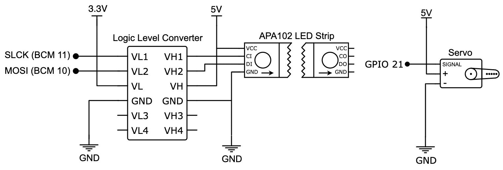
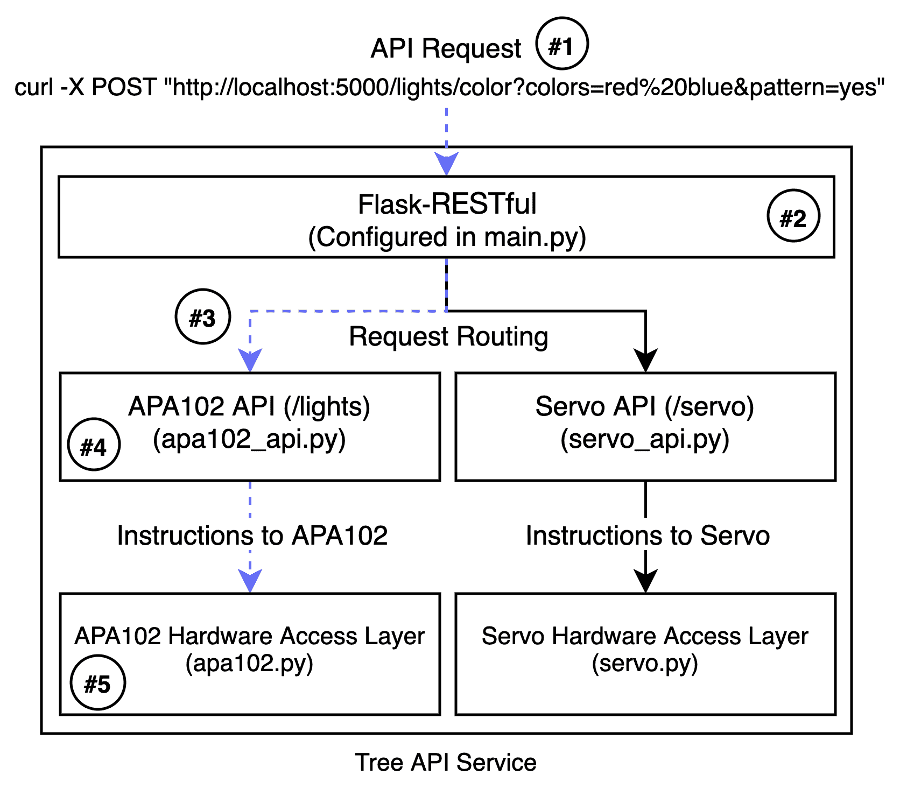
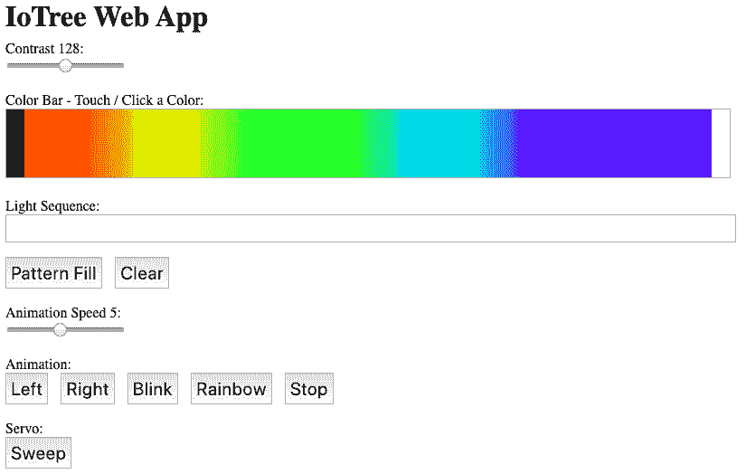
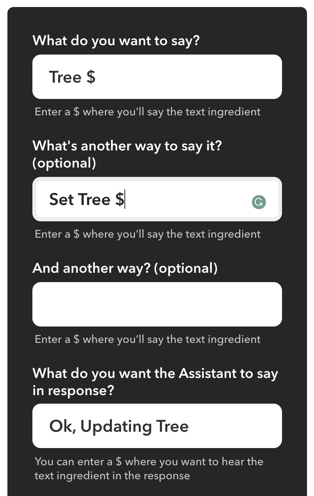
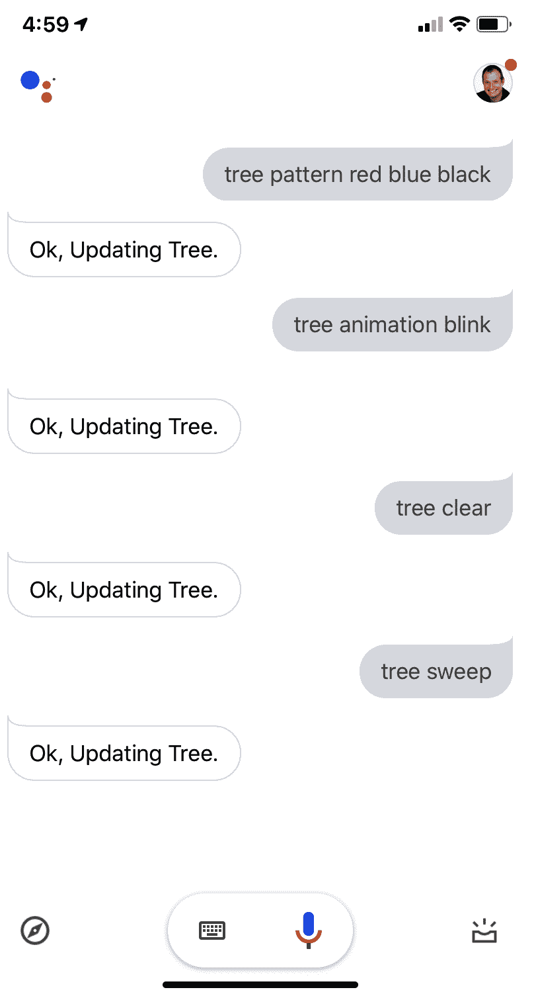

Tying It All Together - An IoT Christmas Tree

欢迎来到我们的最后一章！我们将通过汇集前面章节中的各种主题和想法来构建一个多方面的物联网计划，从而完善本书。具体来说，如果你不介意双关语的话，我们将建造一棵互联网控制的圣诞树，一棵*IoTree，*！

我们在本章中的方法是重复使用前几章中的两个电路来创建圣诞树照明（使用 APA102 LED 条）和摇动机制来使圣诞树摇晃（我们将使用伺服）和叮当声（如果你用铃铛装饰圣诞树，它会随着摇晃而叮当响！）。然后，我们将回顾并调整我们对 RESTful API 和 MQTT 的学习，以创建两种方法，通过网络或 internet 控制照明和伺服。然后，我们将重新访问 dweet.io 和**如果是，那么****IFTTT****并使用谷歌助手构建 IFTTT 小程序，通过电子邮件和您的语音控制树！**

 **以下是我们将在本章中介绍的内容：

*   物联网圣诞树概述
*   构建 IoTree 电路
*   配置、运行和使用树 API 服务
*   配置、运行和使用树 MQTT 服务
*   将 IoTree 与 dweet.io 集成
*   通过 IFTTT 与电子邮件和 Google Assistant 集成
*   扩展 IoTree 的想法和建议

# 技术要求

要执行本章中的练习，您需要以下内容：

*   树莓皮 4 B 型
*   Raspbian OS Buster（带桌面和推荐软件）
*   最低 Python 版本 3.5

这些需求是本书中代码示例的基础。只要您的 Python 版本是 3.5 或更高版本，就可以合理地期望代码示例在 Raspberry Pi 3 Model B 或不同版本的 Raspbian OS 上无需修改即可工作。

要完成标题为*与谷歌助手*集成的部分，您至少需要具备以下先决条件：

*   谷歌账户（如果你有一个 Gmail 电子邮件账户，这就是你所需要的）
*   Android 手机或 iOS 版的*谷歌助手*应用程序

您可以在 GitHub 存储库中的`chapter14`文件夹中找到本章的源代码：[https://github.com/PacktPublishing/Practical-Python-Programming-for-IoT](https://github.com/PacktPublishing/Practical-Python-Programming-for-IoT) 。

您需要在终端中执行以下命令，以设置虚拟环境并安装本章代码所需的 Python 库：

```py
$ cd chapter14              # Change into this chapter's folder
$ python3 -m venv venv      # Create Python Virtual Environment
$ source venv/bin/activate  # Activate Python Virtual Environment
(venv) $ pip install pip --upgrade        # Upgrade pip
(venv) $ pip install -r requirements.txt  # Install dependent packages
```

以下依赖项是从`requirements.txt`安装的：

*   **PiGPIO**：PiGPIO GPIO 库（[https://pypi.org/project/pigpio](https://pypi.org/project/pigpio)
*   **Flask RESTful**：用于创建 RESTful API 服务的 Flask 扩展（[https://pypi.org/project/Flask-RESTful](https://pypi.org/project/Flask-RESTful)
*   **泛美卫生组织 MQTT****客户**[https://pypi.org/project/paho-mqtt](https://pypi.org/project/paho-mqtt)
*   **枕头**：**Python 影像库**（**PIL**）（[https://pypi.org/project/Pillow](https://pypi.org/project/Pillow)
*   **Luma LED 矩阵库**：[https://pypi.org/project/luma.led_matrix](https://pypi.org/project/luma.led_matrix)

*   **请求**：用于进行 HTTP 请求的高级 Python 库（[https://pypi.org/project/requests](https://pypi.org/project/requests)
*   **PyPubSub**：进程内消息和事件（[https://pypi.org/project/PyPubSub](https://pypi.org/project/PyPubSub)

本章练习所需的电子元件如下：

*   1 x MG90S hobby 伺服（或等效的 3 线 5 伏 hobby 伺服）
*   1 个 APA102 RGB LED 带
*   1 个逻辑电平移位器模块
*   外部电源（至少为 3.3 V/5 V 可安装在试验板上的电源）

A video showing this tree in action is available at [https://youtu.be/15Xfuf_99Io](https://youtu.be/15Xfuf_99Io) . Please note that this tree uses RGB LEDs and an alternating blinking animation for the lights. We'll be using an APA102 LED strip in this chapter that is capable of creating more animation effects. The demo tree can also play a tune, which we will not cover in this chapter (although you'll easily be able to add that feature if you wish by adopting the RTTTL example from [Chapter 8](11.html) , *Lights, Indicators, and Displaying Information* ).

# 物联网圣诞树概述

在我们开始构建电路和查看代码之前，让我们花一点时间了解我们的 IoTree 将做什么以及我们将如何构建它。*图 14.1*中的树代表了您在完成本章后可以创建的内容：


Figure 14.1 – IoTree example

现在，我需要提前告诉你，我们只讨论 IoTree 的电子和编程。你需要运用你的主动性，将你的创客技能带到桌面上，以建造这棵树并使之充满活力。我建议使用一个小的桌面圣诞树，因为我们构建的一部分需要一个伺服来*摇动*圣诞树。我们的爱好级伺服功能强大，足以摇动一棵小树；然而，它不太可能撼动一棵全尺寸的圣诞树（如果你想把我们的圣诞树升级到一棵更大的圣诞树，你需要研究并得到一个更强大的伺服系统——如果你想的话，请给我发张照片！）。

我们的基准树将包括以下电子元件：

*   用于树灯的 APA102 LED 灯条（我们在[第 8 章](11.html)、*灯、指示灯和显示信息*中介绍了 APA102 LED 灯条）。
*   一个使树*震动*和*叮当声*的伺服装置。为此，你需要在树上安装一些铃铛饰物，当树震动时，铃铛会*叮当声*（我们在[第 10 章](13.html)中介绍了伺服装置，*使用伺服装置、电机和步进装置*进行运动）。

在编程和结构上，我们的树程序将利用我们所了解的以下概念：

*   **dweet.io 服务**：首先在[第 2 章](03.html)、*Python 和物联网入门*中介绍，然后在[第 13 章](16.html)、*物联网可视化和自动化平台*中再次介绍
*   **RESTful API 与 Flask RESTful**：来自[第 3 章](04.html)*使用 Flask*与 RESTful API 和 Web 套接字联网
*   **消息队列遥测传输（MQTT）**：包括在[第 4 章](05.html)中，*与 MQTT、Python 和 Mosquitto MQTT 代理*的联网。
*   **物联网程序的线程和发布者订阅者（PubSub）方法**：在[第 12 章](15.html)中介绍*高级物联网编程概念–线程、异步 IO 和事件循环*
*   **IFTTT 物联网平台**：包含在[第 13 章](16.html)、*物联网可视化及自动化平台*中

当我们继续阅读本章时，我们将假设您已经理解了上述各章中的概念，并且已经完成了各章中介绍的练习，包括构建电路以及理解使电路工作的电路和代码级概念。

我们的第一项任务将是构建 IoTree 所需的电路，我们将在下一步进行。

# 构建 IoTree 电路

是时候开始建设了！请构造*图 14.2*所示的电路：



Figure 14.2 – IoTree circuit schematic diagram

这条赛道看起来很熟悉。这是我们以前见过的两个电路的组合：

*   [第 8 章](11.html)中*图 8.4*中的 APA102（带逻辑电平移位器）电路*灯、指示灯和显示信息*
*   来自[第 10 章](13.html)中*图 10.2*的伺服电路*与伺服、电机和步进电机*一起移动

如果您需要在试验板上构建此电路的分步说明，请参阅相应章节。

Please remember that you will need to use an external power supply to power your APA102 and servo, as they will draw too much current to use the 5-volt pin on your Raspberry Pi.

完成电路构建后，接下来让我们简要讨论可用于控制此电路的三个程序。

## 三个 IoTree 服务项目

IoTree 中有三个单独的程序，每个程序采用稍微不同的方法来处理灯光和伺服。计划如下：

*   **树 API 服务**（在`chapter14/tree_api_service`文件夹中找到）：该程序提供一个使用 Flask RESTful 创建的 RESTful API，用于控制灯光和伺服。它还包括一个使用 API 的基本 HTML 和 JavaScript web 应用程序。我们将在标题为*配置、运行和使用树 API 服务*的章节中进一步讨论树 API 服务。
*   **树 MQTT 服务**（位于`chapter14/tree_mqtt_service`文件夹中）：此程序允许我们通过发布 MQTT 消息来控制灯光和伺服。我们将在标题为*配置、运行和使用树 MQTT 服务*的章节中进一步讨论树 MQTT 服务。
*   **dweet 集成服务**（位于`chapter14/dweet_integration_service`文件夹中）：此程序接收 dweet 并将其作为 MQTT 消息重新发布。我们可以将此程序与*树 MQTT 服务*程序一起使用 dweet.io 控制我们的灯光和伺服，从而为我们提供了一种将 IoTree 与 IFTTT 等服务集成的简单方法。我们将在标题为*将 IoTree 与 dweet.io*集成的章节中详细讨论 dweet 集成服务。

现在，我们已经简要讨论了构成本章示例的程序，让我们配置并运行我们的树 API 服务，并使用它使灯光和伺服工作。

# 配置、运行和使用树 API 服务

Tree API 服务程序提供 RESTful API 服务，用于控制 IoTree 的 APA102 LED 条带和伺服。您可以在`chapter14/tree_api_service`文件夹中找到树 API 服务程序。它包含以下文件：

*   `README.md`：完整的 API 文档以及树 API 服务程序的示例。
*   `main.py`：这是节目的主要切入点。
*   `config.py`：程序配置。
*   `apa102.py`：与 APA102 LED 条集成的 Python 类。这段代码的核心与我们在[第 8 章](11.html)中探讨的 APA102 Python 代码非常相似，*灯光、指示灯和显示信息***，**只是现在它被构造为 Python 类，使用线程来运行灯光动画，还有一些其他的小添加，例如使 LED 闪烁的代码。
*   `apa102_api.py`：提供 APA102 API 的 Flask RESTful 资源类。它借鉴了 Flask RESTful 代码和[第 3 章](04.html)中的示例，*使用 Flask*与 RESTful API 和 Web 套接字联网。
*   `servo.py`：用于控制伺服的 Python 类。它利用了我们在[第 10 章](13.html)中介绍的伺服代码，*使用伺服、电机和步进电机进行运动*。
*   `servo_api.py`：提供伺服 API 的 Flask RESTful 资源类。
*   `templates`：此文件夹包含示例 web 应用的`index.html`文件。
*   `static`：此文件夹包含静态 JavaScript 库和 web 应用程序使用的图像。

树 API 服务程序架构图如*图 14.3*所示：



Figure 14.3 – Tree API service architecture block diagram

下面是树 API 服务对 API 请求的高级操作，如上图中虚线所示：

1.  外部客户端向位于#1 的`/lights/colors`端点发出 POST 请求。
2.  请求由位于#2 的 Flask 框架/服务器处理。（烧瓶和烧瓶 RESTful 设置可在`main.py`中找到。）
3.  `/lights/*`端点被路由到位于#3 的相应 Flask RESTful 资源（APA102–即*灯*–资源在 `apa102_api.py` 中定义）。端点设置和 Flask RESTful 的资源注册可在`main.py`中找到。
4.  在#4，调用适当的资源（在本例中，它将是`ColorControl.post()`），然后解析并验证查询字符串参数（即`colors=red%20blue&pattern=yes`。
5.  最后，在#5，`ColorControl.post()`然后调用 APA102 实例中的适当方法（在`apa102.py`中定义，在`main.py`中设置），该实例直接与物理 APA102 LED 条接口，并使用红色和蓝色的重复图案更新物理 APA102 LED 条。

现在我们已经了解了树 API 服务的工作原理，在运行树 API 服务之前，首先需要检查它的配置。我们下一步会这样做。

## 配置树 API 服务

树 API 服务配置在`chapter14/tree_api_service/config.py`文件中找到。本文件中有许多配置选项，它们主要与 APA102（在[第 8 章](11.html)中讨论，*灯、指示灯和显示信息*中讨论）和伺服（在[第 10 章，](13.html)中讨论）的配置有关使用伺服、电机和步进电机移动。您会发现这个文件和配置选项都有很好的注释。

默认配置足以在 Raspberry Pi 上本地运行示例；但是，您需要检查的一个配置参数是`APA102_NUM_LEDS = 60`。如果您的 APA102 LED 条包含不同数量的 LED，请适当更新此配置。

让我们运行 TreeAPI 服务程序，创建一些光（和运动）！

## 运行树 API 服务

现在是运行 TreeAPI 服务程序并向其发送 RESTful API 请求的时候了。以下是运行和测试我们的树 API 服务的步骤：

1.  切换到`chapter14/tree_api_service`文件夹，启动`main.py`脚本，如图所示：

```py
# Terminal 1
(venv) $ cd tree_api_service
(venv) $ python main.py
* Serving Flask app "main" (lazy loading)
... truncated ...
INFO:werkzeug: * Running on http://0.0.0.0:5000/ (Press CTRL+C to quit)
```

2.  接下来，打开第二个终端，运行以下`curl`命令，将重复光模式序列设置为`red, blue, black`：

```py
# Terminal 2
$ curl -X POST "http://localhost:5000/lights/color?colors=red,blue,black&pattern=yes"
```

3.  同样在*终端 2*中，运行下一个命令开始使灯光动画化：

```py
# Terminal 2
$ curl -X POST "http://localhost:5000/lights/animation?mode=left&speed=5"
```

`mode`参数可使用的其他动画模式除`left`外，还包括`right`、`blink`、`rainbow`和`stop`。`speed`参数取值范围在`1`和`10`之间。

4.  要清除或重置 LED 条，再次在*端子 2*中运行以下命令：

```py
# Terminal 2
$ curl -X POST "http://localhost:5000/lights/clear"
```

5.  要进行伺服扫描（即使树*抖动），*在*端子 2*中运行以下命令：

```py
# Terminal 2
$ curl -X POST "http://localhost:5000/servo/sweep"
```

伺服系统应来回扫描多次。如果您想使伺服扫描次数增加或需要增加其移动范围，则可以调整`chapter14/tree_api_service/config.py`文件中的`SERVO_SWEEP_COUNT`和`SERVO_SWEEP_DEGREES`配置参数。

If you find your LEDs dimming, flickering, or otherwise behaving erratically when you make the servo move, or your servo twitches as you change the APA102 LEDs, chances are that your external power supply cannot deliver enough current to run both the LEDs and servo simultaneously. As in interim measure, if you don't have another power supply, try reducing the number of LEDs (`APA102_NUM_LEDS` in `config.py`) and/or reducing the LED contrast (`APA102_DEFAULT_CONTRAST`, also in `config.py`). This will lower the current requirements of the LED strip.

6.  最后，让我们运行 web 应用程序，通过在 Raspberry Pi 桌面上打开 web 浏览器并导航到 URL`http://localhost:5000`，从 web 浏览器控制 IoTree。您应该会看到一个类似于图中所示的网页：



Figure 14.4 – Example IoTree web app

尝试以下操作：

*   单击颜色栏中的颜色，观察该颜色被推送到 APA102 LED 条上。
*   单击“填充图案”按钮，用所选颜色填充 APA102 LED 条。
*   单击左键开始动画。

这个 web 应用程序背后的 JavaScript（在`chapter14/tree_api_service/templates/index.html`中找到）只是简单地调用我们的 IoTree API，类似于我们已经使用`curl`所做的，只是它使用 jQuery。jQuery 和 JavaScript 超出了本书的范围；但是，在[第 3 章](04.html)*中，使用 Flask 与 RESTful API 和 Web 套接字进行网络连接时简要介绍了它们。*

You will find the full set of API documentation for the IoTree with `curl` examples in the `chapter14/tree_api_service/README.md` file .

我们的 RESTful API 实现提供了本章所需的基本 API 端点；但是，我非常有信心，您将能够为自己的项目扩展和调整此示例，或者为 IoTree 添加新功能。我将在题为*扩展 IoTree*的想法和建议一节的最后一章，根据您在本书中学到的知识，为您如何扩展 IoTree 提供建议。

现在，我们已经运行并了解了如何使用 RESTful API 控制 IoTree 的灯光和伺服，接下来我们将了解一种替代服务实现，它将允许我们使用 MQTT 控制 IoTree。

# 配置、运行和使用树 MQTT 服务

Tree MQTT 服务程序提供了一个 MQTT 接口，用于通过将 MQTT 消息发布到 MQTT 主题来控制 Tree 的 APA102 LED 条带和伺服。您可以在`chapter14/tree_mqtt_service`文件夹中找到树 MQTT 服务程序，它包含以下文件：

*   `README.md`：用于控制 IoTree 的 MQTT 主题和消息格式的完整列表。
*   `main.py`：这是节目的主要切入点。
*   `config.py`：程序配置。
*   `apa102.py`：这是`chapter14/tree_api_service/apa102.py`的精确副本。文件
*   `servo.py`：这是`chapter14/tree_api_service/servo.py`文件的精确副本。
*   `mqtt_listener_client.py`：这是一个连接到 MQTT 代理并订阅主题的类，该主题将接收消息以控制 APA102 和伺服。当接收到 MQTT 消息时，它们将转换为 PubSub 消息并使用`PyPubSub`库发布，我们在[第 12 章](15.html)中讨论了*高级物联网编程概念-线程、异步 IO 和事件循环*。
*   `apa102_controller.py`：此代码接收`mqtt_listener_client.py`发送的 PubSub 消息，并根据需要更新 APA102 LED 条。
*   `servo_controller.py`：该代码接收`mqtt_listener_client.py`发送的 PubSub 报文，控制伺服。

树型 MQTT 服务程序架构图如*图 14.5*所示：


Figure 14.5 – Tree MQTT service architecture block diagram

以下是用于 MQTT 发布的树 MQTT 服务的高级操作，如上图中的虚线所示：

1.  `red blue`信息发布在`tree/lights/pattern`主题的第 1 页。
2.  Paho MQTT 客户端在#2 处接收该消息。主题和消息通过`mqtt_listener_client.py`中的`on_message()`方法解析，并使用`config.py`中的`MQTT_TO_PUBSUB_TOPIC_MAPPINGS`映射字典映射到本地 PubSub-topic*模式*。
3.  映射的消息和解析的数据使用位于#3 的`PyPubSub`库进行调度。

4.  `apa102_controller.py`中的`PyPubSub`订阅在#4 接收*模式*主题及其有效负载数据
5.  `apa102_controller.py`在#5 处处理消息和数据，并在 APA102 实例（在`apa102.py`中定义）上调用适当的方法，该实例直接以红色和蓝色的重复模式接口和更新物理 APA102 LED 条。

如果您想知道，在`mqtt_listener_client.py`中使用`PyPubSub`并重新发送 MQTT 消息的决定是基于我个人偏好的设计决定，旨在将 MQTT 相关代码和硬件控制相关代码解耦，以使应用程序更易于阅读和维护。另一种同样有效的方法是在`mqtt_listener_client.py`中使用`apa102.py`和`servo.py`直接响应接收到的 MQTT 消息。

现在我们已经了解了 Tree MQTT 服务的工作原理，在运行 Tree MQTT 服务之前，首先需要检查其配置。我们下一步会这样做。

## 配置树 MQTT 服务

在`chapter14/tree_mqtt_service/config.py`文件中找到树 MQTT 服务配置。与 TreeAPI 服务类似，它们主要与 APA102 和伺服的配置有关。您还将发现该文件及其配置选项得到了很好的注释。

默认配置足以在 Raspberry Pi 上本地运行示例；但是，正如我们对树 API 服务配置所做的那样，请检查并根据需要更新`APA102_NUM_LEDS = 60`参数。

如果您在运行树 API 示例时还需要更改任何 `APA102_DEFAULT_CONTRAST` 、 `SERVO_SWEEP_COUNT` 或 `SERVO_SWEEP_DEGREES` 参数，请立即为 MQTT 示例更新这些值。

一旦您对配置进行了任何必要的更改，我们将继续运行树 MQTT 服务程序，并发布 MQTT 消息，以使 IoTree 正常工作。

## 运行树 MQTT 服务程序

现在是运行 Tree MQTT 服务程序并发布将控制 IoTree 的 MQTT 消息的时候了。以下是运行和测试我们的树 MQTT 服务的步骤：

1.  我们必须在 Raspberry Pi 上安装并运行 Mosquitto MQTT 代理服务，以及 Mosquitto MQTT 客户机工具。如果您需要检查安装，请参阅[第 4 章](05.html)*与 MQTT、Python 和 Mosquitto MQTT 代理的联网*。
2.  切换到`chapter14/tree_mqtt_service`文件夹，启动`main.py`脚本，如图所示：

```py
# Terminal 1
(venv) $ cd tree_mqtt_service
(venv) $ python main.py
INFO:root:Connecting to MQTT Broker localhost:1883
INFO:MQTTListener:Connected to MQTT Broker
```

3.  接下来，打开第二个终端并使用以下命令发送 MQTT 消息：

```py
# Terminal 2
$ mosquitto_pub -h "localhost" -t "tree/lights/pattern" -m "red blue black"
```

LED 条将以重复的颜色模式亮起–红色、蓝色、黑色（黑色表示 LED 关闭）。

Try experimenting with the `--retain` or `-r` retained message option to `mosquirro_pub` . If you publish a retained message, it gets re-delivered to your Tree MQTT services when it connects to the MQTT broker and subscribes to the `tree/#` topic. This provides a way for your IoTree to restore its last state in between restarts.

4.  现在，在*终端 2*中运行以下命令，使 LED 条动画化：

```py
# Terminal 2
$ mosquitto_pub -h "localhost" -t "tree/lights/animation" -m "left"
```

5.  要清除或重置 LED 条，再次在*端子 2*中运行以下命令：

```py
# Terminal 2
$ mosquitto_pub -h "localhost" -t "tree/lights/clear" -m ""
```

In this example (and also the next one in *step 6*), we don't have any message content; however, we still need to pass an empty message with the `-m ""` option (or, alternatively, `-n`); otherwise, `mosquitto_pub` will abort.

6.  最后，尝试以下操作以扫描伺服：

```py
# Terminal 2
$ mosquitto_pub -h "localhost" -t "tree/servo/sweep" -m ""
```

伺服将根据`chapter14/tree_mqtt_service/config.py`中 `SERVO_SWEEP_COUNT` 或 `SERVO_SWEEP_DEGREES` 的设定值来回扫描。

You will find the full set of MQTT topics and message formats that are recognized by the Tree MQTT service, complete with `mosquitto_pub` examples, in the `chapter14/tree_mqtt_service/README.md` file .

与我们的 RESTful API 示例类似，我们的 MQTT 示例提供了本章所需的最低功能，但确实提供了一个基本框架，您可以为自己的未来项目或扩展 IoTree 的功能进行扩展。

现在，我们已经运行并了解了如何使用 MQTT 控制 IoTree 的灯光和伺服，让我们来看一个集成服务，我们可以使用它将树 MQTT 服务与 dweet.io 耦合。

# 将 IoTree 与 dweet.io 集成

在`chatper14/dweet_integration_service`文件夹中找到的 d*weet 集成服务*是一个基于 Python 的集成服务，它接收 DWEET 并将其作为消息重新发布到 MQTT 主题。该服务为我们提供了一种简单的方法来将诸如 IFTTT 之类的服务与我们的树 MQTT 服务程序集成。

dweet 集成服务由以下文件组成：

*   `main.py`：主程序入口点。
*   `config.py`：配置参数。
*   `thing_name.txt`：保存您的物品名称的地方。此文件将在您首次启动程序时创建。
*   `dweet_listener.py`：核心程序代码。

我们的 dweet 服务的核心在`dweet_listener.py`文件中。如果您查看此文件，您会注意到它几乎与[第 2 章](03.html)、*Python 和物联网入门*以及*[第 13 章](16.html)、物联网可视化和自动化平台*中涵盖的`dweet_led.py`文件相同（除了现在包装为 Python 类之外）。

核心区别在于`process_dweet()`方法，如以下代码第（1）行所示，我们不是直接控制 LED，而是截取 dweet，然后将其重新发布到 MQTT 主题：

```py
def process_dweet(self, dweet):        # (1)

   # ...Truncated...
   # command is "<action> <data1> <data2> ... <dataN>"
   command = dweet['command'].strip()
   # ...Truncated...

   # elements (List) <action>,<data1>,<data2>,...,<dataN>
   elements = command.split(" ")
   action = elements[0].lower()
   data = " ".join(elements[1:])

   self.publish_mqtt(action, data)     # (2)
```

前面代码中第（2）行和下面代码中第（3）行显示的`publish_mqtt()`方法，然后根据`chapter14/dweet_mqtt_service/config.py`中的`ACTION_TOPIC_MAPPINGS`设置将解析的命令字符串转换为 MQTT 主题，并发布消息：

```py
    def publish_mqtt(self, action, data):                       # (3)
        if action in self.action_topic_mappings:
            # Map Action into MQTT Topic
            # (Eg mode --> tree/lights/mode). 
            # See config.py for mappings.

            topic = self.action_topic_mappings[action]
            retain = topic in self.mqtt_topic_retain_message    # (4)
            # ... truncated ...
            publish.single(topic, data, qos=0,                  # (5)
                          client_id=self.mqtt_client_id, 
                          retain=retain, hostname=self.mqtt_host, 
                          port=self.mqtt_port)
    # ... truncated ...

```

注意，在第（5）行，我们使用的是 Paho MQTT`publish.single()`便利方法，而不是我们在[第 4 章](05.html)中使用的成熟的 MQTT 客户机方法，*与 MQTT、Python 和 Mosquitto MQTT 代理*联网（这也在树 MQTT 服务程序中使用）。

现在，我只想指出第（4）行，在那里我们设置了`retain`变量（也请注意它在`publish.single()`中的用法）。在讨论服务配置文件时，我们将在下一节中详细讨论此消息保留。

树服务程序架构图如*图 14.6*所示：


Figure 14.6 – dweet integration service architecture b lock diagram

以下是针对上图中蓝色虚线所示请求的 dweet 集成服务的高级操作：

1.  在#1 处创建一个 dweet。
2.  `dweet_listener.py`在#2 接收 dweet 并解析`command`参数中包含的数据。使用在`config.py`中找到的`ACTION_TOPIC_MAPPINGS`映射字典，将包含在 COMMORD 中的操作映射到 MQTT 主题。
3.  将消息发布到 MQTT 代理，以映射到位于#3 的 MQTT 主题。根据`config.py`中找到的`TOPIC_RETAIN_MESSAGE`映射字典设置消息的*保留*标志。

发布 MQTT 消息后，如果树 MQTT 服务正在运行并连接到同一 MQTT 代理，它将接收 MQTT 消息并相应地更新 IoTree。

现在我们已经了解了 dweet 集成服务的工作原理，在运行 dweet 集成服务之前，首先需要检查其配置。我们下一步会这样做。

## 配置树 MQTT 服务

在`chapter14/dweet_integration_service/config.py`文件中可以找到 dweet 集成服务配置。有许多与服务工作方式相关的配置选项，默认设置足以在 Raspberry Pi 上本地运行此服务，您的 Mosquitto MQTT 代理也在运行。配置参数在该文件中有很好的注释；但是，我将提到`ACTION_TOPIC_MAPPINGS`和`TOPIC_RETAIN_MESSAGE`参数：

```py
ACTION_TOPIC_MAPPINGS = {
    "clear": "tree/lights/clear",
    "push": "tree/lights/push",
    ... truncated ...
}
```

dweet 集成服务将*dweeted 命令*映射到*MQTT 主题*。`ACTION_TOPIC_MAPPINGS`配置参数决定命令如何映射到 MQTT 主题。我们将在下一节讨论*命令*的这一概念。

The MQTT topics mapped and used by the dweet integration service must match those used by a Tree MQTT service. The default configurations for each service use the same topics.

下面代码中显示的`TOPIC_RETAIN_MESSAGE`配置决定了哪些 MQTT 主题将设置其消息的*保留*标志。正是这种配置（`True`或`False`用于设置`single.publish()`上的`retained`参数，正如我们在上一节中指出的：

```py
TOPIC_RETAIN_MESSAGE = {
        "tree/lights/clear"    :     False    ,
        "tree/lights/animation"    :     True    ,
    ... truncated ...
}
```

现在我们已经讨论了配置文件，让我们启动 dweet 集成服务，并向其发送将控制 IoTree 的 dweet。

## 运行 dweet 集成服务程序

我们的 dweet 集成服务通过接收预定义格式的 dweet 来工作，并根据我们在上一节中讨论的配置参数将它们转换为 MQTT 主题和消息。在运行和测试 dweet 集成服务时，我们将很快讨论这种 dweet 格式。以下是我们需要遵循的步骤：

1.  首先，确保上一节中的*树 MQTT 服务*程序在终端中运行。树 MQTT 服务将接收和处理 dweet 集成服务发布的 MQTT 消息。
2.  接下来，导航到新终端中的`chapter14/dweet_integration_service`文件夹并启动`main.py`程序，如图所示（记住您的物品名称将不同）：

```py
(venv) $ cd dweet_service
(venv) $ python main.py
INFO:DweetListener:Created new thing name ab5f2504
INFO:DweetListener:Dweet Listener initialized. Publish command dweets to 'https://dweet.io/dweet/for/ab5f2504?command=...'
```

3.  将以下 URL 复制并粘贴到 web 浏览器中以控制 IoTree。使用输出中显示的物品名称代替`<thing_name>`文本：

It may take a few moments between calling one of these URLs and it being received by your dweet integration service .

正如您将在前面 URL 中的`command`参数中看到的，我们的 dweets 的格式是`<action> <data1> <data2> <dataN>`。

You will find the full set of dweet command strings recognized by the default configuration in `config.py`, complete with example URLs, in the `chapter14/dweet_integration_service/README.md` file .

做得好！我们刚刚使用 dweet.io 和 MQTT 创建了一个简单的集成服务，并学习了一种简单的非侵入性方法，它允许我们通过 internet 控制我们的树，而不需要您进行任何网络或防火墙配置。

在设计物联网项目并考虑如何在互联网和网络上移动数据时，通常会发现您需要设计和构建某种形式的集成，以桥接基于不同传输机制的系统。本节中的示例演示了一个场景，其中我们将 MQTT 服务（我们的 IoTree MQTT 服务）与基于轮询的 RESTful API 服务（dweet.io）连接起来。虽然每个集成都有自己的需求，但希望本示例为您提供了一个粗略的路线图和方法，您可以在将来遇到这些场景时进行调整和构建。

现在我们已经运行了 dweet 集成服务，并且已经测试了它的工作情况，让我们看看如何将它与 IFTTT 平台一起使用。

# 通过 IFTTT 与电子邮件和 Google Assistant 集成

现在是真正有趣的部分-让我们通过互联网控制我们的树。作为一个搅局者，我不会在这次整合中牵手，因为在[第 13 章](16.html)、*物联网可视化和自动化平台中详细解释了一起使用 dweet.io 和 IFTTT 的核心概念。*特别是，我们学习了如何将树莓 Pi 与 IFTTT 和电子邮件集成，以控制 LED。

然而，我要做的是给你我的 IFTTT 配置的屏幕截图，这样你就可以验证你的设置了。另外，作为奖励，我还将给你一个提示和屏幕截图，告诉你如何与 Google Assistant 集成，以便你可以语音控制你的 IoTree！

At the time of writing, IFTTT has a Google Assistant service that can take arbitrary spoken text (in IFTTT lingo, an *ingredient).* I did check out Alexa integration but unfortunately, the Alexa IFTTT service could not take arbitrary input and so was not compatible with our example.

首先，我们将了解一些关于如何将 IoTree 与电子邮件集成的建议。

## 与电子邮件的集成

与电子邮件或 Twitter 的整合流程与我们在[第 13 章](16.html)*【物联网可视化与自动化平台*中所述的流程相同，但有以下变化：

1.  使用`TREE`而不是使用`LED`作为标签（IFTTT 中的**完成触发字段页面**步骤）。这样，您的电子邮件主题可以是`#TREE pattern red blue`或`#TREE animation blink`之类的内容。
2.  配置该 Webhook 服务时，需要使用之前运行 dweet 集成服务时打印在终端上的 dweet URL。我的配置示例如下图所示。记住 URL 中的*事物名称*将不同：


Figure 14.7 – Webhook configuration

3.  完成 IFTTT 小程序的设置后，请尝试通过电子邮件`trigger@applet.ifttt.com`发送以下主题：

在发送电子邮件或推特`#TREE pattern red blue black`命令几分钟后，您的树的灯光将以重复模式更改为这些颜色。类似地，在发送电子邮件或推特`#TREE animation left`几分钟后，您的树灯光将开始设置动画。

Remember, you will need to have both the Tree MQTT service and dweet integration service running in terminals for this example to work. It may also take a few moments after sending an email or posting a tweet before your IoTree changes.

一旦您能够通过电子邮件控制 IoTree，接下来我们将了解使用 Google Assistant 添加语音控制所需的步骤。

## 与谷歌助手的集成

让我们使用谷歌助手来控制 IoTree 语音。

*Google Assistant* comes in many other forms, including Google Home, Google Nest, and Google Mini. These products will also work with the IFTTT Google Assistant integration and your IoTree as long as they are signed in to the same Google Account you use with IFTTT.

要创建我们的集成，我们需要将您的 Google 帐户与 IFTTT Google Assistant 服务链接，并在接收命令时调用 dweet.io URL。以下是要遵循的高级步骤：

1.  登录到您的 IFTTT 帐户。
2.  创建一个新的小程序。
3.  对于小程序的这一部分，请使用 Google 助手服务。
4.  接下来，您将被要求连接并允许 IFTTT 使用您的 Google 帐户。按照屏幕上的说明连接 IFTTT 和您的 Google 帐户。

5.  现在是选择谷歌助手触发器的时候了。选择“说出包含文本成分的短语”。触发配置示例如*图 14.8*所示：



Figure 14.8 – Google Assistant trigger example

在前面的屏幕截图中显示的$sign-in-Tree$变成了我们将在 webhook 服务中使用的 IFTTT 成分（我们将在后面的步骤中看到）。

使用此触发器配置，您可以使用以下命令来控制 IoTree：

6.  是时候配置 IFTTT 小程序的该部分了。搜索并选择 WebHook。
7.  webhook 服务的配置与我们之前在*步骤 2*中的*与电子邮件*的集成标题下所述的流程相同，如*图 14.7 所示。*

8.  继续并完成 IFTTT 小程序的创建。
9.  向您的 Google 助手询问以下命令：

Remember, it may take a moment after Google Assistant acknowledges your request for your IoTree to start changing.

以下是我在 iPhone 上的谷歌助手对话框的屏幕截图：



Figure 14.9 – Google Assistant dialog to control the IoTree

如果集成工作正常，Google Assistant 将以“*确定，更新树*”（或您在*步骤 5*中使用的任何文本）进行响应，片刻后，您的 IoTree 将做出响应。

The important thing to remember is that we must speak commands exactly as they are interpreted by the dweet integration service – for example, as they would appear in the command parameter to a dweet URL, such as `https://dweet.io/dweet/for/<thing_name>?command=pattern red blue black`.

记住在它们前面加上单词“Tree”（或“Set Tree”）。此文本将触发 IFTTT 小程序。仅仅说一个命令不会触发小程序。

If you use an Android phone or the Google Assistant app for iOS, you will be able to see how your spoken words are turned into textual commands, which can help you troubleshoot commands that are not working or are misunderstood.

您刚刚学习了如何创建三个 IFTTT 集成，以使用电子邮件和语音控制 IoTree，并且您可以轻松地采用相同的基本思想和流程来控制和自动化我们在本书中看到的其他电子电路。

此外，我们在[C 第 13 章](16.html)、*物联网可视化和自动化平台*中讨论过，IFTTT 提供了许多*触发器*和*动作*，可以组合起来构建自动化工作流*小程序。*在本章和上一章之间，您现在已经创建了几个小程序，因此我相信您将能够探索 IFTTT 生态系统，并创建各种有趣的小程序，与您的 Raspberry Pi 一起工作。

在我们结束本章（以及本书！）之前，我想给您留下一些想法和实验，您可以通过这些想法和实验进一步扩展 IoTree 的功能。

# 扩展 IoTree 的想法和建议

本章所用的代码和电子学为我们提供了一个我们可以建立的基础。这可能是为了扩展 IoTree，或者作为其他 IoT 项目的基础。

以下是一些您可以尝试的建议：

*   添加并集成一个 PIR 传感器，每当有人经过你的 IoTree 时，它都会播放 RTTTL 曲调。毕竟，什么样的电子圣诞小玩意是完整的，除非它通过一遍又一遍地播放音乐让每个人发疯。。。
*   将 RGB LED 添加并集成到树的顶部（可能位于透明星形内），或使用 RGB LED 代替 APA102 LED 条，或与 APA102 LED 条一起使用。
*   构建多个物联网。如果您使用 MQTT，它们将同步！
*   尝试构建 WebSocket 集成和附带的 web 应用程序。
*   当前的 dweet-Google-Assistant 集成要求您准确地说出命令。您能否创建一个更为模糊的升级版本*——也就是说，它可以解析语音文本并计算出语音命令是什么？*
**   我们在 IFTTT 示例中使用了 dweet.io（与 MQTT 一起），因此我们不必担心防火墙配置。您可能希望调查在您的位置打开防火墙端口或调查本地隧道等服务（[https://localtunnel.github.io/www](https://localtunnel.github.io/www) 或 ngrok（[https://ngrok.com](https://ngrok.com) ）。这些方法将允许您使用 IFTTT webhooks 直接与 IoTree 的 RESTful API 通信。但是，请记住，我们的 RESTful API 示例是不安全的–它们没有使用 HTTPS，也没有诸如用户名和密码之类的身份验证机制来限制对 API 的访问，因此您可能还需要研究如何保护基于 Flask 的 API 并首先执行这些升级。*

 *显然，这些只是我的一些建议。在我们的旅程中，我们已经涵盖了许多赛道，所以请发挥你的想象力，看看你想出了什么——并且玩得开心！

# 总结

祝贺我们现在已经到了本章和本书的结尾！

在本章中，我们浏览了电子设备，并测试了控制这些电子设备的程序，这些电子设备构成了物联网圣诞树的基础。我们已经看到了一个 RESTful API，它可以控制 IoTree 的灯光和伺服，以及一个类似的 MQTT 实现。我们还研究了 dweet.io-to-MQTT 集成服务，该服务与 IFTTT 相结合，提供了一种使用电子邮件和谷歌助手控制 IoTree 的机制。

在本书的整个过程中，我们涵盖了许多概念和技术，包括各种网络技术、电子和接口基础知识，以及使用传感器和致动器与 Raspberry Pi 的一系列实际示例。我们还研究了自动化和可视化平台，并在本章中以一个将我们所学知识结合在一起的示例作为结束。

当我写这本书时，我脑子里有几个核心意图。我的意图之一是分享和解释*我们如何*将传感器和执行器连接到覆盆子 Pi 背后的原因，以及*为什么*与传感器和执行器一起使用额外的组件，如电阻器来创建分压器。我的第二个核心意图是为您提供适用于物联网项目的各种网络技术和选项。

我相信，软件和硬件基础知识，以及您在整个旅程中学习的实践示例，将为您提供许多技能和见解，不仅有助于您设计和构建自己的复杂物联网项目，而且从根本上理解现有物联网项目如何在软件上工作，网络和电子水平。

我真诚地希望你喜欢这本书，学到了很多东西，并在学习过程中学到了很多实用的技巧！在你的物联网之旅中，祝你一切顺利，我希望你能创造出一些令人惊叹的东西！

# 问题

最后，以下是一系列问题，供您测试您对本章内容的了解。您可以在*附录*的*评估*部分找到答案：

1.  为什么在我们的 MQTT 服务示例中，我们使用`PyPubSub`重新分派 MQTT 消息？

2.  在与 IFTTT Google Assistant 小程序集成或调试时，为什么在手机（或平板电脑）上使用 Google Assistant 应用程序在开发过程中很有用？
3.  您正在处理一个现有的天气监测项目，该项目使用 MQTT 作为其网络传输层来连接许多分布式设备。已要求您将应用程序与 IFTTT 服务集成。你是怎么做到的？
4.  您希望构建多个 IoTree，并让它们协同工作。您可以采取哪两种方法来实现这一结果？

5.  为什么我们在本章中使用免费的[dweet.io](http://dweet.io)服务？您会在商业物联网项目中使用这种方法吗？
6.  我们想从命令行测试 RESTful API 服务。我们可以使用什么命令行工具？
7.  当 IoTree 的 Raspberry PI 通电或重新启动时，您可以使用 MQTT 的哪些功能让 IoTree 自动初始化？
8.  除了*问题 7*之外，您需要对 Mosquitto MQTT 代理的设置和部署进行哪些考虑，以实现这一结果？***