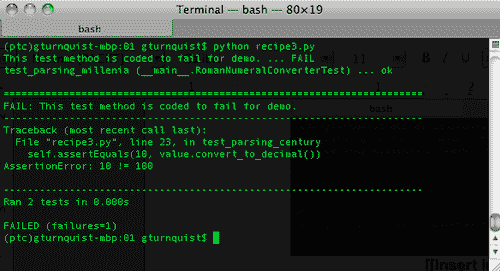
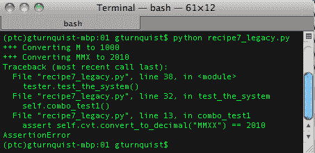
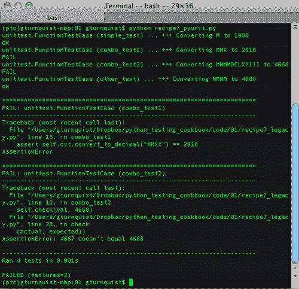
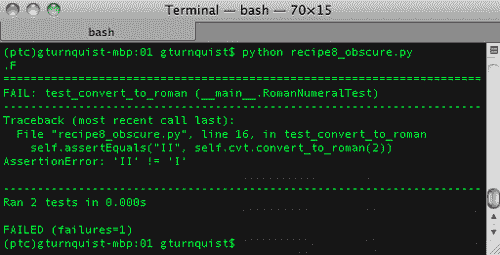
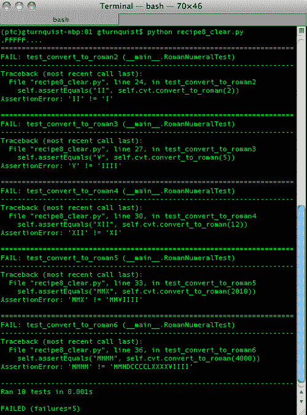
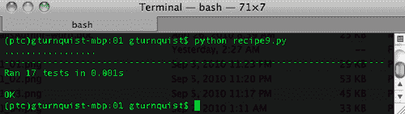

# 第一章：利用 Unittest 开发基础测试

在本章中，我们将介绍：

*   坚持基本原则
*   设置和拆卸测试线束
*   从命令行运行测试用例
*   运行测试用例方法的子集
*   将一组测试链接在一起
*   在测试用例中定义测试套件
*   重新配置旧测试代码以在 unittest 内部运行
*   将模糊的测试分解为简单的测试
*   测试边缘
*   用迭代法测试角点情况

# 导言

测试一直是软件开发的一部分。然而，当 Kent Beck 和 Erich Gamma 为 Java 开发引入 JUnit（[时，世界被引入了一个称为**自动测试**的新概念 http://junit.org](http://junit.org) ）。它基于 Kent 早期的 Smalltalk 和自动测试工作（[http://www.xprogramming.com/testfram.htm](http://www.xprogramming.com/testfram.htm) 。在这个时代，自动化测试已经成为软件行业中一个被广泛接受的概念。

Python 版本最初命名为**PyUnit**，创建于 1999 年，并于 2001 年晚些时候在 Python 2.1（[中添加到 Python 的标准库集中 http://docs.python.org/library/unittest.html](http://docs.python.org/library/unittest.html) ）。此后，Python 社区将其称为**unittest**，这是导入测试代码的库的名称。

UNITTEST 是 Python 世界中自动化测试的基础。在本章中，我们将探讨测试和断言代码功能的基础知识，构建测试套件，避免测试情况，最后测试边缘和角落情况。

对于本章中的所有配方，我们将使用`virtualenv`（[http://pypi.python.org/pypi/virtualenv](http://pypi.python.org/pypi/virtualenv) 创建受控 Python 运行时环境。Unittest 是标准库的一部分，不需要额外的安装步骤。但是，在后面的章节中，使用`virtualenv`将允许我们方便地安装其他测试工具，而不会弄乱默认的 Python 安装。

1.  To install `virtualenv`, either download it from the site mentioned previously, or if you have `easy_install`, just type: `easy_install` `virtualenv`.

    ### 注

    对于某些系统，您可能需要将其安装为 root 用户或使用 sudo

2.  安装`virtualenv`后，使用`--no-site-packages`创建一个名为`ptc`（Python 测试食谱的缩写）的干净环境。
3.  Activate the virtual Python environment. This can vary, depending on which shell you are using.

    

4.  Finally, verify that the environment is active by checking the path of `pip`.

    ### 提示

    有关`virtualenv`的用法和好处的更多信息，请阅读[http://iamzed.com/2009/05/07/a-primer-on-virtualenv](http://iamzed.com/2009/05/07/a-primer-on-virtualenv) 。

# 坚持基本原则

自动单元测试测试用例的基本概念是实例化部分代码，对其进行操作，并使用断言验证某些结果。

*   如果结果符合预期，unittest 将其视为测试成功
*   如果结果不匹配，将抛出异常，unittest 将其视为测试失败

## 准备好了吗

Unittest 被添加到 Python 的标准*电池**中，包括*库套件，不需要额外安装。

## 怎么做。。。

通过这些步骤，我们将编写一个简单的程序，然后使用 unittest 编写一些自动化测试：

1.  Create a new file called `recipe1.py` in which to put all of this recipe's code. Pick a class to test. This is known as the **class** **under** **test**. For this recipe, we'll pick a class that uses a simplistic Roman numeral converter:

    ```py
    class RomanNumeralConverter(object):
      def __init__(self, roman_numeral):
        self.roman_numeral = roman_numeral
        self.digit_map = {"M":1000, "D":500,  "C":100, "L":50, "X":10, "V":5, "I":1}

      def convert_to_decimal(self):
        val = 0
        for char in self.roman_numeral:
          val += self.digit_map[char]
        return val
    ```

    ### 注

    这个罗马数字转换器应用了简单的加法规则，但它没有特殊的减法模式，例如`XL`映射到`40`。目的不是要有最好的罗马数字转换器，而是要观察各种测试断言。

2.  编写一个新类，并给它以相同的名称，并在末尾附加`Test`，子类化`unittest.TestCase`。在测试类中附加`Test`是常见的约定，但不是要求。扩展`unittest.TestCase`是连接 unittest 标准测试运行程序所需的一项要求。

    ```py
    import unittest

    class RomanNumeralConverterTest(unittest.TestCase):
    ```

3.  创建几个名称以`test`开头的方法，这样它们会被 unittest 的测试编号自动拾取。

    ```py
      def test_parsing_millenia(self):
        value = RomanNumeralConverter("M")
        self.assertEquals(1000, value.convert_to_decimal())

      def test_parsing_century(self):
        value = RomanNumeralConverter("C")
        self.assertEquals(100, value.convert_to_decimal())

      def test_parsing_half_century(self):
        value = RomanNumeralConverter("L")
        self.assertEquals(50, value.convert_to_decimal())

      def test_parsing_decade(self):
        value = RomanNumeralConverter("X")
        self.assertEquals(10, value.convert_to_decimal())

      def test_parsing_half_decade(self):
        value = RomanNumeralConverter("V")
        self.assertEquals(5, value.convert_to_decimal())

      def test_parsing_one(self):
        value = RomanNumeralConverter("I")
        self.assertEquals(1, value.convert_to_decimal())

      def test_empty_roman_numeral(self):
        value = RomanNumeralConverter("")
        self.assertTrue(value.convert_to_decimal() == 0)
        self.assertFalse(value.convert_to_decimal() > 0)

      def test_no_roman_numeral(self):
        value = RomanNumeralConverter(None)
        self.assertRaises(TypeError, value.convert_to_decimal)
    ```

4.  使整个脚本可运行，然后使用 unittest 的测试运行程序。

    ```py
    if __name__ == "__main__":
      unittest.main()
    ```

5.  Run the file from the command line.

    

## 它是如何工作的。。。

在第一步中，我们选择了一个类进行测试。接下来，我们创建了一个单独的测试类。通过将测试类命名为`[class under test]Test`，很容易判断哪个类正在测试。每个测试方法名称必须以`test`开头，以便 unittest 自动拾取并运行它。要添加更多的测试，只需定义更多的`test`方法。每个测试都使用各种断言。

*   `assertEquals(first, second[, msg])`：比较第一个表达式和第二个表达式；如果它们没有相同的值，则会失败。如果出现故障，我们可以选择打印特殊消息。
*   `assertTrue(expression[, msg])`：测试表达式，如果为 false 则失败。如果出现故障，我们可以选择打印特殊消息。
*   `assertFalse(expression[, msg])`：测试表达式，如果为真则失败。如果出现故障，我们可以选择打印特殊消息。
*   `assertRaises(exception, callable, …)`：为后面列出的可调用项运行带有任何参数的可调用项，如果不引发异常则失败。

## 还有更多。。。

Unittest 为断言、失败和其他方便的选项提供了许多选项。以下各节显示了有关如何从这些选项中选择的一些建议。

### assertEquals 优于 assertTrue 和 assertFalse

当一个`assertEquals`失败时，第一个和第二个值会打印在错误报告中，从而更好地反馈出错的地方。`assertTrue`和`assertFalse`仅报告故障。并非所有可测试结果都符合此要求，但如果可能，请使用`assertEquals`。

理解平等的概念很重要。比较整数、字符串和其他标量时，非常简单。它不能很好地处理字典、列表和集合等集合。复杂的自定义对象可能包含自定义的相等定义。这些复杂对象可能需要更细粒度的断言。这就是为什么在使用自定义对象时，最好还包括一些直接针对相等和不相等的测试方法。

### self.fail（[msg]）通常可以用断言重写

Unittest 有一个`self.fail([msg])`操作，该操作无条件地导致测试失败，并带有一条可选消息。由于不建议使用，因此未在前面显示。

`fail`方法通常用于检测异常等特定情况。一个常见的习语如下：

```py
import unittest

class BadTest(unittest.TestCase):
  def test_no_roman_numeral(self):
    value = RomanNumeralConverter(None)
    try:
      value.convert_to_decimal()
      self.fail("Expected a TypeError")
    except TypeError, e:
      pass
```

这与前面的`test_no_roman_numeral`测试相同的行为。这种方法的问题是，当代码正常工作时，`fail`方法永远不会执行。不定期执行的代码有过时和无效的风险。这也会干扰报道。相反，最好使用前面示例中使用的`assertRaises`。对于其他情况，请查看使用其他断言重写测试。

### 我们的 Python 版本会影响我们的选择

Python 关于 unittest 的官方文档显示了许多其他断言，但是，它们取决于我们使用的 Python 版本。有些已经被弃用；其他版本仅在 Python2.7 等更高版本中可用。

如果我们的代码必须支持多个版本的 Python，那么我们必须使用最低公分母。此配方显示了自 Python 2.1 以来所有版本中可用的核心断言。

### 注

更新的 unittest2（[http://pypi.python.org/pypi/unittest2/](http://pypi.python.org/pypi/unittest2/) 正在开发中，它将这些较新的 unittest 特性中的几个向后移植到 Python 2.4+。然而，由于在撰写本书时 unittest2 正处于测试阶段，以及本书篇幅的限制，我决定将重点放在 unittest 上。

# 设置和拆卸测试线束

Unittest 提供了一种简单的机制，可以在测试代码时配置系统的状态。如果必要的话，它还允许我们在事后清理东西。当一个特定的测试用例在每个测试方法中都有重复的步骤时，通常需要这样做。

除非引用了将状态从一个测试方法传递到下一个测试方法的外部变量或资源，否则每个测试方法都从相同的状态开始。

## 怎么做。。。

通过以下步骤，我们将为每个测试方法设置和拆卸测试线束。

1.  创建一个名为`recipe2.py`的新文件，将此配方的所有代码放入其中。
2.  选择一个类进行测试。在本例中，我们将使用稍微修改的罗马数字转换器版本，其中函数而不是构造函数提供要转换的输入值。

    ```py
    class RomanNumeralConverter(object):
      def __init__(self):
        self.digit_map = {"M":1000, "D":500, "C":100, "L":50, "X":10, "V":5, "I":1}
      def convert_to_decimal(self, roman_numeral):
        val = 0
        for char in roman_numeral:
          val += self.digit_map[char]
        return val
    ```

3.  使用与被测类相同的名称创建一个测试类，并在末尾附加`Test`。

    ```py
    import unittest
    class RomanNumeralConverterTest(unittest.TestCase):
    ```

4.  创建一个`setUp`方法，用于创建被测试类的实例。

    ```py
      def setUp(self):
        print "Creating a new RomanNumeralConverter..."
        self.cvt = RomanNumeralConverter()
    ```

5.  创建一个销毁被测试类实例的`tearDown`方法。

    ```py
      def tearDown(self):
        print "Destroying the RomanNumeralConverter..."
        self.cvt = None
    ```

6.  使用`self.converter`创建所有测试方法。

    ```py
      def test_parsing_millenia(self):
        self.assertEquals(1000, \
                 self.cvt.convert_to_decimal("M"))
      def test_parsing_century(self):
        self.assertEquals(100, \
                 self.cvt.convert_to_decimal("C"))
      def test_parsing_half_century(self):
        self.assertEquals(50, \
                 self.cvt.convert_to_decimal("L"))
      def test_parsing_decade(self):
        self.assertEquals(10, \
                 self.cvt.convert_to_decimal("X"))
      def test_parsing_half_decade(self):
        self.assertEquals(5, self.cvt.convert_to_decimal("V"))
      def test_parsing_one(self):
        self.assertEquals(1, self.cvt.convert_to_decimal("I"))
      def test_empty_roman_numeral(self):
        self.assertTrue(self.cvt.convert_to_decimal("") == 0)
        self.assertFalse(self.cvt.convert_to_decimal("") > 0)
      def test_no_roman_numeral(self):
        self.assertRaises(TypeError, \
                 self.cvt.convert_to_decimal, None)
    ```

7.  使整个脚本可运行，然后使用 unittest 的测试运行程序。

    ```py
    if __name__ == "__main__":
      unittest.main()
    ```

8.  Run the file from the command line.

    

## 它是如何工作的。。。

在第一步中，我们选择了一个类进行测试。接下来，我们创建了一个单独的测试类。通过将测试类命名为`[class under test]Test`，很容易判断哪个类正在测试。

然后，我们定义了一个在每个`test`方法之前运行 unittest 的`setUp`方法。接下来，我们创建了一个`tearDown`方法，unittest 在每个`test`方法之后运行。在本例中，我们在每个测试方法中添加了一个 print 语句，以演示 unittest 为每个测试方法重新运行这两个方法。实际上，这可能会给我们的测试增加太多的噪音。

unittest 的一个缺陷是缺少`setUpClass/tearDownClass`和`setUpModule/tearDownModule`，这提供了在比测试方法级别更大范围内运行代码的机会。这已经添加到 unittest2 中，有些人将其描述为方便，但不在本书的范围内。

### 提示

**每个测试用例可以有一个设置和一个拆卸方法**

我们的`RomanNumeralConverter`非常简单，可以轻松地放入单个测试类中。但是测试类只允许一个`setUp`方法和一个`tearDown`方法。如果不同的测试场景需要不同的`setUp`/`tearDown`方法组合，那么这就是编写更多测试类的提示。

仅仅因为我们写了一个`setUp`方法并不意味着我们需要一个`tearDown`方法。在我们的例子中，我们可以跳过销毁`RomanNumeralConverter`，因为每个测试方法都会有一个新实例替换它。这真的只是为了演示。那些需要`tearDown`方法的案例还有什么其他用途？使用需要某种`close`操作的库是编写`tearDown`方法的主要候选方法。

# 从命令行运行测试用例，增加了详细性

很容易调整测试运行程序，以便在运行时打印出每个测试方法。

## 怎么做。。。

在以下步骤中，我们将使用更详细的输出运行测试用例，从而更好地了解事物的运行方式：

1.  创建一个名为`recipe3.py`的新文件，用于存储此配方的代码。
2.  选择一个类进行测试。在这种情况下，我们将使用罗马数字转换器：

    ```py
    class RomanNumeralConverter(object):
      def __init__(self, roman_numeral):
        self.roman_numeral = roman_numeral
        self.digit_map = {"M":1000, "D":500, "C":100, "L":50, "X":10, "V":5, "I":1}

      def convert_to_decimal(self):
        val = 0
        for char in self.roman_numeral:
          val += self.digit_map[char]
        return val
    ```

3.  使用与被测类相同的名称创建一个测试类，并在末尾附加`Test`。

    ```py
    import unittest
    class RomanNumeralConverterTest(unittest.TestCase):
    ```

4.  创建几种测试方法。对于这个配方，测试被故意编码为失败。

    ```py
      def test_parsing_millenia(self):
        value = RomanNumeralConverter("M")
        self.assertEquals(1000, value.convert_to_decimal())

      def test_parsing_century(self):
        "This test method is coded to fail for demo."
        value = RomanNumeralConverter("C")
        self.assertEquals(10, value.convert_to_decimal())
    ```

5.  定义一个自动加载所有测试方法的测试套件，然后以更高的详细程度运行它们。

    ```py
    if __name__ == "__main__":
      suite = unittest.TestLoader().loadTestsFromTestCase( \
                     RomanNumeralConverterTest)
      unittest.TextTestRunner(verbosity=2).run(suite)
    ```

6.  Run the file from the command line. Notice how the test method that fails prints out its Python docstring:

    

## 它是如何工作的。。。

自动化测试的一个关键部分是组织测试。基本单元称为**测试用例**。这些可以组合成**测试套件**。Python 的`unittest`模块提供`TestLoader().loadTestsFromTestCase`自动将所有`test*`方法提取到测试套件中。然后，该测试套件通过 unittest 的`TextTestRunner`进行运行，并增加了详细程度。

### 注

`TextTestRunner`是 unittest 唯一的测试跑步者。在本书的后面，我们将介绍其他具有不同运行程序的测试工具，包括插入不同 unittest 运行程序的测试工具。

前面的屏幕截图显示了每个方法及其模块和类名，以及成功/失败。

## 还有更多。。。

这个方法不仅演示了如何提高运行测试的冗长性，还展示了当测试用例失败时会发生什么。将嵌入在`test`方法中的**文档**字符串重命名为`test`方法，并在所有测试方法报告后打印详细信息。

# 运行测试用例方法的子集

有时，在给定的测试用例中只运行测试方法的子集是很方便的。这个配方将展示如何运行整个测试用例，或者从命令行中选择一个子集。

## 怎么做。。。

以下步骤显示如何编写命令行脚本以运行测试子集：

1.  创建一个名为`recipe4.py`的新文件，将此配方的所有代码放入其中。
2.  选择一个类进行测试。在这种情况下，我们将使用我们的`Roman``numeral``converter`。

    ```py
    class RomanNumeralConverter(object):
      def __init__(self, roman_numeral):
        self.roman_numeral = roman_numeral
        self.digit_map = {"M":1000, "D":500, "C":100, "L":50, "X":10, "V":5, "I":1}

      def convert_to_decimal(self):
        val = 0
        for char in self.roman_numeral:
          val += self.digit_map[char]
        return val
    ```

3.  使用与被测类相同的名称创建一个测试类，并在末尾附加`Test`。

    ```py
    import unittest
    class RomanNumeralConverterTest(unittest.TestCase):
    ```

4.  创建几种测试方法。

    ```py
      def test_parsing_millenia(self):
        value = RomanNumeralConverter("M")
        self.assertEquals(1000, value.convert_to_decimal())

      def test_parsing_century(self):
        value = RomanNumeralConverter("C")
        self.assertEquals(100, value.convert_to_decimal())
    ```

5.  编写一个主运行程序，运行整个测试用例或接受不同数量的测试方法。

    ```py
    if __name__ == "__main__":
      import sys
      suite = unittest.TestSuite()
      if len(sys.argv) == 1:
        suite = unittest.TestLoader().loadTestsFromTestCase(\
                      RomanNumeralConverterTest)
      else:
        for test_name in sys.argv[1:]:
          suite.addTest(\
            RomanNumeralConverterTest(test_name))

      unittest.TextTestRunner(verbosity=2).run(suite)
    ```

6.  Run the recipe with no extra command-line arguments, and see it run all the tests. Also run it with a test method name, and see it run only the specified test method.

    

## 它是如何工作的。。。

对于这个测试用例，我们编写了两种测试方法。但是我们没有简单地运行所有的测试，或者定义一个固定的列表，而是使用 Python 的`sys`库来解析命令行参数。如果没有额外的参数，它将运行整个测试用例。如果有额外的参数，则假定它们是测试方法名称。它使用 unittest 的内置功能在实例化`RomanNumeralConverterTest`时指定测试方法名称。

### 提示

**Python 2.7 内置了此功能；Python2.6 和早期版本没有**

Python2.6 没有这个特性，这使得这个方法很有用。如果我们使用的是 Python2.7，那么我们可以使用一个命令行版本。如果我们需要支持多个版本的 Python，这个方法非常方便。

# 将一系列测试链接在一起

Unittest 使将测试用例链接到一个测试套件中变得很容易。TestSuite 可以像 TestCase 一样运行，但它还提供了额外的功能，可以添加单个测试、多个测试，并对它们进行计数。

我们为什么需要这个？将测试链接到一个套件中，使我们能够为测试运行汇集多个测试用例模块，以及挑选和选择测试用例子集。到目前为止，我们通常从一个类运行所有的测试方法。TestSuite 为我们提供了另一种定义测试块的方法。

## 怎么做。。。

在以下步骤中，我们将编写多个测试用例类，然后将它们的测试方法加载到套件中，以便运行它们。

1.  创建一个名为`recipe5.py`的新文件，在其中放置我们的示例应用程序和测试用例。
2.  选择一个类进行测试。在这种情况下，我们将使用罗马数字转换器。

    ```py
    class RomanNumeralConverter(object):
      def __init__(self):
        self.digit_map = {"M":1000, "D":500, "C":100, "L":50, "X":10, "V":5, "I":1}

      def convert_to_decimal(self, roman_numeral):
        val = 0
        for char in roman_numeral:
          val += self.digit_map[char]
        return val
    ```

3.  创建两个测试类，在它们之间传播各种测试方法。

    ```py
    import unittest

    class RomanNumeralConverterTest(unittest.TestCase):
      def setUp(self):
        self.cvt = RomanNumeralConverter()

      def test_parsing_millenia(self):
        self.assertEquals(1000, \
                 self.cvt.convert_to_decimal("M"))

      def test_parsing_century(self):
        self.assertEquals(100, \
                 self.cvt.convert_to_decimal("C"))

    class RomanNumeralComboTest(unittest.TestCase):
      def setUp(self):
        self.cvt = RomanNumeralConverter()

      def test_multi_millenia(self):
        self.assertEquals(4000, \
                 self.cvt.convert_to_decimal("MMMM"))

      def test_multi_add_up(self):
        self.assertEquals(2010, \
                 self.cvt.convert_to_decimal("MMX"))
    ```

4.  在一个名为`recipe5_runner.py`的单独文件中创建一个测试运行程序，该文件将拉入两个测试用例。

    ```py
    if __name__ == "__main__":
      import unittest
      from recipe5 import *

      suite1 = unittest.TestLoader().loadTestsFromTestCase( \
                     RomanNumeralConverterTest)
      suite2 = unittest.TestLoader().loadTestsFromTestCase( \
                     RomanNumeralComboTest)
      suite = unittest.TestSuite([suite1, suite2])
      unittest.TextTestRunner(verbosity=2).run(suite)
    ```

5.  Execute the test runner, and observe how tests are pulled in from both test cases.

    

## 它是如何工作的。。。

`unittest`模块提供了一种便捷的方式，可以找到`TestClass`中的所有测试方法，并使用其`loadTestsFromTestCase`模块将它们捆绑成一个套件。为了进一步使用测试套件，我们可以使用`unittest.TestSuite([list...])`将这两个套件组合为一个套件。`TestSuite`类被设计成一个`TestCase`类，尽管它没有子类`TestClass`，允许我们使用`TextTestRunner`运行它。这个配方显示了出现的冗长，使我们能够确切地看到运行了哪些测试方法，以及它们来自哪个测试用例。

## 还有更多。。。

在这个配方中，我们从定义测试用例的不同文件运行测试。这与之前的配方不同，在之前的配方中，可运行代码和测试用例包含在同一个文件中。因为运行程序定义了我们运行的测试，所以我们可以轻松创建更多的运行程序来组合不同的测试套件。

### 测试用例的名称应该是有意义的

在前面的配方中，建议将测试用例命名为`[class under test]Test`。这是为了让读者明白，被测试的类和相关的测试共享一个重要的关系。现在我们正在引入另一个测试用例，我们需要选择一个不同的名称。名称应该清楚地解释为什么这些特定的测试方法被划分为一个单独的类。对于这个配方，这些方法被拆分，以显示更复杂的罗马数字组合。

# 在测试模块内部定义测试套件

每个测试模块都可以提供一个或多个方法来定义不同的测试套件。一种方法可以执行给定模块中的所有测试；另一种方法可以定义特定的子集。

## 怎么做。。。

通过以下步骤，我们将创建一些使用不同方法定义测试套件的方法：

1.  创建一个名为`recipe6.py`的新文件，将我们的配方代码放入其中。
2.  选择一个类进行测试。在这种情况下，我们将使用罗马数字转换器。

    ```py
    class RomanNumeralConverter(object):
      def __init__(self):
        self.digit_map = {"M":1000, "D":500, "C":100, "L":50, "X":10, "V":5, "I":1}

      def convert_to_decimal(self, roman_numeral):
        val = 0
        for char in roman_numeral:
          val += self.digit_map[char]
        return val
    ```

3.  使用与被测类相同的名称创建一个测试类，并在末尾附加`Test`。

    ```py
    import unittest

    class RomanNumeralConverterTest(unittest.TestCase):
    ```

4.  编写一系列测试方法，包括为每个测试方法创建一个新的`RomanNumeralConverter`实例的`setUp`方法。

    ```py
    import unittest

    class RomanNumeralConverterTest(unittest.TestCase):
      def setUp(self):
        self.cvt = RomanNumeralConverter()

      def test_parsing_millenia(self):
        self.assertEquals(1000, \
                 self.cvt.convert_to_decimal("M"))

      def test_parsing_century(self):
        self.assertEquals(100, \
                 self.cvt.convert_to_decimal("C"))

      def test_parsing_half_century(self):
        self.assertEquals(50, \
                 self.cvt.convert_to_decimal("L"))

      def test_parsing_decade(self):
        self.assertEquals(10, \
                 self.cvt.convert_to_decimal("X"))

      def test_parsing_half_decade(self):
        self.assertEquals(5, self.cvt.convert_to_decimal("V"))

      def test_parsing_one(self):
        self.assertEquals(1, self.cvt.convert_to_decimal("I"))

      def test_empty_roman_numeral(self):
        self.assertTrue(self.cvt.convert_to_decimal("") == 0)
        self.assertFalse(self.cvt.convert_to_decimal("") > 0)

      def test_no_roman_numeral(self):
        self.assertRaises(TypeError, \
                 self.cvt.convert_to_decimal, None)

      def test_combo1(self):
        self.assertEquals(4000, \
                 self.cvt.convert_to_decimal("MMMM"))

      def test_combo2(self):
        self.assertEquals(2010, \
                 self.cvt.convert_to_decimal("MMX"))

      def test_combo3(self):
        self.assertEquals(4668, \
            self.cvt.convert_to_decimal("MMMMDCLXVIII"))
    ```

5.  在配方模块中创建一些定义不同测试套件的方法（但不在测试用例中）。

    ```py
    def high_and_low():
      suite = unittest.TestSuite()
      suite.addTest(\
        RomanNumeralConverterTest("test_parsing_millenia"))
      suite.addTest(\
        RomanNumeralConverterTest("test_parsing_one"))
      return suite

    def combos():
      return unittest.TestSuite(map(RomanNumeralConverterTest,\
           ["test_combo1", "test_combo2", "test_combo3"]))

    def all():
      return unittest.TestLoader().loadTestsFromTestCase(\
                    RomanNumeralConverterTest)
    ```

6.  创建一个运行程序，它将迭代这些测试套件，并通过 unittest 的`TextTestRunner`运行它们。

    ```py
    if __name__ == "__main__":
      for suite_func in [high_and_low, combos, all]:
        print "Running test suite '%s'" % suite_func.func_name
        suite = suite_func()
        unittest.TextTestRunner(verbosity=2).run(suite)
    ```

7.  Run the combination of test suites, and see the results.

    

## 它是如何工作的。。。

我们选择了一个类进行测试，并定义了大量的测试方法来检查问题。然后我们定义了几个模块级的方法，例如，`high_and_low`、`combos`和`all`来定义测试套件。其中两个包含固定的方法子集，`all`从类中动态加载`test*`方法。最后，我们模块的主要部分迭代生成套件的所有这些函数的列表，以便顺利创建和运行套件。

## 还有更多。。。

我们所有的测试套件都是从配方的主要运行者那里运行的。但对于一个真正的项目来说，情况可能并非如此。相反，我们的想法是定义不同的套件，并编写一个机制来选择要运行的套件。每个套件都有不同的用途，有必要让开发人员选择运行哪个套件。这可以通过使用 Python 的`optparse`模块对命令行脚本进行编码来完成，以定义命令行标志来选择其中一个套件。

### 测试套件方法必须在测试类之外

如果我们让这些套件定义方法成为`test`类的成员，我们就必须实例化`test`类。扩展了`unittest.TestCase`的类有一个专门的`init`方法，该方法不能很好地处理只为调用非测试方法而创建的实例。这就是为什么这些方法不属于`test`类的原因。虽然这些方法可以在其他模块中使用，但在包含测试代码的模块中定义它们是非常方便的，以使内容保持接近。

### 为什么有不同的套房？

如果我们通过运行所有测试来启动我们的项目呢？听起来是个好主意，对吗？但是，如果运行整个测试套件的时间增长到一个多小时呢？有一个特定的阈值，在该阈值之后，开发人员倾向于停止运行测试，*没有什么**比**和**不运行**测试**套件*更糟糕*。通过定义测试子集，很容易在白天运行备用套件，然后可能每天运行一次综合测试套件。*

*   `all`是综合套房吗
*   `high_and_low`是测试边缘的示例
*   `combos`是对数值进行的随机抽样，用于显示事物总体上正常工作

定义我们的测试套件是一个判断调用。每隔一段时间重新评估每个测试套件也是值得的。如果一个测试套件成本太高，无法运行，请考虑将一些更昂贵的测试移至另一个套件。

### optparse 正在逐步淘汰，并由 argparse 取代

虽然`optparse`是向 Python 脚本添加命令行标志的方便方法，但它不会永远可用。Python2.7 已经弃用了这个模块，并在`argparse`中继续这个开发。

# 重新配置旧测试代码以在 unittest 内部运行

有时，我们可能已经开发了演示代码来练习我们的系统。我们不必重写它来在 unittest 中运行它。相反，将它连接到测试框架并通过一些小的更改运行它是很容易的。

## 怎么做。。。

通过这些步骤，我们将深入了解在不使用 unittest 的情况下编写的测试代码，并将其重新调整用途，以便在 unittest 内部运行。

1.  创建一个名为`recipe7.py`的文件，将要测试的应用程序代码放入其中。
2.  选择一个类进行测试。在这种情况下，我们将使用罗马数字转换器。

    ```py
    class RomanNumeralConverter(object):
      def __init__(self):
        self.digit_map = {"M":1000, "D":500, "C":100, "L":50, "X":10, "V":5, "I":1}

      def convert_to_decimal(self, roman_numeral):
        val = 0
        for char in roman_numeral:
          val += self.digit_map[char]
        return val
    ```

3.  创建一个名为`recipe7_legacy.py`的新文件，以包含不使用`unittest`模块的测试代码。
4.  Create a set of legacy tests that are coded, based on Python's `assert` function, not with unittest, along with a runner.

    ```py
    from recipe7 import *

    class RomanNumeralTester(object):
      def __init__(self):
        self.cvt = RomanNumeralConverter()

      def simple_test(self):
        print "+++ Converting M to 1000"
        assert self.cvt.convert_to_decimal("M") == 1000

      def combo_test1(self):
        print "+++ Converting MMX to 2010"
        assert self.cvt.convert_to_decimal("MMXX") == 2010

      def combo_test2(self):
        print "+++ Converting MMMMDCLXVIII to 4668"
        val = self.cvt.convert_to_decimal("MMMMDCLXVII")
        self.check(val, 4668)

      def other_test(self):
        print "+++ Converting MMMM to 4000"
        val = self.cvt.convert_to_decimal("MMMM")
        self.check(val, 4000)

      def check(self, actual, expected):
        if (actual != expected):
          raise AssertionError("%s doesn't equal %s" % \
              (actual, expected))

      def test_the_system(self):
        self.simple_test()
        self.combo_test1()
        self.combo_test2()
        self.other_test()

    if __name__ == "__main__":
      tester = RomanNumeralTester()
      tester.test_the_system()
    ```

    ### 注

    这组遗留测试旨在表示遗留测试代码，我们的团队开发这些代码是为了在选择 unittest 之前进行测试。

5.  Run the legacy tests. What is wrong with this situation? Did all the test methods run? Have we caught all the bugs?

    

6.  创建一个名为`recipe7_pyunit.py`的新文件。
7.  创建一组 unittest 测试，将每个遗留测试方法包装在 unittest 的`FunctionTestCase`中。

    ```py
    from recipe7 import *
    from recipe7_legacy import *
    import unittest

    if __name__ == "__main__":
      tester = RomanNumeralTester()

      suite = unittest.TestSuite()
      for test in [tester.simple_test, tester.combo_test1, \
             tester.combo_test2, tester.other_test]:
        testcase = unittest.FunctionTestCase(test)
        suite.addTest(testcase)

      unittest.TextTestRunner(verbosity=2).run(suite)
    ```

8.  Run the unittest test. Did all the tests run this time? Which test failed? Where is the bug?

    

## 它是如何工作的。。。

Python 提供了一个方便的`assert`语句来测试条件。如果为 true，代码将继续。如果为 false，则会引发一个`AssertionError`。在第一个测试运行程序中，我们有几个测试使用混合的`assert`语句或提出`AssertionError`来检查结果。

unittest 提供了一个方便的类`unittest.FunctionTestCase`，它将绑定函数包装为 unittest 测试用例。如果抛出了一个`AssertionError`，则`FunctionTestCase`捕获它，将其标记为测试*失败*，并继续进行下一个测试用例。如果引发任何其他类型的异常，它将被标记为测试错误。在第二个测试运行程序中，我们使用`FunctionTestCase`包装这些遗留测试方法，并将它们链接到一个套件中，以便 unittest 运行。

从运行第二个测试运行可以看出，第三个测试方法中潜伏着一个 bug。我们没有意识到这一点，因为测试套件被过早地中断了。

Python 的`assert`语句的另一个缺陷是第一次失败，如前一个屏幕截图所示。当断言失败时，几乎没有关于比较值的信息。我们所拥有的只是一行失败的代码。该屏幕截图中的第二个断言更有用，因为我们编写了一个自定义检查器，它抛出了一个自定义的`AssertionError`。

## 还有更多。。。

Unittest 不仅仅是运行测试。它有一个内置的机制来捕获错误和失败，然后继续尽可能多地运行我们的测试套件。这很有帮助，因为我们可以在给定的测试运行中消除更多错误并修复更多问题。当测试套件增长到需要几分钟或几小时才能运行时，这一点尤为重要。

### 虫子在哪里？

它们存在于测试方法中，基本上是通过对正在转换的罗马数字进行轻微修改而实现的。

```py
  def combo_test1(self):
    print "+++ Converting MMX to 2010"
    assert self.cvt.convert_to_decimal("MMXX") == 2010

  def combo_test2(self):
    print "+++ Converting MMMMDCLXVIII to 4668"
    val = self.cvt.convert_to_decimal("MMMMDCLXVII")
    self.check(val, 4668)
```

`combo_test1`测试方法打印出它正在转换`MMX`，但实际上试图转换`MMXX`。`combo_test2`测试方法打印出它正在转换`MMMMDCLXVIII`，但实际上尝试转换`MMMMDCLXVII`。

这是一个人为的例子，但你有没有遇到过同样小的 bug，让你疯狂地试图追踪它们？重点是，显示跟踪它们的容易程度或难程度取决于检查值的方式。Python 的`assert`语句在告诉我们在哪里比较哪些值方面不是很有效。定制的`check`方法更能准确定位`combo_test2`的问题。

### 提示

这突出了注释或打印语句试图反映资产的功能的问题。它们很容易失去同步，开发者在追踪 bug 时可能会遇到一些问题。避免这种情况被称为干燥原则（不要重复）。

### FunctionTestCase 为临时措施

`FunctionTestCase`是一个测试用例，它提供了一种基于 Python 的`assert`语句快速迁移测试的简单方法，因此可以使用 unittest 运行测试。但事情不应该就此停止。如果我们花时间将`RomanNumeralTester`转换为单元测试`TestCase`，那么我们就可以访问其他有用的功能，比如`TestCase`附带的各种`assert*`方法。这是一项很好的投资。`FunctionTestCase`只需降低杆即可迁移到 unittest。

# 将模糊测试分解为简单测试

Unittest 提供了通过一系列断言测试代码的方法。我经常感觉到在一个测试方法中对一段特定代码的许多方面进行测试的诱惑。如果任何零件出现故障，则无法确定哪个零件出现故障。最好将事情分割成几个较小的测试方法，这样当测试代码的某些部分失败时，这是显而易见的。

## 怎么做。。。

通过这些步骤，我们将研究当我们在单个测试方法中投入太多时会发生什么。

1.  创建一个名为`recipe8.py`的新文件，将此配方的应用程序代码放入其中。
2.  选择一个类进行测试。在本例中，我们将使用罗马数字转换器的另一个版本，它可以双向转换。

    ```py
    class RomanNumeralConverter(object):
      def __init__(self):
        self.digit_map = {"M":1000, "D":500, "C":100, "L":50, "X":10, "V":5, "I":1}

      def convert_to_decimal(self, roman_numeral):
        val = 0
        for char in roman_numeral:
          val += self.digit_map[char]
        return val

      def convert_to_roman(self, decimal):
        val = ""
        while decimal > 1000:
          val += "M"
          decimal -= 1000
        while decimal > 500:
          val += "D"
          decimal -= 500
        while decimal > 100:
          val += "C"
          decimal -= 100
        while decimal > 50:
          val += "L"
          decimal -= 50
        while decimal > 10:
          val += "X"
          decimal -= 10
        while decimal > 5:
          val += "V"
          decimal -= 5
        while decimal > 1:
          val += "I"
          decimal -= 1
        return val
    ```

3.  创建一个名为`recipe8_obscure.py`的新文件，在其中放置一些较长的测试方法。
4.  创建一些结合了多个测试断言的测试方法。

    ```py
    import unittest
    from recipe8 import *

    class RomanNumeralTest(unittest.TestCase):
      def setUp(self):
        self.cvt = RomanNumeralConverter()

      def test_convert_to_decimal(self):
        self.assertEquals(0, self.cvt.convert_to_decimal(""))
        self.assertEquals(1, self.cvt.convert_to_decimal("I"))
        self.assertEquals(2010, \
                 self.cvt.convert_to_decimal("MMX"))
        self.assertEquals(4000, \
                 self.cvt.convert_to_decimal("MMMM"))

      def test_convert_to_roman(self):
        self.assertEquals("", self.cvt.convert_to_roman(0))
        self.assertEquals("II", self.cvt.convert_to_roman(2))
        self.assertEquals("V", self.cvt.convert_to_roman(5))
        self.assertEquals("XII", \
                 self.cvt.convert_to_roman(12))
        self.assertEquals("MMX", \
                 self.cvt.convert_to_roman(2010))
        self.assertEquals("MMMM", \
                 self.cvt.convert_to_roman(4000))

    if __name__ == "__main__":
      unittest.main()
    ```

5.  Run the obscure tests. Why did it fail? Where is the bug? It reports that `II` is not equal to `I`, so something appears to be off. If this the only bug?

    

6.  创建另一个名为`recipe8_clear.py`的文件，以创建更细粒度的测试方法集。
7.  将断言拆分为单独的测试方法，以提供更高的输出保真度。

    ```py
    import unittest
    from recipe8 import *

    class RomanNumeralTest(unittest.TestCase):
      def setUp(self):
        self.cvt = RomanNumeralConverter()

      def test_to_decimal1(self):
        self.assertEquals(0, self.cvt.convert_to_decimal(""))

      def test_to_decimal2(self):
        self.assertEquals(1, self.cvt.convert_to_decimal("I"))

      def test_to_decimal3(self):
        self.assertEquals(2010, \
                 self.cvt.convert_to_decimal("MMX"))

      def test_to_decimal4(self):
        self.assertEquals(4000, \
                 self.cvt.convert_to_decimal("MMMM"))

      def test_convert_to_roman1(self):
        self.assertEquals("", self.cvt.convert_to_roman(0))

      def test_convert_to_roman2(self):
        self.assertEquals("II", self.cvt.convert_to_roman(2))

      def test_convert_to_roman3(self):
        self.assertEquals("V", self.cvt.convert_to_roman(5))

      def test_convert_to_roman4(self):
        self.assertEquals("XII", \
                 self.cvt.convert_to_roman(12))

      def test_convert_to_roman5(self):
        self.assertEquals("MMX", \
                 self.cvt.convert_to_roman(2010))

      def test_convert_to_roman6(self):
        self.assertEquals("MMMM", \
                 self.cvt.convert_to_roman(4000))

    if __name__ == "__main__":
      unittest.main()
    ```

8.  Run the clearer test suite. Is it a bit clearer where the bug is? What did we trade in to get this higher degree of test failure? Was it worth the effort?

    

## 它是如何工作的。。。

在本例中，我们创建了一个改进的罗马数字转换器，它可以双向转换。然后，我们开始创建测试方法来练习。由于这些测试中的每一个都是简单的一行断言，所以将它们放在同一个测试方法中是很方便的。

在第二个测试用例中，我们将每个断言放入一个单独的测试方法中。运行它暴露了这个罗马数字转换器中存在多个 bug 的事实。

## 还有更多。。。

当我们开始编写测试时，将所有这些断言捆绑到一个测试方法中是非常方便的。毕竟，如果一切正常，就没有什么害处，对吧？但如果一切都不起作用，我们该怎么办？一个模糊的错误报告！

### 臭虫在哪里？

被遮挡的测试转轮可能不清晰。我们要做的就是`II``!=``I`。不多线索是它只差一个。清晰的测试跑步者提供了更多的线索。我们看到了`V !=``IIII``XII``!=``XI`等等。每一次失败都表明事情一个接一个地失败了。

该错误涉及 while 检查中的各种布尔条件：

```py
    while decimal > 1000:
    while decimal > 500:
    while decimal > 100:
    while decimal > 50:
    while decimal > 10:
    while decimal > 5:
    while decimal > 1:
```

与其测试*大于*，不如测试*大于或等于*。这会导致它在计算最后一个罗马数字之前跳过每个罗马数字。

### 测试方法的正确尺寸是多少？

在这个配方中，我们将每个测试分解为一个断言。但我不建议按照这些思路思考。

如果我们再仔细看一看，每个测试方法还涉及到罗马数字 API 的单一用法。对于转换器，在执行代码时只需检查一个结果。对于其他系统，输出可能更复杂。完全有理由在同一个测试方法中使用多个断言，通过进行单个调用来检查结果。

当我们对罗马数字 API 进行更多调用时，它应该指示我们考虑将它拆分为一种新的测试方法。

这就打开了一个问题：*什么是**是**代码的**单元**？*关于什么定义了一个代码单元，以及什么构成了一个好的单元测试，有很多争论。有很多意见。希望阅读本章并将其与本书中涵盖的其他测试策略进行权衡，能够帮助您增强自己的观点并最终提高自己的测试天赋。

### 单元测试与集成测试

Unittest 可以很容易地帮助我们编写单元测试和集成测试。单元测试使用较小的代码块。编写单元测试时，最好使测试尽可能小和细粒度。

当我们升级到更高的级别（例如集成测试）时，在一个测试方法中测试多个步骤是有意义的。但是，只有在有足够的低级单元测试的情况下，才建议这样做。这将有助于了解它是否在单元级别被破坏，或者是否存在导致错误的一系列步骤。

集成测试通常扩展到外部系统之类的东西。例如，许多人认为单元测试不应该连接到数据库、与 LDAP 服务器通信或与其他系统交互。

### 提示

仅仅因为我们使用单元测试，并不意味着我们编写的测试是单元测试。在本书的后面，我们将讨论 unittest 可以用于编写多种类型的测试的概念，包括集成测试、冒烟测试以及其他类型的测试。

# 边缘检测

当我们编写自动化测试时，我们选择输入并断言预期的输出。测试输入的限制非常重要，以确保我们的代码能够处理好的和坏的输入。这也称为**测试****转角****案例**。

## 怎么做。。。

当我们深入研究这个配方时，我们将寻找好的边界来进行测试。

1.  创建一个名为`recipe9.py`的新文件，将此配方的所有代码放入其中。
2.  选择一个类进行测试。在这个配方中，我们将使用罗马数字转换器的另一个变体。这个不处理大于 4000 的值。

    ```py
    class RomanNumeralConverter(object):
      def __init__(self):
        self.digit_map = {"M":1000, "D":500, "C":100, "L":50, "X":10, "V":5, "I":1}

      def convert_to_decimal(self, roman_numeral):
        val = 0
        for char in roman_numeral:
          val += self.digit_map[char]
        if val > 4000:
          raise Exception("We don't handle values over 4000")
        return val

      def convert_to_roman(self, decimal):
        if decimal > 4000:
          raise Exception("We don't handle values over 4000")
        val = ""
        mappers = [(1000,"M"), (500,"D"), (100,"C"), (50,"L"), (10,"X"), (5,"V"), (1,"I")]
        for (mapper_dec, mapper_rom) in mappers:
          while decimal >= mapper_dec:
            val += mapper_rom
            decimal -= mapper_dec
        return val
    ```

3.  创建一个设置罗马数字转换器实例的测试用例。

    ```py
    import unittest

    class RomanNumeralTest(unittest.TestCase):
      def setUp(self):
        self.cvt = RomanNumeralConverter()
    ```

4.  添加几个测试方法，练习转换为罗马数字符号的边缘。

    ```py
      def test_to_roman_bottom(self):
        self.assertEquals("I", self.cvt.convert_to_roman(1))

      def test_to_roman_below_bottom(self):
        self.assertEquals("", self.cvt.convert_to_roman(0))

      def test_to_roman_negative_value(self):
        self.assertEquals("", self.cvt.convert_to_roman(-1))

      def test_to_roman_top(self):
        self.assertEquals("MMMM", \
                 self.cvt.convert_to_roman(4000))

      def test_to_roman_above_top(self):
        self.assertRaises(Exception, \
                 self.cvt.convert_to_roman, 4001)
    ```

5.  增加了几种测试方法，可以锻炼转换为十进制符号的优势。

    ```py
      def test_to_decimal_bottom(self):
        self.assertEquals(1, self.cvt.convert_to_decimal("I"))

      def test_to_decimal_below_bottom(self):
        self.assertEquals(0, self.cvt.convert_to_decimal(""))

      def test_to_decimal_top(self):
        self.assertEquals(4000, \
                 self.cvt.convert_to_decimal("MMMM"))

      def test_to_decimal_above_top(self):
        self.assertRaises(Exception, \
                 self.cvt.convert_to_decimal, "MMMMI")
    ```

6.  添加一些测试，练习将小数转换为罗马数字的层次。

    ```py
      def test_to_roman_tier1(self):
        self.assertEquals("V", self.cvt.convert_to_roman(5))

      def test_to_roman_tier2(self):
        self.assertEquals("X", self.cvt.convert_to_roman(10))

      def test_to_roman_tier3(self):
        self.assertEquals("L", self.cvt.convert_to_roman(50))

      def test_to_roman_tier4(self):
        self.assertEquals("C", self.cvt.convert_to_roman(100))

      def test_to_roman_tier5(self):
        self.assertEquals("D", self.cvt.convert_to_roman(500))

      def test_to_roman_tier6(self):
        self.assertEquals("M", \
                 self.cvt.convert_to_roman(1000))
    ```

7.  添加一些向罗马数字转换器输入意外值的测试。

    ```py
      def test_to_roman_bad_inputs(self):
        self.assertEquals("", self.cvt.convert_to_roman(None))
        self.assertEquals("I", self.cvt.convert_to_roman(1.2))

      def test_to_decimal_bad_inputs(self):
        self.assertRaises(TypeError, \
                 self.cvt.convert_to_decimal, None)
        self.assertRaises(TypeError, \
                 self.cvt.convert_to_decimal, 1.2)
    ```

8.  添加单元测试运行程序。

    ```py
    if __name__ == "__main__":
      unittest.main()
    ```

9.  Run the test case.

    

## 它是如何工作的。。。

我们有一个专门的罗马数字转换器，只转换高达`MMMM`或`4000`的值。我们已经编写了几种测试方法来测试它。我们编写测试的直接边缘是`1`和`4000`。我们还编写了一些测试，以超越该步骤：`0`和`4001`。为了使事情完整，我们还对`-1`进行了测试。

## 还有更多。。。

该算法的一个关键部分涉及处理不同层次的罗马数字（5、10、50、100、500 和 1000）。这些可以被认为是*迷你边缘*，因此我们编写了测试来检查代码是否也处理了这些边缘。你认为我们应该测试一个通过迷你边缘吗？

建议我们这样做。由于编码*大于*，当编码*大于或等于*（反之亦然）时，许多错误会爆发，等等。在两个方向上测试一个越过边界，是确保事情完全按照预期工作的完美方式。我们还需要检查错误的输入，所以我们尝试转换`None`和`float`。

前面的陈述提出了一个重要的问题：*我们**应该*对进行*测试*对无效的*类型**吗？因为 Python 是动态的，所以我们可以期望有很多输入类型。那么什么是合理的呢？如果我们的代码依赖于字典查找，就像我们的罗马数字 API 的某些部分一样，那么确认我们正确处理了一个键错误可能就足够了。我们不需要输入很多不同的类型，如果它们都导致一个键错误。*

### 识别边缘很重要

识别系统的边缘很重要，因为我们需要知道我们的软件能够处理这些边界。我们还需要知道，它可以处理好价值观和坏价值观这两方面的界限。这就是为什么我们需要检查`4000`和`4001`，以及`0`和`1`。这是一个常见的软件崩溃的地方。

### 非预期条件下的测试

这听起来有点尴尬吗？期待意外？我们的代码涉及来回转换整数和字符串。所谓“意外”，我们指的是当有人使用我们的库时传入的输入类型，这些库不理解边缘，或者将其连接到接收的输入类型比我们预期的范围更广。

一种常见的误用情况是，当 API 的用户正在处理一个集合（如列表）时，意外地通过迭代传递整个列表而不是单个值。另一种常见的情况是，我们 API 的用户由于代码中的其他错误而进入`None`。很高兴知道我们的 API 有足够的弹性来处理这个问题。

# 迭代测试角点情况

在开发代码时，经常会发现新的关键案例输入。能够在一个 iterable 数组中捕获这些输入使得添加相关测试方法变得容易。

## 怎么做。。。

在这个配方中，我们将研究一种不同的方法来测试角落案例。

1.  创建一个名为`recipe10.py`的新文件，将此配方的所有代码放入其中。
2.  选择一个类进行测试。在这个配方中，我们将使用罗马数字转换器的另一个变体。这个不处理大于 4000 的值。

    ```py
    class RomanNumeralConverter(object):
      def __init__(self):
        self.digit_map = {"M":1000, "D":500, "C":100, "L":50, "X":10, "V":5, "I":1}

      def convert_to_decimal(self, roman_numeral):
        val = 0
        for char in roman_numeral:
          val += self.digit_map[char]
        if val > 4000:
          raise Exception(\
            "We don't handle values over 4000")
        return val

      def convert_to_roman(self, decimal):
        if decimal > 4000:
          raise Exception(\
            "We don't handle values over 4000")
        val = ""
        mappers = [(1000,"M"), (500,"D"), (100,"C"), (50,"L"), (10,"X"), (5,"V"), (1,"I")]
        for (mapper_dec, mapper_rom) in mappers:
          while decimal >= mapper_dec:
            val += mapper_rom
            decimal -= mapper_dec
        return val
    ```

3.  创建一个测试类来练习罗马数字转换器。

    ```py
    import unittest

    class RomanNumeralTest(unittest.TestCase):
      def setUp(self):
        self.cvt = RomanNumeralConverter()
    ```

4.  写一个测试方法，练习罗马数字转换器的边缘。

    ```py
      def test_edges(self):
        r = self.cvt.convert_to_roman
        d = self.cvt.convert_to_decimal
        edges = [("equals", r, "I", 1),\
             ("equals", r, "", 0),\
             ("equals", r, "", -1),\
             ("equals", r, "MMMM", 4000),\
             ("raises", r, Exception, 4001),\
             ("equals", d, 1, "I"),\
             ("equals", d, 0, ""),\
             ("equals", d, 4000, "MMMM"),\
             ("raises", d, Exception, "MMMMI")
            ]

        [self.checkout_edge(edge) for edge in edges]
    ```

5.  创建一个测试方法，练习从十进制数字到罗马数字的转换。

    ```py
      def test_tiers(self):
        r = self.cvt.convert_to_roman
        edges = [("equals", r, "V", 5),\
             ("equals", r, "VIIII", 9),\
             ("equals", r, "X", 10),\
             ("equals", r, "XI", 11),\
             ("equals", r, "XXXXVIIII", 49),\
             ("equals", r, "L", 50),\
             ("equals", r, "LI", 51),\
             ("equals", r, "LXXXXVIIII", 99),\
             ("equals", r, "C", 100),\
             ("equals", r, "CI", 101),\
             ("equals", r, "CCCCLXXXXVIIII", 499),\
             ("equals", r, "D", 500),\
             ("equals", r, "DI", 501),\
             ("equals", r, "M", 1000)\
            ]

        [self.checkout_edge(edge) for edge in edges]
    ```

6.  创建一种测试方法，用于测试一组无效输入。

    ```py
      def test_bad_inputs(self):
        r = self.cvt.convert_to_roman
        d = self.cvt.convert_to_decimal
        edges = [("equals", r, "", None),\
             ("equals", r, "I", 1.2),\
             ("raises", d, TypeError, None),\
             ("raises", d, TypeError, 1.2)\
            ]

        [self.checkout_edge(edge) for edge in edges]
    ```

7.  编写一个实用程序方法，该方法迭代边缘案例，并基于每个边缘运行不同的断言。

    ```py
      def checkout_edge(self, edge):
        if edge[0] == "equals":
          f, output, input = edge[1], edge[2], edge[3]
          print("Converting %s to %s..." % (input, output))
          self.assertEquals(output, f(input))
        elif edge[0] == "raises":
          f, exception, args = edge[1], edge[2], edge[3:]
          print("Converting %s, expecting %s" % \
                          (args, exception))
          self.assertRaises(exception, f, *args)
    ```

8.  将测试用例加载到`TextTestRunner`中，使脚本可运行。

    ```py
    if __name__ == "__main__":
      suite = unittest.TestLoader().loadTestsFromTestCase( \
                     RomanNumeralTest)
      unittest.TextTestRunner(verbosity=2).run(suite)
    ```

9.  Run the test case.

    

## 它是如何工作的。。。

我们有一个专门的罗马数字转换器，只转换高达`MMMM`或`4000`的值。我们编写测试的直接边缘是`1`和`4000`。我们还编写了一些测试，以超越该步骤：`0`和`4001`。为了使事情完整，我们还对`-1`进行了测试。

但是我们编写的测试有点不同。我们不是将每个测试输入/输出组合作为单独的测试方法来编写，而是将输入和输出值捕获到一个嵌入列表中的元组中。然后我们将其提供给我们的测试迭代器、`checkout_edge`。因为我们需要`assertEquals`和`assertRaises`调用，所以元组还包括`equals`或`raises`来标记要使用的断言。

最后，为了灵活处理罗马数字和小数的转换，我们的罗马数字 API 的`convert_to_roman`和`convert_to_decimal`函数上的句柄也嵌入到每个元组中。

如下面突出显示的部分所示，我们在`convert_to_roman`上抓取一个手柄，并将其存储在`r`中。然后我们将其嵌入突出显示的元组的第三个元素中，允许`checkout_edge`函数在需要时调用它。

```py
  def test_bad_inputs(self):
 r = self.cvt.convert_to_roman
    d = self.cvt.convert_to_decimal
    edges = [("equals", r, "", None),\
 ("equals", r, "I", 1.2),\
         ("raises", d, TypeError, None),\
         ("raises", d, TypeError, 1.2)\
        ]

    [self.checkout_edge(edge) for edge in edges]
```

## 还有更多。。。

该算法的一个关键部分涉及处理不同层次的罗马数字（5、10、50、100、500 和 1000）。这些可以被视为*迷你边缘*，因此我们编写了一个单独的测试方法，其中包含一个输入/输出值列表，以检查这些值。在*测试**的**边缘*的配方中，我们没有包括这些小边缘之前和之后的测试，例如`5`的`4`和`6`。现在只需要一行数据就可以捕获这个测试，我们在这个配方中有了它。其他所有人（1000 人除外）也是如此。

最后，我们需要检查错误的输入，因此我们创建了另一种测试方法，尝试将`None`和`float`转换为罗马数字。

### 这是否违背了将晦涩难懂的测试分解为简单测试的方法？

从某种程度上说，确实如此。如果某个测试数据项出错，那么整个测试方法都将失败。这就是为什么另一个配方将事情分成三个测试方法，而不是一个大的测试方法来涵盖它们的原因之一。这是一个判断调用，关于何时将输入和输出视为比测试方法更多的数据是有意义的。如果发现重复出现相同的测试步骤序列，那么考虑在某种表结构中捕获值是否有意义，比如在该配方中使用的列表。

### 这与测试边缘的配方相比如何？

如果不明显，这些测试与配方*测试**测试**边缘*中使用的测试完全相同。问题是，*您**找到**更多**可读*的版本*是**还是**版本**可读*？两者都是完全可以接受的。将事情分解为不同的方法可以使其更细粒度，并且更容易发现是否出现了问题。我们在本配方中采用的方法将数据收集到一个数据结构中，使其更加简洁，并可以激励我们编写更多的测试组合，就像我们在转换层中所做的那样。

在我看来，当测试具有简单输入和输出的算法函数时，更适合使用此配方的机制以这种简洁的格式对整个测试输入组进行编码，例如，数学函数、排序算法或变换函数。

当测试更具逻辑性和强制性的函数时，另一种方法可能更有用。例如，使用此方法很难捕获与数据库交互、导致系统状态更改或未封装在返回值中的其他类型的副作用的函数。

## 另见

*   将模糊的测试分解为简单的测试
*   测试边缘

2.