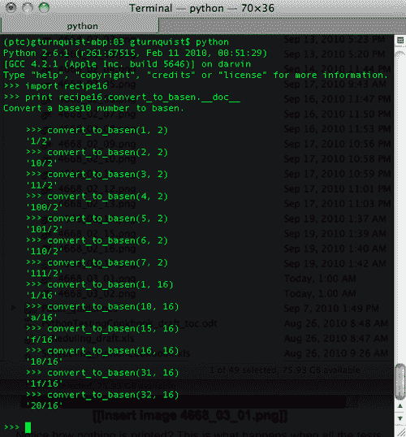
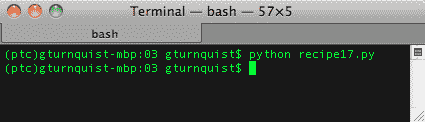
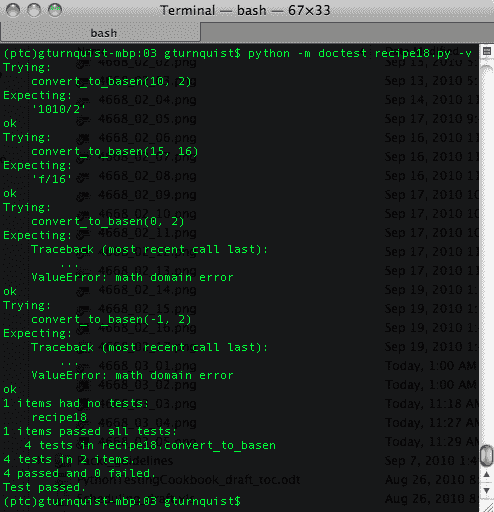
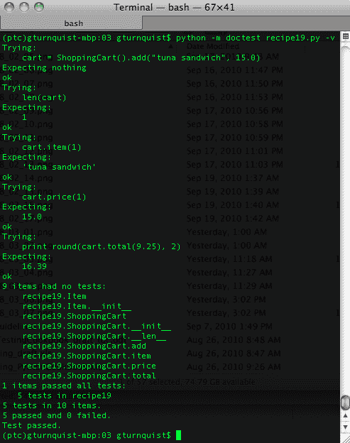
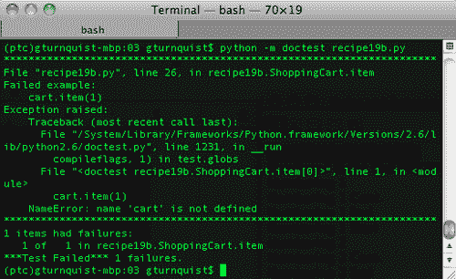
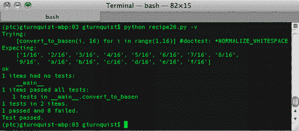
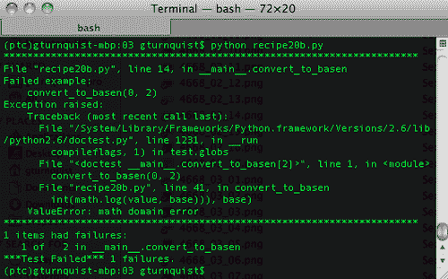
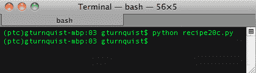
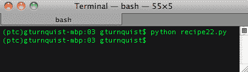
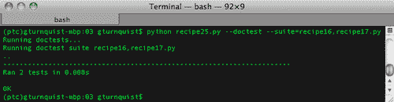

# 第 3 章：使用 doctest 创建可测试文档

在本章中，我们将介绍：

*   记录基础知识
*   捕捉堆栈跟踪
*   从命令行运行 doctest
*   为 doctest 的测试线束编码
*   滤除测试噪声
*   打印所有文档，包括状态报告
*   测试边缘
*   用迭代法测试角点情况
*   多管闲事的医生
*   更新项目级脚本以运行本章的 doctests

# 导言

Python 提供了将注释嵌入到可从 Python shell 访问的函数中的有用功能。这些被称为**文档字符串**。

docstring 不仅可以嵌入信息，还可以嵌入可运行的代码示例。

有句老话说，*注释**不是**代码*。注释不进行语法检查，并且通常不进行维护，因此它们所携带的信息可能会随着时间的推移而失去价值。`doctest`通过将注释转换为代码来应对这种情况，代码可以用于许多有用的目的。

在本章中，我们将探讨使用`doctest`开发测试、文档和项目支持的不同方法。不需要特殊设置，因为`doctest`是 Python 标准库的一部分。

# 记录基础知识

Python 提供了开箱即用的功能，可以将注释放入称为 docstring 的代码中。可以在查看源代码时读取 docstring，也可以在从 Python shell 交互检查代码时读取 docstring。在此配方中，我们将演示如何将这些交互式 docstring 用作可运行测试。

这提供了什么？它为用户提供易于阅读的代码示例。代码样本不仅可读，而且可以运行，这意味着我们可以确保文档保持最新。

## 怎么做。。。

通过以下步骤，我们将创建一个结合可运行 docstring 注释的应用程序，并查看如何执行这些测试：

1.  创建一个名为`recipe16.py`的新文件，以包含我们为此配方编写的所有代码。
2.  创建一个函数，使用递归将以 10 为基数的数字转换为任何其他基数。

    ```py
    def convert_to_basen(value, base):
        import math

        def _convert(remaining_value, base, exp):
            def stringify(value):
                if value > 9:
                    return chr(value + ord('a')-10)
                else:
                    return str(value)

            if remaining_value >= 0 and exp >= 0:
                factor = int(math.pow(base, exp))
                if factor <= remaining_value:
                    multiple = remaining_value / factor
                    return stringify(multiple) + \
                      _convert(remaining_value-multiple*factor, \
                                    base, exp-1)
                else:
                    return "0" + \
                           _convert(remaining_value, base, exp-1)
            else:
                return ""

        return "%s/%s" % (_convert(value, base, \
                             int(math.log(value, base))), base)
    ```

3.  在外部功能下方添加一个`docstring`，如下面代码中突出显示的部分所示。此`docstring`声明包括几个使用该函数的示例。

    ```py
    def convert_to_basen(value, base):
        """Convert a base10 number to basen.edur
     >>> convert_to_basen(1, 2)
     '1/2'
     >>> convert_to_basen(2, 2)
     '10/2'
     >>> convert_to_basen(3, 2)
     '11/2'
     >>> convert_to_basen(4, 2)
     '100/2'
     >>> convert_to_basen(5, 2)
     '101/2'
     >>> convert_to_basen(6, 2)
     '110/2'
     >>> convert_to_basen(7, 2)
     '111/2'
     >>> convert_to_basen(1, 16)
     '1/16'
     >>> convert_to_basen(10, 16)
     'a/16'
     >>> convert_to_basen(15, 16)
     'f/16'
     >>> convert_to_basen(16, 16)
     '10/16'
     >>> convert_to_basen(31, 16)
     '1f/16'
     >>> convert_to_basen(32, 16)
     '20/16'
        """
        import math
    ```

4.  添加一个调用 Python›s`doctest`模块的测试运行程序块。

    ```py
    if __name__ == "__main__":
        import doctest
        doctest.testmod()
    ```

5.  From an interactive Python shell, import the recipe and view its documentation.

    

6.  Run the code from the command line. In the next screenshot, notice how nothing is printed. This is what happens when all the tests pass.

    

7.  Run the code from the command line with `-v` to increase verbosity. In the following screenshot, we see a piece of the output, showing what was run and what was expected. This can be useful when debugging `doctest`.

    

## 它是如何工作的。。。

`doctest`模块在`docstrings`中查找 Python 块，并像实际代码一样运行。`>>>`与我们使用交互式 Python shell 时看到的提示相同。下一行显示了预期的输出。`doctest`运行它看到的语句，然后将实际输出与预期输出进行比较。

在本章的后面，我们将看到如何捕获堆栈跟踪、错误，以及添加等同于测试夹具的额外代码。

## 还有更多。。。

`doctest`在将预期输出与实际结果相匹配时非常挑剔。

*   一个额外的空间或标签会导致东西破裂。
*   像字典这样的结构很难测试，因为 Python 不能保证项目的顺序。在每次测试运行中，项目可以以不同的顺序存储。简单地打印一本字典肯定会把它弄坏。
*   强烈建议不要在预期输出中包含对象引用。每次运行测试时，这些值也会发生变化。

# 捕捉堆栈跟踪

只为成功的代码路径编写测试是常见的谬误。我们还需要针对错误条件进行编码，包括生成堆栈跟踪的错误条件。通过这个方法，我们将探索如何在文档测试中匹配堆栈跟踪模式，从而允许我们确认预期的错误。

## 怎么做。。。

通过以下步骤，我们将了解如何使用`doctest`来验证错误条件：

1.  创建一个名为`recipe17.py`的新文件来编写此配方的所有代码。
2.  创建一个函数，使用递归将以 10 为基数的数字转换为任何其他基数。

    ```py
    def convert_to_basen(value, base):
        import math

        def _convert(remaining_value, base, exp):
            def stringify(value):
                if value > 9:
                    return chr(value + ord('a')-10)
                else:
                    return str(value)

            if remaining_value >= 0 and exp >= 0:
                factor = int(math.pow(base, exp))
                if factor <= remaining_value:
                    multiple = remaining_value / factor
                    return stringify(multiple) + \
                      _convert(remaining_value-multiple*factor, \
                                    base, exp-1)
                else:
                    return "0" + \
                           _convert(remaining_value, base, exp-1)
            else:
                return ""

        return "%s/%s" % (_convert(value, base, \
                             int(math.log(value, base))), base)
    ```

3.  在外部函数声明的正下方添加一个`docstring`，该声明包含两个预期生成堆栈跟踪的示例。

    ```py
    def convert_to_basen(value, base):
        """Convert a base10 number to basen.

     >>> convert_to_basen(0, 2)
     Traceback (most recent call last):
     ...
     ValueError: math domain error

     >>> convert_to_basen(-1, 2)
     Traceback (most recent call last):
     ...
     ValueError: math domain error
        """
        import math
    ```

4.  添加一个调用 Python›s`doctest`模块的测试运行程序块。

    ```py
    if __name__ == "__main__":
        import doctest
        doctest.testmod()
    ```

5.  Run the code from the command line. In the following screenshot, notice how nothing is printed. This is what happens when all the tests pass.

    

6.  Run the code from the command line with `-v` to increase verbosity. In the next screenshot, we can see that `0` and `-1` generate math domain errors. This is due to using `math.log` to find the starting exponent.

    

## 它是如何工作的。。。

`doctest`模块在`docstrings`中查找 Python 块，并像实际代码一样运行。`>>>`与我们使用交互式 Python shell 时看到的提示相同。下一行显示了预期的输出。`doctest`运行它看到的语句，然后将实际输出与预期输出进行比较。

关于堆栈跟踪，堆栈跟踪中提供了许多详细信息。匹配整个跟踪的模式无效。通过使用省略号，我们可以跳过堆栈跟踪的中间部分，只匹配区别部分：`ValueError: math domain error`。

这是很有价值的，因为我们的用户不仅可以看到它处理好值的方式，还可以观察到当提供坏值时会出现什么错误。

# 从命令行运行 doctests

我们已经了解了如何通过在`docstrings`中嵌入可运行的代码片段来开发测试。但是对于这些测试中的每一个，我们都必须使模块能够运行。如果我们想从命令行运行 doctest 之外的其他东西呢？我们必须摆脱`doctest.testmod()`语句！

### 提示

好消息是，从 Python2.6 开始，有一个命令行选项可以使用`doctest`运行特定模块，而无需编写运行程序。

输入：`python -m doctest -v example.py`将导入`example.py`并通过`doctest.testmod()`运行。根据文档，如果模块是包的一部分并导入其他子模块，则此操作可能会失败。

## 怎么做。。。

在以下步骤中，我们将创建一个简单的应用程序。我们将添加一些 doctest，然后从命令行运行它们，而无需编写特殊的测试运行程序。

1.  创建一个名为`recipe18.py`的新文件来存储为此配方编写的代码。
2.  创建一个函数，使用递归将以 10 为基数的数字转换为任何其他基数。

    ```py
    def convert_to_basen(value, base):
        import math

        def _convert(remaining_value, base, exp):
            def stringify(value):
                if value > 9:
                    return chr(value + ord('a')-10)
                else:
                    return str(value)

            if remaining_value >= 0 and exp >= 0:
                factor = int(math.pow(base, exp))
                if factor <= remaining_value:
                    multiple = remaining_value / factor
                    return stringify(multiple) + \
                      _convert(remaining_value-multiple*factor, \
                                    base, exp-1)
                else:
                    return "0" + \
                           _convert(remaining_value, base, exp-1)
            else:
                return ""

        return "%s/%s" % (_convert(value, base, \
                             int(math.log(value, base))), base)
    ```

3.  在包含部分测试的外部功能声明下方添加`docstring`。

    ```py
    def convert_to_basen(value, base):
        """Convert a base10 number to basen.

     >>> convert_to_basen(10, 2)
     '1010/2'

     >>> convert_to_basen(15, 16)
     'f/16'

     >>> convert_to_basen(0, 2)
     Traceback (most recent call last):
     ...
     ValueError: math domain error

     >>> convert_to_basen(-1, 2)
     Traceback (most recent call last):
     ...
     ValueError: math domain error
        """
        import math
    ```

4.  Run the code from the command line using `-m doctest`. As shown in the following screenshot, no output indicates that all the tests have passed.

    

5.  Run the code from the command line with `-v` to increase verbosity. What happens if we forget to include `-m doctest`? Using the `-v` option helps us to avoid this by giving us a warm fuzzy that our tests are working.

    

## 它是如何工作的。。。

在前面的章节中，我们使用模块的`__main__`块来运行其他测试套件。如果我们想在这里做同样的事情呢？我们必须选择`__main__`是用于单元测试还是博士测试，或者两者兼而有之！如果我们甚至不想通过`__main__`运行测试，而是运行我们的应用程序呢？

这就是为什么 Python 添加了使用`-m doctest`从命令行调用测试的选项。

### 提示

难道你不想*确切地知道*你的测试是否正在运行，或者它们是否在工作吗？测试套件真的做到了它承诺的吗？在使用其他工具时，我们通常必须嵌入打印语句或故意失败，以便知道事情被正确捕获。doctest 的`-v`选项不是提供了一个方便的快速查看发生了什么的选项吗？

# 为 doctest 的测试线束编码

到目前为止，我们编写的测试非常简单，因为我们正在测试的函数非常简单。有两个输入和一个输出，没有副作用。不必创建任何对象。这不是我们最常见的用例。通常，我们有与其他对象交互的对象。

`doctest`模块支持创建对象、调用方法和检查结果。有了这个配方，我们将更详细地探讨这个问题。

`doctest`的一个重要方面是，它找到`docstrings`的各个实例，并在本地上下文中运行它们。在一个`docstring`中声明的变量不能在另一个`docstring`中使用。

## 怎么做。。。

1.  创建一个名为`recipe19.py`的新文件，以包含此配方中的代码。
2.  编写一个简单的购物车应用程序。

    ```py
    class ShoppingCart(object):
        def __init__(self):
            self.items = []

        def add(self, item, price):
            self.items.append(Item(item, price))
            return self

        def item(self, index):
            return self.items[index-1].item

        def price(self, index):
            return self.items[index-1].price

        def total(self, sales_tax):
            sum_price = sum([item.price for item in self.items])
            return sum_price*(1.0 + sales_tax/100.0)

        def __len__(self):
            return len(self.items)

    class Item(object):
        def __init__(self, item, price):
            self.item = item
            self.price = price
    ```

3.  在`ShoppingCart`类声明之前的模块顶部插入一个 docstring。

    ```py
    """
    This is documentation for the this entire recipe.
    With it, we can demonstrate usage of the code.

    >>> cart = ShoppingCart().add("tuna sandwich", 15.0)
    >>> len(cart)
    1
    >>> cart.item(1)
    'tuna sandwich'
    >>> cart.price(1)

    ```

    ```py
    15.0
    >>> print round(cart.total(9.25), 2)

    ```

    ```py
    16.39
    """
    class ShoppingCart(object):
    ...
    ```

4.  Run the recipe using `-m doctest` and `-v` for verbosity.

    

5.  将我们刚刚从`recipe19.py`编写的所有代码复制到一个名为`recipe19b.py`的新文件中。
6.  在`recipe19b.py`中向`item`添加另一个 docstring，尝试重用模块顶部定义的`cart`变量。

    ```py
        def item(self, index):
            """
     >>> cart.item(1)
     'tuna sandwich'
            """
     return self.items[index-1].item

    ```

7.  Run this variant of the recipe. Why does it fail? Wasn›t `cart` declared in the earlier docstring?

    

## 它是如何工作的。。。

`doctest`模块查找每个`docstring`。对于找到的每一个`docstring`，它都会创建一个模块全局变量的浅拷贝，然后运行代码并检查结果。除此之外，创建的每个变量都是局部范围的，然后在测试完成时进行清理。这意味着后来添加的第二个`docstring`无法看到第一个`docstring`中创建的`cart`。这就是第二次运行失败的原因。

当我们使用一些 unittest 配方时，没有与`setUp`方法等效的方法。如果`doctest`没有`setUp`选项，那么这个配方有什么价值？它强调了 doctest 的一个关键限制，所有开发人员在使用它之前都必须了解它。

## 还有更多。。。

`doctest`模块提供了一种非常方便的方法，可以将可测试性添加到我们的文档中。但这并不能替代成熟的测试框架，比如 unittest。如前所述，没有与`setUp`等价的内容。`docstrings`中嵌入的 Python 代码也没有语法检查。

将`doctests`的正确级别与 unittest（或我们选择的其他测试框架）混合是一个判断问题。

# 滤除测试噪声

各种选项有助于`doctest`在测试用例中忽略噪声，例如空格。这可能很有用，因为它允许我们以更好的方式构建预期结果，以便于用户阅读。

我们还可以标记一些可以跳过的测试。这可以用于我们想要记录已知问题，但尚未修补系统的地方。

当我们试图运行全面的测试时，这两种情况都可以很容易地解释为噪声，但重点放在系统的其他部分。在本食谱中，我们将深入研究以简化`doctest`所做的严格检查。我们还将研究如何忽略整个测试，无论是临时的还是永久的。

## 怎么做。。。

通过以下步骤，我们将尝试过滤掉测试结果并放宽`doctest`的某些限制。

1.  创建一个名为`recipe20.py`的新文件，以包含此配方中的代码。
2.  创建一个递归函数，将 base10 数字转换为其他基数。

    ```py
    def convert_to_basen(value, base):
        import math

        def _convert(remaining_value, base, exp):
            def stringify(value):
                if value > 9:
                    return chr(value + ord('a')-10)
                else:
                    return str(value)

            if remaining_value >= 0 and exp >= 0:
                factor = int(math.pow(base, exp))
                if factor <= remaining_value:
                    multiple = remaining_value / factor
                    return stringify(multiple) + \
                      _convert(remaining_value-multiple*factor, \
                                    base, exp-1)
                else:
                    return "0" + \
                           _convert(remaining_value, base, exp-1)
            else:
                return ""

        return "%s/%s" % (_convert(value, base, \
                             int(math.log(value, base))), base)
    ```

3.  添加一个 docstring，其中包括一个测试，以测试一系列值，并记录尚未实现的未来功能。

    ```py
    def convert_to_basen(value, base):
        """Convert a base10 number to basen.

     >>> [convert_to_basen(i, 16) for i in range(1,16)] #doctest: +NORMALIZE_WHITESPACE
     ['1/16', '2/16', '3/16', '4/16', '5/16', '6/16', '7/16', '8/16',
     '9/16',  'a/16', 'b/16', 'c/16', 'd/16', 'e/16', 'f/16']

     FUTURE: Binary may support 2's complement in the future, but not now.
     >>> convert_to_basen(-10, 2) #doctest: +SKIP
     '0110/2'
        """
        import math
    ```

4.  添加一个测试运行程序。

    ```py
    if __name__ == "__main__":
        import doctest
        doctest.testmod()
    ```

5.  Run the test case in verbose mode.

    

6.  将代码从`recipe20.py`复制到名为`recipe20b.py`的新文件中。
7.  通过更新 docstring 来编辑`recipe20b.py`，以包含另一个暴露我们的函数未转换`0`的测试。

    ```py
    def convert_to_basen(value, base):
        """Convert a base10 number to basen.

        >>> [convert_to_basen(i, 16) for i in range(1,16)] #doctest: +NORMALIZE_WHITESPACE
        ['1/16', '2/16', '3/16', '4/16', '5/16', '6/16', '7/16', '8/16',
        '9/16',  'a/16', 'b/16', 'c/16', 'd/16', 'e/16', 'f/16']

        FUTURE: Binary may support 2's complement in the future, but not now.
        >>> convert_to_basen(-10, 2) #doctest: +SKIP
        '0110/2'

        BUG: Discovered that this algorithm doesn't handle 0\. Need to patch it.
     TODO: Renable this when patched.
     >>> convert_to_basen(0, 2)
     '0/2'
        """
        import math
    ```

8.  Run the test case. Notice what is different about this version of the recipe; and why does it fail?

    

9.  将代码从`recipe20b.py`复制到名为`recipe20c.py`的新文件中。
10.  编辑`recipe20c.py`并更新文档字符串，表示我们将暂时跳过测试。

    ```py
    def convert_to_basen(value, base):
        """Convert a base10 number to basen.

        >>> [convert_to_basen(i, 16) for i in range(1,16)] #doctest: +NORMALIZE_WHITESPACE
        ['1/16', '2/16', '3/16', '4/16', '5/16', '6/16', '7/16', '8/16',
        '9/16',  'a/16', 'b/16', 'c/16', 'd/16', 'e/16', 'f/16']

        FUTURE: Binary may support 2's complement in the future, but not now.
        >>> convert_to_basen(-10, 2) #doctest: +SKIP
        '0110/2'

        BUG: Discovered that this algorithm doesn't handle 0\. Need to patch it.
     TODO: Renable this when patched.
     >>> convert_to_basen(0, 2) #doctest: +SKIP
     '0/2'
        """
        import math
    ```

11.  Run the test case.

    

## 它是如何工作的。。。

在本配方中，我们将重新讨论从基数 10 转换为任意基数的函数。第一个测试显示它正在一个范围内运行。通常，Python 将在一行中拟合此结果数组。为了使其更具可读性，我们将输出分散到两行。我们还在值之间放置了一些任意空格，以使列更好地排列。

这是`doctest`肯定*不会*支持的，因为它具有严格的模式匹配性质。通过使用`#doctest: +NORMALIZE_WHITESPACE`，我们可以要求`doctest`放宽这一限制。仍然存在一些限制。例如，预期数组中的第一个值前面不能有任何空格。（*相信**我，**我**尝试了**以获得**最大**可读性！*但将数组包装到下一行不再会破坏测试。

我们还有一个测试用例，它实际上只是一个文档。它指出了一个未来的需求，显示了我们的函数将如何处理负二进制值。通过添加`#doctest: +SKIP`，我们可以命令`doctest`跳过这个特定实例。

最后，我们看到了这样一个场景：我们发现我们的代码不能处理`0`。由于该算法通过取对数获得最高指数，因此存在一个数学问题。我们通过一个测试捕获了这个边缘情况。然后我们确认该代码以经典的**测试****驱动****设计****TDD**方式失败。最后一步是修复处理此边缘情况的代码。但我们决定，以一种有点做作的方式，在当前的 sprint 中，我们没有足够的时间来修复代码。为了避免破坏我们的**连续****集成**（**CI**）服务器，我们使用`TO-DO`语句标记测试并添加`#doctest: +SKIP`。

## 还有更多。。。

我们用`#doctest: +SKIP`标记的两种情况都是我们最终想要删除`SKIP`标记并运行它们的情况。在其他情况下，我们可能永远不会删除`SKIP`。具有较大波动的代码演示可能无法在不使其不可读的情况下进行测试。例如，返回字典的函数更难测试，因为结果的顺序不同。我们可以将其弯曲以通过测试，但我们可能会失去文档的价值，从而使其呈现给读者。

# 打印所有文档，包括状态报告

由于本章讨论的是文档和测试，所以让我们构建一个脚本，该脚本包含一组模块并打印出完整的报告，显示所有文档以及运行任何给定的测试。

这是一个很有价值的方法，因为它向我们展示了如何使用 Python 的 API 来获取代码驱动的可运行报告。这意味着文档是准确和最新的，反映了我们代码的当前状态。

## 怎么做。。。

在以下步骤中，我们将编写一个应用程序和一些 doctest。然后，我们将构建一个脚本来获取有用的报告。

1.  创建一个名为`recipe21_report.py`的新文件，以包含获取我们报告的脚本。
2.  通过导入 Python 的`inspect`库开始创建脚本，作为从`inspect``import`深入模块的基础*
3.  添加一个功能，重点是打印出项目的`__doc__`字符串或打印出**号**号**文档**号**号**。

    ```py
    def print_doc(name, item):
        if item.__doc__:
            print "Documentation for %s" % name
            print "-------------------------------"
            print item.__doc__
            print "-------------------------------"
        else:
            print "Documentation for %s - None" % name
    ```

4.  添加一个基于给定模块打印文档的函数。确保此函数查找类、方法和函数，并打印它们的文档。

    ```py
    def print_docstrings(m, prefix=""):
        print_doc(prefix + "module %s" % m.__name__, m)

        for (name, value) in getmembers(m, isclass):
            if name == '__class__': continue
            print_docstrings(value, prefix=name + ".")

        for (name, value) in getmembers(m, ismethod):
            print_doc("%s%s()" % (prefix, name), value)
        for (name, value) in getmembers(m, isfunction):
            print_doc("%s%s()" % (prefix, name), value)
    ```

5.  添加一个解析命令行字符串的运行程序，并迭代每个提供的模块。

    ```py
    if __name__ == "__main__":
        import sys
        import doctest

        for arg in sys.argv[1:]:
            if arg.startswith("-"): continue
            print "==============================="
            print "== Processing module %s" % arg
            print "==============================="
            m = __import__(arg)
            print_docstrings(m)
            print "Running doctests for %s" % arg
            print "-------------------------------"
            doctest.testmod(m)
    ```

6.  创建一个名为`recipe21.py`的新文件，以包含一个带有测试的应用程序，我们将对其运行早期脚本。
7.  在`recipe21.py`中，创建一个购物车应用程序，并将其填入`docstrings`和`doctests`。

    ```py
    """ This is documentation for the entire recipe.
    With it, we can demonstrate usage of the code.

    >>> cart = ShoppingCart().add("tuna sandwich", 15.0)
    >>> len(cart)
    1
    >>> cart.item(1)
    'tuna sandwich'
    >>> cart.price(1)
    15.0
    >>> print round(cart.total(9.25), 2)
    16.39
    """

    class ShoppingCart(object):
        """
        This object is used to store the goods.
        It conveniently calculates total cost including
        tax.
        """

        def __init__(self):
            self.items = []

        def add(self, item, price):
            "Add an item to the internal list."
            self.items.append(Item(item, price))
            return self

        def item(self, index):
            "Look up the item. The cart is a 1-based index."
            return self.items[index-1].item

        def price(self, index):
            "Look up the price. The cart is a 1-based index."
            return self.items[index-1].price

        def total(self, sales_tax):
            "Add up all costs, and then apply a sales tax."
            sum_price = sum([item.price for item in self.items])
            return sum_price*(1.0 + sales_tax/100.0)
        def __len__(self):
            "Support len(cart) operation."
            return len(self.items)

    class Item(object):
        def __init__(self, item, price):
            self.item = item
            self.price = price
    ```

8.  使用`-v`对该模块运行报告脚本，并查看屏幕输出。

    ```py
    ===============================
    == Processing module recipe21
    ===============================
    Documentation for module recipe21
    -------------------------------

    This is documentation for the this entire recipe.
    With it, we can demonstrate usage of the code.

    >>> cart = ShoppingCart().add("tuna sandwich", 15.0)
    >>> len(cart)
    1
    >>> cart.item(1)
    'tuna sandwich'
    >>> cart.price(1)
    15.0
    >>> print round(cart.total(9.25), 2)
    16.39

    -------------------------------
    Documentation for Item.module Item - None
    Documentation for Item.__init__() - None
    Documentation for ShoppingCart.module ShoppingCart
    -------------------------------
     This object is used to store the goods.
     It conveniently calculates total cost including
     tax.
    …
    Running doctests for recipe21
    -------------------------------
    Trying:
     cart = ShoppingCart().add("tuna sandwich", 15.0)
    Expecting nothing
    ok
    Trying:
     len(cart)
    Expecting:
     1
    ok
    5 tests in 10 items.
    5 passed and 0 failed.
    Test passed.

    ```

## 它是如何工作的。。。

这个脚本很小，但是可以收集很多有用的信息。

通过使用 Python 的标准`inspect`模块，我们可以从模块级别开始向下钻取。查找 docstring 的反射方法是访问对象的`__doc__`属性。这包含在模块、类、方法和函数中。它们存在于其他地方，但我们限制了对这个配方的关注。

我们在详细模式下运行它，以显示测试实际上已执行。我们手工解析了命令行选项，但是`doctest`会自动寻找`-v`来决定是否打开详细输出。为了防止我们的模块处理器捕捉到这一点并试图将其作为另一个模块处理，我们添加了一行代码来跳过任何`-xyz`样式的标志。

```py
 if arg.startswith("-"): continue

```

## 还有更多。。。

我们可以花更多的时间来增强这个脚本。例如，我们可以使用 HTML 标记将其转储，使其在 web 浏览器中可见。我们还可以找到第三方库以其他方式导出它。

我们还可以致力于精炼它寻找`docstrings`的地方以及如何处理它们。在我们的例子中，我们只是将它们打印到屏幕上。更可重用的方法是返回包含所有信息的某种类型的结构。然后，调用者可以决定是打印到屏幕上，用 HTML 编码，还是生成 PDF 文档。

但是，这并不是必需的，因为本食谱的重点是了解如何将 Python 提供的这些强大的开箱即用选项混合到一个快速而有用的工具中。

# 边缘检测

测试需要使代码的边界达到或超过范围限制。在本配方中，我们将深入研究如何使用 doctest 定义和测试边。

## 怎么做。。。

通过以下步骤，我们将了解如何编写测试软件边缘的代码。

1.  创建一个名为`recipe22.py`的新文件，并使用它存储此配方的所有代码。
2.  创建一个函数，将以 10 为基数的数字转换为以 2 为基数和以 36 为基数之间的任何数字。

    ```py
    def convert_to_basen(value, base):
        if base < 2 or base > 36:
            raise Exception("Only support bases 2-36")

        import math

        def _convert(remaining_value, base, exp):
            def stringify(value):
                if value > 9:
                    return chr(value + ord('a')-10)
                else:
                    return str(value)

            if remaining_value >= 0 and exp >= 0:
                factor = int(math.pow(base, exp))
                if factor <= remaining_value:
                    multiple = remaining_value / factor
                    return stringify(multiple) + \
                      _convert(remaining_value-multiple*factor, \
                                    base, exp-1)
                else:
                    return "0" + \
                           _convert(remaining_value, base, exp-1)
            else:
                return ""

        return "%s/%s" % (_convert(value, base, \
                             int(math.log(value, base))), base)
    ```

3.  在函数声明的正下方添加一个 docstring，其中包括显示基 2 边、基 36 边和无效基 37 的测试。

    ```py
    def convert_to_basen(value, base):
        """Convert a base10 number to basen.

     These show the edges for base 2.
     >>> convert_to_basen(1, 2)
     '1/2'
     >>> convert_to_basen(2, 2)
     '10/2'
     >>> convert_to_basen(0, 2)
     Traceback (most recent call last):
     ...
     ValueError: math domain error

     These show the edges for base 36.
     >>> convert_to_basen(1, 36)
     '1/36'
     >>> convert_to_basen(35, 36)
     'z/36'
     >>> convert_to_basen(36, 36)
     '10/36'
     >>> convert_to_basen(0, 36)
     Traceback (most recent call last):
     ...
     ValueError: math domain error
     These show the edges for base 37.
     >>> convert_to_basen(1, 37)
     Traceback (most recent call last):
     ...
     Exception: Only support bases 2-36
     >>> convert_to_basen(36, 37)
     Traceback (most recent call last):
     ...
     Exception: Only support bases 2-36
     >>> convert_to_basen(37, 37)
     Traceback (most recent call last):
     ...
     Exception: Only support bases 2-36
     >>> convert_to_basen(0, 37) 
     Traceback (most recent call last):
     ...
        Exception: Only support bases 2-36
        """
        if base < 2 or base > 36:
    ```

4.  添加一个测试运行程序。

    ```py
    if __name__ == "__main__":
        import doctest
        doctest.testmod()
    ```

5.  Run the recipe.

    

## 它是如何工作的。。。

此版本有处理底座 2 到底座 36 的限制。

### 提示

对于基准 36，它使用 a 到 z。这与使用 a 到 f 的基准 16 相比。底座 10 中的 35 在底座 36 中表示为 z。

我们包括了几个测试，包括一个用于基数 2 和基数 36 的测试。我们还测试了翻滚前的最大值和下一个值，以显示翻滚。对于基数 2，这是 1 和 2。对于基数 36，这是 35 和 36。

我们还包括了对 0 的测试，以表明我们的函数对于任何基都不能处理这个问题。我们还测试了 base 37，它也是无效的。

## 还有更多。。。

重要的是，我们的软件工作的有效输入。同样重要的是，我们的软件能够在无效输入下正常工作。当我们使用记录这些边缘的软件时，用户可以查看我们的文档。多亏了 Python 的`doctest`模块，我们可以测试它并确保我们的软件正确运行。

## 另见

*测试**第一章中提到的**边缘*部分

# 迭代测试角点情况

在我们继续开发代码的过程中，会出现一些极端情况。通过在 iterable 列表中捕获角落案例，可以减少编写和捕获另一个测试场景的代码。这可以提高我们测试新场景的效率。

## 怎么做。。。

1.  创建一个名为`recipe23.py`的新文件，并使用它存储此配方的所有代码。
2.  创建一个将基数 10 转换为任何其他基数的函数。

    ```py
    def convert_to_basen(value, base):
        import math

        def _convert(remaining_value, base, exp):
            def stringify(value):
                if value > 9:
                    return chr(value + ord('a')-10)
                else:
                    return str(value)

            if remaining_value >= 0 and exp >= 0:
                factor = int(math.pow(base, exp))
                if factor <= remaining_value:
                    multiple = remaining_value / factor
                    return stringify(multiple) + \
                      _convert(remaining_value-multiple*factor, \
                                    base, exp-1)
                else:
                    return "0" + \
                           _convert(remaining_value, base, exp-1)
            else:
                return ""

        return "%s/%s" % (_convert(value, base, \
                             int(math.log(value, base))), base)
    ```

3.  添加一些包含输入值数组的文档测试，以生成预期输出数组。包括一个失败。

    ```py
    def convert_to_basen(value, base):
        """Convert a base10 number to basen.

        Base 2
        >>> inputs = [(1,2,'1/2'), (2,2,'11/2')]
        >>> for value,base,expected in inputs:
        ...     actual = convert_to_basen(value,base)
        ...     assert actual == expected, 'expected: %s actual: %s' % (expected, actual)

        >>> convert_to_basen(0, 2)
        Traceback (most recent call last):
           ...
        ValueError: math domain error

        Base 36.
        >>> inputs = [(1,36,'1/36'), (35,36,'z/36'), (36,36,'10/36')]
        >>> for value,base,expected in inputs:
        ...     actual = convert_to_basen(value,base)
        ...     assert actual == expected, 'expected: %s actual: %s' % (expected, value)

        >>> convert_to_basen(0, 36)
        Traceback (most recent call last):
           ...
        ValueError: math domain error
        """
        import math
    ```

4.  增加一个测试跑步者。

    ```py
    if __name__ == "__main__":
        import doctest
        doctest.testmod()
    ```

5.  Run the recipe.

    

    ### 提示

    在上一个屏幕截图中，关键信息在这一行：**断言错误：预期：11/2 实际：10/2**。这次测试失败有点做作吗？当然是。但看到一个测试用例显示有用的输出却不是。重要的是要验证我们的测试是否为我们提供了足够的信息来修复测试或代码。

## 它是如何工作的。。。

我们创建了一个数组，每个条目都包含输入数据和预期输出。这为我们提供了一种简单的方法来浏览一组测试用例。

然后，我们迭代每个测试用例，计算实际值，并通过 Python`assert`运行它。需要的一个重要部分是自定义消息`'expected: %s actual: %s'`。如果没有它，我们将永远无法获得信息来告诉我们哪个测试用例失败了。

### 提示

**如果一个测试用例失败怎么办？**

如果阵列中的一个测试失败，那么该代码块将退出并跳过其余的测试。这是一个更简洁的测试集的折衷方案。

### 这种类型的测试更适合 doctest 还是 unittest？

在决定是否将这些测试放入`doctest`时，以下是一些值得考虑的标准：

*   代码一眼就能理解吗？
*   当用户查看文档字符串时，这些信息是否清晰、简洁、有用？

如果在文档中包含这一点没有什么价值，并且如果它使代码混乱，那么这是一个强烈的提示，表明此测试块属于一个单独的测试模块。

## 另见

*通过[第一章](1.html "Chapter 1. Using Unittest To Develop Basic Tests")的**迭代*部分[测试*转角**案例*](1.html "Chapter 1. Using Unittest To Develop Basic Tests")

 *# 对医生多管闲事

到目前为止，我们要么在模块中添加测试运行程序，要么在命令行中键入`python -m doctest <module>`来执行测试。

在上一章中，我们介绍了强大的库`nose`（参见[http://somethingaboutorange.com/mrl/projects/nose](http://somethingaboutorange.com/mrl/projects/nose) 了解更多详细信息）。

要快速回顾一下，nose：

*   为我们提供方便的测试发现工具`nosetests`
*   是可插拔的，有一个巨大的可用插件生态系统
*   包括一个内置插件，用于查找`doctests`并运行它们

## 准备好了吗

我们需要激活我们的虚拟环境（VirtualEnvironment，VirtualEnvironment），然后为这个配方安装 nose。

1.  Create a virtual environment, activate it, and verify the tools are working.

    

2.  Using `pip`, install nose.

    

    ### 注

    本配方假设您已经构建了本章中之前的所有配方。如果您只构建了其中的一部分，则结果可能会有所不同。

## 怎么做。。。

1.  针对该文件夹中的所有模块运行`nosetests –with-doctest`。如果您注意到，它会打印一个非常短的`.....F.F...F`，表示有三个测试失败。
2.  Run `nosetests –with-doctest -v` to get a more verbose output. In the following screenshot, notice how the tests that failed are the same ones that failed for the previous recipes in this chapter. It is also valuable to see the `<module>.<method>` format with either `ok` or `FAIL`.

    

3.  Run `nosetests –with-doctest` against both the `recipe19.py` file as well as the `recipe19` module, in different combinations.

    

## 它是如何工作的。。。

`nosetests`的目标是发现测试用例，然后运行它们。有了这个插件，当它找到一个 docstring 时，它使用`doctest`库以编程方式对其进行测试。

`doctest`插件是基于 doctest 与其他测试（如 unittest）不在同一个包中的假设构建的。这意味着它将只运行从非测试包中找到的 doctest。

鼻子测试工具没有太多的复杂性，而且……这就是想法！。在这个食谱中，我们已经看到了如何使用`nosetests`来掌握我们在本章中建立的所有博士。

## 另见

*通过[第二章](2.html "Chapter 2. Running Automated Test Suites with Nose")中提到的**测试*部分获得*多管闲事*

 *# 更新项目级脚本以运行本章的 doctests

这个方法将帮助我们探索构建一个项目级脚本，它允许我们运行不同的测试套件。我们还将关注如何在我们的`doctests`中运行它。

## 怎么做。。。

通过以下步骤，我们将创建一个命令行脚本，允许我们管理一个项目，包括运行`doctests`。

1.  创建一个名为`recipe25.py`的新文件，以包含此配方的所有代码。
2.  添加使用 Python 的`getopt`库解析一组选项的代码。

    ```py
    import getopt
    import glob
    import logging
    import nose
    import os
    import os.path
    import re
    import sys

    def usage():
        print
        print "Usage: python recipe25.py [command]"
        print
        print "\t--help"
        print "\t--doctest"
        print "\t--suite [suite]"
        print "\t--debug-level [info|debug]"
        print "\t--package"
        print "\t--publish"
        print "\t--register"
        print

    try:
        optlist, args = getopt.getopt(sys.argv[1:],
                "h",
               ["help", "doctest", "suite=", \
                "debug-level=", "package", \
                "publish", "register"])
    except getopt.GetoptError:
        # print help information and exit:
        print "Invalid command found in %s" % sys.argv
        usage()
        sys.exit(2)
    ```

3.  创建一个映射到`–test`的函数。

    ```py
    def test(test_suite, debug_level):
        logger = logging.getLogger("recipe25")
        loggingLevel = debug_level
        logger.setLevel(loggingLevel)
        ch = logging.StreamHandler()
        ch.setLevel(loggingLevel)
        formatter = logging.Formatter("%(asctime)s - %(name)s - %(levelname)s - %(message)s")
        ch.setFormatter(formatter)
        logger.addHandler(ch)

        nose.run(argv=["", test_suite, "--verbosity=2"])
    ```

4.  创建一个映射到`–doctest`的函数。

    ```py
    def doctest(test_suite=None):
        args = ["", "--with-doctest"]
        if test_suite is not None:
            print "Running doctest suite %s" % test_suite
            args.extend(test_suite.split(','))
            nose.run(argv=args)
        else:
            nose.run(argv=args)
    ```

5.  创建支持`package`、`publish`和`register`的存根函数。

    ```py
    def package():
        print "This is where we can plug in code to run " + \
              "setup.py to generate a bundle."

    def publish():
        print "This is where we can plug in code to upload " + \
              "our tarball to S3 or some other download site."

    def register():
        print "setup.py has a built in function to " + \
              "'register' a release to PyPI. It's " + \
              "convenient to put a hook in here."
        # os.system("%s setup.py register" % sys.executable)
    ```

6.  添加一些检测选项列表是否为空的代码。如果是这样，让它打印出帮助菜单并退出脚本。

    ```py
    if len(optlist) == 0:
        usage()
        sys.exit(1)
    ```

7.  添加一些定义调试级别的代码，然后解析选项以允许用户重写。

    ```py
    debug_levels = {"info":logging.INFO, "debug":logging.DEBUG}
    # Default debug level is INFO
    debug_level = debug_levels["info"]  

    for option in optlist:
        if option[0] in ("--debug-level"):
            # Override with a user-supplied debug level
            debug_level = debug_levels[option[1]]
    ```

8.  添加一些代码，扫描命令行选项中的`–help`，如果找到，则退出脚本。

    ```py
    # Check for help requests, which cause all other
    # options to be ignored.
    for option in optlist:
        if option[0] in ("--help", "-h"):
            usage()
            sys.exit(1)
    ```

9.  添加检查`–doctest`是否已拾取的代码。如果是，请专门扫描`–suite`并通过`doctest()`方法运行。否则，通过方法`test()`运行`–suite`。

    ```py
    ran_doctests = False
    for option in optlist:
        # If --doctest is picked, then --suite is a
        # suboption.
        if option[0] in ("--doctest"):
            suite = None
            for suboption in optlist:
                if suboption[0] in ("--suite"):
                    suite = suboption[1]
            print "Running doctests..."
            doctest(suite)
            ran_doctests = True

    if not ran_doctests:
        for option in optlist:
            if option[0] in ("--suite"):
                print "Running test suite %s..." % option[1]
                test(option[1], debug_level)
    ```

10.  通过迭代每个命令行选项，并根据选择的选项调用其他函数来完成。

    ```py
    # Parse the arguments, in order
    for option in optlist:
        if option[0] in ("--package"):
            package()

        if option[0] in ("--publish"):
            publish()

        if option[0] in ("--register"):
            register()
    ```

11.  Run the script with `–help`.

    

12.  Run the script with `–doctest`. Notice the first few lines of output in the following screenshot. It shows how the tests have passed and failed along with detailed output.

    

    ### 注

    产量要长得多。为了简洁起见，它被删减了。

13.  Run the script with `–doctest –suite=recipe16,recipe17.py`.

    

    ### 注

    我们特意使用了`recipe16.py`和`recipe17.py`来证明它同时适用于模块名和文件名。

## 它是如何工作的。。。

正如[第 2 章](2.html "Chapter 2. Running Automated Test Suites with Nose")中提到的*编写**a**项目*-*级**脚本*中的配方，允许您运行不同的测试套件，该脚本使用 Python 的`getopt`库，该库是模仿 C`getopt()`函数而构建的（参见[http://docs.python.org/library/getopt.html](http://docs.python.org/library/getopt.html) 了解更多详细信息）。

我们已连接以下功能：

*   `Usage`：为用户提供帮助的功能
*   键选项定义包含在以下块中：

    ```py
        optlist, args = getopt.getopt(sys.argv[1:],
                "h",
               ["help", "doctest", "suite=", \
                "debug-level=", "package", \
                "publish", "register"])
    ```

    *   我们解析参数中的所有内容，除了第一个，即可执行文件本身。
    *   `"h"`定义了做空期权：`-h`。
    *   该列表定义了长选项。有`"="`的人接受论点。没有国旗的是国旗。
    *   如果收到的选项不在列表中，则会引发异常，我们打印出`usage()`，然后退出。
*   `doctest`：使用`–with-doctest`通过前端运行模块
*   `package,``publish,``and register`：这些功能与上一章的项目级脚本配方中描述的功能相同

定义了这些函数之后，我们现在可以迭代解析的选项。对于此脚本，有一个序列：

1.  检查是否存在调试覆盖。我们默认为`logging.INFO`，但提供切换到`logging.DEBUG`的能力。
2.  检查是否调用了`-h`或`–help`。如果是，请打印出`usage()`信息，然后退出，不再进行解析。
3.  因为`–suite`可以单独用于运行 unittest 测试，也可以作为-doctest 的子选项，所以我们必须解析所有内容，并确定是否使用了`–doctest`。
4.  最后，迭代这些选项，并调用它们相应的函数。

为了进行练习，我们首先使用`–help`选项调用这个脚本，该选项打印出我们所拥有的命令选择。

然后我们用`–doctest`调用它，看看它是如何处理在这个文件夹中查找所有 doctest 的。在我们的例子中，我们找到了本章的所有方法，包括三次测试失败。

最后，我们用–`doctest –suite=recipe16,recipe17.py`调用脚本。这显示了我们如何选择由逗号描述的测试子集。在这个例子中，我们看到 nose 可以通过模块名（`recipe16`或文件名（`recipe17`）进行处理。

## 还有更多

此脚本提供的功能可以通过已构建的命令轻松处理。在本章前面，我们将`nosetests`与`doctest`一起研究，并了解它如何灵活地接受参数来选择测试。

使用`setup.py`生成 tarball 并注册发布也是 Python 社区中常用的特性。

那么为什么要写这个脚本呢？因为，我们可以用一个命令利用所有这些特性。

关于*项目*-*级别**脚本*配方，可以在上一章找到更多细节，例如使用`getopt`的原因。

## 另见

*在上一章中可以找到更多细节，例如使用 getopt 的原因。***