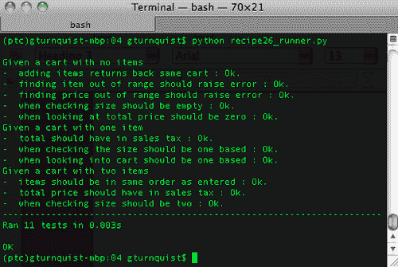
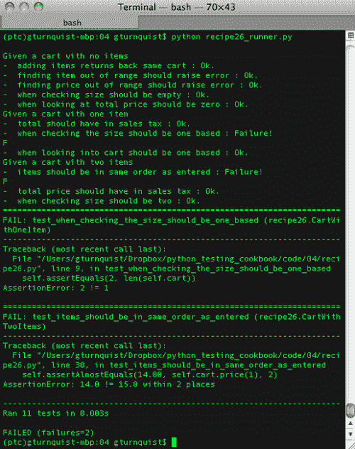
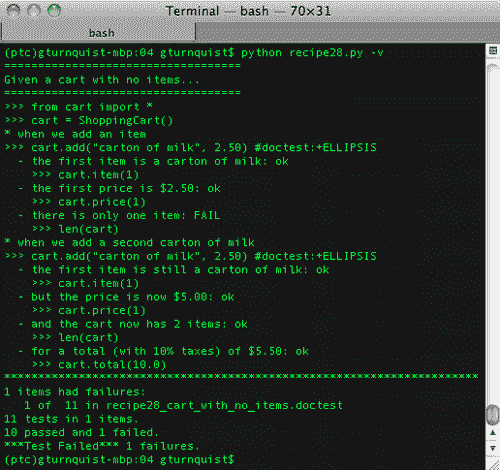
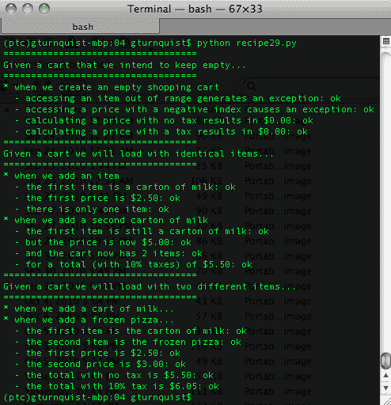
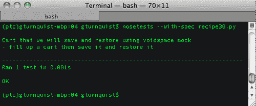
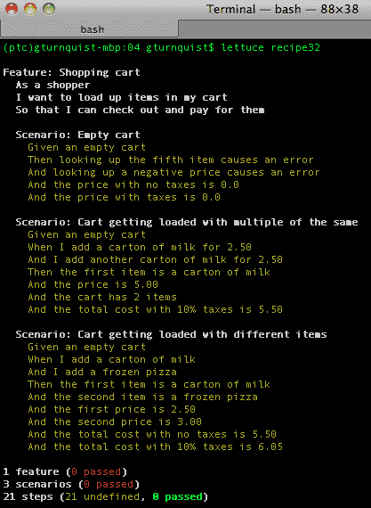
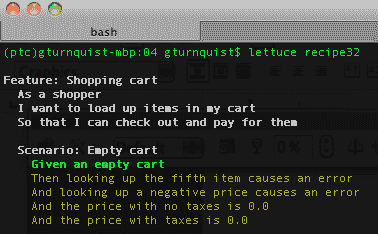
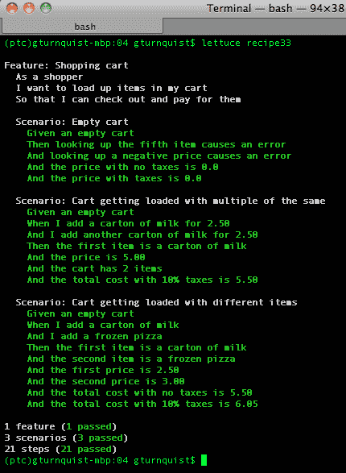

# 四、使用行为驱动开发测试客户案例

在本章中，我们将介绍：

*   听起来像句子和案例的命名测试
*   测试单独的`doctest`文件
*   用`doctest`写一个可测试的案例
*   用`doctest`写一部可测试的小说
*   用虚空和鼻子写一个可测试的案例
*   用 mockito 和 nose 写一个可测试的案例
*   用莴苣写一个可测试的案例
*   使用 shouldsl 编写简洁的断言
*   更新项目级脚本以运行本章的 BDD 测试

# 导言

**行为****驱动****发展（BDD）**是针对丹·诺斯**测试****驱动****发展（TDD）**而创建的。它专注于用非程序员可以阅读的自然语言编写自动测试。

> *程序员想知道从哪里开始，测试什么和不测试什么，一次测试多少，如何调用他们的测试，以及如何理解测试失败的原因。*
> 
> *我进入 TDD 的深度越深，我越觉得我自己的旅程不像是一系列的死巷，而是一个逐渐掌握的过程。我记得当时在想，‘要是有人告诉我就好了！’比我想象的要多得多的是，“哇，一扇门开了。”我决定必须能够以一种直达好东西、避免所有陷阱的方式呈现 TDD。*

### 注

欲了解更多有关丹北的信息，请访问：[http://blog.dannorth.net/introducing-bdd](http://blog.dannorth.net/introducing-bdd) 。

我们在之前的 unittest 配方中编写的测试具有`testThis`和`testThat`风格。BDD采取的方法是不再讲程序员 ese，而是转向更面向客户的角度。

Dan North 继续指出 Chris Stevenson 是如何为 Java 的 JUnit 编写一个专门的测试运行程序的，它以不同的方式打印测试结果。让我们看看下面的测试代码：

```py
public class FooTest extends TestCase {
    public void testIsASingleton() {}
    public void testAReallyLongNameIsAGoodThing() {}
}
```

当通过 AgileDox（[运行时，此代码 http://agiledox.sourceforge.net/](http://agiledox.sourceforge.net/) 将按以下格式打印：

```py
Foo
- is a singleton
- a really long name is a good thing
```

AgileDox 做了几件事：

*   打印掉后缀为`Test`的测试名称
*   从每个测试方法中去掉`test`前缀
*   将余数转换为句子

AgileDox是一个 Java 工具，因此我们在本章中将不讨论它。但是有很多 Python 工具可用，我们将介绍一些，包括 doctest、voidspacemock、mockito 和莴苣。所有这些工具都为我们提供了用更自然的语言编写测试的方法，并使客户、QA 和测试团队能够开发基于案例的测试。

### 注

BDD 的所有工具和样式都可以轻松填满整本书。本章旨在介绍 BDD 的原理以及一些用于有效测试系统行为的强大、稳定的工具。

在本章中，让我们对每个菜谱使用相同的购物车应用程序。创建一个名为`cart.py`的文件并添加以下代码。

```py
class ShoppingCart(object):
    def __init__(self):
        self.items = []

    def add(self, item, price):
        for cart_item in self.items:
            # Since we found the item, we increment
            # instead of append
            if cart_item.item == item:
                cart_item.q += 1
                return self

        # If we didn't find, then we append
        self.items.append(Item(item, price))
        return self

    def item(self, index):
        return self.items[index-1].item

    def price(self, index):
        return self.items[index-1].price * self.items[index-1].q

    def total(self, sales_tax):
        sum_price = sum([item.price*item.q for item in self.items])
        return sum_price*(1.0 + sales_tax/100.0)

    def __len__(self):
        return sum([item.q for item in self.items])

class Item(object):
    def __init__(self, item, price, q=1):
        self.item = item
        self.price = price
        self.q = q
```

此购物车：

*   是以一为基础的，表示第一个项目和价格为[`1`而不是[`0`
*   包括具有多个相同项目的功能
*   将计算总价格，然后添加税费

这个应用程序并不复杂。相反，在本章中，它为我们提供了测试各种客户案例和场景的机会，这些案例和场景不一定局限于简单的单元测试。

# 听起来像句子和案例的命名测试

测试方法应该像句子一样阅读，测试用例应该像章节标题一样阅读。这是 BDD 的哲学的一部分，使测试对于非程序员来说更容易阅读。

## 准备好了吗

对于这个配方，我们将使用本章开头显示的购物车应用程序。

## 怎么做。。。

通过以下步骤，我们将探索如何编写一个定制的 nose 插件，将结果格式化为 BDD 样式的报告。

1.  创建一个名为`recipe26.py`的文件来包含我们的测试用例。
2.  创建一个 unittest 测试，其中测试用例表示带有一个项目的购物车，测试方法读起来像句子。

    ```py
    import unittest
    from cart import *

    class CartWithOneItem(unittest.TestCase):
        def setUp(self):
            self.cart = ShoppingCart().add("tuna sandwich", 15.00)

        def test_when_checking_the_size_should_be_one_based(self):
            self.assertEquals(1, len(self.cart))

        def test_when_looking_into_cart_should_be_one_based(self):
            self.assertEquals("tuna sandwich", self.cart.item(1))
            self.assertEquals(15.00, self.cart.price(1))

        def test_total_should_have_in_sales_tax(self):
            self.assertAlmostEquals(15.0*1.0925, \
                                    self.cart.total(9.25), 2)
    ```

3.  添加一个 unittest 测试，其中测试用例表示一个包含两个项目的购物车，测试方法读起来像句子。

    ```py
    class CartWithTwoItems(unittest.TestCase):
        def setUp(self):
            self.cart = ShoppingCart() \
                             .add("tuna sandwich", 15.00) \
                             .add("rootbeer", 3.75)
        def test_when_checking_size_should_be_two(self):
            self.assertEquals(2, len(self.cart))

        def test_items_should_be_in_same_order_as_entered(self):
            self.assertEquals("tuna sandwich", self.cart.item(1))
            self.assertAlmostEquals(15.00, self.cart.price(1), 2)
            self.assertEquals("rootbeer", self.cart.item(2))
            self.assertAlmostEquals(3.75, self.cart.price(2), 2)

        def test_total_price_should_have_in_sales_tax(self):
            self.assertAlmostEquals((15.0+3.75)*1.0925, \
                                    self.cart.total(9.25), 2)
    ```

4.  Add a unittest test where the test case represents a cart with no items, and the test methods read like sentences.

    ```py
    class CartWithNoItems(unittest.TestCase):
        def setUp(self):
            self.cart = ShoppingCart()

        def test_when_checking_size_should_be_empty(self):
            self.assertEquals(0, len(self.cart))

        def test_finding_item_out_of_range_should_raise_error(self):
            self.assertRaises(IndexError, self.cart.item, 2)

        def test_finding_price_out_of_range_should_raise_error(self):
            self.assertRaises(IndexError, self.cart.price, 2)

        def test_when_looking_at_total_price_should_be_zero(self):
            self.assertAlmostEquals(0.0, self.cart.total(9.25), 2)

        def test_adding_items_returns_back_same_cart(self):
            empty_cart = self.cart
            cart_with_one_item = self.cart.add("tuna sandwich", \
                                                            15.00)
            self.assertEquals(empty_cart, cart_with_one_item)
            cart_with_two_items = self.cart.add("rootbeer", 3.75)
            self.assertEquals(empty_cart, cart_with_one_item)
            self.assertEquals(cart_with_one_item, \
                              cart_with_two_items)
    ```

    ### 注

    BDD 鼓励对方法名称使用非常描述性的句子。其中几个方法名称被缩短以适合本书的格式。

5.  创建另一个名为`recipe26_plugin.py`的文件，以包含我们定制的 BDD runner。
6.  创建一个可以用作`–with-bdd`打印结果的 nose 插件。

    ```py
    import sys
    err = sys.stderr

    import nose
    import re
    from nose.plugins import Plugin

    class BddPrinter(Plugin):
        name = "bdd"

        def __init__(self):
            Plugin.__init__(self)
            self.current_module = None
    ```

7.  创建一个处理程序，打印出模块或测试方法，去除无关信息。

    ```py
        def beforeTest(self, test):
            test_name = test.address()[-1]
            module, test_method = test_name.split(".")
            if self.current_module != module:
                self.current_module = module
                fmt_mod = re.sub(r"([A-Z])([a-z]+)", \
                                 r"\1\2 ", module)
                err.write("\nGiven %s" % fmt_mod[:-1].lower())
            message = test_method[len("test"):]
            message = " ".join(message.split("_"))
            err.write("\n- %s" % message)
    ```

8.  为成功、失败和错误消息创建处理程序。

    ```py
        def addSuccess(self, *args, **kwargs):
            test = args[0]
            err.write(" : Ok")

        def addError(self, *args, **kwargs):
            test, error = args[0], args[1]
            err.write(" : ERROR!\n")

        def addFailure(self, *args, **kwargs):
            test, error = args[0], args[1]
            err.write(" : Failure!\n")
    ```

9.  创建一个名为`recipe26_runner.py`的新文件，其中包含一个用于练习此配方的测试运行程序。
10.  创建一个测试运行程序，将测试用例拉入并通过鼻子运行，以易于阅读的方式打印结果。

    ```py
    if __name__ == "__main__":
        import nose
        from recipe26_plugin import *

        nose.run(argv=["", "recipe26", "--with-bdd"], \
                                plugins=[BddPrinter()])
    ```

11.  Run the test runner.

    

12.  在测试用例中引入几个 bug，然后重新运行测试运行程序，看看这会如何改变输出。

    ```py
     def test_when_checking_the_size_should_be_one_based(self):
            self.assertEquals(2, len(self.cart))
    ...
     def test_items_should_be_in_same_order_as_entered(self):
            self.assertEquals("tuna sandwich", self.cart.item(1))
            self.assertAlmostEquals(14.00, self.cart.price(1), 2)
            self.assertEquals("rootbeer", self.cart.item(2))
            self.assertAlmostEquals(3.75, self.cart.price(2), 2)
    ```

13.  Run the tests again.

    

## 它是如何工作的。。。

测试用例以名词形式编写，描述被测试对象。`CartWithTwoItems`描述了一系列以预先填充两个项目的购物车为中心的测试方法。

测试方法就像用下划线而不是空格串成的句子。它们必须以`test_`作为前缀，以便 unittest 将其提取。`test_items_should_be_in_same_order_as_entered`应表示“项目的顺序应与输入的顺序相同”

我们的想法是，我们应该能够通过将这两项放在一起来快速理解正在测试的内容：给定一个包含两个项目的购物车，项目的顺序应该与输入的顺序相同。

虽然我们可以通过这种思维过程来阅读测试代码，在精神上去掉下划线和`test`前缀的粗体，但这可能会成为我们真正的认知负担。为了简化这个过程，我们编写了一个 QuickNose 插件，该插件将驼峰案例测试分割开来，并将下划线替换为空格。这就产生了有用的报告格式。

使用这种快速工具鼓励我们编写详细的测试方法，以便在输出时易于阅读。不仅对我们，而且对我们的测试团队和客户的反馈可以非常有效地促进交流，增强对软件的信心，并有助于生成新的测试案例。

## 还有更多

此处所示的示例测试方法特意缩短，以适合本书的格式。不要试图使它们尽可能短。相反，尝试描述预期的输出。

### 插件无法安装

这个插件是为了快速生成报告而编写的。为了使其可重用，特别是在使用`nosetests`时，您可能需要阅读第 2 章中提到的*运行**自动**测试**套件**和**nose*，以获得有关创建`setup.py`脚本以支持安装的更多详细信息。

## 另见

*将**一个**鼻子**扩展**写入**拾取**测试**基于*基于的*正则**表达式*；和*将**一个**鼻子**扩展**写入**生成**一份*CSV 报告*如*[第二章](2.html "Chapter 2. Running Automated Test Suites with Nose")所述**

 *# 测试单独的 doctest 文档

BDD 不要求我们使用任何特定的工具。相反，它更关注于测试方法。这就是为什么可以使用 Python`doctests`编写 BDD 测试场景的原因。`Doctests`不限于模块代码。通过这个方法，我们将探索创建独立的文本文件来运行 Python 的 doctest 库。

如果这是`doctest`，为什么在前一章的食谱中没有包括它？因为在单独的测试文档中编写一组测试的上下文更符合 BDD 的理念，而不是在使用库时可供内省的可测试的`docstrings`。

## 准备好了吗

对于这个配方，我们将使用本章开头显示的购物车应用程序。

## 怎么做。。。

通过以下步骤，我们将探索在`doctest`文件中捕获各种测试场景，然后运行它们。

1.  Create a file called `recipe27_scenario1.doctest` that contains doctest-style type tests to exercise the shopping cart.

    ```py
    This is a way to exercise the shopping cart
    from a pure text file containing tests.

    First, we need to import the modules
    >>> from cart import *

    Now, we can create an instance of a cart
    >>> cart = ShoppingCart()

    Here we use the API to add an object. Because
    it returns back the cart, we have to deal with
    the output

    >>> cart.add("tuna sandwich", 15.00) #doctest:+ELLIPSIS
    <cart.ShoppingCart object at ...>

    Now we can check some other outputs

    >>> cart.item(1)
    'tuna sandwich'
    >>> cart.price(1)
    15.0
    >>> cart.total(0.0)
    15.0
    ```

    ### 提示

    请注意，文本周围没有引号。

2.  在文件`recipe27_scenario2.doctest`中创建另一个场景，测试购物车的边界。

    ```py
    This is a way to exercise the shopping cart
    from a pure text file containing tests.

    First, we need to import the modules
    >>> from cart import *

    Now, we can create an instance of a cart
    >>> cart = ShoppingCart()

    Now we try to access an item out of range,
    expecting an exception.
    >>> cart.item(5)
    Traceback (most recent call last):
    ...
    IndexError: list index out of range

    We also expect the price method to fail
    in a similar way.
    >>> cart.price(-2)
    Traceback (most recent call last):
    ...
    IndexError: list index out of range
    ```

3.  创建一个名为`recipe27.py`的文件，输入测试运行程序代码，找到以`.doctest`结尾的文件，并通过 doctest 的`testfile`方法运行。

    ```py
    if __name__ == "__main__":
        import doctest
        from glob import glob
        for file in glob("recipe27*.doctest"):
            print "Running tests found in %s" % file
            doctest.testfile(file)
    ```

4.  Run the test suite.

    

5.  Run the test suite with `-v`.

    

## 它是如何工作的。。。

`Doctest`提供了方便的`testfile`函数，该函数将执行纯文本块，就像它包含在 docstring 中一样。这就是为什么与 docstring 中有 doctest 时相比，不需要引用。文本文件不是文档字符串。

事实上，如果我们在文本周围加上三重引号，测试将无法正常工作。让我们将第一个场景`"""`放在文件的顶部和底部，并将其保存为`recipe27_bad_scenario.txt`。然后，让我们创建一个名为`recipe27_bad.py`的文件，并创建一个运行糟糕场景的备用测试运行程序。

```py
if __name__ == "__main__":
    import doctest
    doctest.testfile("recipe27_bad_scenario.txt")
```

我们收到以下错误消息：


它混淆了尾端三重引号作为预期输出的一部分。最好是把他们排除在外。

## 还有更多。。。

将`docstrings`移动到不同的文件中有什么好处？这难道不是我们在*创建**可测试的**文档**和[第 3 章](3.html "Chapter 3. Creating Testable Documentation with doctest")中讨论的**博士*配方时所做的事情吗？是和否。是的，技术上是一样的：`doctest`练习嵌入测试中的代码块。

但 BDD 不仅仅是一个技术解决方案。受*客户可读场景*理念驱动。BDD 旨在测试系统的行为。行为通常由面向客户的场景定义。当我们的客户能够轻松理解我们捕获的场景时，强烈建议掌握这些场景。当客户能够看到通过和失败的情况，进而看到已完成工作的实际状态时，它会得到进一步增强。

通过将我们的测试场景与代码分离并将其放入单独的文件中，我们有了使用`doctest`为客户制作可读测试的关键要素。

### 这难道不违背 docstring 的可用性吗？

在[第 3 章](3.html "Chapter 3. Creating Testable Documentation with doctest")中，有几个方法表明在`docstrings`中嵌入代码使用示例是多么方便。它们很方便，因为我们可以从交互式 Python shell 中读取`docstrings`。您认为将其中一些内容从代码中提取到单独的场景文件有什么不同？你认为在`docstrings`中有一些`doctests`会有用，而在单独的场景文件中，其他`doctests`会更好地为我们服务吗？

# 用 doctest 写一个可测试的案例

在`doctest`文件中捕获一个简洁的案例是 BDD 的关键。BDD 的另一个方面是提供包含结果的可读报告。

## 准备好了吗

对于这个配方，我们将使用本章开头显示的购物车应用程序。

## 怎么做。。。

通过以下步骤，我们将了解如何编写定制的`doctest`跑步者来制作我们自己的报告。

1.  创建一个名为`recipe28_cart_with_no_items.doctest`的新文件来包含我们的`doctest`场景。
2.  创建一个`doctest`场景来练习购物车。

    ```py
    This scenario demonstrates a testable story.

    First, we need to import the modules
    >>> from cart import *

    >>> cart = ShoppingCart()

    #when we add an item
    >>> cart.add("carton of milk", 2.50) #doctest:+ELLIPSIS
    <cart.ShoppingCart object at ...>

    #the first item is a carton of milk
    >>> cart.item(1)
    'carton of milk'

    #the first price is $2.50
    >>> cart.price(1)
    2.5
    #there is only one item
    >>> len(cart)
    1

    This shopping cart lets us grab more than one
    of a particular item.
    #when we add a second carton of milk
    >>> cart.add("carton of milk", 2.50) #doctest:+ELLIPSIS
    <cart.ShoppingCart object at ...>

    #the first item is still a carton of milk
    >>> cart.item(1)
    'carton of milk'

    #but the price is now $5.00
    >>> cart.price(1)
    5.0

    #and the cart now has 2 items
    >>> len(cart)
    2

    #for a total (with 10% taxes) of $5.50
    >>> cart.total(10.0)
    5.5
    ```

3.  创建一个名为`recipe28.py`的新文件，以包含我们定制的`doctest`runner。
4.  通过子类化`DocTestRunner`创建客户`doctest`跑步者。

    ```py
    import doctest.

    class BddDocTestRunner(doctest.DocTestRunner):
        """
        This is a customized test runner. It is meant
        to run code examples like DocTestRunner,
        but if a line preceeds the code example
        starting with '#', then it prints that
        comment.

        If the line starts with '#when', it is printed
        out like a sentence, but with no outcome.

        If the line starts with '#', but not '#when'
        it is printed out indented, and with the
        outcome.
        """
    ```

5.  添加一个`report_start`函数，在示例前查找以`#`开头的注释。

    ```py
        def report_start(self, out, test, example):
            prior_line = example.lineno-1
            line_before = test.docstring.splitlines()[prior_line]
            if line_before.startswith("#"):
                message = line_before[1:]
                if line_before.startswith("#when"):
                    out("* %s\n" % message)
                    example.silent = True
                    example.indent = False
                else:
                    out("  - %s: " % message)
                    example.silent = False
                    example.indent = True
            else:
                example.silent = True
                example.indent = False
            doctest.DocTestRunner(out, test, example)
    ```

6.  增加一个`report_success`函数，有条件打印出`ok`。

    ```py
        def report_success(self, out, test, example, got):
            if not example.silent:
                out("ok\n")
            if self._verbose:
                if example.indent: out("    ")
                out(">>> %s\n" % example.source[:-1])
    ```

7.  添加一个`report_failure`函数，有条件地打印出`FAIL`。

    ```py
        def report_failure(self, out, test, example, got):
            if not example.silent:
                out("FAIL\n")
            if self._verbose:
                if example.indent: out("    ")
                out(">>> %s\n" % example.source[:-1])
    ```

8.  添加一个运行程序，用我们的客户运行程序替换`doctest.DocTestRunner`，然后查找要运行的 doctest 文件。

    ```py
    if __name__ == "__main__":
        from glob import glob

        doctest.DocTestRunner = BddDocTestRunner

        for file in glob("recipe28*.doctest"):
            given = file[len("recipe28_"):]
            given = given[:-len(".doctest")]
            given = " ".join(given.split("_"))
            print "==================================="
            print "Given a %s..." % given
            print "==================================="
            doctest.testfile(file)
    ```

9.  Use the runner to exercise our scenario.

    

10.  Use the runner to exercise our scenario with `-v`.

    

11.  Alter the test scenario so that one of the expected outcomes fails.

    ```py
    #there is only one item
    >>> len(cart)
    4668
    ```

    ### 注

    请注意，我们已将预期结果从`1`更改为`4668`，以保证失败。

12.  Use the runner with `-v` again, and see the results.

    

## 它是如何工作的。。。

`Doctest`提供了编写可测试场景的便捷方法。首先，我们编写了一系列我们希望购物车应用程序能够证明的行为。为了改进内容，我们添加了许多详细的注释，以便任何阅读本文的人都能清楚地理解内容。

这为我们提供了一个可测试的场景。然而，它让我们缺少一件关键的事情：*一份**简洁的**报告*。

不幸的是，`doctest`不会为我们打印所有这些详细的评论。

为了从 BDD 的角度使其可用，我们需要能够嵌入在测试序列运行时打印出来的选择性注释。为此，我们将子类化`doctest.DocTestRunner`并插入我们的`docstring`处理版本。

## 还有更多。。。

`DocTestRunner`方便地为我们提供了`docstring`的句柄以及代码示例开始的确切行号。我们对我们的`BddDocTestRunner`进行编码，以查看它前面的行，并检查它是否以`#`开头，这是我们在测试运行期间打印文本的自定义标记。

`#when`注释被视为原因。换言之，当引起一个或多个*效应*时的*。当*时`doctest`仍会验证*涉及的代码；出于 BDD 的目的，我们并不真正关心结果，所以我们默默地忽略它。*

任何其他`#`意见均视为*影响*。对于其中的每一个，我们去掉`#`，然后打印缩进的句子，这样我们就可以很容易地看到与哪个*绑定。最后，我们打印出`ok`或`FAIL`来显示结果。*

这意味着我们可以将所有需要的细节添加到文档中。但对于测试块，我们可以添加将打印为*原因*（`#when`）或*影响*（`#anything else`）的语句。

# 用博士学位写一部可测试的小说

运行一系列案例测试可以展示代码的预期行为。我们之前在*撰写**一篇**可测试**案例**和**博士测试*配方中看到了如何构建一个可测试案例并让它生成有用的报告。

有了这个配方，我们将看到如何使用这个策略将多个可测试的案例串在一起，形成一个可测试的小说。

## 准备好了吗

对于这个配方，我们将使用本章开头显示的购物车应用程序。

我们还将在本章的*写作**a**可测试**案例**与**博士测试*配方中重复使用`BddDocTestRunner`。但我们将在以下步骤中对其稍作修改。

## 怎么做。。。

通过以下步骤，我们将了解如何编写可测试小说：

1.  创建一个名为`recipe29.py`的新文件。
2.  将*将**a**可测试**案例**中包含`BddDocTestRunner`的代码与**博士测试*配方复制到`recipe29.py`中。
3.  将`__main__`运行状态更改为仅搜索此配方的`doctest`场景。

    ```py
    if __name__ == "__main__":
        from glob import glob

        doctest.DocTestRunner = BddDocTestRunner

     for file in glob("recipe29*.doctest"):
     given = file[len("recipe29_"):]
            given = given[:-len(".doctest")]
            given = " ".join(given.split("_"))
            print "==================================="
            print "Given a %s..." % given
            print "==================================="
            doctest.testfile(file)
    ```

4.  创建一个名为`recipe29_cart_we_will_load_with_identical_items.doctest`的新文件。
5.  添加一个场景，通过添加同一对象的两个实例来测试购物车。

    ```py
    >>> from cart import *

    >>> cart = ShoppingCart()

    #when we add an item
    >>> cart.add("carton of milk", 2.50) #doctest:+ELLIPSIS
    <cart.ShoppingCart object at ...>

    #the first item is a carton of milk
    >>> cart.item(1)
    'carton of milk'

    #the first price is $2.50
    >>> cart.price(1)
    2.5

    #there is only one item
    >>> len(cart)
    1

    This shopping cart let's us grab more than one
    of a particular item.
    #when we add a second carton of milk
    >>> cart.add("carton of milk", 2.50) #doctest:+ELLIPSIS
    <cart.ShoppingCart object at ...>

    #the first item is still a carton of milk
    >>> cart.item(1)
    'carton of milk'

    #but the price is now $5.00
    >>> cart.price(1)
    5.0

    #and the cart now has 2 items
    >>> len(cart)
    2

    #for a total (with 10% taxes) of $5.50
    >>> cart.total(10.0)
    5.5
    ```

6.  创建另一个名为`recipe29_cart_we_will_load_with_two_different_items.docstest`的文件。
7.  在该文件中，创建另一个场景，通过添加两个不同的实例来测试购物车。

    ```py
    >>> from cart import *

    >>> cart = ShoppingCart()

    #when we add a carton of milk...
    >>> cart.add("carton of milk", 2.50) #doctest:+ELLIPSIS
    <cart.ShoppingCart object at ...>

    #when we add a frozen pizza...
    >>> cart.add("frozen pizza", 3.00) #doctest:+ELLIPSIS
    <cart.ShoppingCart object at ...>

    #the first item is the carton of milk
    >>> cart.item(1)
    'carton of milk'

    #the second item is the frozen pizza
    >>> cart.item(2)
    'frozen pizza'

    #the first price is $2.50
    >>> cart.price(1)
    2.5

    #the second price is $3.00
    >>> cart.price(2)
    3.0

    #the total with no tax is $5.50
    >>> cart.total(0.0)
    5.5

    #the total with 10% tax is $6.05
    >>> print round(cart.total(10.0), 2)
    6.05
    ```

8.  创建一个名为`recipe29_cart_that_we_intend_to_keep_empty.doctest`的新文件。
9.  在该文件中，创建第三个场景，通过不添加任何内容来测试购物车，但尝试访问范围之外的值。

    ```py
    >>> from cart import *

    #when we create an empty shopping cart
    >>> cart = ShoppingCart()

    #accessing an item out of range generates an exception
    >>> cart.item(5)
    Traceback (most recent call last):
    ...
    IndexError: list index out of range

    #accessing a price with a negative index causes an exception
    >>> cart.price(-2)
    Traceback (most recent call last):
    ...
    IndexError: list index out of range

    #calculating a price with no tax results in $0.00
    >>> cart.total(0.0)
    0.0

    #calculating a price with a tax results in $0.00
    >>> cart.total(10.0)
    0.0
    ```

10.  Use the runner to execute our scenarios.

    

## 它是如何工作的。。。

我们重用在前面的配方中开发的测试运行程序。关键是扩展场景，以确保我们完全覆盖预期场景。

我们需要确保我们能够处理：

*   有两个相同物品的手推车
*   有两种不同物品的手推车
*   空购物车的堕落状况

## 还有更多。。。

编写测试的一个重要部分是选择有用的名称。在我们的情况下，每个可测试的案例都是从一辆空马车开始的。但是，如果我们将每个场景命名为“给定一个空购物车”，则会导致重叠，并不会生成非常有效的报告。

因此，我们取而代之的是根据我们案例的意图来命名它们：

```py
recipe29_cart_we_will_load_with_identical_items.doctest
recipe29_cart_we_will_load_with_two_different_items.doctest
recipe29_cart_that_we_intend_to_keep_empty.doctest
```

这导致：

*   给定一个购物车，我们将装载相同的物品
*   给定一辆购物车，我们将装载两种不同的物品
*   给了一辆我们打算空着的车

这些场景的目的要清楚得多。

命名场景很像软件开发的某些方面，与其说是一门科学，不如说是一门手艺。调整性能往往更科学，因为它涉及一个迭代的测量和调整过程。但命名场景及其因果往往更像是一门手艺。它涉及到与包括 QA 和客户在内的所有利益相关者的沟通，因此每个人都可以阅读和理解案例。

### 提示

**不要害怕。准备好迎接变化**

开始写你的案例。让他们工作。然后与利益相关者分享。反馈很重要，这也是使用基于案例的测试的目的。

做好接受批评和建议修改的准备。准备好接受更多的案例请求。事实上，如果你的一些客户或 QA 想要写他们自己的案例，不要感到惊讶。这是一个积极的迹象。

如果你对这种类型的客户互动还不熟悉，别担心。您将培养宝贵的沟通技能，并与利益相关者建立牢固的专业关系。同时，您的代码质量肯定会提高。

# 用虚空和鼻子写一个可测试的案例

当我们的代码通过方法和属性与其他类交互时，这些类被称为协作者。使用**空隙空间模拟**[模拟合作者 http://www.voidspace.org.uk/python/mock](http://www.voidspace.org.uk/python/mock) （由 Michael Foord 创建）为 BDD 提供了一个关键工具。与存根相比，mock 提供了一种提供屏蔽行为的方法，存根提供屏蔽状态。虽然 mock本身并没有定义 BDD，但它们的用法与 BDD 的思想有着明显的重叠。

为了进一步证明测试的行为性质，我们还将使用在**皮诺曹**项目（[中找到的**规范**鼻插件http://darcs.idyll.org/~t/projects/pinocchio/doc](http://darcs.idyll.org/~t/projects/pinocchio/doc)。

### 注

正如项目网站上所述，Voidspace Mock 是实验性的。本书使用 0.7.0 beta 3 版编写。在达到稳定的 1.0 版本之前，可能会发生更多 API 更改。考虑到这个项目的高质量、优秀的文档以及博客圈中的许多文章，我强烈认为它应该在这本书中占有一席之地。

## 准备好了吗

对于这个配方，我们将使用本章开头所示的购物车应用程序进行一些轻微的修改。

1.  创建一个名为`recipe30_cart.py`的新文件，并复制本章引言中创建的`cart.py`中的所有代码。
2.  更改`__init__`以添加用于持久性的额外`storer`属性。

    ```py
    class ShoppingCart(object):
        def __init__(self, storer=None):
            self.items = []
            self.storer = storer
    ```

3.  添加使用`storer`保存购物车的`store`方法。

    ```py
        def store(self):
            return self.storer.store_cart(self)
    ```

4.  添加一个`retrieve`方法，使用`storer`更新内部`items`。

    ```py
        def restore(self, id):
            self.items = self.storer.retrieve_cart(id).items
            return self
    ```

### 注

`storer`的 API 细节将在本配方中进一步说明。

我们需要激活虚拟环境，然后为此配方安装 Voidspace Mock。

1.  Create a virtual environment, activate it, and verify the tools are working.

    

2.  通过键入`pip``install``mock`安装`voidspace``mock`。
3.  输入`pip install`[安装`pinocchio`的最新版本 http://darcs.idyll.org/~t/projects/pinocchio-latest.tar.gz](http://darcs.idyll.org/~t/projects/pinocchio-latest.tar.gz)。
4.  `pinocchio`的这个版本提出了一些警告。为了防止它们，我们还需要通过键入`pip install figleaf`来安装`figleaf`。

## 怎么做。。。

通过以下步骤，我们将探索如何使用 mock 编写可测试的案例：

1.  在`recipe30_cart.py`中，创建一个`DataAccess`类，其中包含存储和检索购物车的空方法。

    ```py
    class DataAccess(object):
        def store_cart(self, cart):
            pass

        def retrieve_cart(self, id):
            pass
    ```

2.  创建一个名为`recipe30.py`的新文件来编写测试代码。
3.  创建一个自动单元测试，通过模拟`DataAccess`的方法来练习购物车。

    ```py
    import unittest
    from copy import deepcopy
    from recipe30_cart import *
    from mock import Mock

    class CartThatWeWillSaveAndRestoreUsingVoidspaceMock(unittest.TestCase):
        def test_fill_up_a_cart_then_save_it_and_restore_it(self):
            # Create an empty shopping cart
            cart = ShoppingCart(DataAccess())

            # Add a couple of items
            cart.add("carton of milk", 2.50)
            cart.add("frozen pizza", 3.00)

            self.assertEquals(2, len(cart))

            # Create a clone of the cart for mocking
            # purposes.
            original_cart = deepcopy(cart)

            # Save the cart at this point in time into a database
            # using a mock
            cart.storer.store_cart = Mock()
            cart.storer.store_cart.return_value = 1
            cart.storer.retrieve_cart = Mock()
            cart.storer.retrieve_cart.return_value = original_cart

            id = cart.store()

            self.assertEquals(1, id)

            # Add more items to cart
            cart.add("cookie dough", 1.75)
            cart.add("ginger ale", 3.25)

            self.assertEquals(4, len(cart))

            # Restore the cart to the last point in time
            cart.restore(id)

            self.assertEquals(2, len(cart))

            cart.storer.store_cart.assert_called_with(cart)
            cart.storer.retrieve_cart.assert_called_with(1)
    ```

4.  Run the test using `nosetests` with the `spec` plugin.

    

## 它是如何工作的。。。

mock 是确认方法调用的双重测试，这就是“行为”。这与存根不同，存根提供固定数据，允许我们确认状态。

许多模拟库基于*录制/重播*模式。他们首先要求测试用例*记录*在使用模拟时将要经历的每个行为。然后我们将 mock 插入到代码中，允许代码调用针对它的调用。最后，我们执行*replay*，模拟库将我们预期的方法调用与实际发生的方法调用进行比较。

记录/重播模拟的一个常见问题是，如果我们错过了一个方法调用，测试就会失败。当试图模拟第三方系统或处理可能与复杂系统状态相关的变量调用时，捕获所有方法调用可能变得非常困难。

Voidspace 模拟库的不同之处在于使用了*动作/断言*模式。我们首先生成一个 mock，并定义我们希望它如何对某些*动作*做出反应。然后，我们将其插入我们的代码中，允许我们的代码对其进行操作。最后，我们*断言*模拟发生了什么，只挑选我们关心的操作。没有要求断言模拟所经历的每个行为。

为什么这很重要？Record/replay 要求我们记录由代码、第三方系统和调用链中所有其他层进行的方法调用。坦率地说，我们可能不需要这种程度的行为确认。通常，我们主要对交互的顶层感兴趣。Action/assert 可以减少我们关心的行为调用。我们可以设置我们的模拟来生成必要的顶级操作，并且基本上忽略较低级别的调用，记录/重播模拟会迫使我们记录这些调用。

在这个配方中，我们模拟了`DataAccess`操作`store_cart`和`retrieve_cart`。我们定义了他们的`return_value`，在测试结束时，我们断言他们被调用了。

```py
        cart.storer.store_cart.assert_called_with(cart)
        cart.storer.retrieve_cart.assert_called_with(1)
```

`cart.storer`是我们在模拟中注入的内部属性。

### 提示

**模拟****a****方法**：这意味着将对真实方法的调用替换为对模拟对象的调用。

**存根****a****方法**：这意味着将对实方法的调用替换为对存根的调用。

## 还有更多。。。

因为这个测试用例的重点是从购物车的角度存储和检索，所以我们不必定义真正的`DataAccess`调用。这就是为什么我们在他们的方法定义中简单地加入了`pass`。

这使我们可以方便地处理持久性行为，而不必强迫我们选择是否将购物车存储在关系数据库、`NoSQL`数据库、平面文件或任何其他文件格式中。这表明我们的购物车和数据持久性很好地解耦了。

### 告诉我更多关于 spec nose 插件的信息！

我们很快浏览了有用的`spec`鼻子插件。它提供了我们在*命名**测试**中手工编码的基本功能，所以**它们**声音**类似**句子**和*【T18 案例部分。它将测试用例名称和测试方法名称转换为可读的结果。它给了我们一个可运行的`spec`。这个插件与 unittest 一起工作，并不关心我们是否使用了 Voidspace Mock。

### 为什么我们不重用配方“命名测试”中的插件，让它们听起来像句子和案例？

另一种表达这个问题的方式是，‘为什么我们首先要编写这个配方的插件？使用测试工具的一个重要方面是了解它们是如何工作的，以及如何编写我们自己的扩展。*命名**测试**所以*他们**声音**像**句子**和**案例*部分不仅讨论了命名测试的哲学，但也探索了编写鼻插件以支持这一需求的方法。在这个配方中，我们的重点是使用 voidspacemock 来验证某些行为，而不是编码 nose 插件。现有的`spec`插件可以轻松地生成一个漂亮的 BDD 报告。*

## 另见

用 mockito 和 nose 写一个可测试的案例

# 用莫基托和鼻子写一个可测试的案例

当我们的代码通过方法和属性与其他类交互时，这些类被称为协作者。使用**mockito**[模拟合作者 http://code.google.com/p/mockito](http://code.google.com/p/mockito) 和[http://code.google.com/p/mockito-python](http://code.google.com/p/mockito-python) 为 BDD 提供了一个关键工具。与存根相比，mock 提供了一种提供固定行为的方法，存根提供固定状态。虽然 mock 本身并没有定义 BDD，但它们的用法与 BDD 的思想有很大的重叠。

为了进一步证明测试的行为性质，我们还将使用皮诺奇项目中发现的`spec`鼻插件（[http://darcs.idyll.org/~t/projects/pinocchio/doc](http://darcs.idyll.org/~t/projects/pinocchio/doc)。

## 准备好了吗

对于这个配方，我们将使用本章开头所示的购物车应用程序进行一些轻微的修改。

1.  创建一个名为`recipe31_cart.py`的新文件，并复制本章引言中创建的`cart.py`中的所有代码。
2.  更改`__init__`以添加用于持久性的额外`storer`属性。

    ```py
    class ShoppingCart(object):
        def __init__(self, storer=None):
            self.items = []
            self.storer = storer
    ```

3.  添加使用`storer`保存购物车的`store`方法。

    ```py
        def store(self):
            return self.storer.store_cart(self)
    ```

4.  添加一个`retrieve`方法，使用`storer`更新内部`items`。

    ```py
        def restore(self, id):
            self.items = self.storer.retrieve_cart(id).items
            return self
    ```

`storer`的 API 细节将在本配方中进一步说明。

我们需要激活我们的虚拟环境，然后为此配方安装`mockito`。

1.  Create a virtual environment, activate it, and verify the tools are working:

    

2.  通过键入`pip install mockito`安装`mockito`。

安装`pinocchio`和`figleaf`和的步骤与*编写可测试的案例的步骤相同，其中使用了 Voidspace Mock 和 nose*配方。

## 怎么做。。。

通过以下步骤，我们将探索如何使用模拟来编写可测试的案例：

1.  在`recipe31_cart.py`中，创建一个`DataAccess`类，该类包含存储和检索购物车的空方法。

    ```py
    class DataAccess(object):
        def store_cart(self, cart):
            pass

        def retrieve_cart(self, id):
            pass
    ```

2.  创建一个名为`recipe31.py`的新文件，用于编写测试代码。
3.  创建一个自动单元测试，通过模拟`DataAccess`的方法来练习 cart。

    ```py
    import unittest
    from copy import deepcopy
    from recipe31_cart import *
    from mockito import *

    class CartThatWeWillSaveAndRestoreUsingMockito(unittest.TestCase):
        def test_fill_up_a_cart_then_save_it_and_restore_it(self):
            # Create an empty shopping cart
            cart = ShoppingCart(DataAccess())

            # Add a couple of items
            cart.add("carton of milk", 2.50)
            cart.add("frozen pizza", 3.00)

            self.assertEquals(2, len(cart))

            # Create a clone of the cart for mocking
            # purposes.
            original_cart = deepcopy(cart)

            # Save the cart at this point in time into a database
            # using a mock
            cart.storer = mock()

            when(cart.storer).store_cart(cart).thenReturn(1)
            when(cart.storer).retrieve_cart(1). \
                                   thenReturn(original_cart)

            id = cart.store()

            self.assertEquals(1, id)

            # Add more items to cart
            cart.add("cookie dough", 1.75)
            cart.add("ginger ale", 3.25)

            self.assertEquals(4, len(cart))

            # Restore the cart to the last point in time
            cart.restore(id)

            self.assertEquals(2, len(cart))

            verify(cart.storer).store_cart(cart)
            verify(cart.storer).retrieve_cart(1)
    ```

4.  Run the test using `nosetests` with the `spec` plugin.

    

## 它是如何工作的。。。

此配方非常类似于早期配方*编写**a**可测试的**案例**，带有**空隙空间**模拟**和**鼻子*。有关模仿的详细信息以及 BDD 的好处，阅读该食谱非常有用。

让我们比较一下 Voidspace Mock 和 mockito 的语法，以了解它们的区别。请看下面的 voidspace 模拟代码块。

```py
        cart.storer.store_cart = Mock()
        cart.storer.store_cart.return_value = 1
        cart.storer.retrieve_cart = Mock()
        cart.storer.retrieve_cart.return_value = original_cart
```

显示正在模拟的功能`store_cart`。

```py
        cart.storer = mock()

        when(cart.storer).store_cart(cart).thenReturn(1)
        when(cart.storer).retrieve_cart(1). \
                               thenReturn(original_cart)
```

Mockito 通过模拟整个`storer`对象来实现这一点。Mockito 起源于一个 Java 模拟工具，它解释了它的 Java-ish API（如`thenReturn`）与 voidspace-mock 的 Pythonic 风格的`return_value`相比的原因。

有些人觉得 Java 对 Python 实现 mockito 的影响令人厌恶。坦率地说，我认为这还不足以成为放弃图书馆的理由。在上一个示例中，mockito 以更简洁的方式记录所需的行为，这肯定会抵消类似 Java 的 API。

## 另见

用虚空和鼻子写一个可测试的案例

# 用莴苣写一个可测试的案例

**生菜**[http://lettuce.it](http://lettuce.it) 是一个为 Python 构建的类似黄瓜的 BDD 工具。

黄瓜（[http://cukes.info](http://cukes.info) 是由 Ruby 社区开发的，它提供了一种以文本形式编写场景的方法。通过让我们的利益相关者阅读这些案例，他们可以很容易地辨别出软件的预期用途。

这个菜谱展示了如何安装莴苣，编写一个测试案例，然后将它连接到我们的购物车应用程序中来练习我们的代码。

## 准备好了吗

对于这个配方，我们将使用本章开头显示的购物车应用程序。我们还需要安装莴苣及其依赖项。

通过键入`pip install lettuce`安装莴苣。

## 怎么做。。。

在以下步骤中，我们将探索使用莴苣创建一些可测试的案例，并将其连接到可运行的 Python 代码：

1.  创建一个名为`recipe32`的新文件夹，以包含此配方中的所有文件。
2.  创建一个名为`recipe32.feature`的文件来捕获我们的案例。根据我们的购物车，编写新功能的顶层描述。

    ```py
    Feature: Shopping cart
      As a shopper
      I want to load up items in my cart
      So that I can check out and pay for them
    ```

3.  让我们首先创建一个场景，捕获购物车为空时的行为。

    ```py
        Scenario: Empty cart
          Given an empty cart
          Then looking up the fifth item causes an error
          And looking up a negative price causes an error
          And the price with no taxes is $0.00
          And the price with taxes is $0.00
    ```

4.  添加另一个场景，显示添加牛奶盒时发生的情况。

    ```py
        Scenario: Cart getting loaded with multiple of the same
          Given an empty cart
          When I add a carton of milk for $2.50
          And I add another carton of milk for $2.50
          Then the first item is a carton of milk
          And the price is $5.00
          And the cart has 2 items
          And the total cost with 10% taxes is $5.50
    ```

5.  添加第三个场景，展示当我们将一盒牛奶和一个冷冻比萨饼混合在一起时会发生什么。

    ```py
        Scenario: Cart getting loaded with different items
          Given an empty cart
          When I add a carton of milk
          And I add a frozen pizza
          Then the first item is a carton of milk
          And the second item is a frozen pizza
          And the first price is $2.50
          And the second price is $3.00
          And the total cost with no taxes is $5.50
          And the total cost with 10% taes is $6.05
    ```

6.  Let's run the story through Lettuce to see what the outcome is, considering we haven't linked this story to any Python code. In the following screenshot, it's impossible to discern the color of the outputs. The feature and scenario declarations are white. **Given**, **When**, and **Then** are undefined and colored yellow. This shows that we haven't tied the steps to any code yet.

    

7.  在`recipe32` 中创建一个名为`steps.py`的新文件，以实现支持 Givens 所需的步骤。
8.  在`steps.py`中添加一些代码来实现第一个给定的。

    ```py
    from lettuce import *
    from cart import *

    @step("an empty cart")
    def an_empty_cart(step):
        world.cart = ShoppingCart()
    ```

9.  To run the steps, we need to make sure the current path that contains the `cart.py` module is part of our *PYTHONPATH*.

    ### 提示

    对于 Linux 和 Mac OSX 系统，键入`export PYTHONPATH=/path/to/cart.py`。

    对于 Windows，进入**控制面板【系统】高级**，点击**环境变量**，编辑现有`PYTHONPATH`变量或添加新变量，指向包含`cart.py`的文件夹。

10.  Run the stories again. It's hard to see in the following screenshot, but **Given an empty cart** is now green.

    

    ### 注

    虽然此屏幕截图只关注第一个场景，但所有三个场景都有相同的提示。我们编写的代码满足了所有三个 Givens。

11.  在`steps.py`中添加代码，实现对第一个场景*和*的支持。

    ```py
    @step("looking up the fifth item causes an error")
    def looking_up_fifth_item(step):
        try:
            world.cart.item(5)
            raise AssertionError("Expected IndexError")
        except IndexError, e:
            pass

    @step("looking up a negative price causes an error")
    def looking_up_negative_price(step):
        try:
            world.cart.price(-2)
            raise AssertionError("Expected IndexError")
        except IndexError, e:
            pass

    @step("the price with no taxes is (.*)")
    def price_with_no_taxes(step, total):
        assert world.cart.total(0.0) == float(total)

    @step("the price with taxes is (.*)")
    def price_with_taxes(step, total):
        assert world.cart.total(10.0) == float(total)
    ```

12.  Run the stories again and notice how the first scenario is completely passing.

    

13.  现在将代码添加到`steps.py`以实现第二个场景所需的步骤。

    ```py
    @step("I add a carton of milk for (.*)")
    def add_a_carton_of_milk(step, price):
        world.cart.add("carton of milk", float(price))
    @step("I add another carton of milk for (.*)")
    def add_another_carton_of_milk(step, price):
        world.cart.add("carton of milk", float(price))

    @step("the first item is a carton of milk")
    def check_first_item(step):
        assert world.cart.item(1) == "carton of milk"

    @step("the price is (.*)")
    def check_first_price(step, price):
        assert world.cart.price(1) == float(price)

    @step("the cart has (.*) items")
    def check_size_of_cart(step, num_items):
        assert len(world.cart) == float(num_items)

    @step("the total cost with (.*)% taxes is (.*)")
    def check_total_cost(step, tax_rate, total):
        assert world.cart.total(float(tax_rate)) == float(total)
    ```

14.  最后，在`steps.py`中添加代码，实现最后一个场景所需的步骤。

    ```py
    @step("I add a carton of milk")
    def add_a_carton_of_milk(step):
        world.cart.add("carton of milk", 2.50)

    @step("I add a frozen pizza")
    def add_a_frozen_pizza(step):
        world.cart.add("frozen pizza", 3.00)

    @step("the second item is a frozen pizza")
    def check_the_second_item(step):
        assert world.cart.item(2) == "frozen pizza"

    @step("the first price is (.*)")
    def check_the_first_price(step, price):
        assert world.cart.price(1) == float(price)

    @step("the second price is (.*)")
    def check_the_second_price(step, price):
        assert world.cart.price(2) == float(price)

    @step("the total cost with no taxes is (.*)")
    def check_total_cost_with_no_taxes(step, total):
        assert world.cart.total(0.0) == float(total)

    @step("the total cost with (.*)% taxes is (.*)")
    def check_total_cost_with_taxes(step, tax_rate, total):
        assert round(world.cart.total(float(tax_rate)),2) == \
                                                  float(total)
    ```

15.  Run the story by typing `lettuce recipe32` and see how they are all now passing. In the next screenshot, we have all the tests passing and everything is green.

    

## 它是如何工作的。。。

莴苣使用流行的**给出**/**当**/**然后**风格的 BDD 案例讲述。

*   **吉文斯**：它涉及设置一个场景。这通常包括创建对象。对于我们的每个场景，我们都创建了 ShoppingCart 的一个实例。这与 unittest 的设置方法非常相似。
*   **然后**：它作用于吉文斯。这些是我们希望在场景中执行的操作。我们可以锻炼不止一种。
*   **何时**：包括测试 THNS 的最终结果。在我们的代码中，我们主要使用 Python 断言。在一些情况下，我们需要检测异常，如果预期的异常没有发生，我们用一个`try`-`catch`块将调用包装为一个`throw`。

无论我们在/**之后**/**什么时候**给出的**以什么顺序排列都没有关系。莴苣会记录所有的事情，这样所有的礼物都会首先列出，然后是所有的时间，然后是所有的时间。莴苣通过将连续的 Given/When/Then 翻译成 And 来增加最后的润色，以提高可读性。**

## 还有更多。。。

如果仔细观察其中的一些步骤，您会注意到一些通配符。

```py
@step("the total cost with (.*)% taxes is (.*)")
def check_total_cost(step, tax_rate, total):
    assert world.cart.total(float(tax_rate)) == float(total)
```

`@step`字符串允许我们使用模式匹配器动态获取字符串的部分变量。

*   第一个（`.*`是捕获`tax_rate`的模式
*   第二个（`.*`是捕获`total`的模式

方法定义显示了添加的这两个额外变量。我们可以给他们取任何我们想要的名字。这使我们能够从`recipe32.feature`开始实际驱动测试、数据和所有内容，并且只使用`steps.py`以一种通用的方式将事物联系在一起。

### 提示

需要指出的是，`tax_rate`和`total`中存储的实际值是 Unicode 字符串。因为测试涉及浮点数，我们必须转换变量，否则`assert`会失败。

### 一个案例应该有多复杂？

在这个食谱中，我们把所有的东西都放在一个案例里。我们的案例涉及到各种各样的购物车操作。随着我们编写更多的场景，我们可能会将其扩展为多个案例。这可以追溯到在[第一章](1.html "Chapter 1. Using Unittest To Develop Basic Tests")的*打破**打破**模糊**测试**中讨论的概念**简单**的*部分。如果我们用过多的步骤来重载单个场景，它可能会变得太复杂。如果我们能够可视化一个执行线程，并且在最后很容易验证，那就更好了。

### 不要将接线代码与应用代码混用

该项目的网站展示了一个构建阶乘函数的示例。它在一个文件中既有阶乘函数又有连接。为了演示的目的，这是好的。但对于实际的生产使用，最好将应用程序与布线分离。这鼓励了一个干净的界面并展示了可用性。

### 莴苣使用文件夹效果很好

默认情况下，莴苣会在我们运行它的任何地方寻找一个`features`文件夹，并发现任何以`.feature`结尾的文件。这样它就可以自动找到我们所有的案例并运行它们。

可以使用`-s`或`–-scenarios`覆盖功能目录。

## 另见

*将**分解**模糊**测试**分为**简单**部分[第一章](1.html "Chapter 1. Using Unittest To Develop Basic Tests")中的*部分

# 使用 Should DSL 编写简洁的断言

**生菜**[http://lettuce.it](http://lettuce.it) 是为 Python 构建的 BDD 工具。

**应为****DSL**[http://www.should-dsl.info](http://www.should-dsl.info) 提供了一种更简单的方法来为 Thens 编写断言。

这个食谱展示了如何安装莴苣和 DSL。然后，我们将编写一个测试案例。最后，我们将使用 shouldsl 将其连接到我们的购物车应用程序中，以练习我们的代码。

## 准备好了吗

对于这个配方，我们将使用本章开头显示的购物车应用程序。我们还需要安装莴苣及其依赖项：

*   通过键入`pip install lettuce`安装莴苣
*   通过键入`pip install should_dsl`安装 DSL

## 怎么做。。。

通过以下步骤，我们将使用 shouldsl 在测试案例中编写更简洁的断言：

1.  创建一个名为`recipe33`的新目录，以包含此配方的所有文件。
2.  在`recipe33`中创建一个名为`recipe33.feature`的新文件来包含我们的测试场景。
3.  在`recipe33.feature`中创建一个包含多个场景的案例来练习我们的购物车。

    ```py
    Feature: Shopping cart
      As a shopper
      I want to load up items in my cart
      So that I can check out and pay for them

        Scenario: Empty cart
          Given an empty cart
          Then looking up the fifth item causes an error
          And looking up a negative price causes an error
          And the price with no taxes is 0.0
          And the price with taxes is 0.0

        Scenario: Cart getting loaded with multiple of the same
          Given an empty cart
          When I add a carton of milk for 2.50
          And I add another carton of milk for 2.50
          Then the first item is a carton of milk
          And the price is 5.00
          And the cart has 2 items
          And the total cost with 10% taxes is 5.50

        Scenario: Cart getting loaded with different items
          Given an empty cart
          When I add a carton of milk
          And I add a frozen pizza
          Then the first item is a carton of milk
          And the second item is a frozen pizza
          And the first price is 2.50
          And the second price is 3.00
          And the total cost with no taxes is 5.50
          And the total cost with 10% taxes is 6.05
    ```

4.  使用 DSL 编写一组断言。

    ```py
    from lettuce import *
    from should_dsl import should, should_not
    from cart import *

    @step("an empty cart")
    def an_empty_cart(step):
        world.cart = ShoppingCart()

    @step("looking up the fifth item causes an error")
    def looking_up_fifth_item(step):
        (world.cart.item, 5) |should| throw(IndexError)
    @step("looking up a negative price causes an error")
    def looking_up_negative_price(step):
        (world.cart.price, -2) |should| throw(IndexError)

    @step("the price with no taxes is (.*)")
    def price_with_no_taxes(step, total):
        world.cart.total(0.0) |should| equal_to(float(total))

    @step("the price with taxes is (.*)")
    def price_with_taxes(step, total):
        world.cart.total(10.0) |should| equal_to(float(total))

    @step("I add a carton of milk for 2.50")
    def add_a_carton_of_milk(step):
        world.cart.add("carton of milk", 2.50)

    @step("I add another carton of milk for 2.50")
    def add_another_carton_of_milk(step):
        world.cart.add("carton of milk", 2.50)

    @step("the first item is a carton of milk")
    def check_first_item(step):
        world.cart.item(1) |should| equal_to("carton of milk")

    @step("the price is 5.00")
    def check_first_price(step):
        world.cart.price(1) |should| equal_to(5.0)

    @step("the cart has 2 items")
    def check_size_of_cart(step):
        len(world.cart) |should| equal_to(2)

    @step("the total cost with 10% taxes is 5.50")
    def check_total_cost(step):
        world.cart.total(10.0) |should| equal_to(5.5)

    @step("I add a carton of milk")
    def add_a_carton_of_milk(step):
        world.cart.add("carton of milk", 2.50)

    @step("I add a frozen pizza")
    def add_a_frozen_pizza(step):
        world.cart.add("frozen pizza", 3.00)

    @step("the second item is a frozen pizza")
    def check_the_second_item(step):
        world.cart.item(2) |should| equal_to("frozen pizza")

    @step("the first price is 2.50")
    def check_the_first_price(step):
        world.cart.price(1) |should| equal_to(2.5)

    @step("the second price is 3.00")
    def check_the_second_price(step):
        world.cart.price(2) |should| equal_to(3.0)

    @step("the total cost with no taxes is 5.50")
    def check_total_cost_with_no_taxes(step):
        world.cart.total(0.0) |should| equal_to(5.5)

    @step("the total cost with 10% taxes is (.*)")
    def check_total_cost_with_taxes(step, total):
        world.cart.total(10.0) |should| close_to(float(total), \
                                                delta=0.1)
    ```

5.  Run the story.

    

## 它是如何工作的。。。

之前的食谱（*写了**一个**可测试的**案例**和**莴苣】*展示了莴苣如何工作的更多细节。这个方法演示了如何使用 shouldsl 来做出有用的断言。

为什么我们需要 DSL？我们编写的最简单的检查涉及测试值以确认购物车应用程序的行为。在前面的配方中，我们主要使用 Python 断言。

```py
assert len(context.cart) == 2
```

这很容易理解。DSL 是否应该提供一个简单的替代方案。

```py
len(context.cart) |should| equal_to(2)
```

这看起来有什么不同吗？有些人说是，有些人说不是。它更冗长，对有些人来说更容易阅读。对其他人来说，情况并非如此。

那我们为什么要来这里？因为，DSL 应该不仅仅有`equal_to`。还有很多：

*   `be`：检查身份
*   `contain`、`include`、`be_into`：验证一个对象是否包含或包含另一个对象
*   `be_kind_of`：检查类型
*   `be_like`：使用正则表达式进行检查
*   `be_thrown_by`、`throws`：检查是否引发异常
*   `close_to`：在给定增量的情况下，检查值是否接近
*   `end_with`：检查字符串是否以给定后缀结尾
*   `equal_to`：检查值是否相等
*   `respond_to`：检查对象是否具有给定的属性或方法
*   `start_with`：检查字符串是否以给定前缀开头

还有其他选择，但这提供了一组不同的比较。如果我们想象代码需要编写断言来检查相同的事情，那么事情就会变得更复杂。

例如，让我们考虑确认预期的异常。在前面的配方中，我们需要确认在访问购物车边界之外的物品时抛出了一个`IndexError`。一个简单的 Python`assert`不起作用，所以我们编码了这个模式。

```py
try:
    world.cart.price(-2)
    raise AssertionError("Expected an IndexError")
except IndexError, e:
    pass
```

这又笨重又难看。现在，想象一个更复杂、更现实的系统，在我们想要验证是否抛出了正确的异常的许多测试情况下，必须使用这种模式。这可能很快成为一项昂贵的编码任务。

谢天谢地，DSL 应该将这种异常断言模式转变为一行程序。

```py
(world.cart.price, -2) |should| throw(IndexError)
```

这是明确和简洁的。我们可以立即理解，使用这些参数调用此方法会引发特定的异常。如果没有提出异常，或者提出了不同的异常，它将失败，并向我们提供明确的反馈。

### 提示

如果您注意到，DSL 应该要求将方法调用拆分为一个元组，元组的第一个元素是方法句柄，其余元素是方法的参数。

## 还有更多。。。

在本章列出的示例代码中，我们使用了`|should|`。但 DSL 是否也应该附带`|should_not|`。有时候，我们想要表达的条件最好用一个`|should_not|`来捕捉。结合前面列出的所有匹配者，我们有大量的机会来测试事情，无论是积极的还是消极的。

但别忘了，如果 Python 的简单易读，我们仍然可以使用它。这个想法是要有很多方法来表达相同的行为验证。

## 另见

用莴苣写一个可测试的案例

# 更新项目级脚本以运行本章的 BDD 测试

在本章中，我们开发了几种编写和执行 BDD 测试的策略。这将有助于我们开发新项目。对于任何项目来说，一个非常宝贵的工具就是拥有一个顶级脚本，用于管理打包、捆绑和测试之类的事情。

这个方法展示了如何创建一个命令行项目脚本，该脚本将运行我们在本章中使用各种运行程序创建的所有测试。

## 准备好了吗

对于这个配方，我们需要对本章中的所有配方进行编码。

## 怎么做。。。

通过以下步骤，我们将创建一个项目级脚本，该脚本将运行本章中的所有测试配方。

1.  创建一个名为`recipe34.py`的新文件。
2.  添加使用`getopt`库解析命令行参数的代码。

    ```py
    import getopt
    import logging
    import nose
    import os
    import os.path
    import re
    import sys
    import lettuce
    import doctest
    from glob import glob

    def usage():
        print
        print "Usage: python recipe34.py [command]"
        print
        print "\t--help"
        print "\t--test"
        print "\t--package"
        print "\t--publish"
        print "\t--register"
        print

    try:
        optlist, args = getopt.getopt(sys.argv[1:],
                "h",
               ["help", "test", "package", "publish", "register"])
    except getopt.GetoptError:
        # print help information and exit:
        print "Invalid command found in %s" % sys.argv
        usage()
        sys.exit(2)
    ```

3.  添加一个使用我们定制的鼻子插件`BddPrinter`的测试功能。

    ```py
    def test_with_bdd():
        from recipe26_plugin import BddPrinter

        suite = ["recipe26", "recipe30", "recipe31"]
        print("Running suite %s" % suite)
        args = [""]
        args.extend(suite)
        args.extend(["--with-bdd"])
        nose.run(argv=args, plugins=[BddPrinter()])
    ```

4.  添加一个测试函数，用于练习基于文件的 doctest。

    ```py
    def test_plain_old_doctest():
        for extension in ["doctest", "txt"]:
            for doc in glob("recipe27*.%s" % extension):
                print("Testing %s" % doc)
                doctest.testfile(doc)
    ```

5.  添加一个测试函数，该函数使用定制的`doctest`运行程序执行 doctests。

    ```py
    def test_customized_doctests():
        from recipe28 import BddDocTestRunner

        old_doctest_runner = doctest.DocTestRunner
        doctest.DocTestRunner = BddDocTestRunner

        for recipe in ["recipe28", "recipe29"]:
            for file in glob("%s*.doctest" % recipe):
                given = file[len("%s_" % recipe):]
                given = given[:-len(".doctest")]
                given = " ".join(given.split("_"))
                print("===================================")
                print("%s: Given a %s..." % (recipe, given))
                print( "===================================")
                doctest.testfile(file)
                print
        doctest.DocTestRunner = old_doctest_runner
    ```

6.  添加一个测试函数，用于执行`lettuce`测试。

    ```py
    def test_lettuce_scenarios():
        print("Running suite recipe32")
        lettuce.Runner(os.path.abspath("recipe32"), verbosity=3).run()
        print

        print("Running suite recipe33")
        lettuce.Runner(os.path.abspath("recipe33"), verbosity=3).run()
        print
    ```

7.  添加一个顶级测试函数，该函数运行我们的所有测试函数，并且可以连接到命令行选项。

    ```py
    def test():
        test_with_bdd()
        test_plain_old_doctest()
        test_customized_doctests()
        test_lettuce_scenarios()
    ```

8.  添加一些表示打包、发布和注册选项的额外存根函数。

    ```py
    def package():
        print "This is where we can plug in code to run " + \
              "setup.py to generate a bundle."

    def publish():
        print "This is where we can plug in code to upload " + \
              "our tarball to S3 or some other download site."

    def register():
        print "setup.py has a built in function to " + \
              "'register' a release to PyPI. It's " + \
              "convenient to put a hook in here."
        # os.system("%s setup.py register" % sys.executable)
    ```

9.  添加代码解析命令行选项。

    ```py
    if len(optlist) == 0:
        usage()
        sys.exit(1)

    # Check for help requests, which cause all other
    # options to be ignored.
    for option in optlist:
        if option[0] in ("--help", "-h"):
            usage()
            sys.exit(1)

    # Parse the arguments, in order
    for option in optlist:
        if option[0] in ("--test"):
            test()

        if option[0] in ("--package"):
            package()

        if option[0] in ("--publish"):
            publish()

        if option[0] in ("--register"):
            register()
    ```

10.  Run the script with no options.

    

11.  使用`–test`运行脚本。

    ```py
    (ptc)gturnquist-mbp:04 gturnquist$ python recipe34.py --test
    Running suite ['recipe26', 'recipe30', 'recipe31']
    ...
      Scenario: Cart getting loaded with different items      # recipe33/recipe33.feature:22
        Given an empty cart                                   # recipe33/steps.py:6
        When I add a carton of milk                           # recipe33/steps.py:50
        And I add a frozen pizza                              # recipe33/steps.py:54
        Then the first item is a carton of milk               # recipe33/steps.py:34
        And the second item is a frozen pizza                 # recipe33/steps.py:58
        And the first price is 2.50                           # recipe32/steps.py:69
        And the second price is 3.00                          # recipe33/steps.py:66
        And the total cost with no taxes is 5.50              # recipe33/steps.py:70
        And the total cost with 10% taxes is 6.05             # recipe33/steps.py:74

    1 feature (1 passed)
    3 scenarios (3 passed)
    21 steps (21 passed) 

    ```

12.  Run the script using `–package –publish –register`.

    

## 它是如何工作的。。。

此脚本使用 Python 的`getopt`库。

## 另见

有关如何使用`getopt`以及为什么使用`getopt`、编写项目级脚本的原因以及我们为什么使用`getopt`而不是`optparse`的更多详细信息，请参阅*编写**a**项目级**脚本***让**您*吧*运行**不同的**测试**套件*部分来自[第二章](2.html "Chapter 2. Running Automated Test Suites with Nose")。**