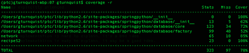
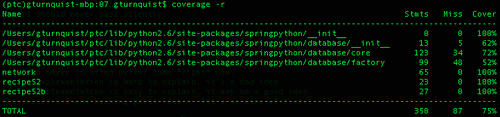
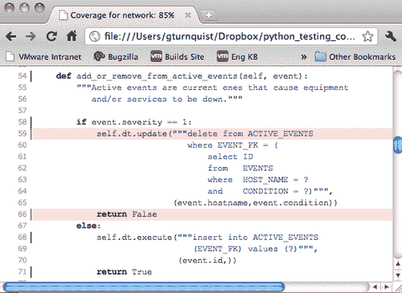
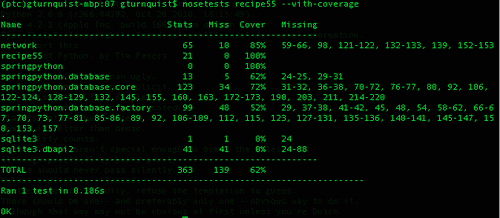
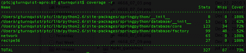
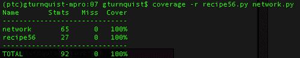
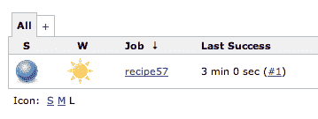
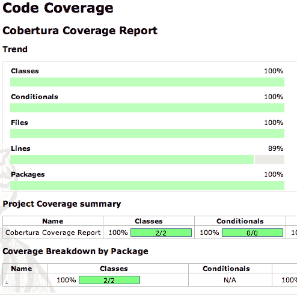

# 七、通过测试覆盖率衡量你的成功

在本章中，我们将介绍：

*   构建网络管理应用程序
*   在测试套件上安装和运行覆盖率
*   使用覆盖率生成 HTML 报告
*   使用覆盖率生成 XML 报告
*   通过报道变得多管闲事
*   从覆盖范围中滤除测试噪声
*   让詹金斯在报道中多管闲事
*   更新项目级脚本以提供覆盖率报告

# 导言

**覆盖****分析**是测量程序中哪些行运行，哪些行不运行。这类分析也称为**代码****覆盖范围**，或者更简单地说是**【覆盖范围】**。

覆盖率分析器可以在生产中运行系统时使用，但是如果我们这样使用它，它的优点和缺点是什么？运行测试套件时使用覆盖率分析器怎么样？与生产中的检查系统相比，这种方法有什么好处？

覆盖率帮助我们了解我们是否充分测试了我们的系统。但它必须带着一定程度的怀疑态度进行。这是因为，即使我们实现了 100%的覆盖率，这意味着我们的系统的每一条线都被使用过，这也不能保证我们没有 bug。一个简单的例子涉及我们编写的代码，它处理的是系统调用的返回值。如果有三个可能的值，但我们只处理其中两个呢？我们可以编写两个测试用例来覆盖我们对它的处理，这当然可以实现 100%的语句覆盖率。然而，这并不意味着我们已经处理了第三个可能的返回值；因此，给我们留下了一个潜在的未被发现的 bug。100%的代码覆盖率也可以通过条件覆盖率获得，但不能通过语句覆盖率实现。我们计划的目标覆盖范围应该是明确的。

另一个关键点是，并非所有的测试都是针对 bug 修复的。另一个关键目的是确保应用程序满足客户的需求。这意味着，即使我们有 100%的代码覆盖率，我们也不能保证我们覆盖了用户期望的所有场景。这就是“正确构建”和“正确构建”之间的区别。

在本章中，我们将探讨构建网络管理应用程序、运行覆盖工具和获取结果的各种方法。我们将讨论覆盖率如何引入噪声，并向我们展示超出我们需要了解的内容，以及在插入代码时引入性能问题。我们还将看到如何删减我们不需要的信息，以获得简洁、有针对性的事物视图。

本章在许多配方中使用了一些第三方工具。

*   Spring Python ([http://springpython.webfactional.com](http://springpython.webfactional.com)) contains many useful abstractions. The one used in this chapter is its DatabaseTemplate, which offers easy ways to write SQL queries and updates without having to deal with Python's verbose API. Install it by typing `pip` `install` `springpython`.

    

*   键入`pip``install``coverage`安装覆盖工具。这可能会失败，因为其他插件可能安装旧版本的 coverage。如果是，请键入`pip``uninstall``coverage`卸载覆盖，然后使用`pip``install``coverage`再次安装。
*   Nose 是[第 2 章](2.html "Chapter 2. Running Automated Test Suites with Nose")*运行**自动**测试套件**和**Nose*中涵盖的一个有用的测试跑步者。有关安装机头的步骤，请参阅该章。

# 构建网络管理应用程序

在本章中，我们将构建一个非常简单的网络管理应用程序，然后编写不同类型的测试并检查其覆盖范围。此网络管理应用程序主要用于消化警报，也称为**网络****事件**。这与某些其他网络管理工具不同，这些工具侧重于从设备收集 SNMP 警报。

为了简单起见，此关联引擎不包含复杂的规则，而是包含网络事件到设备和客户服务库存的简单映射。在接下来的几段中，我们将在深入研究代码的过程中探讨这一点。

## 怎么做。。。

通过以下步骤，我们将构建一个简单的网络管理应用程序。

1.  创建一个名为`network.py`的文件来存储网络应用程序。
2.  创建类定义以表示网络事件。

    ```py
    class Event(object):
        def __init__(self, hostname, condition, severity, event_time):
            self.hostname = hostname
            self.condition = condition
            self.severity = severity
            self.id = -1

        def __str__(self):
            return "(ID:%s) %s:%s - %s" % (self.id, self.hostname, self.condition, self.severity)
    ```

    *   `hostname`：假设所有网络报警都来自具有主机名的设备。
    *   `condition`：表示正在生成的报警类型。同一设备可能会出现两种不同的报警情况。
    *   `severity`：`1`表示清晰的绿色状态；并且`5`表示有故障的红色状态。
    *   `id`：事件存储在数据库中时使用的主键值。
3.  创建一个名为`network.sql`的新文件以包含 SQL 代码。
4.  创建一个 SQL 脚本，用于设置数据库并添加用于存储网络事件的定义。

    ```py
    CREATE TABLE EVENTS (
        ID INTEGER PRIMARY KEY,
        HOST_NAME TEXT,
        SEVERITY INTEGER,
        EVENT_CONDITION TEXT
        );
    ```

5.  Code a high-level algorithm where events are assessed for impact to equipment and customer services and add it to `network.py`.

    ```py
    from springpython.database.core import*

    class EventCorrelator(object):
        def __init__(self, factory):
            self.dt = DatabaseTemplate(factory)

        def __del__(self):
            del(self.dt)

        def process(self, event):
            stored_event, is_active = self.store_event(event)

            affected_services, affected_equip = self.impact(event)

            updated_services = [
                self.update_service(service, event)
                for service in affected_services]
            updated_equipment = [
                self.update_equipment(equip, event)
                for equip in affected_equip]

            return (stored_event, is_active, updated_services, updated_equipment)
    ```

    ### 注

    `__init__`方法包含一些创建`DatabaseTemplate`的设置代码。这是一个用于数据库操作的 Spring Python 实用程序类。参见[http://static.springsource.org/spring-python/1.2.x/sphinx/html/dao.html](http://static.springsource.org/spring-python/1.2.x/sphinx/html/dao.html) 了解更多详情。我们还使用 sqlite3 作为数据库引擎，因为它是 Python 的标准部分。

    `process`方法包含一些处理传入事件的简单步骤。

    *   我们首先需要将事件存储在`EVENTS`表中。这包括评估它是否是一个活动事件，也就是说它正在积极影响一件设备。
    *   然后，我们确定事件影响哪些设备和服务。
    *   接下来，我们通过确定是否会导致任何服务中断或恢复来更新受影响的服务。
    *   然后，我们通过确定受影响的设备是否出现故障或清除设备来更新该设备。
    *   最后，我们返回一个包含所有受影响资产的元组，以支持在此基础上开发的任何屏幕界面。
6.  Implement the `store_event` algorithm.

    ```py
        def store_event(self, event):
            try:
                max_id = self.dt.query_for_int("""select max(ID)
                                                  from EVENTS""")
            except DataAccessException, e:
                max_id = 0

            event.id = max_id+1

            self.dt.update("""insert into EVENTS
                              (ID, HOST_NAME, SEVERITY,
                                             EVENT_CONDITION)
                              values
                              (?,?,?,?)""",
                           (event.id, event.hostname,
                            event.severity, event.condition))

            is_active = \
                     self.add_or_remove_from_active_events(event)

            return (event, is_active)
    ```

    此方法存储所处理的每个事件。这支持很多事情，包括数据挖掘和停机的事后分析。它也是其他事件相关数据可以使用外键指向的权威位置。

    *   `store_event`方法从`EVENTS`表中查找最大主键值。
    *   它增加了 1。
    *   它将其分配给`event.id`。
    *   然后将其插入到`EVENTS`表中。
    *   接下来，它调用一个方法来评估是否应该将事件添加到活动事件列表中，或者是否清除现有的活动事件。主动事件是指主动导致设备不清晰的事件。
    *   最后，它返回一个元组，其中包含事件以及它是否被分类为活动事件。

    ### 注

    对于更复杂的系统，需要实现某种分区解决方案。对包含数百万行的表进行查询是非常低效的。但是，这只是出于演示目的，因此我们将跳过扩展以及性能和安全性。

7.  Implement the method to evaluate whether to add or remove active events.

    ```py
    def add_or_remove_from_active_events(self, event):
            """Active events are current ones that cause equipment
               and/or services to be down."""

            if event.severity == 1:
                self.dt.update("""delete from ACTIVE_EVENTS
                                  where EVENT_FK in (
                                   select ID   
                                   from   EVENTS   
                                   where  HOST_NAME = ?   
                                   and    EVENT_CONDITION = ?)""",   
                               (event.hostname,event.condition))
                return False
            else:
                self.dt.execute("""insert into ACTIVE_EVENTS
                                   (EVENT_FK) values (?)""",
                                (event.id,))
                return True
    ```

    当设备发生故障时，发送`severity``5`事件。这是一个活动事件，在此方法中，一行插入到`ACTIVE_EVENTS`表中，外键指向`EVENTS`表。然后我们返回`True`，表示这是一个活动事件。

8.  Add the table definition for `ACTIVE_EVENTS` to the SQL script.

    ```py
    CREATE TABLE ACTIVE_EVENTS (
        ID INTEGER PRIMARY KEY,
        EVENT_FK,
        FOREIGN KEY(EVENT_FK) REFERENCES EVENTS(ID)
        );
    ```

    此表便于查询当前导致设备故障的事件。

    之后，当设备上的故障条件清除时，发送`severity``1`事件。这意味着`severity``1`事件永远不会处于活动状态，因为它们不会导致设备停机。在前面的方法中，我们搜索具有相同主机名和条件的任何活动事件，并将其删除。然后我们返回`False`，表示这不是一个活动事件。

9.  Write the method that evaluates the services and pieces of equipment that are affected by the network event.

    ```py
        def impact(self, event):
            """Look up this event has impact on either equipment
               or services."""

            affected_equipment = self.dt.query(\
                           """select * from EQUIPMENT
                              where HOST_NAME = ?""",
                           (event.hostname,),
                           rowhandler=DictionaryRowMapper())

            affected_services = self.dt.query(\
                           """select SERVICE.*
                              from   SERVICE
                              join   SERVICE_MAPPING SM
                              on (SERVICE.ID = SM.SERVICE_FK)
                              join   EQUIPMENT
                              on (SM.EQUIPMENT_FK = EQUIPMENT.ID)
                              where  EQUIPMENT.HOST_NAME = ?""",
                              (event.hostname,),
                              rowhandler=DictionaryRowMapper())

            return (affected_services, affected_equipment)
    ```

    *   我们首先查询`EQUIPMENT`表，看看`event.hostname`是否匹配任何内容。
    *   接下来，我们通过`SERVICE_MAPPING`表跟踪的多对多关系将`SERVICE`表连接到`EQUIPMENT`表。捕获与报告事件的设备相关的任何服务。
    *   最后，我们返回一个元组，其中包含可能受到影响的设备列表和服务列表。

    ### 注

    SpringPython 提供了一个方便的查询操作，它返回映射到查询的每一行的对象列表。它还提供了一个现成的`DictionaryRowMapper`，可以将每一行转换为 Python 字典，键与列名匹配。

10.  将表定义添加到`EQUIPMENT`、`SERVICE`和`SERVICE_MAPPING`的 SQL 脚本中。

    ```py
    CREATE TABLE EQUIPMENT (
        ID        INTEGER PRIMARY KEY,
        HOST_NAME TEXT    UNIQUE,
        STATUS    INTEGER
        );
    CREATE TABLE SERVICE (
        ID INTEGER PRIMARY KEY,
        NAME TEXT UNIQUE,
        STATUS TEXT
        );

    CREATE TABLE SERVICE_MAPPING (
        ID INTEGER PRIMARY KEY,
        SERVICE_FK,
        EQUIPMENT_FK,
        FOREIGN KEY(SERVICE_FK) REFERENCES SERVICE(ID),
        FOREIGN KEY(EQUIPMENT_FK) REFERENCES EQUIPMENT(ID)
        );
    ```

11.  Write the `update_service` method that stores or clears service-related events, and then updates the service's status based on the remaining active events.

    ```py
        def update_service(self, service, event):
            if event.severity == 1:
                self.dt.update("""delete from SERVICE_EVENTS
                                  where EVENT_FK in (
                                      select ID
                                      from EVENTS
                                      where HOST_NAME = ?
                                      and EVENT_CONDITION = ?)""",
                               (event.hostname,event.condition))
            else:
                self.dt.execute("""insert into SERVICE_EVENTS
                                   (EVENT_FK, SERVICE_FK)
                                   values (?,?)""",
                                (event.id,service["ID"]))

            try:
                max = self.dt.query_for_int(\
                                """select max(EVENTS.SEVERITY)
                                   from SERVICE_EVENTS SE
                                   join EVENTS
                                   on (EVENTS.ID = SE.EVENT_FK)
                                   join SERVICE
                                   on (SERVICE.ID = SE.SERVICE_FK)
                                   where SERVICE.NAME = ?""",
                               (service["NAME"],))
            except DataAccessException, e:
                max = 1

            if max > 1 and service["STATUS"] == "Operational":
                service["STATUS"] = "Outage"
                self.dt.update("""update SERVICE
                                  set STATUS = ?
                                  where ID = ?""",
                               (service["STATUS"], service["ID"]))

            if max == 1 and service["STATUS"] == "Outage":
                service["STATUS"] = "Operational"
                self.dt.update("""update SERVICE
                                  set STATUS = ?
                                  where ID = ?""",
                               (service["STATUS"], service["ID"]))

            if event.severity == 1:
                return {"service":service, "is_active":False}
            else:
                return {"service":service, "is_active":True}
    ```

    服务相关事件是与服务相关的活动事件。单个事件可以与多个服务相关。例如，如果我们监视一个向许多用户提供互联网服务的无线路由器，它报告了一个严重错误，该怎么办？这一事件将作为影响映射到所有最终用户。当处理一个新的活动事件时，它被存储在`SERVICE_EVENTS`中，用于每个相关服务。

    然后，在处理清算事件时，必须从`SERVICE_EVENTS`表中删除之前的服务事件。

12.  Add the table definition for `SERVICE_EVENTS` to the SQL script.

    ```py
    CREATE TABLE SERVICE_EVENTS (
        ID INTEGER PRIMARY KEY,
        SERVICE_FK,
        EVENT_FK,
        FOREIGN KEY(SERVICE_FK) REFERENCES SERVICE(ID),
        FOREIGN KEY(EVENT_FK) REFERENCES EVENTS(ID)
        );
    ```

    ### 提示

    必须认识到，从`SERVICE_EVENTS`中删除条目并不意味着从`EVENTS`表中删除原始事件。相反，我们只是表示原始活动事件不再处于活动状态，并且不会影响相关服务。

13.  在整个 SQL 脚本前面加上 drop 语句，这样就可以为几个配方运行脚本。

    ```py
    DROP TABLE IF EXISTS SERVICE_MAPPING;
    DROP TABLE IF EXISTS SERVICE_EVENTS;
    DROP TABLE IF EXISTS ACTIVE_EVENTS;
    DROP TABLE IF EXISTS EQUIPMENT;
    DROP TABLE IF EXISTS SERVICE;
    DROP TABLE IF EXISTS EVENTS;
    ```

14.  附加用于数据库设置的 SQL 脚本和插入，以预加载某些设备和服务。

    ```py
    INSERT into EQUIPMENT (ID, HOST_NAME, STATUS) values (1, 'pyhost1', 1);
    INSERT into EQUIPMENT (ID, HOST_NAME, STATUS) values (2, 'pyhost2', 1);
    INSERT into EQUIPMENT (ID, HOST_NAME, STATUS) values (3, 'pyhost3', 1);

    INSERT into SERVICE (ID, NAME, STATUS) values (1, 'service-abc', 'Operational');
    INSERT into SERVICE (ID, NAME, STATUS) values (2, 'service-xyz', 'Outage');

    INSERT into SERVICE_MAPPING (SERVICE_FK, EQUIPMENT_FK) values (1,1);
    INSERT into SERVICE_MAPPING (SERVICE_FK, EQUIPMENT_FK) values (1,2);

    INSERT into SERVICE_MAPPING (SERVICE_FK, EQUIPMENT_FK) values (2,1);
    INSERT into SERVICE_MAPPING (SERVICE_FK, EQUIPMENT_FK) values (2,3);
    ```

15.  最后，编写基于当前活动事件更新设备状态的方法。

    ```py
        def update_equipment(self, equip, event):
            try:
                max = self.dt.query_for_int(\
                           """select max(EVENTS.SEVERITY)
                              from ACTIVE_EVENTS AE
                              join EVENTS
                              on (EVENTS.ID = AE.EVENT_FK)
                              where EVENTS.HOST_NAME = ?""",
                           (event.hostname,))
            except DataAccessException:
                max = 1

            if max != equip["STATUS"]:
                equip["STATUS"] = max
                self.dt.update("""update EQUIPMENT
                                  set STATUS = ?""",
                               (equip["STATUS"],))

            return equip
    ```

这里，我们需要从给定主机名的活动事件列表中找到最大严重性。如果没有活动事件，那么 Spring Python 将引发一个`DataAccessException`，我们将其转换为`1`的严重性。

我们检查这是否与现有设备的状态不同。如果是这样，我们将发布一个 SQL 更新。最后，我们返回设备的记录，并适当更新其状态。

## 它是如何工作的。。。

此应用程序使用数据库支持的机制来处理传入的网络事件，并根据设备和服务的清单检查它们，以评估故障和恢复。我们的应用程序不处理专用设备或特殊类型的服务。这种现实世界的复杂性已经被一个相对简单的应用程序所取代，它可以用来编写各种测试配方。

### 注

事件通常映射到单个设备和零个或多个服务。服务可以被认为是一系列用于向客户提供某种类型服务的设备。在清除事件到达之前，新的失败事件被认为是活动的。当针对一件设备聚合活动事件时，定义其当前状态。针对服务聚合的活动事件定义服务的当前状态。

# 在测试套件上安装并运行覆盖

安装覆盖率工具并对测试套件运行它。然后，您可以查看一个报告，其中显示测试套件涵盖了哪些行。

## 怎么做。。。

通过以下步骤，我们将构建一些单元测试，然后通过覆盖工具运行它们。

1.  创建一个名为`recipe52.py`的新文件，以包含此配方的测试代码。
2.  编写一个简单的单元测试，向系统中注入一个单一的报警事件。

    ```py
    from network import *
    import unittest
    from springpython.database.factory import *
    from springpython.database.core import *

    class EventCorrelationTest(unittest.TestCase):
        def setUp(self):
            db_name = "recipe52.db"
            factory = Sqlite3ConnectionFactory(db_name)
            self.correlator = EventCorrelator(factory)

            dt = DatabaseTemplate(factory)
            sql = open("network.sql").read().split(";")
            for statement in sql:
                dt.execute(statement + ";")

        def test_process_events(self):
            evt1 = Event("pyhost1", "serverRestart", 5)

            stored_event, is_active, \
               updated_services, updated_equipment = \
                         self.correlator.process(evt1)

            print "Stored event: %s" % stored_event
            if is_active:
                print "This event was an active event."

            print "Updated services: %s" % updated_services
            print "Updated equipment: %s" % updated_equipment
            print "---------------------------------"

    if __name__ == "__main__":
        unittest.main()
    ```

3.  使用`coverage``-e`清除任何现有的覆盖率报告数据。
4.  使用覆盖率工具运行测试套件。

    ```py
    gturnquist$ coverage -x recipe52.py
    Stored event: (ID:1) pyhost1:serverRestart - 5
    This event was an active event.
    Updated services: [{'is_active': True, 'service': {'STATUS': 'Outage', 'ID': 1, 'NAME': u'service-abc'}}, {'is_active': True, 'service': {'STATUS': u'Outage', 'ID': 2, 'NAME': u'service-xyz'}}]
    Updated equipment: [{'STATUS': 5, 'ID': 1, 'HOST_NAME': u'pyhost1'}]
    ---------------------------------
    .
    ----------------------------------------------------------------------
    Ran 1 test in 0.211s
    OK

    ```

5.  Print out the report captured by the previous command by typing `coverage` `-r`. If the report shows several other modules listed from Python's standard libraries, it's a hint that you have an older version of the coverage tool installed. If so, uninstall the old version by typing `pip uninstall coverage` followed by reinstalling with `pip install coverage`.

    

6.  创建另一个名为`recipe52b.py`的文件，以包含不同的测试套件。
7.  编写另一个测试套件，生成两个故障，然后清除它们。

    ```py
    from network import *
    import unittest
    from springpython.database.factory import *
    from springpython.database.core import *

    class EventCorrelationTest(unittest.TestCase):
        def setUp(self):
            db_name = "recipe52b.db"
            factory = Sqlite3ConnectionFactory(db=db_name)
            self.correlator = EventCorrelator(factory)

            dt = DatabaseTemplate(factory)
            sql = open("network.sql").read().split(";")
            for statement in sql:
                dt.execute(statement + ";")

        def test_process_events(self):
            evt1 = Event("pyhost1", "serverRestart", 5)
            evt2 = Event("pyhost2", "lineStatus", 5)
            evt3 = Event("pyhost2", "lineStatus", 1)
            evt4 = Event("pyhost1", "serverRestart", 1)

            for event in [evt1, evt2, evt3, evt4]:
                stored_event, is_active, \
                   updated_services, updated_equipment = \
                             self.correlator.process(event)

                print "Stored event: %s" % stored_event
                if is_active:
                    print "This event was an active event."
                print "Updated services: %s" % updated_services
                print "Updated equipment: %s" % updated_equipment
                print "---------------------------------"

    if __name__ == "__main__":
        unittest.main()
    ```

8.  使用`coverage``-x``recipe52b.py`通过覆盖工具运行此测试套件。
9.  Print out the report by typing `coverage -r`.

    

第一个测试套件只注入一个警报。我们预计它会导致服务中断，并导致相关设备停机。因为这将*不会*执行任何事件清除逻辑，所以我们当然不期望 100%的代码覆盖率。

在报告中，我们可以看到它的得分`network.py`为 65 条语句，执行了 55 条语句，覆盖率为 85%。我们还看到`recipe52.py`有 23 条语句，并执行了所有语句。这意味着我们所有的测试代码都已运行。

此时，我们意识到我们只是在测试事件相关器的报警部分。为了使这更有效，我们应该注入另一个警报，然后再进行几次清除，以确保所有内容都已清除，并且服务返回到操作状态。这将在我们的简单应用程序中实现 100%的覆盖率。

第二张截图确实显示我们已经完全覆盖了`network.py`。

## 还有更多。。。

我们还看到了 SpringPython 的报道。如果我们使用过任何其他第三方库，那么它们也会出现。是这样吗？视情况而定。前面的评论似乎表明，我们并不真正关心 springpython 的覆盖范围，但在其他情况下，我们可能会非常感兴趣。覆盖率工具如何知道在哪里划界？

在以后的食谱中，我们将研究如何更具选择性地测量什么，以便我们能够过滤掉噪音。

### 为什么单元测试中没有断言？

单元测试确实不足以测试结果。为了制定这个配方，我目视检查了输出，以查看网络管理应用程序是否按预期运行。但这是不完整的。真正的生产级单元测试需要用一组断言来完成，这样就不需要进行视觉扫描。

那我们为什么不编码呢？因为这个配方的重点是如何生成覆盖率报告，然后使用这些信息来增强测试。我们涵盖了这两个方面。通过考虑测试内容和未测试内容，我们编写了一个全面的测试，显示服务进入停机状态并恢复到运行状态。我们只是没有自动确认这一点。

# 使用覆盖率生成 HTML 报告

使用覆盖率工具，生成 HTML 可视覆盖率报告。这很有用，因为我们可以深入源代码，查看测试过程中没有执行的行。

不阅读源代码而阅读覆盖率报告不是很有用。根据覆盖率比较两个不同的项目可能很有诱惑力。但是，除非对实际代码进行分析，否则这种类型的比较可能导致关于软件质量的错误结论。

## 怎么做…

通过这些步骤，我们将探索创建一个可良好查看的 HTML 覆盖率报告。

1.  按照*安装**和**在**您的**测试**套件*配方上运行*覆盖**中的步骤生成覆盖度量，并且只运行第一个测试套件（导致覆盖率低于 100%）。*
2.  通过键入：`coverage.html`生成 HTML 报告。
3.  Open `htmlcov/index.html` using your favorite browser and inspect the overall report.

    

4.  Click on **network**, and scroll down to see where the event clearing logic wasn't exercised due to no clearing events being processed.

    

## 它是如何工作的。。。

coverage 工具具有生成 HTML 报告的内置功能。这提供了一种强大的方式来直观地检查源代码，并查看哪些行没有执行。

通过查看此报告，我们可以清楚地看到，未执行的行涉及到缺少正在处理的清除网络事件。这可以提示我们另一个测试用例，它涉及到清除需要起草的事件。

# 使用覆盖率生成 XML 报告

覆盖率工具可以生成 Cobertura 格式的 XML 覆盖率报告（[http://cobertura.sourceforge.net/](http://cobertura.sourceforge.net/) 。如果我们想在另一个工具中处理覆盖率信息，这很有用。在这个配方中，我们将看到如何使用 coverage 命令行工具，然后手动查看 XML 报告。

重要的是要理解，不阅读源代码而阅读覆盖率报告不是很有用。根据覆盖率比较两个不同的项目可能很有诱惑力。但是，除非对实际代码进行分析，否则这种比较可能会导致关于软件质量的错误结论。

例如，在表面上，覆盖率为 85%的项目可能比覆盖率为 60%的项目更容易测试。然而，如果 60%的应用程序有更彻底的详尽场景——因为它们只覆盖了大量使用的系统核心部分——那么它可能比 85%的应用程序更稳定。

### 提示

覆盖率分析在比较迭代之间的测试结果时非常有用，并使用它来决定哪些场景需要添加到我们的测试曲目中。

## 怎么做…

通过这些步骤，我们将了解如何使用 coverage 工具创建 XML 报告，该工具可供其他工具使用：

1.  按照*安装**和**运行**覆盖**在**您的**测试**套件*配方（在[第 1 章](1.html "Chapter 1. Using Unittest To Develop Basic Tests")中提到，*使用*中的步骤生成覆盖度量*单元测试**至**开发**基础**T**EST*，只运行第一套测试套件（覆盖率低于 100%）。
2.  通过键入：`coverage xml`生成 XML 报告。
3.  Open `coverage.xml` using your favorite text or XML editor. The format of the XML is the same as Cobertura—a Java code coverage analyzer. This means that many tools, like Jenkins, can parse the results.

    

## 它是如何工作的。。。

coverage 工具具有生成 XML 报告的内置功能。这提供了一种使用某种类型的外部工具解析输出的强大方法。

### 提示

在上一个截图中，我使用 SpringSource 工具套件打开了它（您可以从[下载它）http://www.springsource.com/developer/sts](http://www.springsource.com/developer/sts) ），部分原因是我碰巧每天都使用 STS，但您可以使用任何您喜欢的文本或 XML 编辑器。

### XML 报告有什么用？

XML 不是向用户传达覆盖率信息的最佳方式。*对于人类用户来说，生成覆盖率为*的 HTML 报告是一个更实用的方法。

如果我们想捕获一份覆盖率报告并将其发布到像 Jenkins 这样的持续集成系统中，该怎么办？我们所需要做的就是安装 Cobertura 插件（参见[https://wiki.jenkins-ci.org/display/JENKINS/Cobertura+插件](https://wiki.jenkins-ci.org/display/JENKINS/Cobertura+Plugin)），此报告可追溯。詹金斯可以很好地监控覆盖率的趋势，并在我们开发系统时向我们提供更多反馈。

## 另见

*   让詹金斯在报道中多管闲事
*   生成包含覆盖率的 HTML 报告

# 通过报道变得多管闲事

安装 coverage nose 插件，并使用 nose 运行测试套件。这提供了一个使用无处不在的 nosetests 工具的快速方便的报告。本配方假设您已经创建了*大楼****a****网络*【T110】*管理***【T16 应用部分中所述的网络管理应用程序。******

 ******## 怎么做。。。

通过这些步骤，我们将了解如何将 coverage 工具与 nose 结合起来。

1.  创建一个名为`recipe55.py`的新文件来存储我们的测试代码。
2.  创建一个注入故障报警的测试用例。

    ```py
    from network import *
    import unittest
    from springpython.database.factory import *
    from springpython.database.core import *

    class EventCorrelationTest(unittest.TestCase):
        def setUp(self):
            db_name = "recipe55.db"
            factory = Sqlite3ConnectionFactory(db=db_name)
            self.correlator = EventCorrelator(factory)

            dt = DatabaseTemplate(factory)
            sql = open("network.sql").read().split(";")
            for statement in sql:
                dt.execute(statement + ";")

        def test_process_events(self):
            evt1 = Event("pyhost1", "serverRestart", 5)

            stored_event, is_active, \
               updated_services, updated_equipment = \
                         self.correlator.process(evt1)

            print "Stored event: %s" % stored_event
            if is_active:
                print "This event was an active event."

            print "Updated services: %s" % updated_services
            print "Updated equipment: %s" % updated_equipment
            print "---------------------------------"
    ```

3.  Run the test module using the coverage plugin by typing `nosetests` `recipe55` `–with-coverage`.

    

## 它是如何工作的。。。

coverage 的 nose 插件调用 coverage 工具并提供格式化的报告。对于每个模块，它显示：

*   发言总数
*   错过发言的次数
*   涵盖报表的百分比
*   遗漏语句的行号

## 还有更多。。。

nose 的一个常见行为是修改`stdout`，禁用测试用例中嵌入的打印语句。

### 为什么直接使用 nose 插件而不是 coverage 工具？

coverage 工具本身运行良好，正如本章中的其他配方所示，然而，nose 是许多开发人员使用的一种普遍存在的测试工具。提供一个插件，使他们能够运行他们想要的测试插件，覆盖率是测试补充的一部分，从而很容易支持这个庞大的社区。

### 为什么包含 sqlite3 和 springpython？

Sqlite3 是 Python 附带的一个关系数据库库。它是基于文件的，这意味着创建和使用数据库不需要单独的过程。关于 SpringPython 的详细信息可以在本章前面的章节中找到。

这个配方的目的是测量我们的网络管理应用程序和相应测试用例的覆盖率。那么，为什么包括这些第三方库呢？覆盖率工具无法从覆盖率的角度自动知道我们想要什么和不想看到什么。要深入了解这一点，请参考*覆盖范围*中的*过滤**输出**测试**噪声**部分。*

# 从覆盖范围中滤除测试噪声

使用命令行选项，可以过滤掉已计数的行。本配方假设您已经创建了*大楼****a****网络*【T110】*管理***【T16 应用部分中所述的网络管理应用程序。******

 ******## 怎么做。。。

通过这些步骤，我们将看到如何过滤掉覆盖率报告中的某些模块。

1.  创建一个测试套件，用于测试所有代码功能。

    ```py
    from network import *
    import unittest
    from springpython.database.factory import *
    from springpython.database.core import *

    class EventCorrelationTest(unittest.TestCase):
        def setUp(self):
            db_name = "recipe56.db"
            factory = Sqlite3ConnectionFactory(db=db_name)
            self.correlator = EventCorrelator(factory)

            dt = DatabaseTemplate(factory)
            sql = open("network.sql").read().split(";")
            for statement in sql:
                dt.execute(statement + ";")

        def test_process_events(self):
            evt1 = Event("pyhost1", "serverRestart", 5)
            evt2 = Event("pyhost2", "lineStatus", 5)
            evt3 = Event("pyhost2", "lineStatus", 1)
            evt4 = Event("pyhost1", "serverRestart", 1)

            for event in [evt1, evt2, evt3, evt4]:
                stored_event, is_active, \
                   updated_services, updated_equipment = \
                             self.correlator.process(event)

                print "Stored event: %s" % stored_event
                if is_active:
                    print "This event was an active event."

                print "Updated services: %s" % updated_services
                print "Updated equipment: %s" % updated_equipment
                print "---------------------------------"

    if __name__ == "__main__":
        unittest.main()
    ```

2.  运行`coverage``-e`清除之前的覆盖数据。
3.  使用`coverage``-x``recipe56.py`运行。
4.  Generate a console report using `coverage` `-r`. In the following screenshot, observe how Spring Python is included in the report and reduces the total metric to 73 percent.

    

5.  通过运行`coverage``-e`清除覆盖数据。
6.  使用`coverage``run``–source``network.py`、`recipe56.py``recipe56.py`再次运行测试。
7.  Generate another console report using `coverage` `-r`. Notice in the next screenshot, how Spring Python is no longer listed, bringing our total coverage back up to 100 percent.

    

8.  通过运行`coverage``-e`清除覆盖数据。
9.  使用`coverage``-x``recipe56.py`运行测试。
10.  Generate a console report using `coverage` `-r` `recipe56.py` `network.py`.

    

## 它是如何工作的。。。

覆盖范围提供了决定将分析哪些文件和报告哪些文件的能力。上一节中的步骤多次收集度量，或者使用一组受限的源文件运行它（以便过滤掉 Spring Python），或者通过在报告中请求一组显式的模块。

由此产生的一个问题是*什么是**是**最佳**选择？*对于我们的测试场景，这两个选项是等效的。在大致相同的输入量下，我们过滤掉了 SpringPython，得到了一份报告，其中显示了`network.py`和`recipe56.py`，覆盖率均为 100%。然而，如果一个真正的项目有很多模块，并且可能有不同的团队在不同的领域工作，那么通过收集所有可用的度量数据并在报告级别进行过滤，可能会做得更好。

通过这种方式，可以根据需要运行子系统上的不同报告，而无需重新捕获度量数据，并且仍然可以针对整个系统覆盖范围运行一个总体报告，所有这些报告都来自相同的收集数据。

## 还有更多。。。

上一节中使用的选项包括在内。我们选择了要包含的内容。覆盖工具还附带了一个`–omit`选项。挑战在于它是一个基于文件的选项，而不是基于模块的选项。对`–omit``springpython`不起作用。相反，必须指定每个文件，在这种情况下，需要四个完整的文件才能将其全部排除。

为了使这更复杂，需要包括 Spring Python 文件的完整路径。这导致了一个非常长的命令，与我们演示的方法相比，没有提供太多的好处。

在其他情况下，如果要排除的文件是运行覆盖率的本地文件，那么它可能更实用。

coverage 工具还有本章未介绍的其他选项，例如测量分支覆盖率而不是语句覆盖率（不包括行），以及并行运行以管理从多个进程收集度量的能力。

如前所述，coverage 工具能够过滤出单独的行。在我看来，这听起来很像是试图让覆盖率报告达到一定的法定百分比。覆盖工具最好用于编写更全面的测试、修复 bug 和改进开发，而不是构建更好的报告。

## 另见

本章前面章节提到的*建筑**a**网络**管理**应用*配方

# 让詹金斯在报道中多管闲事

配置 Jenkins 使用 nose 运行测试套件，生成覆盖率报告。本配方假设您已经创建了*大楼****a****网络*【T110】*管理***【T16 应用部分中所述的网络管理应用程序。******

 ******## 准备好了吗

1.  如果您已经下载了 Jenkins 并将其用于以前的食谱，请在您的主目录中查找`.jenkins`文件夹并将其删除，以避免此食谱造成意外的差异。
2.  按照[第 6 章](6.html "Chapter 6. Integrating Automated Tests with Continuous Integration")中的说明安装 Jenkins，*在**提交*后配置*Jenkins**到**运行**Python**测试**。*
3.  Open the console to confirm that Jenkins is working.

    

4.  点击**管理詹金斯**。
5.  点击**管理插件**。
6.  点击**可用**选项卡。
7.  找到`Cobertura Plugin`并单击其旁边的复选框。
8.  找到`Git Plugin`并单击其旁边的复选框。
9.  在页面底部，点击**安装**按钮。
10.  导航回仪表板屏幕。
11.  关闭 Jenkins，然后重新启动。
12.  在计算机上安装 git 源代码控件。安装 git 的链接请参见[第 6 章](6.html "Chapter 6. Integrating Automated Tests with Continuous Integration")*配置**詹金斯*至*运行**Python**测试**于**提交***后。**
***   为此配方创建一个空文件夹。

    ```py
    gturnquist$ mkdir /tmp/recipe57

    ```

    *   初始化文件夹以进行源代码维护。

    ```py
    gturnquist$ git init /tmp/recipe57

    ```

    *   将网络应用程序和 SQL 脚本复制到文件夹中，添加它，然后提交更改。

    ```py
    gturnquist$ cp network.py /tmp/recipe57/
    gturnquist$ cp network.sql /tmp/recipe57/
    gturnquist$ cd /tmp/recipe57/
    gturnquist$ git add network.py network.sql
    gturnquist$ git commit -m "Add network app"
    [master (root-commit) 7f78d46] Add network app
     2 files changed, 221 insertions(+), 0 deletions(-)
     create mode 100644 network.py
     create mode 100644 network.sql

    ```** 

 **## 怎么做。。。

通过这些步骤，我们将探索如何配置 Jenkins 来构建覆盖率报告，并通过 Jenkins 的界面为其提供服务。

1.  创建一个名为`recipe57.py`的新文件，以包含此配方的测试代码。
2.  编写一个测试用例，部分练习网络管理应用程序。

    ```py
    from network import *
    import unittest
    from springpython.database.factory import *
    from springpython.database.core import *

    class EventCorrelationTest(unittest.TestCase):
        def setUp(self):
            db_name = "recipe57.db"
            factory = Sqlite3ConnectionFactory(db=db_name)
            self.correlator = EventCorrelator(factory)

            dt = DatabaseTemplate(factory)
            sql = open("network.sql").read().split(";")
            for statement in sql:
                dt.execute(statement + ";")

        def test_process_events(self):
            evt1 = Event("pyhost1", "serverRestart", 5)

            stored_event, is_active, \
               updated_services, updated_equipment = \
                         self.correlator.process(evt1)

            print "Stored event: %s" % stored_event
            if is_active:
                print "This event was an active event."

            print "Updated services: %s" % updated_services
            print "Updated equipment: %s" % updated_equipment
            print "---------------------------------"
    ```

3.  复制到源代码库中。添加它并提交更改。

    ```py
    gturnquist$ cp recipe57.py /tmp/recipe57/
    gturnquist$ cd /tmp/recipe57/
    gturnquist$ git add recipe57.py
    gturnquist$ git commit -m "Added tests."
    [master 0bf1761] Added tests.
     1 files changed, 37 insertions(+), 0 deletions(-)
     create mode 100644 recipe57.py

    ```

4.  打开詹金斯控制台。
5.  点击**新建****作业**。
6.  输入**recipe57**作为**作业****名称**并选择**构建****一个****自由风格****软件项目**。
7.  点击**确定**。
8.  在**源****代码****管理**部分，选择**Git**。对于**URL**输入`/tmp/recipe57/`。
9.  在**构建****触发**部分，选择**轮询****SCM**并在日程框中输入`*``*``*``*``*`，每分钟触发一次轮询。
10.  In the **Build** section, select **Execute** **Shell** and enter the following adhoc script that loads virtualenv and runs the test suite.

    ```py
    . /Users/gturnquist/ptc/bin/activate
    coverage -e
    coverage run /Users/gturnquist/ptc/bin/nosetests recipe57.py
    coverage xml --include=network.py,recipe57.py
    ```

    ### 提示

    您需要包括激活 virtualenv 的步骤，然后运行覆盖工具，如以下步骤所示。

11.  在**后期构建****行动**部分，选择**发布****科贝图拉****覆盖****报告**。
12.  为**Cobertura****xml****报表****模式**输入`coverage.xml`。
13.  点击**保存**保存所有作业设置。
14.  导航回仪表板。
15.  点击**启用****自动****刷新**。
16.  Wait about a minute for the build job to run.

    

17.  点击结果（**#1**在上一个屏幕截图中）。
18.  Click on **Coverage** **Report**. Observe the next screenshot where it reports 89 percent coverage.

    

19.  点击模块`.`（点）查看`network.py`和`recipe57.py`。
20.  点击`recipe57.py`查看哪些行被覆盖，哪些行被遗漏。

## 它是如何工作的。。。

coverage 工具生成一个有用的 XML 文件，Jenkins Cobertura 插件可以获取该文件。可以生成 HTML 报告并通过 Jenkins 提供，但是 XML 文件允许 Jenkins 很好地绘制覆盖率的趋势图。它还提供了向下钻取和查看源代码以及覆盖和遗漏的行的方法。

我们还将其与源代码管理集成，以便在将更改提交到存储库时运行新作业。

## 还有更多。。。

重要的是不要过于专注于报道报道。覆盖率工具对于跟踪测试很有用，但是单纯地增加覆盖率并不能保证构建更好的代码。它应该作为一种工具来说明缺少哪些测试场景，而不是考虑测试缺少的代码行。

### Nose 不直接支持 coverage 的 XML 选项

coverage 工具的 nose 插件不包括生成 XML 文件的功能。这是因为覆盖插件是 nose 的一部分，而不是覆盖项目的一部分。它没有最新的功能，包括 XML 报告。

### 提示

我向 coverage 项目的创建者 Ned Batcheld 询问了 nose 缺乏 XML 支持的问题。他给了我在`coverage`内运行`nosetests`的提示，如之前在詹金斯的工作中所示。它生成相同的`.coverage`跟踪数据文件。然后使用所需的参数执行`coverage xml`就很容易得到我们想要的报告。事实上，我们可以在现阶段使用任何报道功能。不幸的是，coverage 工具需要指向`nosetests`的显式路径，在 Jenkins 内部运行需要详细说明路径。

# 更新项目级脚本以提供覆盖率报告

更新项目级脚本以生成 HTML、XML 和控制台覆盖率报告作为可运行选项。

## 准备好了吗

*   通过键入`pip``install``coverage`安装覆盖范围。
*   创建网络管理应用程序，如*大楼**a*网络*管理**应用程序*部分所述。

## 怎么做。。。

通过这些步骤，我们将探索如何在项目管理脚本中以编程方式使用覆盖率。

1.  创建一个名为`recipe58.py`的新文件来存储此命令行脚本。
2.  创建一个使用`getopt`解析命令行参数的脚本。

    ```py
    import getopt
    import logging
    import nose
    import os
    import os.path
    import re
    import sys
    from glob import glob

    def usage():
        print
        print "Usage: python recipe58.py [command]"
        print
        print "\t--help"
        print "\t--test"
        print "\t--package"
        print "\t--publish"
        print "\t--register"
        print

    try:
        optlist, args = getopt.getopt(sys.argv[1:],
                "h",
               ["help", "test", "package", "publish", "register"])
    except getopt.GetoptError:
        # print help information and exit:
        print "Invalid command found in %s" % sys.argv
        usage()
        sys.exit(2)
    ```

3.  添加一个测试函数，该函数使用 coverage 的 API 收集指标，然后生成控制台报告、HTML 报告和 XML 报告，同时还使用 nose 的 API 运行测试。

    ```py
    def test():
        from coverage import coverage

        cov = coverage()
        cov.start()

        suite = ["recipe52", "recipe52b", "recipe55", "recipe56", "recipe57"]
        print("Running suite %s" % suite)
        args = [""]
        args.extend(suite)
        nose.run(argv=args)

        cov.stop()

        modules_to_report = [module + ".py" for module in suite]
        modules_to_report.append("network.py")

        cov.report(morfs=modules_to_report)
        cov.html_report(morfs=modules_to_report, \
                        directory="recipe58")
        cov.xml_report(morfs=modules_to_report, \
                       outfile="recipe58.xml")
    ```

4.  添加其他一些存根函数来模拟打包、发布和注册此项目。

    ```py
    def package():
        print "This is where we can plug in code to run " + \
              "setup.py to generate a bundle."

    def publish():
        print "This is where we can plug in code to upload " + \
              "our tarball to S3 or some other download site."

    def register():
        print "setup.py has a built in function to " + \
              "'register' a release to PyPI. It's " + \
              "convenient to put a hook in here."
        # os.system("%s setup.py register" % sys.executable)
    ```

5.  添加处理命令行参数和调用前面定义的函数的代码。

    ```py
    if len(optlist) == 0:
        usage()
        sys.exit(1)

    # Check for help requests, which cause all other
    # options to be ignored.
    for option in optlist:
        if option[0] in ("--help", "-h"):
            usage()
            sys.exit(1)

    # Parse the arguments, in order
    for option in optlist:
        if option[0] in ("--test"):
            test()

        if option[0] in ("--package"):
            package()

        if option[0] in ("--publish"):
            publish()

        if option[0] in ("--register"):
            register()
    ```

6.  Run the script using the `--test` option.

    

7.  Open the HTML report using your favorite browser.

    

8.  检查`recipe58.xml`。

## 它是如何工作的。。。

覆盖 API 使用简单，如下步骤所示：

1.  在测试方法中，我们创建了一个`coverage()`实例。

    ```py
        from coverage import coverage

        cov = coverage()
    ```

2.  我们需要调用`start`方法开始跟踪。

    ```py
        cov.start()
    ```

3.  接下来，我们需要练习主代码。在本例中，我们使用的是 nose API。我们将使用它来运行本章中编码的各种配方。

    ```py
        suite = ["recipe52", "recipe52b", "recipe55", "recipe56", "recipe57"]
        print("Running suite %s" % suite)
        args = [""]
        args.extend(suite)
        nose.run(argv=args)
    ```

4.  然后我们需要停止跟踪覆盖范围。

    ```py
        cov.stop()
    ```

5.  现在我们已经收集了度量，可以生成控制台报告、HTML 报告和 XML 报告。

    ```py
        modules_to_report = [module + ".py" for module in suite]
        modules_to_report.append("network.py")

        cov.report(morfs=modules_to_report)
        cov.html_report(morfs=modules_to_report, \
                        directory="recipe58")
        cov.xml_report(morfs=modules_to_report, \
                       outfile="recipe58.xml")
    ```

第一个报告是控制台报告。第二个报告是写入子目录`recipe58`的 HTML 报告。第三个报告是写入`recipe58.xml`的 Cobertura 格式的 XML 报告。

## 还有更多…

有更多的选项可以微调聚会和报告。只需访问在线文档[http://nedbatchelder.com/code/coverage/api.html](http://nedbatchelder.com/code/coverage/api.html) 了解更多详情。

### 我们只能使用 getopt吗？

Python 2.7 引入了`argparse`作为替代方案。目前的文档没有表明`getopt`已被弃用，因此可以像我们刚才所做的那样安全地使用。`getopt`模块是一个漂亮、易于使用的命令行解析器。

### 使用各种命令行工具有什么问题？

使用诸如`nosetests`、`the coverage tool`、`setup.py`等工具以及 Python 库附带的许多其他工具没有什么错。此方法的目的是提供一种方便的替代方法，将所有这些工具合并到一个中心脚本中。通过在这个脚本上投入一点时间，我们不必记住如何使用所有这些特性，而是可以开发脚本来支持项目的开发工作流程。********************