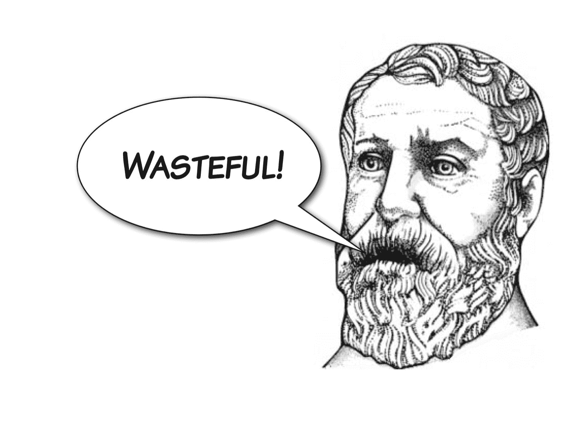

# 例外情况

异常处理是一种机制，用于停止“正常”程序流并在周围的上下文或代码块上继续。

中断正常流程的行为称为“引发”异常。在某些封闭上下文中，引发的异常必须被*处理*，这意味着控制流被转移到异常
处理程序。如果异常沿着调用堆栈向上传播到程序的开头，则未处理的异常将导致程序终止。异常对象（包含异常事件发生的位置和原因的信息）从引发异常的点传输到异常处理程序，以便处理程序可以查询异常对象并采取适当的操作。

如果在其他流行的命令语言如 C++或 java 中使用了异常，那么您已经很好地了解了 Python 中的异常如何工作。

关于“例外事件”的确切构成一直存在着漫长而令人厌烦的争论，核心问题是例外性实际上是一个程度问题（有些事情比其他事情更例外）。这是有问题的，因为编程语言通过坚持事件要么完全例外，要么根本不例外，从而强加了错误的
二分法。

当涉及到异常的使用时，Python 哲学是最自由的。异常在 Python 中无处不在，理解如何处理异常是至关重要的。

# 异常和控制流

由于异常是控制流的一种方式，因此在 REPL 上演示异常可能很笨拙，因此在本章中，我们将使用 Python 模块来包含代码。让我们从一个非常简单的模块开始，我们可以用来探索这些重要的概念和行为。将此代码放入名为`exceptional.py`的模块中：

```py
"""A module for demonstrating exceptions."""

def convert(s):
 """Convert to an integer."""
 x = int(s)
 return x

```

将`convert()`函数从此模块导入 Python REPL：

```py
$ python3
Python 3.5.1 (v3.5.1:37a07cee5969, Dec  5 2015, 21:12:44)
[GCC 4.2.1 (Apple Inc. build 5666) (dot 3)] on darwin
Type "help", "copyright", "credits" or "license" for more information.
>>> from exceptional import convert

```

并使用字符串调用我们的函数，以查看它是否具有所需的效果：

```py
>>> convert("33")
33

```

如果我们使用无法转换为整数的对象调用函数，我们将从`int()`调用中得到一个`traceback`：

```py
>>> convert("hedgehog")
Traceback (most recent call last):
 File "<stdin>", line 1, in <module>
 File "./exceptional.py", line 7, in convert
 x = int(s)
ValueError: invalid literal for int() with base 10: 'hedgehog'

```

这里发生的事情是`int()`*引发了*异常，因为它无法明智地执行转换。我们没有一个适当的处理程序，所以它被 REPL 捕获，并显示堆栈跟踪。换句话说，异常没有得到处理。

堆栈跟踪中引用的`ValueError`是`exception`对象的*类型*，错误消息“基为`10``int()`的无效文字：【刺猬】是 REPL 检索并打印的异常对象有效负载的一部分。

请注意，异常会在调用堆栈中的多个级别传播：

| 调用堆栈 | 效应 |
| --- | --- |
| `int()` | 这里提出了一个例外 |
| `convert()` | 异常在概念上通过这里 |
| 答复 | 这里有个例外 |

# 异常处理

让我们使用一个`try``except`构造来处理`ValueError`，从而使`convert()`函数更加健壮。`try`和`except`关键字都引入了新的块。`try`块包含可能引发异常的代码，`except`块包含在引发异常时执行错误处理的代码。修改`convert()`功能如下：

```py
def convert(s):
 """Convert a string to an integer."""
 try:
 x = int(s)
 except ValueError:
 x = -1
 return x

```

我们已经决定，如果提供了一个非整数字符串，我们将返回-1。为了加强您对控制流的理解，我们还将添加几个打印语句：

```py
def convert(s):
 """Convert a string to an integer."""
 try:
 x = int(s)
 print("Conversion succeeded! x =", x)
 except ValueError:
 print("Conversion failed!")
 x = -1
 return x

```

让我们在重新启动 REPL 后以交互方式进行测试：

```py
>>> from exceptional import convert
>>> convert("34")
Conversion succeeded! x = 34
34
>>> convert("giraffe")
Conversion failed!
-1

```

请注意，当我们传入`"giraffe"`作为函数参数时，`try`块中引发异常的点之后的`print()`是如何*没有*执行的。相反，执行被直接转移到`except`块的第一条语句。

`int()`构造函数只接受数字或字符串，所以让我们看看如果我们将另一种类型的对象输入其中会发生什么，比如一个列表：

```py
>>> convert([4, 6, 5])
Traceback (most recent call last):
 File "<stdin>", line 1, in <module>
 File "./exceptional.py", line 8, in convert
 x = int(s)
TypeError: int() argument must be a string or a number, not 'list'

```

这次我们的处理程序没有截获异常。如果我们仔细观察跟踪，我们可以看到这次我们收到了一个`TypeError`——一种不同类型的异常。

# 处理多个异常

每个`try`块可以有多个对应的`except`块，拦截不同类型的异常。让我们也为`TypeError`添加一个处理程序：

```py
def convert(s):
 """Convert a string to an integer."""
 try:
 x = int(s)
 print("Conversion succeeded! x =", x)
 except ValueError:
 print("Conversion failed!")
 x = -1
 except TypeError:
 print("Conversion failed!")
 x = -1
 return x

```

现在，如果我们在一个新的 REPL 中重新运行相同的测试，我们会发现`TypeError`也被处理了：

```py
>>> from exceptional import convert
>>> convert([1, 3, 19])
Conversion failed!
-1

```

我们在两个异常处理程序之间有一些代码重复，其中有重复的`print`语句和赋值。我们将作业移到`try`块前面，这不会改变程序的行为：

```py
def convert(s):
 """Convert a string to an integer."""
 x = -1
 try:
 x = int(s)
 print("Conversion succeeded! x =", x)
 except ValueError:
 print("Conversion failed!")
 except TypeError:
 print("Conversion failed!")
 return x

```

然后，我们将利用这一事实，即两个处理程序通过将它们折叠为一个处理程序来执行相同的操作，使用`except`语句接受异常类型元组的能力：

```py
def convert(s):
 """Convert a string to an integer."""
 x = -1
 try:
 x = int(s)
 print("Conversion succeeded! x =", x)
 except (ValueError, TypeError):
 print("Conversion failed!")
 return x

```

现在我们看到，一切仍按设计进行：

```py
>>> from exceptional import convert
>>> convert(29)
Conversion succeeded! x = 29
29
>>> convert("elephant")
Conversion failed!
-1
>>> convert([4, 5, 1])
Conversion failed!
-1

```

# 程序员错误

现在我们对异常行为的控制流有了信心，我们可以删除 print 语句：

```py
def convert(s):
 """Convert a string to an integer."""
 x = -1
 try:
 x = int(s)
 except (ValueError, TypeError):
 return x

```

但现在，当我们尝试导入程序时：

```py
>>> from exceptional import convert
Traceback (most recent call last):
 File "<stdin>", line 1, in <module>
 File "./exceptional.py", line 11
 return x
 ^
IndentationError: expected an indented block

```

我们得到另一种类型的异常，`IndentationError`，因为我们的`except`块现在是空的，在 Python 程序中不允许使用空块。

这不是一个异常类型，*曾经*对`catch`和`except`块有用！几乎任何 Python 程序出错都会导致异常，但是一些异常类型，例如`IndentationError`、`SyntaxError`和`NameError`都是程序员错误的结果，应该在开发过程中识别和纠正这些错误，而不是在运行时处理。如果您正在创建 Python 开发工具（如 Python IDE）、将 Python 本身嵌入到一个更大的系统中以支持应用程序脚本编写，或者设计一个动态加载代码的插件系统，那么这些东西都是例外，这一点非常有用。

# 空块–pass 语句

尽管如此，我们仍然面临着如何处理空`except`块的问题。解决方案以`pass`关键字的形式出现，这是一个特殊的语句，它完全不做任何事情！它是不可操作的，它的唯一目的是允许我们构造语义上为空的语法上允许的块：

```py
def convert(s):
 """Convert a string to an integer."""
 x = -1
 try:
 x = int(s)
 except (ValueError, TypeError):
 pass
 return x

```

但在这种情况下，最好使用多个`return`语句进一步简化，完全取消`x`变量：

```py
def convert(s):
 """Convert a string to an integer."""
 try:
 return int(s)
 except (ValueError, TypeError):
 return -1

```

# 异常对象

有时，我们想抓住`exception`对象——在本例中是`ValueError`或`TypeError`类型的对象——并询问它，以了解更多出错的细节。我们可以通过在`except`语句的末尾添加一个 as 子句，将变量名绑定到`exception`对象，从而获得对 exception 对象的命名引用：

```py
def convert(s):
 """Convert a string to an integer."""
 try:
 return int(s)
 except (ValueError, TypeError) as e:
 return -1

```

我们将修改我们的函数，在返回之前将包含异常详细信息的消息打印到`stderr`流中。要打印到`stderr`我们需要从`sys`模块获取对流的引用，因此在模块顶部我们需要`import sys`。然后我们可以将`sys.stderr`作为名为 file 的关键字参数传递给`print()`：

```py
import sys

def convert(s):
 """Convert a string to an integer."""
 try:
 return int(s)
 except (ValueError, TypeError) as e:
 print("Conversion error: {}".format(str(e)), file=sys.stderr)
 return -1

```

我们利用了`exception`对象可以使用`str()`构造函数转换为字符串这一事实。

让我们看看 REPL：

```py
>>> from exceptional import convert
>>> convert("fail")
Conversion error: invalid literal for int() with base 10: 'fail'
-1

```

# 轻率返回码

让我们在模块中添加第二个函数`string_log()`，它调用`convert()`函数并计算结果的自然日志：

```py
from math import log

def string_log(s):
 v = convert(s)
 return log(v)

```

在这一点上，我们必须承认，我们已经在这里通过将完美的`int()`转换包装在我们的`convert()`函数中，它返回了一个好的老式负错误代码，这在失败时会引发异常，从而使我们的`convert()`函数变得非常不和谐。请放心，这种不可原谅的 Python 异端邪说仅仅是为了证明错误返回代码的最大愚蠢：它们可以被调用方忽略，在程序的后期对毫无戒心的代码造成严重破坏。稍好一点的程序可能会在继续日志调用之前测试`v`的值。

如果没有这样的检查，当通过负错误代码值时，`log()`当然会失败：

```py
>>> from exceptional import string_log
>>> string_log("ouch!")
Conversion error: invalid literal for int() with base 10: 'ouch!'
Traceback (most recent call last):
 File "<stdin>", line 1, in <module>
 File "./exceptional.py", line 15, in string_log
 return log(v)
ValueError: math domain error

```

当然，`log()`故障的后果是引发另一个异常，也是`ValueError`。

完全忘记错误返回代码，转而从`convert()`引发异常，这样做更好，而且更具 python 风格。

# 重新提出例外情况

我们可以简单地发出错误消息并重新引发当前正在处理的`exception`对象，而不是返回非音速错误代码。这可以通过将异常处理块末尾的`return -1`替换为`raise`语句来实现：

```py
def convert(s):
 """Convert a string to an integer."""
 try:
 return int(s)
 except (ValueError, TypeError) as e:
 print("Conversion error: {}".format(str(e)), file=sys.stderr)
 raise

```

如果没有参数，raise 只会重新引发当前正在处理的异常。

在 REPL 中测试，我们可以看到原来的异常类型被重新引发，无论是`ValueError`还是`TypeError`，我们的`Conversion error`消息被一路打印到`stderr`：

```py
>>> from exceptional import string_log
>>> string_log("25")
3.2188758248682006
>>> string_log("cat")
Conversion error: invalid literal for int() with base 10: 'cat'
Traceback (most recent call last):
 File "<stdin>", line 1, in <module>
 File "./exceptional.py", line 14, in string_log
 v = convert(s)
 File "./exceptional.py", line 6, in convert
 return int(s)
ValueError: invalid literal for int() with base 10: 'cat'
>>> string_log([5, 3, 1])
Conversion error: int() argument must be a string or a number, not 'list'
Traceback (most recent call last):
 File "<stdin>", line 1, in <module>
 File "./exceptional.py", line 14, in string_log
 v = convert(s)
 File "./exceptional.py", line 6, in convert
 return int(s)
TypeError: int() argument must be a string or a number, not 'list'

```

# 异常是函数 API 的一部分

异常是函数 API 的一个重要方面。函数的调用者需要知道在各种情况下会出现哪些异常，以便确保适当的异常处理程序已就位。我们将以平方根查找为例，使用一个自产的平方根函数，这是 Alexandria 的 Heron 提供的（尽管他可能没有使用 Python）。

函数的调用者需要知道期望出现哪些异常：


Figure 6.1: Callers need to know now

将以下代码放入文件`roots.py`：

```py
def sqrt(x):
 """Compute square roots using the method of Heron of Alexandria.

 Args:
 x: The number for which the square root is to be computed.

 Returns:
 The square root of x.
 """
 guess = x
 i = 0
 while guess * guess != x and i < 20:
 guess = (guess + x / guess) / 2.0
 i += 1
 return guess

def main():
 print(sqrt(9))
 print(sqrt(2))

if __name__ == '__main__':
 main()

```

在这个程序中，只有一个我们以前没有遇到过的语言特性：逻辑 and 运算符，我们在本例中使用它来测试循环的每次迭代中有两个条件`True`。Python 还包括一个逻辑 or 运算符，可用于测试其操作数是否为`True`。

运行我们的程序，我们可以看到 Heron 真的了解了一些事情：

```py
$ python3 roots.py
3.0
1.41421356237

```

# Python 引发的异常

让我们在`main()`函数中添加一行，它取`-1`的平方根：

```py
def main():
 print(sqrt(9))
 print(sqrt(2))
 print(sqrt(-1))

```

如果我们运行它，我们会得到一个新的异常：

```py
$ python3 sqrt.py
3.0
1.41421356237
Traceback (most recent call last):
 File "sqrt.py", line 14, in <module>
 print(sqrt(-1))
 File "sqrt.py", line 7, in sqrt
 guess = (guess + x / guess) / 2.0
ZeroDivisionError: float division

```

所发生的事情是 Python 截获了在循环的第二次迭代中发生的除法为零，并引发了一个异常——a`ZeroDivisionError`。

# 捕获异常

让我们修改代码，在异常传播到调用堆栈顶部（从而导致程序停止）之前，使用`try`…`except`构造捕获异常：

```py
def main():
 print(sqrt(9))
 print(sqrt(2))
 try:
 print(sqrt(-1))
 except ZeroDivisionError:
 print("Cannot compute square root of a negative number.")

 print("Program execution continues normally here.")

```

现在，当我们运行脚本时，我们看到我们正在干净地处理异常：

```py
$ python sqrt.py
3.0
1.41421356237
Cannot compute square root of a negative number.
Program execution continues normally here.

```

我们应该小心避免初学者的错误，即异常处理块的作用域太紧；我们可以很容易地使用一个`try`…`except`块来调用`sqrt()`。我们还添加了第三个 print 语句，以显示封闭块的执行是如何终止的：

```py
def main():
 try:
 print(sqrt(9))
 print(sqrt(2))
 print(sqrt(-1))
 print("This is never printed.")
 except ZeroDivisionError:
 print("Cannot compute square root of a negative number.")

 print("Program execution continues normally here.")

```

# 明确提出例外

这是我们开始时的一个改进，但大多数`sqrt()`函数的用户不希望它抛出`ZeroDivisionError`。

Python 为我们提供了几种标准的异常类型来表示常见错误。如果函数参数提供了非法值，通常会引发一个`ValueError`。我们可以通过将 raise 关键字与新创建的`exception`对象一起使用来实现这一点，我们可以通过调用`ValueError`构造函数来创建该对象。

我们可以用两种方法来处理被零除的问题。第一种方法是将根查找`while`-循环包装在`try`…`except ZeroDivisionError`构造中，然后从异常处理程序内部引发新的`ValueError`异常。

```py
def sqrt(x):
 """Compute square roots using the method of Heron of Alexandria.

 Args:
 x: The number for which the square root is to be computed.

 Returns:
 The square root of x.
 """
 guess = x
 i = 0
 try:
 while guess * guess != x and i < 20:
 guess = (guess + x / guess) / 2.0
 i += 1
 except ZeroDivisionError:
 raise ValueError()
 return guess

```

虽然它有效，但这将是浪费；我们会在知情的情况下继续进行一个非琐碎的计算，这最终将是毫无意义的。



Figure 6.2: Wasteful

# 保护条款

我们知道这个例程总是会以负数失败，所以我们可以尽早检测到这个前提条件，并在那个时候引发异常，这是一种称为*保护条款*的技术：

```py
def sqrt(x):
 """Compute square roots using the method of Heron of Alexandria.

 Args:
 x: The number for which the square root is to be computed.

 Returns:
 The square root of x.

 Raises:
 ValueError: If x is negative.
 """

 if x < 0:
 raise ValueError("Cannot compute square root of negative   
                         number{}".format(x))

 guess = x
 i = 0
 while guess * guess != x and i < 20:
 guess = (guess + x / guess) / 2.0
 i += 1
 return guess

```

测试是一个简单的`if`语句和一个调用，通过一个新创建的`exception`对象来提升。`ValueError()`构造函数接受错误消息。请看我们如何修改 docstring，使其明确说明`sqrt()`将引发哪种异常类型以及在什么情况下。

但是看看如果我们运行这个程序会发生什么——我们仍然得到一个回溯和一个不正常的程序退出：

```py
$ python roots.py
3.0
1.41421356237
Traceback (most recent call last):
 File "sqrt.py", line 25, in <module>
 print(sqrt(-1))
 File "sqrt.py", line 12, in sqrt
 raise ValueError("Cannot compute square root of negative number\   
                     {0}".format(x))
ValueError: Cannot compute square root of negative number -1

```

这是因为我们忘记修改异常处理程序以捕获`ValueError`而不是`ZeroDivisionError`。让我们将调用代码修改为`catch`正确的`exception`类，并将捕获的`exception`对象分配给一个命名变量，以便捕获后可以对其进行查询。在这种情况下，我们的询问只是打印`exception`对象，它知道如何将自身显示为`stderr`的消息：

```py
import sys

def main():
 try:
 print(sqrt(9))
 print(sqrt(2))
 print(sqrt(-1))
 print("This is never printed.")
 except ValueError as e:
 print(e, file=sys.stderr)

 print("Program execution continues normally here.")

```

再次运行该程序，我们可以看到我们的异常得到了妥善处理：

```py
$ python3 sqrt.py
3.0
1.41421356237
Cannot compute square root of negative number -1
Program execution continues normally here.

```

# 异常、API 和协议

异常是函数 API 的一部分，更广泛地说是某些*协议*的一部分。例如，实现序列协议的对象应该为超出范围的索引引发`IndexError`异常。

引发的异常与函数接受的参数一样，都是函数规范的一部分，必须适当记录。

Python 中有几种常见的异常类型，通常当您需要在自己的代码中引发异常时，其中一种内置类型是一个不错的选择。更为罕见的是，您需要定义新的异常类型，但本书中没有介绍这一点。（请参阅本系列的下一本书*Python 熟练工*了解如何做到这一点。）

如果您决定代码应该引发哪些异常，那么应该在现有代码中查找类似的情况。代码越是遵循现有模式，人们就越容易集成和理解。例如，假设您正在编写一个键值数据库。

使用`KeyError`表示请求一个不存在的密钥是很自然的，因为 dict 就是这样工作的。也就是说 Python 中的“映射”集合遵循某些协议，而异常是这些协议的一部分。

让我们看看几个常见的异常类型。

# 索引器

当整数索引超出范围时，将引发`IndexError`。

当索引超过列表末尾时，可以看到：

```py
>>> z = [1, 4, 2]
>>> z[4]
Traceback (most recent call last):
 File "<stdin>", line 1, in <module>
IndexError: list index out of range

```

# 数值误差

当对象类型正确，但包含不适当的值时，会引发`ValueError`。

在尝试从非数字字符串构造 int 时，我们已经看到了这一点：

```py
>>> int("jim")
Traceback (most recent call last):
 File "<stdin>", line 1, in <module>
ValueError: invalid literal for int() with base 10: 'jim'

```

# 关键错误

当映射中的查找失败时，将引发`KeyError`。

当我们在`dict`中查找不存在的密钥时，您可以看到：

```py
>>> codes = dict(gb=44, us=1, no=47, fr=33, es=34)
>>> codes['de']
Traceback (most recent call last):
 File "<stdin>", line 1, in <module>
 KeyError: 'de'

```

# 选择不防止类型错误

在 Python 中，我们倾向于不防御`TypeErrors`。这样做违背了 Python 中动态类型的粒度，并限制了我们编写的代码的重用潜力。

例如，我们可以使用内置的`isinstance()`函数测试参数是否为`str`，如果不是，则引发`TypeError`异常：

```py
def convert(s):
 """Convert a string to an integer."""
 if not isinstance(s, str):
 raise TypeError("Argument must be a string".)

 try:
 return int(s)
 except (ValueError, TypeError) as e:
 print("Conversion error: {}".format(str(e)), file=sys.stderr)
 raise

```

但是我们也希望允许作为`float`实例的参数。如果我们想检查我们的函数是否能与诸如有理数、复数或任何其他类型的数一起工作，那么它很快就会变得复杂，而且在任何情况下，谁能说它能呢？！

或者我们可以在`sqrt()`函数中截取`TypeError`并重新提升它，但目的是什么？


Figure 6.3: Just let it fail

通常在 Python 中，不值得在函数中添加类型检查。如果一个函数使用一种特定的类型——即使是你在设计函数时不知道的类型——那么这一切都是好的。否则，执行可能会导致`TypeError`的结果。同样地，我们往往不会频繁地使用`except`块*捕捉*`TypeErrors`。

# 蟒蛇风格–EAFP 与 LBYL

现在，让我们看看 Python 哲学和文化的另一个信条，即“请求原谅比获得许可更容易”。

只有两种方法可以处理可能失败的程序操作。第一种方法是在尝试操作之前，检查易发生故障操作的所有先决条件是否已满足。第二种方法是盲目地期望最好的结果，但如果不成功，就要准备好应对后果。

在 Python 文化中，这两种哲学被称为“三思而后行”（**LBYL**），其**更容易请求原谅而不是许可**（**EAFP**）——顺便说一句，这是由编译器的发明者、海军少将格雷斯·霍珀（Grace Hopper）创造的。

Python 强烈支持 EAFP，因为它将“快乐路径”的主要逻辑放在可读性最强的形式中，与正常流的偏差单独处理，而不是与主流相互交错。

让我们考虑一个例子——处理一个文件。处理的细节不相关。我们需要知道的是，`process_file()`函数将打开一个文件并从中读取一些数据。

首先，LBYL 版本：

```py
import os

p = '/path/to/datafile.dat'

if os.path.exists(p):
 process_file(p)
else:
 print('No such file as {}'.format(p))

```

在尝试调用`process_file()`之前，我们会检查文件是否存在，如果不存在，我们会避免调用并打印一条有用的消息。这种方法有几个问题，有些是显而易见的，有些是阴险的。一个明显的问题是，我们只执行存在性检查。如果文件存在但包含垃圾怎么办？如果路径引用的是目录而不是文件，该怎么办？根据 LBYL 的说法，我们也应该为这些增加先发制人的测试。

一个更微妙的问题是这里有一个种族条件。文件有可能被删除，例如通过另一个进程，存在性检查和`process_file()`调用之间的*删除……这是一个典型的竞争条件。真的没有很好的方法来处理这个问题——在任何情况下都需要处理来自`process_file()`的错误！*

现在考虑另一种选择，使用更多的 Python EAFP 方法：

```py
p = '/path/to/datafile.dat'

try:
 process_file(f)
except OSError as e:
 print('Could not process file because {}'.format(str(e)))

```

在这个版本中，我们在没有事先检查的情况下尝试操作，但是我们有一个异常处理程序来处理任何问题。我们甚至不需要知道很多细节，确切地说，什么地方可能会出错。这里我们捕捉到了`OSError`，它涵盖了各种情况，比如找不到文件，以及使用需要文件的目录。

EAFP 在 Python 中是标准的，遵循这一原则主要是通过异常来实现的。如果没有例外，并且被迫使用错误代码，则需要在逻辑的主流程中直接包含错误处理。由于异常会中断主流程，因此它们允许您非本地处理异常情况。

与 EAFP 结合的异常也具有优势，因为与错误代码不同，*异常不能轻易忽略*。默认情况下，异常会产生很大的影响，而错误代码在默认情况下是无声的。因此，基于 exception-/EAFP 的样式使得问题很难被默默地忽略。

# 清理行动

有时，无论操作是否成功，都需要执行清理操作。在后面的模块中，我们将介绍上下文管理器，它是解决这种常见情况的现代解决方案，但这里我们将介绍`try`…`finally`结构，因为在简单的情况下创建上下文管理器可能会有些过分。在任何情况下，对`try``finally`的理解都有助于创建自己的上下文管理器。

考虑这个函数，它使用标准库胡特元模块的各种设施来更改当前工作目录，在该位置创建新目录，然后恢复原始工作目录：

```py
import os

def make_at(path, dir_name):
 original_path = os.getcwd()
 os.chdir(path)
 os.mkdir(dir_name)
 os.chdir(original_path)

```

乍一看，这似乎是合理的，但如果对`os.mkdir()`的调用因某种原因失败，Python 进程的当前工作目录将不会恢复为其原始值，`make_at()`函数将产生意外的副作用。

为了解决这个问题，我们希望该函数能够在任何情况下恢复原始的当前工作目录。我们可以通过`try``finally`块来实现这一点。无论执行是否通过到达块的末尾而正常离开`try`块，或者异常情况下引发异常，都会执行`finally`块中的代码。

该构造可与`except`块组合，用于添加一个简单的故障记录设施：

```py
import os
import sys

def make_at(path, dir_name):
 original_path = os.getcwd()
 try:
 os.chdir(path)
 os.mkdir(dir_name)
 except OSError as e:
 print(e, file=sys.stderr)
 raise
 finally:
 os.chdir(original_path)

```

现在，如果`os.mkdir()`引发了一个`OSError`，那么`OSError`处理程序将被运行，异常将被重新引发。但是，由于 finally 块始终运行，无论`try`块如何结束，我们可以确定最终目录更改将在所有情况下发生。

# 禅宗时刻

禅宗时刻：错误永远不会悄无声息地过去，除非明确地沉默——错误就像铃铛，如果我们让它们沉默，它们就毫无用处：

 Figure 6.4: Moment of Zen

# 平台特定代码

从 Python 中检测单个按键—例如“按任意键继续”。控制台上的功能—需要使用操作系统特定的模块。我们不能使用内置的`input()`功能，因为它会等待用户在给我们一个字符串之前按下*回车*。要在 Windows 上实现这一点，我们需要使用仅 Windows`msvcrt`模块的功能，在 Linux 和 macOS 上，除了`sys`模块外，我们还需要使用仅 Unix`tty`和`termios`模块的功能。

这个例子很有启发性，因为它展示了许多 Python 语言特性，包括`import`和`def`作为*语句*，而不仅仅是声明：

```py
"""keypress - A module for detecting a single keypress."""

try:
 import msvcrt

 def getkey():
 """Wait for a keypress and return a single character      
    string."""
 return msvcrt.getch()

except ImportError:

 import sys
 import tty
 import termios

 def getkey():
 """Wait for a keypress and return a single character 
        string."""
 fd = sys.stdin.fileno()
 original_attributes = termios.tcgetattr(fd)
 try:
 tty.setraw(sys.stdin.fileno())
 ch = sys.stdin.read(1)
 finally:
 termios.tcsetattr(fd, termios.TCSADRAIN, 
                              original_attributes)
 return ch

 # If either of the Unix-specific tty or termios modules are
 # not found, we allow the ImportError to propagate from here

```

回想一下，顶级模块代码是在第一次导入时执行的。在第一个`try`块中，我们尝试`import msvcrt`，Microsoft Visual C 运行时。如果成功，我们将继续定义一个函数`getkey()`，该函数将委托给`msvcrt.getch()`函数。即使此时我们在一个`try`块中，函数也将在当前作用域中声明，即模块作用域。

但是，如果`msvcrt`的`import`失败，因为我们没有在 Windows 上运行，将引发`ImportError`，执行将转移到`except`块。这是一个错误被显式沉默的例子，因为我们将在异常处理程序中尝试另一种操作过程。

在`except`-块中，我们导入在类 Unix 系统上实现`getkey()`所需的三个模块，然后继续进行`getkey()`的替代定义，该定义再次将函数实现绑定到模块范围中的名称。

`getkey()`的这个 Unix 实现使用`try`…`finally`构造，在终端进入原始模式后恢复各种终端属性，以便读取单个字符。

如果我们的程序运行在既不是 Windows 也不是 Unix 的系统上，`import tty`语句将引发第二个`ImportError`。这一次我们没有试图截获这个例外；我们允许它传播到我们的调用者——这是任何试图`import`这个`keypress`模块的东西。我们知道如何发出这个错误的信号，但不知道如何处理它，所以我们将这个决定推迟到调用方。错误不会悄悄地过去。

如果调用者有更多的知识或可用的替代策略，那么它可以反过来拦截此异常并采取适当的操作，可能会降级为使用 Python 的`input()`内置函数并向用户提供不同的消息。

# 总结

*   引发异常会中断正常的程序流，并将控制权转移到异常处理程序。

*   异常处理程序是使用`try`…`except`构造定义的。

*   `try`块定义了可以检测异常的上下文。

*   对应的`except`块定义特定类型异常的处理程序。

*   Python 普遍使用异常，许多内置语言特性都依赖于异常。

*   `except`块可以捕获`exception`对象，该对象通常是`ValueError`、`KeyError`或`IndexError`等标准类型。

*   通常不应处理程序员错误，如`IndentationError`和`SyntaxError`。

*   异常情况可以使用接受`exception`对象单个参数的`raise`关键字发出信号。

*   在`except`块中没有参数的 Raise 将重新引发当前正在处理的异常。

*   我们倾向于不定期检查`TypeErrors`。这样做将否定 Python 的动态类型系统为我们提供的灵活性。

*   可以使用`str()`构造函数将`exception`对象转换为字符串，以打印消息有效负载。

*   函数引发的异常构成其 API 的一部分，应适当记录。

*   在引发异常时，您更愿意使用最合适的内置异常类型。

*   可使用`try`…`finally`构造执行清理和恢复操作，该构造可选择性地与`except`块结合使用。

一路上我们看到：

*   `print()`函数的输出可以使用可选文件参数重定向到`stderr`。

*   Python 支持用于组合布尔表达式的逻辑运算符和或。

*   返回代码太容易被忽略。

*   通过拦截`ImportErrors`并提供替代实现，平台特定的操作可以使用比许可更容易请求原谅的方法来实现。