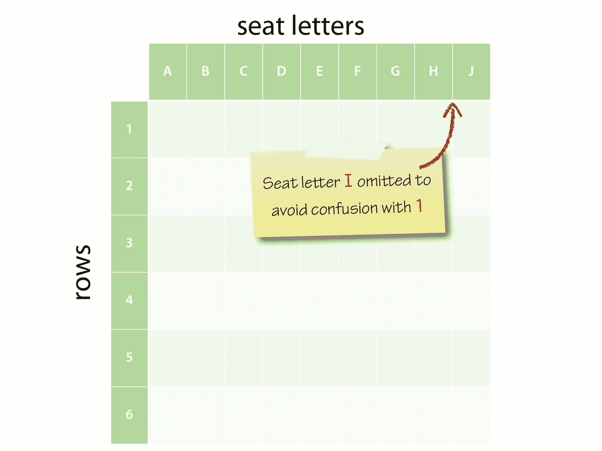

# 八、使用类定义新类型

在 Python 中，使用内置的标量和集合类型可以取得很大的进步。对于许多问题，内置类型以及 Python 标准库中可用的类型就足够了。但有时，它们并不是必需的，而创建自定义类型的能力正是类的用武之地。

正如我们所看到的，Python 中的所有对象都有一个类型，当我们使用`type()`内置函数报告该类型时，结果将以该类型的*类*表示：

```py
>>> type(5)
<class 'int'>
>>> type("python")
<class 'str'>
>>> type([1, 2, 3])
<class 'list'>
>>> type(x*x for x in [2, 4, 6])
<class 'generator'>

```

类用于定义一个或多个对象的结构和行为，每个对象都被称为类的*实例*。大体上，Python 中的对象从创建（或*实例化*）到销毁都有固定的类型。将类看作一种模板或用于构造新对象的 cookiecuter 可能会有所帮助。对象的类控制其初始化以及哪些属性和方法可通过该对象使用。例如，在
字符串对象上，我们可以在该对象上使用的方法，例如`split()`，在`str`类中定义。

类对于 Python 中的**面向对象编程**（**OOP**）来说是一种重要的机制，尽管 OOP 确实有助于使复杂问题更易于处理，但它通常会使简单问题的解决方案变得不必要的复杂。Python 的一个优点是它是高度面向对象的，在您真正需要类之前，它不会强迫您处理类。这使该语言与 Java 和 C 完全不同。

# 定义类

类定义由 Class 关键字后跟类名引入。按照惯例，Python 中的新类名使用驼峰大小写（有时称为 Pascal 大小写），每个组成单词都有一个首字母大写，而没有分隔下划线。由于在 REPL 中定义类有点笨拙，我们将使用 Python 模块文件来保存我们在本章中使用的类定义
。

让我们从最简单的类开始，我们将逐步向其中添加特性。在我们的示例中，我们将通过在`airtravel.py`中输入以下代码来模拟两个机场之间的客机飞行：

```py
"""Model for aircraft flights."""

class Flight:
 pass

```

class 语句引入了一个新块，因此我们在下一行缩进。空块是不允许的，因此最简单的类至少需要一个 do-nothing-pass 语句才能在语法上允许。

就像定义函数的 def 一样，class 是一个*语句*，可以出现在程序中的任何地方，并将类定义绑定到类名。当`airtravel`模块中的顶层代码被执行时，类被定义。

现在我们可以将新类导入 REPL 并进行尝试。

```py
>>> from airtravel import Flight

```

我们刚刚导入的是类对象。在 Python 中，一切都是对象，类也不例外。

```py
>>> Flight
<class 'airtravel.Flight'>

```

要使用这个类创建一个新对象，我们必须调用它的构造函数，这是通过*调用*类来完成的，就像我们调用函数一样。构造函数返回一个新对象，在这里我们将其分配给一个名称`f`：

```py
>>> f = Flight()

```

如果我们使用`type()`函数来请求`f`的类型，我们得到`airtravel.Flight`：

```py
>>> type(f)
<class 'airtravel.Flight'>

```

`f`字面上的*类型是*类。

# 实例方法

让我们通过添加一个返回航班号的所谓的*实例方法*，让我们的类更有趣一些。方法只是类块中定义的函数，实例方法是可以在属于我们类实例的对象上调用的函数，如`f`。实例方法必须接受对其上调用该方法的实例的引用作为第一个形式参数，按照惯例，该参数始终称为 self。

我们还没有办法配置航班号值，所以我们只返回一个常量字符串：

```py
class Flight:

 def number(self):
 return "SN060"

```

从一个新的回复：

```py
>>> from airtravel import Flight
>>> f = Flight()
>>> f.number()
SN060

```

请注意，当我们调用该方法时，我们没有在参数列表中为实际参数 self 提供实例`f`。这是因为标准方法调用表单带有点，如下所示：

```py
>>> f.number()
SN060

```

只是语法上的糖：

```py
>>> Flight.number(f)
SN060

```

如果您尝试后一种方法，您会发现它可以像预期的那样工作，尽管您几乎从来没有见过这种表单用于实际应用。

# 实例初始值设定项

这个类不是很有用，因为它只能表示一个特定的航班。我们需要在创建航班时配置航班号。为此，我们需要编写一个`initializer`方法。

如果提供，`initializer`方法将在调用构造函数时作为创建新对象过程的一部分进行调用。`initializer`方法必须被调用`__init__()`，并由 Python 运行时机器使用的双下划线分隔。与所有其他实例方法一样，`__init__()`的第一个参数必须是 self。

在本例中，我们还将第二个形式参数传递给`__init__()`，即航班号：

```py
class Flight:

 def __init__(self, number):
 self._number = number

 def number(self):
 return self._number

```

`initializer`不应该返回任何东西——它只是修改 self 引用的对象。

如果你来自 java、C 语言或 C++背景，那么很有可能把 Endot0}看作是构造函数。这不太准确；在 Python 中，`__init__()`的目的是*配置*在调用`__init__()`时已经存在的对象。但是，在爪哇，C，或 C++中，自变量是类似的。在 Python 中，实际的构造函数由 Python 运行时系统提供，它所做的一件事是检查实例初始值设定项是否存在，并在存在时调用它。

在初始值设定项中，我们分配给新创建的名为`_number`的实例的*属性*。分配给尚不存在的对象属性就足以使其存在。

正如在创建变量之前不需要声明变量一样，在创建对象属性之前也不需要声明对象属性。我们使用下划线开头有两个原因。首先，因为它避免了与同名方法的名称冲突。方法是函数，函数是对象，这些函数绑定到对象的属性，所以我们已经有了一个名为 number 的属性，我们不想替换它。其次，有一种广泛采用的约定，即对象的客户端不打算使用或操纵的对象的实现细节应以下划线作为前缀。

我们还修改了`number()`方法来访问`_number`属性并返回它。

传递给 flight 构造函数的任何实际参数都将转发给初始值设定项，因此要创建和配置`Flight`对象，我们现在可以执行以下操作：

```py
>>> from airtravel import Flight
>>> f = Flight("SN060")
>>> f.number()
SN060

```

我们还可以直接访问实施细节：

```py
>>> f._number
SN060

```

虽然这不建议用于生产代码，但它对于调试和早期测试非常方便。

# 缺少访问修饰符

如果您来自一种束缚和约束语言，比如 Java 或 C#，带有`public`、`private`和`protected`访问修饰符，那么 Python 的“一切都是公开的”方法似乎过于开放。

Pythonistas 中流行的文化是“我们都是同意的成年人”在实践中，领先的下划线约定已被证明是足够的保护，即使在我们使用过的大型复杂 Python 系统中也是如此。人们知道不要直接使用这些属性，事实上他们往往不会。像许多学说一样，缺乏访问修饰符在理论上比在实践中是一个更大的问题。

# 验证和不变量

对象的初始值设定项建立所谓的*类不变量*是一种很好的做法。不变量是关于该类对象的真理，应该在对象的生命周期中持续。航班的一个不变量是航班号总是以大写的两个字母的航空公司代码开头，后跟三位或四位的航线号。

在 Python 中，我们在`__init__()`方法中建立类`invariants`，如果无法获得异常，则引发异常：

```py
class Flight:

 def __init__(self, number):
 if not number[:2].isalpha():
 raise ValueError("No airline code in '{}'".format(number))

 if not number[:2].isupper():
 raise ValueError("Invalid airline 
                             code'{}'".format(number))

 if not (number[2:].isdigit() and int(number[2:]) <= 9999):
 raise ValueError("Invalid route 
                             number'{}'".format(number))

 self._number = number

 def number(self):
 return self._number

```

我们使用字符串切片和字符串类的各种方法来执行验证。在这本书中，我们第一次看到逻辑否定运算符 not。

REPL 中的*特别*测试是开发过程中非常有效的技术：

```py
>>> from airtravel import Flight
>>> f = Flight("SN060")
>>> f = Flight("060")
Traceback (most recent call last):
 File "<stdin>", line 1, in <module>
 File "./airtravel.py", line 8, in __init__
 raise ValueError("No airline code in '{};".format(number))
 ValueError: No airline code in '060'
>>> f = Flight("sn060")
Traceback (most recent call last):
 File "<stdin>", line 1, in <module>
 File "./airtravel.py", line 11, in __init__
 raise ValueError("Invalid airline code '{}'".format(number))
 ValueError: Invalid airline code 'sn060'
>>> f = Flight("snabcd")
Traceback (most recent call last):
 File "<stdin>", line 1, in <module>
 File "./airtravel.py", line 11, in __init__
 raise ValueError("Invalid airline code '{}'".format(number))
 ValueError: Invalid airline code 'snabcd'
>>> f = Flight("SN12345")
Traceback (most recent call last):
 File "<stdin>", line 1, in <module>
 File "./airtravel.py", line 11, in __init__
 raise ValueError("Invalid airline code '{}'".format(number))
 ValueError: Invalid airline code 'sn12345'

```

现在我们已经确定有一个有效的航班号，我们将添加第二个方法来只返回航空公司代码。一旦`invariants`类建立起来，大多数查询方法都可以非常简单：

```py
def airline(self):
 return self._number[:2]

```

# 添加第二类

我们想在航班上做的一件事就是接受座位预订。要做到这一点，我们需要知道座位布局，为此我们需要知道飞机的类型。让我们制作第二个类来模拟不同类型的飞机：

```py
class Aircraft:

 def __init__(self, registration, model, num_rows,   
                 num_seats_per_row):
 self._registration = registration
 self._model = model
 self._num_rows = num_rows
 self._num_seats_per_row = num_seats_per_row

 def registration(self):
 return self._registration

 def model(self):
 return self._model

```

`initializer`为飞机创建四个属性：注册号、型号名称、座椅排数和每排座椅数。在生产代码场景中，我们可以验证这些参数，以确保行数不是负数。

这很简单，但对于座位安排，我们希望更符合我们的预订系统。飞机上的每排座位从一开始编号，每排座位都用字母表中的字母表示，字母表中省略了**I**，以避免与**1**混淆：

 Figure 8.1: Aircraft seating plan.

我们将添加一个`seating_plan()`方法，该方法将允许的行和座位返回为包含`range`对象和座位字母字符串的 2 元组：

```py
def seating_plan(self):
 return (range(1, self._num_rows + 1),
 "ABCDEFGHJK"[:self._num_seats_per_row])

```

值得暂停一下，以确保您了解此函数的工作原理。对`range()`构造函数的调用生成一个范围对象，该对象可以用作一系列可编辑的行号，最多可达平面中的行数。字符串及其`slice`方法返回一个字符串，每个座位一个字符。这两个对象——范围和字符串——被捆绑成一个元组。

让我们构建一个有座位计划的飞机：

```py
 >>> from airtravel import *
 >>> a = Aircraft("G-EUPT", "Airbus A319", num_rows=22,   
                   num_seats_per_row=6)
 >>> a.registration()
 'G-EUPT'
 >>> a.model()
 'Airbus A319'
 >>> a.seating_plan()
 (range(1, 23), 'ABCDEF')

```

查看我们如何使用行和座位的关键字参数进行记录。回想一下，量程是半开的，因此`23`正确地说是超出量程末端的一个。

# 协作班

Demeter 法则是一种面向对象的设计原则，它规定您永远不要对从其他调用接收的对象调用方法。或者，换一种说法：只和你的直系朋友交谈。

 Figure 8.2: The Law of Demeter

现在，我们将修改我们的 Flight 类以在构建飞机对象时接受它，并且我们将遵循 Demeter 定律，添加一个方法来报告飞机模型。该方法将代表客户委托飞机，而不是允许客户“通过”航班并直接询问飞机对象：

```py
class Flight:
 """A flight with a particular passenger aircraft."""

 def __init__(self, number, aircraft):
 if not number[:2].isalpha():
 raise ValueError("No airline code in '{}'".format(number))

 if not number[:2].isupper():
 raise ValueError("Invalid airline code'{}'".format(number))

 if not (number[2:].isdigit() and int(number[2:]) <= 9999):
 raise ValueError("Invalid route number'{}'".format(number))

 self._number = number
 self._aircraft = aircraft

 def number(self):
 return self._number

 def airline(self):
 return self._number[:2]

 def aircraft_model(self):
 return self._aircraft.model()

```

我们还向类中添加了一个 docstring。这些操作与函数和模块 docstring 类似，必须是类主体中的第一个非注释行。

我们现在可以使用特定的飞机构建一个航班：

```py
>>> from airtravel import *
>>> f = Flight("BA758", Aircraft("G-EUPT", "Airbus A319", num_rows=22,
...                              num_seats_per_row=6))
>>> f.aircraft_model()
'Airbus A319'

```

请注意，我们构造了`Aircraft`对象，并直接将其传递给`Flight`构造函数，而不需要中间命名的引用。

# 禅宗时刻

 Figure 8.3: Complex is better than complicated

`aircraft_model()`方法是“复杂优于复杂”的一个例子：

```py
def aircraft_model(self):
 return self._aircraft.model()

```

飞行等级更为*复杂*——它包含额外的代码，可通过飞机参考向下钻取以找到模型。不过，现在航班的所有客户都可以减少*复杂度*；他们都不需要知道飞机等级，这大大简化了系统。

# 预订座位

现在我们可以开始实施一个简单的预订系统。对于每一次航班，我们只需要记录每个座位上坐着的人。我们将使用字典列表表示座位分配。该列表将包含每个座椅行的一个条目，每个条目都是从座椅字母到乘客姓名的字典映射。如果座位未被占用，则相应的字典值将不包含任何内容。

我们在飞行中初始化座位计划。`__init__()`使用该片段：

```py
rows, seats = self._aircraft.seating_plan()
self._seating = [None] + [{letter: None for letter in seats} for _ in rows]

```

在第一行中，我们检索飞机的座位计划，并使用元组解包将行和座位标识符放入局部变量行和座位中。在第二行中，我们为座位分配创建一个列表。我们选择在列表的开头浪费一个条目，而不是继续处理行索引是基于一的事实，而 Python 列表使用基于零的索引。第一个被浪费的条目是不包含任何元素的单元素列表。对于这个单一元素列表，我们连接另一个列表，该列表包含飞机中每个实行的一个条目。此列表由一个列表推导式构造，该列表推导式迭代 rows 对象，该对象是从上一行的`_aircraft`检索到的行号范围：

 Figure 8.4: The object graph for the seating-plan data structure

我们实际上对行号不感兴趣，因为我们知道它将与最终列表中的列表索引匹配，所以我们使用伪下划线变量放弃它。

列表推导式的项目表达部分本身就是理解；特别是一本字典！这将迭代每个行字母，并创建从单个字符串到无的映射，以指示空座位。

我们使用列表推导式，而不是使用乘法运算符进行列表复制，因为我们希望为每一行创建一个不同的 dictionary 对象；记住，重复是肤浅的。

下面是我们将其放入初始值设定项后的代码：

```py
def __init__(self, number, aircraft):
 if not number[:2].isalpha():
 raise ValueError("No airline code in '{}'".format(number))

 if not number[:2].isupper():
 raise ValueError("Invalid airline code '{}'".format(number))

 if not (number[2:].isdigit() and int(number[2:]) <= 9999):
 raise ValueError("Invalid route number '{}'".format(number))

 self._number = number
 self._aircraft = aircraft

 rows, seats = self._aircraft.seating_plan()
 self._seating = [None] + [{letter: None for letter in seats} for _  
                               in rows]

```

在继续之前，让我们在 REPL 中测试代码：

```py
>>> from airtravel import *
>>> f = Flight("BA758", Aircraft("G-EUPT", "Airbus A319", num_rows=22,
...                              num_seats_per_row=6))
>>>

```

由于一切都是“公开的”，我们可以在开发过程中访问实现细节。很明显，我们在开发过程中故意违反惯例，因为主要的下划线提醒我们什么是`public`和什么是`private`：

```py
>>> f._seating
[None, {'F': None, 'D': None, 'E': None, 'B': None, 'C': None, 
        'A': None},
{'F': None, 'D': None, 'E': None, 'B': None, 'C': None, 'A': None}, {'F': None,'D': None, 'E': None, 'B': None, 'C': None, 'A': None},
{'F': None, 'D': None,'E': None, 'B': None, 'C': None, 'A': None}, {'F': None, 'D': None, 'E': None,'B': None, 'C': None, 'A': None}, 
{'F': None, 'D': None, 'E': None, 'B': None,'C': None, 'A': None}, {'F': None, 'D': None, 'E': None, 'B': None, 'C': None,'A': None}, {'F': None, 'D': None, 'E': None, 'B': None, 'C': None, 'A': None},
{'F': None, 'D': None, 'E': None, 'B': None, 'C': None, 'A': None}, {'F': None,'D': None, 'E': None, 'B': None, 'C': None, 'A': None}, {'F': None, 'D': None,'E': None, 'B': None, 'C': None, 'A': None}, {'F': None, 'D': None, 'E': None,'B': None, 'C': None, 'A': None}, {'F': None, 'D': None, 'E': None, 'B': None,'C': None, 'A': None}, {'F': None, 'D': None, 'E': None, 'B': None, 'C': None,'A': None}, {'F': None, 'D': None, 'E': None, 'B': None, 'C': None, 'A': None},
{'F': None, 'D': None, 'E': None, 'B': None, 'C': None, 'A': None}, {'F': None,'D': None, 'E': None, 'B': None, 'C': None, 'A': None}, {'F': None, 'D': None,'E': None, 'B': None, 'C': None, 'A': None}, {'F': None, 'D': None, 'E': None,'B': None, 'C': None, 'A': None}, {'F': None, 'D': None, 'E': None, 'B': None,'C': None, 'A': None}, {'F': None, 'D': None, 'E': None, 'B': None, 'C': None,'A': None}, {'F': None, 'D': None, 'E': None, 'B': None, 'C': None, 'A': None}]

```

这很准确，但不是特别漂亮。让我们用漂亮的印花再试一次：

```py
>>> from pprint import pprint as pp
>>> pp(f._seating)
[None,
 {'A': None, 'B': None, 'C': None, 'D': None, 'E': None, 'F': None},
 {'A': None, 'B': None, 'C': None, 'D': None, 'E': None, 'F': None},
 {'A': None, 'B': None, 'C': None, 'D': None, 'E': None, 'F': None},
 {'A': None, 'B': None, 'C': None, 'D': None, 'E': None, 'F': None},
 {'A': None, 'B': None, 'C': None, 'D': None, 'E': None, 'F': None},
 {'A': None, 'B': None, 'C': None, 'D': None, 'E': None, 'F': None},
 {'A': None, 'B': None, 'C': None, 'D': None, 'E': None, 'F': None},
 {'A': None, 'B': None, 'C': None, 'D': None, 'E': None, 'F': None},
 {'A': None, 'B': None, 'C': None, 'D': None, 'E': None, 'F': None},
 {'A': None, 'B': None, 'C': None, 'D': None, 'E': None, 'F': None},
 {'A': None, 'B': None, 'C': None, 'D': None, 'E': None, 'F': None},
 {'A': None, 'B': None, 'C': None, 'D': None, 'E': None, 'F': None},
 {'A': None, 'B': None, 'C': None, 'D': None, 'E': None, 'F': None},
 {'A': None, 'B': None, 'C': None, 'D': None, 'E': None, 'F': None},
 {'A': None, 'B': None, 'C': None, 'D': None, 'E': None, 'F': None},
 {'A': None, 'B': None, 'C': None, 'D': None, 'E': None, 'F': None},
 {'A': None, 'B': None, 'C': None, 'D': None, 'E': None, 'F': None},
 {'A': None, 'B': None, 'C': None, 'D': None, 'E': None, 'F': None},
 {'A': None, 'B': None, 'C': None, 'D': None, 'E': None, 'F': None},
 {'A': None, 'B': None, 'C': None, 'D': None, 'E': None, 'F': None},
 {'A': None, 'B': None, 'C': None, 'D': None, 'E': None, 'F': None},
 {'A': None, 'B': None, 'C': None, 'D': None, 'E': None, 'F': None}]

```

完美的

# 为乘客分配座位

现在，我们将为航班添加行为，以便为乘客分配座位。为了简单起见，乘客将只是一个字符串名称：

```py
class Flight:

 # ...

 def allocate_seat(seat, passenger):
 """Allocate a seat to a passenger.

 Args:
 seat: A seat designator such as '12C' or '21F'.
 passenger: The passenger name.

 Raises:
 ValueError: If the seat is unavailable.
 """
 rows, seat_letters = self._aircraft.seating_plan()

 letter = seat[-1]
 if letter not in seat_letters:
 raise ValueError("Invalid seat letter {}".format(letter))

 row_text = seat[:-1]
 try:
 row = int(row_text)
 except ValueError:
 raise ValueError("Invalid seat row {}".format(row_text))

 if row not in rows:
 raise ValueError("Invalid row number {}".format(row))

 if self._seating[row][letter] is not None:
 raise ValueError("Seat {} already occupied".format(seat))

 self._seating[row][letter] = passenger

```

这段代码的大部分是座椅指示器的验证，其中包含一些有趣的片段：

*   第 6 行：方法是函数，所以字符串也是。

*   第 17 行：我们通过在座位字符串中使用负索引来获得座位字母。

*   第 18 行：我们通过使用 in membership testing 操作符检查`seat_letters`的成员资格来测试席位字母是否有效。

*   第 21 行：我们使用字符串切片提取行号，以获取除最后一个字符以外的所有字符。

*   第 23 行：我们尝试使用`int()`构造函数将行号子字符串转换为整数。如果失败，我们将捕获`ValueError`，并在处理程序中使用更合适的消息负载引发一个*新的*`ValueError`。

*   第 27 行：我们通过使用 in 操作符对`rows`对象（范围）方便地验证行号。我们可以这样做，因为`range()`对象支持*容器*协议。

*   第 30 行：我们使用无的身份测试来检查请求的座位是否未被占用。如果有人占用，我们会提出一个`ValueError`。

*   第 33 行：如果我们走到这一步，一切都很好，我们可以安排座位。

这段代码还包含一个 bug，我们很快就会发现！

正在 REPL 尝试我们的座位分配器：

```py
>>> from airtravel import *
>>> f = Flight("BA758", Aircraft("G-EUPT", "Airbus A319",
...            num_rows=22, num_seats_per_row=6))
>>> f.allocate_seat('12A', 'Guido van Rossum')
Traceback (most recent call last):
 File "<stdin>", line 1, in <module>
 TypeError: allocate_seat() takes 2 positional arguments but 3 were  
             given

```

哦，天哪！在面向对象 Python 职业生涯的早期，您可能会经常看到这样的消息。出现问题的原因是我们忘记在`allocate_seat()`方法的定义中包含自变量：

```py
def allocate_seat(self, seat, passenger):
 # ...

```

一旦我们解决了这个问题，我们可以再试一次：

```py
>>> from airtravel import *
>>> from pprint import pprint as pp
>>> f = Flight("BA758", Aircraft("G-EUPT", "Airbus A319",
...                              num_rows=22, num_seats_per_row=6))
>>> f.allocate_seat('12A', 'Guido van Rossum')
>>> f.allocate_seat('12A', 'Rasmus Lerdorf')
Traceback (most recent call last):
 File "<stdin>", line 1, in <module>
 File "./airtravel.py", line 57, in allocate_seat
 raise ValueError("Seat {} already occupied".format(seat))
 ValueError: Seat 12A already occupied
>>> f.allocate_seat('15F', 'Bjarne Stroustrup')
>>> f.allocate_seat('15E', 'Anders Hejlsberg')
>>> f.allocate_seat('E27', 'Yukihiro Matsumoto')
Traceback (most recent call last):
 File "<stdin>", line 1, in <module>
 File "./airtravel.py", line 45, in allocate_seat
 raise ValueError("Invalid seat letter {}".format(letter))
 ValueError: Invalid seat letter 7
>>> f.allocate_seat('1C', 'John McCarthy')
>>> f.allocate_seat('1D', 'Richard Hickey')
>>> f.allocate_seat('DD', 'Larry Wall')
Traceback (most recent call last):
 File "./airtravel.py", line 49, in allocate_seat
 row = int(row_text)
 ValueError: invalid literal for int() with base 10: 'D'

During handling of the above exception, another exception occurred:

Traceback (most recent call last):
 File "<stdin>", line 1, in <module>
 File "./airtravel.py", line 51, in allocate_seat
 raise ValueError("Invalid seat row {}".format(row_text)) 
 ValueError: Invalid seat row D

>>> pp(f._seating)
[None,
 {'A': None,
 'B': None,
 'C': 'John McCarthy',
 'D': 'Richard Hickey',
 'E': None,
 'F': None},
 {'A': None, 'B': None, 'C': None, 'D': None, 'E': None, 'F': None},
 {'A': None, 'B': None, 'C': None, 'D': None, 'E': None, 'F': None},
 {'A': None, 'B': None, 'C': None, 'D': None, 'E': None, 'F': None},
 {'A': None, 'B': None, 'C': None, 'D': None, 'E': None, 'F': None},
 {'A': None, 'B': None, 'C': None, 'D': None, 'E': None, 'F': None},
 {'A': None, 'B': None, 'C': None, 'D': None, 'E': None, 'F': None},
 {'A': None, 'B': None, 'C': None, 'D': None, 'E': None, 'F': None},
 {'A': None, 'B': None, 'C': None, 'D': None, 'E': None, 'F': None},
 {'A': None, 'B': None, 'C': None, 'D': None, 'E': None, 'F': None},
 {'A': None, 'B': None, 'C': None, 'D': None, 'E': None, 'F': None},
 {'A': 'Guido van Rossum','B': None,'C': None,'D': None,'E': None,
 'F': None},
 {'A': None, 'B': None, 'C': None, 'D': None, 'E': None, 'F': None},
 {'A': None, 'B': None, 'C': None, 'D': None, 'E': None, 'F': None},
 {'A': None,'B': None,'C': None,'D': None,'E': 'Anders Hejlsberg',
 'F': 'Bjarne Stroustrup'},
 {'A': None, 'B': None, 'C': None, 'D': None, 'E': None, 'F': None},
 {'A': None, 'B': None, 'C': None, 'D': None, 'E': None, 'F': None},
 {'A': None, 'B': None, 'C': None, 'D': None, 'E': None, 'F': None},
 {'A': None, 'B': None, 'C': None, 'D': None, 'E': None, 'F': None},
 {'A': None, 'B': None, 'C': None, 'D': None, 'E': None, 'F': None},
 {'A': None, 'B': None, 'C': None, 'D': None, 'E': None, 'F': None},
 {'A': None, 'B': None, 'C': None, 'D': None, 'E': None, 'F': None}]

```

荷兰人在第 12 排很孤独，所以我们想把他和丹麦人一起移回第 15 排。为此，我们需要一种`relocate_passenger()`方法。

# 实现细节的命名方法

首先，我们将执行一个小的重构，并将座位指示器解析和验证逻辑提取到它自己的方法`_parse_seat()`中。我们在这里使用前导下划线，因为此方法是一个实现细节：

```py
class Flight:

 # ...

 def _parse_seat(self, seat):
 """Parse a seat designator into a valid row and letter.

 Args:
 seat: A seat designator such as 12F

 Returns:
 A tuple containing an integer,string for row and seat.
 """
 row_numbers, seat_letters = self._aircraft.seating_plan()

 letter = seat[-1]
 if letter not in seat_letters:
 raise ValueError("Invalid seat letter {}".format(letter))

 row_text = seat[:-1]
 try:
 row = int(row_text)
 except ValueError:
 raise ValueError("Invalid seat row {}".format(row_text))

 if row not in row_numbers:
 raise ValueError("Invalid row number {}".format(row))

 return row, letter

```

`new _parse_seat()`方法返回一个元组，该元组包含整数行号和座位字母字符串。这使得`allocate_seat()`变得更简单：

```py
def allocate_seat(self, seat, passenger):
 """Allocate a seat to a passenger.

 Args:
 seat: A seat designator such as '12C' or '21F'.
 passenger: The passenger name.

 Raises:
 ValueError: If the seat is unavailable.
 """
 row, letter = self._parse_seat(seat)

 if self._seating[row][letter] is not None:
 raise ValueError("Seat {} already occupied".format(seat))

 self._seating[row][letter] = passenger

```

请注意，对`_parse_seat()`的调用也需要使用 self 前缀进行显式限定。

# 实施重新安置乘客（）

现在我们已经为我们的`relocate_passenger()`方法奠定了基础：

```py
class Flight:

 # ...

 def relocate_passenger(self, from_seat, to_seat):
 """Relocate a passenger to a different seat.

 Args:
 from_seat: The existing seat designator for the
 passenger to be moved.

 to_seat: The new seat designator.
 """
 from_row, from_letter = self._parse_seat(from_seat)
 if self._seating[from_row][from_letter] is None:
 raise ValueError(
              "No passenger to relocate in seat {}".format(from_seat))

 to_row, to_letter = self._parse_seat(to_seat)
 if self._seating[to_row][to_letter] is not None:
 raise ValueError(
                "Seat {} already occupied".format(to_seat))

 self._seating[to_row][to_letter] = self._seating[from_row] 
        [from_letter]
 self._seating[from_row][from_letter] = None

```

这将解析并验证`from_seat`和`to_seat`参数，然后将乘客移动到新位置。

每次重新创建`Flight`对象也会让人厌烦，因此我们也将为此添加*模块*级便利功能：

```py
def make_flight():
 f = Flight("BA758", Aircraft("G-EUPT", "Airbus A319",
 num_rows=22, num_seats_per_row=6))
 f.allocate_seat('12A', 'Guido van Rossum')
 f.allocate_seat('15F', 'Bjarne Stroustrup')
 f.allocate_seat('15E', 'Anders Hejlsberg')
 f.allocate_seat('1C', 'John McCarthy')
 f.allocate_seat('1D', 'Richard Hickey')
 return f

```

在 Python 中，在同一模块中混合相关函数和类是很正常的。现在，从 REPL：

```py
>>> from airtravel import make_flight
>>> f = make_flight()
>>> f
<airtravel.Flight object at 0x1007a6690>

```

您可能会发现，当我们只导入了一个函数`make_flight`时，我们就可以访问`Flight`类，这一点很值得注意。这是很正常的，它是 Python 动态类型系统的一个强大方面，有助于实现代码之间非常松散的耦合。

让我们继续前进，让 Guido 和他的欧洲同胞回到第 15 排：

```py
>>> f.relocate_passenger('12A', '15D')
>>> from pprint import pprint as pp
>>> pp(f._seating)
[None,
 {'A': None,'B': None, 'C': 'John McCarthy', 'D': 'Richard Hickey',
 'E': None, 'F': None},
 {'A': None, 'B': None, 'C': None, 'D': None, 'E': None, 'F': None},
 {'A': None, 'B': None, 'C': None, 'D': None, 'E': None, 'F': None},
 {'A': None, 'B': None, 'C': None, 'D': None, 'E': None, 'F': None},
 {'A': None, 'B': None, 'C': None, 'D': None, 'E': None, 'F': None},
 {'A': None, 'B': None, 'C': None, 'D': None, 'E': None, 'F': None},
 {'A': None, 'B': None, 'C': None, 'D': None, 'E': None, 'F': None},
 {'A': None, 'B': None, 'C': None, 'D': None, 'E': None, 'F': None},
 {'A': None, 'B': None, 'C': None, 'D': None, 'E': None, 'F': None},
 {'A': None, 'B': None, 'C': None, 'D': None, 'E': None, 'F': None},
 {'A': None, 'B': None, 'C': None, 'D': None, 'E': None, 'F': None},
 {'A': None, 'B': None, 'C': None, 'D': None, 'E': None, 'F': None},
 {'A': None, 'B': None, 'C': None, 'D': None, 'E': None, 'F': None},
 {'A': None, 'B': None, 'C': None, 'D': None, 'E': None, 'F': None},
 {'A': None,'B': None,'C': None,'D': 'Guido van Rossum',
 'E': 'Anders Hejlsberg','F': 'Bjarne Stroustrup'},
 {'A': None, 'B': None, 'C': None, 'D': None, 'E': None, 'F': None},
 {'A': None, 'B': None, 'C': None, 'D': None, 'E': None, 'F': None},
 {'A': None, 'B': None, 'C': None, 'D': None, 'E': None, 'F': None},
 {'A': None, 'B': None, 'C': None, 'D': None, 'E': None, 'F': None},
 {'A': None, 'B': None, 'C': None, 'D': None, 'E': None, 'F': None},
 {'A': None, 'B': None, 'C': None, 'D': None, 'E': None, 'F': None},
 {'A': None, 'B': None, 'C': None, 'D': None, 'E': None, 'F': None}]

```

# 清点空位

在预订过程中，了解有多少座位是很重要的。为此，我们将编写一个`num_available_seats()`方法。这使用两个嵌套的生成器表达式。外部表达式筛选所有非`None`的行，以排除我们的伪第一行。外部表达式中每个项目的值是每行中`None`值的数量之和。此内部表达式迭代字典的值，并为找到的每个`None`添加`1`：

```py
def num_available_seats(self):
 return sum( sum(1 for s in row.values() if s is None)
 for row in self._seating
 if row is not None )

```

注意我们如何将外部表达式拆分为三行以提高可读性。

```py
>>> from airtravel import make_flight
>>> f = make_flight()
>>> f.num_available_seats()
127

```

快速检查表明我们的新计算是正确的：

```py
>>> 6 * 22 - 5
127

```

# 有时，您需要的唯一对象是函数

现在我们将展示如何在不需要类的情况下编写漂亮的面向对象代码。我们要求按字母顺序为乘客出示登机卡。然而，我们意识到`Flight`班可能不是印刷登机牌细节的好地方。我们可以继续创建一个`BoardingCardPrinter`类，尽管这可能有些过分。请记住，函数也是对象，在许多情况下都是完全足够的。不要无正当理由被迫上课。

我们将遵循面向对象的设计原则“告诉！不要问”，并让航班*告诉*一个简单的制卡功能做什么，而不是让卡片打印机查询航班上所有乘客的详细信息。

首先是卡片打印机，它只是一个模块级功能：

```py
def console_card_printer(passenger, seat, flight_number, aircraft):
 output = "| Name: {0}"     \
 "  Flight: {1}"   \
 "  Seat: {2}"     \
 "  Aircraft: {3}" \
 " |".format(passenger, flight_number, seat, aircraft)
 banner = '+' + '-' * (len(output) - 2) + '+'
 border = '|' + ' ' * (len(output) - 2) + '|'
 lines = [banner, border, output, border, banner]
 card = '\n'.join(lines)
 print(card)
 print()

```

我们在这里介绍的 Python 特性是使用行连续反斜杠字符`\`，它允许我们将长语句拆分为几行。在这里，它与相邻字符串的隐式字符串连接一起使用，以生成一个没有换行符的长字符串。

我们测量该输出行的长度，在其周围构建一些横幅和边框，并使用称为换行分隔符的`join()`方法将这些行连接在一起。然后打印整个卡片，然后是一个空行。卡片打印机对`Flights`或`Aircraft`一无所知–它的耦合非常松散。您可能很容易设想一个具有相同界面的 HTML 卡片打印机。

# 制作航班登记卡

在`Flight`类中，我们添加了一个新的方法`make_boarding_cards()`，它接受一个`card_printer`：

```py
class Flight:

 # ...

 def make_boarding_cards(self, card_printer):
 for passenger, seat in sorted(self._passenger_seats()):
 card_printer(passenger, seat, self.number(), 
            self.aircraft_model())

```

这告诉`card_printer`打印每个乘客，并对从`a _passenger_seats()`实现细节方法获得的乘客座椅元组列表进行排序（注意前导下划线）。该方法实际上是一个生成函数，用于搜索所有座椅上的乘客，并在找到乘客和座椅编号时生成乘客和座椅编号：

```py
def _passenger_seats(self):
 """An iterable series of passenger seating allocations."""
 row_numbers, seat_letters = self._aircraft.seating_plan()
 for row in row_numbers:
 for letter in seat_letters:
 passenger = self._seating[row][letter]
 if passenger is not None:
 yield (passenger, "{}{}".format(row, letter))

```

现在，如果我们在 REPL 上运行此操作，我们可以看到新的登机卡打印系统工作正常：

```py
>>> from airtravel import console_card_printer, make_flight
>>> f = make_flight()
>>> f.make_boarding_cards(console_card_printer)
+--------------------------------------------------------------------+
|                                                                         |
|Name: Anders Hejlsberg Flight: BA758  Seat: 15E  Aircraft:Airbus A319 |
|                                                                         |
+--------------------------------------------------------------------+

+--------------------------------------------------------------------+
|                                                                          |
| Name:Bjarne Stroustrup  Flight:BA758  Seat:15F  Aircraft:Airbus A319 |
|                                                                          |
+--------------------------------------------------------------------+

+--------------------------------------------------------------------+
|                                                                         |
| Name:Guido van Rossum  Flight:BA758  Seat:12A  Aircraft:Airbus A319 |
|                                                                         |
+--------------------------------------------------------------------+

+--------------------------------------------------------------------+
|                                                                     |
| Name:John McCarthy  Flight:BA758  Seat:1C  Aircraft:Airbus A319     |
|                                                                     |
+--------------------------------------------------------------------+

+--------------------------------------------------------------------+
|                                                                      |
| Name: Richard Hickey  Flight: BA758  Seat: 1D  Aircraft: Airbus A319 |
|                                                                      |
+--------------------------------------------------------------------+

```

# 多态性与鸭子分型

多态性是一种编程语言特性，它允许我们通过统一的接口使用不同类型的对象。多态性的概念适用于函数和更复杂的对象。我们刚刚看到了一个多态性的例子和制卡的例子。`make_boarding_card()`方法不需要知道实际的——或者我们所说的“具体的”——制卡类型，只需要知道其界面的抽象细节。这个接口本质上就是它的参数顺序。用`putative html_card_printer`替换我们的`console_card_printer`将锻炼多态性。

Python 中的多态性是通过 duck 类型实现的。鸭子打字又以美国诗人詹姆斯·惠特科姆·赖利的“鸭子测试”命名：


Figure 8.5: James Whitcomb Riley

当我看到一只像鸭子一样走路、像鸭子一样游泳、像鸭子一样呱呱叫的鸟时，我叫它鸭子。

Duck 类型是 Python 对象系统的基石，在 Duck 类型中，对象对特定用途的适应性只在运行时确定。这与许多静态类型语言不同，在这些语言中，编译器确定是否可以使用对象。特别是，这意味着对象的适用性不是基于继承层次结构、基类或除对象在使用时具有*属性之外的任何东西。*

这与 Java 这样的语言形成了鲜明的对比，Java 通过基类和接口的继承依赖于所谓的*名义子类型*。稍后我们将在 Python 上下文中进一步讨论继承。

# 重构飞机

让我们回到我们的飞机级别：

```py
class Aircraft:

 def __init__(self, registration, model, num_rows, 
                 num_seats_per_row):
 self._registration = registration
 self._model = model
 self._num_rows = num_rows
 self._num_seats_per_row = num_seats_per_row

 def registration(self):
 return self._registration

 def model(self):
 return self._model

 def seating_plan(self):
 return (range(1, self._num_rows + 1),
 "ABCDEFGHJK"[:self._num_seats_per_row])

```

该类的设计有些缺陷，因为使用它实例化的对象依赖于提供与飞机模型匹配的座椅配置。在本练习中，我们可以假设每个飞机模型的座位安排是固定的。

更好，更简单，也许是完全摆脱飞机类别，为每一种特定型号的飞机制定单独的类别，采用固定的座位配置。这是一架空客 A319：

```py
class AirbusA319:

 def __init__(self, registration):
 self._registration = registration

 def registration(self):
 return self._registration

 def model(self):
 return "Airbus A319"

 def seating_plan(self):
 return range(1, 23), "ABCDEF"

```

这是一架波音 777：

```py
class Boeing777:

 def __init__(self, registration):
 self._registration = registration

 def registration(self):
 return self._registration

 def model(self):
 return "Boeing 777"

 def seating_plan(self):
 # For simplicity's sake, we ignore complex
 # seating arrangement for first-class
 return range(1, 56), "ABCDEGHJK"

```

这两个飞机类彼此之间没有明确的关系，或者与我们的原始飞机类没有明确的关系，除了具有相同的接口（初始化器除外，它现在接受的参数更少）。因此，我们可以使用这些新类型来替代彼此。

让我们将我们的`make_flight()`方法更改为`make_flights()`以便我们可以使用它们：

```py
def make_flights():
 f = Flight("BA758", AirbusA319("G-EUPT"))
 f.allocate_seat('12A', 'Guido van Rossum')
 f.allocate_seat('15F', 'Bjarne Stroustrup')
 f.allocate_seat('15E', 'Anders Hejlsberg')
 f.allocate_seat('1C', 'John McCarthy')
 f.allocate_seat('1D', 'Richard Hickey')

 g = Flight("AF72", Boeing777("F-GSPS"))
 g.allocate_seat('55K', 'Larry Wall')
 g.allocate_seat('33G', 'Yukihiro Matsumoto')
 g.allocate_seat('4B', 'Brian Kernighan')
 g.allocate_seat('4A', 'Dennis Ritchie')

 return f, g

```

不同类型的飞机在与`Flight`一起使用时都工作良好，因为它们都像鸭子一样嘎嘎作响。或者像飞机一样飞行。或者什么的：

```py
>>> from airtravel import *
>>> f, g = make_flights()
>>> f.aircraft_model()
'Airbus A319'
>>> g.aircraft_model()
'Boeing 777'
>>> f.num_available_seats()
127
>>> g.num_available_seats()
491
>>> g.relocate_passenger('55K', '13G')
>>> g.make_boarding_cards(console_card_printer)
+--------------------------------------------------------------------+
|                                                                    |   |                                                                    |
| Name:Brian Kernighan  Flight:AF72  Seat:4B  Aircraft:Boeing 777    | |                                                                    |
|                                                                    |                                                           |                                                                    |
+--------------------------------------------------------------------+

+--------------------------------------------------------------------+
|                                                                    |
| Name:Dennis Ritchie  Flight:AF72  Seat:4A  Aircraft:Boeing 777     |
|                                                                    |
+--------------------------------------------------------------------+

+-----------------------------------------------------------------+
|                                                                 |
| Name:Larry Wall  Flight:AF72  Seat: 13G  Aircraft:Boeing 777    |
|                                                                 |
+-----------------------------------------------------------------+

+--------------------------------------------------------------------+
|                                                                    |                                                                     |                                                                    |
| Name:Yukihiro Matsumoto  Flight:AF72  Seat:33G  Aircraft:Boeing 777|                                                                                       |                                                                    | 
|                                                                    |                                                                  |                                                                    | 
+--------------------------------------------------------------------+

```

Duck 类型和多态性在 Python 中非常重要。事实上，它是我们所讨论的收集协议的基础，例如*迭代器*、*iterable*和*序列*。

# 继承和实现共享

遗产是一种财富

机械装置

其中一个类可以从一个基类派生，这样我们可以使子类中的行为更加具体。在 Java 等名义上类型化的语言中，基于类的继承是实现运行时多态性的手段。在 Python 中并非如此，正如我们刚才演示的那样。在调用 Python 方法调用或属性查找之前，没有任何 Python 方法调用或属性查找绑定到实际对象，这一事实称为后期绑定，这意味着我们可以尝试对任何对象进行多态性，如果对象适合，它将成功。

虽然 Python 中的继承可以用来促进多态性——毕竟，派生类将具有与基类相同的接口——但 Python 中的继承对于类之间共享实现最为有用。

# 飞机的基类

与往常一样，通过一个例子，这将更有意义。我们希望我们的飞机等级 AirbusA319 和 Boeing777 能够提供一种返回总座位数的方式。我们将为这两个类添加一个名为`num_seats()`的方法：

```py
def num_seats(self):
 rows, row_seats = self.seating_plan()
 return len(rows) * len(row_seats)

```

由于可以根据座位计划计算，这两个级别的实施可以相同。

不幸的是，我们现在有两个类的重复代码，随着我们添加更多的飞机类型，代码重复将恶化。

解决方案是将 AirbusA319 和 Boeing777 的通用元素提取到一个基类中，这两种机型都将从中派生出来。让我们重新创建类`Aircraft`，这次的目标是将其用作基类：

```py
class Aircraft:

 def num_seats(self):
 rows, row_seats = self.seating_plan()
 return len(rows) * len(row_seats)

```

Aircraft 类只包含我们希望继承到派生类中的方法。此类本身不可用，因为它依赖于一个名为`seating_plan()`的方法，而该方法在此级别不可用。任何单独使用它的尝试都将失败：

```py
>>> from airtravel import *
>>> base = Aircraft()
>>> base.num_seats()
Traceback (most recent call last):
 File "<stdin>", line 1, in <module>
 File "./airtravel.py", line 125, in num_seats
 rows, row_seats = self.seating_plan()
AttributeError: 'Aircraft' object has no attribute 'seating_plan'

```

这个类是*抽象的*，因为单独实例化它是没有用的。

# 继承自飞机

现在来看派生类。我们在 Python 中使用括号指定继承，括号中的基类名称紧跟在 class 语句中的类名之后。

这是空中客车的等级：

```py
class AirbusA319(Aircraft):

 def __init__(self, registration):
 self._registration = registration

 def registration(self):
 return self._registration

 def model(self):
 return "Airbus A319"

 def seating_plan(self):
 return range(1, 23), "ABCDEF"

```

这是波音级：

```py
class Boeing777(Aircraft):

 def __init__(self, registration):
 self._registration = registration

 def registration(self):
 return self._registration

 def model(self):
 return "Boeing 777"

 def seating_plan(self):
 # For simplicity's sake, we ignore complex
 # seating arrangement for first-class
 return range(1, 56), "ABCDEGHJK"

```

让我们在 REPL 上进行练习：

```py
>>> from airtravel import *
>>> a = AirbusA319("G-EZBT")
>>> a.num_seats()
132
>>> b = Boeing777("N717AN")
>>> b.num_seats()
495

```

我们可以看到，两个子类型 aircraft 都继承了`num_seats()`方法，该方法现在可以正常工作，因为对`seating_plan()`的调用在运行时在 self 对象上成功解析。

# 将通用功能提升到基类中

现在我们有了基本的飞机类，我们可以通过提升其他常见功能来重构它。例如，两个子类型之间的初始值设定项和`registration()`方法是相同的：

```py
class Aircraft:

 def __init__(self, registration):
 self._registration = registration

 def registration(self):
 return self._registration

 def num_seats(self):
 rows, row_seats = self.seating_plan()
 return len(rows) * len(row_seats)

class AirbusA319(Aircraft):

 def model(self):
 return "Airbus A319"

 def seating_plan(self):
 return range(1, 23), "ABCDEF"

class Boeing777(Aircraft):

 def model(self):
 return "Boeing 777"

 def seating_plan(self):
 # For simplicities sake, we ignore complex
 # seating arrangement for first-class
 return range(1, 56), "ABCDEGHJK"

```

这些派生类仅包含该飞机类型的详细信息。所有通用功能都是通过继承从基类共享的。

由于 duck 类型，继承在 Python 上的使用要比在其他语言中少。这通常被视为一件好事，因为继承是类之间非常紧密的耦合。

# 总结

*   Python 中的所有类型都有一个类。

*   类定义对象的结构和行为。

*   对象的类是在创建对象时确定的，并且在对象的生命周期内几乎总是固定的。

*   类是 Python 中面向对象编程的关键支持。

*   类是使用 class 关键字后跟类名来定义的，在这种情况下是这样的。

*   类的实例是通过像调用函数一样调用该类来创建的。

*   实例方法是在类中定义的函数，它应该接受名为 self 的对象实例作为第一个参数。

*   使用`instance.method()`语法调用方法，该语法是将实例作为形式自参数传递给方法的语法糖。

*   可以提供一个名为`__init__()`的可选特殊初始化方法，用于在创建时配置 self 对象。

*   如果存在`__init__()`方法，则构造函数调用该方法。

*   `__init__()`方法是*而不是*构造函数。在调用初始值设定项时，对象已被构造。初始值设定项在新创建的对象返回给构造函数的调用方之前对其进行配置。

*   传递给构造函数的参数被转发给初始值设定项。

*   实例属性只需分配给它们就可以存在。

*   作为实现细节的属性和方法按惯例以下划线作为前缀。Python 中没有`public`、`protected`或`private`访问修饰符。

*   在开发、测试和调试期间，从类外访问实现细节非常有用。

*   应在初始值设定项中建立类不变量。如果无法建立不变量，则引发异常以表示失败。

*   方法可以有 docstring，就像常规函数一样。

*   类可以有 docstring。

*   即使在对象内，方法调用也必须使用 self 限定。

*   一个模块中可以有任意多的类和函数。相关类和全局函数通常以这种方式分组在一起。

*   Python 中的多态性是通过 duck 类型实现的，在 duck 类型中，属性和方法只在使用点解析，这种行为称为后期绑定。

*   Python 中的多态性不需要共享基类或命名接口。

*   Python 中的类继承主要用于共享实现，而不是多态性所必需的。

*   所有方法都是继承的，包括特殊方法，如`initialiser`方法。

一路上我们发现：

*   字符串支持切片，因为它们实现了*序列*协议。

*   遵循德米特定律可以减少耦合。

*   我们可以嵌套理解。

*   有时，在理解中使用虚拟引用（通常为下划线）放弃当前项可能会很有用。

*   在处理基于一个的集合时，通常更容易浪费第 0 个列表条目。

*   当一个简单的函数就足够时，不要觉得必须使用类。函数也是对象。

*   复杂的理解或生成器表达式可以拆分为多行，以提高可读性。

*   可以使用反斜杠行连续字符将语句拆分为多行。只有在提高可读性时，才能谨慎使用此功能。

*   一个对象*告诉*另一个信息的面向对象设计比一个对象查询另一个信息的面向对象设计更松散耦合。“说吧！别问了。”

1.  事实上，可以在运行时更改对象的类，尽管这是一个高级主题，而且该技术很少使用。

2.  考虑 Python 中对象的*破坏*通常是没有帮助的。最好考虑对象变得不可接近。

3.  函数的*形式*参数是函数*定义中列出的参数。*

4.  函数的*实际*参数是函数*调用*中列出的参数。