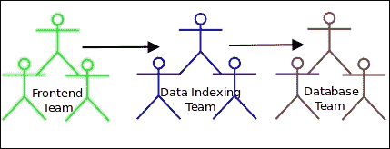
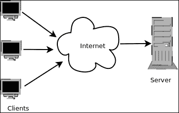
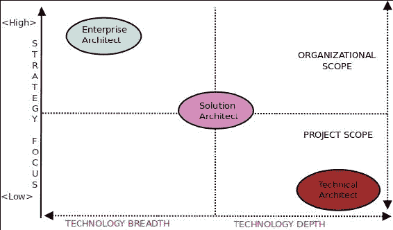
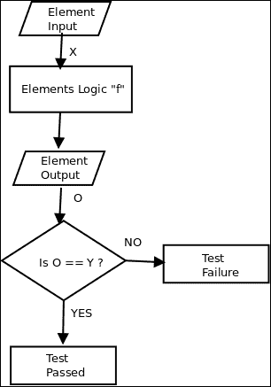
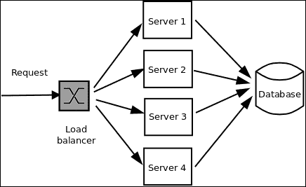

# 一、软件架构原理

这是一本关于 Python 的书。同时，这是一本关于软件架构及其各种属性的书，它们涉及到软件开发生命周期。

为了让您理解并将这两个方面结合在一起（这对于从本书中获得最大价值至关重要），掌握软件架构的基本原理、与之相关的主题和概念以及软件架构的各种质量属性非常重要。

许多在其组织中担任高级职务的软件工程师，通常对软件设计和架构的定义以及他们在构建可测试、可维护、可扩展、安全和功能性软件中所扮演的角色有着非常不同的解释。

尽管该领域有很多文献，既有传统的书籍形式，也有互联网上的文献，但我们当中的实践者往往对这些非常重要的概念有一个令人困惑的概念。这通常是由于*学习技术*所带来的压力，而不是学习建筑系统中使用技术的基本设计和建筑原则。这是软件开发组织中的一种常见做法，在软件开发组织中，交付工作代码的压力往往压倒并掩盖了其他一切。

像这本书这样的一本书，力求超越中间路线，将软件开发中与其架构质量属性相关的相当深奥的方面与使用编程语言、库和框架构建软件（在本例中，使用 Python 及其开发人员生态系统）的平凡细节联系起来。

这一介绍性章节的作用是揭开这些概念的神秘面纱，并以非常清晰的术语向读者解释这些概念，以便为读者理解本书其余部分做好准备。希望在本书的结尾，这些概念和它们的实际细节能为读者提供一个连贯的知识体系。

然后，我们将开始这条道路，不再赘述，大致将本章分为以下几节：

*   定义软件架构
*   软件架构与设计
*   软件架构方面
*   软件架构的特点
*   为什么软件架构很重要？
*   系统与企业架构
*   建筑质量属性
    *   可修改性
    *   可测试性
    *   可扩展性/性能
    *   安全
    *   可部署性

# 定义软件架构

在与该主题相关的文献中，有各种各样的软件架构定义。下面给出了一个简单的定义：

**软件架构**是对软件系统的子系统或组件以及它们之间关系的描述。

以下是**软件密集型系统架构描述推荐规程**（**IEEE**技术）中更正式的定义：

> *“架构是系统的基本组织，体现在其组件、组件之间的关系、与环境的关系以及指导其设计和演化的原则上。”*

如果你花一些时间在网络上搜索，就有可能得到无数这样的软件架构定义。措辞可能有所不同，但所有的定义都涉及软件架构的一些核心、基本方面。

## 软件架构与设计

根据作者的经验，无论是在线论坛还是离线论坛，系统的软件架构与设计之间的这种问题似乎经常出现。因此，让我们花一点时间来了解这方面。

虽然这两个术语有时可以互换使用，但建筑与设计的大致区别可以概括如下：

*   架构涉及系统中更高级别的描述结构和交互。它涉及那些涉及系统的*框架*决策的问题，不仅涉及其功能，还涉及其组织、技术、业务和质量属性。
*   设计是关于组织系统的部件或组件以及制造系统所涉及的子系统。这里的问题通常更接近所讨论的代码或模块，例如：
    *   将代码拆分为哪些模块？如何组织它们？
    *   将不同功能分配给哪些类（或模块）？
    *   对于“C”类，我应该使用哪种设计模式？
    *   我的对象在运行时如何交互？传递的消息是什么，以及如何组织交互？

软件架构是关于整个系统的设计，而软件设计主要是关于细节，通常是在构成这些子系统的各种子系统和组件的实现级别。

换句话说，*设计*一词在两种语境中都会出现，但区别在于前者比后者具有更高的抽象性和更大的范围。

软件架构和设计都有丰富的知识体系，分别是**架构模式和**设计模式。我们将在本书后面的章节中讨论这两个主题。

## 软件架构方面

在 IEEE 的正式定义和前面给出的非正式定义中，我们发现了一些常见的、反复出现的主题。为了进一步讨论软件架构，理解它们非常重要：

*   **系统**：系统是以特定方式组织以实现特定功能的组件集合。软件系统是这些软件组件的集合。系统通常可以分为子系统。
*   **结构**：结构是根据指导规则或原则分组或组织在一起的一组元素。这些元件可以是软件或硬件系统。软件架构可以根据观察者的上下文展示不同层次的结构。
*   **环境**：构建软件系统的上下文或环境，对其架构有直接影响。这些上下文可以是技术、业务、专业、操作等。
*   **利益相关者**：对系统及其成功感兴趣或关注的任何人、个人或群体。利益相关者包括架构师、开发团队、客户、项目经理、营销团队等。

现在您已经了解了软件架构的一些核心方面，让我们简要列出它的一些特性。

# 软件架构的特点

所有软件架构都表现出一组共同的特征。让我们看看这里最重要的一些。

## 架构定义了一个结构

系统的架构最好用系统的结构细节来表示。实践者通常将系统架构绘制为结构组件或类图，以表示子系统之间的关系。

例如，以下架构图描述了从分层数据库系统读取的应用的后端，该系统使用 ETL 流程加载：

显示系统结构的架构图示例

结构提供了对架构的洞察，并提供了一个独特的视角来分析架构的质量属性。

一些例子如下：

*   根据在运行时创建的对象以及它们之间的交互方式，运行时结构通常决定部署架构。部署架构与可伸缩性、性能、安全性和互操作性等质量属性密切相关。
*   模块结构，就如何将代码分解并组织成模块和包以进行任务分解而言，通常对系统的可维护性和可修改性（可扩展性）有直接影响。其解释如下：
    *   为了可扩展性而组织的代码通常会将父类保存在单独的定义良好的包中，并带有适当的文档和配置，这样外部模块就可以轻松地扩展父类，而不需要解决太多的依赖关系。
    *   依赖于外部或第三方开发人员（库、框架等）的代码通常会提供设置或部署步骤，这些步骤可以手动或自动从外部源中提取这些依赖项。这类代码还将提供文档（自述、安装等），清楚地记录这些步骤。

## 架构选择一组核心元素

一个定义良好的架构清楚地捕获了构建系统核心功能所需的、对系统具有持久影响的核心结构元素集。它并不打算记录系统每个组成部分的所有信息。

例如，架构师描述用户与 web 服务器交互以浏览网页的架构（典型的客户端/服务器架构）主要关注两个组件：用户的浏览器（客户端）和远程 web 服务器（服务器），它们构成了系统的核心元素。

系统可能有其他组件，如从服务器到客户端的路径中的多个缓存代理，或服务器上的远程缓存，以加快网页交付。然而，这不是架构描述的重点。

## 架构捕获早期设计决策

这是上述特征的必然结果。帮助架构师关注系统的一些核心元素（及其交互）的决策是关于系统的早期设计决策的结果。因此，由于其初始权重，这些决策在系统的进一步开发中起着重要作用。

例如，架构师在仔细分析系统需求后，可能会做出以下早期设计决策：

*   该系统将仅部署在 Linux 64 位服务器上，因为这满足客户机要求和性能约束
*   系统将使用 HTTP 作为实现后端 API 的协议
*   系统将尝试对 API 使用 HTTPS，这些 API 使用 2048 位或更高的加密证书将敏感数据从后端传输到前端
*   系统的编程语言是 Python 作为后端，Python 或 Ruby 作为前端

### 注

第一个决策在很大程度上冻结了针对特定操作系统和系统架构的系统部署选择。接下来的两个决策对实现后端 API 有很大的影响。最后一个决定冻结了系统的编程语言选择。

早期的设计决策需要在仔细分析需求并将其与约束（如组织、技术、人员和时间约束）匹配后做出。

## 架构管理干系人需求

系统的设计和构建最终是在利益相关者的要求下进行的。然而，由于这些需求的性质往往相互矛盾，因此不可能充分满足每个利益相关者的需求。以下是一些例子：

*   营销团队关注功能齐全的软件应用，而开发团队关注*功能蠕变*以及添加大量功能时的性能问题。
*   系统架构师关心的是使用最新的技术将部署扩展到云端，而项目经理关心的是这些技术部署对其预算的影响。最终用户关心的是正确的功能、性能、安全性、可用性和可靠性，而开发组织（架构师、开发团队和经理）关心的是交付所有这些质量，同时保持项目的进度和预算内。
*   一个好的架构会通过权衡来尽力平衡这些需求，并提供一个具有良好质量属性的系统，同时将人员和资源成本控制在有限的范围内。
*   架构（architecture）还为涉众提供了一种通用语言，使他们能够通过表达这些约束高效地进行沟通，并帮助架构师专注于最能捕获这些需求及其权衡的架构。

## 架构影响组织结构

架构描述的系统结构通常直接映射到构建这些系统的团队的结构。

例如，一个架构可能有一个数据访问层，该层描述了一组读取和写入大型数据集的服务。很自然，这样一个系统在功能上被分配给已经具备所需技能集的数据库团队。

由于系统的架构是其自上而下结构的最佳描述，因此它也经常被用作任务分解结构的基础。因此，软件架构通常直接影响到构建它的组织结构：

搜索 web 应用的系统架构

下图显示了构建此应用的团队结构的映射：

## 建筑受环境的影响

环境施加外部约束或限制，架构必须在这些约束或限制内运行。在文献中，这些通常在上下文中被称为*架构【参考：巴斯，卡兹曼】。一些例子如下：*

*   **质量属性要求**：在现代 web 应用中，将应用的可伸缩性和可用性要求指定为早期技术约束，并将其捕获到架构中是非常常见的。这是一个从业务角度来看的技术上下文示例。
*   **标准一致性**：在一些组织中，通常有大量的软件管理标准，特别是银行、保险和医疗领域的标准，这些标准被添加到架构的早期约束中。这是一个外部技术环境的示例。
*   **组织约束**：常见的情况是，组织要么拥有某种架构风格的经验，要么拥有一组使用某种编程环境的团队，这些编程环境采用了这种风格（J2EE 就是一个很好的例子），由于目前对此类架构和相关技能的投资，未来项目更愿意采用类似的架构，以降低成本并确保生产率。这是一个内部业务上下文的示例。
*   **专业背景**：除了这些外部环境外，架构师对系统架构的一系列选择大多是由他独特的经验形成的。对于架构师来说，在新项目中继续使用一组他过去最成功的架构选择是很常见的。

建筑选择也来自于个人的教育和专业培训，也来自于专业同行的影响。

## 架构记录了系统

每个系统都有一个架构，不管它是否有正式的文档记录。但是，适当记录的架构可以作为系统的有效文档。由于架构捕获了系统的初始需求、约束和干系人的权衡，因此正确地记录它是一种良好的实践。这些文件可作为以后培训的基础。它还有助于持续的干系人沟通，以及基于不断变化的需求对架构进行后续迭代。

记录架构的最简单方法是为系统和组织架构的不同方面（如组件架构、部署架构、通信架构以及团队或企业架构）创建图表。

可以提前捕获的其他数据包括系统需求、约束、早期设计决策以及这些决策的基本原理。

## 一个架构通常符合一种模式

大多数架构都符合某种风格，这些风格在实践中取得了很大的成功。这些被称为架构模式。此类模式的示例包括客户机-服务器、管道和过滤器、基于数据的架构等。当一个架构师选择一个现有的模式时，他会参考和重用大量与这些模式相关的现有用例和示例。在现代架构中，架构师的工作归结为混合和匹配现有的一组现成的模式来解决手头的问题。

例如，下图显示了客户机-服务器架构的示例：

客户机-服务器架构示例

下图描述了另一种常见的架构模式，即用于处理数据流的管道和过滤器架构：

管道和过滤器架构示例

我们将在本书后面看到架构模式的示例。

# 软件架构的重要性

到目前为止，我们已经讨论了软件架构的基本原理，也看到了它的一些特点。当然，这些部分假设软件架构很重要，并且是软件开发过程中的关键步骤。

现在是扮演魔鬼代言人的时候了，回顾一下软件架构，并提出一些关于它的存在性问题，如下所示：

*   为什么选择软件架构？
*   为什么软件架构很重要？
*   为什么不在没有正式软件架构的情况下构建一个系统呢？

让我们看一看软件架构提供的关键洞见，否则在非正式的软件开发过程中就会缺少这些洞见。我们只关注下表中系统的技术或开发方面：

<colgroup class="calibre18"><col class="calibre19"> <col class="calibre19"> <col class="calibre19"></colgroup> 
| 

方面

 | 

洞察力/影响

 | 

例子

 |
| --- | --- | --- |
| 架构为系统选择要优化的质量属性。 | 系统的可伸缩性、可用性、可修改性、安全性等方面取决于选择架构时的早期决策和权衡。你经常用一种属性来交换另一种属性。 | 为可伸缩性而优化的系统必须使用分散的架构进行开发，其中的元素不紧密耦合。例如：微服务、代理。 |
| 架构有助于早期原型设计。 | 定义架构允许开发组织尝试并构建早期原型，这为系统如何运行提供了有价值的见解，而无需自上而下构建完整的系统。 | 许多组织通常通过只构建这些服务的外部 API 并模仿其余行为来构建服务的快速原型。这允许进行早期集成测试，并在早期找出架构中的交互问题。 |
| 架构允许以组件方式构建系统。 | 拥有一个定义良好的架构允许重用和组装现有的、随时可用的组件来实现功能，而不必从头开始实现所有功能。 | 为服务提供现成构建块的库或框架。例如：Django/RoR 等 web 应用框架，芹菜等任务分发框架。 |
| 架构有助于管理对系统的更改。 | 架构允许架构师根据受影响的组件和未受影响的组件来确定对系统的更改范围。这有助于在实现新功能、性能修复等时将系统更改降至最低。 | 如果正确实现了架构，那么对系统数据库读取的性能修复只需要更改数据库和数据访问层（DAL）。它根本不需要接触应用代码。例如，这就是大多数现代 web 框架的构建方式。 |

还有许多其他方面与系统的业务上下文相关，架构为这些方面提供了有价值的见解。然而，由于这本书主要是关于软件架构的技术方面的，因此我们将讨论限制在上表中给出的内容上。

现在，让我们来回答第二个问题：

**为什么不在没有正式软件架构的情况下构建一个系统？**

如果你到目前为止一直在完全遵循这些论点，那么就不难找到答案。但是，可以用以下几句话来概括：

*   每个系统*都有*架构，无论是否有文档记录
*   对架构进行文档化使其正式化，允许在涉众之间共享，从而使变更管理和迭代开发成为可能
*   当您定义并记录了一个正式的架构时，软件架构的所有其他好处和特性都可以充分利用
*   您可能仍然能够在没有正式架构的情况下工作和构建功能系统，但它不会生成一个可扩展和可修改的系统，并且很可能会生成一个与原始需求相去甚远的质量属性集的系统

# 系统与企业架构

您可能已经在一些上下文中听到了*架构师*一词。以下工作*角色*或*头衔*在架构师的软件行业中非常常见：

*   技术架构师
*   安全架构师
*   信息架构师
*   基础设施架构师

您也可能听说过术语*系统架构师*，可能听说过术语*企业架构师*，也可能听说过*解决方案架构师*。有趣的问题是：*这些人做什么？*

让我们试着找到这个问题的答案。

企业架构师查看组织的总体业务和组织战略，并应用架构原则和实践指导组织完成执行其战略所需的业务、信息、流程和技术更改。企业架构师通常具有较高的战略重点和较低的技术重点。其他架构师角色负责自己的子系统和流程。例如：

*   **The Technical architect**: The Technical architect is concerned with the core technology (hardware/software/network) used in an organization. A Security architect creates or tunes the security strategy used in applications to fit the organization's information security goals. An Information architect comes up with architectural solutions to make information available to/from applications in a way that facilitates the organization's business goals.

    这些特定的架构角色都与它们自己的系统和子系统有关。因此，这些角色中的每一个都是系统架构师角色。

    这些架构师帮助企业架构师理解他们所负责的每个业务领域的较小图片，这有助于企业架构师获得有助于他制定业务和组织战略的信息。

*   **系统架构师**：系统架构师通常具有更高的技术关注点和更低的策略关注点。在一些面向服务的软件组织中，有一个解决方案架构师是一种做法，他将不同的系统组合起来，为特定的客户创建一个解决方案。在这种情况下，不同的架构师角色通常被组合成一个角色，这取决于组织的规模以及项目的具体时间和成本要求。
*   **解决方案架构师**：解决方案架构师在战略与技术焦点、组织与项目范围之间通常处于中间位置。

下面的示意图描述了一个组织中的不同层——**技术**、**应用**、**数据**、**人员**、**流程**、**业务**，并将架构师角色的重点区域非常明确：

企业与系统架构师

让我们稍微讨论一下前面的图表，以了解它所展示的图片。

系统架构师如图左下方所示，查看企业的系统组件。他的重点是为企业提供动力的应用、它们的数据以及为应用提供动力的硬件和软件堆栈。

另一方面，企业架构师位于顶部，具有自上而下的企业视图，包括业务目标和人员，而不仅仅是为组织提供动力的底层系统。业务流程的垂直堆栈将为组织提供动力的技术组件与其人员和业务组件连接起来。这些过程由企业架构师在与其他涉众讨论时定义。

现在，您已经了解了企业和系统架构背后的情况，让我们看看一些正式定义：

> *“企业架构是定义组织结构和行为的概念蓝图。它决定了组织的结构、流程、人员和信息流如何与其核心目标保持一致，以有效实现其当前和未来目标。”*
> 
> 系统架构（architecture）是系统的基本组织，由其结构和行为视图表示。结构由系统的组件决定，行为由组件之间的关系及其与外部系统的交互决定

企业架构师关心的是如何调整组织中的不同元素及其相互作用，以高效地实现组织的目标。在这项工作中，他不仅需要组织中技术架构师的支持，还需要组织管理人员的支持，如项目经理和人力资源专业人员。

另一方面，系统架构师担心核心系统架构如何映射到软件和硬件架构，以及人类与系统中组件交互的各种细节。他的关注从未超出系统及其交互定义的边界。

下图描述了我们到目前为止讨论的不同架构师角色的不同关注领域和范围：

软件组织中各种架构师角色的范围和重点

# 建筑质量属性

现在让我们关注一个方面，它构成了本书其余部分的主要主题——建筑质量属性。

在上一节中，我们讨论了架构如何平衡和优化干系人需求。我们还看到了一些冲突涉众需求的例子，架构师通过选择一个进行必要权衡的架构来寻求平衡。

术语**质量属性**被用来松散地定义架构需要权衡的一些方面。现在是正式定义架构质量属性的时候了：

> *“质量属性是系统的可测量和可测试属性，可用于评估系统在其规定环境中与其非功能方面的性能”*

有许多方面符合建筑质量属性的一般定义。然而，在本书的其余部分中，我们将重点关注以下质量属性：

*   可修改性
*   可测试性
*   可扩展性和性能
*   可利用性
*   安全
*   可部署性

## 可修改性

许多研究表明，一个典型的软件系统的大约 80%的成本发生在初始开发和部署之后。这说明了可修改性对系统初始架构的重要性。

可修改性可以定义为对系统进行更改的容易程度，以及系统适应更改的灵活性。这是一个重要的质量属性，因为几乎每个软件系统在其生命周期内都会发生更改，以修复问题、添加新功能、提高性能等等。

从架构师的角度来看，对可修改性的兴趣在于：

*   **难度**：对系统进行更改的难度
*   **成本**：变更所需的时间和资源
*   **风险**：与系统变更相关的任何风险

现在，我们在这里谈论的是什么样的变化？它是对代码的更改、对部署的更改还是对整个架构的更改？

答案是：它可以是*任何*级别。

从架构的角度来看，这些更改通常可以在以下三个级别捕获：

1.  **局部**：局部变化只影响特定元素。元素可以是一段代码，如函数、类、模块或配置元素，如 XML 或 JSON 文件。变更*不会级联*到任何相邻元件或系统的其余部分。本地更改最容易进行，风险最小。这些更改通常可以通过本地单元测试快速验证。
2.  **Non-local**: These changes involve more than one element. The examples are as follows:
    *   修改数据库模式，然后需要将其级联到应用代码中表示该模式的模型类中。
    *   在 JSON 文件中添加新的配置参数，然后需要由使用该参数解析文件和/或应用的解析器进行处理。

    非本地更改比本地更改更难进行，需要仔细分析，并尽可能进行集成测试以避免代码回归。

3.  **Global**: These changes either involve architectural changes from top down, or changes to elements at the global level, which cascade down to a significant part of the software system. The examples are as follows:
    *   将系统架构从 RESTful 更改为基于消息传递（SOAP、XML-RPC 等）的 web 服务
    *   将 web 应用控制器从 Django 更改为基于 js 的组件
    *   性能更改要求，需要在前端预加载所有数据，以避免在线新闻应用的任何内联模型 API 调用

    就资源、时间和金钱而言，这些变化风险最大，成本也最高。架构师需要仔细检查变更可能产生的不同场景，并让他的团队通过集成测试对其进行建模。mock 在此类大规模更改中非常有用。

下表显示了不同级别系统可修改性的**成本**和**风险**之间的关系：

<colgroup class="calibre18"><col class="calibre19"> <col class="calibre19"> <col class="calibre19"></colgroup> 
| 

数量

 | 

费用

 | 

危险

 |
| --- | --- | --- |
| 地方的 | 低的 | 低的 |
| 非本地 | 中等的 | 中等的 |
| 全球的 | 高的 | 高的 |

代码级别的可修改性也与可读性直接相关：

> *“代码可读性越强，可修改性越强。代码的可修改性与其可读性成比例下降。”*

可修改性方面也与代码的可维护性有关。元素紧密耦合的代码模块的修改率远远低于元素松散耦合的模块。这是可修改性的**耦合**方面。

类似地，一个没有明确定义其角色和职责的类或模块将比另一个具有明确定义的职责和功能的类或模块更难修改。这一方面被称为软件模块的**内聚**。

下表显示了虚模块 A 的**内聚**、**耦合**和**可修改性**之间的关系。假设耦合是从该模块到另一个模块 B：

<colgroup class="calibre18"><col class="calibre19"> <col class="calibre19"> <col class="calibre19"></colgroup> 
| 

凝聚性

 | 

耦合

 | 

可修改性

 |
| --- | --- | --- |
| 低的 | 高的 | 低的 |
| 低的 | 低的 | 中等的 |
| 高的 | 高的 | 中等的 |
| 高的 | 低的 | 高的 |

从上表可以很清楚地看出，对于代码模块的可修改性来说，具有较高的内聚性和较低的耦合性是最好的方案。

影响可修改性的其他因素如下：

*   **模块大小（代码行数）**：可修改性随大小增加而降低。
*   **在一个模块上工作的团队成员数量**：通常，由于合并和维护统一的代码库的复杂性，当更多团队成员在该模块上工作时，该模块的可修改性会降低。
*   **模块的外部第三方依赖**：外部第三方依赖的数量越多，修改模块的难度就越大。这可以看作是模块耦合方面的扩展。
*   **模块 API 使用错误**：如果有其他模块使用某个模块的私有数据，而不是（正确）使用其公共 API，则修改该模块会更加困难。确保组织中模块的正确使用标准以避免此类情况非常重要。这可以被认为是紧**耦合**的极端情况。

## 可测试性

可测试性是指软件系统在多大程度上能够通过测试证明其故障。可测试性也可以被认为是软件系统*对最终用户隐藏*故障的程度，系统集成测试可测试性越强，隐藏故障的能力越弱。

可测试性还与软件系统行为的可预测性有关。系统的可预测性越高，就越允许重复测试，也就越允许基于一组输入数据或标准开发标准测试套件。不可预测的系统不太适合任何类型的测试，或者，在极端情况下，根本不可测试。

在软件测试中，您试图通过向系统发送一组已知输入，然后观察系统的一组已知输出来控制系统的行为。这两者结合起来形成一个测试用例。测试套件或测试线束通常由许多这样的测试用例组成。

测试断言是当测试元素的输出与给定输入的预期输出不匹配时，用来使测试用例失败的技术。这些断言通常在测试执行阶段的特定步骤手动编码，以检查 testcase 不同步骤的数据值：

函数 f（'X'）='Y'的简单单元测试用例的代表性流程图

上图显示了样本输入“**X【T4]”的可测试功能**“f”**的代表性流程图示例，预期输出为“**Y**。**

为了在出现故障时重新创建会话或状态，通常使用*录制*/*回放*策略。此采用专门的软件（如 Selenium），记录导致特定故障的所有用户操作，并将其保存为测试用例。通过使用试图模拟相同测试用例的相同软件重放测试用例来复制测试；这是通过重复相同的 UI 操作集和顺序来完成的。

可测试性也与代码的复杂性有关，其方式与可修改性非常相似。当系统的一部分可以被隔离并独立于系统的其余部分工作时，系统变得更易于测试。换句话说，低耦合的系统比高耦合的系统更容易测试。

与前面提到的可预测性相关的可测试性的另一个方面是减少非确定性。在编写测试套件时，我们需要将要测试的元素与系统中行为不可预测的其他部分隔离开来，以便被测试元素的行为变得可预测。

一个例子是一个多线程的系统，它响应在系统的其他部分中引发的事件。整个系统可能是相当不可预测的，并且不适合重复测试。相反，我们需要分离事件子系统，并可能模拟其行为，以便可以控制这些输入，并且接收事件的子系统变得可预测，因此是可测试的。

以下示意图说明了系统的可测试性和可预测性与其组件之间的**耦合**和**内聚**之间的关系：

系统的可测试性和可预测性与耦合性和内聚性的关系

## 可伸缩性

现代 web 应用都是关于*扩展*。如果您是任何现代软件组织的一员，您很可能听说过或参与过为云编写的应用，该应用能够按需弹性扩展。

系统的可伸缩性是指系统能够根据需要适应不断增加的工作负载，同时将其性能保持在可接受的范围内。

软件系统上下文中的可伸缩性通常分为两类，如下所示：

*   **Horizontal scalability**: Horizontal scalability implies scaling out/in a software system by adding more computing nodes to it. Advances in cluster computing in the last decade have given rise to the advent of commercial horizontally scalable **elastic** systems as services on the Web. A well-known example is Amazon Web Services. In horizontally scalable systems, typically, data and/or computation is done on units or nodes, which are, usually, virtual machines running on commodity systems known as virtual private servers (VPS). The scalability is achieved "n" times by adding n or more nodes to the system, typically fronted by a load balancer. Scaling out means expanding the scalability by adding more nodes, and scaling in means reducing the scalability by removing existing nodes:

    

    显示水平扩展 web 应用服务器的部署架构示例

*   **垂直可伸缩性**：垂直可伸缩性包括在系统中的单个节点上添加或删除资源。这通常是通过在集群中的单个虚拟服务器上添加或删除 CPU 或 RAM（内存）来实现的。前者称为放大，后者称为缩小。另一种扩展是增加系统中现有软件进程的容量，通常是通过增加其处理能力。这通常是通过增加应用可用的进程或线程的数量来实现的。一些例子如下：
    *   通过增加工作进程的数量来增加 Nginx 服务器进程的容量
    *   通过增加最大连接数来增加 PostgreSQL server 的容量

## 性能

系统的性能与其可伸缩性有关。系统的性能可定义如下：

> *“计算机系统的性能是指系统使用给定单位的计算资源完成的工作量。工作/单位比率越高，性能越高。”*

衡量性能的计算资源单位可以是以下单位之一：

*   **响应时间**：以实时（用户时间）和时钟时间（CPU 时间）计算，一个函数或任何执行单元执行所需的时间。
*   **潜伏期**：系统获得刺激，然后提供响应所需的时间。例如，从最终用户的角度衡量，web 应用的请求-响应循环完成所需的时间。
*   **吞吐量**：系统处理信息的速率。具有更高性能的系统通常具有更高的吞吐量和相应的更高的可伸缩性。电子商务网站的吞吐量就是一个例子，以每分钟完成的交易数量来衡量。

性能与可伸缩性密切相关，尤其是垂直可伸缩性。在内存管理方面具有优异性能的系统可以通过添加更多 RAM 轻松地垂直扩展。

类似地，具有多线程工作负载特征且为多核 CPU 编写的系统将通过添加更多 CPU 核来扩展。

水平可伸缩性被认为与系统自身计算节点内的性能没有直接联系。但是，如果系统的编写方式不能有效地利用网络，从而产生网络延迟问题，那么它可能在水平有效扩展方面存在问题，因为花费在网络延迟上的时间将抵消通过分配工作而获得的任何可伸缩性增益。

一些动态编程语言（如 Python）在垂直扩展时存在内置的可伸缩性问题。例如，Python（CPython）的**全局解释器锁**（**GIL**）阻止它充分利用可用的 CPU 内核进行多线程计算。

## 可用性

可用性是指软件系统在需要时准备好执行其操作的属性。

系统的可用性与其可靠性密切相关。系统越可靠，可用性就越高。

修改可用性的另一个因素是系统从故障中恢复的能力。系统可能非常可靠，但如果系统无法从其子系统的完全或部分故障中恢复，则可能无法保证可用性。此相位称为**恢复**。

系统的可用性可定义如下：

> *“系统的可用性是指当系统被随机调用或调用时，系统处于完全可操作状态以执行其功能的程度。”*

从数学上讲，这可以表示为：

*可用性*=*平均无故障时间*/（*平均无故障时间*+*平均无故障时间*）

请看一下上述公式中使用的下列术语：

*   **平均无故障时间**：平均无故障时间
*   **MTTR**：平均修复时间

这通常被称为系统的**任务能力速率**。

**可用性**的技术与恢复技术密切相关。这是因为系统永远不可能 100%可用。相反，需要计划故障和从故障中恢复的策略，这直接决定了可用性。这些技术可分为以下几类：

*   **故障检测**：检测故障并采取措施的能力有助于避免系统或系统部分完全不可用的情况。故障检测通常涉及监控、心跳和 ping/echo 消息等步骤，这些消息被发送到系统中的节点，以及测量响应以计算节点是否处于活动状态、死亡状态或处于故障过程中。
*   **故障恢复**：一旦检测到故障，下一步是准备系统从故障中恢复，并使其处于系统可用的状态。这里使用的典型策略包括热/热备盘（主动/被动冗余）、回滚、正常降级和重试。
*   **故障预防**：该方法使用主动方法预测并防止故障的发生，从而使系统没有机会进行恢复。

系统的可用性通过 CAP 定理与其数据的一致性密切相关，CAP 定理在理论上限制了系统在网络分区情况下对一致性与可用性的权衡。CAP 定理指出，系统可以在一致性或可用性之间进行选择，通常会导致两大类系统，即 CP（一致且容忍网络故障）和 AP（可用且容忍网络故障）。

可用性还与系统的可伸缩性策略、性能指标及其安全性有关。例如，高度水平可扩展的系统将具有非常高的可用性，因为它允许负载平衡器确定非活动节点，并快速将它们从配置中移除。

一个试图扩大规模的系统可能需要仔细监控其性能指标。如果软件进程因 CPU 时间或内存等系统资源而受到挤压，则即使当系统所在的节点完全可用时，系统也可能存在可用性问题。这是性能测量变得至关重要的地方，需要监控和优化系统的负载系数。

随着 web 应用和分布式计算的日益普及，安全性也是影响可用性的一个方面。恶意黑客有可能在您的服务器上发起远程拒绝服务攻击，如果系统无法抵御此类攻击，则可能导致系统不可用或仅部分可用。

## 安全

在软件领域中，安全性可以定义为系统避免未经身份验证的访问对其数据和逻辑造成损害的能力程度，同时继续向其他经过适当身份验证的系统和角色提供服务。

安全危机或攻击发生在系统被故意破坏，以获取对其的非法访问，从而破坏其服务、复制或修改其数据，或拒绝其合法用户访问时。

在现代软件系统中，用户被绑定到特定的角色，这些角色对系统的不同部分拥有独占权。例如，具有数据库的典型 web 应用可以定义以下角色：

*   **用户**：系统的最终用户，可登录并访问其私人数据
*   **dbadmin**：数据库管理员，可以查看、修改或删除所有数据库数据
*   **报表**：报表管理员，仅对数据库中处理报表生成的部分和代码拥有管理员权限
*   **管理员**：超级用户，对整个系统拥有编辑权限

这种通过用户角色分配系统控制的方式称为**访问控制**。访问控制的工作原理是将用户角色与某些系统权限相关联，从而将实际用户登录与这些权限授予的权限分离。

这个原则就是安全的**授权**技术。

安全的另一个方面是关于交易，其中每个人必须验证另一人的实际身份。公钥加密、消息签名等是这里常用的技术。例如，当您使用 GPG 或 PGP 密钥在电子邮件上签名时，您正在向电子邮件另一侧的朋友 B 先生验证自己-*此邮件的发件人实际上是我，A 先生*。这个原则就是安全的**认证**技术。

安全的其他方面如下：

*   **完整性**：这些技术用于确保数据或信息在发送给最终用户的过程中不会被篡改。例如消息散列、CRC 校验和等。
*   **来源**：这些技术用于确保终端接收器数据的来源与它声称的来源完全相同。例如，SPF、发件人 ID（用于电子邮件）、公钥证书和链（用于使用 SSL 的网站）等。
*   **真实性**：这些技术将消息的完整性和来源结合在一起。这确保了消息的作者不能否认消息的内容及其来源（他/她自己）。这通常使用**数字证书机制**。

## 可展开性

可部署性是质量属性之一，它不是软件的基本属性。然而，在本书中，我们对这方面感兴趣，因为它在 Python 编程语言生态系统的许多方面起着关键作用，并且对程序员有用。

可部署性是将软件从开发环境带到生产环境的容易程度。它更多地是构建系统时使用的技术环境、模块结构和编程运行时/语言的功能，与系统的实际逻辑或代码无关。

以下是决定部署能力的一些因素：

*   **模块结构**：如果您的系统将其代码组织成定义良好的模块/项目，这些模块/项目将系统划分为易于部署的子单元，那么部署就容易多了。另一方面，如果代码通过单个设置步骤组织成一个整体项目，则很难将代码部署到多节点集群中。
*   **生产与开发环境**：拥有一个与开发环境结构非常相似的生产环境，使得部署变得容易。当环境相似时，开发人员/Devops 团队使用的同一组脚本和工具链可用于将系统部署到开发服务器和生产服务器上，其中大部分配置都有微小更改。
*   **开发生态系统支持**：为您的系统运行时提供成熟的工具链支持，允许自动建立并满足依赖项等配置，从而提高可部署性。Python 等编程语言在其开发生态系统中提供了丰富的此类支持，Devops 专业人员可以利用丰富的工具阵列。
*   **标准化配置**：对于开发人员和生产环境，最好保持配置结构（文件、数据库表和其他）相同。实际对象或文件名可能不同，但如果两个环境中的配置结构差异很大，则可部署性会降低，因为需要额外的工作来将环境的配置映射到其结构。
*   **标准化基础架构：**众所周知，将部署保持在一组同质或标准化的基础架构上可以极大地提高部署能力。例如，如果您将前端应用标准化为在 4 GB RAM、基于 Debian 的 64 位 Linux VPS 上运行，则可以很容易地使用脚本或使用 Amazon 等提供商的弹性计算方法自动部署此类节点，并在开发和生产环境中保留一组标准脚本。另一方面，如果您的生产部署由异构基础架构组成，例如，具有不同容量和资源规格的 Windows 和 Linux 服务器的混合，则每种类型的基础架构的工作通常会加倍，从而降低部署能力。
*   **容器的使用**：容器软件的用户，随着在 Linux 容器上构建的 Docker 和 Vagrant 等技术的出现而普及，已经成为在服务器上部署软件的最新趋势。容器的使用允许您标准化您的软件，并通过减少启动/停止节点所需的开销来简化部署，因为容器不会带来完整虚拟机的开销。这是一个值得关注的有趣趋势。

# 总结

在本章中，我们学习了软件架构。我们看到了软件架构的不同方面，并了解到每个架构都包含一个系统，该系统的结构在其利益相关者的环境中工作。我们简要介绍了软件架构与软件设计的区别。

我们继续研究软件架构的各种特征，例如软件架构如何定义结构、选择核心元素集以及如何连接利益相关者。

然后，我们讨论了软件架构对组织的重要性这一重要问题，以及为什么为您的软件系统定义一个正式的软件架构是一个好主意。

接下来讨论了架构师在组织中不同角色的区别。我们看到了系统架构师在组织中扮演的各种角色，以及企业架构师的关注点与系统架构师的关注点是如何不同的。通过举例说明了战略和技术广度与技术深度的关系。

然后，我们讨论了这本书的主题元素建筑质量属性。我们定义了什么是质量属性，然后非常详细地研究了可修改性、可测试性、可伸缩性/性能、安全性和可部署性等质量属性。在讨论这些属性的细节时，我们讨论了它们的定义、技术以及它们之间的关系。

以本章为基础，我们现在准备好接受这些质量属性，然后详细讨论使用 Python 编程语言实现这些属性的各种策略和技术。这构成了本书的其余部分。

在下一章中，我们将从本章中讨论的最重要的质量属性之一开始，即可修改性及其相关属性可读性。