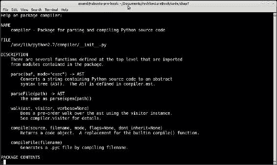
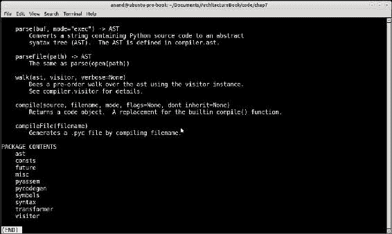

# 第 7 章 Python 中的设计模式

设计模式通过重用成功的设计和体系结构简化了构建软件。模式建立在软件工程师和架构师的集体经验之上。当遇到需要编写新代码的问题时，经验丰富的软件架构师倾向于利用可用设计/架构模式的丰富生态系统。

当一个特定的设计被证明能成功地反复解决某些类型的问题时，模式就会演化。当专家发现特定的设计或体系结构有助于他们一致地解决相关问题时，他们倾向于越来越多地应用它，将解决方案的结构编码到模式中。

Python 是一种支持动态类型和高级面向对象结构（如类和元类、一流函数、协同例程、可调用对象等）的语言，是构建可重用设计和体系结构模式的一个非常丰富的平台。事实上，与 C++、java 等语言不同，您通常会发现在 Python 中实现多种设计模式的方法有多种。而且，通常情况下，您会发现实现模式的 Python 方法比（比如）将标准实现从 C++/Java 复制到 Python 中更直观、更具说明性。

本章的重点主要放在后一个方面，说明如何构建设计模式，这些设计模式比通常关于这个主题的书籍和文献更具 python 风格。它的目的不是全面指导设计模式，尽管我们将在进入内容时涵盖大多数常见方面。

我们计划在本章中介绍的主题如下：

*   设计模式元素
*   设计模式的类别
*   可插入散列算法
*   可插入散列算法综述
*   Python 中的模式——创造性
    *   单一模式
    *   博格模式
    *   工厂模式
    *   原型模式
    *   构建器模式
*   Python 中的模式——结构化
    *   适配器模式
    *   立面图案
    *   代理模式
*   Python 中的模式——行为模式
    *   迭代器模式
    *   观察者模式
    *   国家模式

# 设计模式-元素

设计模式试图记录面向对象系统中解决一个问题或一类问题的重复设计的那些方面。

当我们检查设计模式时，我们发现几乎所有的模式都有以下元素：

*   **名称**：著名的手柄或标题，常用于描述图案。拥有设计模式的标准名称有助于交流并增加我们的设计词汇。
*   **上下文**：这就是问题出现的情况。上下文可以是通用的，如*开发 web 应用软件*，也可以是特定的，如*在发布者-订阅者系统*的共享内存实现中实现资源更改通知。
*   **问题**：描述应用该模式的实际问题。一个问题可以用它的力来描述，如下所示：
    *   **需求**：解决方案应该满足的需求，例如*发布者-订阅者模式实现必须支持 HTTP*。
    *   **约束**：解决方案的约束，如果有的话，例如*可伸缩的对等发布者模式不应该为发布通知*交换三条以上的消息。
    *   **属性**：解决方案需要具备的属性，例如*该解决方案应在 Windows 和 Linux 平台*上同样有效。
*   **解决方案**：显示问题的实际解决方案。它描述了构成解决方案的元素的结构和职责、静态关系和运行时交互（协作）。一个解决方案还应该讨论它所解决的问题的*力量，以及它所没有的力量。解决方案还应尝试提及其后果，即应用模式的结果和权衡。*

### 注

设计模式解决方案几乎永远不会解决导致它的问题的所有力量，但会将其中一些力量留给相关的或替代的实现。

# 设计模式的类别

根据选择的标准，设计模式可以以不同的方式进行分类。一种普遍接受的分类方法是使用模式的目的标准。换句话说，我们会问模式该模式解决了哪类问题。

这种分类为我们提供了三种简洁的模式类。详情如下:

*   **Creational**：这些模式解决了与对象创建和初始化相关的问题。这些问题最早出现在使用对象和类解决问题的生命周期中。请看以下示例：
    *   **工厂模式**：模式工厂类解决了“如何确保以可重复和可预测的方式创建相关类实例？”
    *   **原型模式**：原型模式解决了“实例化一个对象，然后通过复制这个对象来创建数百个类似对象的智能方法是什么？”
    *   **单例和相关模式**：“如何确保我创建的类的任何实例只创建和初始化一次”或“如何确保类的任何实例共享相同的初始状态？”问题由单例和相关模式解决
*   **结构**：这些模式关注的是将对象组合并组装成有意义的结构，这为架构师和开发人员提供了可重用的行为，其中“整体大于部分之和”。当然，一旦对象被创建，它们就会出现在解决对象问题的下一步中。这些问题的例子如下：
    *   **代理模式**：“如何通过包装器控制对对象及其方法的访问，行为在顶部？”
    *   **复合模式**：“我如何在同时用同一个类来表示一个由多个组件组成的对象，比如一个小部件树？”
*   **行为**：这些模式解决了源于对象运行时交互的问题，以及它们如何分配责任。当然，它们发生在类创建之后的后期，然后组合成更大的结构。以下是几个例子：
    *   **在这种情况下使用中间模式**：“确保所有对象在运行时使用松耦合来相互引用，以提升交互的运行时动态性”
    *   **在这种情况下使用观察者模式**：“当资源的状态发生变化时，一个对象希望得到通知，但它不想一直轮询资源来发现这一点。系统中可能有很多这样的对象实例”

### 注

创建、结构和行为模式的顺序在运行时隐含地嵌入了系统中对象的生命周期。首先创建对象（创造性），然后将其组合成有用的结构（结构性），然后进行交互（行为性）。

现在让我们把注意力转向本章的主题，即用 Python 自己的不可模仿的方式在 Python 中实现模式。我们将看一个说明性的例子来说明问题。

## 可插拔散列算法

让我们看看下面的问题。

您希望从输入流（文件或网络套接字）读取数据，并以分块方式散列内容。您可以编写如下代码：

```py
# hash_stream.py
from hashlib import md5

def hash_stream(stream, chunk_size=4096):
    """ Hash a stream of data using md5 """

    shash = md5()

    for chunk in iter(lambda: stream.read(chunk_size), ''):
        shash.update(chunk)

    return shash.hexdigest()
```

### 注

除非另有明确说明，否则所有代码都使用 Python3。

```py
>>> import hash_stream
>>> hash_stream.hash_stream(open('hash_stream.py'))
'e51e8ddf511d64aeb460ef12a43ce480'

```

因此，正如预期的那样，这是可行的。

现在让我们假设您想要一个更具可重用性和通用性的实现，一个可以与多种哈希算法一起工作的实现。您首先尝试修改以前的代码，但很快就会意识到这意味着要重写大量代码，这不是一种非常明智的做法：

```py
# hash_stream.py
from hashlib import sha1
from hashlib import md5

def hash_stream_sha1(stream, chunk_size=4096):
    """ Hash a stream of data using sha1 """

    shash = sha1()

    for chunk in iter(lambda: stream.read(chunk_size), ''):
        shash.update(chunk.encode('utf-8'))

    return shash.hexdigest()

def hash_stream_md5(stream, chunk_size=4096):
    """ Hash a stream of data using md5 """

    shash = md5()

    for chunk in iter(lambda: stream.read(chunk_size), ''):
        shash.update(chunk.encode('utf-8'))

    return shash.hexdigest()
```

```py
>>> import hash_stream
>>> hash_stream.hash_stream_md5(open('hash_stream.py'))
'e752a82db93e145fcb315277f3045f8d'
>>> hash_stream.hash_stream_sha1(open('hash_stream.py'))
'360e3bd56f788ee1a2d8c7eeb3e2a5a34cca1710'

```

您认识到，通过使用一个类可以重用大量代码。作为一名经验丰富的程序员，经过几次迭代后，您可能会得到类似的结果：

```py
# hasher.py
class StreamHasher(object):
    """ Stream hasher class with configurable algorithm """

    def __init__(self, algorithm, chunk_size=4096):
        self.chunk_size = chunk_size
        self.hash = algorithm()

    def get_hash(self, stream):

        for chunk in iter(lambda: stream.read(self.chunk_size), ''):
            self.hash.update(chunk.encode('utf-8'))

        return self.hash.hexdigest()  
```

首先让我们尝试使用`md5`，如下所示：

```py
>>> import hasher
>>> from hashlib import md5
>>> md5h = hasher.StreamHasher(algorithm=md5)
>>> md5h.get_hash(open('hasher.py'))
'7d89cdc1f11ec62ec918e0c6e5ea550d'

```

现在使用`sha1`：

```py
>>> from hashlib import sha1
>>> shah_h = hasher.StreamHasher(algorithm=sha1)
>>> shah_h.get_hash(open('hasher.py'))
'1f0976e070b3320b60819c6aef5bd6b0486389dd'

```

现在必须清楚的是，您可以构建不同的 hasher 对象，每个对象都有一个特定的算法，该算法将返回流的相应 hash 摘要（在本例中是一个文件）。

现在让我们总结一下我们刚才做的事情。

我们首先开发了一个函数`hash_stream`，它接收一个流对象，并使用`md5`算法对其进行分块散列。然后，我们开发了一个名为`StreamHasher`的类，它允许我们一次使用一个算法对其进行配置，从而使代码更加可重用。我们通过方法`get_hash`获得哈希摘要，该方法接受流对象作为参数。

现在让我们把注意力转向更多 Python 可以为我们做什么。

我们的类对于不同的散列算法来说是通用的，并且肯定是更可重用的，但是有没有一种方法可以像调用函数一样调用它呢？那太好了，不是吗？

下面是我们`StreamHasher`类的一个轻微的重新实现，它的作用就是：

```py
# hasher.py
class StreamHasher(object):
    """ Stream hasher class with configurable algorithm """

    def __init__(self, algorithm, chunk_size=4096):
        self.chunk_size = chunk_size
        self.hash = algorithm()

    def __call__(self, stream):

        for chunk in iter(lambda: stream.read(self.chunk_size), ''):
            self.hash.update(chunk.encode('utf-8'))

        return self.hash.hexdigest() 
```

在上一个代码中我们做了什么？我们只是将`get_hash`函数重命名为`Get_Call`。让我们看看这有什么影响。

```py
>>> from hashlib import md5, sha1
>>> md5_h = hasher.StreamHasher(md5)
>>> md5_h(open('hasher.py'))
'ad5d5673a3c9a4f421240c4dbc139b22'
>>> sha_h = hasher.StreamHasher(sha1)
>>> sha_h(open('hasher.py'))
'd174e2fae1d6e1605146ca9d7ca6ee927a74d6f2'

```

通过简单地将 file 对象传递给类，我们可以像调用函数一样调用该类的实例。

因此，我们的类不仅为我们提供了可重用和通用的代码，而且还将其视为一个函数。这是通过简单地实现神奇的方法`__call__`使我们的类成为 Python 中的可调用类型而实现的。

### 注

Python 中的**可调用项**是可以调用的任何对象。换句话说，`x`是可调用的，如果我们可以执行`x()`——根据`__call__`方法被重写的方式，可以使用或不使用参数。函数是最简单和最熟悉的可调用函数。

在 Python 中，`foo(args)`是`foo.__call__(args)`的语法糖。

## 总结可插拔哈希算法

那么前面的示例说明了什么？它通过重写一个特殊的方法，使任何对象都可以调用，从而以一种更奇特、更强大的方式（由于 Python 的强大功能以及它在这种情况下的工作方式），说明了 Python 在处理现有问题方面的强大能力，而这个问题传统上在其他编程语言中是可以解决的。

但我们在这里实现的模式是什么？我们在本章的开头讨论过，只有当某事物解决了一类问题时，它才是一种模式。在这个特殊的插图中有隐藏的图案吗？

是的，这是战略行为模式的实施：

*当我们需要一个类的不同行为，并且我们应该能够使用许多可用行为或算法*中的一种来配置一个类时，使用*策略模式。*

在这个特殊的例子中，我们需要一个支持不同算法的类来执行相同的操作，使用块对流中的数据进行哈希处理，并返回摘要。该类接受该算法作为参数，由于所有算法都支持相同的返回数据的方法（方法`hexdigest`，因此我们能够以非常简单的方式实现该类。

让我们继续我们的旅程，找出我们可以使用 Python 编写的其他有趣模式，以及它解决问题的独特方式。在这段旅程中，我们将遵循创造、结构和行为模式的顺序。

### 注

我们对随后模式的讨论是非常务实的。它可能不会使用流行的**四人帮**（**G4**模式）所使用的正式语言—设计模式的最基本方法。我们的重点是展示 Python 在构建模式方面的能力，而不是正确使用形式主义。

# Python 中的模式——创造性

在本节中，我们将了解一些常见的创作模式。我们将从 Singleton 开始，然后依次进入 Prototype、Builder 和 Factory。

## 独生子女模式

Singleton 模式是整个设计模式万神殿中最著名、最容易理解的模式之一。它通常被定义为：

*Singleton 是一个只有一个实例和定义良好的访问点的类*。

单身人士的要求可概括如下：

*   一个类必须只有一个实例可以通过已知的访问点访问
*   该类必须在不破坏模式的情况下通过继承进行扩展
*   下面显示 Python 中最简单的单例实现。通过覆盖基础`object`类型

    ```py
    # singleton.py
    class Singleton(object):
        """ Singleton in Python """

        _instance = None

        def __new__(cls):
            if cls._instance == None:
                cls._instance = object.__new__(cls)
            return cls._instance
    ```

    ```py
    >>> from singleton import Singleton
    >>> s1 = Singleton()
    >>> s2 = Singleton()
    >>> s1==s2
    True

    ```

    的`__new__`方法完成
*   由于我们将需要此检查一段时间，因此让我们为其定义一个函数：

    ```py
    def test_single(cls):
        """ Test if passed class is a singleton """
        return cls() == cls()
    ```

*   现在让我们看看我们的单例实现是否满足第二个要求。我们将定义一个简单的子类来测试它：

    ```py
    class SingletonA(Singleton):
        pass

    >>> test_single(SingletonA)
    True
    ```

凉的因此，我们的简单实现通过了测试。我们现在结束了吗？

正如我们前面所讨论的，Python 的要点是，由于其动态性和灵活性，它提供了许多实现模式的方法。因此，让我们暂时关注一下 Singleton，看看是否可以获得一些示例，让我们深入了解 Python 的威力：

```py
class MetaSingleton(type):
    """ A type for Singleton classes (overrides __call__) """    

    def __init__(cls, *args):
        print(cls,"__init__ method called with args", args)
        type.__init__(cls, *args)
        cls.instance = None

    def __call__(cls, *args, **kwargs):
        if not cls.instance:
            print(cls,"creating instance", args, kwargs)
            cls.instance = type.__call__(cls, *args, **kwargs)
        return cls.instance

class SingletonM(metaclass=MetaSingleton):
    pass
```

前面的实现将创建单例的逻辑移动到类的类型，即其元类。

我们首先通过扩展类型并覆盖元类上的`__init__`和`__call__`方法，为单例创建一个类型，名为`MetaSingleton`。然后我们将`SingletonM`类`SingletonM`声明为使用元类。

```py
>>> from singleton import *
<class 'singleton.SingletonM'> __init__ method called with args ('SingletonM', (), {'__module__': 'singleton', '__qualname__': 'SingletonM'})
>>> test_single(SingletonM)
<class 'singleton.SingletonM'> creating instance ()
True
```

下面是对 Singleton 新实现中幕后发生的事情的一个窥视：

*   **初始化类变量**：我们可以在类级别（就在类声明之后）进行初始化，就像我们在前面的实现中看到的那样，或者我们可以将其放入元类`__init__` 方法中。这就是我们在这里为`_instance`类变量所做的，它将保存该类的单个实例。
*   **重写类创建**：可以在类级别上重写类的`__new__` 方法，正如我们在前面的实现中所看到的，或者，等价地，在元类中重写其`__call__`方法。这就是新实现所做的。

### 注

当我们重写一个类的`__call__`方法时，它会影响它的实例，并且实例变得可调用。类似地，当我们重写元类的`_call_`方法时，它会影响它的类，并修改类的调用方式，换句话说，就是类创建实例的方式。

让我们来看看在类方法的元模型方法的利弊：

*   一个好处是，我们可以创建任意数量的新顶级类，这些类通过元类获得单例行为。使用默认实现，每个类都必须继承顶级类 Singleton 或其子类以获得 Singleton 行为。元类方法在类层次结构方面提供了更大的灵活性。
*   然而，元类方法可以解释为创建了与类方法相反的稍微模糊且难以维护的代码。这是因为与理解类的 Python 程序员相比，理解元类和元编程的 Python 程序员数量更少。这可能是元类解决方案的一个缺点。

现在让我们跳出框框思考，看看我们是否可以用一种稍微不同的方式解决单身问题。

### 单身汉——我们需要单身汉吗？

让我们用一种与原文稍有不同的方式来解释单身汉的第一个要求：

*类必须为其所有实例提供共享相同初始状态的方式。*

为了解释这一点，让我们简单地看一下单例模式实际上试图实现什么。

当单例确保它只有一个实例时，它保证的是类在创建和初始化时提供一个状态。换句话说，Singleton 实际上为类提供了一种方法来确保在其所有实例中都有一个单一的共享状态。

换句话说，单例的第一个要求可以用稍微不同的形式来解释，其最终结果与第一种形式相同。

*一个类必须为其所有实例提供共享相同初始状态的方式*

*确保特定内存位置只有一个实际实例的技术只是实现这一点的一种方法。*

啊!！到目前为止，我们一直在用灵活性和通用性较差的编程语言的实现细节来表达模式。对于 Python 这样的语言，我们不必拘泥于这个原始定义。

让我们看看下面的课程：

```py
class Borg(object):
    """ I ain't a Singleton """

    __shared_state = {}
    def __init__(self):
        self.__dict__ = self.__shared_state
```

此模式确保在创建类时，使用属于该类的共享状态（因为它是在类级别声明的）专门初始化其所有实例。

在单例中，我们真正关心的实际上是这种共享状态，因此`Borg`工作时不必担心所有实例都完全相同。

因为这是 Python，所以它通过初始化类上的共享状态字典来实现，然后将实例的字典实例化为该值，从而确保所有实例共享相同的状态。

下面是一个具体的`Borg`实例：

```py
class IBorg(Borg):
    """ I am a Borg """

    def __init__(self):
        Borg.__init__(self)
        self.state = 'init'

    def __str__(self):
        return self.state

>>> i1 = IBorg()
>>> i2 = IBorg()
>>> print(i1)
init
>>> print(i2)
init
>>> i1.state='running'
>>> print(i2)
running
>>> print(i1)
running
>>> i1==i2
False
```

因此，使用`Borg`，我们设法创建了一个实例共享相同状态的类，即使这些实例实际上并不相同。并且状态更改在实例之间传播；如上例所示，当我们改变`i1`中的状态值时，它也会在`i2`中改变。

动态值呢？我们知道它会在单态中工作，因为它总是同一个对象，但是博格呢？

```py
>>> i1.x='test'
>>> i2.x
'test'
```

所以我们在实例`i1`上附加了一个动态属性`x`，它也出现在实例`i2`中。整洁的

那么让我们看看`Borg`是否比单身有任何好处：

*   在一个复杂的系统中，我们可能有多个从根单例类继承的类，由于导入问题或竞争条件（例如，如果系统正在使用线程），可能很难对单个实例施加要求。Borg 模式通过消除内存中单个实例的需求，巧妙地规避了这些问题。
*   Borg 模式还允许在 Borg 类及其所有子类之间简单地共享状态。单例情况并非如此，因为每个子类都创建自己的状态。下面我们将看到一个示例来说明这一点。

## 国家共享——博格人与单身汉

一个博格模式从顶部类（博格）到所有子类始终共享相同的状态。单身汉的情况并非如此。让我们看一个例子。

对于本练习，我们将创建原始 Singleton 类的两个子类，即`SingletonA`和`SingletonB`：

```py
>>> class SingletonA(Singleton): pass
... 
>>> class SingletonB(Singleton): pass
... 
```

让我们创建一个子类`SingletonA`，即`SingletonA1`：

```py
>>> class SingletonA1(SingletonA): pass
...
```

现在让我们创建实例：

```py
>>> a = SingletonA()
>>> a1 = SingletonA1()
>>> b = SingletonB()
```

让我们附加一个动态属性`x`，其值为`100`到`a`：

```py
>>> a.x = 100
>>> print(a.x)
100
```

让我们检查一下在子类`SingletonA1`的实例`a1`上是否有此功能：

```py
>>> a1.x
100
```

好的现在让我们检查一下在实例`b`上是否可用：

```py
>>> b.x
Traceback (most recent call last):
  File "<stdin>", line 1, in <module>
AttributeError: 'SingletonB' object has no attribute 'x'
```

哎呀！因此，`SingletonA`和`SingletonB`似乎不共享相同的状态。这就是为什么附加到`SingletonA`实例的动态属性会出现在其子类的实例中，但不会出现在兄弟或对等子类的实例上，即`SingletonB`——因为它是与顶级`Singleton`类不同的类层次结构分支。

让我们看看博格一家是否能做得更好。

首先，让我们创建类及其实例：

```py
>>> class ABorg(Borg):pass
... 
>>> class BBorg(Borg):pass
... 
>>> class A1Borg(ABorg):pass
... 
>>> a = ABorg()
>>> a1 = A1Borg()
>>> b = BBorg()
```

现在，让我们将动态属性 x 附加到值为 100 的：

```py
>>> a.x = 100
>>> a.x
100
>>> a1.x
100
```

让我们检查兄弟类 Borg 的实例是否也获得了它：

```py
>>> b.x
100
```

这证明了 Borg 模式在跨类和子类的状态共享方面比 Singleton 模式要好得多，而且它这样做没有太多麻烦或确保单个实例的开销。

现在让我们转到其他创造模式。

## 工厂模式

工厂模式解决了为另一个类创建相关类的实例的问题，该类通常通过单个方法实现实例创建，通常在父工厂类上定义，并由子类覆盖（根据需要）。

Factory 模式为类的客户机（用户）提供了一种方便的方式，提供一个入口点来创建类和子类的实例，通常是通过将参数传递给`Factory`类的特定方法，即 Factory 方法。

让我们看一个具体的例子：

```py
from abc import ABCMeta, abstractmethod

class Employee(metaclass=ABCMeta):
    """ An Employee class """

    def __init__(self, name, age, gender):
        self.name = name
        self.age = age
        self.gender = gender

    @abstractmethod
    def get_role(self):
        pass

    def __str__(self):
        return "{} - {}, {} years old {}".format(self.__class__.__name__,
                                                 self.name,
                                                 self.age,
                                                 self.gender)

class Engineer(Employee):
    """ An Engineer Employee """

    def get_role(self):
        return "engineering"

class Accountant(Employee):
    """ An Accountant Employee """

    def get_role(self):
        return "accountant" 

class Admin(Employee):
    """ An Admin Employee """

    def get_role(self):
        return "administration"
```

我们创建了一个具有一些属性和三个子类的通用`Employee`类，即`Engineer`、`Accountant`和`Admin`。

由于它们都是相关类，`Factory`类对于抽象这些类的实例创建非常有用。

这是我们的`EmployeeFactory`课程：

```py
class EmployeeFactory(object):
    """ An Employee factory class """

    @classmethod
    def create(cls, name, *args):
        """ Factory method for creating an Employee instance """

        name = name.lower().strip()

        if name == 'engineer':
            return Engineer(*args)
        elif name == 'accountant':
            return Accountant(*args)
        elif name == 'admin':
            return Admin(*args)
```

该类提供一个`create`工厂方法，该方法接受一个`name`参数，该参数与类的名称和相应创建的实例相匹配。其余的参数是实例化类实例所需的参数，该实例将原封不动地传递给其构造函数。

让我们看看我们的`Factory`类在行动：

```py
>>> factory = EmployeeFactory()
>>> print(factory.create('engineer','Sam',25,'M'))
Engineer - Sam, 25 years old M
>>> print(factory.create('engineer','Tracy',28,'F'))
Engineer - Tracy, 28 years old F

>>> accountant = factory.create('accountant','Hema',39,'F')
>>> print(accountant)

Accountant - Hema, 39 years old F
>>> accountant.get_role()

accounting
>>> admin = factory.create('Admin','Supritha',32,'F')
>>> admin.get_role()
'administration'
```

以下是一些关于我们`Factory`课程的有趣笔记：

*   单个 factory 类可以创建 Employee 层次结构中任何类的实例。
*   在工厂模式中，通常使用一个与类族（类及其子类层次结构）关联的`Factory`类。例如，`Person`类可以使用`PersonFactory`，汽车类可以使用`AutomobileFactory`，等等。
*   工厂方法在 Python 中通常被修饰为`classmethod`。这样就可以通过类名称空间直接调用。例如：

    ```py
        >>> print(EmployeeFactory.create('engineer','Vishal',24,'M'))
        Engineer - Vishal, 24 years old M
    ```

换句话说，`Factory`类的实例对于这个模式来说确实不是必需的。

## 原型模式

原型设计模式允许程序员创建类实例作为模板实例，然后通过复制或克隆该原型来创建新实例。

原型在以下情况下最有用：

*   当系统中实例化的类是动态的时，也就是说，它们被指定为配置的一部分，或者可以在运行时更改。
*   当实例只有几个初始状态组合时。与其每次都跟踪状态并实例化实例，不如创建与每个状态匹配的原型并克隆它们。

原型对象通常支持通过`clone`方法复制自身。

下面是原型在 Python 中的一个简单实现：

```py
import copy

class Prototype(object):
    """ A prototype base class """

    def clone(self):
        """ Return a clone of self """
        return copy.deepcopy(self)
```

`clone`方法是使用`copy`模块实现的，该模块深入复制对象并返回克隆。

让我们看看这个是如何工作的。为此，我们需要创建一个有意义的子类：

```py
class Register(Prototype):
    """ A student Register class  """

    def __init__(self, names=[]):
        self.names = names

>>> r1=Register(names=['amy','stu','jack'])
>>> r2=r1.clone()
>>> print(r1)
<prototype.Register object at 0x7f42894e0128>
>>> print(r2)
<prototype.Register object at 0x7f428b7b89b0>

>>> r2.__class__
<class 'prototype.Register'>
```

### 原型——深拷贝与浅拷贝

现在让我们更深入地了解原型类的实现细节。

您可能会注意到，我们使用`copy`模块的`deepcopy`方法来实现对象克隆。该模块还有一个`copy`方法，实现浅层复制。

如果我们实现浅层复制，您会发现所有对象都是通过引用复制的。这对于字符串或元组之类的不可变对象很好，因为它们无法更改。

但是，对于列表或字典等可变项，这是一个问题，因为实例的状态是共享的，而不是完全由实例所有，并且在一个实例中对可变项的任何修改也将修改克隆实例中的相同对象！

让我们看一个例子。我们将使用原型类的修改实现（使用浅复制）来演示这一点：

```py
class SPrototype(object):
    """ A prototype base class using shallow copy """

    def clone(self):
        """ Return a clone of self """
        return copy.copy(self)
```

`SRegister`类继承自新原型类：

```py
class SRegister(SPrototype):
    """ Sub-class of SPrototype """

    def __init__(self, names=[]):
        self.names = names

>>> r1=SRegister(names=['amy','stu','jack'])
>>> r2=r1.clone()
```

让我们在实例`r1`的名称注册中添加一个名称：

```py
>>> r1.names.append('bob')
```

现在我们来检查一下`r2.names`：

```py
>>> r2.names
['amy', 'stu', 'jack', 'bob']
```

哎呀！这不是我们想要的，但是由于浅拷贝，`r1`和`r2`最终共享相同的`names`列表，因为只有拷贝了引用，而不是整个对象。这可以通过简单的检查进行验证：

```py
>>> r1.names is r2.names
True
```

另一方面，深度复制递归地调用`copy`克隆（复制）对象中包含的所有对象，因此不共享任何内容，但每个克隆最终将拥有其自己的所有引用对象的副本。

### 使用元类的原型

我们已经看到了如何使用类构建原型模式。因为我们已经在 Singleton 模式示例中看到了 Python 中的一些元编程，所以我们可以在 Prototype 中找到同样的方法。

我们需要做的是为所有原型类附加一个`clone`方法。可以通过元类的`__init__`方法在其元类中动态地将方法附加到这样的类。

这提供了一个使用元类的原型的简单实现：

```py
import copy

class MetaPrototype(type):

    """ A metaclass for Prototypes """

    def __init__(cls, *args):
        type.__init__(cls, *args)
        cls.clone = lambda self: copy.deepcopy(self) 

class PrototypeM(metaclass=MetaPrototype):
    pass
```

`PrototypeM`类现在实现了一个原型模式。让我们使用一个子类来查看一个示例：

```py
class ItemCollection(PrototypeM):
    """ An item collection class """

    def __init__(self, items=[]):
        self.items = items
```

首先我们将创建一个`ItemCollection`对象：

```py
>>> i1=ItemCollection(items=['apples','grapes','oranges'])
>>> i1
<prototype.ItemCollection object at 0x7fd4ba6d3da0>
```

现在我们将克隆它，如下所示：

```py
>>> i2 = i1.clone()
```

克隆显然是另一个对象：

```py
>>> i2
<prototype.ItemCollection object at 0x7fd4ba6aceb8>
```

并且它有自己的属性副本：

```py
>>> i2.items is i1.items
False
```

### 使用元类组合模式

可以使用元类的强大功能创建有趣的定制模式。以下示例说明了一种类型，它既是一个单例，也是一个原型：

```py
class MetaSingletonPrototype(type):
    """ A metaclass for Singleton & Prototype patterns """

    def __init__(cls, *args):
        print(cls,"__init__ method called with args", args)
        type.__init__(cls, *args)
        cls.instance = None
        cls.clone = lambda self: copy.deepcopy(cls.instance)

    def __call__(cls, *args, **kwargs):
        if not cls.instance:
            print(cls,"creating prototypical instance", args, kwargs)
            cls.instance = type.__call__(cls,*args, **kwargs)
        return cls.instance
```

任何使用此元类作为其类型的类都将显示单例和原型行为。

这看起来可能有点奇怪，因为单个类只允许一个实例，而原型允许克隆派生多个实例，所以将看似冲突的行为组合成一个类，但如果我们从模式的 API 角度考虑模式，那么它开始感觉更自然一些：

*   使用构造函数调用类将始终返回相同的实例——其行为类似于单例模式。
*   对类的实例调用`clone`将始终返回克隆实例。实例总是使用单例实例作为源进行克隆，其行为类似于原型模式。

在这里，我们修改了`PrototypeM`类，现在使用新的元类：

```py
class PrototypeM(metaclass=MetaSingletonPrototype):
    pass
```

因为`ItemCollection`继续子类`PrototypeM`，所以它会自动获取新的行为。

请看下面的代码：

```py
>>> i1=ItemCollection(items=['apples','grapes','oranges'])
<class 'prototype.ItemCollection'> creating prototypical instance () {'items': ['apples'
, 'grapes', 'oranges']}
>>> i1
<prototype.ItemCollection object at 0x7fbfc033b048>
>>> i2=i1.clone()
```

`clone`方法按预期工作，并生成克隆：

```py
>>> i2
<prototype.ItemCollection object at 0x7fbfc033b080>
>>> i2.items is i1.items
False
```

但是，通过构造函数构建实例总是只在调用 Singleton API 时返回 Singleton（Prototype）实例：

```py
>>> i3=ItemCollection(items=['apples','grapes','mangoes'])
>>> i3 is i1
True
```

元类允许强大的类创建定制。在这个特定的示例中，我们创建了一个行为组合，通过元类将单例模式和原型模式合并到一个类中。Python 使用元类的强大功能使程序员能够超越传统模式，提出这样的创造性技术。

### 原型工厂

原型类可以通过助手**原型工厂**或**注册类**进行增强，可以提供工厂功能来创建配置的产品系列或产品组的原型实例。可以认为这是我们以前工厂模式的一种变化。

下面是这个类的代码。请注意，我们从`Borg`继承它，从层次结构的顶部自动共享状态：

```py
class PrototypeFactory(Borg):
    """ A Prototype factory/registry class """

    def __init__(self):
        """ Initializer """

        self._registry = {}

    def register(self, instance):
        """ Register a given instance """

        self._registry[instance.__class__] = instance

    def clone(self, klass):
        """  Return cloned instance of given class """

        instance = self._registry.get(klass)
        if instance == None:
            print('Error:',klass,'not registered')
        else:
            return instance.clone()
```

让我们创建 Prototype 的几个子类，我们可以在工厂中注册它们的实例：

```py
class Name(SPrototype):
    """ A class representing a person's name """

    def __init__(self, first, second):
        self.first = first
        self.second = second

    def __str__(self):
        return ' '.join((self.first, self.second))

class Animal(SPrototype):
    """ A class representing an animal """

    def __init__(self, name, type='Wild'):
        self.name = name
        self.type = type

    def __str__(self):
        return ' '.join((str(self.type), self.name))
```

我们有两个类，一个是`Name`类，另一个是动物类，它们都继承自`SPrototype`。

首先分别创建名称和动物对象：

```py
>>> name = Name('Bill', 'Bryson')
>>> animal = Animal('Elephant')
>>> print(name)
Bill Bryson
>>> print(animal)
Wild Elephant
```

现在，让我们创建一个原型工厂的实例。

```py
>>> factory = PrototypeFactory()
```

现在，让我们在工厂中注册两个实例：

```py
>>> factory.register(animal)
>>> factory.register(name)
```

现在，工厂已准备好从配置的实例克隆任意数量的实例：

```py
>>> factory.clone(Name)
<prototype.Name object at 0x7ffb552f9c50>

>> factory.clone(Animal)
<prototype.Animal object at 0x7ffb55321a58>
```

如果我们试图克隆一个实例未注册的类，工厂理所当然地会抱怨：

```py
>>> class C(object): pass
... 
>>> factory.clone(C)
Error: <class '__main__.C'> not registered
```

### 注

这里显示的工厂类可以通过检查注册类上是否存在`clone`方法来增强，以确保注册的任何类都遵守原型类的 API。这是留给读者的练习。

如果读者还没有观察到，讨论我们选择的这个具体例子的几个方面是很有启发性的：

*   `PrototypeFactory`类是一个工厂类，所以它通常是一个单例。在本例中，我们将其设置为 Borg，因为我们已经看到`Borgs`在跨类层次结构的状态共享方面做得更好。
*   `Name`类和`Animal`类继承自`SPrototype`，因为它们的属性是不可变的整数和字符串，所以这里可以使用浅拷贝。这与我们的第一个原型子类不同。
*   原型在原型实例即`clone`方法中保留类创建签名。这对程序员来说很容易，因为他/她不必担心类创建签名——到`__new__,`的参数的顺序和类型，以及`__init__`方法——而只需要在现有实例上调用`clone`。

## 建筑模式

构建器模式将对象的构造从其表示（部件）中分离出来，因此可以使用相同的构造过程来构建不同的表示。

换句话说，使用构建器模式，可以方便地创建同一类的不同类型或代表性实例，每个实例使用稍微不同的构建或组装过程。

在形式上，构建器模式使用`Director`类，该类指示`Builder`对象构建目标类的实例。不同类型（类）的构建器有助于构建同一类稍有不同的变体。

我们来看一个例子：

```py
class Room(object):
    """ A class representing a Room in a house """

    def __init__(self, nwindows=2, doors=1, direction='S'):
        self.nwindows = nwindows
        self.doors = doors
        self.direction = direction

    def __str__(self):
        return "Room <facing:%s, windows=#%d>" % (self.direction,
                                                  self.nwindows)
class Porch(object):
    """ A class representing a Porch in a house """

    def __init__(self, ndoors=2, direction='W'):
        self.ndoors = ndoors
        self.direction = direction

    def __str__(self):
        return "Porch <facing:%s, doors=#%d>" % (self.direction,
                                                 self.ndoors)   

class LegoHouse(object):
    """ A lego house class """

    def __init__(self, nrooms=0, nwindows=0,nporches=0):
        # windows per room
        self.nwindows = nwindows
        self.nporches = nporches
        self.nrooms = nrooms
        self.rooms = []
        self.porches = []

    def __str__(self):
        msg="LegoHouse<rooms=#%d, porches=#%d>" % (self.nrooms,
                                                   self.nporches)

        for i in self.rooms:
            msg += str(i)

        for i in self.porches:
            msg += str(i)

        return msg

    def add_room(self,room):
        """ Add a room to the house """

        self.rooms.append(room)

    def add_porch(self,porch):
        """ Add a porch to the house """

        self.porches.append(porch)
```

我们的示例显示了三个类，如下所示：

*   一个`Room`和`Porch`类分别代表一所房子的一个房间和一个门廊——一个房间有窗户和门，一个门廊有门
*   一个`LegoHouse`类，代表实际房屋的玩具示例（我们想象一个孩子在这里用乐高积木建造房屋，有房间和门廊。）-乐高房屋将由任意数量的房间和门廊组成。

让我们尝试创建一个具有一个房间和一个门廊的简单`LegoHouse`实例，每个实例都具有默认配置：

```py
>>> house = LegoHouse(nrooms=1,nporches=1)
>>> print(house)
LegoHouse<rooms=#1, porches=#1>
```

我们结束了吗？不注意，我们的`LegoHouse`是一个类，它没有在构造函数中完全构造自己。房间和门廊尚未真正建成，只有它们的计数器已初始化。

所以我们需要分别建造房间和门廊，并将它们添加到房子中。让我们这样做：

```py
>>> room = Room(nwindows=1)
>>> house.add_room(room)
>>> porch = Porch()
>>> house.add_porch(porch)
>>> print(house)
LegoHouse<rooms=#1, porches=#1>
Room <facing:S, windows=#1>
Porch <facing:W, doors=#1>
```

现在你看到我们的房子已经盖好了。打印它不仅显示房间和门廊的数量，还显示它们的详细信息。一切都好！

现在，假设您需要构建 100 个这样不同的房屋实例，每个实例都有不同的房间和门廊配置，而且房间本身通常有不同数量的窗户和方向！

（也许你正在开发一款手机游戏，它使用乐高玩具屋，让巨魔或爪牙等可爱的小角色呆在那里做有趣的事情，无论什么。）

从示例中可以很清楚地看到，像上一个那样编写代码并不能解决问题。

这就是构建器模式可以帮助您的地方。让我们从一个简单的构建器开始。

```py
class LegoHouseBuilder(object):
    """ Lego house builder class """

    def __init__(self, *args, **kwargs):
        self.house = LegoHouse(*args, **kwargs)

    def build(self):
        """ Build a lego house instance and return it """

        self.build_rooms()
        self.build_porches()
        return self.house

    def build_rooms(self):
        """ Method to build rooms """

        for i in range(self.house.nrooms):
            room = Room(self.house.nwindows)
            self.house.add_room(room)

    def build_porches(self):
        """ Method to build porches """     

        for i in range(self.house.nporches):
            porch = Porch(1)
            self.house.add_porch(porch)
```

以下是本课程的主要方面：

*   在本例中，您可以使用目标类配置来配置生成器类，即房间和门廊的数量
*   它提供了一种`build`方法，根据指定的配置构造和组装（构建）房屋的组件，在本例中为`Rooms`和`Porches`
*   `build`方法返回已建造和组装的房屋

现在，用不同的房间和门廊设计建造不同类型的乐高积木房屋只是两行代码：

```py
>>> builder=LegoHouseBuilder(nrooms=2,nporches=1,nwindows=1)
>>> print(builder.build())
LegoHouse<rooms=#2, porches=#1>
Room <facing:S, windows=#1>
Room <facing:S, windows=#1>
Porch <facing:W, doors=#1>
```

我们现在将建造一座类似的房子，但每个房间都有两扇窗户：

```py
>>> builder=LegoHouseBuilder(nrooms=2,nporches=1,nwindows=2)
>>> print(builder.build())
LegoHouse<rooms=#2, porches=#1>
Room <facing:S, windows=#2>
Room <facing:S, windows=#2>
Porch <facing:W, doors=#1>
```

假设你发现你正在继续用这种配置建造许多乐高玩具屋。您可以将其封装在生成器的子类中，以便前面的代码本身不会大量重复：

```py
class SmallLegoHouseBuilder(LegoHouseBuilder):
""" Builder sub-class building small lego house with 1 room and 1porch and rooms having 2 windows """

    def __init__(self):
        self.house = LegoHouse(nrooms=2, nporches=1, nwindows=2)        
```

现在，房屋配置被*烧入*新的建筑类，建筑一就这么简单：

```py
>>> small_house=SmallLegoHouseBuilder().build()
>>> print(small_house)
LegoHouse<rooms=#2, porches=#1>
Room <facing:S, windows=#2>
Room <facing:S, windows=#2>
Porch <facing:W, doors=#1>
```

你也可以按如下方式建造其中的许多（比如为巨魔建造的`100`、`50`和为仆从建造的`50`：

```py
>>> houses=list(map(lambda x: SmallLegoHouseBuilder().build(), range(100)))
>>> print(houses[0])
LegoHouse<rooms=#2, porches=#1>
Room <facing:S, windows=#2>
Room <facing:S, windows=#2>
Porch <facing:W, doors=#1>

>>> len(houses)
100
```

我们还可以创建更多奇特的生成器类，这些类可以完成一些非常特殊的事情。例如，这里有一个builder 类，它创建了房间和门廊始终朝北的房屋：

```py
class NorthFacingHouseBuilder(LegoHouseBuilder):
    """ Builder building all rooms and porches facing North """

    def build_rooms(self):

        for i in range(self.house.nrooms):
            room = Room(self.house.nwindows, direction='N')
            self.house.add_room(room)

    def build_porches(self):

        for i in range(self.house.nporches):
            porch = Porch(1, direction='N')
            self.house.add_porch(porch)

>>> print(NorthFacingHouseBuilder(nrooms=2, nporches=1, nwindows=1).build())
LegoHouse<rooms=#2, porches=#1>
Room <facing:N, windows=#1>
Room <facing:N, windows=#1>
Porch <facing:N, doors=#1>
```

使用 Python 的多重继承功能，可以将任何这样的构建器组合成新的有趣的子类。例如，这里有一个建筑商，他建造了朝北的小房子：

```py
class NorthFacingSmallHouseBuilder(NorthFacingHouseBuilder, SmallLegoHouseBuilder):
    pass
```

正如预期的那样，它总是反复生产朝北的带两个窗户房间的小房子。可能不太有趣，但确实非常可靠：

```py
>>> print(NorthFacingSmallHouseBuilder().build())
LegoHouse<rooms=#2, porches=#1>
Room <facing:N, windows=#2>
Room <facing:N, windows=#2>
Porch <facing:N, doors=#1>
```

在我们结束对创造模式的讨论之前，让我们总结一下这些创造模式及其相互作用的一些有趣方面，如下所示：

*   **生成器和工厂**：生成器模式将类实例的组装过程与其创建分离开来。另一方面，工厂涉及使用统一接口创建属于同一层次结构的不同子类的实例。构建器还将作为最后一步返回已构建实例，而工厂将立即返回实例，因为没有单独的构建步骤。
*   **构建器和原型**：构建器可以在内部使用原型创建其实例。然后可以从此实例克隆来自同一构建器的其他实例。例如，构建一个使用我们的一个原型元类始终克隆原型实例的构建器类是很有指导意义的。
*   **原型和工厂**：原型工厂可以在内部使用工厂模式来构建相关类的初始实例。
*   **工厂和单例**：工厂类在传统编程语言中通常是单例。另一个选项是将其方法设置为类或静态方法，这样就不需要创建工厂本身的实例。在我们的例子中，我们把它改为博格。

我们现在将继续讨论下一类模式，即结构模式。

# Python 中的模式-结构

结构模式关注的是复杂的组合类或对象以形成更大的结构，这些结构超过了它们各部分的总和。

结构模式通过以下两种不同的方式实现这一点：

*   通过使用类继承将类组合成一个类。这是静态方法。
*   通过在运行时使用对象组合来实现组合功能。这种方法更具动态性和灵活性。

Python 由于支持多重继承，可以很好地实现这两个方面。作为一种具有动态属性的语言，Python 使用了神奇的方法，它还可以很好地进行对象组合和结果方法包装。因此，对于 Python，程序员在实现结构模式方面确实处于有利地位。

在本节中，我们将讨论以下结构模式：适配器、外观和代理。

## 适配器模式

顾名思义，适配器模式将特定接口的现有实现包装或改编为客户机期望的另一个接口。适配器也称为**包装器**。

在编程时，通常会将对象调整为所需的接口或类型，大多数情况下都没有意识到这一点。

例子：

查看包含两个水果实例及其计数的列表：

```py
>>> fruits=[('apples',2), ('grapes',40)]
```

假设你想快速找到水果的数量，给定一个水果名称。列表不允许您使用水果作为键，这是更适合操作的界面。

你是做什么的？您只需将列表转换为字典：

```py
>>> fruits_d=dict(fruits)
>>> fruits_d['apples']
2
```

瞧！您得到的对象形式更方便，适合您的编程需求。这是一种数据或对象自适应。

程序员在他们的代码中几乎不间断地进行这样的数据或对象调整，却没有意识到这一点。代码或数据的改编比您想象的更为普遍。

让我们考虑一个类 Ty0 t0 多边形，表示任意形状的规则多边形或不规则多边形：

```py
class Polygon(object):
    """ A polygon class """

    def __init__(self, *sides):
        """ Initializer - accepts length of sides """
        self.sides = sides

    def perimeter(self):
        """ Return perimeter """

        return sum(self.sides)

    def is_valid(self):
        """ Is this a valid polygon """

        # Do some complex stuff - not implemented in base class
        raise NotImplementedError

    def is_regular(self):
        """ Is a regular polygon ? """

        # True: if all sides are equal
        side = self.sides[0]
        return all([x==side for x in self.sides[1:]])

    def area(self):
        """ Calculate and return area """

        # Not implemented in base class
        raise NotImplementedError
```

上一个类描述几何中的通用闭合多边形几何图形。

### 注

我们已经实现了一些基本方法，如`perimeter`和`is_regular`，后者返回多边形是正多边形，如六边形还是五边形。

假设我们想要为一些规则的几何形状（如三角形或矩形）实现特定的类。当然，我们可以从头开始实现这些。然而，由于多边形类是可用的，我们可以尝试重用它，并使其适应我们的需要。

假设`Triangle`类需要以下方法：

*   `is_equilateral`：返回三角形是否为等边三角形
*   `is_isosceles`：返回三角形是否为等腰三角形
*   `is_valid`：实现三角形的`is_valid`方法
*   `area`：实现三角形的面积法

类似地，`Rectangle`类也需要以下方法：

*   `is_square`：返回矩形是否为正方形
*   `is_valid`：实现矩形的`is_valid`方法
*   `area`：实现面积法矩形

下面是适配器模式的代码，为`Triangle`和`Rectangle`类重用`Polygon`类。

以下是`Triangle`类的代码：

```py
import itertools 

class InvalidPolygonError(Exception):
    pass

class Triangle(Polygon):
    """ Triangle class from Polygon using class adapter """

    def is_equilateral(self):
        """ Is this an equilateral triangle ? """

        if self.is_valid():
            return super(Triangle, self).is_regular()

    def is_isosceles(self):
        """ Is the triangle isosceles """

        if self.is_valid():
            # Check if any 2 sides are equal
            for a,b in itertools.combinations(self.sides, 2):
                if a == b:
                    return True
        return False

    def area(self):
        """ Calculate area """

        # Using Heron's formula
        p = self.perimeter()/2.0
        total = p
        for side in self.sides:
            total *= abs(p-side)

        return pow(total, 0.5)

    def is_valid(self):
        """ Is the triangle valid """

        # Sum of 2 sides should be > 3rd side
        perimeter = self.perimeter()
        for side in self.sides:
            sum_two = perimeter - side
            if sum_two <= side:
                raise InvalidPolygonError(str(self.__class__) + "is invalid!")

        return True
```

请看下面的类`Rectangle`课程：

```py
class Rectangle(Polygon):
    """ Rectangle class from Polygon using class adapter """

    def is_square(self):
        """ Return if I am a square """

        if self.is_valid():
            # Defaults to is_regular
            return self.is_regular()

    def is_valid(self):
        """ Is the rectangle valid """

        # Should have 4 sides
        if len(self.sides) != 4:
            return False

        # Opposite sides should be same
        for a,b in [(0,2),(1,3)]:
            if self.sides[a] != self.sides[b]:
                return False

        return True

    def area(self):
        """ Return area of rectangle """

        # Length x breadth
        if self.is_valid():
            return self.sides[0]*self.sides[1]
```

现在让我们看看类的运行情况。

让我们为第一个测试创建一个等边三角形：

```py
>>> t1 = Triangle(20,20,20)
>>> t1.is_valid()
True
```

等边三角形也是等腰三角形：

```py
>>> t1.is_equilateral()
True
>>> t1.is_isosceles()
True
```

让我们计算面积：

```py
>>> t1.area()
173.20508075688772
```

让我们尝试一个无效的三角形：

```py
>>> t2 = Triangle(10, 20, 30)
>>> t2.is_valid()
Traceback (most recent call last):
  File "<stdin>", line 1, in <module>
  File "/home/anand/Documents/ArchitectureBook/code/chap7/adapter.py", line 75, in is_valid
    raise InvalidPolygonError(str(self.__class__) + "is invalid!")
adapter.InvalidPolygonError: <class 'adapter.Triangle'>is invalid!
```

### 注

尺寸显示它是一条直线，不是三角形。`is_valid`方法未在基类中实现，因此子类需要重写它以提供适当的实现。在这种情况下，如果三角形无效，我们将引发一个异常。

下面是一个`Rectangle`类的实例：

```py
>>> r1 = Rectangle(10,20,10,20)
>>> r1.is_valid()
True
>>> r1.area()
200
>>> r1.is_square()
False
>>> r1.perimeter()
60
```

让我们创建一个正方形：

```py
>>> r2 = Rectangle(10,10,10,10)
>>> r2.is_square()
True
```

这里显示的`Rectangle`/`Triangle`类是`class adapters`的示例。这是因为它们继承了想要调整的类，并提供了客户机期望的方法，通常将计算委托给基类的方法。这一点在`Triangle`和`Rectangle`类的`is_equilateral`和`is_square`方法中都很明显。

这次让我们看一看同一类的替代实现，通过对象组合，换句话说，`object adapters`：

```py
import itertools

class Triangle (object) :
    """ Triangle class from Polygon using class adapter """

    def __init__(self, *sides):
        # Compose a polygon
        self.polygon = Polygon(*sides)

    def perimeter(self):
        return self.polygon.perimeter()

    def is_valid(f):
        """ Is the triangle valid """

        def inner(self, *args):
            # Sum of 2 sides should be > 3rd side
            perimeter = self.polygon.perimeter()
            sides = self.polygon.sides

            for side in sides:
                sum_two = perimeter - side
                if sum_two <= side:
                    raise InvalidPolygonError(str(self.__class__) + "is invalid!")

            result = f(self, *args)
            return result

        return inner

    @is_valid
    def is_equilateral(self):
        """ Is this equilateral triangle ? """

        return self.polygon.is_regular()

    @is_valid
    def is_isosceles(self):
        """ Is the triangle isoscles """

        # Check if any 2 sides are equal
        for a,b in itertools.combinations(self.polygon.sides, 2):
            if a == b:
                return True
        return False

    def area(self):
        """ Calculate area """

        # Using Heron's formula
        p = self.polygon.perimeter()/2.0
        total = p
        for side in self.polygon.sides:
            total *= abs(p-side)

        return pow(total, 0.5)
```

这个类的工作原理与另一个类似，尽管内部细节是通过对象组合而不是类继承实现的：

```py
>>> t1=Triangle(2,2,2)
>>> t1.is_equilateral()
True
>>> t2 = Triangle(4,4,5)
>>> t2.is_equilateral()
False
>>> t2.is_isosceles()
True
```

此实现与类适配器之间的主要区别如下：

*   对象适配器类不是从我们要从中自适应的类继承的。相反，它构成类的一个实例。
*   任何包装器方法都会转发到组合实例。例如，`perimeter`方法。
*   包装实例的所有属性访问必须在此实现中明确指定。没有什么是免费的（因为我们没有继承这个类。（例如，检查我们访问所附`polygon`实例的`sides`属性的方式。）。

### 注

观察在这个实现中，我们是如何将前面的`is_valid`方法转换为 decorator 的。这是因为许多方法首先对`is_valid`进行检查，然后再执行它们的操作，所以它是装饰师的理想选择。这也有助于将此实现重写为更方便的形式，这将在下面讨论。

如前面的实现所示，对象适配器实现的一个问题是，必须显式地对封闭的自适应实例进行任何属性引用。例如，如果我们忘记在这里为`Triangle`类实现`perimeter`方法，那么根本就不会有任何方法可以调用，因为我们不是从`Adapter`类继承的。

下面是另一个实现，它利用 Python 的一个神奇方法`__getattr__`的强大功能来简化这个过程。我们正在`Rectangle`类`:`上演示此实现

```py
class Rectangle(object):
    """ Rectangle class from Polygon using object adapter """

    method_mapper = {'is_square': 'is_regular'}

    def __init__(self, *sides):
        # Compose a polygon
        self.polygon = Polygon(*sides)

    def is_valid(f):
        def inner(self, *args):
            """ Is the rectangle valid """

            sides = self.sides
            # Should have 4 sides
            if len(sides) != 4:
                return False

            # Opposite sides should be same
            for a,b in [(0,2),(1,3)]:
                if sides[a] != sides[b]:
                    return False

            result = f(self, *args)
            return result

        return inner

    def __getattr__(self, name):
        """ Overloaded __getattr__ to forward methods to wrapped instance """

        if name in self.method_mapper:
            # Wrapped name
            w_name = self.method_mapper[name]
            print('Forwarding to method',w_name)
            # Map the method to correct one on the instance
            return getattr(self.polygon, w_name)
        else:
            # Assume method is the same
            return getattr(self.polygon, name)

    @is_valid
    def area(self):
        """ Return area of rectangle """

        # Length x breadth
        sides = self.sides      
        return sides[0]*sides[1]
```

让我们看看使用此类的示例：

```py
>>> r1=Rectangle(10,20,10,20)
>>> r1.perimeter()
60
>>> r1.is_square()
Forwarding to method is_regular
False
```

您可以看到，我们能够在`Rectangle`实例上调用方法`is_perimeter`，即使在类上实际上没有定义此类方法。类似地，`is_square`似乎能神奇地工作。这里发生了什么？

如果 Python 无法以通常的方式找到属性，那么它会在对象上调用神奇的方法`__getattr__`——首先查找对象的字典，然后查找其类的字典，依此类推。它使用一个名称，并因此在类上提供一个钩子，以实现一种通过将方法查找路由到其他对象来提供方法查找的方法。

在这种情况下，`__getattr__`方法执行以下操作：

*   在`method_mapper`字典中检查属性名称。这是我们在类上创建的字典，它将我们要在类上调用的方法名（作为键）映射到包装实例上的实际方法名（作为值）。如果找到条目，则返回该条目。
*   如果在`method_mapper`字典中找不到条目，则该条目将以相同的名称传递给要查找的包装实例。
*   在这两种情况下，我们都使用`getattr`从包装的实例中查找并返回属性。
*   属性可以是任何数据属性或方法。例如，看看我们如何引用包装的`polygon`实例的`sides`属性，就好像它属于方法`area`中的`Rectangle`类和`is_valid`装饰器一样。
*   如果包装实例上不存在属性，则会引发一个`AttributeError`：

    ```py
        >>> r1.convert_to_parallelogram(angle=30)
        Traceback (most recent call last):
          File "<stdin>", line 1, in <module>
         File "adapter_o.py", line 133, in __getattr__
            return getattr(self.polygon, name)
        AttributeError: 'Polygon' object has no attribute 'convert_to_parallelogram'
    ```

使用此技术实现的对象适配器功能更为广泛，并且比常规对象适配器产生的代码量更少，其中每个方法都必须显式编写并转发到包装的实例。

## 立面图案

门面是一种结构模式，为子系统中的多个接口提供统一的接口。当一个系统由多个子系统组成，每个子系统都有自己的接口时，Facade 模式非常有用，但它提供了一些高级功能，这些功能需要作为客户端的通用顶级接口来捕获。

汽车是日常生活中的一个典型例子，它是一个外观。

例如，汽车由发动机、动力传动系、车轴和车轮总成、电子设备、转向系统、制动系统和其他此类部件组成。

然而，通常，你不必担心你车里的制动器是盘式制动器，还是它的悬架是螺旋弹簧或麦克弗森支柱，是吗？

这是因为汽车制造商为您提供了操作和维护汽车的门面，从而降低了复杂性，并为您提供了更简单的子系统，这些子系统易于自己操作，例如：

*   启动汽车的点火系统
*   操纵它的转向系统
*   离合器油门制动系统控制它
*   用于管理动力和速度的齿轮和传动系统

我们周围的许多复杂系统都是外表。就像汽车的例子一样，计算机是一个门面，工业机器人是另一个门面。所有的工厂控制系统都是正面的，为工程师提供了一些仪表盘和控制装置，以调整其背后的复杂系统，并保持其运行。

### Python 中的正面

Python 标准库包含许多模块，这些模块是 Facade 的好例子。`compiler`模块提供钩子来解析和编译 Python 源代码，是 lexer、解析器、ast 树生成器等的门面。

以下是此模块帮助内容的图像：



在帮助内容的下一页中，您可以看到此模块是如何与用于实现此包中定义的功能的其他模块建立联系的。（查看图片底部的“包装内容”）：



让我们看一下 Facade 模式的示例代码。在本例中，我们将对一辆带有几个多个子系统的汽车进行建模。

以下是所有子系统的代码：

```py
class Engine(object):
    """ An Engine class """

    def __init__(self, name, bhp, rpm, volume, cylinders=4, type='petrol'):
        self.name = name
        self.bhp = bhp
        self.rpm = rpm
        self.volume = volume
        self.cylinders = cylinders
        self.type = type

    def start(self):
        """ Fire the engine """
        print('Engine started')

    def stop(self):
        """ Stop the engine """
        print('Engine stopped')

class Transmission(object):
    """ Transmission class """

    def __init__(self, gears, torque):
        self.gears = gears
        self.torque = torque
        # Start with neutral
        self.gear_pos = 0

    def shift_up(self):
        """ Shift up gears """

        if self.gear_pos == self.gears:
            print('Cant shift up anymore')
        else:
            self.gear_pos += 1
            print('Shifted up to gear',self.gear_pos)

    def shift_down(self):
        """ Shift down gears """

        if self.gear_pos == -1:
            print("In reverse, can't shift down")
        else:
            self.gear_pos -= 1
            print('Shifted down to gear',self.gear_pos)         

    def shift_reverse(self):
        """ Shift in reverse """

        print('Reverse shifting')
        self.gear_pos = -1

    def shift_to(self, gear):
        """ Shift to a gear position """

        self.gear_pos = gear
        print('Shifted to gear',self.gear_pos)      

class Brake(object):
    """ A brake class """

    def __init__(self, number, type='disc'):
        self.type = type
        self.number = number

    def engage(self):
        """ Engage the break """

        print('%s %d engaged' % (self.__class__.__name__,
                                 self.number))

    def release(self):
        """ Release the break """

        print('%s %d released' % (self.__class__.__name__,
                                  self.number))

class ParkingBrake(Brake):
    """ A parking brake class """

    def __init__(self, type='drum'):
        super(ParkingBrake, self).__init__(type=type, number=1)

class Suspension(object):
    """ A suspension class """

    def __init__(self, load, type='mcpherson'):
        self.type = type
        self.load = load

class Wheel(object):
    """ A wheel class """

    def __init__(self, material, diameter, pitch):
        self.material = material
        self.diameter = diameter
        self.pitch = pitch

class WheelAssembly(object):
    """ A wheel assembly class """

    def __init__(self, brake, suspension):
        self.brake = brake
        self.suspension = suspension
        self.wheels = Wheel('alloy', 'M12',1.25)

    def apply_brakes(self):
        """ Apply brakes """

        print('Applying brakes')
        self.brake.engage()

class Frame(object):
    """ A frame class for an automobile """

    def __init__(self, length, width):
        self.length = length
        self.width = width
```

正如你们所看到的，我们已经涵盖了汽车中大量的子系统，至少是那个些基本的子系统。

下面是`Car`类的代码，它将它们作为一个门面与两个方法结合在一起，即到`start`和`stop`汽车：

```py
class Car(object):
    """ A car class - Facade pattern """

    def __init__(self, model, manufacturer):
        self.engine = Engine('K-series',85,5000, 1.3)
        self.frame = Frame(385, 170)
        self.wheel_assemblies = []
        for i in range(4):
            self.wheel_assemblies.append(WheelAssembly(Brake(i+1), Suspension(1000)))

        self.transmission = Transmission(5, 115)
        self.model = model
        self.manufacturer = manufacturer
        self.park_brake = ParkingBrake()
        # Ignition engaged
        self.ignition = False

    def start(self):
        """ Start the car """

        print('Starting the car')
        self.ignition = True
        self.park_brake.release()
        self.engine.start()
        self.transmission.shift_up()
        print('Car started.')

    def stop(self):
        """ Stop the car """

        print('Stopping the car')
        # Apply brakes to reduce speed
        for wheel_a in self.wheel_assemblies:
            wheel_a.apply_brakes()

        # Move to 2nd gear and then 1st
        self.transmission.shift_to(2)
        self.transmission.shift_to(1)
        self.engine.stop()
        # Shift to neutral
        self.transmission.shift_to(0)
        # Engage parking brake
        self.park_brake.engage()
        print('Car stopped.')
```

让我们首先构建一个`Car`的实例：

```py
>>> car = Car('Swift','Suzuki')
>>> car
<facade.Car object at 0x7f0c9e29afd0>
```

现在让我们把车从车库里开出来转一圈：

```py
>>> car.start()
Starting the car
ParkingBrake 1 released
Engine started
Shifted up to gear 1
```

汽车启动了。

既然我们已经开了一段时间，我们就可以停车了。正如你可能已经猜到的，停止比开始更复杂！

```py
>>> car.stop()
Stopping the car
Shifted to gear 2
Shifted to gear 1
Applying brakes
Brake 1 engaged
Applying brakes
Brake 2 engaged
Applying brakes
Brake 3 engaged
Applying brakes
Brake 4 engaged
Engine stopped
Shifted to gear 0
ParkingBrake 1 engaged
Car stopped.
>>>
```

外观有助于消除系统的复杂性，从而使使用它们变得更容易。如前一个例子所示，如果我们没有像本例中那样构建`start`和`stop`方法，这将是非常困难的。这些方法隐藏了子系统在启动和停止`Car`时所涉及动作的复杂性。

这是一个门面做得最好的。

## 代理模式

代理模式包装另一个对象以控制对它的访问。一些使用场景如下所示：

*   我们需要一个靠近客户端的虚拟资源，它代替另一个网络中的真实资源，例如远程代理
*   当我们需要控制/监视对资源的访问时，例如，网络代理和实例计数代理
*   我们需要保护资源或对象（保护代理），因为直接访问它会导致安全问题或危害它，例如，反向代理服务器
*   我们需要优化对昂贵计算或网络操作结果的访问，这样计算就不会每次都执行，例如缓存代理

代理始终实现它代理到的对象的接口，换句话说，就是它的目标。这可以通过继承或组合实现。在 Python 中，后者可以通过重写`__getattr__`方法更有效地完成，正如我们在适配器示例中看到的那样。

### 实例计数代理

我们将从一个示例开始，该示例演示如何使用代理模式跟踪类的实例。我们将在此处重用工厂模式中的`Employee`类及其子类：

```py
class EmployeeProxy(object):
    """ Counting proxy class for Employees """

    # Count of employees
    count = 0

    def __new__(cls, *args):
        """ Overloaded __new__ """
        # To keep track of counts
        instance = object.__new__(cls)
        cls.incr_count()
        return instance

    def __init__(self, employee):
        self.employee = employee

    @classmethod
    def incr_count(cls):
        """ Increment employee count """
        cls.count += 1

    @classmethod
    def decr_count(cls):
        """ Decrement employee count """
        cls.count -= 1

    @classmethod
    def get_count(cls):
        """ Get employee count """
        return cls.count

    def __str__(self):
        return str(self.employee)

    def __getattr__(self, name):
        """ Redirect attributes to employee instance """

        return getattr(self.employee, name)

    def __del__(self):
        """ Overloaded __del__ method """
        # Decrement employee count
        self.decr_count()

class EmployeeProxyFactory(object):
    """ An Employee factory class returning proxy objects """

    @classmethod
    def create(cls, name, *args):
        """ Factory method for creating an Employee instance """

        name = name.lower().strip()

        if name == 'engineer':
            return EmployeeProxy(Engineer(*args))
        elif name == 'accountant':
            return EmployeeProxy(Accountant(*args))
        elif name == 'admin':
            return EmployeeProxy(Admin(*args))
```

### 注

我们没有复制 employee 子类的代码，因为在 Factory 模式讨论中已经有了这些子类。

我们这里有两个类，即`EmployeeProxy`和原来的`factory`类，修改为返回`EmployeeProxy`的实例而不是 Employee。修改后的 factory 类使我们可以轻松地创建代理实例，而不必自己创建代理实例。

这里实现的代理是组合或对象代理，因为它环绕目标对象（employee）并重载`__getattr__`以重定向对其的属性访问。它通过分别覆盖创建实例和删除实例的`__new__`和`__del__`方法来跟踪实例的计数。

让我们看一个使用代理的示例：

```py
>>> factory = EmployeeProxyFactory()
>>> engineer = factory.create('engineer','Sam',25,'M')
>>> print(engineer)
Engineer - Sam, 25 years old M
```

### 注

这将通过代理打印工程师的详细信息，因为我们已经重写了 proxy 类中的`__str__`方法，该方法调用 employee 实例的相同方法。

```py
>>> admin = factory.create('admin','Tracy',32,'F')
>>> print(admin)
Admin - Tracy, 32 years old F
```

现在让我们检查实例计数。这可以通过实例或类来完成，因为它引用的是类变量：

```py
>>> admin.get_count()
2
>>> EmployeeProxy.get_count()
2
```

让我们删除实例，看看会发生什么！

```py
>>> del engineer
>>> EmployeeProxy.get_count()
1
>>> del admin
>>> EmployeeProxy.get_count()
0
```

### 注

Python 中的弱引用模块提供了一个代理对象，通过代理对类实例的访问来执行与我们实现的非常类似的操作。

以下是一个例子：

```py
>>> import weakref
>>> import gc
>>> engineer=Engineer('Sam',25,'M')
```

让我们检查新对象的引用计数：

```py
>>> len(gc.get_referrers(engineer))
1
```

现在创建对它的弱引用：

```py
>>> engineer_proxy=weakref.proxy(engineer)
```

`weakref`对象在各个方面的行为都与对象相似，其代理功能如下：

```py
>>> print(engineer_proxy)
Engineer - Sam, 25 years old M
>>> engineer_proxy.get_role()
'engineering'
```

但是，请注意，`weakref`代理不会增加代理对象的引用计数：

```py
>>> len(gc.get_referrers(engineer))
      1
```

# Python 中的模式——行为

行为模式是模式复杂性和功能性的最后阶段。它们也是系统中对象生命周期的最后一个时间顺序，因为对象首先被创建，然后被构建到更大的结构中，然后再相互交互。

这些模式封装了对象之间的通信和交互模型。这些模式允许我们描述运行时可能难以遵循的复杂工作流。

通常，行为模式倾向于对象组合而不是继承，因为系统中的交互对象通常来自单独的类层次结构。

在这个简短的讨论中，我们将看到以下模式：**迭代器**、**观察者**和**状态**。

## 迭代器模式

迭代器提供了一种方法来顺序访问容器对象的元素，而不暴露底层对象本身。换句话说，迭代器是一个代理，它提供了在容器对象上进行迭代的单一方法。

迭代器在 Python 中无处不在，因此没有特别需要引入迭代器。

Python 中的所有容器/序列类型，即 list、tuple、str 和 set，都实现了自己的迭代器。字典也在其键上实现迭代器。

在 Python 中，迭代器是实现神奇方法`__iter__`的任何对象，并且还响应函数 iter 返回迭代器实例。

通常，在 Python 中，创建的迭代器对象隐藏在幕后。

例如，我们遍历如下列表：

```py
>>> for i in range(5):
...         print(i)
... 
0
1
2
3
4

```

在内部，发生了与以下非常类似的情况：

```py
>>> I = iter(range(5))
>>> for i in I:
...         print(i)
... 
0
1
2
3
4

```

每个序列类型在Python 中也实现了自己的迭代器类型。这方面的示例如下所示：

*   **列表**：

    ```py
    >>> fruits = ['apple','oranges','grapes']
    >>> iter(fruits)
    <list_iterator object at 0x7fd626bedba8>

    ```

*   **元组**：

    ```py
    >>> prices_per_kg = (('apple', 350), ('oranges', 80), ('grapes', 120))
    >>> iter(prices_per_kg)
    <tuple_iterator object at 0x7fd626b86fd0>

    ```

*   **套**：

    ```py
    >>> subjects = {'Maths','Chemistry','Biology','Physics'}
    >>> iter(subjects)
    <set_iterator object at 0x7fd626b91558>

    ```

在 Python3 中，甚至字典也有自己的特殊键迭代器类型：

```py
>>> iter(dict(prices_per_kg))
<dict_keyiterator object at 0x7fd626c35ae8>

```

我们现在将看到一个在 Python 中实现自己的迭代器类/类型的小示例：

```py
class Prime(object):
    """ An iterator for prime numbers """

    def __init__(self, initial, final=0):
        """ Initializer - accepts a number """
        # This may or may not be prime
        self.current = initial
        self.final = final

    def __iter__(self):
        return self

    def __next__(self):
        """ Return next item in iterator """
        return self._compute()

    def _compute(self):
        """ Compute the next prime number """

        num = self.current

        while True:
            is_prime = True

            # Check this number
            for x in range(2, int(pow(self.current, 0.5)+1)):
                if self.current%x==0:
                    is_prime = False
                    break

            num = self.current
            self.current += 1

            if is_prime:
                return num

            # If there is an end range, look for it
            if self.final > 0 and self.current>self.final:
                raise StopIteration
```

前面的这个类是一个素数迭代器，它返回两个极限之间的素数：

```py
>>> p=Prime(2,10)
>>> for num in p:
... print(num)
... 
2
3
5
7
>>> list(Prime(2,50))
[2, 3, 5, 7, 11, 13, 17, 19, 23, 29, 31, 37, 41, 43, 47]
```

没有端点限制的素数迭代器是无限迭代器。例如，下面的迭代器将返回从`2`开始的所有素数，并且永远不会停止：

```py
>>> p = Prime(2)
```

然而，通过将它与 itertools 模块相结合，我们可以从无限迭代器中提取我们想要的特定数据。

例如在这里，我们使用`itertools`的`islice`方法来计算前 100 个素数：

```py
>>> import itertools
>>> list(itertools.islice(Prime(2), 100))
[2, 3, 5, 7, 11, 13, 17, 19, 23, 29, 31, 37, 41, 43, 47, 53, 59, 61, 67, 71, 73, 79, 83, 89, 97, 101, 103, 107, 109, 113, 127, 131, 137, 139, 149, 151, 157, 163, 167, 173, 179, 181, 191, 193, 197, 199, 211, 223, 227, 229, 233, 239, 241, 251, 257, 263, 269, 271, 277, 281, 283, 293, 307, 311, 313, 317, 331, 337, 347, 349, 353, 359, 367, 373, 379, 383, 389, 397, 401, 409, 419, 421, 431, 433, 439, 443, 449, 457, 461, 463, 467, 479, 487, 491, 499, 503, 509, 521, 523, 541]
```

类似地，以下是使用`filterfalse`方法在单位位置以 1 结尾的前 10 个素数：

```py
>>> list(itertools.islice(itertools.filterfalse(lambda x: x % 10 != 1, Prime(2)), 10))
[11, 31, 41, 61, 71, 101, 131, 151, 181, 191]
```

以类似的方式，这里是前 10 个回文素数：

```py
>>> list(itertools.islice(itertools.filterfalse(lambda x: str(x)!=str(x)[-1::-1], Prime(2)), 10))
[2, 3, 5, 7, 11, 101, 131, 151, 181, 191]
```

感兴趣的读者可以参考`itertools`模块及其方法的文档，找到有趣的方法来使用和操作这些无限生成器的数据。

## 观察者模式

观察者模式将对象解耦，但同时允许一组对象（订阅者）跟踪另一个对象（发布者）中的更改。这避免了一对多依赖项和引用，同时保持它们的交互活动。

这种模式也被称为**发布订阅**。

下面是一个使用`Alarm`类的非常简单的示例，该类在自己的线程中运行，并每秒（默认情况下）生成周期性报警。它还可以作为一个`Publisher`类，在警报发生时通知其订阅者。

```py
import threading
import time

from datetime import datetime

class Alarm(threading.Thread):
    """ A class which generates periodic alarms """

    def __init__(self, duration=1):
        self.duration = duration
        # Subscribers
        self.subscribers = []
        self.flag = True
        threading.Thread.__init__(self, None, None)

    def register(self, subscriber):
        """ Register a subscriber for alarm notifications """

        self.subscribers.append(subscriber)

    def notify(self):
        """ Notify all the subscribers """

        for subscriber in self.subscribers:
            subscriber.update(self.duration)

    def stop(self):
        """ Stop the thread """

        self.flag = False

    def run(self):
        """ Run the alarm generator """

        while self.flag:
            time.sleep(self.duration)
            # Notify
            self.notify()
```

我们的订户是一个简单的`DumbClock`类，它订阅`Alarm`对象以获取其通知，使用它更新其时间：

```py
class DumbClock(object):
    """ A dumb clock class using an Alarm object """

    def __init__(self):
        # Start time
        self.current = time.time()

    def update(self, *args):
        """ Callback method from publisher """

        self.current += args[0]

    def __str__(self):
        """ Display local time """

        return datetime.fromtimestamp(self.current).strftime('%H:%M:%S')
```

让我们让这些物体滴答作响：

1.  首先创建通知期为 1 秒的报警。这允许：

    ```py
    >>> alarm=Alarm(duration=1)
    ```

2.  接下来创建`DumbClock`对象：

    ```py
    >>> clock=DumbClock()
    ```

3.  最后，在报警对象上注册时钟对象作为观察者，以便接收通知：

    ```py
    >>> alarm.register(clock)
    ```

4.  Now the clock will keep receiving updates from the alarm. Every time you print the clock, it will show the current time correct to a second:

    ```py
    >>> print(clock)
    10:04:27
    ```

    一段时间后，它将向您显示以下内容：

    ```py
    >>> print(clock)
    10:08:20
    ```

5.  睡一会儿然后打印。

    ```py
    >>> print(clock);time.sleep(20);print(clock)
    10:08:23
    10:08:43
    ```

在实施观察员时，需要记住以下几个方面：

*   **对订阅者的引用**：发布者可以选择保留对订阅者的引用，或者在需要时使用中介模式获取引用。中介模式将系统中的许多对象从相互的强引用中分离出来。例如，在 Python 中，这可能是弱引用或代理的集合，或者是管理此类集合的对象（如果发布者和订阅者对象都在同一 Python 运行时中）。对于远程引用，可以使用远程代理。
*   **Implementing Callbacks**: In this example, the `Alarm` class directly updates the state of the subscriber by calling its `update` method. An alternate implementation is for the publisher to simply notify the subscribers, at which point they query the state of the Publisher using a `get_state` type of method to implement their own state change:

    这是可能与不同类型/类别的订阅者交互的发布者的首选选项。这还允许将代码从发布服务器分离到订阅服务器，因为如果订阅服务器的`update`或`notify`方法更改，发布服务器不必更改其代码。

*   **同步与异步**：在本例中，当状态发生变化时，在与发布服务器相同的线程中调用 notify，因为时钟需要可靠且立即的通知才能准确。在异步实现中，这可以异步完成，以便发布服务器的主线程继续运行。例如，这可能是使用异步执行的系统中的首选方法，异步执行在收到通知时返回未来的对象，但实际的通知可能会在稍后发生。

由于我们已经在[第 5 章](05.html#aid-164MG1 "Chapter 5. Writing Applications That Scale")中遇到了异步处理，关于可伸缩性，我们将用另一个示例来结束我们对观察者模式的讨论，展示发布者和订阅者异步交互的异步示例。为此，我们将使用 Python 中的 asyncio 模块。

对于本例，我们将使用新闻发布领域。我们的出版商从各种来源获取新闻故事，作为标记到特定新闻频道的新闻 URL。这类渠道的例子可以是“体育”、“国际”、“科技”、“印度”等。

新闻订户注册他们感兴趣的新闻频道，将新闻故事作为 URL 进行消费。一旦获得 URL，它们就会异步获取 URL 的数据。发布服务器到订阅服务器的通知也是异步发生的。

以下是我们出版商的源代码：

```py
  import weakref
  import asyncio

  from collections import defaultdict, deque

  class NewsPublisher(object):
    """ A news publisher class with asynchronous notifications """

    def __init__(self):
        # News channels
        self.channels = defaultdict(deque)
        self.subscribers = defaultdict(list)
        self.flag = True

    def add_news(self, channel, url):
        """ Add a news story """

        self.channels[channel].append(url)

    def register(self, subscriber, channel):
        """ Register a subscriber for a news channel """

        self.subscribers[channel].append(weakref.proxy(subscriber))

    def stop(self):
        """ Stop the publisher """

        self.flag = False

    async def notify(self):
        """ Notify subscribers """

        self.data_null_count = 0

        while self.flag:
            # Subscribers who were notified
            subs = []

            for channel in self.channels:
                try:
                    data = self.channels[channel].popleft()
                except IndexError:
                    self.data_null_count += 1
                    continue

                subscribers = self.subscribers[channel]
                for sub in subscribers:
                    print('Notifying',sub,'on channel',channel,'with data=>',data)
                    response = await sub.callback(channel, data)
                    print('Response from',sub,'for channel',channel,'=>',response)
                    subs.append(sub)

            await asyncio.sleep(2.0)
```

发布者的`notify`方法是异步的。它浏览频道列表，找出每个频道的订户，并使用`callback`方法回拨订户，向其提供来自频道的最新数据。

`callback`方法本身是异步的，它返回未来，而不是任何最终处理结果。在订阅服务器的`fetch_urls`方法中异步地进一步处理这个未来。

以下是订阅服务器的源代码：

```py
import aiohttp

class NewsSubscriber(object):
    """ A news subscriber class with asynchronous callbacks """

    def __init__(self):
        self.stories = {}
        self.futures = []
        self.future_status = {}
        self.flag = True

    async def callback(self, channel, data):
        """ Callback method """

        # The data is a URL
        url = data
        # We return the response immediately
        print('Fetching URL',url,'...')
        future = aiohttp.request('GET', url)
        self.futures.append(future)

        return future

    async def fetch_urls(self):

        while self.flag:

            for future in self.futures:
                # Skip processed futures
                if self.future_status.get(future):
                    continue

                response = await future

                # Read data
                data = await response.read()

                print('\t',self,'Got data for URL',response.url,'length:',len(data))
                self.stories[response.url] = data
                # Mark as such
                self.future_status[future] = 1

            await asyncio.sleep(2.0)
```

注意`callback`和`fetch_urls`方法都是如何声明为异步的。`callback`方法将 URL 从发布者传递到`aiohttp`模块的`GET`方法，该方法只返回未来。

future 附加了一个本地 futures 列表，该列表通过`fetch_urls`方法再次异步处理，以获取 URL 数据，然后将 URL 作为键附加到本地 stories 字典中。

下面是代码的异步循环部分。

请看以下步骤：

1.  为了开始工作，我们创建了一个发布者，并通过特定的 URL 将一些新闻故事添加到发布者上的几个频道：

    ```py
          publisher = NewsPublisher()

          # Append some stories to the 'sports' and 'india' channel

          publisher.add_news('sports', 'http://www.cricbuzz.com/cricket-news/94018/collective-dd-show-hands-massive-loss-to-kings-xi-punjab')

          publisher.add_news('sports', 'https://sports.ndtv.com/indian-premier-league-2017/ipl-2017-this-is-how-virat-kohli-recovered-from-the-loss-against-mumbai-indians-1681955')

    publisher.add_news('india','http://www.business-standard.com/article/current-affairs/mumbai-chennai-and-hyderabad-airports-put-on-hijack-alert-report-117041600183_1.html')
        publisher.add_news('india','http://timesofindia.indiatimes.com/india/pakistan-to-submit-new-dossier-on-jadhav-to-un-report/articleshow/58204955.cms')
    ```

2.  然后我们创建两个订户，一个收听`sports`频道，另一个收听`india`频道：

    ```py
        subscriber1 = NewsSubscriber()
        subscriber2 = NewsSubscriber()  
        publisher.register(subscriber1, 'sports')
        publisher.register(subscriber2, 'india') 
    ```

3.  现在我们创建异步事件循环：

    ```py
        loop = asyncio.get_event_loop()
    ```

4.  接下来，我们将任务作为协同例程添加到循环中，以使异步循环开始其处理。我们需要添加以下三项任务：
    *   `publisher.notify()`：
    *   `subscriber.fetch_urls()`：两个用户各一个
5.  Since both the publisher and subscriber processing loops never exit we add a timeout the processing via its `wait` method:

    ```py
        tasks = map(lambda x: x.fetch_urls(), (subscriber1, subscriber2))
        loop.run_until_complete(asyncio.wait([publisher.notify(), *tasks],                                    timeout=120))

        print('Ending loop')
        loop.close()
    ```

    这是我们在控制台上运行的异步发布服务器和订阅服务器。

    

现在我们继续讨论设计模式中的最后一种模式，即状态模式。

## 国家模式

状态模式将对象的内部状态封装在另一个类（**状态对象**中）。对象通过将内部封装的状态对象切换为不同的值来更改其状态。

状态对象及其相关表亲**有限状态机**（**FSM**允许程序员在对象的不同状态之间无缝实现状态转换，而无需复杂代码。

在 Python 中，状态模式可以很容易地实现，因为 Python 对对象的类有一个神奇的属性，即`__class__`属性。

这听起来可能有点奇怪，但在 Python 中，可以在实例的字典中修改此属性！这允许实例动态更改其类，我们可以利用它在 Python 中实现此模式。

下面是一个简单的示例，说明了这一点：

```py
>>> class C(object):
...     def f(self): return 'hi'
... 
>>> class D(object): pass
... 
>>> c = C()
>>> c
<__main__.C object at 0x7fa026ac94e0>
>>> c.f()
'hi'
>>> c.__class__=D
>>> c
<__main__.D object at 0x7fa026ac94e0>
>>> c.f()
Traceback (most recent call last):
  File "<stdin>", line 1, in <module>
AttributeError: 'D' object has no attribute 'f'
```

我们能够在运行时更改对象`c`的类。现在，在这个例子中，这被证明是危险的，因为`C`和`D`是不相关的类，所以在这种情况下这样做从来都不是一件明智的事情。这从 c 在更改为类`D`的实例时忘记了其方法`f`（`D`没有方法`f`这一点可以明显看出。

然而，对于相关的类，更具体地说，是实现同一接口的父类的子类，这提供了很多功能，并且可以用于实现诸如状态之类的模式。

在下面的示例中，我们使用此技术来实现状态模式。它显示了一台可以从一种状态切换到另一种状态的计算机。

请注意我们是如何使用迭代器来定义这个类的，因为迭代器根据其性质自然地定义到下一个位置的移动。我们正利用这一事实实施我们的国家模式：

```py
import random

class ComputerState(object):
    """ Base class for state of a computer """

    # This is an iterator
    name = "state"
    next_states = []
    random_states = []

    def __init__(self):
        self.index = 0

    def __str__(self):
        return self.__class__.__name__

    def __iter__(self):
        return self

    def change(self):
        return self.__next__()

    def set(self, state):
        """ Set a state """

        if self.index < len(self.next_states):
            if state in self.next_states:
                # Set index
                self.index = self.next_states.index(state)
                self.__class__ = eval(state)
                return self.__class__
            else:
                # Raise an exception for invalid state change    
              current = self.__class__
                new = eval(state)
                raise Exception('Illegal transition from %s to %s' % (current, new))
        else:
            self.index = 0
            if state in self.random_states:
                self.__class__ = eval(state)
                return self.__class__

    def __next__(self):
        """ Switch to next state """

        if self.index < len(self.next_states):
            # Always move to next state first
            self.__class__ = eval(self.next_states[self.index])
            # Keep track of the iterator position
            self.index += 1
            return self.__class__
        else:
             # Can switch to a random state once it completes
            # list of mandatory next states.
            # Reset index
            self.index = 0
            if len(self.random_states):
                state = random.choice(self.random_states)
                self.__class__ = eval(state)
                return self.__class__
            else:
                raise StopIteration
```

现在让我们定义`ComputerState`类的一些具体子类。

每个类可以定义一个`next_states` 列表，该列表是当前状态可以切换到的一组合法状态。它还可以定义一个随机状态列表，这些随机状态是它可以在切换到下一个状态后切换到的随机合法状态。

例如，这里是第一个状态，即计算机的`off`状态。下一个强制状态当然是状态`on`状态。一旦计算机开启，该状态可以转移到任何其他随机状态。

因此，定义如下：

```py
class ComputerOff(ComputerState):
    next_states = ['ComputerOn']
    random_states = ['ComputerSuspend', 'ComputerHibernate', 'ComputerOff']
```

类似地，以下是其他状态类的定义：

```py
class ComputerOn(ComputerState):
    # No compulsory next state    
    random_states = ['ComputerSuspend', 'ComputerHibernate', 'ComputerOff']

class ComputerWakeUp(ComputerState):
    # No compulsory next state
    random_states = ['ComputerSuspend', 'ComputerHibernate', 'ComputerOff']

class ComputerSuspend(ComputerState):
    next_states = ['ComputerWakeUp']  
    random_states = ['ComputerSuspend', 'ComputerHibernate', 'ComputerOff']

class ComputerHibernate(ComputerState):
    next_states = ['ComputerOn']  
    random_states = ['ComputerSuspend', 'ComputerHibernate', 'ComputerOff']
```

最后，这里是计算机的类，它使用状态类来设置其内部状态。

```py
class Computer(object):
    """ A class representing a computer """

    def __init__(self, model):
        self.model = model
        # State of the computer - default is off.
        self.state = ComputerOff()

    def change(self, state=None):
        """ Change state """

        if state==None:
            return self.state.change()
        else:
            return self.state.set(state)

    def __str__(self):
        """ Return state """
        return str(self.state)
```

以下是此实现的一些有趣方面：

*   **状态作为迭代器**：我们已经实现了`ComputerState`类作为迭代器。这是因为一个国家自然有一个它可以切换到的近期未来国家的列表，而没有其他。例如，处于`Off`状态的计算机只能移动到下一个`On`状态。将其定义为迭代器可以让我们利用迭代器从一个状态到下一个状态的自然过程。
*   **随机状态**：我们在本例中实现了随机状态的概念。一旦计算机从一个状态移动到其强制的下一个状态（打开到关闭，挂起到唤醒），它就有一个随机状态列表可供移动。打开的计算机不必总是关闭。它也可以进入睡眠（挂起）或休眠状态。
*   **手动更改**：计算机可以通过`change`方法的第二个可选参数移动到特定状态。但是，只有在状态更改有效的情况下，才能执行此，否则会引发异常。

现在，我们将看到我们的状态模式在起作用。

计算机开始关闭，当然：

```py
>>> c = Computer('ASUS')
>>> print(c)
ComputerOff
```

让我们看看一些自动状态更改：

```py
>>> c.change()
<class 'state.ComputerOn'>
```

现在，让状态机决定它的下一个状态注意，这些是随机状态，直到计算机进入一个必须强制进入下一个状态的状态：

```py
>>> c.change()
<class 'state.ComputerHibernate'>
```

现在状态为 Hibernate，这意味着下一个状态必须处于打开状态，因为它是强制的下一个状态：

```py
>>> c.change()
<class 'state.ComputerOn'>
>>> c.change()
<class 'state.ComputerOff'>
```

现在状态为 Off，这意味着下一个状态必须为 On：

```py
>>> c.change()
<class 'state.ComputerOn'>
```

以下是所有随机状态更改：

```py
>>> c.change()
<class 'state.ComputerSuspend'>
>>> c.change()
<class 'state.ComputerWakeUp'>
>> c.change()
<class 'state.ComputerHibernate'>
```

现在，由于底层状态是迭代器，人们甚至可以使用类似 itertools 的模块对该状态进行迭代。

以下是的一个例子——迭代计算机的下五种状态：

```py
>>> import itertools
>>> for s in itertools.islice(c.state, 5):
... print (s)
... 
<class 'state.ComputerOn'>
<class 'state.ComputerOff'>
<class 'state.ComputerOn'>
<class 'state.ComputerOff'>
<class 'state.ComputerOn'>
```

现在，让我们尝试一些手动状态更改：

```py
>>> c.change('ComputerOn')
<class 'state.ComputerOn'>
>>> c.change('ComputerSuspend')
<class 'state.ComputerSuspend'>

>>> c.change('ComputerHibernate')
Traceback (most recent call last):
  File "state.py", line 133, in <module>
      print(c.change('ComputerHibernate'))        
  File "state.py", line 108, in change
      return self.state.set(state)
  File "state.py", line 45, in set
      raise Exception('Illegal transition from %s to %s' % (current, new))
Exception: Illegal transition from <class '__main__.ComputerSuspend'> to <class '__main__.ComputerHibernate'>
```

当我们尝试无效的状态转换时，会出现异常，因为计算机无法直接从挂起转到休眠。它必须先醒来！

```py
>>> c.change('ComputerWakeUp')
<class 'state.ComputerWakeUp'>
>>> c.change('ComputerHibernate')
<class 'state.ComputerHibernate'>
```

现在一切都好了。

关于 Python 设计模式的讨论到此结束，现在是总结我们迄今所学内容的时候了。

# 总结

在本章中，我们详细介绍了面向对象设计模式，并找到了在 Python 中实现它们的新方法和不同方法。我们首先概述了设计模式，并将其分为创新模式、结构模式和行为模式。

我们接着看了一个策略设计模式的示例，并了解了如何以 python 的方式实现它。然后，我们开始正式讨论 Python 中的模式。

在 CreationalPatterns 中，我们介绍了 Singleton、Borg、Prototype、Factory 和 Builder 模式。我们了解了为什么 Borg 通常比 Python 中的 Singleton 更好，因为它能够跨类层次结构保持状态。我们看到了构建器、原型和工厂模式之间的相互作用，并看到了一些示例。在任何可能的地方，都会引入元类讨论，并使用元类完成模式实现。

在结构模式中，我们的重点是适配器、外观和代理模式。我们看到了使用适配器模式的详细示例，并讨论了通过继承和对象组合的方法。当我们通过`__getattr__`技术实现适配器和代理模式时，我们看到了 Python 中神奇方法的威力。

在 Facade 中，使用`Car`类，我们看到了 Facade 如何帮助程序员克服复杂性并在子系统上提供通用接口的详细示例。我们还看到，许多 Python 标准库模块本身就是外观。

在行为部分，我们讨论了迭代器、观察者和状态的模式。我们看到迭代器是 Python 的重要组成部分。我们实现了一个迭代器作为生成素数的生成器。

我们看到了一个观察者模式的简单示例，使用`Alarm`类作为发布者，使用时钟类作为订阅者。我们还看到了一个使用 Python 中的 asyncio 模块的异步观察者模式示例。

最后，我们用状态模式结束了对模式的讨论。我们讨论了一个通过允许的状态更改切换计算机状态的详细示例，以及如何使用 Python 的`__class__`作为动态属性来更改实例的类。在状态的实现中，我们借鉴了迭代器模式的技术，并将状态示例类作为迭代器实现。

在下一章中，我们将从设计转向软件架构中模式的下一个更高的范例，即架构模式。